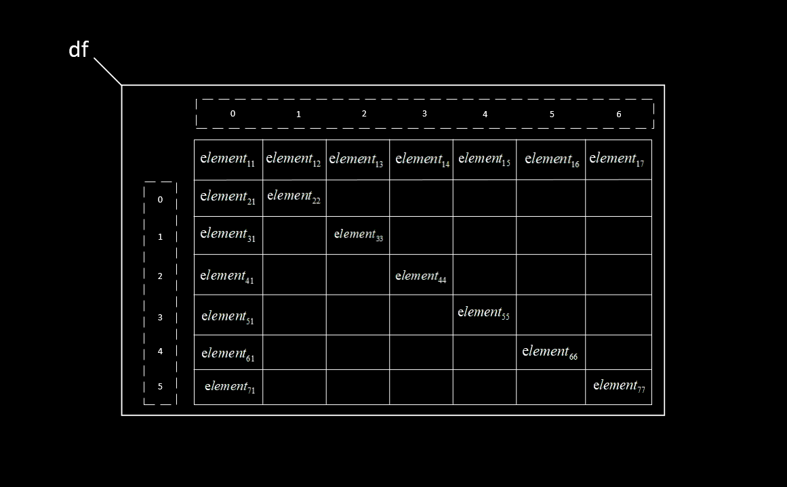

# Pandas

pandas是基于numpy的一种工具，该工具是为了解决数据分析任务而创建。

pandas纳入了大量库和一些标准的数据模型，提供了高效地操作大型数据集所需的工具
   pandas提供了大量能使我们快捷便捷处理数据的函数和方法，数据结构是series:一维数组，与numpy的一维数组array类似。二者与python基本的数据结构list也很相近
   其区别是list中的元素可以是不同的数据类型，而array和series中则只允许存储相同的数据类型，这样可以更加有效的使用内存，提高运算效率

### Numpy 和Pandas

**Numpy更适合处理统一的数值数组数据**

**Pandas则专门处理表格和混杂数据**

### 数据结构

Pandas的两个主要数据结构：Series和DataFrame

### Series

Series是⼀种类似于**⼀维数组的对象**，它由⼀组数据（各种NumPy数据类型）以及⼀组与之相
关的数据标签（即索引）组成

```
# 把pandas重命名为pd
import pandas as pd

obj = pd.Series([4, 7, -5, 3])
print(obj)
print('+++++++++++++++++')
# 打印obj的值
print(obj.values)
print('+++++++++++++++++')
# 打印obj的索引范围
print(obj.index)
print('+++++++++++++++++')
# 每个Series对象都有一个name属性，初始为‘None’空
print(obj.name)
# 给obj这个Series对象name属性赋值为'attrs'
obj.name = 'attrs'
print(obj.name)
print('+++++++++++++++++')
print(obj)

结果
0    4
1    7
2   -5
3    3
# 自动添加打印类型
dtype: int64
+++++++++++++++++
[ 4  7 -5  3]
+++++++++++++++++
RangeIndex(start=0, stop=4, step=1)
+++++++++++++++++
None
attrs
+++++++++++++++++
0    4
1    7
2   -5
3    3
# 再次打印obj，就自动添加了name属性
Name: attrs, dtype: int64
```

##### 自建索引

```
import pandas as pd

obj = pd.Series([4, 7, -5, 3])
# 自建索引序列
obj.index = ['d', 'b', 'a', 'c']
print(obj)
print('+++++++++++++++++')
# 打印对应‘a’序列的值
print(obj['a'])
print('+++++++++++++++++')
print(obj.index)

结果：
d    4
b    7
a   -5
c    3
dtype: int64
+++++++++++++++++
-5
+++++++++++++++++
Index(['d', 'b', 'a', 'c'], dtype='object')
```

##### 索引使用

```
import pandas as pd

obj = pd.Series([4, 7, -5, 3])
obj.index = ['d', 'b', 'a', 'c']

# 将索引‘d’对应的值修改为6
obj['d'] = 6
# 添加索引‘e’值为9
obj['e'] = 9

# 只打印索引'a', 'd', 'e'的值，注意这里面是两个[]
print(obj[['a', 'd', 'e']])
print('+++++++++++++++++')
# 打印值是否大于0，True和False
print(obj > 0)
print('+++++++++++++++++')
# 只打印大于0的索引和值
print(obj[obj > 0])
print('+++++++++++++++++')
# 打印索引和乘以2的值
print(obj*2)
print('+++++++++++++++++')
# 判断‘e’是否在obj
print('e' in obj)
# 判断‘f’是否在obj
print('f' in obj)

结果：
a   -5
d    6
e    9
dtype: int64
+++++++++++++++++
d     True
b     True
a    False
c     True
e     True
dtype: bool
+++++++++++++++++
d    6
b    7
c    3
e    9
dtype: int64
+++++++++++++++++
d    12
b    14
a   -10
c     6
e    18
dtype: int64
+++++++++++++++++
True
False
```

##### 字典创建Series

```
import pandas as pd

sdata = {'Ohio': 35000, 'Texas': 71000, 'Oregon': 16000, 'Utah': 5000}
# 用sdata字典创建Series
obj3 = pd.Series(sdata)
print(obj3)
print('+++++++++++++++++')

# obj4中重新赋予序列
# 'California'为新加入的序列，值为‘NaN’空
states = ['California', 'Ohio', 'Oregon', 'Texas']
obj4 = pd.Series(sdata, index=states)
print(obj4)
print('+++++++++++++++++')

# 将共有序列的值相加，其他序列的值为‘NaN’
print(obj3+obj4)
print('+++++++++++++++++')

# isnull函数可⽤于检测缺失数据，notnull值结果相反
obj5 = pd.isnull(obj4)
print(obj5)

结果：
Ohio      35000
Texas     71000
Oregon    16000
Utah       5000
dtype: int64
+++++++++++++++++
# NaN（即“⾮数字”（not a number），在pandas中，它⽤于表示缺失或NA值）
California        NaN
Ohio          35000.0
Oregon        16000.0
Texas         71000.0
dtype: float64
+++++++++++++++++
California         NaN
Ohio           70000.0
Oregon         32000.0
Texas         142000.0
Utah               NaN
dtype: float64
+++++++++++++++++
California     True
Ohio          False
Oregon        False
Texas         False
dtype: bool
```

### DataFrame

DataFrame是⼀个**表格型的数据结构**，它含有⼀组有序的列，每列可以是不同的值类型（数
值、字符串、布尔值等），DataFrame既有行索引也有列索引。

建立DataFrame, 传⼊⼀个由**等长**列表或NumPy数组组成的字典

```
import pandas as pd

data = {'state': ['Ohio', 'Ohio', 'Ohio', 'Nevada', 'Nevada', 'Nevada'],
        'year': [2000, 2001, 2002, 2001, 2002, 2003],
        'pop': [1.5, 1.7, 3.6, 2.4, 2.9, 3.2]}
frame = pd.DataFrame(data)
print(frame)
print('++++++++++++++++++++')

# 指定打印列的序列
frame1 = pd.DataFrame(data, columns=['year', 'state', 'pop'])
print(frame1)
print('++++++++++++++++++++')

# 新加入debt列（初始值为NaN），自建索引
frame2 = pd.DataFrame(data, columns=['year', 'state', 'pop', 'debt'],
                            index=['one', 'two', 'three', 'four', 'five', 'six'])
print(frame2)
print('++++++++++++++++++++')

# 打印指定year列
print(frame2.year)
print('++++++++++++++++++++')

# 打印指定索引‘one’行，注意前面是.loc
print(frame2.loc['one'])

结果：
    state  year  pop
0    Ohio  2000  1.5
1    Ohio  2001  1.7
2    Ohio  2002  3.6
3  Nevada  2001  2.4
4  Nevada  2002  2.9
5  Nevada  2003  3.2
++++++++++++++++++++
   year   state  pop
0  2000    Ohio  1.5
1  2001    Ohio  1.7
2  2002    Ohio  3.6
3  2001  Nevada  2.4
4  2002  Nevada  2.9
5  2003  Nevada  3.2
++++++++++++++++++++
       year   state  pop debt
one    2000    Ohio  1.5  NaN
two    2001    Ohio  1.7  NaN
three  2002    Ohio  3.6  NaN
four   2001  Nevada  2.4  NaN
five   2002  Nevada  2.9  NaN
six    2003  Nevada  3.2  NaN
++++++++++++++++++++
one      2000
two      2001
three    2002
four     2001
five     2002
six      2003
Name: year, dtype: int64
++++++++++++++++++++
year     2000
state    Ohio
pop       1.5
debt      NaN
Name: one, dtype: object
```

## Excel表格

### 一、读取Excel文件

  使用pandas的**read_excel()**方法，可通过文件路径直接读取。注意到，在一个excel文件中有多个sheet，因此，对excel文件的读取实际上是读取指定文件、并同时指定sheet下的数据。可以一次读取一个sheet，也可以一次读取多个sheet，同时读取多个sheet时后续操作可能不够方便，因此建议一次性只读取一个sheet。

  当只读取一个sheet时，返回的是DataFrame类型，这是一种表格数据类型，它清晰地展示出了数据的表格型结构。具体写法为：

(1)不指定sheet参数，默认读取第一个sheet，
 df=pd.read_excel("data_test.xlsx")
(2)指定sheet名称读取，
 df=pd.read_excel("data_test.xlsx",sheet_name="test1")
(3)指定sheet索引号读取，
 df=pd.read_excel("data_test.xlsx",sheet_name=0) #sheet索引号从0开始

> *同时读取多个sheet，以字典形式返回。（不推荐）
> (1)指定多个sheet名称读取， df=pd.read_excel("data_test.xlsx",sheet_name=["test1","test2"])
> (2)指定多个sheet索引号读取，
> df=pd.read_excel("data_test.xlsx",sheet_name=[0,1])
> (3)混合指定sheet名称和sheet索引号读取，
> df=pd.read_excel("data_test.xlsx",sheet_name=[0,"test2"])

### 二、DataFrame对象的结构

  对内容的读取分有表头和无表头两种方式，默认情形下是有表头的方式，即将第一行元素自动置为表头标签，其余内容为数据；当在read_excel()方法中加上header=None参数时是不加表头的方式，即从第一行起，全部内容为数据。读取到的Excel数据均构造成并返回DataFrame表格类型(以下以df表示)。

  对有表头的方式，读取时将自动地将第一行元素置为表头向量，同时为除表头外的各行内容加入行索引（从0开始）、各列内容加入列索引（从0开始）。如图所示



对无表头的方式，读取时将自动地为各行内容加入行索引（从0开始）、为各列内容加入列索引（从0开始），行索引从第一行开始。如图所示


### 三、用values方式获取数据

**1.基本方法**
df.values，获取全部数据，返回类型为ndarray（二维）；
df.index.values，获取行索引向量，返回类型为ndarray（一维）；
df.columns.values，获取列索引向量（对有表头的方式，是表头标签向量），返回类型为ndarray（一维）。

  根据具体需要，通过ndarray的使用规则获取指定数据。数据获取的结构示意图如下所示。

有表头


无表头


**2.获取指定数据的写法**
(1)获取全部数据：
df.values，获取全部数据，返回类型为ndarray（二维）。

(2)获取某个值：
df.values[i , j]，第i行第j列的值，返回类型依内容而定。

(3)获取某一行：
df.values[i]，第i行数据，返回类型为ndarray（一维）。

(4)获取多行：
df.values[[i1 , i2 , i3]]，第i1、i2、i3行数据，返回类型为ndarray（二维）。

(5)获取某一列：
df.values[: , j]，第j列数据，返回类型为ndarray（一维）。

(6)获取多列：
df.values[:,[j1,j2,j3]]，第j1、j2、j3列数据，返回类型为ndarray（二维）。

(7)获取切片：
df.values[i1:i2 , j1:j2]，返回行号[i1,i2)、列号[j1,j2)左闭右开区间内的数据，返回类型为ndarray（二维）。

**3.示例**
带表头，excel内容为


Python脚本为

```python
import pandas as pd

df = pd.read_excel("data_test.xlsx")

print("\n(1)全部数据：")
print(df.values)

print("\n(2)第2行第3列的值：")
print(df.values[1,2])

print("\n(3)第3行数据：")
print(df.values[2])

print("\n(4)获取第2、3行数据：")
print(df.values[[1,2]])

print("\n(5)第2列数据：")
print(df.values[:,1])

print("\n(6)第2、3列数据：")
print(df.values[:,[1,2]])

print("\n(7)第2至4行、第3至5列数据：")
print(df.values[1:4,2:5])
```

执行结果


### 四、用loc和iloc方式获取数据

**1.基本写法**
  loc和iloc方法是通过索引定位的方式获取数据的，写法为loc[A, B]和iloc[A, B]。其中A表示对行的索引，B表示对列的索引，B可缺省。A、B可为列表或i1:i2（切片）的形式，表示多行或多列。

  这两个方法的区别是，loc将参数当作标签处理，iloc将参数当作索引号处理。也就是说，在有表头的方式中，当列索引使用str标签时，只可用loc，当列索引使用索引号时，只可用iloc；在无表头的方式中，索引向量也是标签向量，loc和iloc均可使用；在切片中，loc是闭区间，iloc是半开区间。

获取指定数据的写法：
(1)获取全部数据：
df.loc[: , :].values
或
df.iloc[: , :].values，返回类型为ndarray（二维）。

(2)获取某个值：
无表头
df.loc[i, j]
或
df.iloc[i, j]，第i行第j列的值，返回类型依内容而定。

有表头
df.loc[i, "序号"]，第i行‘序号’列的值。
或
df.iloc[i, j]，第i行第j列的值。

(3)获取某一行：
df.loc[i].values
或
df.iloc[i].values，第i行数据，返回类型为ndarray（一维）。

(4)获取多行：
df.loc[[i1, i2, i3]].values，
或
df.iloc[[i1, i2, i3]].values，第i1、i2、i3行数据，返回类型为ndarray（二维）。

(5)获取某一列：
无表头
df.loc[:, j].values
或
df.iloc[:, j].values，第j列数据，返回类型为ndarray（一维）。

有表头
df.loc[:,"姓名"].values，‘姓名’列数据，返回类型为ndarray（一维）。
或
df.iloc[:, j].values，第j列数据，返回类型为ndarray（一维）。

(6)获取多列：
无表头
df.loc[:, [j1 , j2]].values
或
df.iloc[:, [j1 , j2]].values，第j1、j2列数据，返回类型为ndarray（二维）。

有表头
df.loc[:, ["姓名","性别"]].values，‘姓名’、‘性别’列数据，返回类型为ndarray（二维）；
df.iloc[:, [j1 , j2]].values，第j1、j2列数据，返回类型为ndarray（二维）。

(7)获取切片：
无表头
df.loc[i1:i2, j1:j2].values，返回行号[i1,i2]、列号[j1,j2]闭区间内的数据，返回类型为ndarray（二维）；
df.iloc[i1:i2, j1:j2].values，返回行号[i1,i2)、列号[j1,j2)左闭右开区间内的数据，返回类型为ndarray（二维）。

有表头
df.loc[i1:i2, "序号":"姓名"].values，返回行号[i1,i2]、列号["序号","姓名"]闭区间的数据，返回类型为ndarray（二维）；
df.iloc[i1:i2, j1:j2].values，返回行号[i1,i2)、列号[j1,j2)左闭右开区间内的数据，返回类型为ndarray（二维）。

```python
import pandas as pd

df = pd.read_excel("data_test.xlsx")

print("\n(1)全部数据：")
print(df.iloc[:,:].values)

print("\n(2)第2行第3列的值：")
print(df.iloc[1,2])

print("\n(3)第3行数据：")
print(df.iloc[2].values)

print("\n(4)第2列数据：")
print(df.iloc[:,1].values)

print("\n(5)第6行的姓名：")
print(df.loc[5,"姓名"])

print("\n(6)第2至3行、第3至4列数据：")
print(df.iloc[1:3,2:4].values)
```


