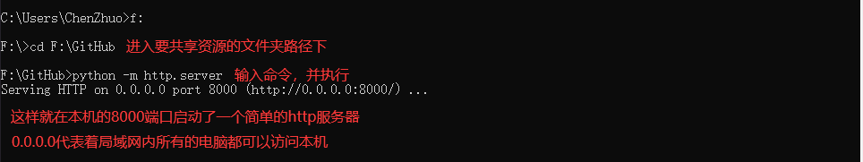
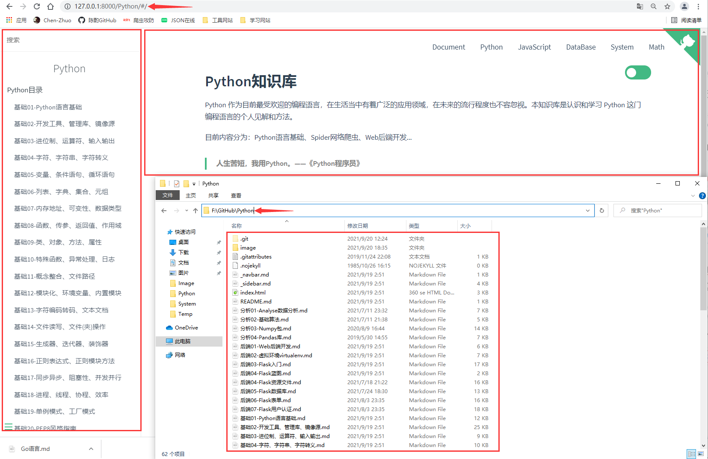
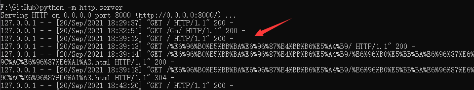

# Func实用功能

## 章节简介

现在我们已经完成了Python语言基础的学习，并且初步掌握了Python语法，当然我这里写的也只是浅显的东西，当中还有许多地方可以深挖，后续再补充嘛。

掌握了语言的基础语法，对于我们现在这章节来说已经够用了。Python除了不能写前端，其他方面基本都可以做，所以Python也被称为胶水语言，本章节主要是使用Python语言结合它丰富的生态和数量庞大的第三方库来完成一些我们平常学习或生活中比较实用的功能。

## 简单的资源共享

下面就介绍Python当中一个比较实用的功能，不需要使用到其他的第三方库，**只需要一条命令就可以实现局域网内的计算机资源共享，类似于Windows上的共享文件夹。**

```
# 打开命令行，切换到共享的文件夹
文件夹所在盘符:\
cd 文件夹所在盘符:\绝对路径

# 输入下面命令，启动一个简单的http服务器
python -m http.server
```



现在我们通过浏览器访问 `127.0.0.1:8000` 去访问本机的8000端口，可以看到页面上的内容和浏览器上的内容一模一样：


点击进入“Go”文件夹，里面的内容也是如实展示：


**点浏览器中的文件，就会将该资源下载到我们本地的电脑上，可以说是一个很实用的局域网资源分享功能了。**


**如果说文件夹内有html文件或者已经搭建好了前端框架，点击进入文件夹或html文件就不会进行下载，而是网页内容展示了。**



**除此之外，外界的每一次访问请求都会显示在我们这边的服务端。**


