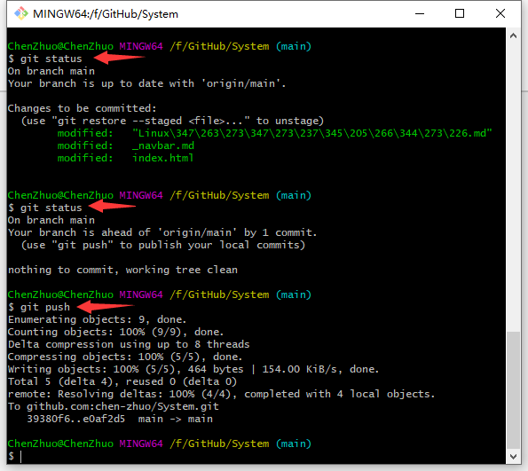
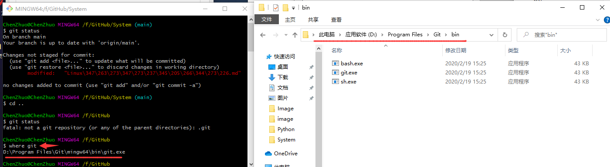
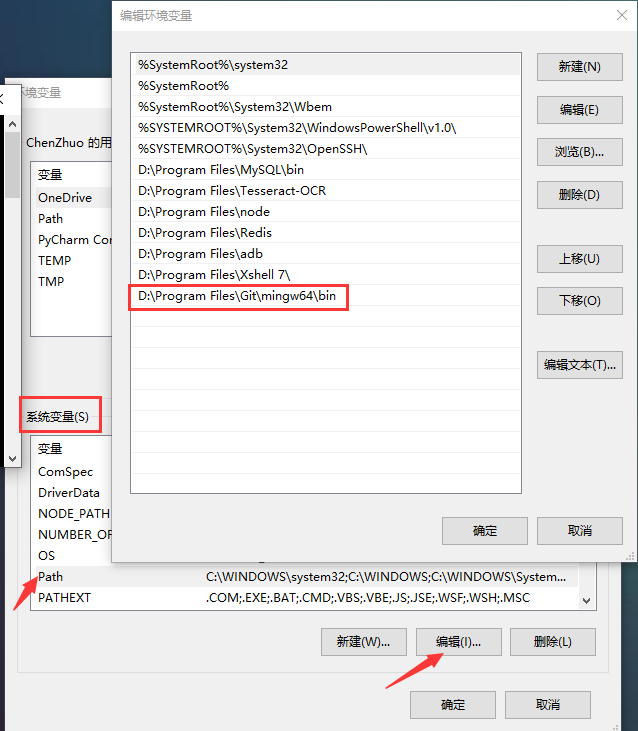

# Git自动提交

## 个人需求

对于我本人来说，因为长期维护多个项目的文档更新，每次提交更新时都会操作Git进入到每一个项目文件夹中执行相同的Git命令，显得十分繁琐且效率底低下，就像下面这样：



为此我们完全可以开发一个自动更新的项目内容并提交更新的Python脚本。

?> 至于什么是Git，参看《Document》中的《Git版本控制》。

## GitPython

### GitPython简介

GitPython是一个与Git库交互的Python库，包括底层命令（Plumbing）与高层命令（Porcelain）。它可以实现绝大部分的Git读写操作，避免了频繁与Shell交互的畸形代码。它并非是一个纯粹的Python实现，而是有一部分依赖于直接执行`git`命令，另一部分依赖于GitDB。

GitDB也是一个Python库。它为`.git/objects`建立了一个[数据库](https://cloud.tencent.com/solution/database?from=10680)模型，可以实现直接的读写。由于采用流式（stream）读写，所以运行高效、内存占用低。

### GitPython安装

执行下面命令安装GitPython：

```
pip install GitPython
```

其依赖GitDB会自动安装，不过可执行的`git`命令需要额外安装。

### 设置环境变量

**第三方库安装好了以后，就需要添加环境变量，否则第三方库会因找不到Git执行文件而报错。**

1.在git当中输入 `where git` 查找到git执行文件的位置或者直接找到git的安装路径：



2.将路径复制并粘贴到系统环境变量中的Path当中（注意：路径不要带有 `git.exe`）:



### 常见使用

安装的三方库名称GitPython，但导入的名称是git：

```python
import git

# 获取版本库对象（即项目文件夹中的.git文件夹）
repo = git.Repo(r'绝对路径\.git')
```

克隆 `clone` 分两种：

```python
# 一是从当前库clone到另一个位置
new_repo = repo.clone(path='../new')

# 二是从某个URL那里clone到本地某个位置：
new_repo = git.Repo.clone_from(url='git@github.com:USER/REPO.git', to_path='../new')
```

进行分支管理：

```python
# 新建分支
repo.create_head('new_branch')

# 查看当前分支
repo.active_branch
```

GitPython并未实现原版 `git status`，只给出了部分信息：

```python
# 当前工作区是否干净，如果有修改返回True，反之返回False
repo.is_dirty()
```

一般我们在工作目录做了改变之后，就会调用 `git add` 命令添加文件到暂存区，然后调用 `git commit` 命令提交更改，`Repo` 虽然没有添加、提交方法，但取而代之提供了一个 `git.cmd.Git` 对象实现对 Git 命令的调用，
通过 `Repo.git` 来进行 Git 命令操作。

```python
# git操作对象
git = repo.git
# 查看提交状态
print(git.status())
# 提交当前项目中所有改动到暂存区，相当于git add .
git.add('.')

# 获取版本库暂存区
index = repo.index
# 将改动内容从暂存区提交到历史区，类似于git commit -m 'update'
index.commit('update')

# 获取远程仓库
remote = repo.remote()
# 推送本地修改到远程仓库
remote.push()
```

## 功能代码

结合以上需求和第三方库的学习，我们就可以写一个自动更新并提交的Python脚本：

```python
#!/usr/bin/env python
# -*- coding:utf-8 -*-
# @Time    : 2021/6/13 1:35
# @Author  : chenzhuo
# @Desc    : Github和Cloud日常更新
import os
import git


class Github(object):
    disk = 'F:/GitHub'
    route = {
        'chen-zhuo.github.io': '',
        'Document': ['Markdown语法', 'LaTeX排版', 'GitHub平台', 'Git版本控制', 'Docsify工具'],
        'Python': ['基础', '图表','功能', '后端', '爬虫'],
        'System': ['DOS批处理', 'Linux系统'],
        'JavaScript': ['JS基础', 'JS逆向'],
        'DataBase': ['MySQL', 'Redis'],
    }

    def index(self, library):
        '''
        GitHubPage页面
        '''
        content = '''<!DOCTYPE html>
<html lang="en">
<head>
  <meta charset="UTF-8">
  <!--网页名称-->
  <title>''' + library + '''</title>
  <!--网页小图标-->
  <link rel="icon" href="https://chen-zhuo.github.io/image/avatar.jpg">
  <meta http-equiv="X-UA-Compatible" content="IE=edge,chrome=1" />
  <meta name="description" content="Description">
  <meta name="viewport" content="width=device-width, user-scalable=no, initial-scale=1.0, maximum-scale=1.0, minimum-scale=1.0">
  <!--vue主题样式-->
  <link rel="stylesheet" href="//unpkg.com/docsify/lib/themes/vue.css">
  <!--夜晚模式样式-->
  <link rel="stylesheet" href="//cdn.jsdelivr.net/npm/docsify-dark-mode@0.6.1/dist/style.css"/>
  <!--数学符号样式-->
  <link rel="stylesheet" href="//cdn.jsdelivr.net/npm/katex@latest/dist/katex.min.css"/>
</head>
<body>
  <!--等待加载的显示内容-->
  <div id="app">加载中...</div>
  <script>
    window.$docsify = {
      <!--边侧栏标题-->
      name: \'''' + library + '''\',
      <!--加载导航栏-->
      loadNavbar: true,
      <!--加载边侧栏-->
      loadSidebar:true,
      <!--内容标题等级-->
      subMaxLevel: 6,
      <!--Corner 挂件-->
      repo: 'https://github.com/chen-zhuo',
      <!--夜晚模式-->
      darkMode: {
        light: {
          toggleBtnBg: '#42b983'
        }
      },
      <!--定义搜索框-->
      search: {
      placeholder: '搜索', //搜索框默认显示的内容
      noData: '没有结果！', //没有查询结果的显示内容
      }
    }
  </script>
  <!--基础框架-->
  <script src="//unpkg.com/docsify/lib/docsify.min.js"></script>
  <!--夜晚模式插件-->
  <script src="https://cdn.jsdelivr.net/npm/docsify-dark-mode@0.6.1/dist/index.js"></script>
  <!--搜索框插件-->
  <script src="//unpkg.com/docsify/lib/plugins/search.js"></script>
  <!--表情符解析-->
  <script src="//cdn.jsdelivr.net/npm/docsify/lib/plugins/emoji.min.js"></script>
  <!--python代码高亮-->
  <script src="//unpkg.com/prismjs/components/prism-python.js"></script>
  <!--go代码高亮-->
  <script src="//unpkg.com/prismjs/components/prism-go.js"></script>
  <!--c代码高亮-->
  <script src="//unpkg.com/prismjs/components/prism-c.js"></script>
  <!--java代码高亮-->
  <script src="//unpkg.com/prismjs/components/prism-java.js"></script>
  <!--javascript代码高亮-->
  <script src="//unpkg.com/prismjs/components/prism-javascript.js"></script>
  <!--sql语句高亮-->
  <script src="//unpkg.com/prismjs/components/prism-sql.js"></script>
  <!--katex数学公式渲染库-->
  <script src="//cdn.jsdelivr.net/npm/docsify-katex@latest/dist/docsify-katex.js"></script>
</body>
</html>'''
        with open(f'{self.disk}/{library}/index.html', 'r', encoding='utf-8') as read:
            read_content = read.read()

        if read_content != content:
            print(f'《{library}》框架结构内容不一致开始写入...')
            with open(f'{self.disk}/{library}/index.html', 'w', encoding='utf-8') as f:
                f.write(content)
            print(f'《{library}》框架结构内容不一致写入完成')
        else:
            print(f'《{library}》框架结构内容一致无需写入')

    def navbar(self, library):
        '''
        GitHub顶侧栏
        '''
        content = '''* [Home](https://chen-zhuo.github.io/)
* [Document](https://chen-zhuo.github.io/Document/)
* [Python](https://chen-zhuo.github.io/Python/)
* [JavaScript](https://chen-zhuo.github.io/JavaScript/)
* [DataBase](https://chen-zhuo.github.io/DataBase/)
* [System](https://chen-zhuo.github.io/System/)'''
        with open(f'{self.disk}/{library}/_navbar.md', 'r', encoding='utf-8') as read:
            read_content = read.read()

        if read_content != content:
            print(f'《{library}》上顶侧栏内容不一致开始写入...')
            with open(f'{self.disk}/{library}/_navbar.md', 'w', encoding='utf-8') as f:
                f.write(content)
            print(f'《{library}》上顶侧栏内容不一致写入完成')
        else:
            print(f'《{library}》上顶侧栏内容一致无需写入')

    def sidebar(self, library):
        '''
        GitHub边侧栏
        '''
        a = os.listdir(f'{self.disk}/{library}')
        content = f'- {library}目录\n'
        for file_type in self.route[library]:
            file_list = [c for c in a if c.startswith(file_type)]
            for name in file_list:
                content += f'  - [{name.replace(".md", "")}]({name})\n'

        with open(f'{self.disk}/{library}/_sidebar.md', 'r', encoding='utf-8') as read:
            read_content = read.read()

        if read_content != content:
            print(f'《{library}》左边侧栏内容不一致开始写入...')
            with open(f'{self.disk}/{library}/_sidebar.md', 'w', encoding='utf-8') as f:
                f.write(content)
            print(f'《{library}》左边侧栏内容不一致写入完成')
        else:
            print(f'《{library}》左边侧栏内容一致无需写入')


    def push_all(self):
        '''
         更新并提交每个仓库
        '''
        for library in self.route:
            if library != 'chen-zhuo.github.io':
                self.sidebar(library)
                self.navbar(library)
                self.index(library)
            repo = git.Repo(path=f'{self.disk}/{library}/.git')
            if repo.is_dirty():
                print(f'《{library}》文件内容不一致开始提交...')
                start_operation = repo.git
                start_operation.add('.')
                mid_operation = repo.index
                mid_operation.commit('update')
                end_operation = repo.remote()
                end_operation.push()
                print(f'《{library}》文件内容不一致提交完成')
            else:
                print(f'《{library}》库没有修改')

    def pull_all(self):
        '''
         更新并提交每个仓库
        '''
        for library in self.route:
            print(f'《{library}》开始拉取...')
            repo = git.Repo(path=f'{self.disk}/{library}/.git')
            operation = repo.remote()
            operation.pull()
            print(f'《{library}》拉取结束')


if __name__ == '__main__':
    run = Github()
    # 拉取所有库
    run.pull_all()
    # 提交所有库
    run.push_all()
```

