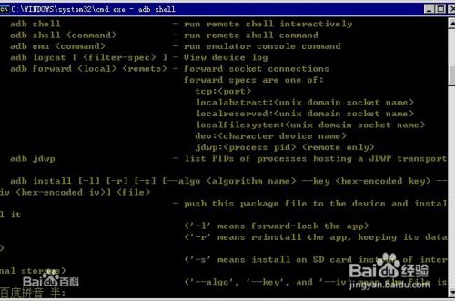
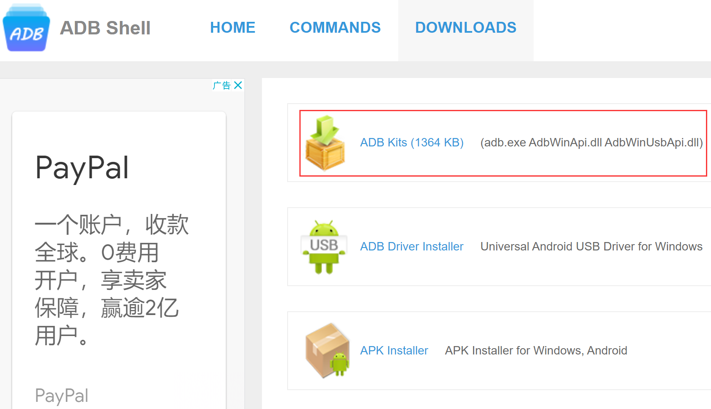
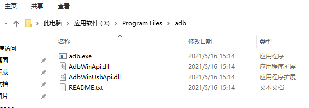
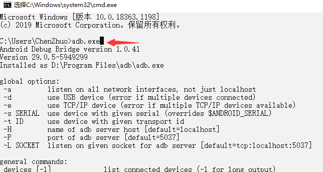
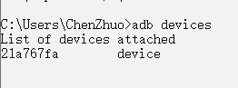
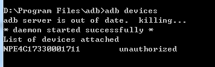
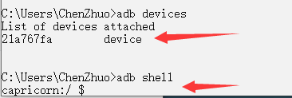
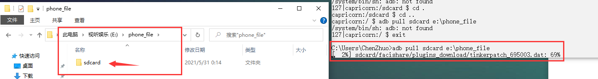
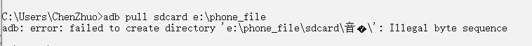

# Android移动端

## adb工具

### 工具说明

adb工具即Android Debug Bridge（安卓调试桥） tools。它就是一个命令行窗口，运行在5037端口，用于通过电脑端与模拟器或者真实设备交互。




使用场景：比如说你的手机不能开机了，手机又不能装sd卡，这种情况下你在其他模式连接手机，通过adb命令把rom推送到手机内存（手机内置存储），然后卡刷就可以了，如果没有adb命令的话根本无法操作手机导入rom，因为手机进不了系统更何况不能装sd卡。

### Android权限设置

连接手机使用adb工具就要开放手机上的一些权限，操作流程如下（仅限小米手机）：

  1.将手机通过USB数据线连接到电脑

  2.开启手机开发者模式（设置——我的设备——全部参数——MIUI版本（点击5次））

  3.开启USB调试（设置——系统和设备——更多设置——开发者选项——USB调试打开）

  4.开启安全设置（设置——系统和设备——更多设置——开发者选项——USB调试（安全设置）打开）

### 下载安装

官网下载地址：https://adbshell.com/downloads



下载好以后，解压到指定路径下面：



将解压路径配置到system-path环境变量里面：


在命令行里面就可以使用adb驱动了：



### adb常用命令

```
adb start-server：启动adb服务

adb remount：adb挂载

adb devices：显示连接设备

adb shell：进入手机系统

adb push sdcard 电脑路径：从电脑上传送文件到手机sdcard中

adb pull sdcard 电脑路径：从手机sdcard中传送文件到电脑上

adb shell rm sdcard/...：删除手机中文件
adb shell rm -f sdcard/...：强制删除手机中文件不需要确认
adb shell rm -r sdcard/...：递归删除手机中文件夹内文件

adb kill-server：关闭adb服务

adb shell screencap -p /mnt/sdcard/screencap.png：屏幕截图为screencap.pn文件，存放在手机中的/mnt/sdcard路径下

adb pull /mnt/sdcard/screencap.png {} >> {}/jump.out".format(tempfile.gettempdir() + "/screenshot.png", tempfile.gettempdir())：将手机中的screencap.png文件下载到电脑的临时文件夹下，文件名称仍然为screenshot.png（tempfile需要导入）

adb shell input swipe 0 0 0 0 100：在屏幕坐标(0,0)处按压100ms

adb shell input swipe 100 200 500 600 900：900ms内从屏幕坐标(100,200)滑动到(500,600)坐标处
```

### 可能报错

使用adb命令过程中可能会遇到如下错误：

使用 `adb devices` 连接设备成功界面，如下图：



如果出现 `adb devices unauthorized` 则是连接失败：



这个问题主要是调试授权没有成功（未授权状态）；一般出现这个问题时，打开你的手机，就会看到连接后弹出授权提示，需要你点击同意的密钥授权连接；没有的话，关掉usb连接，重新连接，开发者模式，usb调试打开，同意授权提示，最后重启adb服务进行查看。

## Android移动端操作

既然adb是一个命令行窗口的调试工具，那么我们就可以通过Python程序来执行adb命令，进而操作Android移动端的设备。

### 查看连接设备

```python
import os
print(os.popen('adb devices').read())

'''
输出：
List of devices attached
21a767fa   device
设备编号	连接状态
'''
```

### 执行shell命令

**shell 是 linux 系统的字符交互界面，android 设备底层是 linux 系统**。 进入 android 设备的 shell ，需要将手机练到电脑上，执行 `adb devices` 可以看到 device 状态，然后执行 `adb shell` 就进入 shell 了。



同样的也可以通过Python程序来执行shell命令：

```python
import os

# 相当于执行adb shell命令，进入shell交互界面，又执行了ls命令查看文件夹
dir = os.popen('adb shell "ls"').read().split('\n')
print(dir)

'''
输出：
ls: ./vndservice_contexts: Permission denied
ls: ./verity_key: Permission denied
ls: ./ueventd.rc: Permission denied
...
['acct', 'bt_firmware', 'bugreports', 'cache', 'charger', 'config', 'cust', 'd', 'data', 'dev', 'dsp', 'etc', 'firmware', 'mnt', 'nonplat_file_contexts', 'nonplat_property_contexts', 'nonplat_seapp_contexts', 'nonplat_service_contexts', 'oem', 'persist', 'plat_file_contexts', 'plat_property_contexts', 'plat_seapp_contexts', 'plat_service_contexts', 'proc', 'res', 'root', 'sbin', 'sdcard', 'sepolicy', 'storage', 'sys', 'system', 'tombstones', 'vendor', '']
解释：这里输出了手机中所有的文件夹，其中手机的绝大部分文件存储在sdcard(sd卡)文件夹中
'''
```

### 拷贝手机文件

使用 `adb pull` 命令我们还可以将手机文件传送到电脑上。



其中，[ 2%]代表已传输的进度，最后的69%代表传输当前单个文件的进度。



**但有一个遗憾，就是adb不支持传输文件名称中包含有中文的文件，会将中文判定为非法字符。**主要是编码的原因，中文在Windows中使用的GBK编码，而adb使用的是UTF-8编码。解决办法就是改掉中文名称或者打包英文名称的压缩文件。

```python
import os

path = os.popen(f'adb pull sdcard E:\phone_file').read()
print(path)
```

### 游戏辅助代码

使用adb还不仅仅局限于上面的文件的传输拷贝，还可以写一些游戏的辅助型代码，下面的代码是针对《棍子英雄》的辅助性代码，可以叫外挂。

```python
import os
import tempfile
import time
from PIL import Image

# BACKGROUND_POS = (40, 500)

SCREENSHOT_PATH = tempfile.gettempdir() + "/screenshot.png"

# 利用adb工具截图并保存
def screenshot():
    os.system("adb shell screencap -p /mnt/sdcard/screencap.png")
    os.system("adb pull /mnt/sdcard/screencap.png {} >> {}/jump.out".format(SCREENSHOT_PATH, tempfile.gettempdir()))

# 裁剪图片有效区域
left = 260
top = 1000
right = 1080
bottom = 1620
def crop():
    im = Image.open(SCREENSHOT_PATH)
    # screenshot.crop((left, top, right, bottom))
    im = im.crop((left, top, right, bottom))
    im.save('image.png')
    return im

# 遍历图片像素点
def get_gap(image):
    for i in range(0, image.size[0] - 1):
        for j in range(0, image.size[1]-1):
            if not is_pixel_equal(image, i, j):
                left = i
                return left

# 判断两个像素是否相同
def is_pixel_equal(image, x, y):
    """
    :param image1: 图⽚1
    :param image2: 图⽚2
    :param x: 位置x
    :param y: 位置y
    :return: 像素是否相同
    """
    # 取两个像素点
    pixel1 = image.load()[x, y]
    pixel2 = image.load()[x, y+1]
    threshold = 80
    # ⽐较像素点的RGB值,本⽂设置的差值在80以内,可以根据情况调整
    if abs(pixel1[0] - pixel2[0]) < threshold and abs(pixel1[1] - pixel2[1]) < threshold and abs(
            pixel1[2] - pixel2[2]) < threshold:
        return True
    else:
        return False

# 计算时间
def distance2time(distance):
    if distance <=100:
        DISTANCE_TO_TIME_RATIO = 2.50
        return int(distance * DISTANCE_TO_TIME_RATIO)
    if distance <=200:
        DISTANCE_TO_TIME_RATIO = 1.70
        return int(distance * DISTANCE_TO_TIME_RATIO)
    if distance <=300:
        DISTANCE_TO_TIME_RATIO = 1.35
        return int(distance * DISTANCE_TO_TIME_RATIO)
    if distance <=400:
        DISTANCE_TO_TIME_RATIO = 1.28
        return int(distance * DISTANCE_TO_TIME_RATIO)
    if distance <=500:
        DISTANCE_TO_TIME_RATIO = 1.25
        return int(distance * DISTANCE_TO_TIME_RATIO)
    if distance <=600:
        DISTANCE_TO_TIME_RATIO = 1.15
        return int(distance * DISTANCE_TO_TIME_RATIO)
    if distance <=700:
        DISTANCE_TO_TIME_RATIO = 1.10
        return int(distance * DISTANCE_TO_TIME_RATIO)
    
# 按压
def jump(touch_time):
        os.system("adb shell input swipe 0 0 0 0 {}".format(touch_time))

flag = True
while flag:
    screenshot()
    image = crop()
    distance = get_gap(image=image)
    print(f'距离{distance}')
    touch_time = distance2time(distance)
    print(f'按压时间{str(touch_time)}')
    if touch_time == 0:
        flag = False
    else:
        jump(touch_time)
        time.sleep(2)
```

