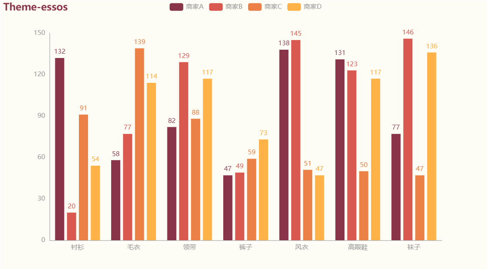

# Echarts图表

## 简介

### 概况

Echarts 是一个由百度开源的数据可视化，凭借着良好的交互性，精巧的图表设计，得到了众多开发者的认可。而 Python 是一门富有表达力的语言，很适合用于数据处理。当数据分析遇上数据可视化时，pyecharts 诞生了。

### 特性

- 简洁的 API 设计，使用如丝滑般流畅，支持链式调用
- 囊括了 30+ 种常见图表，应有尽有
- 支持主流 Notebook 环境，Jupyter Notebook 和 JupyterLab
- 可轻松集成至 Flask，Django 等主流 Web 框架
- 高度灵活的配置项，可轻松搭配出精美的图表
- 详细的文档和示例，帮助开发者更快的上手项目
- 多达 400+ 地图文件以及原生的百度地图，为地理数据可视化提供强有力的支持


## 快速上手

### 下载安装

#### pip 安装

```shell
$ pip(3) install pyecharts
```

#### 源码安装

```shell
$ git clone https://github.com/pyecharts/pyecharts.git
$ cd pyecharts
$ pip install -r requirements.txt
$ python setup.py install
# 或者执行 python install.py
```

### 第一个图表

```python
# 导入柱状图
from pyecharts.charts import Bar
# 在pyecharts一切配置皆在options中
from pyecharts import options

# 写法一：pyecharts常见写法
bar = Bar(init_opts=options.InitOpts(width="900px", height="500px"))
bar.add_xaxis(["衬衫", "羊毛衫", "雪纺衫", "裤子", "高跟鞋", "袜子"])
bar.add_yaxis("商家A", [5, 20, 36, 10, 75, 90])
bar.set_global_opts(title_opts=options.TitleOpts(title="主标题", subtitle="副标题"))

# 写法二：pyecharts所有方法均支持链式调用
bar = (
    Bar(init_opts={"width": "900px", "height": "500px"})
    .add_xaxis(["衬衫", "羊毛衫", "雪纺衫", "裤子", "高跟鞋", "袜子"])
    .add_yaxis("商家A", [5, 20, 36, 10, 75, 90])
    .set_global_opts(title_opts={"text": "主标题", "subtext": "副标题"})
)

# 默认在当前目录生成render.html文件，也可以传入路径参数，如bar.render("mycharts.html")
bar.render()
```

?> Note: 在使用 Pandas&Numpy 时，请确保将数值类型转换为 python 原生的 int/float。比如整数类型请确保为 int，而不是 numpy.int32


### 主题风格

pyecharts 内置提供了 10+ 种不同的风格，另外也提供了便捷的定制主题的方法。

```python
# 导入柱状图
from pyecharts.charts import Bar
# 导入主题
from pyecharts.globals import ThemeType

Bar(init_opts=opts.InitOpts(theme=ThemeType.WHITE)) # 默认主题，等价于Bar()
Bar(init_opts=opts.InitOpts(theme=ThemeType.LIGHT))
Bar(init_opts=opts.InitOpts(theme=ThemeType.DARK))
Bar(init_opts=opts.InitOpts(theme=ThemeType.CHALK))
Bar(init_opts=opts.InitOpts(theme=ThemeType.ESSOS))
Bar(init_opts=opts.InitOpts(theme=ThemeType.INFOGRAPHIC))
Bar(init_opts=opts.InitOpts(theme=ThemeType.MACARONS))
Bar(init_opts=opts.InitOpts(theme=ThemeType.PURPLE_PASSION))
Bar(init_opts=opts.InitOpts(theme=ThemeType.ROMA))
Bar(init_opts=opts.InitOpts(theme=ThemeType.ROMANTIC))
Bar(init_opts=opts.InitOpts(theme=ThemeType.SHINE))
Bar(init_opts=opts.InitOpts(theme=ThemeType.VINTAGE))
Bar(init_opts=opts.InitOpts(theme=ThemeType.WALDEN))
Bar(init_opts=opts.InitOpts(theme=ThemeType.WESTEROS))
Bar(init_opts=opts.InitOpts(theme=ThemeType.WONDERLAND))
```





### 图表案例

```python
#!/usr/bin/env python
# -*- coding: utf-8 -*-
# @Time    : 2021/11/5
# @Author  : chenzhuo
# @Desc    : 统计爬虫采集的数据量
import os
import time
import openpyxl
import datetime
import requests
import paramiko
from pyecharts.charts import Line
from pyecharts import options as opts
from pyecharts.globals import ThemeType


class Echarts(object):

    def __init__(self):
        self.route = 'E:\Desktop\资质安许历史'
        # 初始话
        self.qca_data = {}
        self.safe_data = {}
        self.company_data = {}
        # 处理后
        self.etl_qca_data = {}
        self.etl_safe_data = {}
        self.etl_company_data = {}
        # 工商数据接口
        self.link = 'http://47.103.21.215:8008/data_status'
        # 时间范围
        self.history_date = []
        # 215服务器
        self.linux_server = '47.103.21.215'

    def read_excel(self):
        '''
        读取所有资质安许excel表
        :return:
        '''
        # 读取最后30个文件
        file_list = os.listdir(self.route)[-40:]
        for file in file_list:
            # 表格日期
            excel_date = file.replace('资质安许.xlsx', '')
            # 导入字典
            self.qca_data.update({excel_date:{}})
            self.safe_data.update({excel_date:{}})
            # 读取excel表格
            wb = openpyxl.load_workbook(self.route+'\\'+file)
            # 选定需要读取的工作薄
            ws = wb['Sheet1']
            # 字段
            filed = '资质'
            # ws.max_row最大行，ws.max_column最大列
            for row in range(3, ws.max_row + 1):
                if ws.cell(row=row, column=1).value == '安许':
                    filed = '安许'
                    continue
                area = ws.cell(row=row, column=2).value[:2]
                if filed == '资质':
                    self.qca_data.get(excel_date).update(
                        {
                            area:
                                {
                                    'qca_area_level':ws.cell(row=row, column=1).value,
                                    'qca_count': ws.cell(row=row, column=3).value,
                                    'qca_update_time': str(ws.cell(row=row, column=4).value)[5:10],
                                }
                        }
                    )
                else:
                    self.safe_data.get(excel_date).update(
                        {
                            area:
                                {
                                    'safe_area_level': ws.cell(row=row, column=1).value,
                                    'safe_count': ws.cell(row=row, column=3).value,
                                    'safe_update_time': str(ws.cell(row=row, column=4).value)[5:10],
                                }
                        }
                    )

    def get_company_data(self):
        '''
        获取工商数据
        :return:
        '''
        response = requests.get(self.link).json()
        data = response.get("data").get("CompanyData")
        for item in data:
            mouth = data.get(item).get('version')[4:6]
            day = data.get(item).get('version')[6:]
            date = mouth + '-' +day
            count = data.get(item).get('data_num')
            self.company_data.update(
                {date: count}
            )

    def row_date(self, num):
        '''
        时间范围和地区初始空列表
        :return:
        '''
        now_dt = datetime.datetime.now()
        for day in range(-num+1, 1):
            history_date = now_dt + datetime.timedelta(days=day)
            self.history_date.append(str(history_date)[5:10])

        self.etl_qca_data = {'江苏':[None]*num, '四川':[None]*num, '广西':[None]*num, '湖北':[None]*num,
                            '湖南':[None]*num, '河南':[None]*num, '云南':[None]*num, '广东':[None]*num, '浙江':[None]*num,
                            '重庆':[None]*num, '安徽':[None]*num, '山东':[None]*num}
        self.etl_safe_data = {'江苏':[None]*num, '四川':[None]*num, '广西':[None]*num, '湖北':[None]*num,
                          '湖南':[None]*num, '河南':[None]*num,'云南':[None]*num, '广东':[None]*num, '浙江':[None]*num,
                          '重庆':[None]*num, '安徽':[None]*num, '山东':[None]*num}
        self.etl_company_data = {'工商':[None]*num}

    def etl_data(self):
        '''
        数据处理成图表数据
        :return:
        '''
        # 遍历资质数据
        for qca_name in self.qca_data:
            for area in self.etl_qca_data:
                try:
                    qca_count = self.qca_data.get(qca_name).get(area).get('qca_count')
                    qca_update_time = self.qca_data.get(qca_name).get(area).get('qca_update_time')
                    if qca_update_time in self.history_date:
                        index = self.history_date.index(qca_update_time)
                        self.etl_qca_data.get(area)[index] = qca_count
                except:
                    print(f'{qca_name},{area}资质数据为空')
        # 遍历安许数据
        for safe_name in self.safe_data:
            for area in self.etl_safe_data:
                try:
                    safe_count = self.safe_data.get(safe_name).get(area).get('safe_count')
                    safe_update_time = self.safe_data.get(safe_name).get(area).get('safe_update_time')
                    if safe_update_time in self.history_date:
                        index = self.history_date.index(safe_update_time)
                        self.etl_safe_data.get(area)[index] = safe_count
                except:
                    print(f'{safe_name},{area}安许数据为空')
        # 遍历工商数据
        for com_data in self.company_data:
            try:
                index = self.history_date.index(com_data)
                self.etl_company_data.get('工商')[index] = self.company_data.get(com_data)
            except:
                print(f'工商接口数据大于30天：{com_data}')

    def paint_chart(self, num):
        all_chart = {
            '资质': [self.etl_qca_data, 'zizhi_chart.html', '资质抓取数据（公司数量）'],
            '安许': [self.etl_safe_data, 'anxu_chart.html', '安许抓取数据（公司数量）'],
            '工商': [self.etl_company_data, 'gongshang_chart.html', '工商加载数据（加载数量）']
        }
        for chart_type in all_chart:
            # 图表类
            chart_line = Line(init_opts={'width': '1900px', 'height': '900px', 'theme': ThemeType.CHALK})
            # 资质图表
            chart_line.page_title = f'{chart_type}图表'
            # 横坐标日期
            chart_line.add_xaxis(self.history_date)
            # 纵坐标地区和数量
            etl_data = all_chart.get(chart_type)[0]
            for area in etl_data:
                chart_line.add_yaxis(area, etl_data.get(area), is_connect_nones=True, is_selected=False)
            chart_line.set_global_opts(
                title_opts=opts.TitleOpts(title=f"{all_chart.get(chart_type)[2]}", subtitle=f"时间范围{num}天"),
                toolbox_opts = opts.ToolboxOpts(is_show=True,
                pos_top="top",
                pos_left="right",
                feature={"saveAsImage": {},
                      "restore": {},
                      "magicType": {"show": True, "type": ["line", "bar"]},
                      "dataView": {}}))
            chart_line.render(f"chart/{all_chart.get(chart_type)[1]}")

    def update_chart(self):
        # 上传html文件
        windows_command = (
            'scp D:/chenzhuo/longna_distributed_reboot/test/chart/home_chart.html root@47.103.21.215:/home/py_saas/longna_saas_app/app/templates/admin/',
            'scp D:/chenzhuo/longna_distributed_reboot/test/chart/zizhi_chart.html root@47.103.21.215:/home/py_saas/longna_saas_app/app/templates/admin/',
            'scp D:/chenzhuo/longna_distributed_reboot/test/chart/anxu_chart.html root@47.103.21.215:/home/py_saas/longna_saas_app/app/templates/admin/',
            'scp D:/chenzhuo/longna_distributed_reboot/test/chart/gongshang_chart.html root@47.103.21.215:/home/py_saas/longna_saas_app/app/templates/admin/'
        )
        # 命令流重启flask服务
        linux_command = (
            # 进入flask会话
            "tmux a -t flask\n",
            # 暂停服务（作用等于Ctrl+C）
            "\x03\n",
            # 再启动flask服务
            "python /home/py_saas/longna_saas_app/manage.py\n"
        )
        try:
            # 上传文件
            for com in windows_command:
                print(os.system(com))  # 将结果赋值给变量
                time.sleep(3)
            # 重启服务
            ssh = paramiko.SSHClient()
            ssh.set_missing_host_key_policy(paramiko.AutoAddPolicy())
            ssh.connect(self.linux_server, port=22, username='root', key_filename='C:/Users/yy/.ssh/id_rsa')
            chan = ssh.invoke_shell()  # 新函数
            for com in linux_command:
                chan.send(com)
                # 暂停一段时间，等待命令响应
                time.sleep(5)
                res = chan.recv(20000)  # 非必须，接受返回消息
                print(res.decode())
            ssh.close()
        except Exception as e:
            print(e)

    def run(self):
        # 设置时间范围为30天
        self.date_length = 30
        # 获取表格数据
        chart.read_excel()
        # 获取工商数据
        chart.get_company_data()
        # 时间范围和地区初始空列表
        chart.row_date(self.date_length)
        # 处理成
        chart.etl_data()
        # 生成图表
        chart.paint_chart(self.date_length)
        # 更新图表
        chart.update_chart()
        print('所有图表已更新')

if __name__ == '__main__':
    chart = Echarts()
    chart.run()
```


