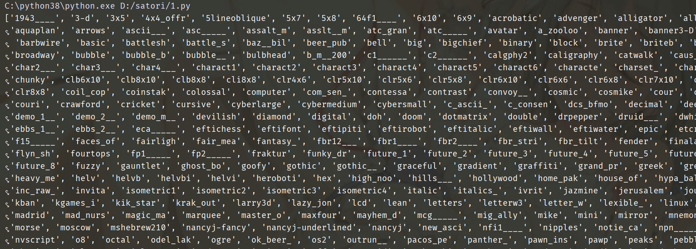

# 艺术字体

**pyfiglet 是一个专门用来生成艺术字的模块，只支持英文。**

```python
from pyfiglet import Figlet

f = Figlet()
print(f.renderText("hanser"))
"""
 _                               
| |__   __ _ _ __  ___  ___ _ __ 
| '_ \ / _` | '_ \/ __|/ _ \ '__|
| | | | (_| | | | \__ \  __/ |   
|_| |_|\__,_|_| |_|___/\___|_|   
                                 
"""
```

**支持的字体非常多，我们来随便指定一个吧。**

```python
from pyfiglet import Figlet

f = Figlet(font="slant")
print(f.renderText("hanser"))
"""
    __                              
   / /_  ____ _____  ________  _____
  / __ \/ __ `/ __ \/ ___/ _ \/ ___/
 / / / / /_/ / / / (__  )  __/ /    
/_/ /_/\__,_/_/ /_/____/\___/_/     
                                    
"""
```

**我们还可以指定宽度。**

```python
from pyfiglet import Figlet

# width默认是80
f = Figlet(font="slant", width=200)
print(f.renderText("hanser is a angel"))
"""
    __                                  _                                         __
   / /_  ____ _____  ________  _____   (_)____   ____ _   ____ _____  ____ ____  / /
  / __ \/ __ `/ __ \/ ___/ _ \/ ___/  / / ___/  / __ `/  / __ `/ __ \/ __ `/ _ \/ / 
 / / / / /_/ / / / (__  )  __/ /     / (__  )  / /_/ /  / /_/ / / / / /_/ /  __/ /  
/_/ /_/\__,_/_/ /_/____/\___/_/     /_/____/   \__,_/   \__,_/_/ /_/\__, /\___/_/   
                                                                   /____/               
"""

# 如果是用默认的width，会变成这样子
f = Figlet(font="slant")
print(f.renderText("hanser is a angel"))
"""
    __                                  _              
   / /_  ____ _____  ________  _____   (_)____   ____ _
  / __ \/ __ `/ __ \/ ___/ _ \/ ___/  / / ___/  / __ `/
 / / / / /_/ / / / (__  )  __/ /     / (__  )  / /_/ / 
/_/ /_/\__,_/_/ /_/____/\___/_/     /_/____/   \__,_/  
                                                       
                          __
  ____ _____  ____ ____  / /
 / __ `/ __ \/ __ `/ _ \/ / 
/ /_/ / / / / /_/ /  __/ /  
\__,_/_/ /_/\__, /\___/_/   
           /____/           

"""
```

**怎么样，是不是很酷呢？我们还可以指定字体，先看看都支持哪些字体吧。**

```python
from pyfiglet import FigletFont
print(FigletFont().getFonts())
```

