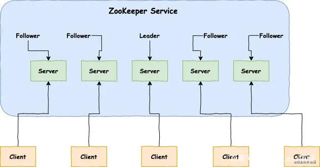
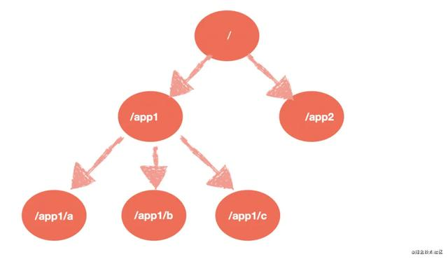
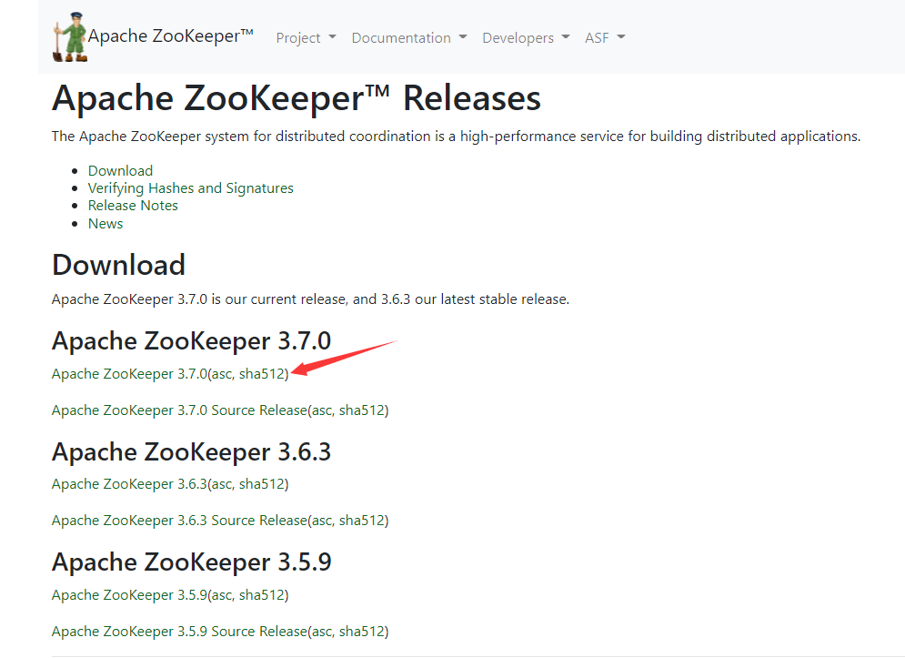
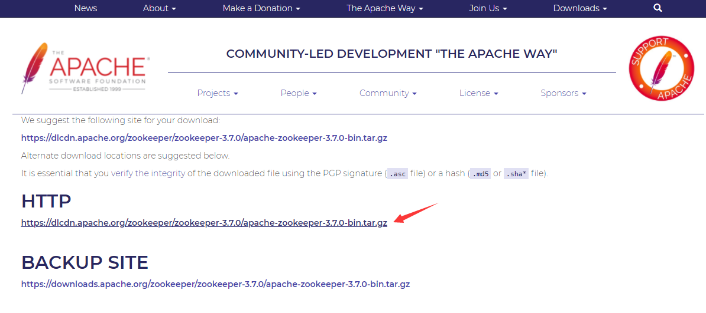
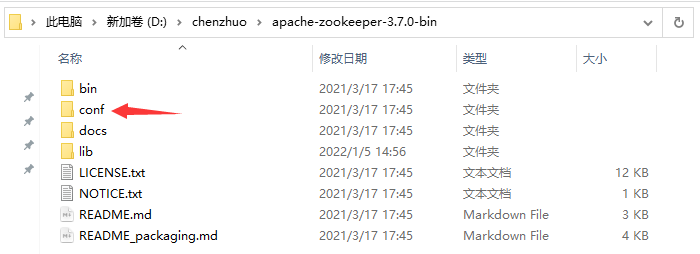
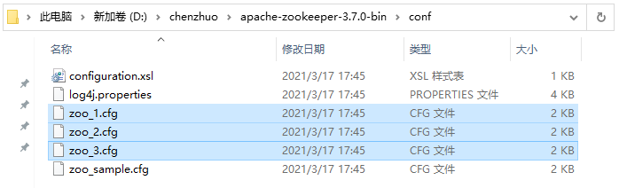
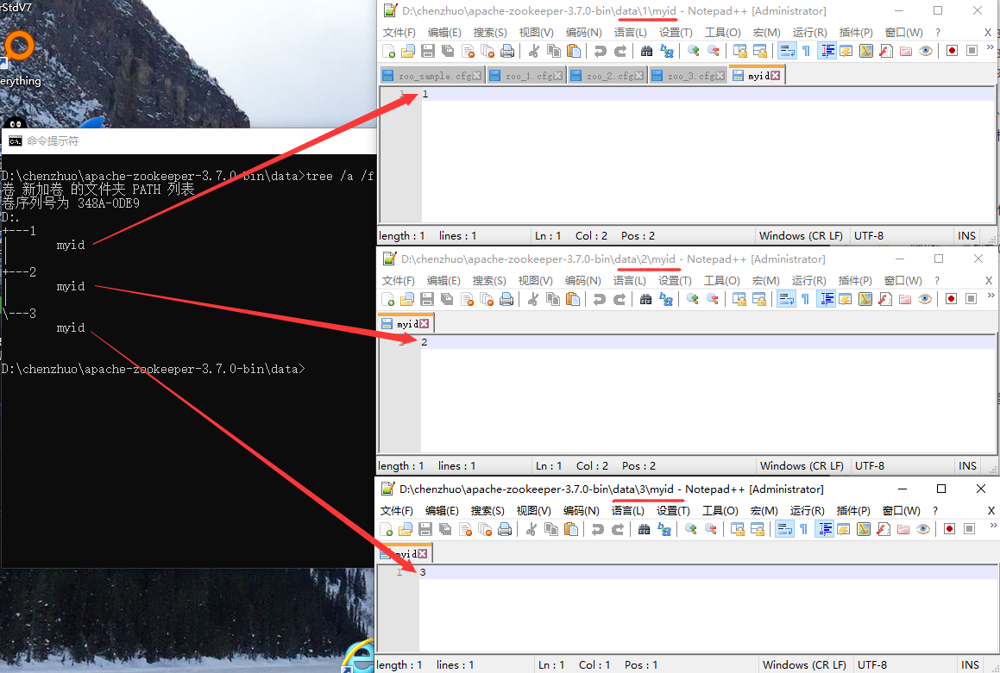
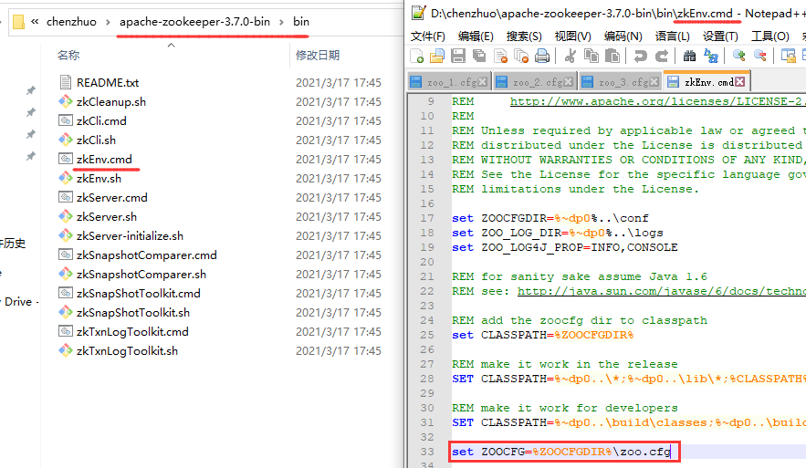
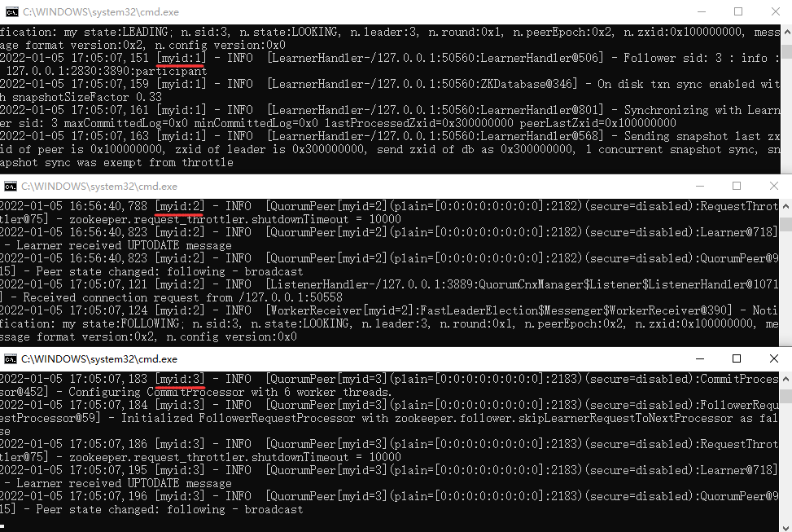
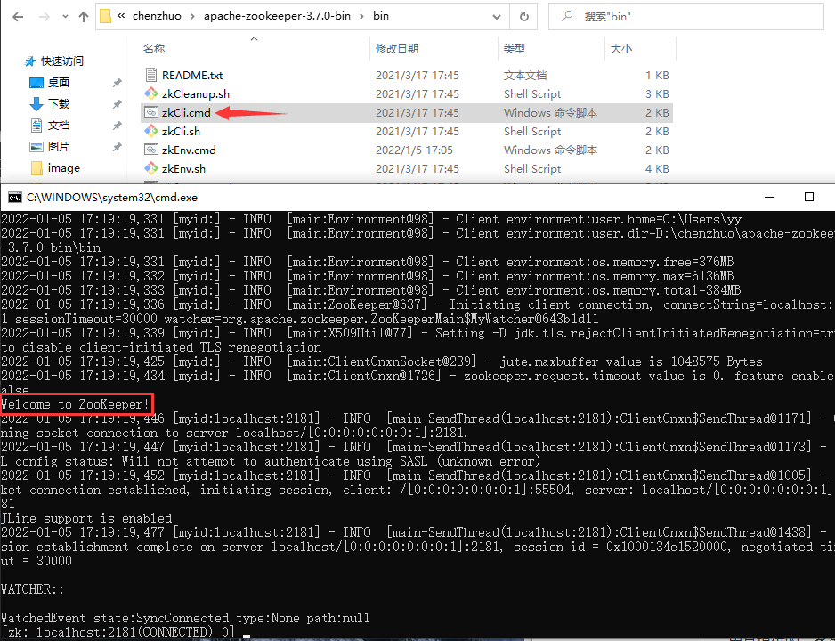

# Zookeeper分布式

## Zookeeper

### Zookeeper简介

ZooKeeper 是 Apache 的一个顶级项目，为分布式应用提供高效、高可用的分布式协调服务，提供了诸如数据发布/订阅、负载均衡、命名服务、分布式协调/通知和分布式锁等分布式基础服务。ZooKeeper的优点就是封装好复杂易出错的关键服务，将简单易用的接口和性能高效、功能稳定的系统提供给用户，由于其便捷的使用方式、卓越的性能和良好的稳定性，被广泛地应用于诸如 Hadoop、HBase、Kafka 和 Dubbo 等大型分布式系统中。

#### 运行模式

Zookeeper 有三种运行模式：单机模式、伪集群模式和集群模式。

**单机模式：**这种模式一般适用于开发测试环境，一方面我们没有那么多机器资源，另外就是平时的开发调试并不需要极好的稳定性。

**集群模式：**一个 ZooKeeper 集群通常由一组机器组成，一般 3 台以上就可以组成一个可用的 ZooKeeper 集群了。组成 ZooKeeper 集群的每台机器都会在内存中维护当前的服务器状态，并且每台机器之间都会互相保持通信。

**伪集群模式：**这是一种特殊的集群模式，即集群的所有服务器都部署在一台机器上。当你手头上有一台比较好的机器，如果作为单机模式进行部署，就会浪费资源，这种情况下，ZooKeeper 允许你在一台机器上通过启动不同的端口来启动多个 ZooKeeper 服务实例，以此来以集群的特性来对外服务。

#### 不同角色

在Zookeeper集群当中，不同的机器都有属于自己的角色。主要分为以下三种：

**领导者（leader）：**负责进行投票的发起和决议，更新系统状态。

**跟随者（follower）：**用于接收客户端请求并给客户端返回结果，在选主过程中进行投票。

**观察者（observer）：**可以接受客户端连接，将写请求转发给 leader，但是observer 不参加投票的过程，只是为了扩展系统，提高读取的速度。

这里需要拓展讲两点：

1. **领导者（leader）有且只能有一位，且必须有；跟随者（follower）、观察者（observer）可以有多位。**
2. **Zookeeper集群的服务数量必须奇数，如果是偶数，相互之间会争抢领导者（leader）位置。**



#### 节点模型

**Zookeeper下面被划分为一个个节点，即层次化的目录结构，命名符合常规文件系统规范，类似于 Linux。**特点如下：

1. 每个节点在 Zookeeper 中叫做 Znode，并且其有一个唯一的路径标识。
2. 节点 Znode 根据持续时间可以分为持久节点（PERSISTENT）、临时节点（EPHEMERAL）。
3. 持久节点一旦被创建，除非主动移除，不然一直会保存在 Zookeeper 中（不会因为创建该节点的客户端的会话失效而消失）。
4. 节点 Znode 可以包含数据和子节点，但临时节点（EPHEMERAL）不能有子节点。
5. 节点 Znode 中的数据可以有多个版本，比如某一个路径下存有多个数据版本，那么查询这个路径下的数据就需要带上版本。
6. 客户端应用可以在节点上设置监视器。
7. 节点不支持部分读写，而是一次性完整读写。



### 集群搭建

这里讲解如何搭建Zookeeper集群，为了方便演示，这里选择搭建伪集群模式，另外的模式搭建都大同小异。

#### 下载安装包

先准备安装包，这里我推荐在Apache官网下载（地址：https://zookeeper.apache.org/releases.html）。选择要安装的zookeeper版本：



点击进行下载：



#### 配置文件内容

讲安装包解压到自己指定的目录，进入zookeeper的conf目录：



打开 `zoo_sample.cfg` 文件，里面的配置内容有许多是 `#` 开头注释的省略不看，最终只有下面5行配置生效，其作用如下：

```
# 2000毫秒，这个时间是作为Zookeeper服务器之间或客户端与服务器之间维持心跳的时间间隔，也就是每个时间间隔就会发送一个心跳。
tickTime=2000
# 集群中的follower服务器(F)与leader服务器(L)之间初始连接时能容忍的最多心跳数（tickTime的数量）。
initLimit=10
# 集群中的follower服务器(F)与leader服务器(L)之间 请求和应答 之间能容忍的最多心跳数（tickTime的数量）。
syncLimit=5
# Zookeeper保存数据的默认目录，包括日志文件默认也保存在这个目录里。
dataDir=/tmp/zookeeper
# 连接Zookeeper服务器的端口，Zookeeper会监听这个端口接受客户端的访问请求。
clientPort=2181
```

将 `zoo_sample.cfg` 文件，复制三份，重命名为 `zoo_1.cfg`、`zoo_2.cfg`、`zoo_3.cfg` 文件：



将 `zoo_1.cfg` 文件内容添加修改如下：

```
tickTime=2000
initLimit=10
syncLimit=5
# 1号服务存放数据路径
dataDir=D:/chenzhuo/apache-zookeeper-3.7.0-bin/data/1
# 1号服务通信连接端口
clientPort=2181
# 服务列表(说明共有3个服务)
server.1=127.0.0.1:2888:3888
server.2=127.0.0.1:2889:3889
server.3=127.0.0.1:2830:3890
```

将 `zoo_2.cfg` 文件内容添加修改如下：

```
tickTime=2000
initLimit=10
syncLimit=5
# 2号服务存放数据路径
dataDir=D:/chenzhuo/apache-zookeeper-3.7.0-bin/data/2
# 2号服务通信连接端口
clientPort=2182
# 服务列表(说明共有3个服务)
server.1=127.0.0.1:2888:3888
server.2=127.0.0.1:2889:3889
server.3=127.0.0.1:2830:3890
```

将 `zoo_3.cfg` 文件内容添加修改如下：

```
tickTime=2000
initLimit=10
syncLimit=5
# 3号服务存放数据路径
dataDir=D:/chenzhuo/apache-zookeeper-3.7.0-bin/data/3
# 3号服务通信连接端口
clientPort=2183
# 服务列表(说明共有3个服务)
server.1=127.0.0.1:2888:3888
server.2=127.0.0.1:2889:3889
server.3=127.0.0.1:2830:3890
```

?> 因为搭建是伪集群模式，即一台机器开多个服务来模拟集群，因此每个服务的配置文件的数据存放路径和所占通信端口都不一样。如果是多台机器，则 `zoo.cfg` 配置文件内容是一样的。

#### 建立存放目录

根据存放数据的路径，新建data文件夹，在data里面新建名称为 `1` 、`2`、`3` 的文件夹：


分别在 `1` 、`2`、`3` 文件夹里面新建一个名称为 `myid` 文件，其内容分别为 `1` 、`2`、`3` ：



?> myid的号码必须一一对应配置内容中的“服务列表”，一个myid号码对应一个服务server后的编号。

!> 不管有多少机器或多少服务，每个服务的myid都是不一样的，一样的myid在集群内会产生冲突。

#### 启动集群

进入bin目录，用编辑文件打开 `zkEnv.cmd` 文件，当中有一行内容如下，这个就是读取服务配置文件的内容：

```
set ZOOCFG=%ZOOCFGDIR%\zoo.cfg
```



我们将 `zkEnv.cmd` 文件内容修改如下并保存，点击运行 `zkServer.cmd` 文件，启动第一个服务：

```
set ZOOCFG=%ZOOCFGDIR%\zoo_1.cfg
```


**需要注意的是，在上面的配置文件里面说明了共有3个服务，当启动第一个服务时会一直报错，因为运行服务不到整个服务数量的一半，当启动第二个服务后，第一个服务才不会报错。以此类推，如果共有9个服务，那么需要启动5个服务才不会报错。**

接下来，继续修改 `zkEnv.cmd` 文件内容修改如下并保存，点击运行 `zkServer.cmd` 文件，启动第二个服务：

```
set ZOOCFG=%ZOOCFGDIR%\zoo_2.cfg
```

接下来，继续修改 `zkEnv.cmd` 文件内容修改如下并保存，点击运行 `zkServer.cmd` 文件，启动第三个服务：

```
set ZOOCFG=%ZOOCFGDIR%\zoo_3.cfg
```

到此，一个zookeeper伪集群模式就搭建起来了，根据 `myid` 来从上到下分别是第一个、第二个、第三个服务：



#### 测试连接

双击运行 `zkCli.cmd` 测试与集群的连接，出现如图欢迎字样则连接成功！



### Zookeeper应用

ZooKeeper 是一个高可用的分布式数据管理与系统协调框架。基于对 Paxos 算法的实现，使该框架保证了分布式环境中数据的强一致性，也正是基于这样的特性，使得 ZooKeeper 解决很多分布式问题。

值得注意的是，ZooKeeper 并非天生就是为这些应用场景设计的，都是后来众多开发者根据其框架的特性，利用其提供的一系列 API 接口（或者称为原语集），摸索出来的典型使用方法。

#### 分布式队列

队列方面，简单来说有两种：一种是常规的先进先出队列，另一种是等队列的队员聚齐以后才按照顺序执行。对于第一种的队列和上面讲的分布式锁服务中控制时序的场景基本原理一致，这里就不赘述了。

第二种队列其实是在 FIFO 队列的基础上作了一个增强。通常可以在 /queue 这个 Znode 下预先建立一个 /queue/num 节点，并且赋值为 n（或者直接给 /queue 赋值 n）表示队列大小。之后每次有队列成员加入后，就判断下是否已经到达队列大小，决定是否可以开始执行了。

这种用法的典型场景是：分布式环境中，一个大任务 Task A，需要在很多子任务完成（或条件就绪）情况下才能进行。这个时候，凡是其中一个子任务完成（就绪），那么就去 /taskList 下建立自己的临时时序节点（CreateMode.EPHEMERAL_SEQUENTIAL）。当 /taskList 发现自己下面的子节点满足指定个数，就可以进行下一步按序进行处理了。

#### 分布式锁

分布式锁主要得益于 ZooKeeper 为我们保证了数据的强一致性。锁服务可以分为两类：一类是保持独占，另一类是控制时序。

所谓保持独占，就是所有试图来获取这个锁的客户端，最终只有一个可以成功获得这把锁。通常的做法是把 ZooKeeper 上的一个 Znode 看作是一把锁，通过 create znode的方式来实现。所有客户端都去创建 /distribute_lock 节点，最终成功创建的那个客户端也即拥有了这把锁。

控制时序，就是所有视图来获取这个锁的客户端，最终都是会被安排执行，只是有个全局时序了。做法和上面基本类似，只是这里 /distribute_lock 已经预先存在，客户端在它下面创建临时有序节点（这个可以通过节点的属性控制：CreateMode.EPHEMERAL_SEQUENTIAL 来指定）。ZooKeeper 的父节点（/distribute_lock）维持一份 sequence，保证子节点创建的时序性，从而也形成了每个客户端的全局时序。

1.由于同一节点下子节点名称不能相同，所以只要在某个节点下创建 Znode，创建成功即表明加锁成功。注册监听器监听此 Znode，只要删除此 Znode 就通知其他客户端来加锁。

2.创建临时顺序节点：在某个节点下创建节点，来一个请求则创建一个节点，由于是顺序的，所以序号最小的获得锁，当释放锁时，通知下一序号获得锁。

#### 负载均衡

这里说的负载均衡是指软负载均衡。在分布式环境中，为了保证高可用性，通常同一个应用或同一个服务的提供方都会部署多份，达到对等服务。而消费者就须要在这些对等的服务器中选择一个来执行相关的业务逻辑，其中比较典型的是消息中间件中的生产者，消费者负载均衡。

## kazoo库

**Kazoo使用纯Python实现Zookeeper协议，因此不需要安装任何额外的软件就可以直接连接Zookeeper。**

### 简单使用

#### 安装kazoo库

安装Kazoo也很简单，直接通过 `pip` 安装：

```
$ pip install kazoo
```

#### 创建连接

要开始使用 Kazoo，必须创建一个 `KazooClient` 对象并建立连接：

```python
from kazoo.client import KazooClient

zk = KazooClient(hosts='127.0.0.1:2181')
zk.start()
```

?> 默认情况下，客户端将通过默认端口(2181)连接到本地Zookeeper服务器。首先您应该确保Zookeeper在那里运行，否则start命令将一直等到其默认超时。

连接后，无论间歇性连接丢失或 Zookeeper 会话过期，客户端都将尝试保持连接。可以通过调用stop指示客户端断开连接：

```python
zk.stop()
```

#### 监听状态

**客户端的常见状态可以分为三种：丢失（LOST）、连接（CONNECTED）、暂停（SUSPENDED）。**可以通过查看 `state` 属性来确定：

```python
from kazoo.client import KazooClient

zk = KazooClient(hosts='127.0.0.1:2181')
zk.start()
print(zk.state)  # CONNECTED 注释：当前处于连接状态
# 注释：KazooClient首次创建实例，它是在LOST状态。建立连接后，它转换到 CONNECTED状态。
```

当客户端状态为SUSPENDED时，如果客户端正在执行需要与其他系统达成一致的操作（例如使用Lock），它就会暂停它正在执行的操作。重新建立连接后，客户端状态为CONNECTED时，客户端可以继续执行操作。

当客户端状态为LOST时，Zookeeper 将删除任何已创建的临时节点，这将会影响所有创建临时节点（例如使用Lock），当状态再次转换为CONNECTED后，需要重新获取锁。

常见的状态转换：

- **LOST -> CONNECTED**：新连接，或之前丢失的连接正在连接。
- **CONNECTED -> SUSPENDED**：与服务器的连接丢失发生在连接上。
- **CONNECTED -> LOST**：仅当在建立连接后提供无效的身份验证凭据时才会发生。
- **SUSPENDED -> LOST**：连接恢复到服务器，但由于会话过期而丢失。
- **SUSPENDED -> CONNECTED**：丢失的连接已恢复。

针对客户端状态，通过 `KazooState` 来进行判断可以写出如下状态监听器：

```python
from kazoo.client import KazooState

def my_listener(state):
    if state == KazooState.LOST:
        # Register somewhere that the session was lost
    elif state == KazooState.SUSPENDED:
        # Handle being disconnected from Zookeeper
    else:
        # Handle being connected/reconnected to Zookeeper

zk.add_listener(my_listener)
```

?> 在使用 `kazoo.recipe.lock.Lock` 或创建临时节点时，强烈建议添加状态侦听器，以便您的程序可以正确处理连接中断或 Zookeeper 会话丢失。

### 节点CRUD

Zookeeper 有用于创建、读取、更新和删除 Zookeeper 节点（这里称为 znodes 或节点）的功能。针对的，Kazoo 添加了几个方便的方法和一个更 Pythonic 的 API。

**首先需要明白的一点就是，节点是一个抽象的事物存在于会话当中，因此节点的路径也不是真实存在的。**

#### 创建节点

Kazoo创建节点的最常用两个方法：

`ensure_path()`： 递归创建节点和沿途所需路径中的任何节点，但不能为节点设置数据，只能设置 ACL。

`create()`： 创建一个节点，并可以在节点上设置数据以及一个 watch 函数。它要求它的路径首先存在，除非 `makepath` 选项设置为True。

```python
# 创建一个节点，前提是该路径存在
zk.ensure_path("/my/favorite")

# 创建一个带有数据的节点
zk.create("/my/favorite/node", b"a value")
```

?> 子节点可以被无限递归的创建。

#### 检查节点

Kazoo检查节点的最常用三个方法：

`exists()`：检查节点是否存在。

`get()`：获取节点的数据以及 `ZnodeStat` 结构中的详细节点信息。

`get_children()`：获取给定节点的子节点列表。

```python
# 判断节点
if zk.exists("/my/favorite"):
    # Do something

# 打印一个节点的版本和它的数据
data, stat = zk.get("/my/favorite")
print("Version: %s, data: %s" % (stat.version, data.decode("utf-8")))

# 列出子节点
children = zk.get_children("/my/favorite")
print("There are %s children with names %s" % (len(children), children))
```

#### 更新节点

`set()`：更新指定节点的数据，在更新数据之前需要匹配提供的节点版本，否则将引发`BadVersionError` 而不是更新。

```python
zk.set("/my/favorite", b"some data")
```

#### 删除节点

`delete()`：删除一个节点，也可以选择递归删除该节点的所有子节点。在删除节点之前需要匹配节点的版本，否则将引发 `BadVersionError` 而不是删除。

```python
zk.delete("/my/favorite/node", recursive=True)
```

### 重试连接

#### retry方法

如果 Zookeeper 服务器出现故障或无法访问，与 Zookeeper 的连接可能会中断。默认情况下，kazoo 不会重试命令，因此这些失败将导致引发异常。为了帮助解决失败，kazoo 附带了一个 `retry()` 助手，如果 Zookeeper 连接异常被触发，重试连接到Zookeeper。

```python
result = zk.retry(zk.get, "/path/to/node")
```

#### 重试函数

**某些命令可能具有独特的行为，不保证在每个命令的基础上自动重试。**例如，当使用临时和序列选项集创建一个节点，在命令成功返回之前可能会丢失连接，但该节点实际上已创建，再次运行时引发`kazoo.exceptions.NodeExistsError`。

由于 `retry()` 方法需要调用一个函数及其参数，因此可以将运行多个 Zookeeper 命令的函数传递给它，以便在连接丢失时重试整个函数。锁实现中的这个片段显示了它如何使用重试重新运行获取锁的函数，并检查它是否已经被创建来处理这种情况：

```python
# kazoo.recipe.lock snippet

def acquire(self):
    """获取互斥锁，阻塞直到它被获取""" 
    try:
        self.client.retry(self._inner_acquire)
        self.is_acquired = True
    except KazooException:
        # if we did ultimately fail, attempt to clean up
        self._best_effort_cleanup()
        self.cancelled = False
        raise

def _inner_acquire(self):
    self.wake_event.clear()

    # 确保我们指定的节点存在
    if not self.assured_path:
        self.client.ensure_path(self.path)

    node = None
    if self.create_tried:
        node = self._find_node()
    else:
        self.create_tried = True

    if not node:
        node = self.client.create(self.create_path, self.data,
            ephemeral=True, sequence=True)
        # 去除节点的路径
        node = node[len(self.path) + 1:]
```

#### 自定义重试

有时，您可能希望为与 `retry()` 方法不同的命令或命令集设置特定的重试策略 。您可以使用您喜欢的特定重试策略手动创建 `KazooRetry` 实例：

```python
from kazoo.retry import KazooRetry

kr = KazooRetry(max_tries=3, ignore_expire=False)
result = kr(client.get, "/some/path")
```

这将重试`client.get`命令最多 3 次，并在发生时引发会话过期。您还可以使用默认行为创建一个实例，在重试期间忽略会话过期。

### 观察者

**Kazoo 可以在节点上设置监视功能，该功能可以在更改或删除节点或其子节点更改时触发。**

Watchers 可以通过两种不同的方式设置：

**第一种是 Zookeeper 默认支持一次性 watch 事件样式。**这些 watch 函数会被 kazoo 调用一次，并且不接收 session 事件。使用此样式需要将 watch 函数传递给`get()`、`get_children()`、`exists()`方法之一，当节点上的数据发生变化或节点本身被删除时，将调用传递给该方法的 watch 函数。它将传递一个 `WatchedEvent`实例：

```python
def my_func(event):
    # 检查子节点现在情况
    pass

# 当子节点改变调用watch事件对应的my_func函数
children = zk.get_children("/my/favorite/node", watch=my_func)
```

**第二种是使用 Kazoo 包含的一个用于监视数据和子节点修改的 API。**在每次触发事件时它不需要重新设置监视，即使用此 API 注册的 Watch 函数将在每次发生更改时立即调用，或者直到函数返回 False。如果 `allow_session_lost` 设置为 `True`，则在会话丢失时将不再调用该函数。以下方法 `ChildrenWatch`、`DataWatch` 可直接在 `KazooClient` 实例上使用，并且在以这种方式使用时不需要传入客户端对象，通过实例可以直接调用，允许它们用作装饰器：

```python
@zk.ChildrenWatch("/my/favorite/node")
def watch_children(children):
    print("Children are now: %s" % children)
# Above function called immediately, and from then on

@zk.DataWatch("/my/favorite")
def watch_node(data, stat):
    print("Version: %s, data: %s" % (stat.version, data.decode("utf-8")))
```

### 命令流

**Zookeeper 3.4 及更高版本支持一次发送多个命令，这些命令将作为单个原子单元提交。他们要么全部成功，要么全部失败。事务的结果将是事务中每个命令的成功/失败结果列表。**

```python
# transaction()方法返回一个TransactionRequest实例
transaction = zk.transaction()
# 调用它的方法来排队完成事务中的命令
transaction.check('/node/a', version=3)
transaction.create('/node/b', b"a value")
# 当事务准备好发送时，调用它的commit()方法。
results = transaction.commit()
```

在上面的示例中，只要有一个命令不可用，就会失败报错。这可以用来检查特定版本的节点，节点 `/node/a` 版本必须是3，如果节点与它应该处于的版本不匹配，将不会创建 `/node/b` ，则该版本事务失败。

### 异步使用

所有异步 Kazoo API 依赖于异步方法返回的 `IAsyncResult` 对象。可以使用 `rawlink()` 方法添加回调，无论使用线程还是使用 gevent 等异步框架，该方法都可以兼容。

连接处理创建连接：

```python
from kazoo.client import KazooClient
from kazoo.handlers.gevent import SequentialGeventHandler

# 使用IHandler接口来抽象回调系统
zk = KazooClient(handler=SequentialGeventHandler())

# 立即返回
event = zk.start_async()

# 设置超时等待30秒
event.wait(timeout=30)

if not zk.connected:
    # 未连接，停止尝试连接
    zk.stop()
    raise Exception("Unable to connect.")
```

?> Kazoo 不依赖 gevents/eventlet 猴子补丁，并要求传入适当的处理程序，默认处理程序是 `SequentialThreadingHandler`。

除了 `start_async()` 之外的所有kazoo _async方法都返回一个 `IAsyncResult`实例。回调函数将传递 `IAsyncResult` 实例，并应调用其上的 `get()`方法以检索值。如果异步函数遇到错误，则此调用可能会导致引发异常。它应该被抓住并妥善处理。

例子：

```python
import sys
from kazoo.exceptions import ConnectionLossException
from kazoo.exceptions import NoAuthException

def my_callback(async_obj):
    try:
        children = async_obj.get()
        do_something(children)
    except (ConnectionLossException, NoAuthException):
        sys.exit(1)

# 这两个语句立即返回，第二个设置一个回调
# 当 get_children_async 有它的返回值
async_obj = zk.get_children_async("/some/node")
async_obj.rawlink(my_callback)
```

除了返回 `IAsyncResult`对象之外，以下 CRUD 方法的工作方式都与它们的同步对应方法相同。

- 创建方法：`create_async()`
- 检查方法：`exists_async()`、`get_async()`、`get_children_async()`
- 更新方法：`set_async()`
- 删除方法：`delete_async()`

!> 注意 `ensure_path()` 具有目前没有异步版本也不能使用 `delete_async()`方法来执行递归删除。

