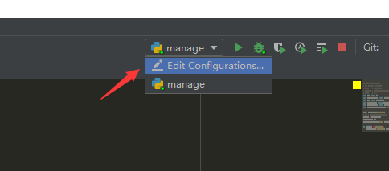

# 虚拟环境virtualenv

### 理解环境

##### Python环境

**Python环境：指运行Python程序的基础环境。**电脑上只要安装了Python，就有了一个能运行Python程序的基础环境，这个基础环境的名称一般为：**(base)**。

**通常我们所使用的pip或者conda命令下载的第三方库，全部都安装在了基础环境(base)当中。**


?> 详见：[基础01-Python简介、环境安装](基础01-Python简介、环境安装.md)

##### 开发场景

在实际项目开发中，我们通常会根据自己的需求去下载各种相应的框架库，但每个项目使用的框架库或框架库版本可能不一样。如下开发场景：

场景1：项目A需要某个框架1.0版本，项目B需要这个库的2.0版本。那么当你使用这两个项目时，你就需要来回的卸载安装了，这样很容易就给你的项目带来莫名的错误。

场景2：公司之前的项目需要python2.7环境下运行，而你接手的项目需要在python3环境中运行，使用python3则公司之前的项目可能无法运行，反之则新项目运行有麻烦。

**频繁更新或卸载操作这对我们的开发环境十分不友好，还可能给项目造成很多不必要的麻烦。**为了解决上述场景带来的不便，我们有必要学习如何创建和使用虚拟环境。

##### 虚拟环境

上述场景的主要问题在于，所有的项目都使用了同一个环境。解决起来也很简单，给每个项目单独搭建一个私有的环境。

**虚拟环境：针对特定的项目独立创建的一个虚拟化的私有Python环境。通俗的来讲，我们把这部分独立出来的东西称作“容器”，在这个容器中，我们可以只安装项目需要的依赖包，各个容器之间互相隔离，互不影响。**譬如，本次学习需要用到Django，我们可以做一个Django的虚拟环境，里面只需要安装Django相关包就可以了，需要Scrapy库，就再创建一个虚拟环境来安装Scrapy相关库就行了。

### virtualenv

##### 简介virtualenv

**virtualenv是专门用来维护多套为应用程序相互“隔离”的Python运行环境的工具。**借助 virtualenv 我们可以在一台主机上创建多套相互隔离的Python运行环境。


##### 安装virtualenv

打开命令行窗口，输入下面命令即可安装：

```
pip3 install virtualenv
```

检查是否安装成功：

```
virtualenv --version
```


?> 从版本20开始取消参数 `--no-site-packages`，默认不会将系统Python环境中第三方包复制到新建虚拟环境中。

### 搭建虚拟环境

##### 创建虚拟环境

在磁盘中选择一个路径或者新建文件夹用来存放虚拟环境，将命令行窗口的操作路径切换到该路径下：


输入下面命令来创建一个虚拟环境：

```
# 当前路径创建虚拟环境
virtualenv 环境名称

# 指定路径创建虚拟环境
virtualenv 路径\环境名称

# 指定python版本创建虚拟环境
virtualenv -p python路径 环境名称
```


这样就在当前路径下创建了一个干净的、没有多余安装包、名称为 `project_env` 的虚拟环境。

?> 为了方便管理，所有的项目环境最好都放一个路径下且环境命名通常含有 `env` 。

##### 激活环境

无论是在基础环境(base)的路径还是虚拟环境(project_env)的路径都会有一个Scripts文件夹，里面存放运行python的脚本程序，其中都包含有名为activate的文件。


我们在命令行中运行该命令：`activate`。**执行后可以发现命令行最前面出现了 `(环境名称)` 标识，说明该环境已经激活可以使用了。**


使用 `pip list` 查看基础环境(base)和虚拟环境(project_env)里面所安装的库。**可以发现虚拟环境(project_env)只安装有3个基础库是一个很干净的环境，而基础环境(base)里面则安装了很多的库。**


##### 退出环境

同样有激活环境的文件和命令，也就有退出环境的文件和命令：`deactivate`。**执行后命令行最前面没有了 `(环境名称)` 标识，说明已退出该环境。**


### 使用虚拟环境

##### 命令行使用

命令行中使用虚拟环境，在上面已讲过，执行命令：`activate`。**命令行最前面出现了 `(环境名称)` 标识，说明该环境已经激活可以使用了。**

##### Pycharm使用

在Pycharm的File—Settings—Project——点击‘齿轮’——Show All


展示已添加的环境（包括一个基础环境和多个虚拟环境）——点击 `+` 号——添加环境


选择下方 `Existing environment（已经存在的环境）`，因为我们上面已经创建了虚拟环境(project_env)，路径要特别指定虚拟环境 `project_env\Scripts\python.exe` 可执行文件，点击ok即可添加。


这里可以看到列表里面多了一个虚拟环境(project_env)：


在Project当中选择虚拟环境(project_env)，点击Apply即可应用新建的虚拟环境(project_env)：


我们还可以指定文件在特定的虚拟环境(project_env)中运行，点击Edit Configurations：



在Python interpreter中选择新建的虚拟环境(project_env)，点击Apply即可：


Pycharm下面的Terminal关闭后再次打开，可以看到该命令行默认是在虚拟环境(project_env)中运行了。


