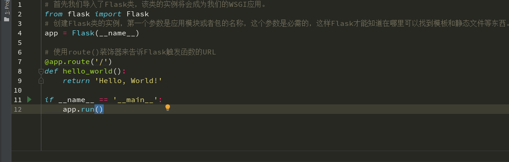

# Flask入门

### Flask简介


**Flask：一个基于Werkzeug WSGI工具箱和Jinja2模板引擎的轻量级Web应用框架。**

Flask也被称为“microframework”，因为它使用简单的核心，用extension增加其他功能，这也让框架相对比较灵活。核心思想是Flask只完成基本的功能，别的功能都是靠各种第三方插件来完成的，实现了模块高度化定制。

Flask的两个主要核心应用是Werkzeug和模板引擎Jinja，除此以外都是可以自由组装的。常用的Flask插件如下：

```
Flask-SQLalchemy：操作数据库;
Flask-migrate：管理迁移数据库;
Flask-Mail:邮件;
Flask-WTF：表单;
Flask-script：插入脚本;
Flask-Login：认证用户状态;
Flask-RESTful：开发REST API的工具;
Flask-Bootstrap：集成前端Twitter Bootstrap框架;
Flask-Moment：本地化日期和时间;
```

Flask优势劣势：

```
Flask优势：
1.项目结构和配置简单
2.组件可以自由拆装
3.小项目或临时性项目比较适用

Flask劣势：
1.高度自定义组件带来的就是组件之间的兼容性问题，严重不适合大型应用，例如蓝图(blueprint)机制跟Django的url配置比起来其实差得很远
```

### Flask安装

推荐使用最新版本的 Python 3 。 Flask 支持 Python 3.5 及更高版本的 Python 3 、 Python 2.7 和 PyPy 。

在配置好并且已激活的环境中，输入下面命令安装Flask：

```
pip install Flask
```


!> 注意：安装命令 `Flask` 中的F大写。

当安装 Flask 时，以下配套软件会被自动安装。

- [Werkzeug](https://palletsprojects.com/p/werkzeug/) 用于实现 WSGI ，应用和服务之间的标准 Python 接口。
- [Jinja](https://palletsprojects.com/p/jinja/) 用于渲染页面的模板语言。
- [MarkupSafe](https://palletsprojects.com/p/markupsafe/) 与 Jinja 共用，在渲染页面时用于避免不可信的输入，防止注入攻击。
- [ItsDangerous](https://palletsprojects.com/p/itsdangerous/) 保证数据完整性的安全标志数据，用于保护 Flask 的 session cookie.
- [Click](https://palletsprojects.com/p/click/) 是一个命令行应用的框架。用于提供 `flask` 命令，并允许添加自定义 管理命令。


### 快速上手

##### 最小应用

新建 `hello_flask.py` 或其他类似名称 `.py` 文件，**但不要用 `flask.py` 作为应用名称，这会与 Flask 本身发生冲突**。

一个最小的 Flask 应用如下：

```python
# 首先我们导入了Flask类，该类的实例将会成为我们的WSGI应用。
from flask import Flask
# 创建Flask类的实例，第一个参数是应用模块或者包的名称，这个参数是必需的，这样Flask才能知道在哪里可以找到模板和静态文件等东西。
app = Flask(__name__)

# 使用route()装饰器来告诉Flask触发函数的URL 
@app.route('/')
# 函数名用于生成相关联的URL，最后返回需要在用户浏览器中显示的信息。
def hello_world():
    return 'Hello, World!'

if __name__ == '__main__':
    # 执行Flask类中的run方法，运行Flask
    app.run()
```

运行后如下，在最后面已给出了服务运行的 `127.0.0.1` 地址和 `5000` 端口：



访问服务运行的地址和端口，显示 `Hello, World!` 说明服务已经成功运行。


每次访问的访问请求、时间等信息都会在运行界面上显示：


##### 开放访问端口

Flask服务默认是运行在 `127.0.0.1` 本机环回地址的 `5000` 端口上面，也就是说只能我们本机访问 `5000` 端口才能得到响应，而网络中的其他电脑却不行。

**开放我们的访问端口也很简单，在 `run()` 方法添加参数 `host='0.0.0.0'` 即可：**


**服务启动后，在信息输出`Running on all addresses`，说明在局域网内的户用都可以通过这个地址和端口来访问服务，本机用户可以通过环回地址和局域网地址来访问。**


**假如服务默认的 `5000` 端口被其他程序所占用，改用其他端口也很简单，在 `run()` 方法添加参数 `port=端口号` 即可：**


访问的端口也改到设置端口即可：


##### Debug调试模式

当服务启动以后，假如我们希望将修改代码后增加的功能展示在网页上，我们就需要重启服务运行修改后的代码，这样不是很方便。然而Flask提供了更好的方案：Debug调试模式。

**开启Debug调试模式也很简单，在 `run()` 方法添加参数 `debug=True` 即可：**


在信息输出`Debug mode: on` 和 `Debugger is active!`，说明Debug调试模式已经开启。

我们先去访问服务端口，响应正常，内容也正确：


现在我们修改返回的内容，**不重启服务，直接刷新网页，可以看到网页响应的内容也同步修改了**：


Debug调试模式可以让我们实时的看到Web项目上的改变。

!> 注意：虽然调试模式不能在分布环境下工作（这使得它基本不可能用于生产环境），但是它可以执行任意代码，这就是一个重大安全隐患。**因此，绝对不能在生产环境中使用调试模式 。**

