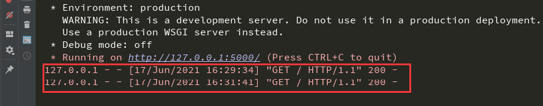

# Flask入门

### Flask简介

Flask官方文档：https://dormousehole.readthedocs.io/en/latest/index.html


**Flask：一个基于Werkzeug WSGI工具箱和Jinja2模板引擎的轻量级Web应用框架。**因为它使用简单的核心，用extension增加其他功能，这也让框架相对比较灵活。核心思想是Flask只完成基本的功能，别的功能都是靠各种第三方插件来完成的，实现了模块高度化定制。

**Flask的两个主要核心应用是Werkzeug和模板引擎Jinja，除此以外都是可以自由组装的。**常用的Flask插件如下：

```
Flask-SQLalchemy：操作数据库;
Flask-migrate：管理迁移数据库;
Flask-Mail:邮件;
Flask-WTF：表单;
Flask-script：插入脚本;
Flask-Login：认证用户状态;
Flask-RESTful：开发REST API的工具;
Flask-Bootstrap：集成前端Twitter Bootstrap框架;
Flask-Moment：本地化日期和时间;
```

Flask优势劣势：

```
Flask优势：
1.项目结构和配置简单
2.组件可以自由拆装
3.小项目或临时性项目比较适用

Flask劣势：
1.高度自定义组件带来的就是组件之间的兼容性问题，严重不适合大型应用，例如蓝图(blueprint)机制跟Django的url配置比起来其实差得很远
```

### Flask安装

推荐使用最新版本的 Python 3 。 Flask 支持 Python 3.5 及更高版本的 Python 3 、 Python 2.7 和 PyPy 。

在配置好并且已激活的环境中，输入下面命令安装Flask：

```
pip install Flask
```


!> 注意：安装命令 `Flask` 中的F大写。

当安装 Flask 时，以下配套软件会被自动安装。

- [Werkzeug](https://palletsprojects.com/p/werkzeug/) 用于实现 WSGI ，应用和服务之间的标准 Python 接口。
- [Jinja](https://palletsprojects.com/p/jinja/) 用于渲染页面的模板语言。
- [MarkupSafe](https://palletsprojects.com/p/markupsafe/) 与 Jinja 共用，在渲染页面时用于避免不可信的输入，防止注入攻击。
- [ItsDangerous](https://palletsprojects.com/p/itsdangerous/) 保证数据完整性的安全标志数据，用于保护 Flask 的 session cookie.
- [Click](https://palletsprojects.com/p/click/) 是一个命令行应用的框架。用于提供 `flask` 命令，并允许添加自定义管理命令。


### 项目结构

**Flask非常灵活，它没有一个固定的项目目录组织结构。**有经验的开发人员按照他们自己喜欢来组织项目的目录结构。但对于新手来说会感到困惑，如果没有指导，组织项目目录结构通常会很糟糕。我希望建立一个硬性的项目结构，无论这个结构的其他是否使用到他都有存在的必要性。**一个好的目录结构，对整个项目的影响是深远的，尤其是对维护开发人员，方便阅读修改。**

选这一个路径，运行下面代码，建立Flask项目目录组织结构：

```python
import os

def build_flask(route):
    # 建立项目文件夹
    project = route + '/flask_project'
    if not os.path.exists(project):
        os.mkdir(project)

    # 建立项目结构
    for item in ('/README.md', '/requirements.txt', '/manage.py', '/.gitignore', '/config.py', '/.env', '/.flaskenv'):
        if not os.path.exists(project + item):
            with open(project + item, 'w', encoding='utf-8') as f:
                if item == '/README.md':
                    f.write('# Flask项目\n本项目是以Flask框架为后端的项目。')
                elif item == '/.gitignore':
                    f.write('./logs/*\n./.env')

    # 建立文件夹
    for item in ('/log', '/app', '/migrations', '/venv'):
        if not os.path.exists(project + item):
            os.mkdir(project + item)

    # 建立app内文件夹
    app = project + '/app'
    for item in ('/static', '/templates', '/views', '/models', '/forms'):
        if not os.path.exists(app + item):
            os.mkdir(app + item)
            if item == '/static':
                for dir in ('/img', '/css', '/js'):
                    if not os.path.exists(app + item + dir):
                        os.mkdir(app + item + dir)
            if item == '/templates':
                for dir in ('/common', '/errors', '/func'):
                    if not os.path.exists(app + item + dir):
                        os.mkdir(app + item + dir)

    # 生成配置文件和扩展文件
    for file in ('/setting.py', '/extensions.py'):
        if not os.path.exists(app + file):
            with open(app + file, 'w', encoding='utf-8') as f:
                f.write('')

if __name__ == '__main__':
    route = r'存放Flask项目的路径'
    build_flask(route)
```

运行后，会得到如下项目结构：

```
flask_project
|   .env               # 存储敏感数据
|   .flaskenv          # 存储Flask命令行系统相关的公开环境变量
|   .gitignore         # git忽略文件列表
|   config.py          # flask配置文件
|   manage.py          # 项目启动控制文件
|   README.md          # 项目介绍文件
|   requirements.txt   # 依赖包的列表
|
+---app                # 整个程序的包目录
|   |   extensions.py  # 扩展文件
|   |   setting.py     # 项目信息配置文件
|   |
|   +---forms          # 存放表单文件夹
|   +---models         # 存放模型文件夹
|   +---static         # 存放静态资源文件夹
|   |   +---css        # 存放CSS文件
|   |   +---img        # 存放图片文件
|   |   \---js         # 存放js文件
|   +---templates      # 存放模板文件
|   |   +---common     # 通用页面模板
|   |   +---errors     # 错误页面模板
|   |   \---func       # 功能页面模板
|   \---views          # 视图
+---log                # 存放日志
+---migrations         # 数据库迁移
\---venv               # 存放环境
```

### 快速上手

##### 最小应用

首先在 `manage.py` 文件，写一个最小的 Flask 应用如下：

```python
# 首先我们导入了Flask类，该类的实例将会成为我们的WSGI应用。
from flask import Flask
# 创建Flask类的实例，第一个参数是应用模块或者包的名称，这个参数是必需的，这样Flask才能知道在哪里可以找到模板和静态文件等东西。
app = Flask(__name__)

# 使用route()装饰器来告诉Flask触发函数的URL 
@app.route('/')
# 函数名用于生成相关联的URL，最后返回需要在用户浏览器中显示的信息。
def hello_world():
    return 'Hello, World!'

if __name__ == '__main__':
    # 执行Flask类中的run方法，运行Flask
    app.run()
```


Flask 会使用内置的开发服务器来运行程序，这个服务器默认监听本地机的 5000 端口，也就是说，我们可以通过在地址栏输入 [http://127.0.0.1:5000](http://127.0.0.1:5000/) 或是 [http://localhost:5000](http://localhost:5000/) 访问程序：


访问服务运行的地址和端口，显示 `Hello, World!` 说明服务已经成功运行。


返回值作为响应的主体，默认会被浏览器作为 HTML 格式解析，所以我们可以添加一个 HTML 元素标记：

```python
def hello_world():
    return '<h1>Hello, World!</h1>'
```


每次访问的请求、时间等信息都会在运行界面上显示：



##### 开放访问

Flask服务默认是运行在 `127.0.0.1` 本机环回地址的 `5000` 端口上面，也就是说只能我们本机访问 `5000` 端口才能得到响应，而网络中的其他电脑却不行。

**开放访问端口也很简单，在 `run()` 方法添加参数 `host='0.0.0.0'` 即可：**


服务启动后，在信息输出 `Running on all addresses`，说明在局域网内的户用都可以通过这个地址和端口来访问服务：


本机用户可以通过环回地址和局域网地址来访问：


**假如服务默认的 `5000` 端口被其他程序所占用，改用其他端口也很简单，在 `run()` 方法添加参数 `port=端口号` 即可：**


启动服务后，就会显示可访问的端口号：


访问的端口也改到设置端口即可：


##### 开发环境

在前面，我们讲过Web环境分为两种：**当我们在开发Web项目时，使用开发环境；当Web项目在线上运行时，使用生产环境。**根据Flask输出 `Environment: production` 可知默认启动的是生产环境，切换成开发环境的流程也很简单，首先安装用来自动导入系统环境变量的 python-dotenv：

```
pip install python-dotenv
```
在 `.flaskenv` 文件里，我们写入一行 `FLASK_ENV=development` ，将环境变量 `FLASK_ENV` 的值设为 `development`：

```
# .flaskenv 文件
FLASK_ENV=development
```

现在我们运行，就可以看到 `Environment: development` 说明环境已经切换到了开发环境了，并且输出 `debug mode: on` 和 `debugger is active!`，说明debug调试已经开启：


除了上面还有一种开启debug调试的方式就是，**在 `run()` 方法添加参数 `debug=True` 即可**：


但这种调试模式启动的环境依然是 `Environment: production` 生产环境：


##### debug调试

**debug调试模式开启后，当程序出错，浏览器页面上会显示错误信息，并且当代码出现变动后，程序会自动重载。**

我们先去访问服务端口，响应正常，内容也正确：


现在我们修改返回的内容，**不重启服务，直接刷新网页，可以看到网页响应的内容也同步修改了**：


现在我们故意增加错误代码，并刷新页面，页面就会显示代码错误信息：


假如我们**关闭debug调试模式，重新运行服务，则会出现如下页面**：


通过上述比较可知，**debug调试模式可以让我们实时看到Web项目的加载情况并且尽量暴露项目当中的错误，也正因如此，在正式的生产环境中必须禁用debug调试模式。**

!> 注意：虽然调试模式不能在分布环境下工作（这使得它基本不可能用于生产环境），但是它可以执行任意代码，这就是一个重大安全隐患。**因此，绝对不能在生产环境中使用调试模式 。**

##### route路由

现代 Web 应使用有意义的 URL ，这样有助于用户记忆，更能得到用户的青睐。

**在Flask中使用 `route()` 装饰器来把函数绑定到 URL**:

```python
@app.route('/page')
def index():
    return 'first page!'
```


**一个视图函数也可以绑定多个 URL，这通过附加多个装饰器实现**：

```python
@app.route('/')
@app.route('/index')
@app.route('/home')
def hello():
    return 'Welcome to My Watchlist!'
```


你还可以通过把 URL 的一部分标记为 `<variable_name>` 在 URL 中添加变量，标记的部分会作为关键字参数传递给函数：

```python
@app.route('/accept/<args>')
def show_user_profile(args):
    return '接收的内容：%s' % args
'''
输出：
访问http://192.168.0.158:8000/accept_int/123456789    200 接收的内容123456789
'''
```


不仅如此，还可以选择性的加上一个转换器，限定变量接收规则：

|   类型   |                说明                 |
| :------: | :---------------------------------: |
| `string` | （缺省值） 接受任何不包含斜杠的文本 |
|  `int`   |             接受正整数              |
| `float`  |            接受正浮点数             |
| `pathh`  |   类似 `string` `，但可以包含斜杠   |
|  `uuid`  |           接受UUID字符串            |

```python
@app.route('/accept_int/<int:post_id>')
def show_post(post_id):
    return '接收的整数 %d' % post_id
'''
输出：
访问http://192.168.0.158:8000/accept_int/123    200 接收的整数123
访问http://192.168.0.158:8000/accept_int/1.3    404 Not Found
访问http://192.168.0.158:8000/accept_int/1a3    404 Not Found
'''
```

**用户输入的数据可能会包含恶意代码，所以不能直接作为响应返回，需要使用 Flask 提供的 `escape()` 函数对变量进行转义处理，比如把 `<` 转换成 `&lt;`。**这样在返回响应时浏览器就不会把它们当做代码执行。

```python
from flask import escape

@app.route('/user/<string:name>')
def user_page(name):
    return 'User: %s' % escape(name)
```
##### 唯一URL/重定向

**唯一URL**：`about` 的URL没有尾部斜杠，如果访问这个URL时添加了尾部斜杠就会得到 404 错误。这样可以保持URL唯一，避免重复索引同一页面。

```python
@app.route('/about')
def about():
    return 'The about page'
'''
输出：
访问http://192.168.0.158:8000/about    200 The about page
访问http://192.168.0.158:8000/about/   404 Not Found
'''
```

**重定向**：`projects` 的 URL 尾部有一个斜杠，如果访问这个URL时没有尾部斜杠，Flask会自动进行重定向，帮你在尾部加上一个斜杠。

```python
@app.route('/projects/')
def projects():
    return 'The project page'
'''
输出：
访问http://192.168.0.158:8000/projects    308 重定向访问http://192.168.0.158:8000/projects/
访问http://192.168.0.158:8000/projects/   200 The project page
'''
```

##### URL构建

对于程序内的 URL，为了避免手写，Flask 提供了一个 `url_for` 函数来生成 URL，它接受的第一个参数就是端点值，默认为视图函数的名称：

```python
from flask import url_for, escape

@app.route('/')
def hello():
    return 'Hello'

@app.route('/user/<name>')
def user_page(name):
    return 'User: %s' % escape(name)

@app.route('/test')
def test_url_for():
    # 下面是一些调用示例（请在命令行窗口查看输出的 URL）：
    print(url_for('hello'))  # 输出：/
    # 注意下面两个调用是如何生成包含 URL 变量的 URL 的
    print(url_for('user_page', name='greyli'))  # 输出：/user/greyli
    print(url_for('user_page', name='peter'))  # 输出：/user/peter
    print(url_for('test_url_for'))  # 输出：/test
    # 下面这个调用传入了多余的关键字参数，它们会被作为查询字符串附加到 URL 后面。
    print(url_for('test_url_for', num=2))  # 输出：/test?num=2
    return 'Test page'
```

##### HTTP 方法

Web 应用使用不同的 HTTP 方法处理 URL 。**使用 Flask 时，一个路由默认只有 `GET` 请求**，可以使用 `route()` 装饰器的 `methods` 参数来处理不同的 HTTP 方法:

```python
# flask程序
from flask import request

@app.route('/login', methods=['GET', 'POST'])
def login():
    if request.method == 'POST':
        return 'POST请求'
    else:
        return 'GET请求'
```

如果当前使用了 GET 方法， Flask 会自动添加 `HEAD` 方法支持，并且同时还会按照 [HTTP RFC](https://www.ietf.org/rfc/rfc2068.txt) 来处理 `HEAD` 请求。同样， `OPTIONS` 也会自动实现。

```python
# spider程序
import requests

res = requests.get(url='http://192.168.0.158:8000/login')
print(res.request.headers)
print(res.text)
res = requests.post(url='http://192.168.0.158:8000/login')
print(res.request.headers)
print(res.text)
'''
输出：
{'User-Agent': 'python-requests/2.25.1', 'Accept-Encoding': 'gzip, deflate', 'Accept': '*/*', 'Connection': 'keep-alive'}
GET请求
{'User-Agent': 'python-requests/2.25.1', 'Accept-Encoding': 'gzip, deflate', 'Accept': '*/*', 'Connection': 'keep-alive', 'Content-Length': '0'}
POST请求
'''
```