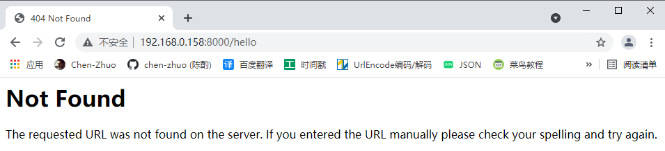

# Flask资源文件

### 动态模板

在一般的 Web 程序里，访问一个地址通常会返回一个包含各类信息的 HTML 页面。因为我们的程序是动态的，页面中的某些信息需要根据不同的情况来进行调整，比如对登录和未登录用户显示不同的信息，所以页面需要在用户访问时根据程序逻辑动态生成。

我们把包含变量和运算逻辑的 HTML 或其他格式的文本叫做**模板**，执行这些变量替换和逻辑计算工作的过程被称为**渲染**，**在Flask中渲染工作由模板渲染引擎Jinja2 来完成**。

##### templates文件夹

按照默认的设置，Flask 会从程序实例所在模块同级目录的 `templates` 文件夹中寻找模板，所以我们要在项目根目录创建这个文件夹。

```
mkdir templates
```

##### 基本语法

Jinja2 的语法和 Python 大致相同，在模板里需要添加特定的**定界符**将 Jinja2 语句和变量标记出来，下面是常用的定界符：

```
{{ ... }} 用来标记变量。
 用来标记语句，比如 if 语句，for 语句等。
{# ... #} 用来写注释。
{{ 变量|过滤器 }} 左侧是变量，右侧是过滤器名，类似于Python的len()函数。
```

借助 Jinja2 就可以写出一个通用的模板：

```jinja2
<h1>{{ username }}的个人主页</h1>

    <p>{{ bio }}</p>  {# 这里的缩进只是为了可读性，不是必须的 #}

    <p>自我介绍为空。</p>
  {# 大部分 Jinja 语句都需要声明关闭 #}
```

##### 模板渲染

我们先在 `templates` 目录下创建一个 `index.html` 文件，作为主页模板。主页需要显示电影条目列表和个人信息，代码如下所示：

```jinja2
<!DOCTYPE html>
<html lang="en">
<head>
    <meta charset="utf-8">
    <title>{{ name }}'s Watchlist</title>
</head>
<body>
    <h2>{{ name }}'s Watchlist</h2>
    <p>{{ movies|length }} Titles</p>  {# 使用 length 过滤器获取 movies 变量的长度 #}
    <ul>
          {# 迭代 movies 变量 #}
        <li>{{ movie.title }} - {{ movie.year }}</li>  {# 等同于movie['title']和movie['year'] #}
          {# 使用 endfor 标签结束 for 语句 #}
    </ul>
</body>
</html>
```

Flask项目中的代码如下：

```python
from flask import Flask, render_template

app = Flask(__name__)

# 虚拟构造数据
name = 'Grey Li'
movies = [
    {'title': 'My Neighbor Totoro', 'year': '1988'},
    {'title': 'Dead Poets Society', 'year': '1989'},
    {'title': 'A Perfect World', 'year': '1993'},
    {'title': 'Leon', 'year': '1994'},
    {'title': 'Mahjong', 'year': '1996'},
    {'title': 'Swallowtail Butterfly', 'year': '1996'},
    {'title': 'King of Comedy', 'year': '1999'},
    {'title': 'Devils on the Doorstep', 'year': '1999'},
    {'title': 'WALL-E', 'year': '2008'},
    {'title': 'The Pork of Music', 'year': '2012'},
]

@app.route('/')
def index():
    # 使用 render_template() 函数可以把模板渲染出来，传入的参数为模板文件名（相对于 templates 根目录的文件路径），这里即index.html。
    # 为了正确渲染模板，还要把模板内部使用的变量通过关键字参数传入这个函数，左边的movies是模板中使用的变量名称，右边的movies则是该变量指向的实际对象。
    return render_template('index.html', name=name, movies=movies)

if __name__ == '__main__':
    app.run(host='0.0.0.0', port=8000, debug=True)
```

?> 这里传入模板的 `name` 是字符串，`movies` 是列表，但能够在模板里使用的不只这两种 Python 数据结构，也可以传入元组、字典、函数等。

`render_template()` 函数在调用时会识别并执行 `index.html` 里所有的 Jinja2 语句，返回渲染好的模板内容。在返回的页面中，变量会被替换为实际的值（包括定界符），语句（及定界符）则会在执行后被移除（注释也会一并移除）。

现在访问看到的程序主页如下图所示：


### 静态文件

**静态文件（static files）和我们的模板概念相反，指的是内容不需要动态生成的文件。**比如图片、CSS 文件和 JavaScript 脚本等。

##### static文件夹

在 Flask 中，我们需要创建一个 `static` 文件夹来保存静态文件，它和程序模块、`templates` 文件夹在同一目录层级，所以我们在项目根目录创建它：

```
mkdir static
```

##### 引入静态文件

**在 HTML 文件里，引入这些静态文件需要给出资源所在的 URL。**为了更加灵活，这些文件的 URL 可以通过 Flask 提供的 `url_for()` 函数来生成。**对于静态文件，需要传入的端点值是 `static`，同时使用 `filename` 参数来传入相对于 static 文件夹的文件路径。**

花括号部分的调用会返回 `/static/foo.jpg`：

```jinja2

```

**在实际的项目开发中会涉及到许多静态文件引用，为了更好的组织同类文件，需要在 `static` 目录下面创建子文件夹，图片文件都可以放在 `image` 子文件夹当中，同样的，如果你有多个 CSS 文件，也可以创建一个 `css` 文件夹来组织他们。**

花括号部分的调用会返回 `/static/image/foo.jpg`：

```jinja2

```
##### 添加image图片

**Favicon（favourite icon） 是显示在标签页和书签栏的网站头像。**你需要准备一个 ICO、PNG 或 GIF 格式的图片，大小一般为 16×16、32×32、48×48 或 64×64 像素。把这个图片放到 `static` 目录下 `image` 子文件夹当中，在 HTML 模板里引入它：

```jinja2
<head>
    ...
    <link rel="icon" href="{{ url_for('static', filename='image/avatar.png') }}">
</head>
```

保存后刷新页面，即可在浏览器标签页上看到这个图片：


我们再来给标题前面添加一张图片：

```jinja2
<h2>
    
    {{ name }}'s Watchlist
</h2>
```


##### 添加CSS样式

虽然添加了图片，但页面还是非常简陋，在 `static` 目录下 `css` 子文件夹中创建一个 `style.css` 文件，内容如下：

```css
/* 页面整体 */
body {
    margin: auto;
    max-width: 580px;
    font-size: 14px;
    font-family: Helvetica, Arial, sans-serif;
}

/* 头像 */
.avatar {
    width: 40px;
}

/* 电影列表 */
.movie-list {
    list-style-type: none;
    padding: 0;
    margin-bottom: 10px;
    box-shadow: 0 2px 5px 0 rgba(0, 0, 0, 0.16), 0 2px 10px 0 rgba(0, 0, 0, 0.12);
}

.movie-list li {
    padding: 12px 24px;
    border-bottom: 1px solid #ddd;
}

.movie-list li:last-child {
    border-bottom:none;
}

.movie-list li:hover {
    background-color: #f8f9fa;
}
```

接着在页面的 `<head>` 标签内引入这个 CSS 文件：

```jinja2
<head>
    ...
    <link rel="stylesheet" href="{{ url_for('static', filename='css/style.css') }}" type="text/css">
</head>
```

最后要为对应的元素设置 `class` 属性值，以便和对应的 CSS 定义关联起来：

```html
<h2>
    
    {{ name }}'s Watchlist
</h2>
...
<ul class="movie-list">
    ...
</ul>
```

最终的页面如下图所示（有点简陋）：


### 模板优化

##### 自定义错误页

如果你访问一个不存在的 URL，比如 `/hello`，Flask 会自动返回一个 404 错误响应。默认的错误页面非常简陋，如下图所示：



在 Flask 程序中自定义错误页面非常简单，我们在 `templates/404.html` 中先编写一个 404 错误页面模板，如下所示：

```html
<!DOCTYPE html>
<html lang="en">
<head>
    <meta charset="utf-8">
    <title>{{ name }}'s Watchlist</title>
    <link rel="icon" href="{{ url_for('static', filename='image/avatar.jpg') }}">
    <link rel="stylesheet" href="{{ url_for('static', filename='css/style.css') }}" type="text/css">
</head>
<body>
    <h2>
        
        {{ name }}'s Watchlist
    </h2>
    <ul class="movie-list">
        <li>
            Page Not Found - 404
            <span class="float-right">
                <a href="{{ url_for('index') }}">Go Back</a>
            </span>
        </li>
    </ul>
</body>
</html>
```

接着使用 `app.errorhandler()` 装饰器注册一个错误处理函数，它的作用和视图函数类似，当 404 错误发生时，这个函数会被触发，返回值会作为响应主体返回给客户端：

```python
from flask import Flask, render_template

app = Flask(__name__)

name = 'Grey Li'
movies = [
    {'title': 'My Neighbor Totoro', 'year': '1988'},
    {'title': 'Dead Poets Society', 'year': '1989'},
    {'title': 'A Perfect World', 'year': '1993'},
    {'title': 'Leon', 'year': '1994'},
    {'title': 'Mahjong', 'year': '1996'},
    {'title': 'Swallowtail Butterfly', 'year': '1996'},
    {'title': 'King of Comedy', 'year': '1999'},
    {'title': 'Devils on the Doorstep', 'year': '1999'},
    {'title': 'WALL-E', 'year': '2008'},
    {'title': 'The Pork of Music', 'year': '2012'},
]

@app.route('/')
def index():
    return render_template('index.html', name=name, movies=movies)

@app.errorhandler(404)  # 传入要处理的错误代码
def page_not_found(e):  # 接受异常对象作为参数
    return render_template('404.html', name=name), 404  # 返回模板和状态码

if __name__ == '__main__':
    app.run(host='0.0.0.0', port=8000, debug=True)
```

这个视图返回渲染好的错误模板，因为模板中使用了 name 变量，这里也要一并传入。现在访问一个不存在的 URL，会显示我们自定义的错误页面：


编写完上面代码后，你会发现两个问题：

1. 错误页面和主页都需要使用 name 变量，如果有更多的页面，那么每一个对应的视图函数都要重复传入这个变量。
2. 错误页面模板和主页模板有大量重复的代码，比如 `<head>` 标签的内容，页首的标题，页脚信息等。举例来说，如果 `<head>` 标签需要更新，那么每个页面都要一一进行修改。

##### 上下文处理

对于多个模板内都需要使用的变量，我们可以使用 `app.context_processor` 装饰器注册一个模板上下文处理函数，**这个函数返回的变量（以字典键值对的形式）将会统一注入到每一个模板的上下文环境中，因此可以直接在模板中使用。**

```python
from flask import Flask, render_template

app = Flask(__name__)

name = 'Grey Li'
movies = [
    {'title': 'My Neighbor Totoro', 'year': '1988'},
    {'title': 'Dead Poets Society', 'year': '1989'},
    {'title': 'A Perfect World', 'year': '1993'},
    {'title': 'Leon', 'year': '1994'},
    {'title': 'Mahjong', 'year': '1996'},
    {'title': 'Swallowtail Butterfly', 'year': '1996'},
    {'title': 'King of Comedy', 'year': '1999'},
    {'title': 'Devils on the Doorstep', 'year': '1999'},
    {'title': 'WALL-E', 'year': '2008'},
    {'title': 'The Pork of Music', 'year': '2012'},
]

@app.context_processor
def inject_user():  # 函数名可以随意修改
    return dict(name=name)  # 需要返回字典，等同于 return {'name': 'Grey Li'}

@app.route('/')
def index():
    return render_template('index.html', movies=movies)  # 删除name传参

@app.errorhandler(404)
def page_not_found(e):
    return render_template('404.html'), 404  # 删除name传参

if __name__ == '__main__':
    app.run(host='0.0.0.0', port=8000, debug=True)
```

删除 404 错误处理函数和主页视图函数中的 `name` 变量定义，再访问页面照样也能加载 `name` 变量的值。


##### 模板继承

对于模板内容重复的问题，Jinja2 提供了模板继承的支持。这个机制和 Python 类继承非常类似：**我们可以定义一个父模板，一般会称之为基模板（base template）。基模板中包含完整的 HTML 结构和导航栏、页首、页脚都通用部分。在子模板里，我们可以使用 `extends` 标签来声明继承自某个基模板。**

基模板中需要在实际的子模板中追加或重写的部分则可以定义成块（block）。块使用 `block` 标签创建。通过在子模板里定义一个同样名称的块，你可以向基模板的对应块位置追加或重写内容。

