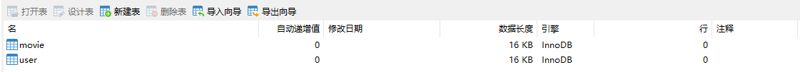
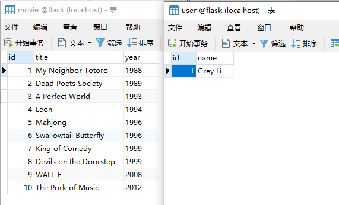
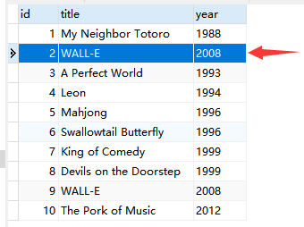
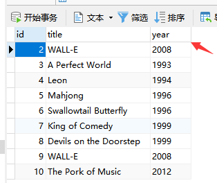

# Flask数据库

大部分程序都需要保存数据，所以不可避免要使用数据库。用来操作数据库的数据库管理系统（DBMS）有很多选择，对于不同类型的程序，不同的使用场景，会有不同的选择。

### ORM

**对象关系映射（简称ORM），是一种程序设计技术，用于实现面向对象编程语言里不同类型系统的数据之间的转换**。从效果上说，它其实是创建了一个可在编程语言里使用的“虚拟对象数据库”，**简单的说：ORM相当于中继数据。**

##### SQLAlchemy

**SQLAlchemy 是 Python 语言下的一款开源软件，提供了 SQL 工具包及对象关系映射（ORM）工具。**通过定义 Python 类来表示数据库里的一张表（类属性表示表中的字段 / 列），这个类称为**模型类**，类中的属性称为**字段**，通过对这个类进行各种操作来代替写 SQL 语句。

Flask 有大量的第三方扩展，这些扩展可以简化和第三方库的集成工作。我们下面将使用一个叫做 [Flask-SQLAlchemy](http://flask-sqlalchemy.pocoo.org/2.3/) 的官方扩展来集成 SQLAlchemy。

首先安装它：

```
pip install flask-sqlalchemy
```

大部分扩展都需要执行一个“初始化”操作。你需要导入扩展类，实例化并传入 Flask 程序实例：

```python
from flask_sqlalchemy import SQLAlchemy  # 导入扩展类
app = Flask(__name__)
db = SQLAlchemy(app)  # 初始化扩展，传入程序实例 app
```

##### 配置连接

Flask 提供了一个统一的接口来写入和获取这些配置变量：`Flask.config` 字典。配置变量的名称必须使用大写，写入配置的语句一般会放到扩展类实例化语句之前。

下面写入了一个 `SQLALCHEMY_DATABASE_URI` 变量来告诉 SQLAlchemy 数据库连接地址：

```python
from flask import Flask, render_template
from flask_sqlalchemy import SQLAlchemy  # 导入扩展类

app = Flask(__name__)
app.config['SQLALCHEMY_DATABASE_URI'] = "mysql+pymysql://用户:密码@IP地址:端口/数据库?charset=utf8"  # 连接MySQL数据库
app.config['SQLALCHEMY_TRACK_MODIFICATIONS'] = False  # 关闭对模型修改的监控
db = SQLAlchemy(app)  # 在扩展类实例化前加载配置
```

### CRUD

**CRUD是指在做计算处理时的增加(Create)、检索(Retrieve)、更新(Update)和删除(Delete)几个单词的首字母简写，主要被用在描述软件系统中数据库或者持久层的基本操作功能。**

##### 建立模型

目前我们有两类数据要保存：用户信息和电影条目信息。我们新建一个 `mysql_model.py` 文件，创建两个模型类来表示这两张表：

```python
from app import db

# 模型类要声明继承db.Model
# 类属性（字段）要实例化db.Column，传入字段类型，可以添加额外参数设置字段
class User(db.Model):
    __tablename__ = "user"  # 表名将会是user
    id = db.Column(db.Integer, primary_key=True)  # 主键
    name = db.Column(db.String(20))  # 名字

class Movie(db.Model):
    __tablename__ = "movie"  # 表名将会是movie
    id = db.Column(db.Integer, primary_key=True)  # 主键
    title = db.Column(db.String(60))  # 电影标题
    year = db.Column(db.String(4))  # 电影年份
```

类属性基本的格式：`变量 = db.Column(字段类型, 额外参数)`

| 字段类           | 说明                                          |
| ---------------- | --------------------------------------------- |
| db.Integer       | 整型                                          |
| db.String (size) | 字符串，size 为最大长度，比如 `db.String(20)` |
| db.Text          | 长文本                                        |
| db.DateTime      | 时间日期，Python `datetime` 对象              |
| db.Float         | 浮点数                                        |
| db.Boolean       | 布尔值                                        |

| 额外参数    | 接收值 | 作用                 |
| ----------- | ------ | -------------------- |
| primary_key | 布尔值 | 设置该字段是否为主键 |
| nullable    | 布尔值 | 是否允许为空值       |
| index       | 布尔值 | 是否设置索引         |
| unique      | 布尔值 | 是否允许重复值       |
| default     | 自定义 | 根据字段类设置默认值 |

##### 建立数据表

所有的CRUD操作都是建立在数据表上的，现在我们建立好了模型，通过模型来建立数据表，两个模型User、Movie就对应两个数据表user、movie。新建文件 `mysql_model.py` 内容如下：

```python
from hello_flask import db

class User(db.Model):  # 表名将会是 user
    id = db.Column(db.Integer, primary_key=True)  # 主键
    name = db.Column(db.String(20))  # 名字

class Movie(db.Model):  # 表名将会是 movie
    id = db.Column(db.Integer, primary_key=True)  # 主键
    title = db.Column(db.String(60))  # 电影标题
    year = db.Column(db.String(4))  # 电影年份

def create_table():
    db.dorp()  # 若user表、movie表存在，则删除表
    db.create_all()  # 新创建user表、movie表

if __name__ == "__main__":
    try:
        create_table()
        print("create table successful.")
    except:
        print("create table failed !!!")
```

?> 我们在说 Movie 模型的时候，实际指的是数据库中的 movie 表。表的实际名称是模型类的小写形式（自动生成），如果你想自己指定表名，可以定义 `__tablename__` 属性。

运行flask服务后，运行该文件，在配置 `app.config['SQLALCHEMY_DATABASE_URI']` 定义的数据库中就会生成user表、movie表两张新表。



##### 插入数据

现在模型有了，数据表有了，我们新建 `crud.py` 文件把之前构造的数据插入表里：

```python
from hello_flask import db
from mysql_model import User, Movie  # 导入模型类

name = 'Grey Li'
movies = [
    {'title': 'My Neighbor Totoro', 'year': '1988'},
    {'title': 'Dead Poets Society', 'year': '1989'},
    {'title': 'A Perfect World', 'year': '1993'},
    {'title': 'Leon', 'year': '1994'},
    {'title': 'Mahjong', 'year': '1996'},
    {'title': 'Swallowtail Butterfly', 'year': '1996'},
    {'title': 'King of Comedy', 'year': '1999'},
    {'title': 'Devils on the Doorstep', 'year': '1999'},
    {'title': 'WALL-E', 'year': '2008'},
    {'title': 'The Pork of Music', 'year': '2012'},
]

def insert():
    u1 = User(name=name)  # 创建一个 User 记录
    db.session.add(u1)  # 把新创建的记录添加到数据库会话
    for item in movies:
        m1 = Movie(title=item['title'], year=item['year'])  # 创建一个 Movie 记录
        db.session.add(m1)  # 把新创建的记录添加到数据库会话
    db.session.commit()  # 提交数据库会话，只需要在最后调用一次即可

if __name__ == '__main__':
    insert()
```

?> 在实例化模型类的时候，我们并没有传入 `id` 字段（主键），因为 SQLAlchemy 会自动处理这个字段。



##### 查询数据

通过对模型类的 `query` 属性调用可选的过滤方法和查询方法，我们就可以获取到对应的单个或多个记录（记录以模型类实例的形式表示）。查询语句的格式：`<模型类>.query.<过滤方法（可选）>.<查询方法>`

```python
def search():
    movie_first = Movie.query.first()  # 获取 Movie 模型的第一个记录（返回模型类实例）
    print(f'movie表第1条记录的title为：{movie_first.title}')   # 对返回的模型类实例调用属性即可获取记录的各字段数据
    print(f'movie表第1条记录的year为：{movie_first.year}')
    movie_all = Movie.query.all()  # 获取 Movie 模型的所有记录，返回包含多个模型类实例的列表
    print(f'movie表第5条记录的title为：{movie_all[4].title}')
    print(f'movie表第5条记录的year为：{movie_all[4].year}')
    movie_count = Movie.query.count()  # 获取 Movie 模型所有记录的数量
    print(f'movie表记录条数：{movie_count}')
    movie_one = Movie.query.get(5)  # 获取主键值为 5 的记录
    print(f'movie表主键为5的title为：{movie_one.title}')
    movie_filter = Movie.query.filter_by(title='Mahjong').first()  # 获取 title 字段值为 Mahjong 的记录
    print(f'movie表title为Mahjong的year为：{movie_filter.year}')
    movie_filter = Movie.query.filter(Movie.title == 'Mahjong').first()  # 等同于上面的查询，但使用不同的过滤方法
    print(f'movie表title为Mahjong的year为：{movie_filter.year}')
    
if __name__ == '__main__':
    search()
"""
输出：
movie表第1条记录的title为：My Neighbor Totoro
movie表第1条记录的year为：1988
movie表第5条记录的title为：Mahjong
movie表第5条记录的year为：1996
movie表记录条数：10
movie表主键为5的title为：Mahjong
movie表title为Mahjong的year为：1996
movie表title为Mahjong的year为：1996
"""
```

下面是一些常用的过滤方法：

| 过滤方法    | 说明                                                         |
| ----------- | ------------------------------------------------------------ |
| filter()    | 使用指定的规则过滤记录，返回新产生的查询对象                 |
| filter_by() | 使用指定规则过滤记录（以关键字表达式的形式），返回新产生的查询对象 |
| order_by()  | 根据指定条件对记录进行排序，返回新产生的查询对象             |
| group_by()  | 根据指定条件对记录进行分组，返回新产生的查询对象             |

下面是一些常用的查询方法：

| 查询方法       | 说明                                                         |
| -------------- | ------------------------------------------------------------ |
| all()          | 返回包含所有查询记录的列表                                   |
| first()        | 返回查询的第一条记录，如果未找到，则返回 None                |
| get(id)        | 传入主键值作为参数，返回指定主键值的记录，如果未找到，则返回 None |
| count()        | 返回查询结果的数量                                           |
| first_or_404() | 返回查询的第一条记录，如果未找到，则返回 404 错误响应        |
| get_or_404(id) | 传入主键值作为参数，返回指定主键值的记录，如果未找到，则返回 404 错误响应 |
| paginate()     | 返回一个 Pagination 对象，可以对记录进行分页处理             |

?> 如果查询记录大于1000条，调用 `query().all()` 方法会导致内存激增（sqlalchemy会把所有对象放在内存中），改用 `query().yield_per(1000)` 之后，内存分配就不会那么多了。

##### 更新数据

```python
def update():
    movie = Movie.query.get(2)
    movie.title = 'WALL-E'  # 直接对实例属性赋予新的值即可
    movie.year = '2008'
    db.session.commit()  # 注意仍然需要调用这一行来提交改动

if __name__ == '__main__':
    update()
```



##### 删除数据

```python
def delete():
    movie = Movie.query.get(1) # 获取主键值为 1 的记录
    db.session.delete(movie)  # 使用 db.session.delete() 方法删除记录，传入模型实例
    db.session.commit()  # 提交改动

if __name__ == '__main__':
    delete()
```



##### 展示数据

现在我们可以直接读取数据库的数据并引入视图当中了：

```python
@app.context_processor
def inject_user():
    user = User.query.get(1)
    return dict(name=user.name)

@app.route('/')
def index():
    movie = Movie.query.all()
    return render_template('index.html', movies=movie)

@app.errorhandler(404)
def page_not_found():
    return render_template('404.html'), 404

if __name__ == '__main__':
    app.run(host='0.0.0.0', port=8000, debug=True)
```


