# Flask表单

### 添加表单

##### 表单模板

在 HTML 页面里，我们需要编写表单来获取用户输入。一个典型的表单如下所示：

```html
<form method="post">  <!-- 指定提交方法为 POST -->
    <label for="name">名字</label>
    <input type="text" name="name" id="name"><br>  <!-- 文本输入框 -->
    <label for="occupation">职业</label>
    <input type="text" name="occupation" id="occupation"><br>  <!-- 文本输入框 -->
    <input type="submit" name="submit" value="登录">  <!-- 提交按钮 -->
</form>
```

编写表单的 HTML 代码有下面几点需要注意：

- 在 `<form>` 标签里使用 `method` 属性将提交表单数据的 HTTP 请求方法指定为 POST。如果不指定，则会默认使用 GET 方法，这会将表单数据通过 URL 提交，容易导致数据泄露，而且不适用于包含大量数据的情况。
- `<input>` 元素必须要指定 `name`  属性，否则无法提交数据，在服务器端，我们也需要通过这个 `name` 属性值来获取对应字段的数据。
- 填写输入框标签文字的 `<label>` 元素不是必须的，只是为了辅助鼠标用户。当使用鼠标点击标签文字时，会自动激活对应的输入框，这对复选框来说比较有用。`for` 属性填入要绑定的 `<input>` 元素的 `id` 属性值。

##### 创建新条目

我们直接在 `index.html` 主页添加一个创建新条目表单：

```html
<p>{{ movies|length }} Titles</p>
<form method="post">
    Name <input type="text" name="title" autocomplete="off" required>
    Year <input type="text" name="year" autocomplete="off" required>
    <input class="btn" type="submit" name="submit" value="Add">
</form>
```

`autocomplete` 属性设为 `off` 来关闭自动完成（按下输入框不显示历史输入记录）。

`required` 标志属性，如果用户没有输入内容就按下了提交按钮，浏览器会显示错误提示。

两个输入框和提交按钮相关的 CSS 定义如下：

```css
/* 覆盖某些浏览器对 input 元素定义的字体 */
input[type=submit] {
    font-family: inherit;
}

input[type=text] {
    border: 1px solid #ddd;
}

input[name=year] {
    width: 50px;
}

.btn {
    font-size: 12px;
    padding: 3px 5px;
    text-decoration: none;
    cursor: pointer;
    background-color: white;
    color: black;
    border: 1px solid #555555;
    border-radius: 5px;
}

.btn:hover {
    text-decoration: none;
    background-color: black;
    color: white;
    border: 1px solid black;
}
```

现在我们去访问主页就可以看到添加的输入框了：

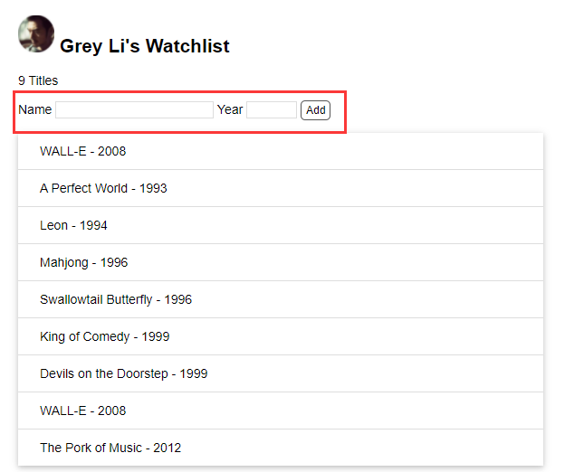

### 接收表单

##### 接收POST

我们在模板里为表单定义了 POST 方法，当你输入数据按下提交按钮，**浏览器就会创建一个新的携带输入信息的 POST 请求会默认发往当前 URL**（在 `<form>` 元素使用 `action` 属性可以自定义目标 URL）。

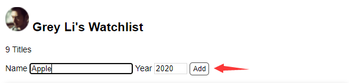

**由于处理根地址请求的 `index` 视图默认只接受 GET 请求，因此你会看到一个 `405 Method Not Allowed` 错误提示。**

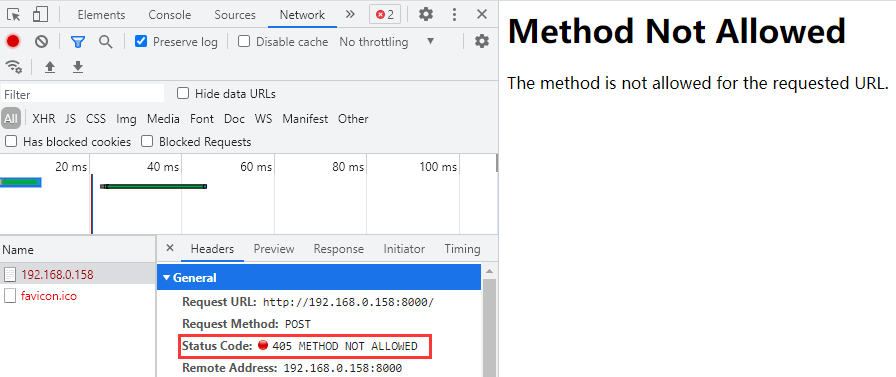


**在 HTTP 中， 最常用的两种请求就是 GET 和 POST：**

1. **GET 请求，返回渲染后的页面，常用来获取资源；** 
2. **POST 请求，提交表单数据，常用来创建 / 更新资源。**
3. **访问一个链接时会发送 GET 请求，而提交表单会发送 POST 请求。**

在 `app.route()` 装饰器里，我们可以用 `methods` 关键字传递一个包含 HTTP 方法字符串的列表，表示这个视图函数处理哪种方法类型的请求。默认只接受 GET 请求，为了能够处理 POST 请求，我们需要修改一下视图函数：

```python
@app.route('/', methods=['GET', 'POST'])
def index():
    movies = Movie.query.all()
    return render_template('index.html', movies=movies)
```

现在，我们在输入框输入信息提交后，就不会显示 `405 Method Not Allowed` 错误提示。

##### 接收数据

现在，我们需要从接受的 POST 请求当中获取数据。**Flask 会在请求触发后把请求信息放到 `request` 对象里，因为它在请求触发时才会包含数据，所以你只能在视图函数内部调用它。**它包含请求相关的所有信息：

| 方法           | 返回信息   |
| -------------- | ---------- |
| request.path   | 请求的路径 |
| request.method | 请求的方法 |
| request.form   | 表单数据   |
| request.args   | 查询字符串 |

为了在函数内区分不同请求，我们添加一个 if 判断：

```python
# 从flask导入request对象
from flask import request

@app.route('/', methods=['GET', 'POST'])
def index():
    if request.method == 'POST':  # 区分不同请求的执行流程
        title = request.form.get('title')
        year = request.form.get('year')
        print(title, year)  # 打印字段数据
        print(request.form)  # 打印表单表单
        print("接受表单数据成功")
    movies = Movie.query.all()
    return render_template('index.html', movies=movies)
```

输入下面信息点击Add提交后，在服务端会打印下面信息：


```python
"""
输出：
Apple 2020
ImmutableMultiDict([('title', 'Apple'), ('year', '2020'), ('submit', 'Add')])
接受表单数据成功
注释：通过request对象成功拿到了form表单数据，ImmutableMultiDict(data).to_dict()可以表单的数据类型转换为Python中的dict字典类型。
"""
```

### 验证表单

##### 数据检验

在实际的项目当中，当我们从表单接收到数据以后，还要对数据进行验证，看是否符合我们的要求。例如：title或者year不能为空、year字段长度必须为4、title的长度不能长于60位等。

```python
@app.route('/', methods=['GET', 'POST'])
def index():
    if request.method == 'POST':  
        title = request.form.get('title')
        year = request.form.get('year')
        if not title or not year or len(year) != 4 or len(title) > 60:
            return 'Invalid input'  # 数据不符合要求，返回错误信息
    movies = Movie.query.all()
    return render_template('index.html', movies=movies)
```

输入错误信息点击Add提交，返回了错误信息：

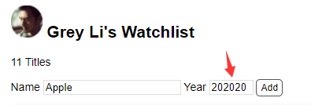

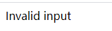

##### flash消息

上面的操作有点不友好的就是，用户输入了错误信息并提交后，就直接给返回错误，想重新输入一次还得重新访问一次接口。我们希望当用户提交错误信息的情况出现后，页面不变，而是给出一个提示，让用户重新输入正确的信息。

最简单的实现就是在视图函数里定义一个包含消息内容的变量，传入模板，然后在模板里渲染显示它。因为这个需求很常用，Flask 内置了相关的函数。其中 `flash()` 函数用来在视图函数里向模板传递提示消息，`get_flashed_messages()` 函数则用来在模板中获取提示消息。

```python
# 首先从flask包导入flash函数
from flask import flash

# 设置签名所需的密钥
app.config['SECRET_KEY'] = 'dev'

@app.route('/', methods=['GET', 'POST'])
def index():
    # 传入要显示的消息内容
    flash('Item Created.')
    if request.method == 'POST':  
        title = request.form.get('title')
        year = request.form.get('year')
        if not title or not year or len(year) != 4 or len(title) > 60:
            return 'Invalid input'  # 数据不符合要求，返回错误信息
    movies = Movie.query.all()
    return render_template('index.html', movies=movies)
```

!> 签名密钥的值在开发时可以随便设置。基于安全的考虑，在部署时应该设置为随机字符，且不应该明文写在代码里。

在基模板（base.html）里使用 `get_flashed_messages()` 函数获取提示消息并显示：

```html
<!-- 插入到页面标题上方 -->

    <div class="alert">{{ message }}</div>

<h2>...</h2>
```

`alert` 类为提示消息增加样式：

```css
.alert {
    position: relative;
    padding: 7px;
    margin: 7px 0;
    border: 1px solid transparent;
    color: #004085;
    background-color: #cce5ff;
    border-color: #b8daff;
    border-radius: 5px;
}
```

现在我们访问主页就能看到提示消息了：

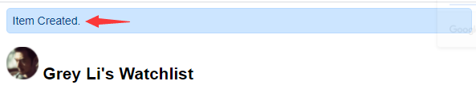

这里我们不需要一直显示这个提示消息，而是当我们输入信息经过验证后反馈给我们一个提示信息：

```python
@app.route('/', methods=['GET', 'POST'])
def index():
    if request.method == 'POST':  
        title = request.form.get('title')
        year = request.form.get('year')
        if not title or not year or len(year) != 4 or len(title) > 60:
            flash('Invalid input')  # 数据不符合要求，显示错误提示
        flash('Item Created')  # 数据符合要求，显示正确提示
    movies = Movie.query.all()
    return render_template('index.html', movies=movies)
```

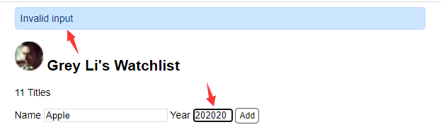

### 编辑表单

##### 增加条目

现在表单经过验证后结合前面讲解的CRUD操作就可以存入MySQL库，通过视图函数显示在页面上：

```python
from flask import url_for, redirect

@app.route('/', methods=['GET', 'POST'])
def index():
    # 传入要显示的消息内容
    if request.method == 'POST':
        title = request.form.get('title')
        year = request.form.get('year')
        if not title or not year or len(year) != 4 or len(title) > 60:
            flash('Invalid input')
            return redirect(url_for('index'))  # 重定向回主页
        else:
            movie = Movie(title=title, year=year)  # 创建记录
            db.session.add(movie)  # 添加到数据库会话
            db.session.commit()  # 提交数据库会话
            flash('Item Created')
            return redirect(url_for('index'))  # 数据库内容增加，需要重定向回主页显示增加的内容
    movies = Movie.query.all()
    return render_template('index.html', movies=movies)
```

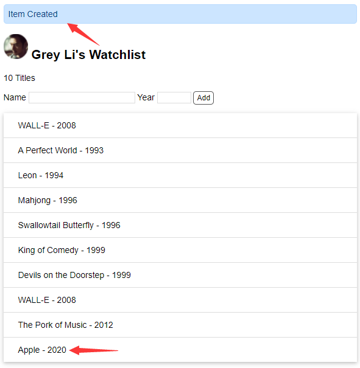

##### 编辑条目

我们先创建一个用于显示编辑页面和处理编辑表单提交请求的视图函数：

```python
# <int:movie_id>表示URL变量，int则是将变量转换成整型的转换器。比如url_for('edit', movie_id=2)会生成/movie/edit/2
@app.route('/movie/edit/<int:movie_id>', methods=['GET', 'POST'])
def edit(movie_id):
    # get_or_404()方法，它会返回对应主键的记录，如果没有找到，则返回404错误响应
    movie = Movie.query.get_or_404(movie_id)
    
    if request.method == 'POST':  # 处理编辑表单的提交请求
        title = request.form['title']
        year = request.form['year']

        if not title or not year or len(year) != 4 or len(title) > 60:
            flash('Invalid input.')
            return redirect(url_for('edit', movie_id=movie_id))  # 重定向回对应的编辑页面

        movie.title = title  # 更新标题
        movie.year = year  # 更新年份
        db.session.commit()  # 提交数据库会话
        flash('Item updated.')
        return redirect(url_for('index'))  # 重定向回主页

    return render_template('edit.html', movie=movie)  # 传入被编辑的电影记录
```

既然我们要编辑某个条目，那么必然要在输入框里提前把对应的数据放进去，以便于进行更新。在模板里，通过表单 `<input>` 元素的 `value` 属性即可将它们提前写到输入框里。新建完整的编辑页面模板 `edit.html` 如下所示：

```html



<h3>Edit item</h3>
<form method="post">
    Name <input type="text" name="title" autocomplete="off" required value="{{ movie.title }}">
    Year <input type="text" name="year" autocomplete="off" required value="{{ movie.year }}">
    <input class="btn" type="submit" name="submit" value="Update">
</form>

```

最后在主页每一个电影条目右侧都添加一个指向该条目编辑页面的链接：

```html
  {# 迭代 movies 变量 #}
    <li>
        {{ movie.title }} - {{ movie.year }}
        <a class="btn" href="{{ url_for('edit', movie_id=movie.id) }}">Edit</a>
    </li>
  {# 使用 endfor 标签结束 for 语句 #}
```

这时访问主页就会如下显示：

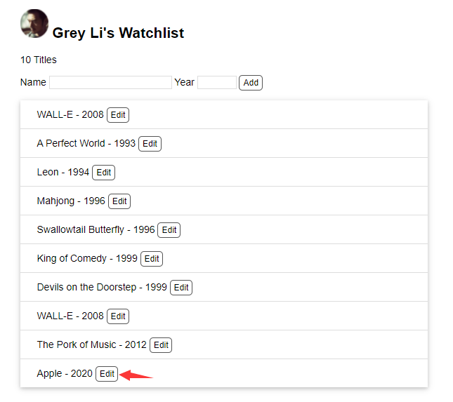

点击Edit按钮就会跳转到对应的编辑页面：

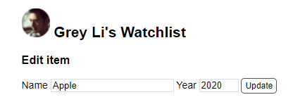

我们修改信息并点击Update提交：

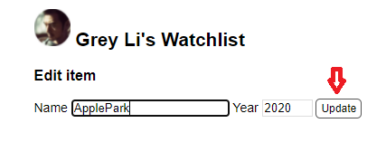

就会跳转到主页显示修改的内容：

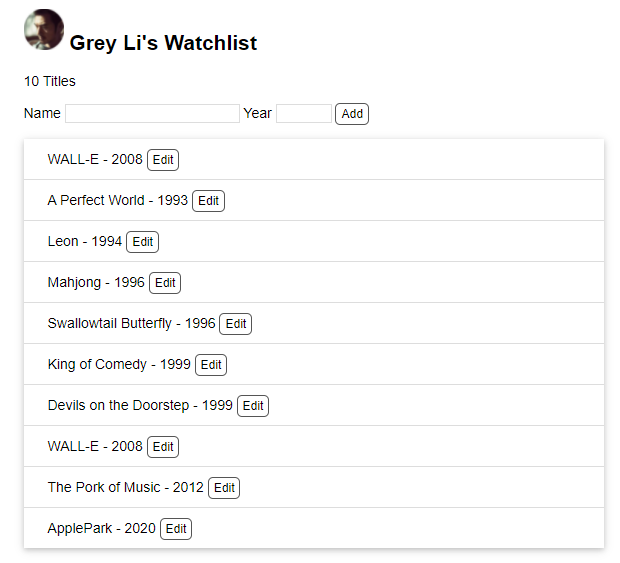

##### 删除条目

因为不涉及数据的传递，删除条目的实现更加简单。首先创建一个视图函数执行删除操作，如下所示：

```python
@app.route('/movie/delete/<int:movie_id>', methods=['POST'])  # 为了安全的考虑，限定只接受POST请求，也就是使用表单来实现（而不是创建删除链接）
def delete(movie_id):
    movie = Movie.query.get_or_404(movie_id)  # 获取电影记录
    db.session.delete(movie)  # 删除对应的记录
    db.session.commit()  # 提交数据库会话
    flash('Item deleted.')
    return redirect(url_for('index'))  # 重定向回主页
```

最后在主页每一个电影条目右侧都添加一个删除按钮：

```html
<form class="inline-form" method="post" action="{{ url_for('delete', movie_id=movie.id) }}">
    <input class="btn" type="submit" name="delete" value="Delete" onclick="return confirm('Are you sure?')">
</form>
```

访问主页就会显示Delete按钮：

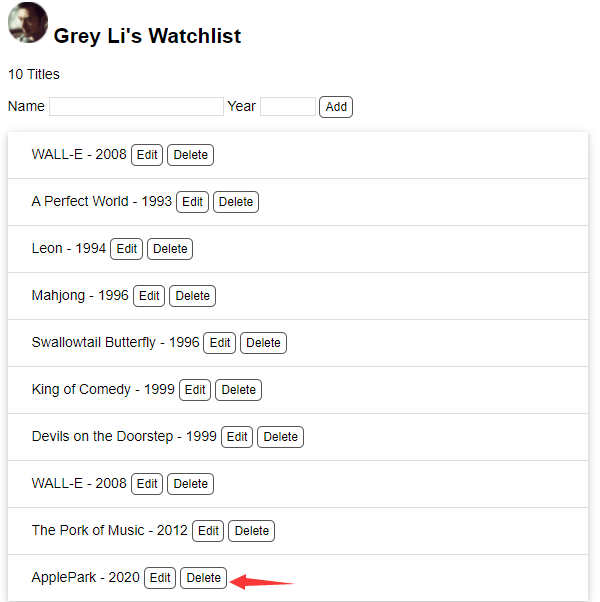

点击Delete按钮，会出现一个确定删除的提示：


点击确定，重定向到主页，条目已被成功删除：

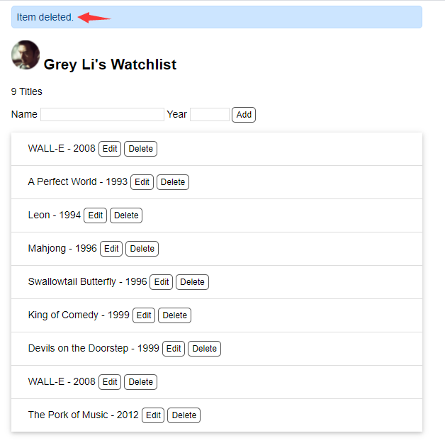

### 进阶提示

##### Flask-WTF

从上面的代码可以看出，手动验证表单数据既麻烦又不可靠。对于复杂的程序，我们一般会使用集成了 WTForms 的扩展 [Flask-WTF](https://github.com/lepture/flask-wtf) 来简化表单处理。通过编写表单类，定义表单字段和验证器，它可以自动生成表单对应的 HTML 代码，并在表单提交时验证表单数据，返回对应的错误消息。更重要的，它还内置了 CSRF（跨站请求伪造） 保护功能。你可以阅读 [Flask-WTF 文档](https://flask-wtf.readthedocs.io/en/stable/)和 Hello, Flask! 专栏上的[表单系列文章](https://zhuanlan.zhihu.com/p/23577026)了解具体用法。使用 Flask-WTF 时，表单类在模板中的渲染代码基本相同，你可以编写宏来渲染表单字段。如果你使用 Bootstap，那么扩展 [Bootstrap-Flask](https://github.com/greyli/bootstrap-flask) 内置了多个表单相关的宏，可以简化渲染工作。

##### CSRF攻击手段

CSRF 是一种常见的攻击手段。以我们的删除表单为例，某恶意网站的页面中内嵌了一段代码，访问时会自动发送一个删除某个电影条目的 POST 请求到我们的程序。如果我们访问了这个恶意网站，就会导致电影条目被删除，因为我们的程序没法分辨请求发自哪里。解决方法通常是在表单里添加一个包含随机字符串的隐藏字段，同时在 Cookie 中也创建一个同样的随机字符串，在提交时通过对比两个值是否一致来判断是否是用户自己发送的请求。在我们的程序中没有实现 CSRF 保护。

你可以把删除按钮的行内 JavaScript  代码改为事件监听函数，写到单独的 JavaScript 文件里。再进一步，你也可以使用 JavaScript 来监听点击删除按钮的动作，并发送删除条目的 POST 请求，这样删除按钮就可以使用普通 `<a>` 标签（CSRF 令牌存储在元素属性里），而不用创建表单元素。

