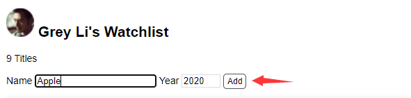

# Flask表单提交

##### flash消息

在用户执行某些动作后，我们通常在页面上显示一个提示消息。最简单的实现就是在视图函数里定义一个包含消息内容的变量，传入模板，然后在模板里渲染显示它。因为这个需求很常用，Flask 内置了相关的函数。其中 `flash()` 函数用来在视图函数里向模板传递提示消息，`get_flashed_messages()` 函数则用来在模板中获取提示消息。

```python
# 首先从flask包导入flash函数
from flask import flash

# 设置签名所需的密钥
app.config['SECRET_KEY'] = 'dev'

@app.route('/', methods=['GET'])
def index():
    # 传入要显示的消息内容
    flash('Item Created.')
    movies = Movie.query.all()
    return render_template('index.html', movies=movies)
```

!> 签名密钥的值在开发时可以随便设置。基于安全的考虑，在部署时应该设置为随机字符，且不应该明文写在代码里。

在基模板（base.html）里使用 `get_flashed_messages()` 函数获取提示消息并显示：

```html
<!-- 插入到页面标题上方 -->

    <div class="alert">{{ message }}</div>

<h2>...</h2>
```

`alert` 类为提示消息增加样式：

```css
.alert {
    position: relative;
    padding: 7px;
    margin: 7px 0;
    border: 1px solid transparent;
    color: #004085;
    background-color: #cce5ff;
    border-color: #b8daff;
    border-radius: 5px;
}
```

现在我们访问主页就能看到提示消息了：


### 添加表单

##### 表单模板

在 HTML 页面里，我们需要编写表单来获取用户输入。一个典型的表单如下所示：

```html
<form method="post">  <!-- 指定提交方法为 POST -->
    <label for="name">名字</label>
    <input type="text" name="name" id="name"><br>  <!-- 文本输入框 -->
    <label for="occupation">职业</label>
    <input type="text" name="occupation" id="occupation"><br>  <!-- 文本输入框 -->
    <input type="submit" name="submit" value="登录">  <!-- 提交按钮 -->
</form>
```

编写表单的 HTML 代码有下面几点需要注意：

- 在 `<form>` 标签里使用 `method` 属性将提交表单数据的 HTTP 请求方法指定为 POST。如果不指定，则会默认使用 GET 方法，这会将表单数据通过 URL 提交，容易导致数据泄露，而且不适用于包含大量数据的情况。
- `<input>` 元素必须要指定 `name`  属性，否则无法提交数据，在服务器端，我们也需要通过这个 `name` 属性值来获取对应字段的数据。
- 填写输入框标签文字的 `<label>` 元素不是必须的，只是为了辅助鼠标用户。当使用鼠标点击标签文字时，会自动激活对应的输入框，这对复选框来说比较有用。`for` 属性填入要绑定的 `<input>` 元素的 `id` 属性值。

##### 创建新条目

我们直接在 `index.html` 主页添加一个创建新条目表单：

```html
<p>{{ movies|length }} Titles</p>
<form method="post">
    Name <input type="text" name="title" autocomplete="off" required>
    Year <input type="text" name="year" autocomplete="off" required>
    <input class="btn" type="submit" name="submit" value="Add">
</form>
```

`autocomplete` 属性设为 `off` 来关闭自动完成（按下输入框不显示历史输入记录）。

`required` 标志属性，如果用户没有输入内容就按下了提交按钮，浏览器会显示错误提示。

两个输入框和提交按钮相关的 CSS 定义如下：

```css
/* 覆盖某些浏览器对 input 元素定义的字体 */
input[type=submit] {
    font-family: inherit;
}

input[type=text] {
    border: 1px solid #ddd;
}

input[name=year] {
    width: 50px;
}

.btn {
    font-size: 12px;
    padding: 3px 5px;
    text-decoration: none;
    cursor: pointer;
    background-color: white;
    color: black;
    border: 1px solid #555555;
    border-radius: 5px;
}

.btn:hover {
    text-decoration: none;
    background-color: black;
    color: white;
    border: 1px solid black;
}
```

现在我们去访问主页就可以看到添加的输入框了：


### 接收表单

##### 接收POST

我们在模板里为表单定义了 POST 方法，当你输入数据按下提交按钮，**浏览器就会创建一个新的携带输入信息的 POST 请求会默认发往当前 URL**（在 `<form>` 元素使用 `action` 属性可以自定义目标 URL）。



**由于处理根地址请求的 `index` 视图默认只接受 GET 请求，因此你会看到一个 `405 Method Not Allowed` 错误提示。**


**在 HTTP 中， 最常用的两种请求就是 GET 和 POST：**

1. **GET 请求，返回渲染后的页面，常用来获取资源；** 
2. **POST 请求，提交表单数据，常用来创建 / 更新资源。**
3. **访问一个链接时会发送 GET 请求，而提交表单会发送 POST 请求。**

在 `app.route()` 装饰器里，我们可以用 `methods` 关键字传递一个包含 HTTP 方法字符串的列表，表示这个视图函数处理哪种方法类型的请求。默认只接受 GET 请求，为了能够处理 POST 请求，我们需要修改一下视图函数：

```python
@app.route('/', methods=['GET', 'POST'])
def index():
    movies = Movie.query.all()
    return render_template('index.html', movies=movies)
```

现在，我们在输入框输入信息提交后，就不会显示 `405 Method Not Allowed` 错误提示。

##### 接受数据

现在，我们需要从接受的 POST 请求当中获取数据。**Flask 会在请求触发后把请求信息放到 `request` 对象里，因为它在请求触发时才会包含数据，所以你只能在视图函数内部调用它。**它包含请求相关的所有信息：

| 方法           | 返回信息   |
| -------------- | ---------- |
| request.path   | 请求的路径 |
| request.method | 请求的方法 |
| request.form   | 表单数据   |
| request.args   | 查询字符串 |

为了在函数内区分不同请求，我们添加一个 if 判断：

```python
# 从flask导入request对象
from flask import request

@app.route('/', methods=['GET', 'POST'])
def index():
    if request.method == 'POST':  # 区分不同请求的执行流程
        title = request.form.get('title')
        year = request.form.get('year')
        print(title, year)  # 打印字段数据
        print(request.form)  # 打印表单表单
        print("接受表单数据成功")
    movies = Movie.query.all()
    return render_template('index.html', movies=movies)
```

输入下面信息提交后，在服务端会打印下面信息：


```python
"""
输出：
Apple 2020
ImmutableMultiDict([('title', 'Apple'), ('year', '2020'), ('submit', 'Add')])
接受表单数据成功
注释：通过request对象成功拿到了form表单数据，ImmutableMultiDict(data).to_dict()可以表单的数据类型转换为Python中的dict字典类型。
"""


### 处理表单


```python
from flask import request, url_for, redirect, flash

# ...

@app.route('/', methods=['GET', 'POST'])
def index():
    if request.method == 'POST':  # 判断是否是 POST 请求
        # 获取表单数据
        title = request.form.get('title')  # 传入表单对应输入字段的 name 值
        year = request.form.get('year')
        # 验证数据
        if not title or not year or len(year) > 4 or len(title) > 60:
            flash('Invalid input.')  # 显示错误提示
            return redirect(url_for('index'))  # 重定向回主页
        # 保存表单数据到数据库
        movie = Movie(title=title, year=year)  # 创建记录
        db.session.add(movie)  # 添加到数据库会话
        db.session.commit()  # 提交数据库会话
        flash('Item created.')  # 显示成功创建的提示
        return redirect(url_for('index'))  # 重定向回主页

    movies = Movie.query.all()
    return render_template('index.html', movies=movies)
```

