# Flask用户认证

目前为止，虽然程序的功能大部分已经实现，但还缺少一个非常重要的部分——用户认证保护。页面上的编辑和删除按钮是公开的，所有人都可以看到。假如我们现在把程序部署到网络上，那么任何人都可以执行编辑和删除条目的操作，这显然是不合理的。

**用户认证功能：把用户分成两类，一类是管理员，通过用户名和密码登入程序，可以执行数据相关的操作；另一个是访客，只能浏览页面。**

### 用户注册

##### 密码保护

**首先有一点我们必须要知道，就是我们的账号和密码是保存在数据库当中的。**例如，游戏的账号和密码就是保存在游戏所属公司服务器的数据库当中的，当我们进行登录时，就会在数据库中根据账号查找对应的密码进行判定是否一致，从而是否让你成功登录。

**但是把密码明文存储在数据库中是极其危险的，假如攻击者窃取了你的数据库，那么用户的账号和密码就会被直接泄露。更保险的方式是对每个密码进行计算生成独一无二的密码散列值，这样即使攻击者拿到了散列值，也几乎无法逆向获取到密码。**

Flask 的依赖 Werkzeug 内置了用于生成和验证密码散列值的函数：

```python
from werkzeug.security import generate_password_hash, check_password_hash

# werkzeug.security.generate_password_hash()用来为给定的密码生成密码散列值
pw_hash = generate_password_hash('dog')  # 为密码 dog 生成密码散列值
print(pw_hash)  # 查看密码散列值

# werkzeug.security.check_password_hash()用来检查给定的散列值和密码是否对应
print(check_password_hash(pw_hash, 'dog'))  # 检查散列值是否对应密码 dog
print(check_password_hash(pw_hash, 'cat'))  # 检查散列值是否对应密码 cat

'''
输出：
pbkdf2:sha256:260000$6MysvD9FJTKQlu9E$dcaf73224ffdff0fcad335a3a68045fa53a97896af14d087a432498a43a6a8a5
True
False
'''
```

我们在存储用户信息的 `User` 模型类添加 `username` 字段和 `password_hash` 字段，分别用来存储登录所需的用户名和密码散列值，同时添加两个方法来实现设置密码和验证密码的功能：

```python
from werkzeug.security import generate_password_hash, check_password_hash

class User(db.Model):
    id = db.Column(db.Integer, primary_key=True)
    name = db.Column(db.String(20))
    username = db.Column(db.String(20))  # 用户名
    password_hash = db.Column(db.String(128))  # 密码散列值

    def set_password(self, password):  # 用来设置密码的方法，接受密码作为参数
        self.password_hash = generate_password_hash(password)  # 将生成的密码保持到对应字段

    def validate_password(self, password):  # 用于验证密码的方法，接受密码作为参数
        return check_password_hash(self.password_hash, password)  # 返回布尔值
```

因为模型（表结构）发生变化，我们需要重新生成数据表（这会清空数据），运行 `mysql_model.py` 文件：

```python
from hello_flask import db

class User(db.Model):  # 表名将会是 user
    id = db.Column(db.Integer, primary_key=True)  # 主键
    name = db.Column(db.String(20))  # 名字
    username = db.Column(db.String(20))  # 用户名
    password_hash = db.Column(db.String(128))  # 密码散列值

class Movie(db.Model):  # 表名将会是 movie
    id = db.Column(db.Integer, primary_key=True)  # 主键
    title = db.Column(db.String(60))  # 电影标题
    year = db.Column(db.String(4))  # 电影年份

def create_table():
    db.drop_all()
    db.create_all()

if __name__ == '__main__':
    create_table()
```

可以看到生成了新结构的user表：


##### 注册页面

我们可以来创建一个账户注册页面，首先建立一个注册页面 `register.html` 文件：

```html



<h1>注册页面</h1>
<form method="post">
    权限 <select name="name">
            <option value="admin">管理员</option>
            <option value="visitor">访客</option>
        </select>
    用户名 <input type="text" name="username" autocomplete="off" required value="{{ user.username }}">
    密码 <input type="password" name="password" autocomplete="off" required value="{{ user.password }}">
    <input class="btn" type="submit" name="submit" value="注册">
</form>

```

建立一个 `register` 函数来实现注册功能：

```python
@app.route('/register', methods=['GET', 'POST'])
def register():
    user = User()
    if request.method == 'POST':  # 处理编辑表单的提交请求
        name = request.form['name']
        username = request.form['username']
        password = request.form['password']
        # 用户名不能为空，密码不能少于4位
        if username != "" and len(password) >= 4:
            user.name = name
            user.username = username
            user.password_hash = generate_password_hash(password)  # 密码hash
            db.session.add(user)  # 添加到数据库会话
            db.session.commit()  # 提交数据库会话
            if name == "admin":
                flash('admin created.')
            else:
                flash('visitor created.')
        return redirect(url_for('index'))  # 重定向回主页
    return render_template('register.html', user=user)
```

##### 管理员注册

访问注册页面（选择“管理员”，输入用户：Tom，输入密码：123456）：

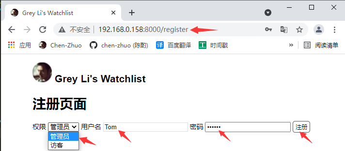

点击注册后，跳回主页，并提示“管理员已创建”：

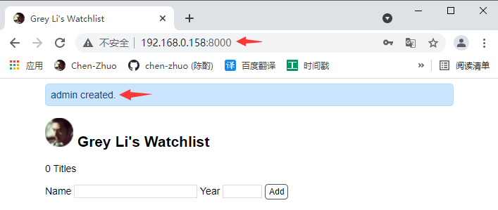

##### 访客注册

访问注册页面（选择“访客”，输入用户：Lisa，输入密码：123456）：

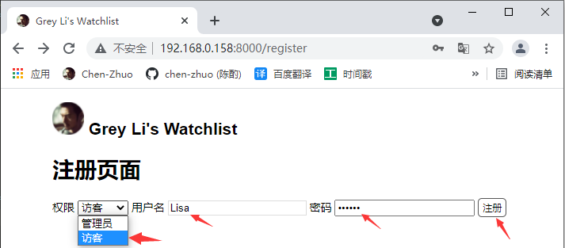

点击注册后，跳回主页，并提示“访客已创建”：

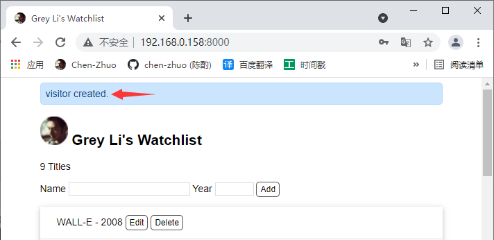

##### 数据表

查看数据库中的user表，可以看到刚刚注册用户，我们可根据“name”字段来判定用户类型：

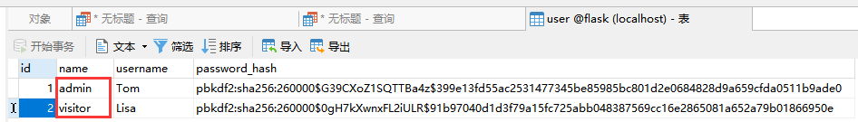

### 登录验证

##### Flask-Login

扩展 [Flask-Login](https://github.com/maxcountryman/flask-login) 提供了实现用户认证需要的各类功能函数，我们将使用它来实现程序的用户认证，首先来安装它：

```
pip install flask-login
```

这个扩展的初始化步骤稍微有些不同，除了实例化扩展类之外，我们还要实现一个“用户加载回调函数”，具体代码如下所示：

```python
from flask_login import LoginManager

login_manager = LoginManager(app)  # 实例化扩展类

@login_manager.user_loader
def load_user(user_id):  # 创建用户加载回调函数，接受用户ID作为参数
    user = User.query.get(int(user_id))  # 用ID作为User模型的主键查询对应的用户
    return user  # 返回用户对象
```

Flask-Login 提供了一个 `current_user` 变量，注册这个函数的目的是，当程序运行后，如果用户已登录， `current_user` 变量的值会是当前用户的用户模型类记录。

另一个步骤是让存储用户的 User 模型类继承 Flask-Login 提供的 `UserMixin` 类：

```python
from flask_login import UserMixin
class User(db.Model, UserMixin):    # ...
```

继承这个类会让 `User` 类拥有几个用于判断认证状态的属性和方法，其中最常用的是 `is_authenticated` 属性：如果当前用户已经登录，那么 `current_user.is_authenticated` 会返回 `True`， 否则返回 `False`。有了 `current_user` 变量和这几个验证方法和属性，我们可以很轻松的判断当前用户的认证状态。

##### 登录页面

新建一个 `login.html` 登录页面：

```html



<h3>Login</h3>
<form method="post">
    Username<br>
    <input type="text" name="username" required><br><br>
    Password<br>
    <!-- 密码输入框的 type 属性使用 password，会将输入值显示为圆点 -->
    <input type="password" name="password" required><br><br>
    <input class="btn" type="submit" name="submit" value="Submit">
</form>

```

新建 `login` 视图函数：

```python
from flask_login import login_user

# ...

@app.route('/login', methods=['GET', 'POST'])
def login():
    if request.method == 'POST':
        username = request.form['username']
        password = request.form['password']

        if not username or not password:
            flash('Invalid input.')
            return redirect(url_for('login'))

        user = User.query.filter(User.username == username).first()
        # 验证用户名是否存在，密码是否一致
        if user and user.validate_password(password):
            login_user(user)  # 登入用户
            flash('Login success.')
            return redirect(url_for('index'))  # 重定向到主页

        flash('Invalid username or password.')  # 如果验证失败，显示错误消息
        return redirect(url_for('login'))  # 重定向回登录页面

    return render_template('login.html')
```

访问登录页面，输入前面注册用户Tom：

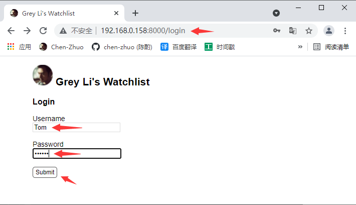

点击登录以后，跳转到主页并提示”登录成功“：

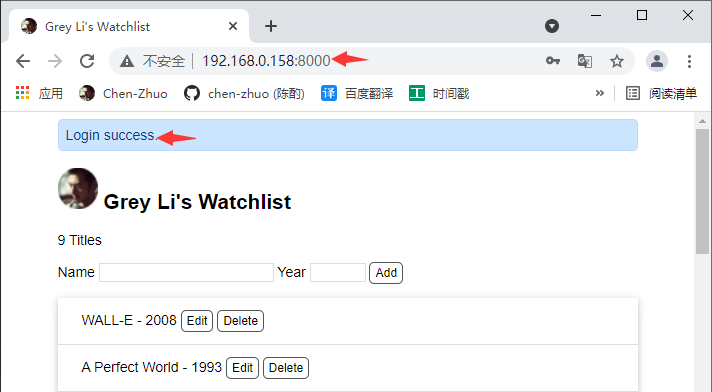

##### 视图保护

**在 Web 程序中，有些页面或 URL 不允许未登录的用户访问，而页面上有些内容则需要对未登陆的用户隐藏，这就是认证保护。**

在视图保护层面来说，未登录用户不能执行下面的操作：

- 执行添加操作
- 执行注销操作

**对于不允许未登录用户访问的视图，只需要为视图函数附加一个 `login_required` 装饰器就可以将未登录用户拒之门外。**以修改操作视图为例：

```Python
@app.route('/movie/edit/<int:movie_id>', methods=['GET', 'POST'])
@login_required  # 登录保护
def edit(movie_id):
	# ...
```

**添加了这个装饰器后，如果未登录的用户访问对应的 URL，Flask-Login 会把用户重定向到登录页面，并显示一个错误提示。**为了让这个重定向操作正确执行，我们还需要把 `login_manager.login_view` 的值设为我们程序的登录视图端点（函数名），把下面这一行代码放到 `login_manager` 实例定义下面即可：

```
login_manager.login_view = 'login'
```

> **提示** 如果你需要的话，可以通过设置 `login_manager.login_message` 来自定义错误提示消息。

现在我们直接访问修改操作视图，在未登录的状态下就会跳转到login登录页面上，并提示`Please log in to access this page.`：

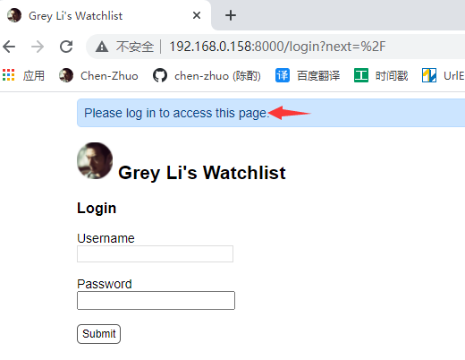

创建新条目的操作稍微有些不同，因为对应的视图同时处理显示页面的 GET 请求和创建新条目的 POST 请求，我们仅需要禁止未登录用户创建新条目，因此不能使用 `login_required`，而是在函数内部的 POST 请求处理代码用 `current_user.is_authenticated` 进行过滤：

```python
from flask_login import login_required, current_user

# ...

@app.route('/', methods=['GET', 'POST'])
def index():
    if request.method == 'POST':
        if not current_user.is_authenticated:  # 如果当前用户未认证
            flash('Please logging.')
            return redirect(url_for('login'))  # 重定向到登录页
        # ...
```

现在我们在未登录状态下访问主页，输入信息，点击”add“：

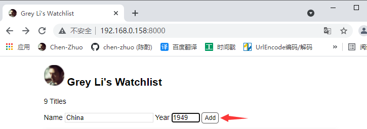

页面自动跳转到登录页面，并提示”Please logging.“：

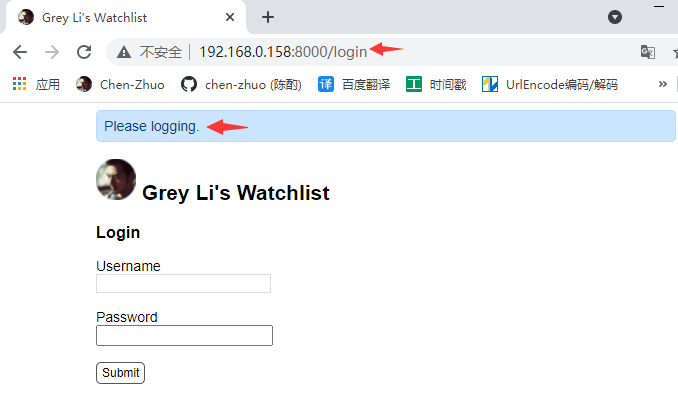

##### 模板保护

认证保护的另一形式是页面模板内容的保护。比如，不能对未登录用户显示下列内容：

- 创建新条目表单
- 编辑按钮
- 删除按钮

这几个元素的定义都在首页模板（index.html）中，以创建新条目表单为例，我们在表单外部添加一个 `if` 判断：

```html
<!-- 在模板中可以直接使用 current_user 变量 -->

<form method="post">
    Name <input type="text" name="title" autocomplete="off" required>
    Year <input type="text" name="year" autocomplete="off" required>
    <input class="btn" type="submit" name="submit" value="Add">
</form>

```

在模板渲染时，会先判断当前用户的登录状态（`current_user.is_authenticated`）。如果用户没有登录（`current_user.is_authenticated` 返回 `False`），就不会渲染表单部分的 HTML 代码。

现在我们以未登录的状态再去访问主页，就没有”Add“按钮了：

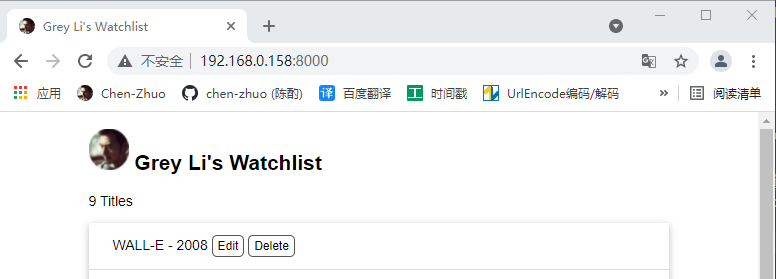

##### 用户权限

用户权限就是针对不同用户给予不同的权限，比方说：

- 未登录用户，Add、Edit、Delete按钮不可见
- 访客用户，Add按钮可见有效，但Edit、Delete按钮可见无效
- 管理员用户，Add、Edit、Delete按钮可见有效

修改、删除按钮必须要登录可见，但登录的用户如果是访客，点击按钮无效；如果是管理员，点击按钮有效。

修改首页模板（index.html）：

```html
<form class="inline-form" method="post" action="{{ url_for('delete', movie_id=movie.id) }}">
    {{ movie.title }} - {{ movie.year }}
    
        <a class="btn" href="{{ url_for('edit', movie_id=movie.id) }}">Edit</a>
        <input class="btn" type="submit" name="delete" value="Delete" onclick="return confirm('Are you sure?')">
    
</form>
```

修改编辑视图和删除视图：

```python
@app.route('/movie/edit/<int:movie_id>', methods=['GET', 'POST'])
@login_required  # 登录保护
def edit(movie_id):
    movie = Movie.query.get_or_404(movie_id)
    # 验证权限
    if current_user.name=='visitor': # 如果用户是访客
        flash('Insufficient permissions.')
        return redirect(url_for('index'))  # 重定向回主页
    if request.method == 'POST':
        title = request.form['title']
        year = request.form['year']

        if not title or not year or len(year) != 4 or len(title) > 60:
            flash('Invalid input.')
            return redirect(url_for('edit', movie_id=movie_id))  

        movie.title = title
        movie.year = year
        db.session.commit()  
        flash('Item updated.')
        return redirect(url_for('index'))  

    return render_template('edit.html', movie=movie)  

@app.route('/movie/delete/<int:movie_id>', methods=['POST'])
@login_required  # 登录保护
def delete(movie_id):
    movie = Movie.query.get_or_404(movie_id)  
    # 验证权限
    if current_user.name=='visitor': # 如果用户是访客
        flash('Insufficient permissions.')
        return redirect(url_for('index'))  # 重定向回主页
    db.session.delete(movie)  
    db.session.commit()  
    flash('Item deleted.')
    return redirect(url_for('index'))  
```

现在我们以未登录的状态再去访问主页，就没有Add、Edit、Delete按钮了：

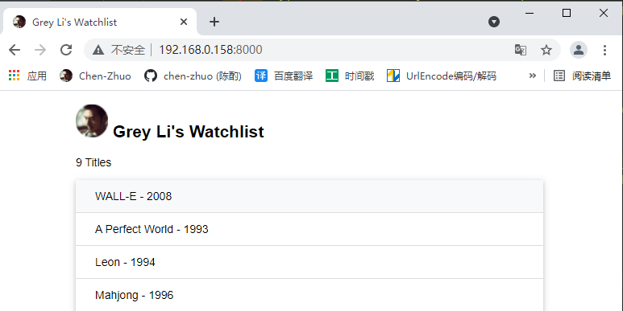

现在我们登录前面注册的访客用户Lisa：

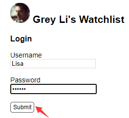

登陆后，跳转到首页并显示全部按钮，现在输入信息，点击”Add“按钮：

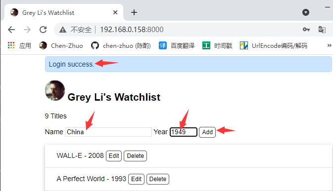

在最下方出现条目，说明访客可以使用添加功能：

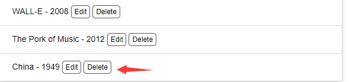

现在我们来点击”Edit“、”Delete“按钮，就会重定向到主页，并提示”权限不足“：

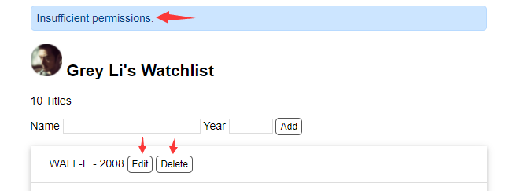

现在我们访问登录页面，登录前面注册管理员用户Tom：

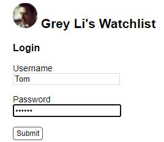

点击”Edit“按钮，修改信息进行更新：

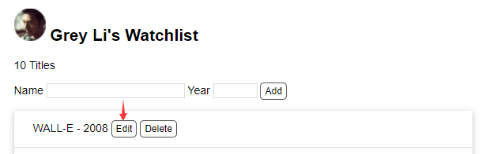

点击”update“按钮更新：

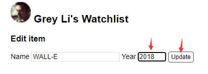

跳转到主页，看到信息更新成功，说明管理员可以使用编辑功能（同样也可以使用删除功能）：

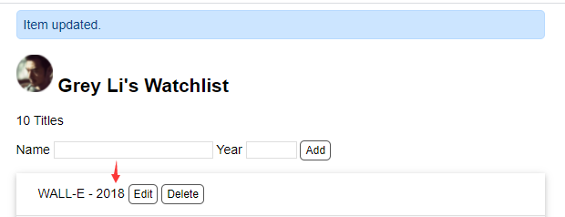

##### 登出函数

和登录相对，登出操作则需要调用 `logout_user()` 函数，使用下面的视图函数实现：

```python
from flask_login import login_required, logout_user
# ...
@app.route('/logout')
@login_required  # 用于视图保护，后面会详细介绍
def logout():    
    logout_user()  # 登出用户    
    flash('Goodbye.')    
    return redirect(url_for('index'))  # 重定向回首页
```

