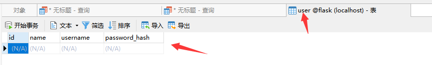

# Flask用户认证

目前为止，虽然程序的功能大部分已经实现，但还缺少一个非常重要的部分——用户认证保护。页面上的编辑和删除按钮是公开的，所有人都可以看到。假如我们现在把程序部署到网络上，那么任何人都可以执行编辑和删除条目的操作，这显然是不合理的。

**用户认证功能：把用户分成两类，一类是管理员，通过用户名和密码登入程序，可以执行数据相关的操作；另一个是访客，只能浏览页面。**

##### 密码保护

**首先有一点我们必须要知道，就是我们的账号和密码是保存在数据库当中的。**例如，游戏的账号和密码就是保存在游戏所属公司服务器的数据库当中的，当我们进行登录时，就会在数据库中根据账号查找对应的密码进行判定是否一致，从而是否让你成功登录。

**但是把密码明文存储在数据库中是极其危险的，假如攻击者窃取了你的数据库，那么用户的账号和密码就会被直接泄露。更保险的方式是对每个密码进行计算生成独一无二的密码散列值，这样即使攻击者拿到了散列值，也几乎无法逆向获取到密码。**

Flask 的依赖 Werkzeug 内置了用于生成和验证密码散列值的函数：

```python
from werkzeug.security import generate_password_hash, check_password_hash

# werkzeug.security.generate_password_hash()用来为给定的密码生成密码散列值
pw_hash = generate_password_hash('dog')  # 为密码 dog 生成密码散列值
print(pw_hash)  # 查看密码散列值

# werkzeug.security.check_password_hash()用来检查给定的散列值和密码是否对应
print(check_password_hash(pw_hash, 'dog'))  # 检查散列值是否对应密码 dog
print(check_password_hash(pw_hash, 'cat'))  # 检查散列值是否对应密码 cat

'''
输出：
pbkdf2:sha256:260000$6MysvD9FJTKQlu9E$dcaf73224ffdff0fcad335a3a68045fa53a97896af14d087a432498a43a6a8a5
True
False
'''
```

我们在存储用户信息的 `User` 模型类添加 `username` 字段和 `password_hash` 字段，分别用来存储登录所需的用户名和密码散列值，同时添加两个方法来实现设置密码和验证密码的功能：

```python
from werkzeug.security import generate_password_hash, check_password_hash

class User(db.Model):
    id = db.Column(db.Integer, primary_key=True)
    name = db.Column(db.String(20))
    username = db.Column(db.String(20))  # 用户名
    password_hash = db.Column(db.String(128))  # 密码散列值

    def set_password(self, password):  # 用来设置密码的方法，接受密码作为参数
        self.password_hash = generate_password_hash(password)  # 将生成的密码保持到对应字段

    def validate_password(self, password):  # 用于验证密码的方法，接受密码作为参数
        return check_password_hash(self.password_hash, password)  # 返回布尔值
```

因为模型（表结构）发生变化，我们需要重新生成数据表（这会清空数据），运行 `mysql_model.py` 文件：

```python
from hello_flask import db

class User(db.Model):  # 表名将会是 user
    id = db.Column(db.Integer, primary_key=True)  # 主键
    name = db.Column(db.String(20))  # 名字
    username = db.Column(db.String(20))  # 用户名
    password_hash = db.Column(db.String(128))  # 密码散列值

class Movie(db.Model):  # 表名将会是 movie
    id = db.Column(db.Integer, primary_key=True)  # 主键
    title = db.Column(db.String(60))  # 电影标题
    year = db.Column(db.String(4))  # 电影年份

def create_table():
    db.drop_all()
    db.create_all()

if __name__ == '__main__':
    create_table()
```



##### 管理员账户

我们可以来创建一个管理员账户，下面是实现这个功能的 `admin()` 函数：

```python


```

