# Echarts图表

## 简介

### 概况

Echarts 是一个由百度开源的数据可视化，凭借着良好的交互性，精巧的图表设计，得到了众多开发者的认可。而 Python 是一门富有表达力的语言，很适合用于数据处理。当数据分析遇上数据可视化时，pyecharts 诞生了。

pyecharts官方文档：https://pyecharts.org/

### 特性

- 简洁的 API 设计，使用如丝滑般流畅，支持链式调用
- 囊括了 30+ 种常见图表，应有尽有
- 支持主流 Notebook 环境，Jupyter Notebook 和 JupyterLab
- 可轻松集成至 Flask，Django 等主流 Web 框架
- 高度灵活的配置项，可轻松搭配出精美的图表
- 详细的文档和示例，帮助开发者更快的上手项目
- 多达 400+ 地图文件以及原生的百度地图，为地理数据可视化提供强有力的支持


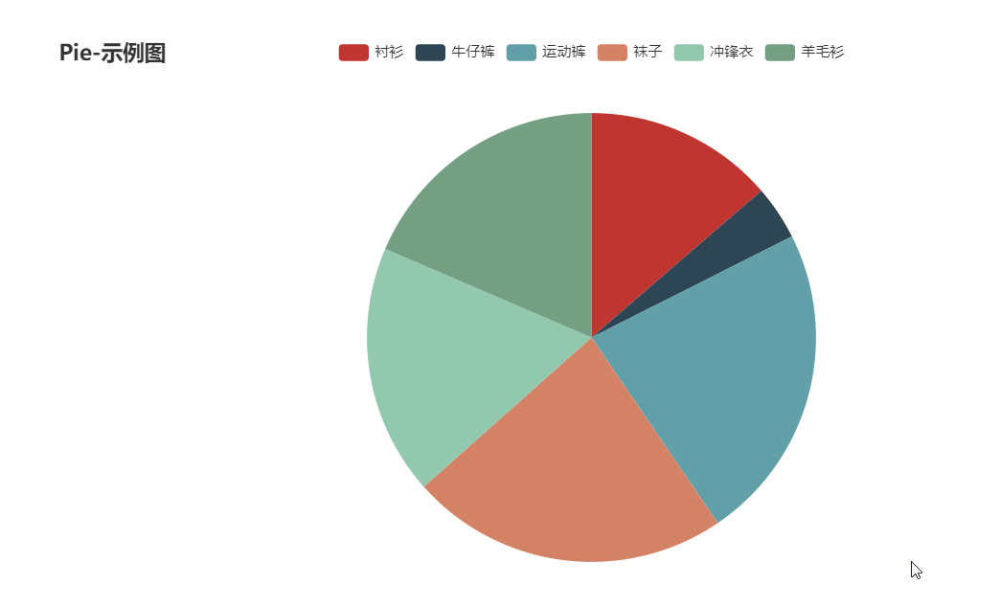


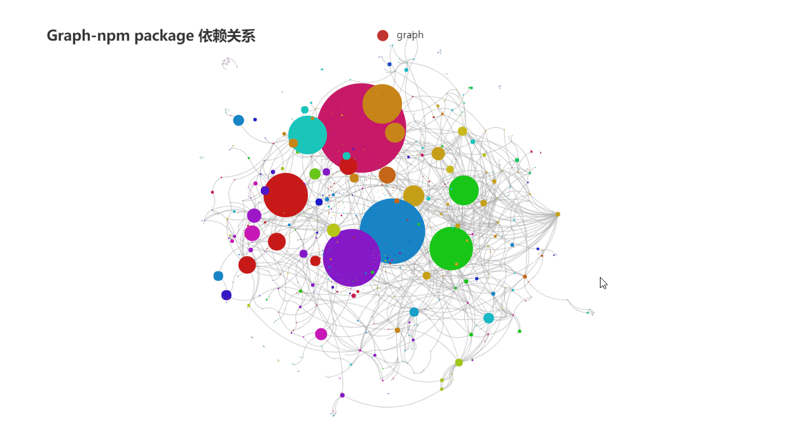

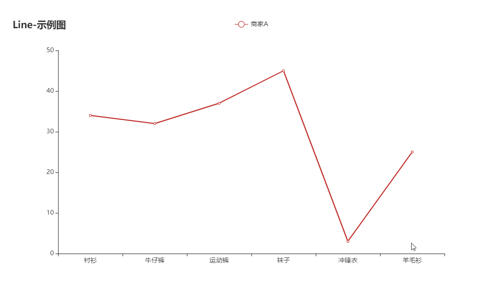

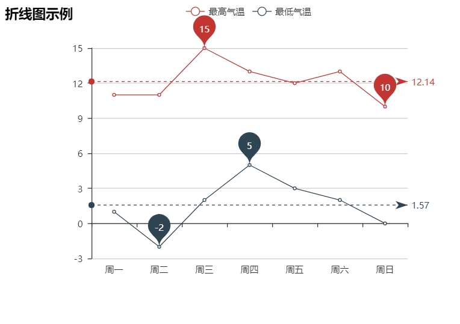


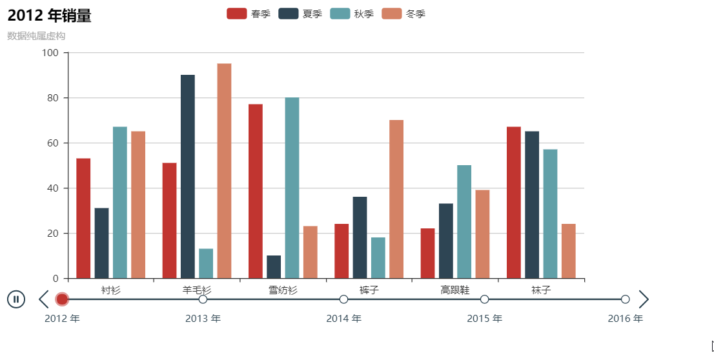


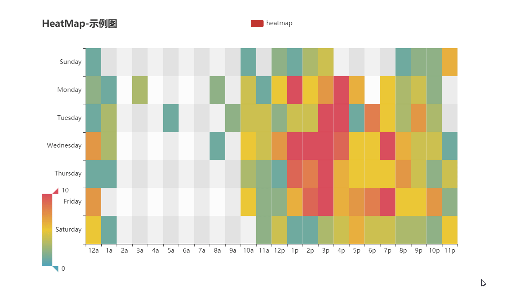

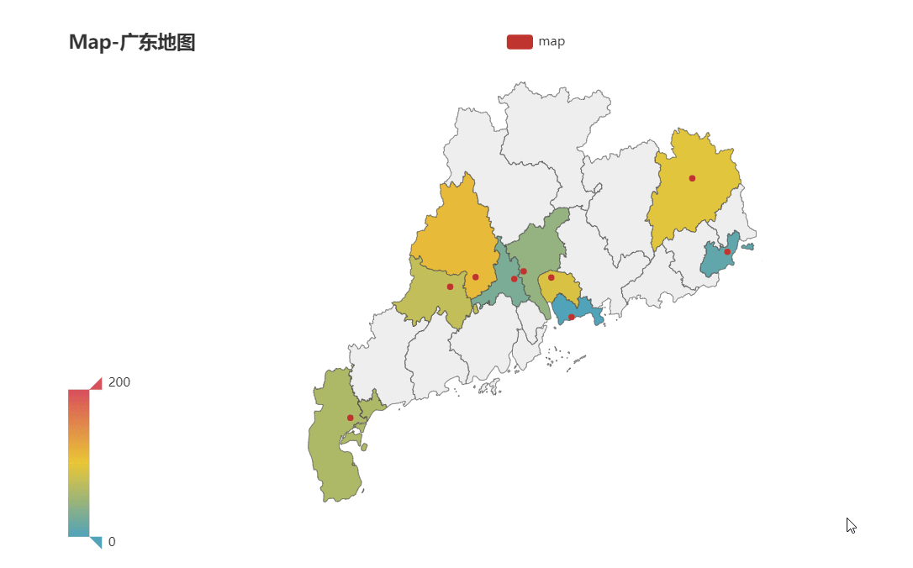


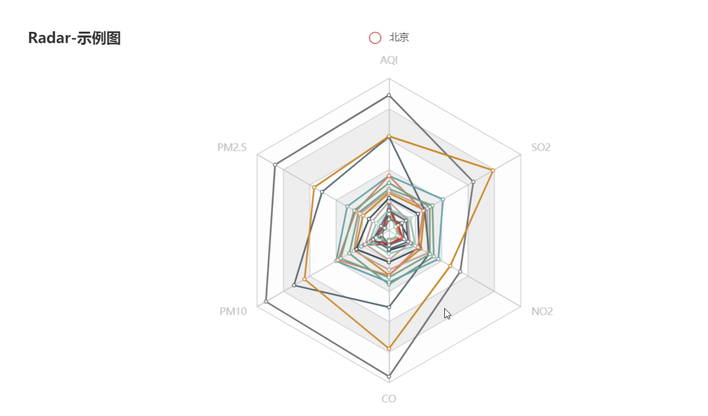


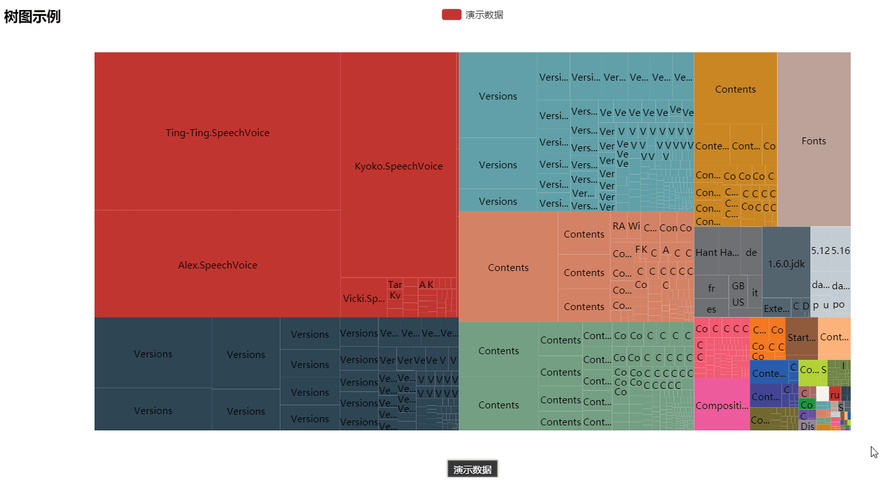


## 快速上手

### 下载安装

#### pip 安装

```shell
$ pip(3) install pyecharts
```

#### 源码安装

```shell
$ git clone https://github.com/pyecharts/pyecharts.git
$ cd pyecharts
$ pip install -r requirements.txt
$ python setup.py install
# 或者执行 python install.py
```

### 第一个图表

```python
from pyecharts.charts import Bar
# 使用options配置项，在pyecharts中，一切皆Options。
from pyecharts import options as opts

# 写法一：pyecharts常见写法
bar = Bar()
bar.add_xaxis(["衬衫", "羊毛衫", "雪纺衫", "裤子", "高跟鞋", "袜子"])
bar.add_yaxis("商家A", [5, 20, 36, 10, 75, 90])
bar.set_global_opts(title_opts=opts.TitleOpts(title="主标题", subtitle="副标题"))

# 写法二：pyecharts所有方法均支持链式调用
bar = (
    Bar()
    .add_xaxis(["衬衫", "羊毛衫", "雪纺衫", "裤子", "高跟鞋", "袜子"])
    .add_yaxis("商家A", [5, 20, 36, 10, 75, 90])
    .set_global_opts(title_opts={"text": "主标题", "subtext": "副标题"})
)

# render 会生成本地 HTML 文件，默认会在当前目录生成 render.html 文件
# 也可以传入路径参数，如 bar.render("mycharts.html")
bar.render()
```

?> Note: 在使用 Pandas&Numpy 时，请确保将数值类型转换为 python 原生的 int/float。比如整数类型请确保为 int，而不是 numpy.int32

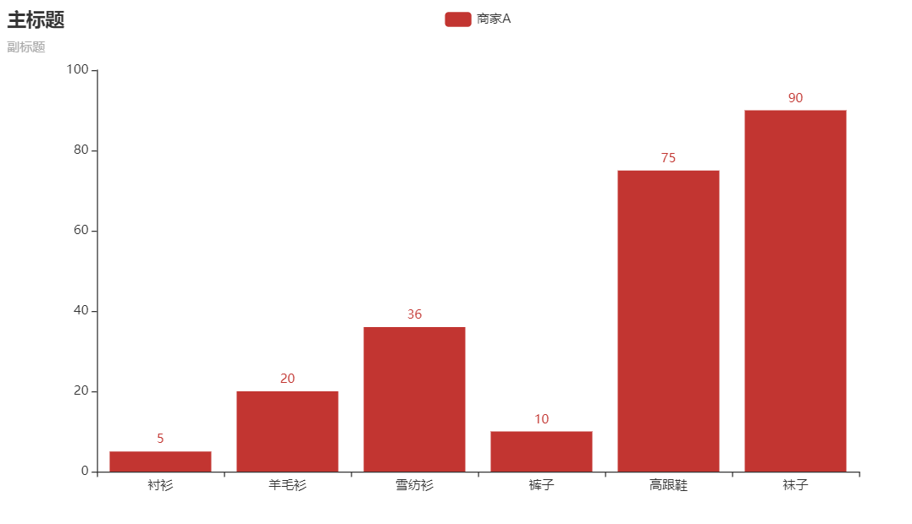

### 主题风格

pyecharts 内置提供了 10+ 种不同的风格，另外也提供了便捷的定制主题的方法。

```python
from pyecharts.charts import Bar
from pyecharts.globals import ThemeType

Bar(init_opts=opts.InitOpts(theme=ThemeType.WHITE)) # 默认主题，等价于Bar()
Bar(init_opts=opts.InitOpts(theme=ThemeType.LIGHT))
Bar(init_opts=opts.InitOpts(theme=ThemeType.DARK))
Bar(init_opts=opts.InitOpts(theme=ThemeType.CHALK))
Bar(init_opts=opts.InitOpts(theme=ThemeType.ESSOS))
Bar(init_opts=opts.InitOpts(theme=ThemeType.INFOGRAPHIC))
Bar(init_opts=opts.InitOpts(theme=ThemeType.MACARONS))
Bar(init_opts=opts.InitOpts(theme=ThemeType.PURPLE_PASSION))
Bar(init_opts=opts.InitOpts(theme=ThemeType.ROMA))
Bar(init_opts=opts.InitOpts(theme=ThemeType.ROMANTIC))
Bar(init_opts=opts.InitOpts(theme=ThemeType.SHINE))
Bar(init_opts=opts.InitOpts(theme=ThemeType.VINTAGE))
Bar(init_opts=opts.InitOpts(theme=ThemeType.WALDEN))
Bar(init_opts=opts.InitOpts(theme=ThemeType.WESTEROS))
Bar(init_opts=opts.InitOpts(theme=ThemeType.WONDERLAND))
```

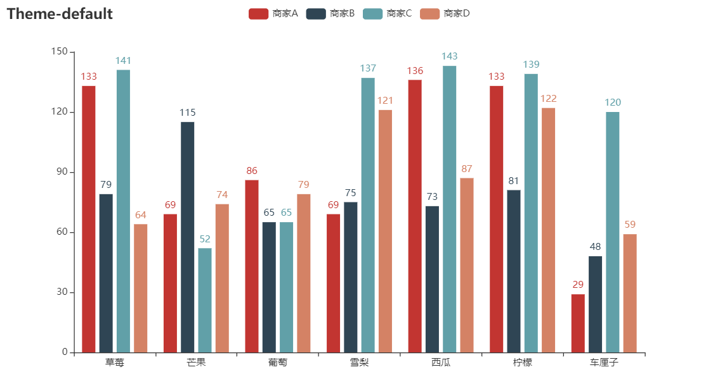


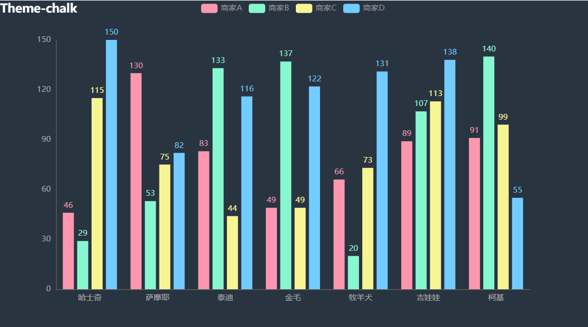


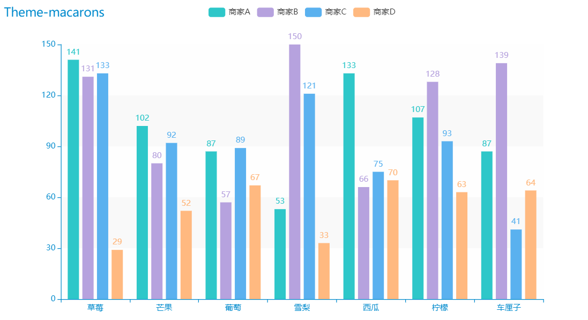

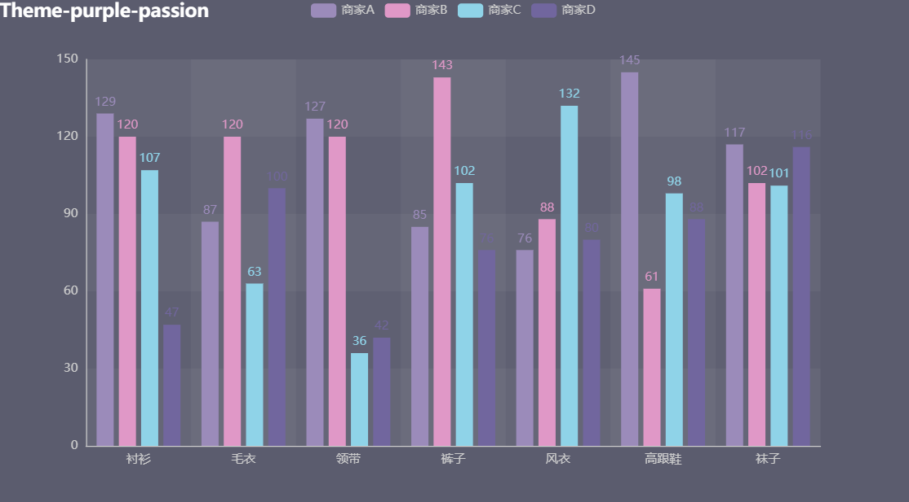

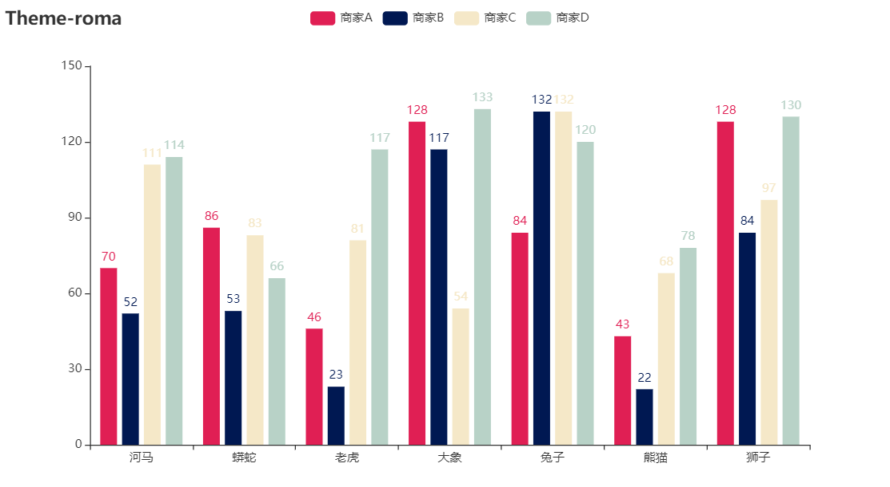


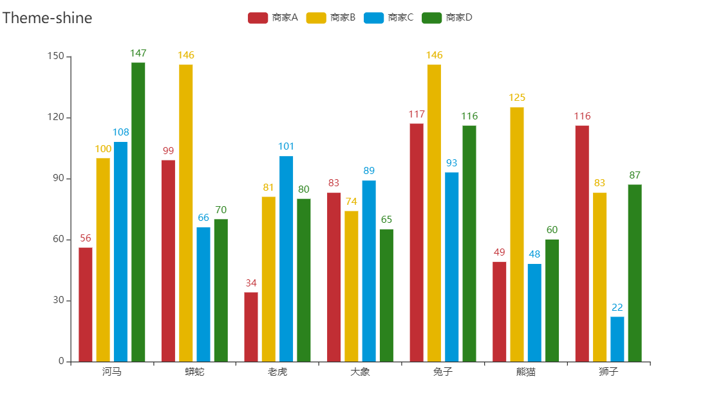

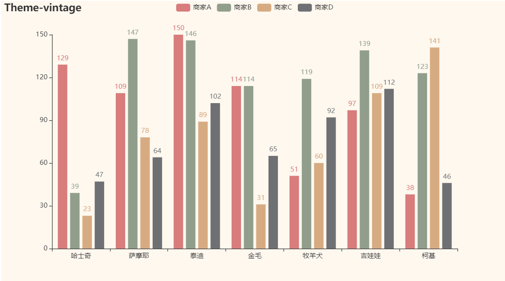

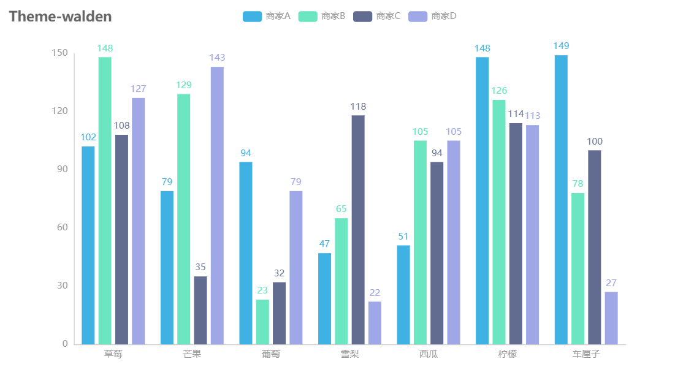


