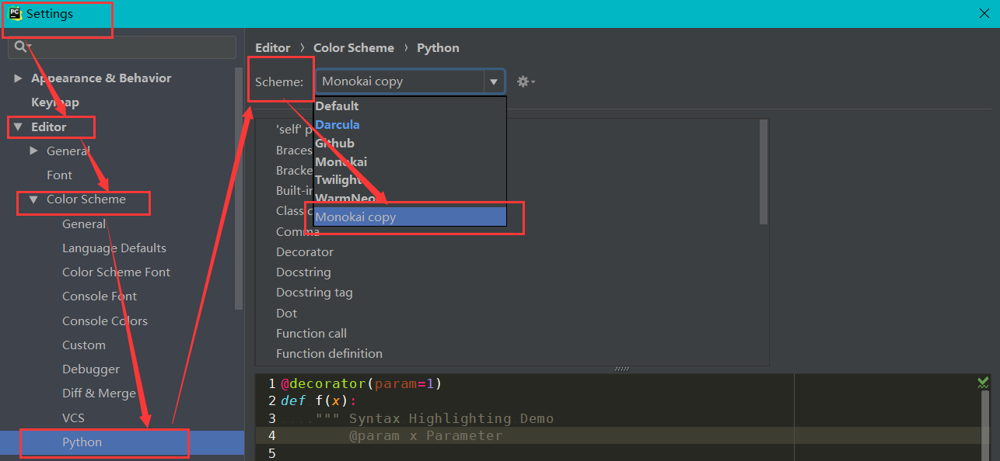

# *PyCharm* 开发工具

*PyCharm* 是一个使用 `Python` 作为开发语言时提高效率的工具。

##### *PyCharm* 快捷键

```
ctrl+/  ---  注释（注释掉当前行或选择的内容）

ctrl+d  ---  复制粘贴（复制当前行代码并粘贴下面）

ctrl+y  ---  删除（删除当前行代码）
```

##### 项目文件夹

使用 *PyCharm* 打开一个普通文件夹时，会在这个文件夹下面生成了一个名称为 `.idea` 文件夹，*PyCharm* 通过该文件夹来标记所在文件夹为项目文件夹。若不想成为项目文件夹，删除 `.idea` 文件夹即可。

**提醒：使用PyCharm查看文件夹列表时，项目文件夹会带有一个小黑块。**


##### *Run*

*PyCharm* 下面的 *Run* 窗口就是程序运行结果的展示窗口。


##### *Terminal*

*PyCharm* 下面的 *Terminal* 窗口就相当 *CMD* 命令行窗口，执行相应的命令。


##### 个性化配色

通过下面6个步骤来进行配色：

1. *File --- Settings --- Apperance & Behavior --- Appearance --- Theme: Darcula*
   

2. *File --- Settings --- Editor --- Color Scheme Font --- Scheme: Monokai*
   

3. 选择 *Monokai* 后，点击右边的“齿轮”，选择 *Duplicate*，备份原 *Monokai* 方案。
   

4. 再选择新创建的 *Monokai Copy*。

5. *File --- Settings --- Editor --- Color Scheme --- Python --- Scheme: Monokai copy*
   

6. *File --- Settings --- Editor --- Color Scheme Font --- Use color scheme font*（勾选）
   

完成配色后的代码：


