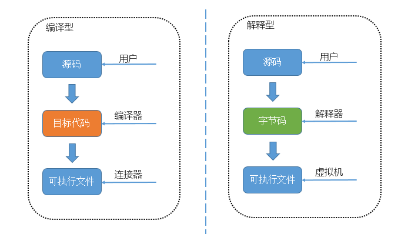
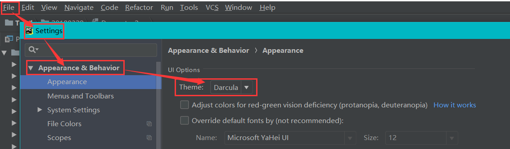
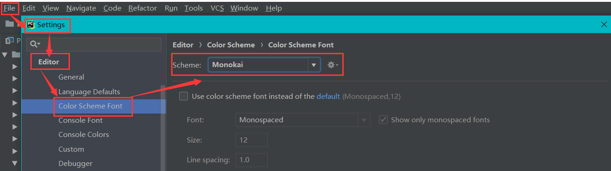
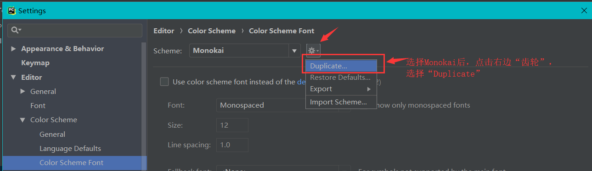
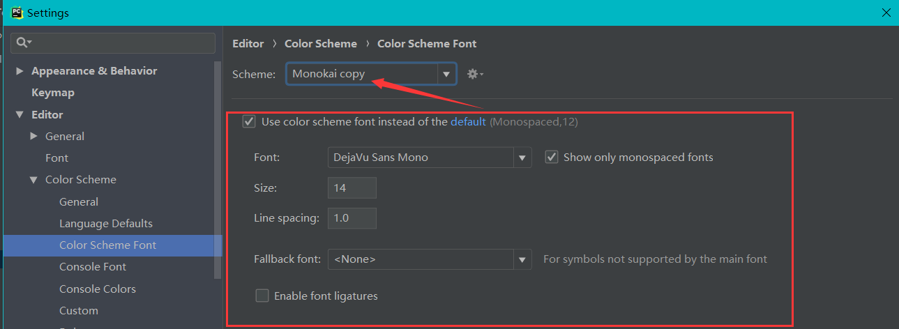
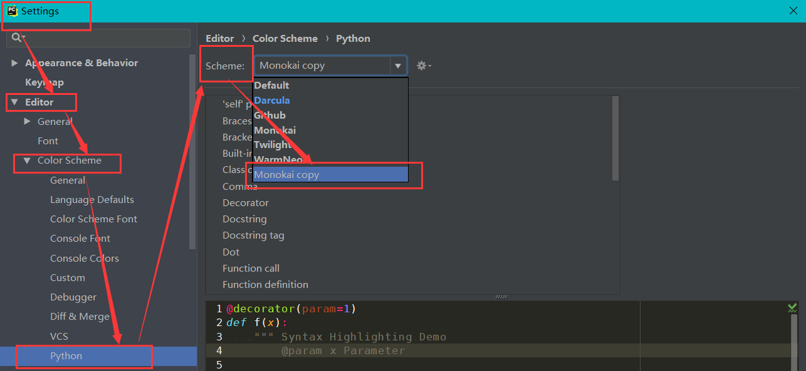
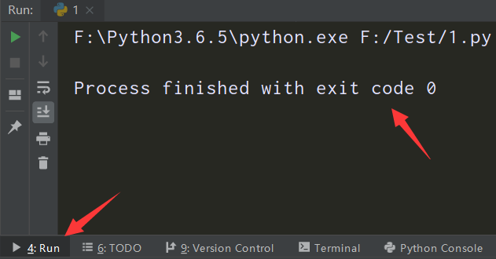
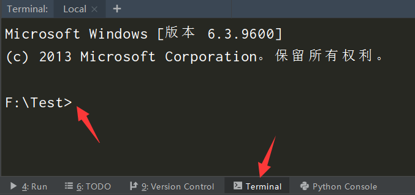

# *Python*、*PyCharm*

### `Python` 

##### 语言类型

编程语言一般分为两大类：**编译型语言**、**解释型语言**。

**编译型语言**

编译型语言：程序执行前需要一个专门的编译过程，把程序编译成为机器语言的文件，运行时不再编译，直接使用编译的结果。

编译型语言有 `C/C++` 等

优点：程序执行效率高

缺点：依赖编译器，跨平台性比较差

执行流程：

1. 用户提交源码。
2. 编译器将源码编译成目标代码，但是这时候还不能执行，因为缺少启动代码和相关的库代码。
3. 针对2中的问题，连接器上场了，他到以上缺少的代码，并进行组装成最后机器可以直接运行的可执行文件。

**解释型语言**

解释型语言：不需要编译，但在运行程序时，由解释器先翻译成中间代码，再运行。	

解释型语言有 `Python/JavaScript/Shell` 等

优点：程序不进行预先编译，以文本方式存储程序代码。

缺点：每执行一次都要翻译一次，效率比较低。

执行流程：

1. 用户提交源码。
2. 解释器将源码转化为字节码，在 `Python` 中一般为 `.pyc` 文件，这个时候机器不能执行字节码的。
3. 在 `Python` 中由虚拟机来执行字节码，这里需要强调一下，这个虚拟机不是 `vmware` 或者 `virtualbox` 的虚拟机概念。由于字节码一般是不依赖于操作系统，所以可以跨平台运行，有虚拟机就可以搞定了。



##### `Python` 优缺点

`Python` 的优点很多，简单的可以总结为以下几点。

1. 简单和明确，做一件事只有一种方法。
2. 学习曲线低，跟其他很多语言相比，`Python` 更容易上手。
3. 开放源代码，拥有强大的社区和生态圈。
4. 解释型语言，天生具有平台可移植性。
5. 对两种主流的编程范式（面向对象编程和函数式编程）都提供了支持。
6. 可扩展性和可嵌入性，例如在 `Python` 中可以调用 `C/C++` 代码。
7. 代码规范程度高，可读性强，适合有代码洁癖和强迫症的人群。

`Python` 的缺点主要集中在以下几点。

1. 执行效率稍低，因此计算密集型任务可以由 `C/C++` 编写。
2. 代码无法加密，但是现在很多公司都不销售卖软件而是销售服务，这个问题会被弱化。
3. 在开发时可以选择的框架太多（如 `Web` 框架就有100多个），有选择的地方就有错误。

**应用领域**

目前 `Python` 在 `Web` 应用开发、云基础设施、`DevOps`、网络数据采集（爬虫）、数据分析挖掘、机器学习等领域都有着广泛的应用，因此也产生了Web后端开发、数据接口开发、自动化运维、自动化测试、科学计算和可视化、数据分析、量化交易、机器人开发、自然语言处理、图像识别等一系列相关的职位。

##### `Python` 版本

`Python` 的版本号分为三段，形如 `A.B.C`

`A` 表示大版本号，一般当整体重写，或出现不向后兼容的改变时，增加 `A`；

`B` 表示功能更新，出现新功能时增加 `B`；

`C` 表示小的改动（如修复了某个 `Bug`），只要有修改就增加 `C`；

##### `Python` 解释器

**解释器**：**一种能编程语言一行一行直接转译运行的电脑程序**。

**解释器运行流程**：解释器不会一次把整个程序转译出来，只像一位“中间人”，每次运行程序时都要先转成另一种语言再作运行，因此解释器的程序运行速度比较缓慢。它每转译一行程序叙述就立刻运行，然后再转译下一行，再运行，如此不停地进行下去。

`Python` 属于解释型语言，在运行程序（`.py` 文件）时，由解释器先翻译成中间代码，再运行。

`Python` 解释器总体上分为以下几种：

**CPython**

CPython是官方版本的解释器，因为是用 `C` 语言开发的，所以叫CPython，也是使用最广的Python解释器。

CPython解释器将 `Python` 源码编译成 `CPython` 字节码，即将 `.py` 文件编译成 `.pyc` 文件，再由虚拟机执行。

**特点**：`Python` 标准解释器，使用范围最广。

**IPython**

IPython是基于CPython的解释器，在交互方式上有所增强，但是执行Python代码的功能和CPython是完全一样的。好比很多国产浏览器虽外观不同，但内核其实都是调用了 `IE`。

CPython用 `>>>` 作为提示符，而IPython用 `In [序号]:` 作为提示符。

**特点**：基于CPython的解释器，增强了交互方式。

**Jython**

Jython是运行在Java平台上的Python解释器，由 `Java` 语言编写。Jython将Python源码编译成 `JVM` 字节码，由  `JVM` 执行对应的字节码。

Jython能很好的与 `JVM` 集成，比如利用JVM的垃圾回收和JIT，直接导入并调用JVM上其他语言编写的库和函数。

**特点**：能很好的与 `JVM` 集成，并调用 `JVM` 上其他语言编写的库和函数。

**IronPython**

IronPython是运行在微软 `.Net` 平台上的Python解释器，由 `C#` 语言编写，IronPython和Jython类似，可以直接把Python代码编译成.Net的字节码。

IronPython将源码编译成TODO CLR，同样能很好的与 `.NET` 平台集成。即与Jython相同，可以利用.NET框架的JIT、垃圾回收等功能，能导入并调用.NET上其他语言编写的库和函数。IronPython默认使用Unicode字符串。

**特点**：能很好的与 `.NET` 平台集成，能导入并调用 `.NET` 上其他语言编写的库和函数。

**PyPy**

PyPy是使用RPython实现解释器，采用[Tracing JIT技术](https://links.jianshu.com/go?to=http%3A%2F%2Fen.wikipedia.org%2Fwiki%2FJust-in-time_compilation)，对Python代码进行动态编译（注意不是解释），所以可以显著提高Python代码的执行速度。

绝大部分Python代码都可以在PyPy下运行，但对第三方模块的支持不够。无法很好的支持使用CPython的 `C API` 编写的扩展，这就导致相同的Python代码在两种解释器下执行可能会有不同的结果。

**特点**：显著提高代码执行速度，但对模块的支持不够，在不同的解释器下执行可能会有不同的结果。

##### `Python` 内存管理

`Python` 的内存管理是由解释器负责的，有三大机制：对象的引用计数、垃圾回收、内存池。

**对象引用计数**

`Python` 内部使用引用计数，来追踪内存中的对象，所有对象都有引用计数。

引用计数增加：

1. 一个对象分配一个新名称
2. 将其放入一个容器中（如列表、元组或字典）

引用计数减少：

1. 使用 `del` 语句对对象别名显示的销毁
2. 引用超出作用域或被重新赋值

**垃圾回收**

当一个对象的引用计数归零时，它将被垃圾收集机制处理掉。

**内存池**

为了加速Python的执行效率，Python提供了对内存的垃圾收集机制，将不用的内存放到内存池而不是返回给操作系统，用于管理对小块内存的申请和释放。

##### `Python` 文件

`Python` 文件是以 `.py` 为后缀名的，一个 `.py` 文件就是一个模块。

库：具有相关功能模块的集合。

库也是 `Python` 的特色，即具有强大的标准库、第三方库以及自定义模块

**标准库**

标准库：安装 `python` 的时候默认自带的库。

常见的有：`os` 系统操作，`time` 时间，`random` 随机，`re` 正则，`logging` 日志，`queue` 队列，`threading` 线程，`multiprocessing` 进程

**第三方库**

第三方库：第三方机构发布的特定功能的模块，需要下载安装后才能使用的库。

常见的有：`lxml` 网页解析库，`scrapy` 爬虫框架，`django` 网站框架，`flask` 网站框架，`virtualenv` 虚拟环境

**自定义模块**

自定义模块：用户自行编写的模块。

### *PyCharm*

*PyCharm* 是一个使用 `Python` 作为开发语言时提高效率的工具。

##### *PyCharm* 快捷键

```
ctrl+/  ---  注释（注释掉当前行或选择的内容）

ctrl+d  ---  复制粘贴（复制当前行代码并粘贴下面）

ctrl+y  ---  删除（删除当前行代码）
```

##### 项目文件夹

使用 *PyCharm* 打开一个普通文件夹时，会在这个文件夹下面生成了一个名称为 `.idea` 文件夹，*PyCharm* 通过该文件夹来标记所在文件夹为项目文件夹。若不想成为项目文件夹，删除 `.idea` 文件夹即可。

**提醒：使用PyCharm查看文件夹列表时，项目文件夹会带有一个小黑块。**


##### 个性化配色

通过下面6个步骤来进行配色：

1. *File --- Settings --- Apperance & Behavior --- Appearance --- Theme: Darcula*
   
2. *File --- Settings --- Editor --- Color Scheme Font --- Scheme: Monokai*
   
3. 选择 *Monokai* 后，点击右边的“齿轮”，选择 *Duplicate*，备份原 *Monokai* 方案。
   
4. 再选择新创建的 *Monokai Copy*。
5. *File --- Settings --- Editor --- Color Scheme --- Python --- Scheme: Monokai copy*
   
6. *File --- Settings --- Editor --- Color Scheme Font --- Use color scheme font*（勾选）
   

完成配色后的代码：


##### *Run*

*PyCharm* 下面的 *Run* 窗口就是程序运行结果的展示窗口。



##### *Terminal*

*PyCharm* 下面的 *Terminal* 窗口就相当 *CMD* 命令行窗口，执行相应的命令。



##### 第三方库安装命令

**第三方库**：网络上公共的开源库。

**第三库是先下载才能使用的，所以安装命令是针对第三方库的，所有的命令都在 *Terminal* 或 *cmd* 中执行**

```python
# 指令安装（从默认的pip源中下载，速度较慢）
pip install XXX(包名)

# 豆瓣镜像安装（从国内镜像源网站中下载，速度快）
pip install XXX(包名) -i http://pypi.douban.com/simple
# 豆瓣镜像安装（并添加信任地址）
pip install XXX(包名) -i http://pypi.douban.com/simple --trusted-host pypi.douban.com
# 阿里云镜像源安装（从国内镜像源网站中下载，速度快）
pip install XXX(包名) -i http://mirrors.aliyun.com/pypi/simple/

# 文件信息下载安装
# requirements.txt文件：
'''
selenium==3.6.0
Scrapy==1.5.1
pymongo==3.5.1
lxml==4.2.5
'''
# 根据requirements.txt文件里面的安装库的包名和版本号信息，来下载对应的包
pip install -r requirements.txt

#列出所有已安装的三方库
pip list   

# 列出当前已安装且过期的第三方库
pip list --outdated  

# 更新已安装的三方库
pip install --upgrade 库名  
```