# Python简介、安装环境

### Python简介

##### 编程语言

**计算机程序设计语言，通常简称为编程语言，是一组用来定义计算机程序的语法规则。**

编程语言一般分为两大类：**编译型语言**、**解释型语言**。

**编译型语言**

编译型语言：**程序执行前需要一个专门的编译过程，把程序编译成为机器语言的文件，运行时不再编译，直接使用编译的结果。**

优点：程序执行效率高

缺点：依赖编译器，跨平台性比较差

代表语言：`C`、`C++` 等

执行流程：

1. 用户提交源码。
2. 编译器将源码编译成目标代码，但是这时候还不能执行，因为缺少启动代码和相关的库代码。
3. 针对2中的问题，连接器上场了，找到以上缺少的代码，并进行组装成最后机器可以直接运行的可执行文件。

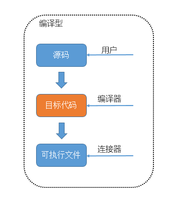

**解释型语言**

解释型语言：**不需要编译，但在运行程序时，由解释器先翻译成中间代码，再运行。**	

优点：程序不进行预先编译，以文本方式存储程序代码。

缺点：每执行一次都要翻译一次，效率比较低。

代表语言：`Python`、`JavaScript`、`Shell` 等

执行流程：

1. 用户提交源码。
2. 解释器将源码转化为字节码，在 Python 中一般为 `.pyc` 文件，这个时候机器不能执行字节码的。
3. 在 Python 中由虚拟机来执行字节码，这里需要强调一下，这个虚拟机不是 `vmware` 或者 `virtualbox` 的虚拟机概念。由于字节码一般是不依赖于操作系统，所以可以跨平台运行，有虚拟机就可以搞定了。

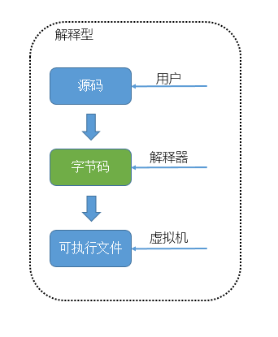

##### Python语言

**Python是一种跨平台的计算机程序设计语言。** 

**Python是一个高层次的结合了解释性、编译性、互动性和面向对象的脚本语言。**最初被设计用于编写自动化脚本(shell)，随着版本的不断更新和语言新功能的添加，越多被用于独立的、大型项目的开发。

Python的优点很多，总结为以下几点：

1. **简单明了，学习曲线低，比很多编程语言都容易上手。**
2. **开放源代码，拥有强大的社区和生态圈，尤其是在数据分析和机器学习领域。**
3. **解释型语言，天生具有平台可移植性，代码可以工作于不同的操作系统。**
4. 对两种主流的编程范式（面向对象编程和函数式编程）都提供了支持。
5. 代码规范程度高，可读性强，适合有代码洁癖和强迫症的人群。

Python的缺点主要集中在以下几点：

1. **执行效率稍低，对执行效率要求高的部分可以由其他语言（如：C、C++）编写。**
2. 代码无法加密，但是现在很多公司都不销售卖软件而是销售服务，这个问题会被弱化。
3. 在开发时可以选择的框架太多（如Web框架就有100多个），有选择的地方就有错误。

##### Python版本

Python 的版本号分为三段，形如 `A.B.C`

`A` 表示大版本号，一般当整体重写，或出现不向后兼容的改变时，增加 `A`；

`B` 表示功能更新，出现新功能时增加 `B`；

`C` 表示小的改动（如修复了某个 `Bug`），只要有修改就增加 `C`；

目前我们使用的Python 3.7.x的版本是在2018年发布的，如果对Python的历史感兴趣，可以阅读名为[《Python简史》](http://www.cnblogs.com/vamei/archive/2013/02/06/2892628.html)的网络文章。

##### 应用领域

目前 Python 在 `Web` 应用开发、云基础设施、`DevOps`、网络数据采集（爬虫）、数据分析挖掘、机器学习等领域都有着广泛的应用，因此也产生了Web后端开发、数据接口开发、自动化运维、自动化测试、科学计算和可视化、数据分析、量化交易、机器人开发、自然语言处理、图像识别等一系列相关的职位。

### 安装环境

##### Python解释器

**Python属于解释型语言，在运行程序（`.py` 文件）时，由解释器先翻译成中间代码，再运行。**

**解释器：一种能编程语言一行一行直接转译运行的电脑程序。**

运行流程：**解释器不会一次把整个程序转译出来，只像一位“中间人”，每次运行程序时都要先转成另一种语言再作运行，因此解释器的程序运行速度比较缓慢。它每转译一行程序叙述就立刻运行，然后再转译下一行，再运行，如此不停地进行下去。**

Python 解释器总体上分为以下几种：

**CPython**：**官方版本的解释器，也是标准解释器，因为是用 `C` 语言开发的，所以叫CPython，也是使用最广的Python解释器。**CPython解释器将 Python 源码编译成 `CPython` 字节码，即将 `.py` 文件编译成 `.pyc` 文件，再由虚拟机执行。

**IPython**：**基于CPython在交互方式上有所增强的解释器，在执行Python代码的功能和CPython是完全一样的。**CPython用 `>>>` 作为提示符，而IPython用 `In [序号]:` 作为提示符。

**Jython**：**由 `Java` 语言编写，运行在Java平台上的Python解释器。**Jython将Python源码编译成 `JVM` 字节码，由  `JVM` 执行对应的字节码。Jython能很好的与 `JVM` 集成，比如利用JVM的垃圾回收和JIT，直接导入并调用JVM上其他语言编写的库和函数。

**IronPython**：**由 `C#` 语言编写，运行在微软 `.Net` 平台上的Python解释器。**IronPython和Jython类似，可以直接把Python代码编译成.Net的字节码。IronPython将源码编译成TODO CLR，同样能很好的与 `.NET` 平台集成。即与Jython相同，可以利用.NET框架的JIT、垃圾回收等功能，能导入并调用.NET上其他语言编写的库和函数。IronPython默认使用Unicode字符串。

**PyPy**：**使用RPython实现解释器，采用[Tracing JIT技术](https://links.jianshu.com/go?to=http%3A%2F%2Fen.wikipedia.org%2Fwiki%2FJust-in-time_compilation)，对Python代码进行动态编译（注意不是解释），所以可以显著提高Python代码的执行速度。**绝大部分Python代码都可以在PyPy下运行，但对第三方模块的支持不够。无法很好的支持使用CPython的 `C API` 编写的扩展，这就导致相同的Python代码在两种解释器下执行可能会有不同的结果。

##### 普通Python

首先，根据你的Windows版本（64位还是32位）从[Python官方网站](https://www.python.org/)下载Python对应的64位安装程序或32位安装程序：

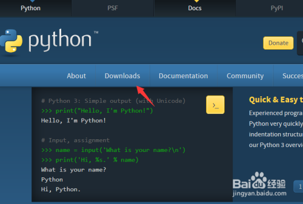

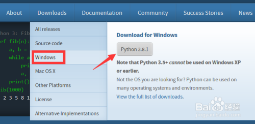

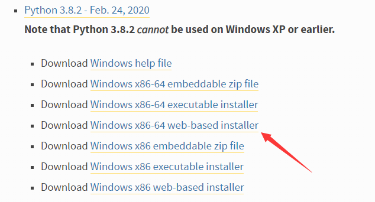

运行下载的exe安装包，安装过程建议勾选“Add Python 3.x to PATH”（将Python 3.x添加到PATH环境变量）并选择自定义安装：

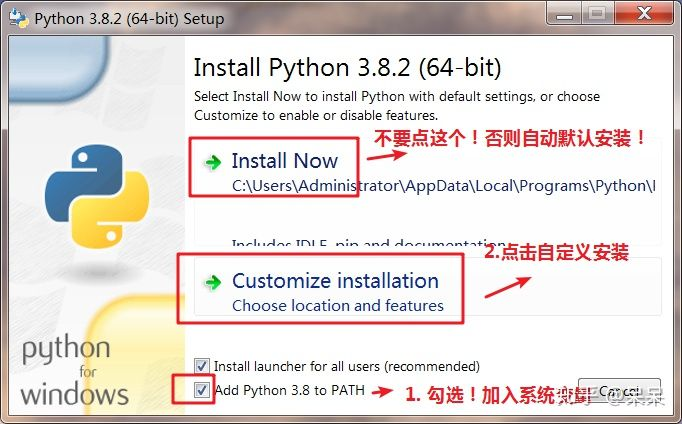

在设置“Optional Features”界面最好将“pip”、“tcl/tk”、“Python test suite”等项全部勾选上：

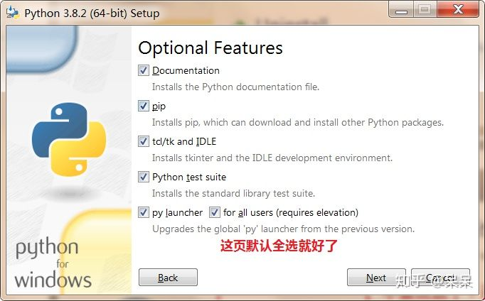

**强烈建议将Python安装在不含有中文路径中：**

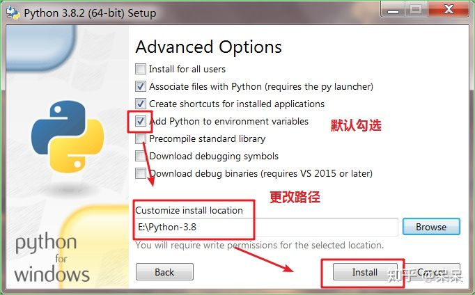

安装完成会看到“Setup was successful”的提示：

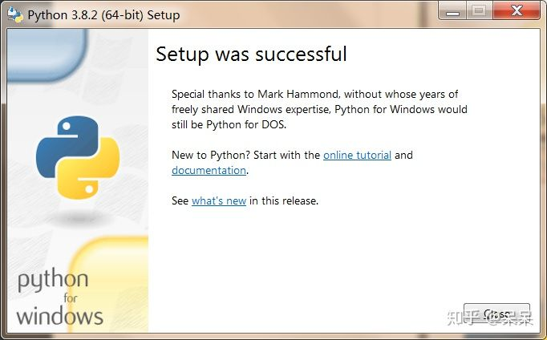

安装成功后，打开命令提示符窗口，敲入 `python` 后，会出现两种情况：

情况一：出现了Python版本号，就说明Python安装成功了！      

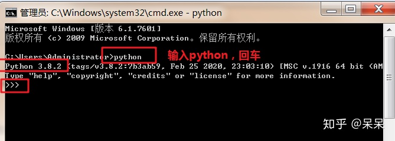                                                        

情况二：得到`'python'不是内部或外部命令，也不是可运行的程序或批处理文件。`的错误，这是因为Windows会根据一个Path的环境变量设定的路径去查找python.exe，如果没找到，就会报错。如果在安装时漏掉了勾选"Add Python 3.x to PATH"，那就要手动把python.exe所在的路径添加到Path中。

##### 科学Anaconda(推荐)


**Anaconda是一个开源的Python发行版本，其包含了Conda、Python等180多个安装好的科学包及其依赖项。**

Anaconda优点：

1. Anaconda包含了Python，装Anaconda，就不需要单独装Python了。
2. Anaconda里面集成了很多常见的关于Python科学计算的第三方库，使得安装比常规Python安装要容易。
3. Anaconda包含了Conda(一个开源的包、环境管理器)，可以用于在同一个机器上安装不同版本的软件包及其依赖，并能够在不同的环境之间切换。如果不使用Conda，那么安装起来会比较痛苦，各个库之间的依赖性就很难连接的很好。

首先，根据你的Windows版本（64位还是32位）从[Anaconda官方网站](https://www.anaconda.com/products/individual)下载Anaconda对应的64位安装程序或32位安装程序：

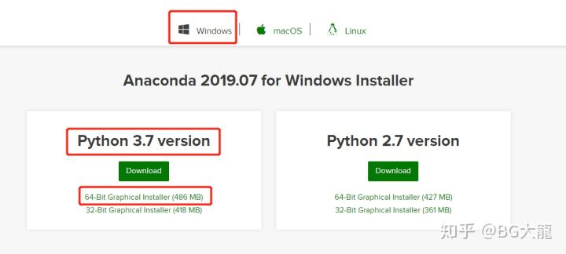

运行下载的安装包：

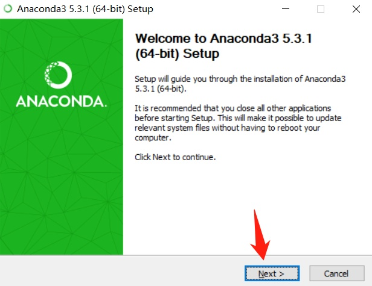

选上“All Users”，点击“Next”：

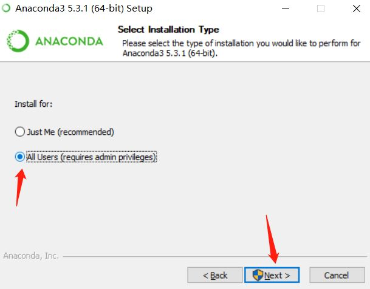

选择一个盘，单独创建一个文件夹命名为“Anaconda”——不要有空格！！！不要有中文字符！！！


第一项Add Anaconda… 这个是说将安装路径填入到系统环境变量中，我曾经选上，发现后期总是出现什么“无法定位到动态链接库”问题！！！（这里是自动添加系统环境变量，不选！！自己手动添加就好）

第二项 是说要默认使用python的版本，选上！！

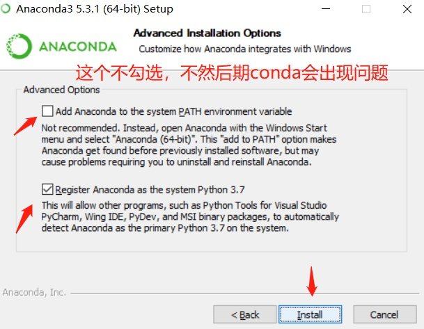

提示安装成功……

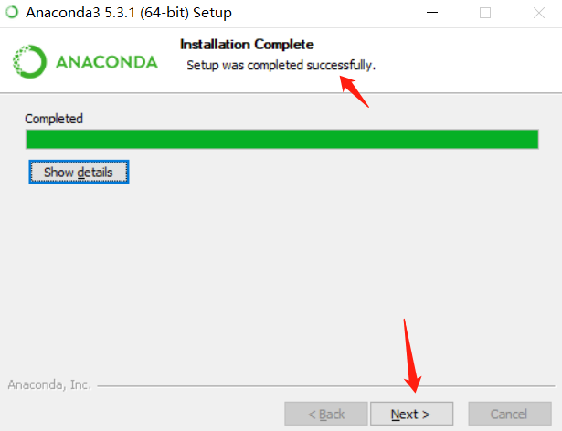

提示安装VScode，选择点击“skip”

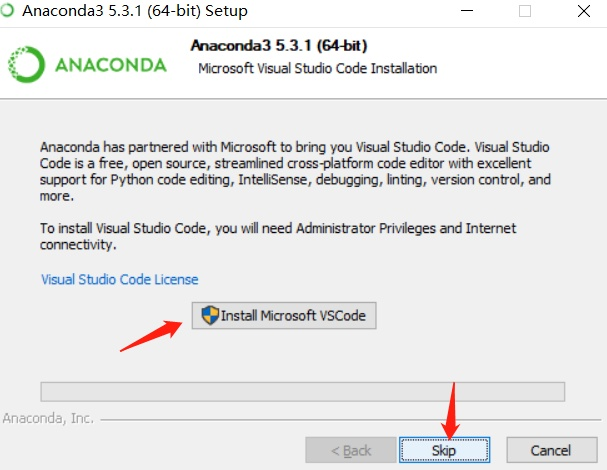

两个“learn”，都取消打勾，点击“Finish”，结束安装

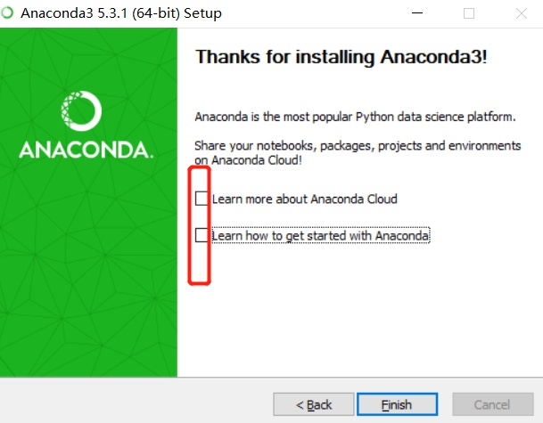

配置Anaconda环境变量：此电脑——属性——高级系统设置——环境变量——path——编辑——新建

```
E:\Anaconda（Python需要）
E:\Anaconda\Scripts（conda自带脚本）
E:\Anaconda\Library\bin（jupyter notebook动态库）
E:\Anaconda\Library\usr\bin
E:\Anaconda\Library\mingw-w64\bin（使用C with python的时候） 
```

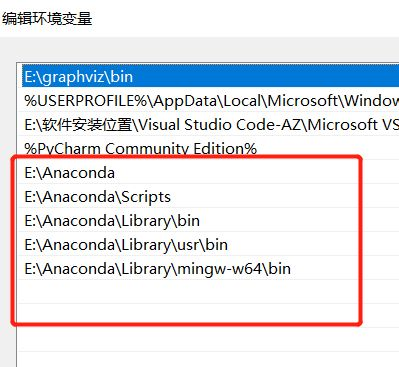

在cmd中输入 ：`python`——查看是否有Python环境

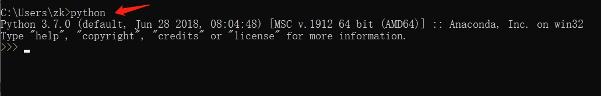

在cmd中输入 ：`conda --version`——查看是否有conda环境 (检验安装成功的标志)


