# Python语言基础

##### Python简介

**Python是一个高层次的结合了解释性、编译性、互动性和面向对象的脚本语言。**

Python的优点很多，总结为以下几点：

1. **简单明了，学习曲线低，比很多编程语言都容易上手。**
2. **开放源代码，拥有强大的社区和生态圈，尤其是在数据分析和机器学习领域。**
3. **解释型语言，天生具有平台可移植性，代码可以工作于不同的操作系统。**
4. 对两种主流的编程范式（面向对象编程和函数式编程）都提供了支持。
5. 代码规范程度高，可读性强，适合有代码洁癖和强迫症的人群。

Python的缺点主要集中在以下几点：

1. **执行效率稍低，对执行效率要求高的部分可以由其他语言（如：C、C++）编写。**
2. 代码无法加密，但是现在很多公司都不销售卖软件而是销售服务，这个问题会被弱化。
3. 在开发时可以选择的框架太多（如Web框架就有100多个），有选择的地方就有错误。

##### Python版本

Python 的版本号分为三段，形如 `A.B.C`

`A` 表示大版本号，一般当整体重写，或出现不向后兼容的改变时，增加 `A`；

`B` 表示功能更新，出现新功能时增加 `B`；

`C` 表示小的改动（如修复了某个 `Bug`），只要有修改就增加 `C`；

##### Python文件

**Python文件：以 `.py` 为后缀名的Python程序文件。**

**模块：一个 `.py` 文件就是一个模块，文件名称就是模块名称，里面定义了一些函数和变量，需要的时候就可以通过 `import` 导入模块。**

**包：包由众多具有相关功能的模块文件构成，体现了模块的结构化管理思想。**包目录下第一个文件是 `__init__.py`，然后是一些模块文件和子目录。

```
常见的包结构：
package_a
├── __init__.py
├── module_a1.py
└── module_a2.py
```

**库：Python中的库是借用其他编程语言的概念，没有特别具体的定义，模块和包都可以被称作库，即便只有个 `hello world` 。**

Python的特色之一就是：**拥有强大的标准库、丰富的第三方库以及自定义模块**。

**标准库：安装 Python 的时候默认自带的库**。常见的有：`os` 系统操作，`time` 时间，`random` 随机，`re` 正则，`logging` 日志，`queue` 队列，`threading` 线程，`multiprocessing` 进程

**第三方库：第三方机构发布的特定功能的模块，需要下载安装后才能使用的库。**常见的有：`lxml` 网页解析库，`scrapy` 爬虫框架，`django` 网站框架，`flask` 网站框架，`virtualenv` 虚拟环境

**自定义模块：用户自己定义编写的模块。**

##### Python内存管理

Python 的内存管理是由解释器负责的，有三大机制：**对象引用计数、垃圾回收、内存池**。

**对象引用计数**：Python 内部使用引用计数，来追踪内存中的对象，所有对象都有引用计数。

引用计数增加：1.一个对象分配一个新名称；2.将其放入一个容器中（如列表、元组或字典）。

引用计数减少：1.使用 `del` 语句对对象别名显示的销毁；2.引用超出作用域或被重新赋值。

```python
import sys

# 查询数字5在内存的引用次数
print(sys.getrefcount(5))    # 25

# 对象a引用5，则5的引用次数加1次
a = 5
print(sys.getrefcount(5))    # 26

# 销毁对象a，则5的引用次数减1
del a
print(sys.getrefcount(5))    # 25
```

**垃圾回收**：当一个对象的引用计数归零时，它将被垃圾收集机制处理掉。

**内存池**：为了加速Python的执行效率，Python提供了对内存的垃圾收集机制，将不用的内存放到内存池而不是返回给操作系统，用于管理对小块内存的申请和释放。

##### Python应用领域

目前 Python 在 `Web` 应用开发、云基础设施、`DevOps`、网络数据采集（爬虫）、数据分析挖掘、机器学习等领域都有着广泛的应用，因此也产生了Web后端开发、数据接口开发、自动化运维、自动化测试、科学计算和可视化、数据分析、量化交易、机器人开发、自然语言处理、图像识别等一系列相关的职位。

##### Python解释器

**Python属于解释型语言，在运行程序（`.py` 文件）时，由解释器先翻译成中间代码，再运行。**

运行流程：**解释器不会一次把整个程序转译出来，只像一位“中间人”，每次运行程序时都要先转成另一种语言再作运行，因此解释器的程序运行速度比较缓慢。它每转译一行程序叙述就立刻运行，然后再转译下一行，再运行，如此不停地进行下去。**

Python 解释器总体上分为以下几种：

**CPython**：**官方版本的解释器，也是标准解释器，因为是用 `C` 语言开发的，所以叫CPython，也是使用最广的Python解释器。**CPython解释器将 Python 源码编译成 `CPython` 字节码，即将 `.py` 文件编译成 `.pyc` 文件，再由虚拟机执行。

**IPython**：**基于CPython在交互方式上有所增强的解释器，在执行Python代码的功能和CPython是完全一样的。**CPython用 `>>>` 作为提示符，而IPython用 `In [序号]:` 作为提示符。

**Jython**：**由 `Java` 语言编写，运行在Java平台上的Python解释器。**Jython将Python源码编译成 `JVM` 字节码，由  `JVM` 执行对应的字节码。Jython能很好的与 `JVM` 集成，比如利用JVM的垃圾回收和JIT，直接导入并调用JVM上其他语言编写的库和函数。

**IronPython**：**由 `C#` 语言编写，运行在微软 `.Net` 平台上的Python解释器。**IronPython和Jython类似，可以直接把Python代码编译成.Net的字节码。IronPython将源码编译成TODO CLR，同样能很好的与 `.NET` 平台集成。即与Jython相同，可以利用.NET框架的JIT、垃圾回收等功能，能导入并调用.NET上其他语言编写的库和函数。IronPython默认使用Unicode字符串。

**PyPy**：使用RPython实现解释器，采用[Tracing JIT技术](https://links.jianshu.com/go?to=http%3A%2F%2Fen.wikipedia.org%2Fwiki%2FJust-in-time_compilation)，对Python代码进行动态编译（注意不是解释），所以可以显著提高Python代码的执行速度。绝大部分Python代码都可以在PyPy下运行，但对第三方模块的支持不够。无法很好的支持使用CPython的 `C API` 编写的扩展，这就导致相同的Python代码在两种解释器下执行可能会有不同的结果。

##### 标准Python

首先，根据你的Windows版本（64位还是32位）从[Python官方网站](https://www.python.org/)下载Python对应的64位安装程序或32位安装程序：

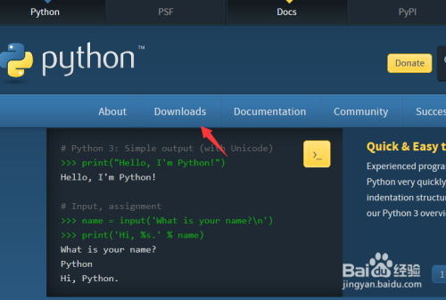

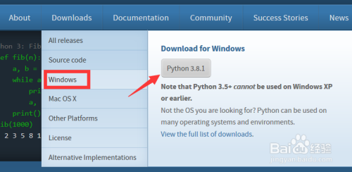

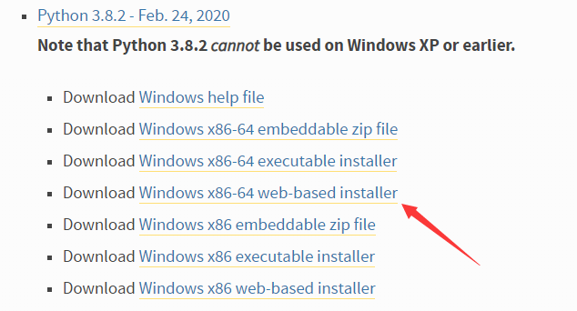

运行下载的exe安装包，安装过程建议勾选“Add Python 3.x to PATH”（将Python 3.x添加到PATH环境变量）并选择自定义安装：

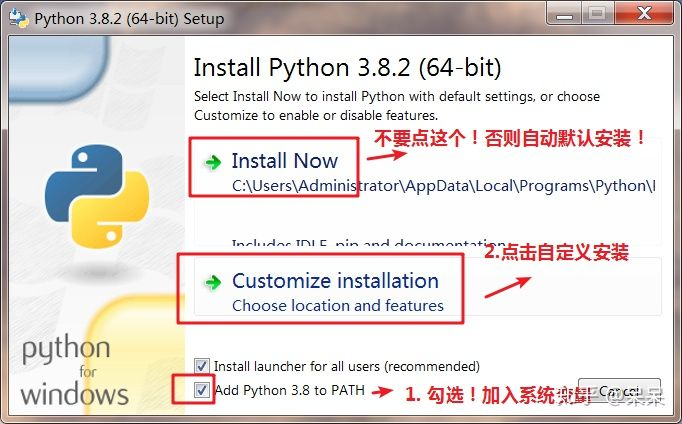

在设置“Optional Features”界面最好将“pip”、“tcl/tk”、“Python test suite”等项全部勾选上：

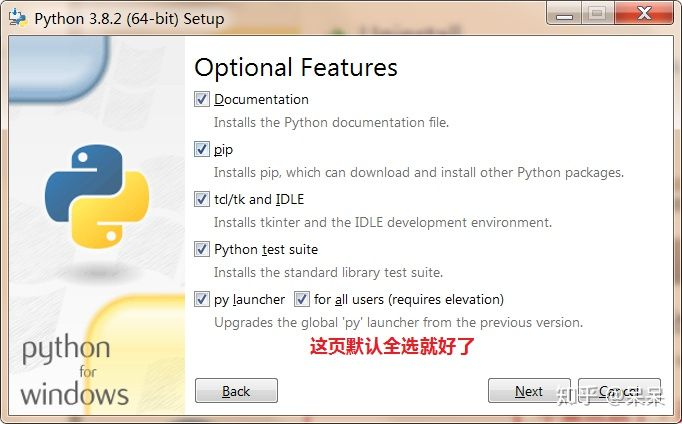

**强烈建议将Python安装在不含有中文路径中：**

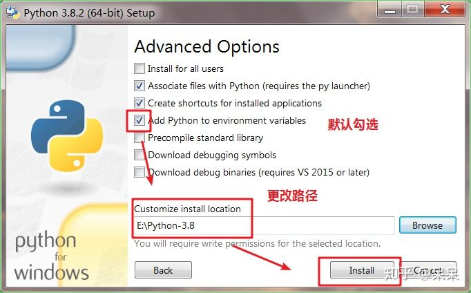

安装完成会看到“Setup was successful”的提示：

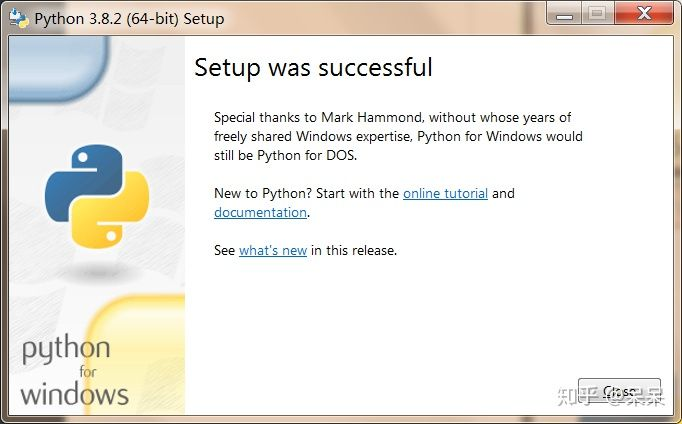

安装成功后，打开命令提示符窗口，敲入 `python` 后，会出现两种情况：

情况一：出现了Python版本号，就说明Python安装成功了！      

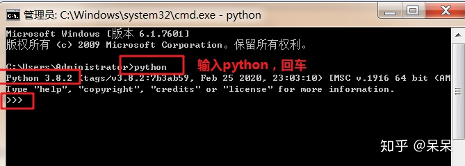                                                        

情况二：得到`'python'不是内部或外部命令，也不是可运行的程序或批处理文件。`的错误，这是因为Windows会根据一个Path的环境变量设定的路径去查找python.exe，如果没找到，就会报错。如果在安装时漏掉了勾选"Add Python 3.x to PATH"，那就要手动把python.exe所在的路径添加到Path中。

##### 科学Anaconda(推荐)


**Anaconda是一个开源的Python发行版本，其包含了Conda、Python等180多个安装好的科学包及其依赖项。**

Anaconda优点：

1. **Anaconda包含了Python，装Anaconda，就不需要单独装Python了。**
2. **Anaconda里面集成了很多常见的关于Python科学计算的第三方库，使得安装比常规Python安装要容易。**
3. **Anaconda包含了Conda(一个开源的包、环境管理器)，可以用于在同一个机器上安装不同版本的软件包及其依赖，并能够在不同的环境之间切换。如果不使用Conda，那么安装起来会比较痛苦，各个库之间的依赖性就很难连接的很好。**

首先，根据你的Windows版本（64位还是32位）从[Anaconda官方网站](https://www.anaconda.com/products/individual)下载Anaconda对应的64位安装程序或32位安装程序：

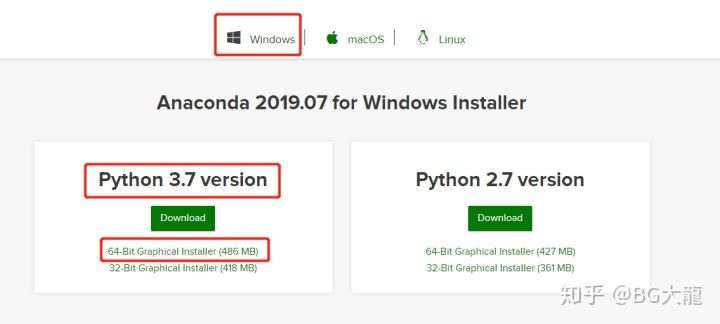

运行下载的安装包：

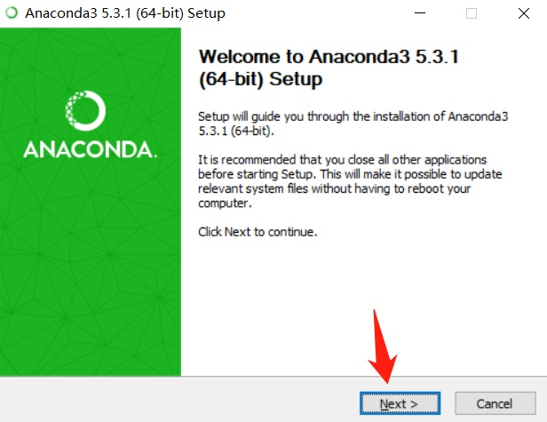

选上“All Users”，点击“Next”：

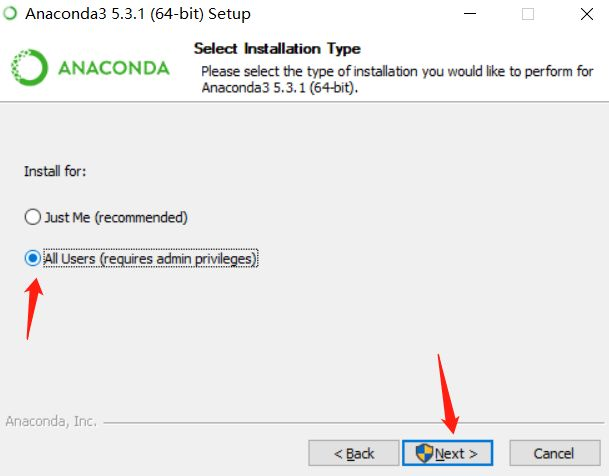

选择一个盘，单独创建一个文件夹命名为“Anaconda”——不要有空格！！！不要有中文字符！！！

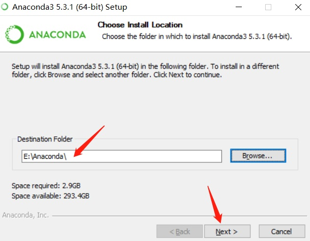

第一项Add Anaconda… 这个是说将安装路径填入到系统环境变量中，我曾经选上，发现后期总是出现什么“无法定位到动态链接库”问题！！！（这里是自动添加系统环境变量，不选！！自己手动添加就好）

第二项 是说要默认使用python的版本，选上！！

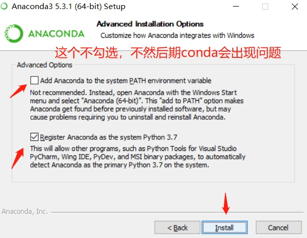

提示安装成功……

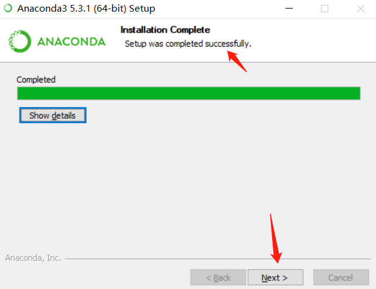

提示安装VScode，选择点击“skip”

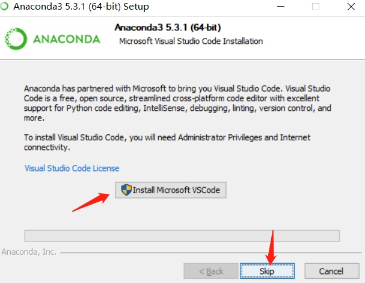

两个“learn”，都取消打勾，点击“Finish”，结束安装

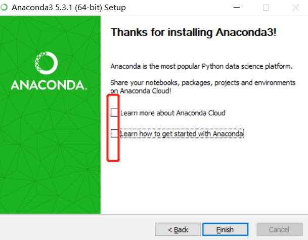

配置Anaconda环境变量：此电脑——属性——高级系统设置——环境变量——path——编辑——新建

```
E:\Anaconda（Python需要）
E:\Anaconda\Scripts（conda自带脚本）
E:\Anaconda\Library\bin（jupyter notebook动态库）
E:\Anaconda\Library\usr\bin
E:\Anaconda\Library\mingw-w64\bin（使用C with python的时候） 
```

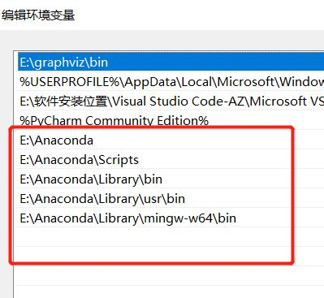

在cmd中输入 ：`python`——查看是否有Python环境

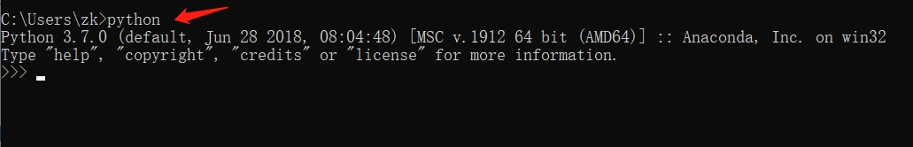

在cmd中输入 ：`conda --version`——查看是否有conda环境 (检验安装成功的标志)

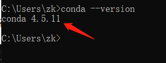
