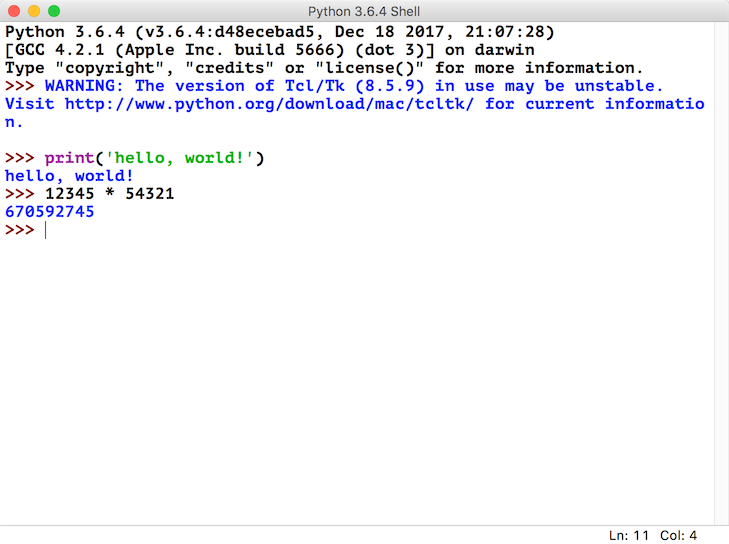
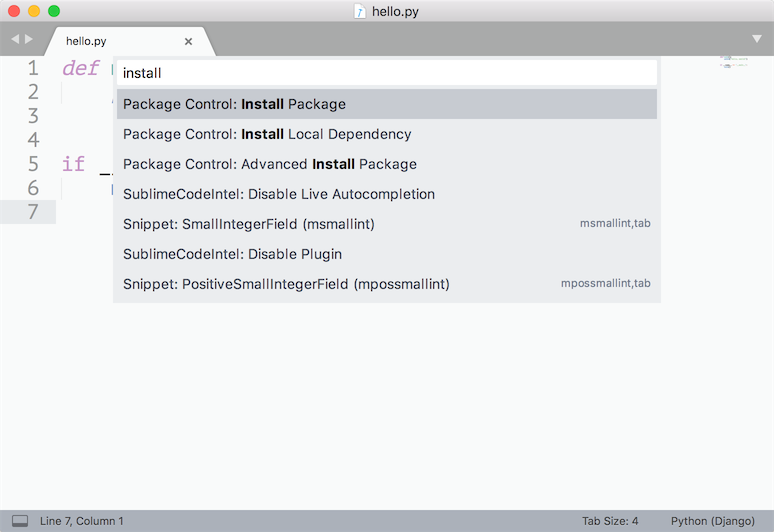
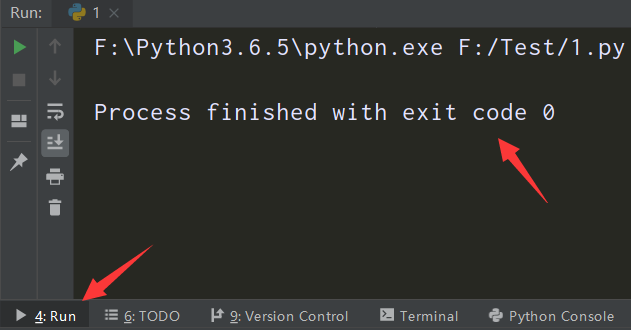
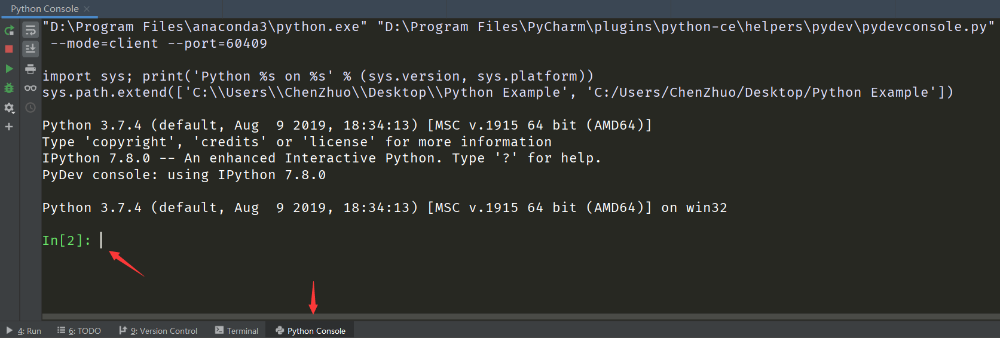
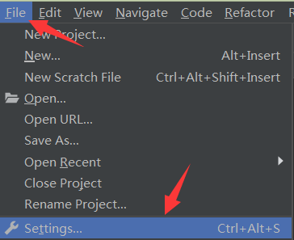
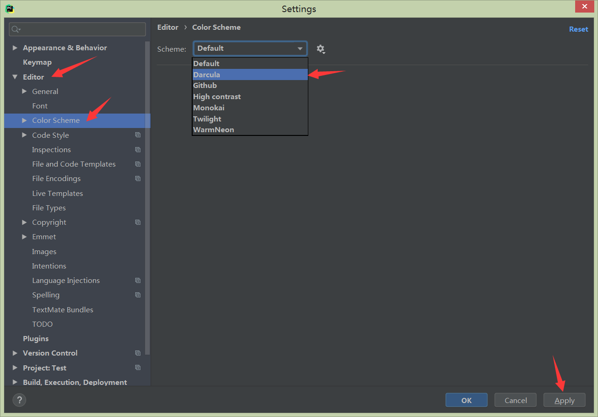
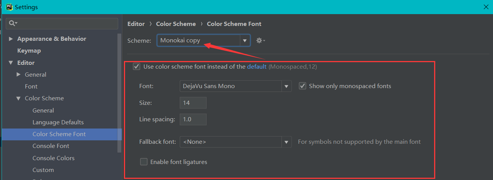
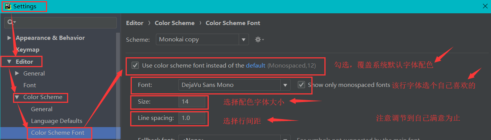

# 开发工具、包命令、镜像源

### 开发工具

开发Python有多种工具可选择，简略讲一下其他开发工具，重点介绍专业开发工具Pycharm。

##### IDLE

IDLE是安装Python环境时自带的集成开发工具，但是IDLE的用户体验并不好，所以很少在实际开发中被采用。



##### IPython

**IPython是一种基于Python的交互式解释器。相较于原生的Python交互式环境，IPython提供了更为强大的编辑和交互功能。**

通过Python的包管理工具pip安装IPython，具体的操作如下所示。

```
pip install ipython
```

通过 `ipython` 命令启动IPython：


##### Sublime Text

**Sublime Text 是一个文本编辑器（收费软件，可以无限期试用，但是会有激活提示弹窗），同时也是一个先进的代码编辑器。具有漂亮的用户界面和强大的功能，例如代码缩略图，Python的插件，代码段等。还可自定义键绑定，菜单和工具栏。**Sublime Text 的主要功能包括：拼写检查，书签，完整的 Python API ， Goto 功能，即时项目切换，多选择，多窗口等等。

通过[Sublime Text官方网站](https://www.sublimetext.com/)下载安装程序Sublime Text，然后启动安装，运行界面如下：



##### PyCharm

PyCharm是由JetBrains公司开发的提供给Python专业的开发者的一个集成开发环境，它最大的优点是能够大大提升Python开发者的工作效率，为开发者集成了很多用起来非常顺手的功能，包括代码调试、高亮语法、代码跳转、智能提示、自动补全、单元测试、版本控制等等。此外，PyCharm还提供了对一些高级功能的支持，包括支持基于Django框架的Web开发

PyCharm[下载链接](https://www.jetbrains.com/pycharm/download/#section=windows)中有两个可供下载的版本，一个是社区版（PyCharm CE），一个是专业版（PyCharm Professional）。社区版在Apache许可证下发布，可以免费使用；专业版在专用许可证下发布，需要购买授权后才能使用，但新用户可以试用30天。


**欢迎页**：启动PyCharm之后会来到一个欢迎页，在欢迎页上我们可以选择“创建新项目”（Create New Project）、“打开已有项目”（Open）和“从版本控制系统中检出项目”（Get from Version Control）。


**项目文件夹**：当PyCharm打开一个普通文件夹或者“创建新项目”（Create New Project）时，会在项目路径下面生成了一个名称为 `.idea` 文件夹，标记所在文件夹为项目文件夹。

?> 使用PyCharm查看文件夹列表时，项目文件夹会带有一个小黑块。若不想成为项目文件夹，删除 `.idea` 文件夹即可。


**Run窗口**：程序运行结果的展示窗口。



**Terminal窗口**：终端，即命令行模式，相当 *CMD* 命令行窗口，可执行相应安装、运行等各种系统命令。


**Python Console窗口**：Python控制台，即Python交互模式。可以直接输入代码执行，并立刻得到结果，主要是为了调试Python代码用的。

Python交互模式主要有两种：**CPython用 `>>>` 作为提示符，而IPython用 `In[序号]:` 作为提示符。**



**设置背景颜色**：File --- Settings(设置) --- Editor(编辑器) --- Color Scheme(颜色方案) --- Scheme: Default(默认白色)、Github(白色)、Darcula(深蓝色)、Monokai(推荐黑色)





**设置字体大小**：File --- Settings(设置) --- Editor(编辑器) --- Font(字体) --- Font: ...(字体样式自定义) --- Size: 18(推荐字体大小) --- Line spacing: 1.0(推荐行间距)


**个性化配色**：通过下面6个步骤来进行配色：

1. *File --- Settings --- Apperance & Behavior --- Appearance --- Theme: Darcula*
   
2. *File --- Settings --- Editor --- Color Scheme Font --- Scheme: Monokai*
   
3. 选择 *Monokai* 后，点击右边的“齿轮”，选择 *Duplicate*，备份原 *Monokai* 方案。
   
4. 再选择新创建的 *Monokai Copy*。
5. *File --- Settings --- Editor --- Color Scheme --- Python --- Scheme: Monokai copy*
   
6. *File --- Settings --- Editor --- Color Scheme Font --- Use color scheme font*（勾选）
   

完成配色后的代码：


**快捷键**（只针对于PyCharm有效）：

```
Ctrl+/  ---  注释（注释掉当前行或选择的内容）

Ctrl+D  ---  复制粘贴（复制当前行代码并粘贴下面）

Ctrl+Y  ---  删除（删除当前行代码）

Ctrl+R  ---  替换

Shift+F10 --- 运行
```

### 包命令

##### 命令

用途：**包管理命令主要用对于第三方库（由第三方机构开发维护，Python安装包中不自带，需要先下载才能使用的库）的安装、更新、卸载等操作。**

执行位置：所有的命令都可以在 **PyCharm中的Terminal窗口** 或者 **Cmd命令行窗口** 中执行。

##### pip命令

**pip**：一个通用的 Python 包管理工具，提供了对 Python 包的查找、下载、安装、卸载的功能。

?> pip命令比较死板，如果安装的包需要依赖包，但依赖包没有先行安装，则用pip命令安装这个包会报错。

```python
'''
常用的基本pip指令：
'''
# 查看pip版本(验证pip是否安装)
pip --version

# 升级pip
python -m pip install --upgrade pip

# 指令安装（从默认的pip源中下载，速度较慢）
pip install 包名

# 更新已安装的三方库
pip install --upgrade 包名 

#列出所有已安装的三方库
pip list   

# 列出当前已安装且过期的第三方库
pip list --outdated  

# 卸载第三方库
pip uninstall 包名

# requirements.txt文件内容：
'''
selenium==3.6.0
Scrapy==1.5.1
pymongo==3.5.1
lxml==4.2.5
'''
# 根据requirements.txt文件里面的安装库的包名和版本号信息，来下载对应的包
pip install -r requirements.txt
```

##### whl文件

一般情况下，我们都是使用 `pip install` 命令在线安装python第三方库的，但是有些库在安装的时候可能会遇到困难，这时我们可能需要**通过离线安装whl文件来安装这个库**：

1. 在命令行窗口用命令`pip install wheel` 在线安装**wheel模块**。

2. 通过[Python扩展包仓库](https://www.lfd.uci.edu/~gohlke/pythonlibs/)链接找到所需的包，根据环境下载适合安装的**whl**文件。

```python
# 库名-18.9.0-cp36-cp36m-win_amd64.whl
'''
18.9.0：库的版本号
cp36：适合python3.6
win32：适合windows32位
win_amd64：适合windows64位
'''
```

3. 在命令行窗口用命令`pip install 文件路径\XXX.whl` 完成**whl**文件的安装。

##### conda命令

**conda**：是一个开源的软件包管理系统和环境管理系统，可以用于管理 Python 或者 R 语言版本以及依赖包。

?> 若环境是通过Anaconda来安装的，里面就已经包含了conda，不需要再安装；若环境通过Python安装程序安装的，则需另外安装conda。

```python
# 查看conda版本(验证conda是否安装)
conda --version

# 更新conda至最新版本(当较新的版本可用时，终端会显示Proceed ([y]/n)?，此时输入y即可进行升级)
conda update conda

# 查看conda帮助信息
conda --h 

# 在当前环境中安装包
conda install 包名

# 在指定环境中安装包
conda install --name 环境名称 包名

# 更新所有包
conda update --all

# 更新指定包
conda update 包名

# 获取当前环境中已安装的包信息
conda list

# 卸载当前环境中的包
conda remove 包名

# 卸载指定环境中的包
conda remove --name 环境名称 包名
```

##### pip与conda区别

conda命令相比pip命令，它能解决依赖包问题，当发现安装包需要依赖包时会一并安装，而且conda可以构建不同的环境，对环境进行保存，加载和切换操作。

!>pip无法更新python，因为pip并不将python视为包。

!>pip只是包管理器，无法对环境进行管理。因此如果想在指定环境中使用pip进行安装包，则需要先切换到指定环境中，再使用pip命令安装包。

!>pip可以安装一些conda无法安装的包；conda也可以安装一些pip无法安装的包。因此当使用一种命令无法安装包时，可以尝试用另一种命令。

### 镜像源

无论使用pip命令还是conda命令来安装包，都有一个共同的特点，**下载速度很慢，原因在于默认第三方库的下载网址是在外网上**。为了解决这一问题，出现了**Python镜像源，就是将Python官方下载地址上面的库复制一份放到国内的站点上，以提高下载速度。**

##### 常用镜像源

**使用镜像源来下载包，只需要在命令的后面加上参数 `-i` 和镜像源地址即可。**

!> 在包安装命令中指定镜像源地址，仅本次安装使用国内镜像源，如果下次还需要使用国内镜像源，则需要重新指定。

```python
# 下面的命令都是从国内镜像源网站中下载，下载速度快
# 清华大学镜像源安装（三方库齐全，推荐）
pip install XXX(包名) -i https://pypi.tuna.tsinghua.edu.cn/simple
# 豆瓣镜像源安装
pip install XXX(包名) -i http://pypi.douban.com/simple
# 阿里云镜像源安装
pip install XXX(包名) -i http://mirrors.aliyun.com/pypi/simple/
```

##### 配置默认镜像源

为了避免每一次都要指定镜像源地址，我们可以将镜像源地址配置到默认的下载地址中。(推荐[清华大学镜像源](https://pypi.tuna.tsinghua.edu.cn/simple))

首先执行如下几条命令更换清华镜像源：

```
conda config --add channels https://mirrors.tuna.tsinghua.edu.cn/anaconda/cloud/msys2/

conda config --add channels https://mirrors.tuna.tsinghua.edu.cn/anaconda/cloud/conda-forge/

conda config --add channels https://mirrors.tuna.tsinghua.edu.cn/anaconda/pkgs/free/

# 设置搜索时显示通道地址
conda config --set show_channel_urls yes

# 查看是否修改好通道
conda config --show channels
```

如果命令行方法添加不上，在用户根目录（C:\Users\用户名）下找到.condarc文件，复制下面内容覆盖掉原内容，保存即可。

```
channels:
  - https://mirrors.tuna.tsinghua.edu.cn/anaconda/pkgs/free/
  - https://mirrors.tuna.tsinghua.edu.cn/anaconda/cloud/conda-forge/
  - https://mirrors.tuna.tsinghua.edu.cn/anaconda/cloud/msys2/
show_channel_urls: true
ssl_verify: true
```