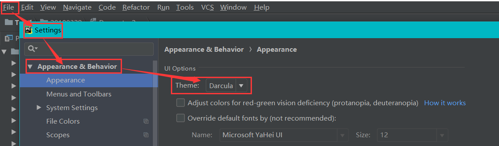
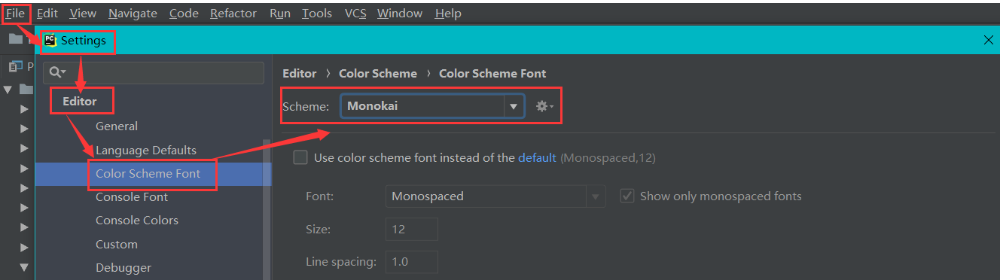
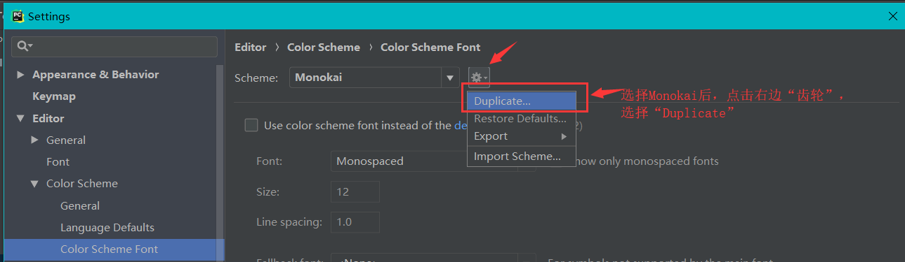
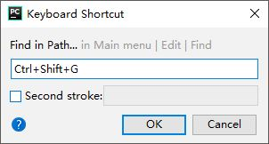

# 开发工具、管理库、镜像源

### 开发工具

开发Python有多种工具可选择，简略讲一下其他开发工具，重点介绍专业开发工具Pycharm。

##### IDLE

IDLE是安装Python环境时自带的集成开发工具，但是IDLE的用户体验并不好，所以很少在实际开发中被采用。


##### IPython

**IPython是一种基于Python的交互式解释器。相较于原生的Python交互式环境，IPython提供了更为强大的编辑和交互功能。**

通过Python的包管理工具pip安装IPython，具体的操作如下所示。

```
pip install ipython
```

通过 `ipython` 命令启动IPython：


##### Sublime Text

**Sublime Text 是一个文本编辑器（收费软件，可以无限期试用，但是会有激活提示弹窗），同时也是一个先进的代码编辑器。具有漂亮的用户界面和强大的功能，例如代码缩略图，Python的插件，代码段等。还可自定义键绑定，菜单和工具栏。**Sublime Text 的主要功能包括：拼写检查，书签，完整的 Python API ， Goto 功能，即时项目切换，多选择，多窗口等等。

通过[Sublime Text官方网站](https://www.sublimetext.com/)下载安装程序Sublime Text，然后启动安装，运行界面如下：


### PyCharm

PyCharm是由JetBrains公司开发的提供给Python专业的开发者的一个集成开发环境，它最大的优点是能够大大提升Python开发者的工作效率，为开发者集成了很多用起来非常顺手的功能，包括代码调试、高亮语法、代码跳转、智能提示、自动补全、单元测试、版本控制等等。此外，PyCharm还提供了对一些高级功能的支持，包括支持基于Django框架的Web开发。

PyCharm[下载链接](https://www.jetbrains.com/pycharm/download/#section=windows)中有两个可供下载的版本，一个是社区版（PyCharm CE），一个是专业版（PyCharm Professional）。社区版在Apache许可证下发布，可以免费使用；专业版在专用许可证下发布，需要购买授权后才能使用，但新用户可以试用30天。


##### 窗体部分

**欢迎页**：启动PyCharm之后会来到一个欢迎页，在欢迎页上我们可以选择“创建新项目”（Create New Project）、“打开已有项目”（Open）和“从版本控制系统中检出项目”（Get from Version Control）。


**项目文件夹**：当PyCharm打开一个普通文件夹或者“创建新项目”（Create New Project）时，会在项目路径下面生成了一个名称为 `.idea` 文件夹，标记所在文件夹为项目文件夹。


再使用PyCharm查看文件夹列表时，项目文件夹会带有一个小黑块。若不想成为项目文件夹，删除 `.idea` 文件夹即可。


**Run窗口**：程序运行结果的展示窗口。


**Terminal窗口**：终端，即命令行模式，相当 *CMD* 命令行窗口，可执行相应安装、运行等各种系统命令。


**Python Console窗口**：Python控制台，即Python交互模式。可以直接输入代码执行，并立刻得到结果，主要是为了调试Python代码用的。

Python交互模式主要有两种：**CPython用 `>>>` 作为提示符，而IPython用 `In[序号]:` 作为提示符。**


##### 背景字体

**设置背景颜色**：File --- Settings(设置) --- Editor(编辑器) --- Color Scheme(颜色方案) --- Scheme: Default(默认白色)、Github(白色)、Darcula(深蓝色)、Monokai(推荐黑色)


**设置字体大小**：File --- Settings(设置) --- Editor(编辑器) --- Font(字体) --- Font: ...(字体样式自定义) --- Size: 18(推荐字体大小) --- Line spacing: 1.0(推荐行间距)


**个性化配色**：通过下面6个步骤来进行配色：

1. *File --- Settings --- Apperance & Behavior --- Appearance --- Theme: Darcula*
   
2. *File --- Settings --- Editor --- Color Scheme Font --- Scheme: Monokai*
   
3. 选择 *Monokai* 后，点击右边的“齿轮”，选择 *Duplicate*，备份原 *Monokai* 方案。
   
4. 再选择新创建的 *Monokai Copy*。
5. *File --- Settings --- Editor --- Color Scheme --- Python --- Scheme: Monokai copy*
   
6. *File --- Settings --- Editor --- Color Scheme Font --- Use color scheme font*（勾选）
   

完成配色后的代码：


##### 文件索引问题

我们在启动PyCharm过程当中，可能会出现下面Indexing...或者scanning files to index...的情况，不仅时间往往很长而且CPU和内存的占用率也很高。**这是因为PyCharm会默认将项目数据都进行遍历建索引，而且项目数据量越大遍历所需的时间越长。**


解决方法一：将数据文件搬迁到项目路径外，避免被PyCharm扫描，但这样做可能需要对代码引用数据路径做一定的修改（不推荐）。

解决方法二：打开软件File | Settings | Project | Project Structure 选择具体的项目-选中具体的目录-点击“Excluded”，选中的目录文件夹变为红色，点击右下角“Apply”，标记数据文件所在目录不再为此建立索引。


或者直接右键点击不想index的文件夹，Mark Directory as | Excluded 即可


解决方法三：点击左上角菜单File —> Invalidate Caches / Restart —> Invalidate and Restart，等待自动重启pycharm之后等一会就可以了。


解决方法四：删除不需要扫描Python包的路径。

1.点击File然后点击settings


2.点击右侧下拉菜单，点击Show All


3.选中一个（每一个都要重复3,4这两步骤），点击右侧竖着的菜单最下面的那个图标


4.出现的是你的project搜索一些包的地址，把没有用的去掉（点击右侧的减号即可），后面显示（removed by user）就表示成功去除了。 像我就多了一个搜索D盘的路径，废了很多时间。


##### 关闭自动更新

有些时候软件的更新过于频繁，如需要关闭自动更新，可以按照下面步骤：

1.点击左上角File,如图进入Settings(或者按Ctrl+Alt+s)


2.搜索到updates选项,把Automatically check updates for(自动检查更新以…规则) 前面够选去掉即可.


##### 文件多开

Pycharm当中，**默认一个文件只能对应一个正在运行程序的窗口，若当前窗口的程序还没有运行结束，再次点击“运行“就会出现提示”是否重新运行“，或者直接就结束程序重新开始运行。这时候”运行“按钮的效果相当于点击了”重新运行“的按钮。**


如果我们希望同一个文件能由两个甚至多个程序同时运行需要进行设置：Run——Edit Configurations——选择文件——Allow parallel run(打勾)


!> 上面的多开设置只是针对的 test.py 文件，不针对其他文件。

设置好以后，我们多次点击运行，只要前面的程序还没结束，运行的窗口就会不断增加：


##### 断点调试

作为专业开发工具Pycharm其断点调试功能是必不可少的，**建议以后运行程序都在”Debug“模式下运行，方便随时打断点。**

首先确定需要断点的地方，然后在断点的行号后面点击出现红色圆点即成功打上断点。若要取消断点只要点击红色圆点，让红色圆点消失即可。


?> 每行最多打一个断点，一段程序有多行可以打多个断点。

接下来进入调试模式，即”Debug“模式，该模式运行程序，程序会在断点处停下，且断点的位置会变蓝色。


在debugger栏中可以看当前程序在断点前面的各个参数的值、类型等信息。


在console栏中可以看当前程序在断点前面的输出。


通过下面快捷键我们可以追踪程序一步步执行的过程方便我们找出程序中的问题：


```
F8：step over 单步
遇到断点后，程序停止运行，按F8单步运行。

F7：step into 进入
单步调试F8时，如果某行调用其他模块的函数，在此行F7，可以进入函数内部，如果是F8则不会进入函数内容，直接单步到下一行。

Alt+shift+F7：step into mycode,
个人理解F8和F7的综合。1、没遇到函数，和F8一样；2、遇到函数会自动进入函数内部，和F8时按F7类似的。

shift+F8：跳出
调试过程中，F7进入函数内后，shift+F8跳出函数，会回到进入前调用函数的代码。

F9：resume program
继续运行程序直到到下一个断点，或者没有断点直接运行结束。
```

##### 开发备注

通过Pycharm设置，在开发脚本的时候，自动在最上面备注相关的作者、时间、编码等信息。

点击：File——settings——File and Code Templates——Python Script。进行以下设置：

```
#!/usr/bin/env python
#-*- coding:utf-8 -*-
# @Time    : ${DATE} ${TIME}
# @Author  : jiemo
```


##### 后续备注

任何jetbrains的IDE包括ReSharper都包涵TODO的功能，它可以显示和定位所有注释中出现的 **TODO** 关键字。每当下班前工作没做好或者工作被打断都可以使用TODO功能，PyCharm中像这样：


然后TODO中会显示，点击条目会跳转到TODO的位置，继续完成后续开发。


##### 常用快捷键

下列快捷键只针对于PyCharm有效：

| 快捷键                                  | 作用                                             |
| --------------------------------------- | ------------------------------------------------ |
| `ctrl + j`                              | 显示可用的代码模板                               |
| `ctrl + b`                              | 查看函数、类、方法的定义                         |
| `ctrl + space`                          | 万能代码提示快捷键，一下不行按两下               |
| `ctrl + alt + l`                        | 格式化代码                                       |
| `alt + enter`                           | 万能代码修复快捷键                               |
| `ctrl + /`                              | 注释/反注释代码                                  |
| `shift + shift`                         | 按名称搜索文件                                   |
| `ctrl + d` / `ctrl + y`                 | 复制/删除一行代码                                |
| `ctrl + shift + -` / `ctrl + shift + +` | 折叠/展开所有代码                                |
| `F2`                                    | 快速定位到错误代码                               |
| `ctrl + alt + F7`                       | 查看哪些地方用到了指定的函数、类、方法           |
| `ctrl + r`                              | 替换                                             |
| `shift + f10`                           | 运行代码                                         |
| `ctrl + shift + g`                      | 按内容搜索文件"find in path"（需要进行下面设置） |

在Pycharm中"find in path"的快捷键是 `ctrl + shift + f`，但这和win10的中文输入法的简体/繁体切换键有冲突，就需要修改快捷键。在File-Settings-Keymap中查找"find in path"进行设置。


增加快捷键选项：


增加快捷键`ctrl + shift + g`：



这是全局字符串搜索的界面，上面有很多更精细的设置，比如忽略大小写，正则匹配，改变匹配范围等，这里不再详细介绍。


### 管理库

之前讲过Python的一大特色就是拥有丰富的第三方库（Python安装包中不自带，由第三方机构开发维护，需要先下载安装才能使用的库），因此第三方库的安装、更新、卸载就成了必须要学会的操作。

##### whl文件

**通过下载whl文件来安装需要的库，是最直接、最不容易出错的安装方式，但相比起通过命令在线安装第三方库略显繁琐。**

```python

# whl文件通用命名1：库名-18.9.0-cp36-cp36m-win_amd64.whl
'''
18.9.0：库的版本号
cp36：适合python3.6
win32：适合windows32位
win_amd64：适合windows64位
'''
# whl文件通用命名2：库名-18.9.0-py3‑none‑any.whl
'''
18.9.0：库的版本号
py2：适合python2的版本号
py3：适合python3的版本号
'''
```

1. 访问[Python扩展包仓库](https://www.lfd.uci.edu/~gohlke/pythonlibs/)，找到需要安装的三方库，根据环境下载适合安装的whl文件进行下载。


2. 在命令行窗口用命令`pip install 文件路径\XXX.whl` 完成**whl**文件的安装。


##### pip命令

**pip：官方认可的 Python 包管理工具，提供了对 Python 包的查找、下载、安装、卸载的功能。**

执行位置：所有的pip命令都可以在 **PyCharm中的Terminal窗口** 或者 **cmd命令行窗口** 中执行。

?> pip命令比较死板，如果安装的库需要依赖库，但依赖库没有先行安装，使用pip命令安装就会报错。

```python
'''
常用的pip指令：
'''
# 查看pip版本(验证pip是否安装)
pip --version

# 指令安装（从默认的pip源中下载，速度较慢）
pip install 包名

# 更新已安装的三方库
pip install --upgrade 包名 

#列出所有已安装的三方库
pip list   

# 列出当前已安装且过期的第三方库
pip list --outdated  

# 卸载第三方库
pip uninstall 包名

# requirements.txt文件内容：
'''
selenium==3.6.0
Scrapy==1.5.1
pymongo==3.5.1
lxml==4.2.5
'''
# 根据requirements.txt文件里面的安装库的包名和版本号信息，来下载对应的包
pip install -r requirements.txt
``````````

##### conda命令

**conda：是一个开源的软件包管理系统和环境管理系统，可以用于管理 Python 或者 R 语言版本以及依赖包。**

?> 若环境是通过Anaconda安装的，就已经包含了conda；若环境通过Python安装程序安装的，则需另外安装conda。

```
# 查看conda版本(验证conda是否安装)
conda --version

# 查看conda详细信息
conda --info

# 查看conda中的所有的python环境
conda info --env

# 更新conda至最新版本(当较新的版本可用时，终端会显示Proceed ([y]/n)?，此时输入y即可进行升级)
conda update conda

# 查看conda帮助信息
conda --h 

# 在当前环境中安装包
conda install 包名

# 在指定环境中安装包
conda install --name 环境名称 包名

# 更新所有包
conda update --all

# 更新指定包
conda update 包名

# 获取当前环境中已安装的包信息
conda list

# 卸载当前环境中的包
conda remove 包名

# 卸载指定环境中的包
conda remove --name 环境名称 包名
```

##### pip与conda区别

|                |         pip          |            conda             |
| :------------: | :------------------: | :--------------------------: |
|      区别      |      包管理工具      | 环境管理系统、软件包管理系统 |
|    支持语言    |     只支持Python     |      Python、R、C/C++等      |
| 管理Python环境 |        不可以        |             可以             |
| 解决依赖包问题 |        不可以        |             可以             |
|      支持      | 支持源码和二进制文件 |       只支持二进制文件       |

?> 如果想在指定环境中使用pip安装包，则需要先切换到指定环境中，再使用pip命令安装包。

?> pip可以安装一些conda无法安装的包；conda也可以安装一些pip无法安装的包。当使用一种命令无法安装包时，可以尝试另一种命令。

### 镜像源

##### 安装源

**使用pip命令安装库和conda命令安装库，效果是一样的，但库的来源是不一样的。**

**pip命令安装源：PyPI(Python Package Index)是python官方的第三方库的仓库，即Python编程语言的软件存储库，所有人都可以下载第三方库或上传自己开发的库到PyPI，而且绝大多数的Python包会优先发布到PyPI上。**

**conda命令安装源：defaults（默认安装源Anaconda.org）上面有主流Python包，但在数量级上明显少于PyPI，缺少一些小众的包。**

但无论使用pip命令还是conda命令来安装库，都有一个共同的特点，**下载速度很慢，原因在于默认第三方库的下载网址是在外网上**。为了解决这一问题，出现了**Python镜像源，就是将Python官方下载地址上面的库复制一份放到国内的站点上，以提高下载速度。**

##### 指定pip镜像源

前面介绍过pip是很强大的模块安装工具，但是由于国外官方PyPI经常被墙，导致不可用，所以我们最好是将自己使用的pip源更换为国内的pip镜像源，这样就能解决被墙导致的装不上库的烦恼。

```python
# 下面的命令都是从国内镜像源网站中下载包，只需要在命令的后面加上参数-i和镜像源地址即可
# 清华大学镜像源安装（三方库齐全，推荐）
pip install XXX(包名) -i https://pypi.tuna.tsinghua.edu.cn/simple
# 豆瓣镜像源安装
pip install XXX(包名) -i http://pypi.douban.com/simple
# 阿里云镜像源安装
pip install XXX(包名) -i http://mirrors.aliyun.com/pypi/simple/
    
# pip国内源列表
#（1）阿里云 http://mirrors.aliyun.com/pypi/simple/
#（2）豆瓣 http://pypi.douban.com/simple/
#（3）清华大学 https://pypi.tuna.tsinghua.edu.cn/simple/
#（4）中国科学技术大学 http://pypi.mirrors.ustc.edu.cn/simple/
#（5）华中科技大学 http://pypi.hustunique.com/
```

##### 命令配置镜像源

 在上述指定镜像源地址，代表仅本次安装使用国内镜像源，如果下次还需要使用国内镜像源，则需要重新指定，略显繁琐。为了避免每一次都要指定镜像源地址，我们可以将镜像源地址配置到默认的下载管道中（推荐[清华大学镜像源](https://pypi.tuna.tsinghua.edu.cn/simple)）

**永久指定pip镜像源**：通过运行命令来永久指定pip镜像源，运行后会在c盘里面的路径下生成 `pip.ini` 文件。

```
# 将清华pip镜像源配置到pip安装源列表中
pip config set global.index-url https://pypi.tuna.tsinghua.edu.cn/simple
```


```
# 查看配置的pip安装源
pip config list
```


打开上面路径下生成的文件，也可以看到该文件的内容和上面的内容一致，说明pip镜像源配置成功。


**永久指定conda镜像源**：通过运行命令来永久指定conda镜像源，运行后会在c盘里面的用户目录下生成 `.condarc` 文件。

```
# 运行命令在用户目录下生成.condarc文件
conda config --set show_channel_urls yes
```


将文件内容编辑为下面的内容，即可添加 Anaconda Python 免费仓库。

```
channels:
  - defaults
show_channel_urls: true
default_channels:
  - https://mirrors.tuna.tsinghua.edu.cn/anaconda/pkgs/main
  - https://mirrors.tuna.tsinghua.edu.cn/anaconda/pkgs/r
  - https://mirrors.tuna.tsinghua.edu.cn/anaconda/pkgs/msys2
custom_channels:
  conda-forge: https://mirrors.tuna.tsinghua.edu.cn/anaconda/cloud
  msys2: https://mirrors.tuna.tsinghua.edu.cn/anaconda/cloud
  bioconda: https://mirrors.tuna.tsinghua.edu.cn/anaconda/cloud
  menpo: https://mirrors.tuna.tsinghua.edu.cn/anaconda/cloud
  pytorch: https://mirrors.tuna.tsinghua.edu.cn/anaconda/cloud
  simpleitk: https://mirrors.tuna.tsinghua.edu.cn/anaconda/cloud
```

清除索引缓存，保证用的是镜像站提供的索引。

```
# 清除索引缓存
conda clean -i
```

展示conda的下载通道：

```
# 查看通道
conda config --show channels
```

如果想让conda恢复默认源，可以运行下面命令：

```
conda config --remove-key channels
```

##### PyCharm配置镜像源

除了通过命令指定镜像源，还可以在PyCharm指定镜像源。

**永久指定pip镜像源**：File——Settings——Project Interpreter——**不使用conda管理工具**——点击 `+`


点击“Manage Reponsitories”


因为在上面已经通过命令配置了pip镜像源，所以这里展示的是清华镜像源，我们也可以通过右侧的工具栏管理添加或删除镜像源：


**永久指定conda镜像源**：File——Settings——Project Interpreter——**使用conda管理工具**——点击 `+`


点击“Manage Reponsitories”


因为在上面已经通过命令配置了conda镜像源

```
channels:
  - defaults
```

所以这里展示的是默认镜像源，我们也可以通过右侧的工具栏管理添加或删除镜像源：


