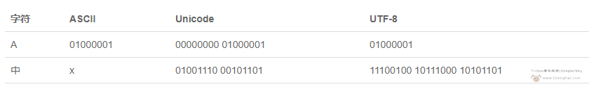
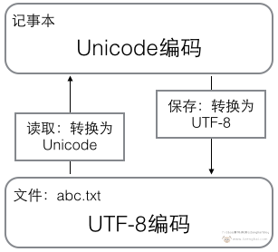

# 输入输出、字符串、编码

### 输入输出

##### `input` 函数

`input` 是 `Python` 内置的输入函数，特点如下：

1. 接收控制台输入的内容，**以回车为结束标志**。

2. `input` 函数会阻塞线程，程序执行到 `input` 的时候会停下来，等待用户的输入，输入完成后才会接着执行下面的内容。

3. 接收到的数据是以**字符串**的形式返回的。

```python
value = input()
print(value, type(value))
'''
输入：123
输出：123 <class 'str'>
'''
```

4. 可以对接收的数据进行类型转换。

```python
value = int(input())
print(value, type(value))
'''
输入：123
输出：123 <class 'int'>
'''
```

##### `print` 函数

`print` 是 `Python` 内置的输出函数，特点如下：

1. 在控制台**输出 *print* 括号里面的内容**。

```python
print('Hello World!')  
'''
输出：Hello World!
'''
```

2. 可输出多个**用逗号隔开**的内容。

```python
print(1, 2, 3)          # 1 2 3
print(1, 2,       3)	# 1 2 3（逗号与（整型）数字之间的空格不会打印）
print(1, 2,  1    3)	# 语法错误，整型数字之间不能有空格
print(1, 2,'      3')	# 1, 2,      3（字符型数据之间的空格会打印）
```

3. 可以进行各种运算操作并输出结果。

```python
print(2+3)      # 5
print(2-3)      # -1
print(2*3)      # 6
print(2/3)      # 0.6666666666666666
print(2%3)      # 2（%为取余号，取余数，2/3=0...2）
print(2+'3')    # 语法错误，整型和字符型不能相加 
print('2'+'3')  # 23（字符型之间相加就是将字符拼接成字符串，没有-，*，/，%）
```

4. `print` 函数自带 `sep` 属性表示输出间隔，默认为一个空格。输出多内容时，**每输出一个内容就使用 `sep` 属性**。

```python
print('aaa', 'bbb', 'ccc')              # aaa bbb ccc

# 重写sep属性
print('aaa', 'bbb', 'ccc', sep='    ')  # aaa    bbb    ccc
```

5. `print` 函数自带 `end` 属性表示输出结尾，默认 `\n` 换行。每个 `print` 函数，**输出完内容后就会使用 `end` 属性**

```python
print('aaa')
print('bbb')
'''
输出：
aaa
bbb
# 注释：当输出完`aaa`后，第一个print还输出了一个换行，因此第二个print输出的内容，在第二行。
'''

# 重写end属性，进行不换行输出
print('aaa', end='1')
print('bbb', end='结束')
'''
输出：
aaa1bbb结束
# 注释：将第一个print的end属性修改为1，在输出`aaa`后，执行end属性输出`1`，再执行第二个print语句，输出`bbb`后，执行end属性输出`结束` 。
'''
```

### 字符串

##### 字符和字符串

使用**单引号**或者**双引号**括起来，**单独**的**符号、数字、字母**等叫**字符**。

```
'+'  '^'  'a'  'B'  '6'  '.'
```

使用**单引号**或者**双引号**括起来的**字符集**就是**字符串**。

```
'123'  'ahcn'  '^7&#sj'  '中文汉字'
```

##### 字符串运算

**字符拼接**：通过 `+` 符号，将**字符**或**字符串**拼接为字符串。

```python
print('5'+'3')  # 53
print('你好吗?'+' = '+'are you ok ?')  # 你好吗? = are you ok ?
```

**重复输出**：通过 `*` 符号，将字符或字符串**重复输出**。

```python
print('a'*6)    # aaaaaa
print('abc'*2)  # abcabc
```

##### 字符串方法

**判断包含**：通过 `in` 或 `not in` 来判断是否包含在字符串中，结果是 `bool` 型。

```python
print('a' in 'abc')        # True
print('123' not in 'abc')  # True
```

**下标法**：每个字符串中的字符，都有对应的一个下标，从0开始直到最后一个字符的下标。也可以反向，从-1开始直到第一个字符。

注意：下标等于0，代表第一个字符；下标等于-1，代表最后一个字符。

注意：`\n` 换行，转移字符代表一个字符。

```python
print('abc'[0])     # a
print('abc'[1])     # b
print('abc'[2])     # c
print('abc'[3])     # 错误，下标超界
print('abc'[-1])    # c
print('abc'[-2])    # b
print('abc'[-3])    # a
print('abc'[-4])    # 错误，下标超界
print('dy\nup'[3])  # u
```

**切片法**：通过两个下标确定切割范围，对字符串进行切片处理。

```python
print('abcd'[0:1])  # a
print('abcd'[0:2])  # ab
print('abcd'[:])    # abcd，切片操作中没有下标，代表全部。
print('abcd'[1:])   # bcd
print('abcd'[:1])   # a
```

通过两个下标（表示范围）和一个数字（表示步长，不能为0）切取字符串。

```python
print('abcd'[::2])    # ac，[::2]从下标0开始，隔两位取一个字符
print('abcd'[1::2])   # bd，[1::2]从下标1开始，隔两位取一个字符
print('abcd'[::-1])   # dcba，[::-1]从下标0开始，-代表反向取字符
print('abcd'[::-2])   # db，[::-2]从下标0开始，-代表反向，隔两位取一个字符
```

**`split`方法**：以括号里面的字符或字符串为切割点，对前面字符串进行切割。

```python
print('ahsj2ksjajsj'.split('sj'))  	      # ['ah', '2k', 'aj', '']
print('ahsj2ksjajsj'.split('sj')[0])	  # ah
print('ahsj27jksjajsj'.split('sj')[-2])   # aj
```

**字符串插入**

```python
# join 插入
print('$' .join('bbb'))  # b$b$b
```

**改变大小写**：

```python
# capitalize 首字母大写
print('abc'.capitalize())  # Abc

# upper 全大写
print('abc'.upper())  # ABC

# lower 全小写
print('ABC'.lower())  # abc

# title 词组首字母大写
print('abc.def.ghi'.title())  # Abc.Def.Ghi
```

**对齐方式**：

```python
# ljust 左对齐
print('abc'.ljust(5, '*'))  # abc**

# center 居中
print('abc'.center(5, '@'))  # @abc@

# rjust 右对齐
print('abc'.rjust(5, '^'))  # ^^abc
```

**占位符**：通过 `%` 和字母的组合来表示一个数值的占位符。

`%s` --->字符串占位符

`%d` --->整数占位符

`%f` --->浮点数占位符（通常显示小数点后6位）

`%.nf` --->使用n值限制小数点后面的小数的位数

```python
print('我的名字叫%s' % '小明')      # 我的名字叫小明
print('我的年龄是%d岁' % 18)        # 我的年龄是18岁
print('我的钱包有%f元' % 12.50)     # 我的钱包有12.500000元
print('我的钱包有%.1f元' % 12.50)   # 我的钱包有12.5元
```

##### 字符串函数

**`len` 函数**：`len('字符串')`，获取括号里面字符串的长度

```python
print(len('床前明月光'))  # 5
```

##### 转义和阻止转义

通过在字符前加 `\` 符号，表示一些有特殊功能或者是特殊意义的字符。

**重点转义**： `\n=换行`，`\'='`，`\"="`，`\\=\`

```python
# 换行输出
print('床前明月光,\n疑是地上霜')
'''
输出：
床前明月光,
疑是地上霜

'''

# 输出一个单/双引号
print(''')    # 语法错误
print('\'')   # '
print(""")    # 语法错误
print("\"")   # "

# 输出一个斜杠
print('\')    # 语法错误
print('\\')   # \
```

通过在字符串前面加 `r`或 `R`，来阻止转义字符转义

```python
print(r'床前明月光,\n疑是地上霜')   # 床前明月光,\n疑是地上霜
```

### 字符编码

##### ASCII编码

计算机中，信息量的最小单位为1个比特（*bit*），8个比特（*bit*）等于一个字节（*byte*），一个字节能表示的最大的整数就是2的8次方，即255。

因为计算机只能处理数字，如果要处理文本，就必须先把文本转换为数字才能处理。由于计算机是美国人发明的，因此，最早只有127个字符被编码到计算机里，也就是大小写英文字母、数字和一些符号，这个编码表被称为ASCII编码，常用的大写字母 *A* 的编码是65，小写字母 *a* 的编码是97。

但是要处理数量庞大的中文汉字，显然一个字节是不够的，至少需要两个字节，而且还不能和ASCII编码冲突，所以，中国制定了GB2312编码，用来把中文编进去。

##### GB2312编码

GB2312标准共收录6763个汉字，其中一级汉字3755个，二级汉字3008个。GB2312对任意一个图形字符都采用两个字节表示，并对所收汉字进行了“分区”处理，每区含有94个汉字／符号，分别对应第一字节和第二字节。

但对于人名、古汉语等方面出现的罕用字，GB2312还是不能处理，这有了后来GBK编码。

##### GBK编码

GBK标准共收入21886个汉字和图形符号，简、繁体字融于一库。GBK采用双字节表示，总体编码范围为8140-FEFE之间，首字节在81-FE之间，尾字节在40-FE之间。

但全世界有上百种语言，日本把日文编到Shift_JIS里，韩国把韩文编到Euc-kr里，各国有各国的标准，就会不可避免地出现冲突，结果就是，在多语言混合的文本中，显示出来会有乱码，因此，Unicode编码应运而生。

##### Unicode编码

Unicode编码把所有语言都统一到一套编码里，最常用的是用**两个字节表示一个字符**（如果要用到非常偏僻的字符，就需要4个字节），这样就不会再有乱码问题了。现代操作系统和大多数编程语言都直接支持Unicode。

新的问题又出现了，如果统一成Unicode编码，乱码问题从此消失了。但是，如果你写的文本全部是英文，Unicode编码用**两个字节表示一个字符**会比ASCII编码需要多一倍的存储空间，在存储和传输上就十分不划算。

所以，本着节约的精神，又出现了把Unicode编码转化为“可变长编码”的UTF-8编码。

##### UTF-8编码

UTF-8编码把一个Unicode字符根据不同的数字大小编码成1-6个字节，常用的英文字母被编码成1个字节，汉字通常是3个字节，只有很生僻的字符才会被编码成4-6个字节。如果你要传输的文本包含大量英文字符，用UTF-8编码就能节省空间。



从上面的表格还可以发现，UTF-8编码有一个额外的好处，就是ASCII编码实际上可以被看成是UTF-8编码的一部分，所以，大量只支持ASCII编码的历史遗留软件可以在UTF-8编码下继续工作。

##### 记事本工作流程

**在计算机内存中，统一使用Unicode编码，当需要保存到硬盘或者需要传输的时候，就转换为UTF-8编码。**

用记事本编辑的时候，从文件读取的UTF-8字符被转换为Unicode字符到内存里，编辑完成后，保存的时候再把Unicode转换为UTF-8保存到文件：



##### 网页编码设置

**浏览网页的时候，服务器会把动态生成的Unicode内容转换为UTF-8再传输到浏览器**。所以你看到很多网页的源码上会有类似`<meta charset="UTF-8">`的信息，表示该网页正是用的UTF-8编码。

##### `Python` 转码

`ord` 字符转码（括号里面只能是单个字符）

```python
print(ord('a'))  # 97
print(ord('b'))  # 98
print(ord('c'))  # 99
print(ord('陈')) # 38472
```

`chr` 码转字符（括号里面只能是整型数字）

```python
print(chr(97))  # a
print(chr(98))  # b
print(chr(99))  # c
print(chr(38472)) # 陈
```

##### 字符比较大小

**字符或字符串比较大小的时候，实质比的是他们编码的大小。**

`max` 返回字符串中最大的字母

```python
print(max('abcZ'))  # c
```

`min` 返回字符串中最小的字母

```python
print(min('abcZ'))  # Z
```

字符串比较大小,从两边字符串开始依次往后比较每个**字符**的大小，直到遇到字符不一样为止。

```python
print('abc' > 'b')    # False
print('abc' > 'aa')   # True
print('Zbc' > 'aa')   # False
```

### 总结

1. `语法错误：print(a=5)`，`print` 函数里面不能进行赋值运算。
2. 函数的属性是可以重写的，即重新定义的。
3. 字符串前面的占位符数量要和后面的数值数量一致。
4. 切片操作的下标是前闭后开，后面下标的字符取不到。
5. 切片操作中没有下标，代表全部。
6. 转义字符，在计算字符串长度的时候，转义字符代表一个字符，例 `\n` 就是一个字符。