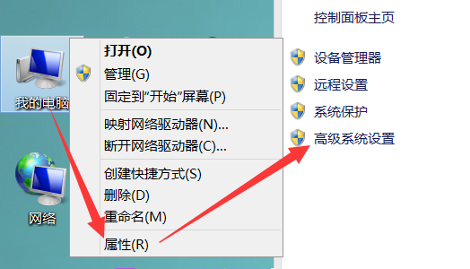

# 模块、环境变量、标准库

## 模块

**在最开始的时候就提到过，一个 `.py` 文件就是一个模块，模块与模块之间也可以像函数一样相互调用。**

### 关键字 `import`

关键字 `import`：**导入模块的声明，后面一般跟模块名称（不要添加后缀 `.py`）。**

2. `import` 是导入模块中**能导入**的**全部内容**。
3. **导入模块时，相当于把模块里面的内容粘贴到了 `import` 位置，因此运行代码时会先运行模块中的代码。**
4. 被导入模块最好在项目文件夹内。

### 导入模块

**导入模块在同一文件夹**：`import 模块名`，通过模块名称导入在同一文件夹下的模块。

```python
# other.py文件
name = 10
print(name)

# work.py文件
import other	# work.py文件中导入了同一文件夹下的other.py文件模块

'''
运行work.py文件:
10
# 注释：import other相当于把other.py文件的内容粘贴到了import位置，运行work.py文件，就是运行other.py文件里面的代码。
'''
```

**导入模块在不同文件夹**：`import 文件夹.模块名`，通过模块的所在路径及名称导入模块。

```python
# other.py文件
name = 10
print(name)

# work.py文件
import item.other	# work.py文件中导入了在项目文件夹item下的other.py文件模块

'''
运行work.py文件:
10
# 注释：import other相当于把other.py文件的内容粘贴到了import位置，运行work.py文件，就是运行other.py文件里面的代码。
'''
```

### 使用模块

`模块名.变量`：使用被调用模块中声明的**全局变量**

`模块名.函数名()`：使用被调用模块中声明的**函数**

```python
# other.py文件
name = 10                 # 全局变量name
print(name)

def func():               # 定义函数func
	global abc
    abc = 100
    print('**')


# work.py文件
import other               # 10，导入other模块，运行other.py文件里面的代码，输出全局变量name

print('+'+str(other.name)) # +10，通过使用被调用模块里面的变量name
print(other.func())        # **None，调用other模块函数func，输出**，print打印函数返回值None
print(other.abc)           # 100，因为上面调用函数func，定义全局变量abc，才能输出other.abc。
```

### 关键字 `from`

**关键字 `from`：和关键字 `import` 一起使用，指定模块中的部分内容进行导入。**

1. `from 模块名 import *`，导入模块中的所有内容。
2. `from 模块名 import 变量i`，导入模块中的名称为`i`的变量。
3. `from 模块名 import 函数func`，导入模块中的名称为`func` 函数，函数名后面不带括号。
4. `from 模块名 import 内容1,内容2...`，导入模块中的多个内容。
5. **通过 `from` 导入的内容，使用时不用加模块名。**

```python
import math         # import导入math模块里面的全部内容
print(math.e)       # 2.718281828459045，输出math模块里面的自然常数e

from math import e  # from指定导入math模块里面的自然常数变量e
print(e)            # 2.718281828459045，不带模块名输出math模块里面的自然常数e
```

6. **只能使用模块 `from` 导入的部分内容，未被导入的内容不能使用。**

```python
import math         # import导入math模块里面的全部内容
print(math.e)       # 2.718281828459045，输出math模块里面的自然常数e
print(math.pi)      # 3.141592653589793，上面导入了math模块里面的全部内容，因此可以使用变量pi

from math import e  # from指定导入math模块里面的自然常数变量e
print(e)            # 2.718281828459045，不带模块名输出math模块里面的自然常数e
print(pi)           # 报错，因为变量pi未在上面from中导入，因此不能使用该变量。
```

### 关键字 `as`

**关键字 `as`：给被导入的模块、函数、变量进行重新命名。**

1. `import 模块名 as 新的名字`：给被导入的模块重新命名。
2. `from 模块名 import 函数名 as 新的函数名`：给被导入的函数重新命名。
3. `from 模块名 import 变量名 as 新的变量名`：给被导入的变量重新命名。
4. **重新的命名后的模块、函数、变量，就只能使用新的名称，以前的名称就不能使用了。**

```python
import math
print(math.pi)           # 3.141592653589793

import math as my_math   # 将模块math重名为my_math
print(math.pi)           # 报错，模块已被重命名，math就不能使用了
print(my_math.pi)        # 3.141592653589793
```

### `__name__` 属性

`__name__` 属性：是判断**运行位置是否在当前模块中**的属性。

1. 打印 `__name__` 属性，结果是 `__main__`，说明 `__name__` 在当前文件中执行。
2. 打印 `__name__` 属性，结果不是 `__main__`，说明 `__name__` 不在当前文件中执行。

```python
# other.py文件
print(__name__)    # __main__，说明__name__属性是在当前文件中输出的

# work.py文件
import other       # other，说明__name__属性不是在当前文件中输出的，而是在other.py文件中
```

### 阻止导入

**阻止导入**：在导入模块时，通过 `__name__` 属性，**阻止模块中的不必要的代码被导入**。

1. `if __name__ == '__main__':`，就判断**是否在当模块中运行**。
2. **被导入模块中，在 `if __name__ == '__main__':` 里面的代码不会被导入。**

```python
# other.py文件
if __name__ == '__main__':
    print('!!!!')  # !!!!，if条件语句在other.py文件成立，因此能输出
    
# work.py文件
import other       # 空，if条件语句在work.py文件不成立，因此不能输出
```

## 环境变量

### 模块导入流程

在导入模块的时候，`Python` 会在**指定的文件夹**下搜索相对应的 `.py` 文件。

**环境变量**：可倒入模块的**所在文件夹路径**。

### 查看环境变量

```python
import sys              # 导入sys模块
print(sys.path)         # 输出当前环境变量，结果是一个列表
for path in sys.path:   # 可以将列表进行遍历再输出
    print(path)

'''
输出：
['F:\\Test', 'F:\\Python3.6.5'...]  # 这里路径显示的是双斜杠
F:\Test                             # 这里路径显示的是单斜杠
F:\Python3.6.5
...
'''
```

### 添加环境变量

我的电脑（右键）——>属性——>高级系统设置



高级——>环境变量


系统变量——>新建——>变量名 `PYTHONPATH`(全部大写)——>变量值 `被导入模块所在文件夹路径`——>确定


**重启工具生效后**，再查看环境变量：

```python
import sys              # 导入sys模块
print(sys.path)         # 输出当前环境变量，结果是一个列表
for path in sys.path:   # 可以将列表进行遍历再输出
    print(path)

'''
输出：
['F:\\Test', 'F:\\Python3.6.5', 'F:\\'...]	# 出现了'F:\\'，说明新增的环境变量已被添加
F:\Test
F:\Python3.6.5
F:\											
...
'''
```

## 标准库

`Python` 安装就自带许多官方的模块，使用起来也很方便，直接导入即可使用，这里介绍几个常用的模块。

### `sys` 模块

**`sys` 模块**：负责程序与 `python` 解释器的交互，提供了一系列的函数和变量，用于操控 `python` 的运行时环境。

```python
import sys

#获取Python解释程序的版本信息
print(sys.version)

# 返回操作系统平台名称
print(sys.platform)

# 返回模块的搜索路径，初始化时使用PYTHONPATH环境变量的值
print(sys.path)

# 返回系统导入的模块字段，key是模块名，value是模块 
print(sys.modules)

# 返回所有已经导入的模块列表
print(sys.modules.keys())

# 查看参数在内存的引用次数
print(sys.getrefcount(参数))	

# 返回当前文件（程序被调用的文件）的绝对路径
print(sys.argv[0])
```

### `os` 模块

**`os` 模块**：os即 `operating system`（操作系统），负责程序与操作系统交互，封装了常见的文件和目录操作。

```python
import os

#os.path模块主要用于文件的属性获取
# 返回根文件（程序位置所在文件）的绝对路径
print(os.path.abspath(__file__))
# 在任何位置获取文件的绝对路径
FilePath = re.search(r'(.*)\\',os.path.abspath(sys.argv[0]).replace('/','\\')).group(1)

# 返回根文件的的上一层的绝对路径
print(os.path.dirname(os.path.abspath(__file__)))

# 返回根文件的下一层的绝对路径
print(os.path.join(os.path.abspath(__file__), '文件夹名'))

# 判断括号里的文件是否存在，括号内的可以是文件路径
print(os.path.exists('user.py'))
'''
输出：
结果为True，说明当前目录存在user.py文件
结果为False，说明当前不目录存在user.py文件
'''

# 对象保存文件
print(对象.save(os.path.join('路径/文件名.后缀名')))

# 返回文件大小
print(os.path.getsize())

# 以列表形式返回当前路径下的所有文件夹
print(os.listdir('路径'))

# 删除文件
print(os.remove('路径/文件名.后缀名'))

# 重命名文件
print(os.rename(oldname, newname))

# 执行cmd指令，返回值是脚本的退出状态码，只会有0(成功),1,2
print(os.system('命令'))

# 执行cmd指令，通过管道的方式来实现，函数返回一个file-like的对象，里面的内容是脚本输出的内容
md5_value = os.popen('命令')         # 将结果赋值给变量
print(type(md5_value))              # 查看类型，<class 'os._wrap_close'>
print(md5_value.read().split()[0])  # 获取结果返回值

# 获取当前进程id
print(os.getpid())
```

### `math` 模块

`math` 模块：Python内置的提供常用数学函数的模块。

```python
import math

print(math.pi)		# 圆周率，3.141592653589793
print(math.e)		# 对数e，2.718281828459045
```

### `random` 模块

`random` 模块：Python内置的提供随机数的模块。

```python
import random

# random()方法：返回随机生成的一个实数，它在[0,1)范围内（不包括1）
print (random.random())          # 0.09690599908884856

# randint(M,N)方法：返回随机生成的一个实数，它在[M,N]范围内（包括N）
print(random.randint(1,3))       # 3
print(random.randint(1,3))       # 1
print(random.randint(1,3))       # 2

# choice(容器数据)：只抽取一次容器内的元素
list1 = [1, 2, 3]
print(random.choice(list1))      # 3

# choices(容器数据,抽取次数)：随机有放回的抽取容器内的元素（一个元素可能抽取多次）
list1 = [1, 2, 3]
# 这里的参数K是必须要带上的
print(random.choices(list1,k=5)) # [3, 2, 1, 2, 1]

# sample(容器数据,抽取次数)：随机不放回的抽取容器内的元素（一个元素只能抽取一次）
list1 = [1, 2, 3]
print(random.sample(list1,2))    # [1, 3]

# shuffle函数：打乱列表里面元素的所在位置（在原列表上打乱，打乱后不会产生新列表）
list1 = [0, 1, 2, 3, 4, 5, 6, 7, 8, 9]
random.shuffle(list1)
print(list1)			         # [9, 1, 0, 8, 3, 2, 4, 5, 7, 6]
```

### `uuid` 模块

`uuid` 模块可以帮助我们生成全局唯一标识符（Universal Unique IDentity）。该模块提供了四个用于生成UUID的函数，分别是：

- `uuid1()`：由MAC地址、当前时间戳、随机数生成，可以保证全球范围内的唯一性。
- `uuid3(namespace, name)`：通过计算命名空间和名字的MD5哈希摘要（“指纹”）值得到，保证了同一命名空间中不同名字的唯一性，和不同命名空间的唯一性，但同一命名空间的同一名字会生成相同的UUID。
- `uuid4()`：由伪随机数生成UUID，有一定的重复概率，该概率可以计算出来。
- `uuid5()`：算法与`uuid3`相同，只不过哈希函数用SHA-1取代了MD5。

由于`uuid4`存在概率型重复，那么在真正需要全局唯一标识符的地方最好不用使用它。在分布式环境下，`uuid1`是很好的选择，因为它能够保证生成ID的全局唯一性。

```python
import uuid
print(uuid.uuid1().hex)  # 622a8334baab11eaaa9c60f81da8d840
print(uuid.uuid1().hex)  # 62b066debaab11eaaa9c60f81da8d840
print(uuid.uuid1().hex)  # 642c0db0baab11eaaa9c60f81da8d840
```

### `heapq` 模块

`heapq`模块实现了堆排序算法，如果希望使用堆排序，尤其是要解决**TopK问题**（从序列中找到K个最大或最小元素），直接使用该模块即可，代码如下所示。

`heapq.nlargest(N, 列表)`：选择出列表中最大的N个元素，降序输出。

`heapq.nsmallest(N, 列表)`：选择出列表中最小的N个元素，升序输出。

```python
import heapq

lis1 = [6, 3, 8, 11, 1, 5, 7, 3]

# 选择出列表中最大的3个元素，降序输出
print(heapq.nlargest(3, lis1))      # [11, 8, 7]
# 选择出列表中最小的3个元素，升序输出
print(heapq.nsmallest(3, lis1))     # [1, 3, 3]

list2 = [
    {'name': 'IBM', 'shares': 100, 'price': 91.1},
    {'name': 'AAPL', 'shares': 50, 'price': 543.22},
    {'name': 'FB', 'shares': 200, 'price': 21.09},
    {'name': 'HPQ', 'shares': 35, 'price': 31.75},
    {'name': 'YHOO', 'shares': 45, 'price': 16.35},
    {'name': 'ACME', 'shares': 75, 'price': 115.65}
]
# 找出价格最高的三只股票
print(heapq.nlargest(3, list2, key=lambda x: x['price']))
# 找出持有数量最高的三只股票
print(heapq.nlargest(3, list2, key=lambda x: x['shares']))
'''
输出：
[{'name': 'AAPL', 'shares': 50, 'price': 543.22}, {'name': 'ACME', 'shares': 75, 'price': 115.65}, {'name': 'IBM', 'shares': 100, 'price': 91.1}]
[{'name': 'FB', 'shares': 200, 'price': 21.09}, {'name': 'IBM', 'shares': 100, 'price': 91.1}, {'name': 'ACME', 'shares': 75, 'price': 115.65}]
'''
```

### `collections` 模块

`collections`模块提供了诸多非常好用的数据结构，主要包括：

- `namedtuple`：命名元组，它是一个类工厂，接受类型的名称和属性列表来创建一个类。
- `deque`：双端队列，是列表的替代实现。**Python中的列表底层是基于数组来实现的，而`deque`底层是双向链表，因此当你需要在头尾添加和删除元素是，`deque`会表现出更好的性能 。**
- `Counter`：`dict`的子类，键是元素，值是元素的计数，它的`most_common()`方法可以帮助我们获取出现频率最高的元素。
- `OrderedDict`：`dict`的子类，它记录了键值对插入的顺序，看起来既有字典的行为，也有链表的行为。
- `defaultdict`：类似于字典类型，但是可以通过默认的工厂函数来获得键对应的默认值，相比字典中的`setdefault()`方法，这种做法更加高效。

```python
from collections import namedtuple, Counter

# namedtuple命名元组，一个类工厂
Card = namedtuple('Card', ('suite', 'face'))
card1 = Card('红桃', 5)
card2 = Card('草花', 9)
print(f'{card1.suite}{card1.face}')  # 红桃5
print(f'{card2.suite}{card2.face}')  # 草花9

words = [
    'look', 'into', 'my', 'eyes', 'look', 'into', 'my', 'eyes',
    'the', 'eyes', 'the', 'eyes', 'the', 'eyes', 'not', 'around',
    'the', 'eyes', "don't", 'look', 'around', 'the', 'eyes',
    'look', 'into', 'my', 'eyes', "you're", 'under'
]
counter = Counter(words)
# 打印words列表中出现频率最高的3个元素及其出现次数
for elem, count in counter.most_common(3):
    print(elem, count)
'''
输出：
eyes 8
the 5
look 4
'''
```

### 计数 `counter`

`counter`：属于 `collections` 模块中的一个子类，**用于统计对象中元素出现的次数**。

```python
from collections import Counter

def list_():
    list1 = [1, 1, 1, 7, 8, 4, 4, 7, 7, 7]
    list_count = Counter(list1)
    print(list_count)

def tuple_():
    tuple1 = (1, 1, 1, 7, 8, 4, 4, 7, 7, 7)
    tuple_count = Counter(tuple1)
    print(tuple_count)

if __name__ == '__main__':
    list_()
    tuple_()
'''
输出：
Counter({7: 4, 1: 3, 4: 2, 8: 1})
Counter({7: 4, 1: 3, 4: 2, 8: 1})
# 注释：这里输出了列表和数组中某个数字出现的次数，并从多到少进行了排序
'''

# 拓展
a = ['apple', 'banana', 'apple', 'tomato', 'apple', 'banana']
b = {}
for i in a:
    b[i] = b.get(i, 0) + 1

print(b)    # {'apple': 3, 'banana': 2, 'tomato': 1}
```

### `itertools` 模块

`itertools` 可以帮助我们生成各种各样的迭代器，大家可以看看下面的例子。

```python
import itertools

# 产生ABCD的全排列
for value in itertools.permutations('ABCD'):
    print(value)
'''
输出：
('A', 'B', 'C', 'D')
('A', 'B', 'D', 'C')
('A', 'C', 'B', 'D')
('A', 'C', 'D', 'B')
('A', 'D', 'B', 'C')
('A', 'D', 'C', 'B')
('B', 'A', 'C', 'D')
('B', 'A', 'D', 'C')
('B', 'C', 'A', 'D')
('B', 'C', 'D', 'A')
('B', 'D', 'A', 'C')
('B', 'D', 'C', 'A')
('C', 'A', 'B', 'D')
('C', 'A', 'D', 'B')
('C', 'B', 'A', 'D')
('C', 'B', 'D', 'A')
('C', 'D', 'A', 'B')
('C', 'D', 'B', 'A')
('D', 'A', 'B', 'C')
('D', 'A', 'C', 'B')
('D', 'B', 'A', 'C')
('D', 'B', 'C', 'A')
('D', 'C', 'A', 'B')
('D', 'C', 'B', 'A')
'''

# 产生ABCDE的五选三组合
for value in itertools.combinations('ABCDE', 3):
    print(value)
'''
输出：
('A', 'B', 'C')
('A', 'B', 'D')
('A', 'B', 'E')
('A', 'C', 'D')
('A', 'C', 'E')
('A', 'D', 'E')
('B', 'C', 'D')
('B', 'C', 'E')
('B', 'D', 'E')
('C', 'D', 'E')
'''

# 产生ABCD和123的笛卡尔积
for value in itertools.product('ABCD', '123'):
    print(value)
'''
输出：
('A', '1')
('A', '2')
('A', '3')
('B', '1')
('B', '2')
('B', '3')
('C', '1')
('C', '2')
('C', '3')
('D', '1')
('D', '2')
('D', '3')
'''
```

### 时间概念

**时间戳**：从格林威治时间1970年01月01日00:00:00(北京时间1970年01月01日08:00:00)到当前时间的**总秒数**。

```
例如: 1554722083.8482447，就是一个时间戳，表示格林威治时间和当前的时间差。
```

**北京时间**：中国采用国际时区**东八时区**的区时作为标准时间。

**注意：时间戳和时区有没有联系，时间戳在哪个时区都是一样的。**

**注意：中国使用的是东八时区的时间，使用时间戳换算成北京时间时，在没有默认处理的情况下，需要手动减去减去八个小时的秒数。**

```python
# struct_time 时间结构
tm_year：年
tm_mon：月
tm_mday：日
tm_hour：时
tm_min：分
tm_sec：秒
tm_wday：星期（0-6-->周一-周天）
tm_yday：当前是当年的第几天
tm_isdst：是否是夏令时
# time.struct_time(tm_year=2019, tm_mon=4, tm_mday=8, tm_hour=19, tm_min=21, tm_sec=52, tm_wday=0, tm_yday=98, tm_isdst=0)

# strf_time 时间结构
strftime(时间格式，时间)
将时间以指定的格式转换成字符串
* %y 两位数的年份表示（00-99）
* %Y 四位数的年份表示（000-9999）
* %m 月份（01-12）
* %d 月内中的一天（0-31）
* %H 24小时制小时数（0-23）
* %h 12小时制小时数（01-12）
* %M 分钟数（00=59）
* %S 秒（00-59）
* %a 本地简化星期名称
* %A 本地完整星期名称
* %b 本地简化的月份名称
* %B 本地完整的月份名称
* %c 本地相应的日期表示和时间表示
* %j 年内的一天（001-366）
* %p 本地A.M.或P.M.的等价符
* %U 一年中的星期数（00-53）星期天为星期的开始
* %w 星期（0-6），星期天为星期的开始
* %W 一年中的星期数（00-53）星期一为星期的开始
* %x 本地相应的日期表示
* %X 本地相应的时间表示
* %Z 当前时区的名称
* %% %号本身
# 例如：2019-04-09 01:38:12，就是strf_time结构的时间。
```

### `time` 模块

`time` 模块：`Python` 内置的**处理时间（时分秒）**的模块。

```python
import time

time1 = time.time()        # 输出当前时间的时间戳
print(time1, type(time1))  # 1554722083.8482447 <class 'float'>

time2 = time.localtime()   # 获取当前时间的struct_time时间，括号里面可添加指定的时间戳参数
print(time2)               
print(time2.tm_year, time2.tm_mon, time2.tm_mday)
'''
输出：
time.struct_time(tm_year=2019, tm_mon=12, tm_mday=22, tm_hour=1, tm_min=30, tm_sec=34, tm_wday=6, tm_yday=356, tm_isdst=0)
2019 12 22
'''

time3 = time.localtime()
print(time.strftime('%Y-%m-%d %H:%M:%S', time3))  # 将struct_time时间转换为strf_time时间
print(time.strptime('2018-7-20', '%Y-%m-%d'))     # 将strf_time时间转换为struct_time时间
print(time.mktime(time.strptime('2018-7-20', '%Y-%m-%d')))  # 将struct_time转换成时间戳
'''
输出：
2019-12-22 01:30:34
time.struct_time(tm_year=2018, tm_mon=7, tm_mday=20, tm_hour=0, tm_min=0, tm_sec=0, tm_wday=4, tm_yday=201, tm_isdst=-1)
1532016000.0
'''

time4 = time.ctime()      # 获取当前时间的英文格式
print(time3)              # Fri Dec  7 16:37:56 2018

time.sleep(10)            # 暂停10秒，让线程阻塞指定的时间
```

### `datetime` 模块

`datetime` 模块：`Python` 内置的**处理日期（年月日）**的模块。

```python
import datetime

day = datetime.date(2017, 9, 10)
print(day)                            # 2017-09-10

now_dt = datetime.datetime.now()      # 获取当前时间
print(now_dt)                         # 2019-04-09 02:27:47.907620
print(now_dt.date())                  # 2019-04-09，获取日期部分
print(now_dt.time())                  # 02:27:47.907620，获取时分秒的部分
print(now_dt.timestamp())             # 1554747428.907620，将datetime转换成时间戳
print(now_dt+datetime.timedelta(days=1))  # 2019-04-10 02:27:47.907620，日期加一天
print(now_dt+datetime.timedelta(days=-2)) # 2019-04-07 02:27:47.907620，日期减两天
print(now_dt+datetime.timedelta(minutes=50)) # 2019-04-09 03:17:47.907620，增加50分钟

today = datetime.date.today()         # 创建日期类today
print(today)                          # 2019-04-09
print(today.year)                     # 2019，获取日期的年份
print(today.month)                    # 4，获取日期的月份
print(today.day)                      # 9，获取日期的号数
print(today.isoweekday())             # 2，获取日期对应的星期
print(today.strftime('%Y-%m-%d-%w'))  # 2019-04-09-2，将日期转换成指定格式的字符串日期
print(today.timetuple())		      # (tm_year=2019...)，将日期转换成struct_time
```

