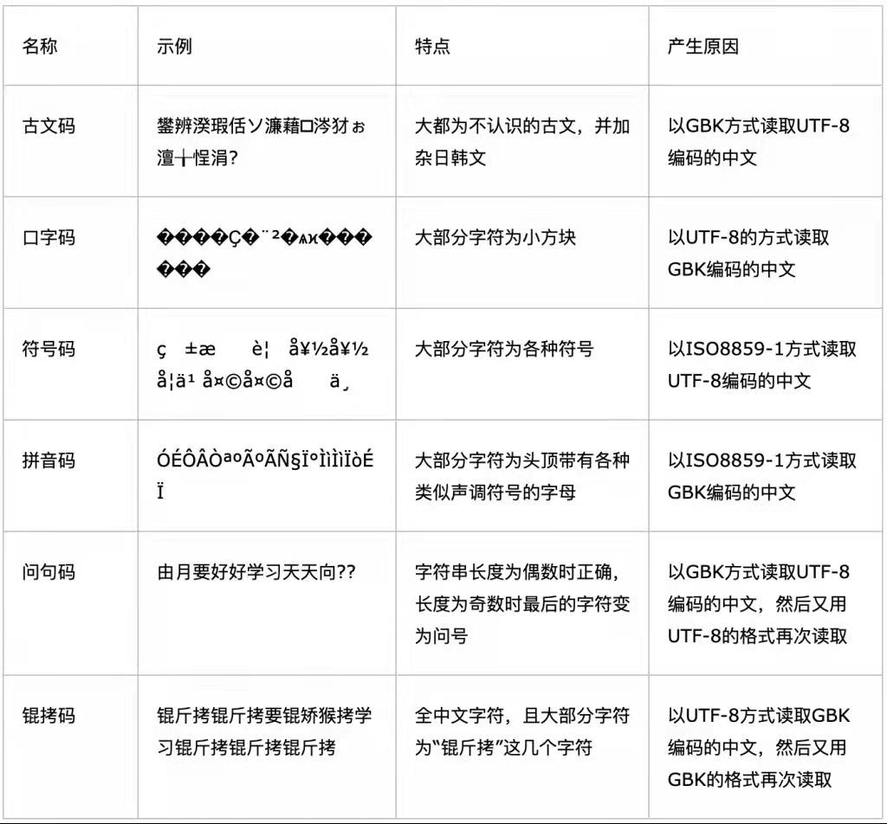

# 字符编码转码、文本文档

## 字符编码

### ASCII编码

计算机中，信息量的最小单位为1个比特（*bit*），8个比特（*bit*）等于一个字节（*byte*），一个字节能表示的最大的整数就是2的8次方，即255。

因为计算机只能处理数字，如果要处理文本，就必须先把文本转换为数字才能处理。由于计算机是美国人发明的，因此，最早只有127个字符被编码到计算机里，也就是大小写英文字母、数字和一些符号，这个编码表被称为ASCII编码，**常用的大写字母 *A* 的编码是65，小写字母 *a* 的编码是97**。

```python
# ord字符转码（括号里面只能是单个字符），返回对应的 ASCII 数值（字母），或者 Unicode 数值（汉字）。
print(ord('a'))  # 97
print(ord('b'))  # 98
print(ord('c'))  # 99
# chr码转字符（括号里面只能是整型数字），返回一个对应的字符。
print(chr(97))  # a
print(chr(98))  # b
print(chr(99))  # c
```

但人们日常用的字符远不止127个，比方说处理数量庞大的中文汉字，中国制定了GB2312编码，用来把中文编进去。

### GB2312编码

GB2312标准共收录6763个汉字，其中一级汉字3755个，二级汉字3008个。GB2312对任意一个图形字符都采用两个字节表示，并对所收汉字进行了“分区”处理，每区含有94个汉字／符号，分别对应第一字节和第二字节。

但对于人名、古汉语等方面出现的罕用字，GB2312还是不能处理，这有了后来GBK编码。

### GBK编码

GBK标准共收入21886个汉字和图形符号，简、繁体字融于一库。GBK采用双字节表示，总体编码范围为8140-FEFE之间，首字节在81-FE之间，尾字节在40-FE之间。

但全世界有上百种语言，日本把日文编到Shift_JIS里，韩国把韩文编到Euc-kr里，各国有各国的标准，就会不可避免地出现冲突，结果就是，在多语言混合的文本中，显示出来会有乱码，因此，Unicode编码应运而生。

### Unicode编码

Unicode编码把所有语言都统一到一套编码里，用**两个字节表示一个字符**（如果要用到非常偏僻的字符，就需要4个字节），这样就不会再有乱码问题了。现代操作系统和大多数编程语言都直接支持Unicode。

**Unicode编码用两个字节表示一个字符，比ASCII编码需要多一倍的存储空间，在存储和传输上就十分不划算。所以，本着节约的精神，又出现了把Unicode编码转化为“可变长编码”的UTF-8编码。**

```python
# ord字符转码（括号里面只能是单个字符），返回对应的 ASCII 数值（字母），或者 Unicode 数值（汉字）。
print(ord('陈')) # 38472
# chr码转字符（括号里面只能是整型数字），返回一个对应的字符。
print(chr(38472)) # 陈
```

### UTF-8编码

UTF-8编码把一个Unicode字符根据不同的数字大小编码成1-6个字节，常用的英文字母被编码成1个字节，汉字通常是3个字节，只有很生僻的字符才会被编码成4-6个字节。如果你要传输的文本包含大量英文字符，用UTF-8编码就能节省空间。


从上面的表格还可以发现，UTF-8编码有一个额外的好处，就是ASCII编码实际上可以被看成是UTF-8编码的一部分，所以，大量只支持ASCII编码的历史遗留软件可以在UTF-8编码下继续工作。

?> **浏览网页的时候，服务器会把动态生成的Unicode内容转换为UTF-8再传输到浏览器**。所以你看到很多网页的源码上会有类似 `<meta charset="UTF-8">` 的信息，表示该网页正是用的UTF-8编码。

## 字符乱码



## 文本文档

### CR、LF、CRLF

首先需要注意一点的是：**回车不等于换行。**

- 回车：光标回到当前行最左边的位置，即水平位置改变，垂直位置不变。
- 换行：光标在当前位置下移一行，即水平位置不变，垂直位置改变。
- 回车并换行：光标移动至下一行最左边的位置，即水平位置改变，垂直位置改变。

名词解释：

- `CR`：Carriage Return，对应ASCII中转义字符\r，表示回车。
- `LF`：Linefeed，对应ASCII中转义字符\n，表示换行。
- `CRLF`：Carriage Return & Linefeed，\r\n，表示回车并换行

专业版Windows系统中打开一个文本文档，在右下角会显示一个 `Windows(CRLF)` 的内容，表明Windows系统中采用的是回车并换行。


注意，上面是在专业版的Windows当中才会显示，在企业版的Windows中是不显示的。


### BOM

UCS码是国际标准化组织为各种语言字符制定的编码标准。

在UCS编码中有一个叫做"ZERO WIDTH NO-BREAK SPACE"的字符，也被称作BOM，它是一个不存在的字符，但通过BOM可以表明这个字节流是Big-Endian的，还是Little- Endian的。UCS规范建议我们在传输字节流前，先传BOM，即**字节序标记**。

**UTF-8不需要BOM来表明字节顺序，但可以用BOM来表明编码方式。**UTF-8编码的BOM是EF BB BF。所以如果接收者收到以EF BB BF开头的字节流，就知道这是UTF-8编码了。**因此这里UTF-8编码就有两种：UTF-8、带BOM的UTF-8**

在企业版Win10系统中，文本文件另存为时，只有一个 `UTF-8`，而这个UTF-8编码是[带BOM的UTF-8]。


而专业版Win10系统中，文本文件另存为时，会有两个 `UTF-8`，分别是 [UTF-8、带BOM的UTF-8]。


### 文本编码

根据上面，企业版Windows、专业Windows中，文本文档另存为时出现的编码，我们**将“编码”两字存入不同的编码文本，再查看二进制编码分析**得出下表：

| 文档编码                                  | 二进制编码                 | BOM      | 解释                                          |
| :---------------------------------------- | :------------------------- | :------- | --------------------------------------------- |
| ANSI                                      | B1 E0 C2 EB                | 无       | 从DOS到Win98，文本文件都是ANSI编码，都没有BOM |
| Unicode\|Unicode little endian\|UTF-16 LE | FF FE 16 7F 01 78          | FF FE    | little endian(LE)，低位字节在前，高位字节在后 |
| Unicode big endian\|UTF-16 BE             | FE FF 7F 16 78 01          | FE FF    | big endian(BE)，高位字节在前，低位字节在后    |
| UTF-8                                     | E7 BC 96 E7 A0 81          | 无       | UTF-8不需要BOM来表明字节顺序                  |
| 带有BOM的UTF-8                            | EF BB BF E7 BC 96 E7 A0 81 | EF BB BF | UTF-8编码的BOM只用表明编码方式                |

### 记事本

**在计算机内存中，统一使用Unicode编码，当需要保存到硬盘或者需要传输的时候，就转换为UTF-8编码。**

用记事本编辑的时候，从文件读取的UTF-8字符被转换为Unicode字符到内存里，编辑完成后，保存的时候再把Unicode转换为UTF-8保存到文件：


