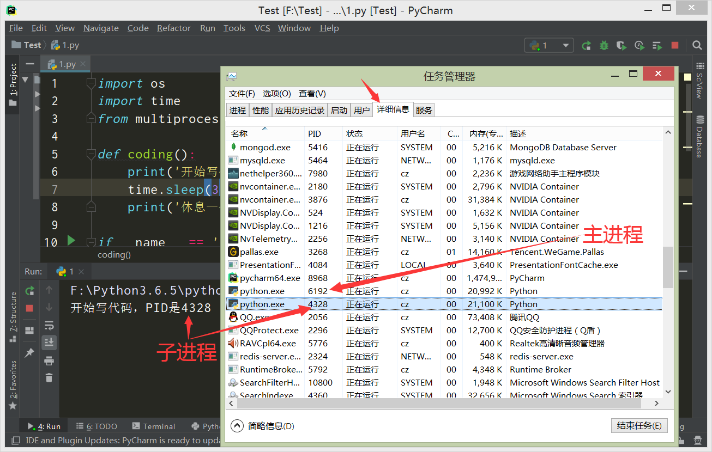

# 进程、线程、协程

### 进程(`Process`)

##### 程序和进程

程序：**计算机中静态的可执行文件。**

进程：**计算机运行程序时产生的动态的、有周期的（程序开始运行到运行结束）过程。**

1. **一个程序可以有多个进程，但至少要有一个进程。**
2. **程序占用的是磁盘空间；进程占用的是CPU、内存。**
3. **磁盘、硬盘属于外存储器，不属于计算机的运行资源；CPU、内存属于计算机的运行资源。**
5. **不同时间运行相同程序，产生的进程是不同的**，因为进程占用的内存段、内存大小、运行时间都发生了变化。

##### 进程属性

**进程**：**计算机运行程序的过程**。

特点：**进程是CPU资源分配的最小单位，每个进程都有自己的地址空间、数据栈以及其他的数据**。

优点：进程有独立的地址空间，**当一个进程崩溃后，不会对其他的进程产生影响**。

缺点：在进程之间切换系统资源开销大，数据通信不方便，效率差。

##### `multiprocessing` 模块

`multiprocessing` 模块：**`Python` 内置的进程模块，提供了 `Process` 类来创建子进程对象**。

```
multiprocessing 模块提供的常用方法： 

    multiprocessing(target=函数名, args=['函数实参列表'])：创建子进程对象

    线程对象.start()：开始执子进程

    线程对象.join()：等待子进程结束（join会阻塞进程到任务执行完为止）
    
    注意：调用 multiprocessing 模块的函数要在 if __name__ == '__main__': 下执行，不然会报错。
```

##### 主进程

**每个程序都至少有的一个进程**，这个进程就是**主进程**。

**每个进程都有自己的地址空间**，这个是进程id，即**PID**。

```python
# os.getpid输出当前进程的id
print('我是主进程，PID是%s' % os.getpid())
'''
输出：
我是主进程，PID是10432
# 注释：前面提到不同时间运行相同程序，产生的进程是不同的，因此这个PID值是动态的。
'''
```

##### 子进程

**每个的运行程序都有一个主进程**，通过 `multiprocessing` 模块创建的进程，都是主进程下面的**子进程**。

**创建子进程**：**程序运行中会有两个进程，一个是主进程，一个是创建的子进程**，在任务管理器详细信息也能看到。

```python
import os
# multiprocessing导入Process类
from multiprocessing import Process

def coding():
    print('开始写代码，PID是%s' % os.getpid())
    print('休息一会儿，PID是%s' % os.getpid())

# 调用 multiprocessing 模块的函数要在 if __name__ == '__main__': 下执行，不然会报错。
if __name__ == '__main__':
    # 通过Process类创建子进程对象p1，target参数接收函数coding作为子进程对象的内容
    p1 = Process(target=coding)
    # 启动进程
    p1.start()
'''
输出：
开始写代码，PID是4328
休息一会儿，PID是4328
# 注释：4328就是子进程的id值。
# 注释：在windows上，子进程会自动import启动它的这个文件，无限递归创建子进程，进而报错，于是使用__main__
'''
```



##### 阻塞进程

在子进程里要进行大量的耗时的运算，**主进程往往先于子进程之前结束执行**，但如果需要使用到子进程的计算结果，**就必须让主进程等待子进程运行完毕，再执行主进程**，这就是**阻塞进程**。

```python
# 进程没有阻塞
import os
from multiprocessing import Process

def coding():
    print('开始写代码，PID是%s' % os.getpid())
    print('休息一会儿，PID是%s' % os.getpid())

if __name__ == '__main__':
    print('我是主进程，PID是%s' % os.getpid())
    # 创建子进程对象p1
    p1 = Process(target=coding)
    # 启动子进程
    p1.start()
    print('我是主进程，PID是%s' % os.getpid())
'''
输出：
我是主进程，PID是12040
我是主进程，PID是12040
开始写代码，PID是13812
休息一会儿，PID是13812
# 注释：可以看到主进程先于子进程输出，也就是说主进程比子进程更快的执行结束，但如果需要使用到子进程的计算结果，就需要阻塞进程。
'''

# 有进程阻塞
import os
from multiprocessing import Process

def coding():
    print('开始写代码，PID是%s' % os.getpid())
    print('休息一会儿，PID是%s' % os.getpid())

if __name__ == '__main__':
    print('我是主进程，PID是%s' % os.getpid())
    # 创建子进程对象p1
    p1 = Process(target=coding)
    # 启动子进程
    p1.start()
    # 阻塞主进程，等待子进程p1执行结束
    p1.join()
    print('我是主进程，PID是%s' % os.getpid())
'''
输出：
我是主进程，PID是14228
开始写代码，PID是13316
休息一会儿，PID是13316
我是主进程，PID是14228
'''
```

##### 杀掉进程

在多进程程序中，如果某个进程p1一直阻塞，导致后面的进程p2、p3执行不了。可以直接**启动"任务管理器"去杀掉进程（结束进程）**，这时候进程p2和p3的就会执行了，这也说明**进程之间是相互没有关联的，互不影响的**。

# 线程

线程（Thread）

### 认识线程

##### 核与线程

我们平时经常会听到8核、16核处理器，那这里的核与线程有什么关系呢？单核代表一个线程么？

单核可以有多个线程，只是它的多线程通过分时来实现，即把时间分成片，每片处理一个线程，所有的线程循环处理。

而多核可以同时实现多线程。比如双核系统开两个线程，运行效率将会翻倍。但并不代表效率可以无限提升，多线程个数等于核的个数时，效率达到最高。

打个形象的比喻：（每种动作代表一个线程）

单核单线程：一个人喝完酒，然后抽烟，最后吃烧鸭

单核多线程：一个人喝一口酒，抽一口烟，吃一口烤鸭，同时进行

多核多线程：三个人，一个人喝酒，一个人抽烟，一个人吃烤鸭，互不干扰

##### 线程和进程

**线程是对进程更小维度的划分，同时也是cpu调度的最小单位。**

进程有独立的内存地址空间，就相当于教室，线程就相当于教室里面的学生，他们共用这一间教室，共享内存。

**注意：一个进程可以有多个线程（至少有一个线程），多个线程共享这一个进程内存空间。**

**注意：所有的进程默认都有一个线程（一般叫这个线程为主线程），其他的线程叫子线程。想要在进程中添加其他的线程，就要创建线程对象**

##### 线程特点

优点：**线程没有独立的地址空间，共享数据、内存，内存消耗少，并发性高，运行效率高**

缺点：**一个线程死掉就等于整个进程死掉，多进程的程序要比多线程的程序健壮，不能使用多核，按时间片强制切换，不够灵活**

### 线程程序

##### 线程模块

Python提供了支持多线程的高级模块：**threading**

```
threading 模块提供的常用方法： 
	
	threading.Thread(target=函数名, args=['函数实参列表'])：创建子线程对象
	
	线程对象.start()：开始执子行线程
	
	线程对象.join()：等待子线程结束（join会阻塞线程到任务执行完为止）
	# 注意：若不等待子线程结束，主线程可能会比子线程更快执行完。
	
	threading.Lock()：创建一个线程锁
	with 线程锁对象:  ：可以对线程自动上锁、解锁
	
	threading.activeCount()：返回正在运行的线程数量。
	
	threading.Timer(10,函数名)：创建一个线程对象（通过start运行时，要等待10秒）
	
	threading.Barrier(3)：创建一个线程数为3的对象	
	线程数为3的对象.wait()：等待线程数到达3往下执行

	threading.currentThread()：返回当前的线程变量。 

	threading.enumerate()：返回一个包含正在运行的线程的list。

	threading.TIMEOUT_MAX：设置threading全局超时时间。
```

##### 主线程

**注意：只要运行代码就会有1个线程，这个线程就是进程默认的主线程。**

```
import threading
print('线程数量:', threading.activeCount())

输出：
线程数量: 1
```

##### 增加线程

```
import threading

print('线程数量:', threading.activeCount())

def run():
    print('启动线程')
    print('线程数量:', threading.activeCount())
    print('结束线程')

# 创建子线程对象t1，执行函数run()，注意这里执行函数不要加()
t1 = threading.Thread(target=run)

# 启动子线程t1
t1.start()

# 等待子线程t1结束
t1.join()

print('线程数量:', threading.activeCount())

输出：
线程数量: 1
启动线程
线程数量: 2
结束线程
线程数量: 1
```

##### 线程传参

```
import threading

def run(a,b,c):
    print('启动子线程')
    print(f'传递的参数为{a,b,c}')
    print('结束子线程')

# 加上要传递的参数args，元组类型
t1 = threading.Thread(target=run,args=(1,'2',{'c':3},))

# 启动子线程t1
t1.start()

# 等待子线程t1结束
t1.join()

print('程序结束')

输出：
启动子线程
传递的参数为(1, '2', {'c': 3})
结束子线程
程序结束
```

##### 多线程任务

**耗时间的任务基本上都用异步消息队列或者多线程的⽅式进⾏处理，避免请求被阻塞。**

**注意：CPU执行线程等待时，会执行其他的线程。**

```
import threading
import time

def game():
    for _ in range(3):
        print('打游戏')
        time.sleep(3)

def eat():
    for _ in range(3):
        print('吃龙虾')
        time.sleep(3)


if __name__ == '__main__':
    print('多个线程运行的情况*******************')
    a1 = time.time()
    # 创建子线程
    t1 = threading.Thread(target=game)
    t2 = threading.Thread(target=eat)
    # 启动子线程
    t1.start()
    t2.start()
    # 等待子线程结束
    t1.join()
    t2.join()
    a2 = time.time()
    print(f'用时：{a2-a1}')
    print('单个线程运行的情况*******************')
    a3 = time.time()
    game()
    eat()
    a4 = time.time()
    print(f'用时：{a4-a3}')


输出：
多个线程运行的情况*******************
打游戏
吃龙虾
吃龙虾
打游戏
打游戏
吃龙虾
用时：9.004380702972412
单个线程运行的情况*******************
打游戏
打游戏
打游戏
吃龙虾
吃龙虾
吃龙虾
用时：18.000823736190796
```

##### 线程锁

**当多个线程同时操作一个变量时，就会出现数据混乱，因为不知道以哪个线程为准。**

```
import threading

num = 0

def run():
    global num
    for i in range(1000000):
        num += i
        num -= i

# 创建线程对象
t1 = threading.Thread(target=run)
t2 = threading.Thread(target=run)
# 启动线程
t1.start()
t2.start()
# 等待线程结束
t1.join()
t2.join()

print(num)

第一次输出：-1515072
第二次输出：-3135633

# 注释：数据结果的不一致，是因为受多个线程操控一个变量的影响，当线程t1还没有完成对变量num的全部操作时，就切换到了线程t2，在线程t2中变量num存储的仍然是线程t1未操作前的数据。
```

为了决解上面出现数据不一致的情况，就需要给线程加锁，**有锁的线程才能操作数据，没有锁的线程就不能操作数据。当一个有锁的线程操作完数据以后，就要释放锁，给其他线程上锁操作数据。**

线程安全：就是多线程访问时，采用了加锁机制。不会出现数据不一致或者数据污染。

**注意：多线程操作同一变量、同一消息队列，都需要加锁。**

**注意：线程获得锁后，若不释放锁，就会出现死锁，其他线程无休止的等待锁的释放。**

```
import threading

num = 0

# 创建一个线程锁对象lock
lock = threading.Lock()

def run():
    global num
    for i in range(1000000):
        # with 线程锁对象：可以对线程自动上锁、解锁
        with lock:
            num += i
            num -= i

# 创建线程对象
t1 = threading.Thread(target=run)
t2 = threading.Thread(target=run)
# 启动线程
t1.start()
t2.start()
# 等待线程结束
t1.join()
t2.join()

print(num)

第一次输出：0
第二次输出：0
```

##### 凑线程

```
import threading
import time

# 创建一个线程数为3的对象bar
bar = threading.Barrier(3)

def run():
	# 因为是子线程，线程数量要减一
    print('子线程数量:', threading.activeCount()-1)
    time.sleep(1)
    
    # 等线程线程数达到3
    bar.wait()
    print('子线程数量达到3')

# 循环创建5个子线程并启动
for i in range(5):
    threading.Thread(target=run).start()
    
输出：
子线程数量: 1
子线程数量: 2
子线程数量: 3
子线程数量: 4
子线程数量: 5
# 这里线程1、2、3数量达到了3，上面代码就以每个线程输出了一次，共三次
子线程数量达到3
子线程数量达到3
子线程数量达到3
# 后面线程4、5数量达不到3，上面代码就一次不输出。
```

##### 定时线程

```
import threading

def run():
    print('启动线程')
    print('结束线程')

# 创建一个线程对象（通过start运行时，要等待5秒）
t1 = threading.Timer(5,run)
t1.start()
t1.join()
print('结束')

输出：
（5秒后）
启动线程
结束线程
结束

```

### GIL全局解释锁

##### 举例说明

例子一：

```
def run():
    while True:
        pass

if __name__ == '__main__':
    # 创建一个子线程
    x1 = threading.Thread(target=run)
    x1.start()
    print(threading.activeCount())	# 2(当前活动线程数：2，一个是主线程，另一个是创建的子线程x1)
    x1.join()

```

解释：例子一，创建了一个子线程x1，子线程是一个死循环，启动这个线程以后，观察任务管理器中CPU的使用率大概20%左右（因为是多核）。

例子二：

```
def run():
    while True:
        pass

if __name__ == '__main__':
    x1 = threading.Thread(target=run)
    x2 = threading.Thread(target=run)
    x1.start()
    x2.start()
    print(threading.activeCount())       # 3(一个主线程，一个是主线程，另两个是创建的子线程x1、x2)
    x1.join()
    x2.join()

```

解释：例子二，创建了一个子线程x1、x2，子线程是一个死循环，启动这两个线程以后，观察任务管理器中CPU的使用率还是只有20%左右。

**产生疑问**：例子二相比于例子一，多起了一个线程，相当于多运行了一个死循环，按常理CPU的使用率应该比例子一要高20%，为什么两个的CPU使用率差不多？

**答案：问题就出在GIL锁，因为它的存在，两个线程看似同时在运行，实则是在交替运行，在任意一个时间点只有一个线程处于执行状态。**

##### GIL全局解释锁

​	全局解释锁(GIL)，简单来说就是一个互斥体(或者说锁)，这样的机制只允许**一个线程来控制Python解释器**。它的作用就是单核的情况下可以实现多任务(并发)，这就意味着在任何一个时间点只有一个线程处于执行状态。

​	GIL对执行单线程任务的程序员们来说并没什么显著影响，但是它成为了计算密集型(CPU-bound)和多线程任务的性能瓶颈。**由于GIL即使在拥有多个CPU核的多线程框架下都只允许一次运行一个线程**，所以在Python众多功能中其声誉可谓是“臭名昭著”

解决办法：**用multiprocess替代Thread**，multiprocess库的出现很大程度上是为了弥补thread库因为GIL而低效的缺陷。它完整的复制了一套thread所提供的接口方便迁移。**唯一的不同就是它使用了多进程而不是多线程。每个进程有自己的独立的GIL，因此也不会出现进程之间的GIL争抢。**

### 任务类型

**时间和空间是不可调和矛盾。**

解释：当我们使用计算机执行任务的时候有两种模式，一种是用更少的计算机资源和更多的等待时间，另一种是用更多的计算机资源和更少的等待时间。我们通常会选择第二种。

##### I/O密集型

**IO密集型任务, 是指磁盘IO、网络IO占主要的任务,计算量很小**。比如请求网页, 读写文件等，在Python中利用time.sleep达到IO密集型任务的效果。

IO 密集型特点：**需要等待时间**

适用方法：对于IO 密集型任务来说，需要高效率的使用Python解释器来执行线程，当Python解释器遇到IO操作时，立刻去执行其他的线程，避免出现等待，延长程序执行时间。因此最适合方法就是**多线程编程**。

##### CPU密集型

**CPU密集型任务（也叫计算密集型任务）,是指CPU计算占主要的任务,CPU一直处于满负荷状态**。比如大量的循环、复杂的加减乘除运算等。

CPU密集型特点：**需要CPU的算力**

适用方法：对于CPU密集型任务来说，需要更多的利用CPU的算力，受GIL的束缚，多线程不能充分利用CPU。因此最适合方法就是**多进程编程**，可以非常有效的利用 CPU 。当然同一时间执行的进程数量取决于你电脑的 CPU 核心数。

##### 程序说明

函数run1、run2是CPU密集型，函数run3、run4是I/O密集型

```
import threading
import multiprocessing
import time

def run1():
    for _ in range(10**9):
        pass

def run2():
    for _ in range(10**9):
        pass

def run3():
    for _ in range(3):
        time.sleep(3)

def run4():
    for _ in range(3):
        time.sleep(3)

if __name__ == '__main__':
    # 计算密集型任务
    # 单线程
    t1 = time.time()
    run1()
    run2()
    t2 = time.time()
    print(t2-t1)                        # 46.864145278930664(消耗一般)
    # 多线程
    t1 = time.time()
    r1 = threading.Thread(target=run1)
    r2 = threading.Thread(target=run2)
    r1.start()
    r2.start()
    r1.join()
    r2.join()
    t2 = time.time()
    print(t2-t1)                        # 43.90505313873291(消耗一般)
    # 多进程
    t1 = time.time()
    r1 = multiprocessing.Process(target=run1)
    r2 = multiprocessing.Process(target=run2)
    r1.start()
    r2.start()
    r1.join()
    r2.join()
    t2 = time.time()
    print(t2-t1)                        # 23.373531341552734(消耗多)
#######################################################################################
    # I/O密集型任务
    # 单线程
    t1 = time.time()
    run3()
    run4()
    t2 = time.time()
    print(t2-t1)                        # 18.000738859176636(消耗少)
    # 多线程
    t1 = time.time()
    r1 = threading.Thread(target=run3)
    r2 = threading.Thread(target=run4)
    r1.start()
    r2.start()
    r1.join()
    r2.join()
    t2 = time.time()
    print(t2-t1)                        # 9.002403497695923(消耗一般)
    # 多进程
    t1 = time.time()
    r1 = multiprocessing.Process(target=run3)
    r2 = multiprocessing.Process(target=run4)
    r1.start()
    r2.start()
    r1.join()
    r2.join()
    t2 = time.time()
    print(t2-t1)                        # 9.294548511505127(消耗多)

```

### 补充说明

**注意：py文件中的程序由Python解释器来运行。**

**注意：在程序没有运行结束的情况下，运行同一个或其他程序，会有新Python解释器被启用。**

**注意：因为GIL全局解释锁的存在，导致python解释器是单线程的。**

**注意：Python解释器是单线程，一个Python解释器也就是一个进程，每个Python解释器都有自己的GIL锁，这就是为什么多进程程序能摆脱GIL锁的束缚。**

##### 既然Python解释器是单线程，那么还有进行多线程编程有必要吗？

答案：有必要， **多线程能解决很多IO阻塞问题**，能产生IO阻塞的情况很多，比如网络、磁盘，等等。当发生阻塞时，Python是不耗CPU的，此时如果就一个线程就没法处理其他事情了。所以对于含有IO阻塞的环境。多线程至少有机会让你把一个CPU核心跑到100%。

##### 既然Python解释器是单线程，为什么多线程程序还需要加线程锁？

答案：因为GIL的存在，多线程不能并行，只能并发，而且在并发下线程不一定是串行(串行：一个线程完完全全执行完毕后才进行下一个线程）。在上面线程锁的例子中，因为没有线程锁，导致线程读取的变量数据不一致，而出现错误的结果。

# 协程

### 定义

协程（Coroutines）

**协程，又称微线程。一个进程可以有多个线程，一个线程可以有多个协程。**（**进程>=线程>=协程**）

**进程和线程都是由系统控制，协程是由程序猿控制。**

### 特点

优点：内存开销更小，可根据事件切换，避免了无意义的调度，更有效的利用CPU，提高性能。

缺点：程序员必须自己承担调度责任，同时协程也失去了标准线程使用多cpu的能力。

### 效率

协程最大的优势就是极高的执行效率。

协程的切换是由程序自身控制，和线程相比，没有线程切换的开销；和多线程比，线程数量越多，协程的性能优势就越明显。

协程不需要多线程的锁机制，因为只有一个线程，也不存在同时写变量冲突，在协程中控制共享资源不加锁，只需要判断状态就好了，所以执行效率比多线程高很多。

因为协程是一个线程执行，要利用多核CPU，最简单的方法是：多进程+协程，既充分利用多核，又充分发挥协程的高效率，可获得极高的性能。

### 生成器

Python对协程的支持是通过generator实现的。

在generator中，不但可以通过for循环来迭代，还可以不断调用next()函数获取由yield语句返回的下一个值，并且还可以接收调用者发出的参数。

传统的生产者-消费者模型是：一个线程写消息，一个线程取消息，通过锁机制控制队列和等待，但一不小心就可能死锁。如果改用协程，生产者生产消息后，直接通过yield跳转到消费者开始执行，待消费者执行完毕后，切换回生产者继续生产，效率极高：

```
def consumer():
    r = ''
    while True:
        n = yield r
        if not n:
            return
        print('[CONSUMER] Consuming %s...' % n)
        r = '200 OK'

def produce(c):
    c.send(None)
    n = 0
    while n < 5:
        n = n + 1
        print('[PRODUCER] Producing %s...' % n)
        r = c.send(n)
        print('[PRODUCER] Consumer return: %s' % r)
    c.close()

c = consumer()
produce(c)

输出：
[PRODUCER] Producing 1...
[CONSUMER] Consuming 1...
[PRODUCER] Consumer return: 200 OK
[PRODUCER] Producing 2...
[CONSUMER] Consuming 2...
[PRODUCER] Consumer return: 200 OK
[PRODUCER] Producing 3...
[CONSUMER] Consuming 3...
[PRODUCER] Consumer return: 200 OK
[PRODUCER] Producing 4...
[CONSUMER] Consuming 4...
[PRODUCER] Consumer return: 200 OK
[PRODUCER] Producing 5...
[CONSUMER] Consuming 5...
[PRODUCER] Consumer return: 200 OK
```

注意到consumer函数是一个generator，把一个consumer传入produce后：

1.首先调用c.send(None)启动生成器；

2.然后，一旦生产了东西，通过c.send(n)切换到consumer执行；

3.consumer通过yield拿到消息，处理，又通过yield把结果传回；

4.produce拿到consumer处理的结果，继续生产下一条消息；

5.produce决定不生产了，通过c.close()关闭consumer，整个过程结束。

整个流程无锁，由一个线程执行，produce和consumer协作完成任务，所以称为“协程”，而非线程的抢占式多任务。