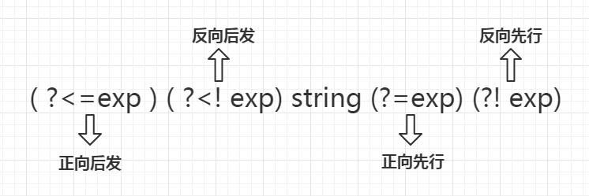
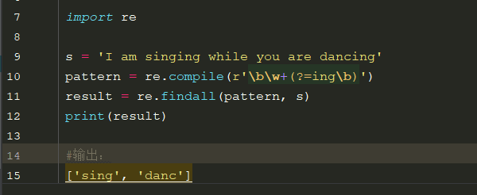
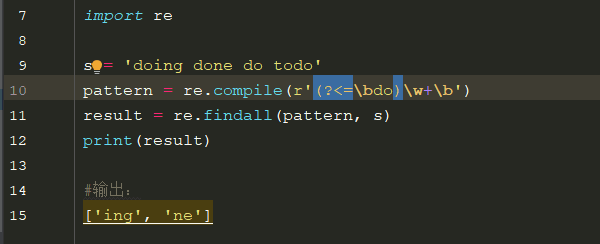
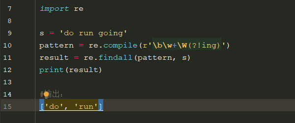
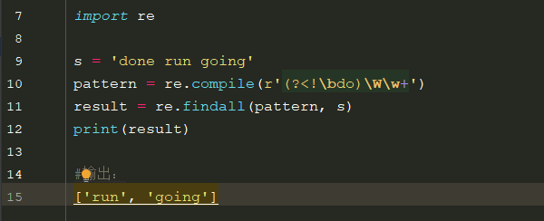

# 正则表达式、正则模块方法

### 正则表达式

##### 正则表达式定义

正则表达式：**对字符串进行查找、匹配、切割、替换用的一种工具**。

1. 正则表达式本身也是一个符合正则规范的字符串。
2. 正则表达式前面一般要加 `r` 来阻止转义。

##### 正则表达式符号

```
 .：匹配一个任意的字符（换行符除外）
\w：匹配一个字符是字母、数字或者下划线
\W：匹配非字母、数字、下划线
\s：匹配一个空白字符（空格，换行，制表符）
\S：匹配非空白字符
\d：匹配一个数字字符
\D：匹配非数字字符
\b：检测边界（边界可以是空格、逗号、问号，但数字、字母不行）
\B：检测非边界
\A：匹配输入字符串的开始位置
\Z：匹配输入字符串的结束位置
注意：正则表达式符号中有很多用到'\'的符号，其功能不是转义，而是表示特殊的意义。

^：检测字符串开始（^The --> 匹配以The开头的字符串）
$：检测字符串结束
[]：匹配[]中出现的任意一个字符
	[0-9]：匹配0，1，2，3，4，5，6，7，8，9中的任意一个字符
	[a-z]：匹配任意一个小写字母
	[A-Z]：匹配任意一个大写字母
	[a-zA-Z]：匹配所有的字母
[^]：匹配不在[]出现的任意一个字符
注意：- [] ^ \在[]中是特殊的符号，需要加'\'；而 .{} () * + ? $ | 在[]中可以不用加'\'，来表示字符

匹配模式：贪婪模式（默认）、非贪婪模式
贪婪模式：匹配尽可能长的字符串（*、+、?、{N,}、{M,N}）
    *：匹配0次或者多次
    +：匹配一次或者多次
    ?：匹配0次或者1次
    {N}：匹配N次
    {N,}：匹配大于等于N次
    {M,N}：匹配至少M次最多N次
非贪婪模式：第一次匹配成功后就停止匹配（{m,n}?、{m,}?、??、*?、+?）
	*?：重复任意次，尽可能少的重复
	+?：重复一次或多次，尽可能少的重复
	??：重复0次或者1次，尽可能的少重复
	{N,}?：重复至少N次，尽可能少的重复
	{N,M}?：重复N到M次，尽可能少的重复

 |：分之（结果可以是‘|’左边或右边的正则表达式匹配的结果）
()：整合（匹配的时候让‘()’中的正则条件变成一个整体）
\N：匹配前面第N个组中匹配到的内容
\10：匹配第n个分组的内容，否则指的是八进制字符码的表达式
注意：在正则表达式中单纯表达 . \ [] {} () * + ? | $ ^  这些有特殊意义字符，需要在前面加'\'
```

### 正则模块方法

##### `re` 模块

`re` 模块：`Python`内置的处理正则表达式的模块。

```python
# 通过导入re模块进行使用
import re
```

##### `fllmatch` 方法

`re.fllmatch(正则表达式, 字符串)`：通过正则表达式**从字符串头部开始**进行**全部匹配**。

1. 匹配成功，输出匹配后的**字符串组**。
2. 匹配不成功，输出 `None`。

```python
# .：匹配一个任意的字符
print(re.fullmatch('.', 'a'))           # <...span=(0, 1), match='a'>
print(re.fullmatch('.', 'ab'))          # None
print(re.fullmatch('..', 'ab'))         # <...span=(0, 2), match='ab'>
print(re.fullmatch('ab', 'ab'))         # <...span=(0, 2), match='ab'>
print(re.fullmatch(r'a.', 'ab'))        # <...span=(0, 2), match='ab'>

# \w：匹配一个字符是字母、数字或者下划线
print(re.fullmatch(r'\w', '@'))         # None
print(re.fullmatch(r'\w', 'a'))         # <...span=(0, 1), match='a'>
print(re.fullmatch(r'\w', 'ab'))        # None
print(re.fullmatch(r'\w\w', 'ab'))      # <...span=(0, 2), match='ab'>
print(re.fullmatch(r'\w.\w', 'u(9'))    # <...span=(0, 3), match='u(9'>

# \W：匹配非字母、数字、下划线
print(re.fullmatch(r'\W\w', '&k'))      # <...span=(0, 2), match='&k'>

# \s：匹配一个空白字符（空格，换行，制表符）
print(re.fullmatch('a\sb', 'a b'))      # <...span=(0, 3), match='a b'>
print(re.fullmatch('a\sb', 'a\tb'))     # <...span=(0, 3), match='a\tb'>
print(re.fullmatch('a\sb', 'a\nb'))     # <...span=(0, 3), match='a\nb'>

# \S：匹配非空白字符
print(re.fullmatch(r'\S.', 'p8'))       # <...span=(0, 2), match='p8'>

# \d：匹配一个数字字符
print(re.fullmatch(r'\d\d\d', '123'))  	# <...span=(0, 3), match='123'>
print(re.fullmatch(r'\d\d\d', '1b3')) 	# None
print(re.fullmatch(r'0\d\d', '019'))  	# <...span=(0, 3), match='019'>

# \D：匹配非数字字符
print(re.fullmatch(r'\D\w', 'ab'))		# <...span=(0, 2), match='ab'>

# \B：检测非边界
print(re.fullmatch(r'ab\Bc', 'abc'))    # <...span=(0, 3), match='abc'>

# ^：检测字符串开始
print(re.fullmatch(r'^The', 'The'))  	# <...span=(0, 3), match='The'>

# []：匹配[]中出现的任意'一个字符'
print(re.fullmatch(r'abc[1a]', 'abca'))   # <...span=(0, 4), match='abca'>
print(re.fullmatch(r'abc[1a]', 'abc1'))   # <...span=(0, 4), match='abc1'>
print(re.fullmatch(r'abc[1a]', 'abc1a'))  # None
print(re.fullmatch(r'[\d_]abc', '1abc'))  # <...span=(0, 4), match='1abc'>
print(re.fullmatch(r'[\d_]abc', '_abc'))  # <...span=(0, 4), match='_abc'>
print(re.fullmatch(r'[\d_]abc', 'aabc'))  # None

# [^]：匹配不在[]出现的任意一个字符
print(re.fullmatch(r'abc[^\da]', 'abc1')) # None
print(re.fullmatch(r'abc[^\da]', 'abca')) # None
print(re.fullmatch(r'abc[^\da]', 'abcw')) # <...span=(0, 4), match='abcw'>

# *：匹配0次或者多次
print(re.fullmatch(r'\d*abc', 'abc'))  	  # <... span=(0, 3), match='abc'>
print(re.fullmatch(r'\d*abc', '1abc'))    # <... span=(0, 4), match='1abc'>
print(re.fullmatch(r'\d*abc', '321abc'))  # <... span=(0, 6), match='321abc'>
print(re.fullmatch(r'\d*abc', '12a34abc'))# None

# +：匹配一次或者多次
print(re.fullmatch(r'\d+\w*', '12as'))	  # <... span=(0, 4), match='12as'>

# ?：匹配0次或者1次
print(re.fullmatch(r'[a-z]?123', 'A123')) # <... span=(0, 4), match='c123'>
print(re.fullmatch(r'[+]?[1-9][0-9]*', '+120')) # <... span=(0, 4), match='+120'>

# {N}：匹配N次
print(re.fullmatch(r'[12ab]{3}abc', 'aaaabc'))  # <... span=(0, 6), match='aaaabc'>
print(re.fullmatch(r'[12ab]{3}abc', '21babc'))  # <... span=(0, 6), match='21babc'>

# |：分之
print(re.fullmatch(r'\d{3}|[a-z]{3}', 'wba'))   # <... span=(0, 3), match='wba'>

# ()：整合
print(re.fullmatch(r'(abc){3}', ('abcabcabc'))) # <... span=(0, 9), match='abcabcabc'>
print(re.fullmatch(r'(\d\w[0-3]){2}', ('3a3')))   # None
print(re.fullmatch(r'(\d\w[0-3]){2}', ('3a37b1')))# <...span=(0, 6), match='3a37b1'>

# \N：匹配前面第N个组中匹配到的内容
print(re.fullmatch(r'([1-9][a-z]{2})\1', '8hh8hh'))# <...span=(0, 6), match='8hh8hh'>

# 在正则表达式中单纯表达 . \ [] {} () * + ? | $ ^  这些有特殊意义字符，需要在前面加'\'
print(re.fullmatch(r'\d+\.\d', '1299'))  		# None
print(re.fullmatch(r'\d+\.\d', '12.9'))  		# <... span=(0, 4), match='12.9'>
```

##### `match` 方法

`re.match(正则表达式，字符串)`：通过正则表达式**从字符串头部开始**进行**部分匹配**或**全部匹配**。

1. 匹配成功，输出匹配后的**字符串组**。
2. 匹配不成功，输出 `None`。

```python
# \d：匹配一个数字字符
print(re.match(r'0\d\d', '01'))      # None
print(re.match(r'0\d\d', '0190'))    # <... span=(0, 3), match='019'>

# +?：重复一次或多次，尽可能少的重复
print(re.match(r'ba+?','baaaa'))     # <... span=(0, 2), match='ba'>

# *?：重复任意次，尽可能少的重复
print(re.match(r'ba*?b','baaaaab'))  # <... span=(0, 7), match='baaaaab'>

# \b：检测边界（边界可以是空格、逗号、问号，但数字、字母不行）
print(re.match(r'\b...\b', 'jsh'))      # <... span=(0, 3), match='jsh'>
print(re.match(r'\b...\b', 'jsh   '))   # <... span=(0, 3), match='jsh'>
print(re.match(r'\b...\b', 'jsh,,,abc'))# <... span=(0, 3), match='jsh'>
print(re.match(r'\b...\b', 'jshb'))     # None

# \B：检测非边界
print(re.match(r'ab\Bc', 'abc0'))       # <... span=(0, 3), match='abc'>
```

##### `finditer` 方法

`re.finditer(正则表达式，字符串)`：**以迭代器形式返回**字符串中满足正则表达式匹配的**所有**的**子串**。

1. 匹配成功，返回迭代器，迭代器中的内容是匹配对象。
2. 匹配不成功，返回空。

```python
result = re.finditer(r'[a-zA-Z](\d+)', '12a123buy=236ok98s')
for match in result:
    print(match)
'''
输出：
<... span=(2, 6), match='a123'>
<... span=(14, 17), match='k98'>
'''
```

##### `search` 方法

`re.search(正则表达式，字符串)`：通过正则表达式匹配字符串中**任意位置的部分字符串**对象。

1. 匹配成功，**只返回第一个对象**。
2. 匹配不成功，返回 `None`。

```python
print(re.search(r'\d{2,}[a-z]', 'sha23n--877m0899'))  # <...span=(3, 6), match='23n'>
```

##### 对象方法

以上方法返回的是匹配成功的**字符串对象**，我们可以通过对象方法来获取我们需要的数据。

```python
match = re.fullmatch('\w{3}', 'hks')
print(match)                        # <...span=(0, 3), match='hks'>
# a.获取匹配到的结果
print(match.group())                # hks
# b.获取匹配到范围
print(match.span())                 # (0, 3)
# c.获取匹配到的开始下标和结束下标
print(match.start(), match.end())   # 0 3
# d.获取被匹配的原字符串
print(match.string)                 # hks
```

##### `findall` 方法

`re.findall(正则表达式，字符串)`：**以列表形式返回**字符串中满足正则表达式匹配的**所有**的**子串**。

1. 查找成功，以列表形式返回查找到的字符串。
2. 查找不成功，返回空列表 `[]`。
3. 使用 `findall` 可以在正则表达式中添加 `()` **约束获取内容**，`r'a(b)'` 是返回的是 `b` 的值，不是 `a` 的值，但匹配的时候还是按原正则表达式去查找。

```python
# 找到The
print(re.findall(r'The', 'abc hThekl'))                    # ['The']

# ^The：以The开头
print(re.findall(r'^The', 'abc hThekl'))                   # []
print(re.findall(r'^The', 'The abc hThekl'))               # ['The']
print(re.findall(r'[a-zA-Z](\d+)', '12a123buy=236ok98s'))  # ['123', '98']

# $：检测字符串结束
print(re.findall(r'abc$', 'hah abc'))   # ['abc']
print(re.findall(r'abc$', 'hah abc-'))  # []
print(re.findall(r'abc$', 'hah abc   '))# []
```

##### `split` 方法

`re.split(正则表达式，字符串)`：**以列表形式返回**按正则表达式**匹配的字符串**作为**分隔符**进行**切割**的子串。

```python
print(re.split(r'\d+', 'ahsj27jk1kaj8js00'))  # ['ahsj', 'jk', 'kaj', 'js']
```

##### `sub` 方法

`re.sub(替换的字符串，替换后的字符串，原字符串) `：在原字符串中查找符合正则的子串，**替换成新的字符串**。

```python
# 将指定字符串中所有'sb'、'傻'、'叉'替换成 *
str1 = '你好sb,你全家都是sb，大，傻，叉!'
result = re.sub(r'sb|傻|叉', '*', str1)
print(result)  # 你好*,你全家都是*，大，*，*!
```

##### flags参数

re模块的正则表达式相关函数中都有一个flags参数，它代表了正则表达式的匹配标记，可以通过该标记来指定匹配时是否忽略大小写、是否进行多行匹配、是否显示调试信息等。

```python
str1 = '你丫是傻逼吗? 我操你大爷的. Fuck you.'
# re.IGNORECASE忽略大小写
result = re.sub('[操草艹]|fuck|[傻煞沙][比屄逼叉缺吊屌碉雕]', '*', str1, flags=re.IGNORECASE)
print(result)  # 你丫是*吗? 我*你大爷的. * you.
```

##### 分组匹配

\N：匹配前面第N个组中匹配到的内容，但在正则表达式前面必须加上 `r` 或者用双斜杠代替单斜杠。

```python
import re

a1 = '1234'
b1 = re.sub(r'12(3|6)4', r'a\1', a1)
print(b1)  # a3

a2 = '1264'
b2 = re.sub(r'12(3|6)4', r'a\1', a2)
print(b2)  # a6

'''
注释1：被替换和替换的字符串前面都必须加上r，这样\1就代表第一个()匹配的结果，否则表示b'\x01'
注释2：a1第一个()匹配的结果是'3'，结合前面的字符'a'，b1得结果'a3'，按此规则，b2得结果'a6'
'''
```

##### 标志修饰符

正则表达式可以包含一些可选标志修饰符来控制匹配的模式。修饰符被指定为一个可选的标志，多个标志可以通过按位 OR(|) 它们来指定。如 re.I | re.M 被设置成 I 和 M 标志：

| 修饰符 | 描述                                                         |
| ------ | ------------------------------------------------------------ |
| re.I   | 使匹配对大小写不敏感                                         |
| re.L   | 做本地化识别（locale-aware）匹配                             |
| re.M   | 多行匹配，影响 ^ 和 $                                        |
| re.S   | 使 . 匹配包括换行在内的所有字符                              |
| re.U   | 根据Unicode字符集解析字符。这个标志影响 \w, \W, \b, \B.      |
| re.X   | 该标志通过给予你更灵活的格式以便你将正则表达式写得更易于理解。 |

`re.S`：它表示 “.” 的作用扩展到整个字符串，包括“\n”。

```python
import re
a = '''asdfhellopass:
    worldaf
    '''
b = re.findall('hello.*?world', a)
c = re.findall('hello.*?world', a, re.S)
print('b is ' , b)
print('c is ' , c)

'''
输出：
b is  []
c is  ['hellopass:\n    world']
解释：正则表达式中，“.”的作用是匹配除“\n”以外的任何字符，也就是说，它是在一行中进行匹配。这里的“行”是以“\n”进行区分的。a字符串有每行的末尾有一个“\n”，不过它不可见。如果不使用re.S参数，则只在每一行内进行匹配，如果一行没有，就换下一行重新开始，不会跨行。而使用re.S参数以后，正则表达式会将这个字符串作为一个整体，将“\n”当做一个普通的字符加入到这个字符串中，在整体中进行匹配。
'''
```

`re.I`：不区分大小写。

```python
import re
res1 = re.findall(r"ABC", "abc")
res2 = re.findall(r"ABC", "abc", re.I)
print(res1)
print(res2)

'''
输出：
[]
['abc']
'''
```

`re.M`：将所有行的尾字母输出。

```python
import re
s = '12 34\n56 78\n90'

# 匹配位于行首的数字
print(re.findall(r'^\d+', s, re.M))  # ['12', '56', '90']
# 匹配位于字符串开头的数字
print(re.findall(r'\A\d+', s, re.M))  # ['12']
# 匹配位于行尾的数字
print(re.findall(r'\d+$', s, re.M))  # ['34', '78', '90']
# 匹配位于字符串尾的数字
print(re.findall(r'\d+\Z', s, re.M))  # ['90']
```

##### 零宽断言

有时候在使用正则表达式做匹配的时候，我们希望匹配一个字符串，这个字符串的前面或后面需要是特定的内容，但我们又不想要前面或后面的这个特定的内容，这时候就需要零宽断言的帮助了。所谓零宽断言，简单来说就是匹配一个位置，这个位置满足某个正则，但是不纳入匹配结果的，所以叫“零宽”，而且这个位置的前面或后面需要满足某种正则。

零宽断言：**正向和反向两类，每类又分为：预测先行和回顾后发；**



**正预测先行**：简称**正向先行**断言，语法：(?=exp)，它断言此位置的后面能匹配表达式exp,但不包含此位置；如：a(?=\d),返回匹配字符串中以数字为结尾的a字符。举例，获取字符串中以ing结尾的字符：



**正回顾后发**：简称**正向后发**断言，语法：(?<=exp)，它断言此位置的前面能匹配表达式exp；如：(?<=\d)a,返回匹配字符串中以数字为开头的a字符。举例，获取字符串中以do开头的单词后半部分：



**负预测先行**：简称**反向先行**断言，语法：(?!exp),它断言此位置的后面不能匹配表达式exp;如：a(?!\d),返回不匹配字符串中以数字结尾的a字符。举例，匹配出字符串中不是以ing结尾的单词：



**负回顾后发**：简称**反向后发**断言，语法：(?<!exp),它断言此位置的前面不能匹配表达式exp；如：a(?<!exp)a,返回不匹配字符串中以数字开头的a字符。举例，匹配字符串中不以do开头的单词：

