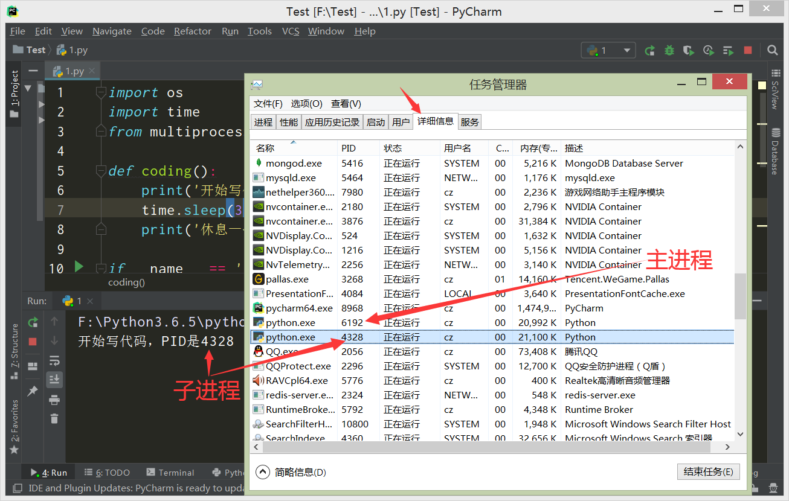

# 进程、线程、协程、效率

## 进程(`Process`)

### 程序和进程

程序：**计算机中静态的可执行文件。**

进程：**计算机运行程序时产生的动态的、有周期的（程序开始运行到运行结束）过程。**

1. **一个程序可以有多个进程，但至少要有一个进程。**
2. **程序占用的是磁盘空间；进程占用的是CPU、内存。**
3. **磁盘、硬盘属于外存储器，不属于计算机的运行资源；CPU、内存属于计算机的运行资源。**
5. **不同时间运行相同程序，产生的进程是不同的，因为进程占用的内存段、内存大小、运行时间都发生了变化。**

### 进程属性

**进程：计算机运行程序的过程。**

特点：**进程是CPU资源分配的最小单位，每个进程都有自己的地址空间、数据栈以及其他的数据**。

优点：进程有独立的地址空间，**当一个进程崩溃后，不会影响其他的进程**。

缺点：在进程之间切换系统资源开销大，数据通信不方便，效率差。

### `multiprocessing` 模块

`multiprocessing` 模块：`Python` 内置的进程模块，提供了 `Process` 类来创建子进程对象。

```
multiprocessing 模块提供的常用方法： 
multiprocessing(target=函数名, args=['函数实参列表'])：创建子进程对象
进程对象.start()：开始执子进程
进程对象.join()：等待子进程结束（join会阻塞进程到任务执行完为止）
```

!> 注意：调用 multiprocessing 模块的函数要在 `if __name__ == '__main__':` 下执行，不然会报错。

### 主进程、子进程

**每个程序都至少有的一个进程**，这个进程就是**主进程**。

**每个进程都有自己的地址空间**，这个是进程id，即**PID**。

```python
import os
# os.getpid输出当前进程的id
print('我是主进程，PID是%s' % os.getpid())
'''
输出：
我是主进程，PID是10432
# 注释：前面提到不同时间运行相同程序，产生的进程是不同的，因此这个PID值是动态的。
'''
```

**每个的运行程序都有一个主进程**，通过 `multiprocessing` 模块创建的进程，都是主进程下面的**子进程**。

**创建子进程**：**程序运行中会有两个进程，一个是主进程，一个是创建的子进程**，在任务管理器详细信息也能看到。

```python
import os
# multiprocessing导入Process类
from multiprocessing import Process

def coding():
    print('开始写代码，PID是%s' % os.getpid())
    print('休息一会儿，PID是%s' % os.getpid())

# 调用 multiprocessing 模块的函数要在 if __name__ == '__main__': 下执行，不然会报错。
if __name__ == '__main__':
    # 通过Process类创建子进程对象p1，target参数接收函数coding作为子进程对象的内容
    p1 = Process(target=coding)
    # 启动子进程p1
    p1.start()
'''
输出：
开始写代码，PID是4328
休息一会儿，PID是4328
# 注释：4328就是子进程的id值。
# 注释：在windows上，子进程会自动import启动它的这个文件，无限递归创建子进程，进而报错，于是使用__main__
'''
```



### 阻塞进程

如果在子进程里要进行大量的耗时的运算，**主进程往往先于子进程之前结束执行**，但如果需要使用到子进程的计算结果，**就必须让主进程等待子进程运行完毕，再执行主进程**，这就是**阻塞进程**。

1. **进程阻塞式针对主进程**。

```python
# 进程没有阻塞
import os
from multiprocessing import Process

def coding():
    print('开始写代码，PID是%s' % os.getpid())
    print('休息一会儿，PID是%s' % os.getpid())

if __name__ == '__main__':
    print('我是主进程，PID是%s' % os.getpid())
    # 创建子进程对象p1
    p1 = Process(target=coding)
    # 启动子进程
    p1.start()
    print('我是主进程，PID是%s' % os.getpid())
'''
输出：
我是主进程，PID是12040
我是主进程，PID是12040
开始写代码，PID是13812
休息一会儿，PID是13812
# 注释：可以看到主进程先于子进程输出，也就是说主进程比子进程更快的执行结束，但如果需要使用到子进程的结果，就需要阻塞进程。
'''

# 有进程阻塞
import os
from multiprocessing import Process

def coding():
    print('开始写代码，PID是%s' % os.getpid())
    print('休息一会儿，PID是%s' % os.getpid())

if __name__ == '__main__':
    print('我是主进程，PID是%s' % os.getpid())
    # 创建子进程对象p1
    p1 = Process(target=coding)
    # 启动子进程
    p1.start()
    # 阻塞主进程，等待子进程p1执行结束
    p1.join()
    print('我是主进程，PID是%s' % os.getpid())
'''
输出：
我是主进程，PID是14228
开始写代码，PID是13316
休息一会儿，PID是13316
我是主进程，PID是14228
'''
```

### 杀掉进程

在多进程程序中，如果某个进程p1一直阻塞，导致后面的进程p2、p3执行不了。可以直接**启动"任务管理器"去杀掉进程（结束进程）**，这时候进程p2和p3的就会执行了，这也说明**进程之间是相互没有关联的，互不影响的**。

## 线程(`Thread`)

### 进程和线程

进程：**计算机运行程序时产生的过程，同时也是CPU资源分配的最小单位。**

线程：**线程是对进程更小维度的划分，同时也是CPU调度的最小单位。**

1. **一个进程可以有多个线程，但至少有一个线程。**
2. **多个线程共享一个进程的内存空间**，进程相当于教室，线程就相当于教室里面的学生，他们共用这一间教室。

### 核与线程

我们平时经常会听到8核、16核处理器，这里的核指的就是**CPU的核芯数**。

**核与线程**的关系，就是**核数与线程数**的关系，就相当于**人数和事情数**的关系，

打个形象的比喻（每个事情代表一个线程）：

```
单核单线程：一个人，喝完酒，然后抽完烟，最后吃完烤鸭。
解释：单核就是一个人，喝酒就是一个单线程，喝完酒线程结束，又执行抽烟这个单线程，抽完烟线程结束，又执行吃烤鸭这个单线程，最后吃完烤鸭线程结束。
原理：一个核，在一个线程结束后再去执行另一个线程，只有一个线程在执行。

单核多线程：一个人，喝一口酒，抽一口烟，吃一口烤鸭，同时进行。
解释：单核就是一个人，喝酒就是一个单线程，喝酒线程还没结束，又执行抽烟这个单线程，抽烟线程还没结束，又执行了吃烤鸭这个单线程。
原理：一个核，在一段时间内执行多个线程，在一个时刻上只能执行一个线程。

多核多线程：三个人，一个人喝酒，一个人抽烟，一个人吃烤鸭，互不干扰。
解释：多核就是多个人，每个人各执行一个喝酒、抽烟、吃烤鸭当中的线程。
原理：多个核，在一段时间内执行多个线程，在一个时刻上能执行多个线程（当线程数等于核芯数时，效率最高）。
```

### 线程属性

优点：**线程没有独立的地址空间，共享数据和内存，资源消耗少，并发性高，运行效率高**

缺点：**一个线程死掉整个进程就死掉，因此多进程要比多线程更健壮；不能用多核；按时间片强制切换，不够灵活**

### `threading` 模块

`threading` 模块：`Python` 内置的线程程模块，提供了 `Thread` 类来创建子线程对象。

```
threading 模块提供的常用方法：
threading.Thread(target=函数名, args=['函数实参列表'])：创建子线程对象
线程对象.start()：开始执子行线程
线程对象.join()：等待子线程结束（join会阻塞线程到任务执行完为止）
threading.Lock()：创建一个线程锁
with 线程锁对象: ：可以对线程自动上锁、解锁
threading.activeCount()：返回正在运行的线程数量
threading.Timer(10,函数名)：创建一个线程对象（通过start运行时，要等待10秒）
threading.Barrier(3)：创建一个线程数为3的对象
线程数为3的对象.wait()：等待线程数到达3往下执行
threading.currentThread()：返回当前的线程变量
threading.enumerate()：返回一个包含正在运行的线程的list
threading.TIMEOUT_MAX：设置threading全局超时时间
```

!> 注意：调用 threading 模块的函数可以不用在 `if __name__ == '__main__':` 下执行。

### 主线程、子线程

**所有的进程默认都有一个线程**，一般叫这个线程为**主线程**。

```python
import threading
print('线程数量:', threading.activeCount())
'''
输出：
线程数量: 1
'''
```

**每个的运行程序都有一个主线程**，通过 `threading` 模块创建的线程程，都是主线程下面的**子线程**。

**创建子线程**：**程序运行中会有两个线程，一个是主线程，一个是创建的子线程**

```python
import threading

def run():
    print('启动线程')
    print('线程数量:', threading.activeCount())
    print('结束线程')


if __name__ == '__main__':
    print('线程数量:', threading.activeCount())
    # 创建子线程对象t1，target参数接收函数run的地址
    t1 = threading.Thread(target=run)
    # 启动子线程t1
    t1.start()
'''
输出：
线程数量: 1
启动线程
线程数量: 2
结束线程
'''
```

### 阻塞线程

与进程一样，但如果需要使用到子线程的计算结果，**就必须让主线程等待子线程运行完毕，再执行主线程**，这就是**阻塞线程**。

1. **阻塞线程是针对主线程。**

```python
# 无阻塞线程
import threading

def run():
    print('子线程开始')
    print('子线程结束')

if __name__ == '__main__':
    print('主线程开始')
    # 创建子线程对象t1，target参数接收函数run的地址
    t1 = threading.Thread(target=run)
    # 启动子线程t1
    t1.start()
    print('主线程结束')
'''
输出：
主线程开始
子线程开始
主线程结束
子线程结束
# 注释：这里也是主线程先于子线程结束，如果需要用到子线程结果，就需要线程阻塞。
'''

# 有阻塞线程
import threading

def run():
    print('子线程开始')
    print('子线程结束')

if __name__ == '__main__':
    print('主线程开始')
    # 创建子线程对象t1，target参数接收函数run的地址
    t1 = threading.Thread(target=run)
    # 启动子线程t1
    t1.start()
    # 阻塞主线程，等待子线程t1执行结束
    t1.join()
    print('主线程结束')
'''
输出：
主线程开始
子线程开始
子线程结束
主线程结束
'''
```

### 线程传参

```python
import threading

def run(a,b,c):
    print('启动子线程')
    print(f'传递的参数为{a,b,c}')
    print('结束子线程')

# 加上要传递的参数args(元组类型)
t1 = threading.Thread(target=run, args=(1,'2',{'c':3},))
# 启动子线程t1
t1.start()
# 等待子线程t1结束
t1.join()
'''
输出：
启动子线程
传递的参数为(1, '2', {'c': 3})
结束子线程
'''
```

### 线程锁

当多个线程同时操作一个变量时，线程不一定是**串行**(一个线程完完全全执行完毕后才进行下一个线程），因此**有些线程操作还没有结束时，就切换到了另一个线程上，导致了现数据混乱**，为了决解数据不一致的情况，就需要给线程加锁。

1. **有锁的线程才能操作数据，没有锁的线程就不能操作数据。**
2. 当一个有锁的线程操作完数据以后，**就必须要释放锁**，给其他线程上锁操作数据。
3. **死锁**：线程获得锁后，不释放锁，其他线程无休止的等待锁的释放。
4. **线程安全**：即线程加锁，多线程访问时，不会出现数据不一致或者数据污染。

```python
# 无锁多线程
import threading

num = 0
def run():
    global num
    for i in range(1000000):
        num += i
        num -= i

# 创建子线程对象
t1 = threading.Thread(target=run)
t2 = threading.Thread(target=run)
# 启动子线程
t1.start()
t2.start()
# 阻塞主线程
t1.join()
t2.join()
print(num)
'''
第一次输出：-1515072
第二次输出：-3135633
# 注释：数据结果的不一致，是因为受多个线程t1、t2操控一个变量num的影响，当线程t1还没有完成对变量num的全部操作时，就切换到了线程t2，在线程t2中变量num存储的仍然是线程t1未操作前的数据。
'''

# 有锁多线程 
import threading

# 创建一个线程锁对象lock
lock = threading.Lock()

num = 0
def run():
    global num
    for i in range(1000000):
        # with 线程锁对象：可以对线程自动上锁、解锁
        with lock:
            num += i
            num -= i

# 创建线程对象
t1 = threading.Thread(target=run)
t2 = threading.Thread(target=run)
# 启动线程
t1.start()
t2.start()
# 阻塞主线程，等待子线程t1、t2结束
t1.join()
t2.join()
print(num)
'''
第一次输出：0
第二次输出：0
'''
```

### 凑线程

**凑线程**：指**凑集一定的线程数**后，**再执行线程**的方式。

```python
import time
import threading

# 创建一个子线程数为3的对象bar
bar = threading.Barrier(3)

def run():
	# 因为是子线程，线程数量要减一
    print('当前活动的子线程数量:', threading.activeCount()-1)
    # 对象bar等待子线程数达到3
    bar.wait()
    print('子线程数量达到3')

# 循环创建5个子线程并启动
for i in range(5):
    threading.Thread(target=run).start()
'''
输出：
当前活动的子线程数量: 1
当前活动的子线程数量: 2
当前活动的子线程数量: 3
# 注释：这里线程数量达到了3，上面代码就以每个线程输出了一次，共三次
子线程数量达到3
子线程数量达到3
子线程数量达到3
# 注释：剩下的两个线程数量达不到3，上面代码就一次不输出。
当前活动的子线程数量: 1
当前活动的子线程数量: 2
'''
```

### 延迟线程

**延迟线程**：让子线程延迟指定时间执行。

```python
import threading

def run():
    print('启动线程')
    print('结束线程')

# 创建一个可定时启动的线程对象t1（通过start运行时，要等待5秒）
t1 = threading.Timer(5,run)
# 启动子线程t1
t1.start()
# 阻塞主线程，等待线程t1
t1.join()
print('结束')
'''
输出：
（5秒后）
启动线程
结束线程
结束
'''
```

## 协程(`Coroutines`)

### 协程定义

**协程**，又称**微线程**，**是对线程更小维度的划分**。它的切换完全由自己创建，它有几种实现方式，一种是yield和send,一种是gevent,一种是greenlet,线程的并发不好，协程可以有上万次并发。回到之前的问题，因为协程在线程内，而线程本身没有锁，所以携程没有锁。

1. **一个进程可以有多个线程，一个线程可以有多个协程。**
2. 维度划分：**进程>=线程>=协程**。
3. **进程、线程都由系统控制，协程由程序猿控制。**

### 协程属性

优点：**内存开销更小，自由切换，避免了无意义的调度，因为只有一个线程，不需要锁机制。**

缺点：**程序员必须自己承担调度责任，同时也失去了标准线程使用多核CPU的能力。**

**`Python` 对协程的支持是通过生成器 `generator` 实现的。**

生成器不但可以通过 `for` 循环迭代，还可以不断调用 `next()` 函数获取由 `yield` 语句返回的下一个值，并且还可以接收调用者发出的参数。

**传统生产者-消费者模型**：一个线程写消息，一个线程取消息，通过锁控制队列和等待，但一不小心就会死锁。

**生成器-协程模型**：生产者生产消息后，直接 `yield` 跳转到消费者，消费者执行完后，切换回生产者继续生产。

```python
def consumer():
    r = ''
    while True:
        n = yield r
        if not n:
            return
        print('[CONSUMER] Consuming %s...' % n)
        r = '200 OK'

def produce(c):
    c.send(None)
    n = 0
    while n < 3:
        n = n + 1
        print('[PRODUCER] Producing %s...' % n)
        r = c.send(n)
        print('[PRODUCER] Consumer return: %s' % r)
    c.close()

c = consumer()
produce(c)
'''
输出：
[PRODUCER] Producing 1...
[CONSUMER] Consuming 1...
[PRODUCER] Consumer return: 200 OK
[PRODUCER] Producing 2...
[CONSUMER] Consuming 2...
[PRODUCER] Consumer return: 200 OK
[PRODUCER] Producing 3...
[CONSUMER] Consuming 3...
[PRODUCER] Consumer return: 200 OK
# 注意：consumer函数是一个generator，把一个consumer传入produce后：
1.首先调用c.send(None)启动生成器；
2.然后，一旦生产了东西，通过c.send(n)切换到consumer执行；
3.consumer通过yield拿到消息，处理，又通过yield把结果传回；
4.produce拿到consumer处理的结果，继续生产下一条消息；
5.produce决定不生产了，通过c.close()关闭consumer，整个过程结束。
# 注释：整个流程无锁，由一个线程执行，produce和consumer协作完成任务，所以称为“协程”，而非线程的抢占式多任务。
'''
```

### asyncio模块

**`asyncio` 是Python 3.4版本引入的标准库，内置了对异步IO的支持，可以实现单线程并发IO操作。**

- `event_loop` 事件循环：程序开启一个无限循环，把一些函数注册到事件循环上，当满足事件发生的时候，调用相应的协程函数。
- `coroutine` 协程：协程对象，指一个使用async关键字定义的函数，它的调用不会立即执行函数，而是会返回一个协程对象。协程对象需要注册到事件循环，由事件循环调用。
- `task` 任务：一个协程对象就是一个原生可以挂起的函数，任务则是对协程进一步封装，其中包含了任务的各种状态。
- `future`：代表将来执行或没有执行的任务的结果，本质上和task上没有的区别。
- `async/await` 关键字：python3.5用于定义协程的关键字，async定义一个协程，await用于挂起阻塞的异步调用接口。

`asyncio`编程模型：**从`asyncio`模块中直接获取一个`EventLoop`（事件循环）的引用，然后把需要执行的`coroutine`（协程）扔到`EventLoop`中执行，就实现了异步IO。**

### 单协程程序

```python
import asyncio

# async把hello()标记为coroutine（协程）类型，这种函数最大特点是执行可以暂停，交出执行权
async def hello():
        print("Hello world!")
        # 在async函数内部加上await命令生成异步任务，线程挂起1秒
        await asyncio.sleep(1)
        print("Hello again!")

# 通过get_event_loop()建立事件循环
loop = asyncio.get_event_loop()
# 把coroutine（协程）扔到EventLoop中执行
loop.run_until_complete(hello())
# 关闭事件循环
loop.close()

'''
输出：
Hello world!
（1秒后）
Hello again!

解释1：执行引擎遇到await命令，暂停当前async函数的执行，把执行权交给其他任务。等到异步任务结束，再把执行权交回async函数，继续往下执行。
解释2：coroutine（协程）不能直接被运行，必须要封装为task或者future才能被运行，而run_until_complete方法可以自动将协程封装为task任务。
'''
```

### 多协程程序

```python
import asyncio
import threading

# async把hello()标记为coroutine（协程）类型
async def hello():
        print('Hello world! (%s)' % threading.currentThread())
        await asyncio.sleep(1)
        print('Hello again! (%s)' % threading.currentThread())

# 通过get_event_loop()建立事件循环
loop = asyncio.get_event_loop()
# tasks封装三个coroutine
tasks = [hello(), hello(), hello()]
# wait()方法作用是接受多个协程组成列表
loop.run_until_complete(asyncio.wait(tasks))
# 关闭事件循环
loop.close()

'''
输出：
Hello world! (<_MainThread(MainThread, started 140735195337472)>)
Hello world! (<_MainThread(MainThread, started 140735195337472)>)
Hello world! (<_MainThread(MainThread, started 140735195337472)>)
(暂停约1秒)
Hello again! (<_MainThread(MainThread, started 140735195337472)>)
Hello again! (<_MainThread(MainThread, started 140735195337472)>)
Hello again! (<_MainThread(MainThread, started 140735195337472)>)

解释1：把asyncio.sleep(1)看成是一个耗时1秒的IO操作，但协程对象不会等待，而是去执行EventLoop中其他可以执行的coroutine了，因此可以实现并发执行。这也就说明协程对象一旦阻塞会将CPU让出而不是让CPU处于闲置状态，这样就大大的提升了CPU的利用率。
解释2：由打印的当前线程名称可以看出，三个coroutine协程是由同一个线程并发执行的。
'''
```

?> 因为GIL锁的存在，简单说，多线程在I/O阻塞时通过切换线程来达到并发的效果，而多协程在I/O阻塞时通过在线程内切换任务来达到并发的效果。

### `run` 方法

在Python3.7以前的版本，调用异步函数前要先调用 `asyncio.get_event_loop()` 函数获取事件循环loop对象，然后通过 `loop.run_until_complete()` 方法执行异步函数，也就是上面的两个程序例子。但在Python3.7的正式版本添加了一些新API，**例如 `asyncio.run()` 方法，可以省去显式的定义事件循环的步骤。**

将多协程例子重写为：

```python
import asyncio
import threading

async def hello():
    print('Hello world! (%s)' % threading.currentThread())
    await asyncio.sleep(1)
    print('Hello again! (%s)' % threading.currentThread())

async def main():
    # gather()方法将三个hello()异步任务包装成一个异步任务，必须等到内部多个异步任务都执行结束，这个新异步任务才会结束。
    await asyncio.gather(hello(), hello(), hello())

asyncio.run(main())

'''
输出：
Hello world! (<_MainThread(MainThread, started 7544)>)
Hello world! (<_MainThread(MainThread, started 7544)>)
Hello world! (<_MainThread(MainThread, started 7544)>)
（1秒后）
Hello again! (<_MainThread(MainThread, started 7544)>)
Hello again! (<_MainThread(MainThread, started 7544)>)
Hello again! (<_MainThread(MainThread, started 7544)>)
'''
```

### 方法详解

上面不同的例子中用到了：`asyncio.wait` 方法和 `asyncio.gather` 方法。重点解释一下：

**coroutine（协程）不能直接被运行，必须要封装为 `task任务` 或者 `future` 才能被被运行。**

**`asyncio.wait` 方法作用是接受单个或者多个协程组成的列表`[coroutine, coroutine...]`，但是包含协程的列表也不能直接被运行，而 `run_until_complete` 方法会首先将tasks列表里的协程先转换为future，所以需要配合使用。**

**`asyncio.gather` 方法作用是接受单个或者多个协程组成的列表`[coroutine, coroutine...]`，但是会将列表中不是task的协程预先封装为future。**

事件循环的 `run_until_complete` 方法对协程对象注册时就自动把它封装成了一个 `task`，我们也可以**显式的将协程对象包装成一个 `task` 再将其注册**。对协程对象包装成task有两种方法：

1. 用事件循环的 `create_task` 方法

```python
import asyncio

async def hello():
        print("Hello world!")
        await asyncio.sleep(1)
        print("Hello again!")

# 通过get_event_loop()建立事件循环
loop = asyncio.get_event_loop()
# create_task方法对协程对象包装成task
task = loop.create_task(hello())
# 把coroutine（协程）扔到EventLoop中执行
loop.run_until_complete(task)
# 关闭事件循环
loop.close()
```

2. 用 asyncio 的 `ensure_future` 方法

```python
import asyncio

# async把hello()标记为coroutine（协程）类型，这种函数最大特点是执行可以暂停，交出执行权
async def hello():
        print("Hello world!")
        # 在async函数内部加上await命令生成异步任务，线程挂起1秒
        await asyncio.sleep(1)
        print("Hello again!")

# 通过get_event_loop()建立事件循环
loop = asyncio.get_event_loop()
# ensure_future方法对协程对象包装成task
task = asyncio.ensure_future(hello())
# 把coroutine（协程）扔到EventLoop中执行
loop.run_until_complete(task)
# 关闭事件循环
loop.close()
```

## 效率

在计算机执行程序，我们总是希望更快的得到结果，于是就有了**时间和空间是不可调和矛盾**。

计算机执行任务的时候有两种模式，一种是用更少的计算机资源和更多的等待时间，另一种是用更多的计算机资源和更少的等待时间。我们通常会选择第二种。

### 进程、线程、协程

**进程**

优势：充分利用多核CPU，即充分利用计算核心，在需要算力的任务上表现好。

劣势：进程有独立地址，来回切换资源开销较大，进程之间数据通信不方便。

**线程**

优势：共享进程资源，来回切换资源开销较小，线程之间数据通信方便，在需要耗时的任务上表现好。

劣势：不能充分使用多核CPU，多线程程序不健壮，一个线程崩溃，全部线程崩溃。

**协程**

优势：自由控制协程切换，没有线程切换的开销，不需要锁，效率极高。

劣势：不能充分使用多核CPU，自己承担协程的调度责任。

**综合优势**：**多进程+协程**，充分利用多核CPU，又充分发挥协程的高效率，可获得极高的性能。

### 任务类型

**I/O密集型任务**：**指磁盘I/O、网络I/O占主要的任务，输入输出量很大，计算量很小**（请求网页、 读写文件等）。

I/O密集型特点：**需要等待时间**，最适合方法就是，遇到延时操作时，就去执行其他的线程，即**多线程**。

**CPU密集型任务**：**计算密集型任务**，**指CPU计算占主要的任务，输入输出量很小，计算量很大**（复杂运算等）。

CPU密集型特点：**需要CPU的算力**，最适合方法就是，充分利用多核CPU，即**多进程**。

### 全局解释锁(`GIL`)

​	全局解释锁(`GIL`)，**简单来说就是一个互斥体(或者说锁)，这样的机制只允许一个线程来控制 `Python` 解释器。它的作用就是单核的情况下可以实现多任务(并发)，这就意味着在任何一个时间点只有一个线程处于执行状态。**

​	`GIL` 对执行单线程任务的程序员们来说并没什么显著影响，但是它成为了计算密集型(CPU-bound)和多线程任务的性能瓶颈。**因为 `GIL` 全局解释锁的存在，导致 `Python` 解释器是单线程的，即使在拥有多个CPU核的多线程框架下都只允许一次运行一个线程**，所以在 `Python` 众多功能中其声誉可谓是“臭名昭著”。

**解决办法：用 `multiprocess` 库替代 `Thread` 库**，`multiprocess` 库的出现很大程度上是为了弥补 `thread` 库因为`GIL` 而低效的缺陷。它完整的复制了一套 `thread` 所提供的接口方便迁移。**Python解释器是单线程，一个Python解释器也就是一个进程，每个进程有自己的独立的GIL，每个Python解释器都有自己的GIL锁，因此也不会出现进程之间的 `GIL` 争抢，这就是为什么多进程程序能摆脱GIL锁的束缚。**

```python
import threading
import multiprocessing
import time

# 函数run1、run2内容主要循环，需要大量的运算，属于CPU密集型任务
def run1():
    for _ in range(10**9):
        pass

def run2():
    for _ in range(10**9):
        pass

if __name__ == '__main__':
    # 单线程/单进程
    t1 = time.time()
    run1()
    run2()
    t2 = time.time()
    print(t2-t1)                        # 46.8
    # 多线程
    t1 = time.time()
    r1 = threading.Thread(target=run1)
    r2 = threading.Thread(target=run2)
    r1.start()
    r2.start()
    r1.join()
    r2.join()
    t2 = time.time()
    print(t2-t1)                        # 43.9
    # 多进程
    t1 = time.time()
    r1 = multiprocessing.Process(target=run1)
    r2 = multiprocessing.Process(target=run2)
    r1.start()
    r2.start()
    r1.join()
    r2.join()
    t2 = time.time()
    print(t2-t1)                        # 23.3
'''
# 注释1：可以看到，单线程、多线程运行时间差不多，原因就在GIL锁上，因为它的存在，两个线程看似同时在运行，实则是在交替运行，在任意一个时间点只有一个线程处于执行状态，也就是本该并行的多线程，被GIL强行转成并发的单线程。
# 注释2：可以看到，多进程相比上面的运行时间减少了一半，这是因为多进程可以做到真正的并行，而多线程就是单线程的并发。
'''
    
# 函数run3、run4内容主要是暂停，不需要大量运算，属于I/O密集型任务。
def run3():
    for _ in range(3):
        time.sleep(3)                  # sleep会阻塞线程

def run4():
    for _ in range(3):
        time.sleep(3)
        
if __name__ == '__main__':
    # 单线程/单进程
    t1 = time.time()
    run3()
    run4()
    t2 = time.time()
    print(t2-t1)                        # 18.0
    # 多线程
    t1 = time.time()
    r1 = threading.Thread(target=run3)
    r2 = threading.Thread(target=run4)
    r1.start()
    r2.start()
    r1.join()
    r2.join()
    t2 = time.time()
    print(t2-t1)                        # 9.0
    # 多进程
    t1 = time.time()
    r1 = multiprocessing.Process(target=run3)
    r2 = multiprocessing.Process(target=run4)
    r1.start()
    r2.start()
    r1.join()
    r2.join()
    t2 = time.time()
    print(t2-t1)                        # 9.1
'''
# 注释1：可以看到，单线程执行I/O密集型任务的方式，就是同步阻塞，在线程阻塞的情况下，什么都不能干，只能等待，而多线程就可以灵活的切换线程，当线程被阻塞时，去执行其他的线程，因此执行时间比单线程少一半。
# 注释2：可以看到，多线程、多进程执行时间差不多，这是因为在阻塞线程的情况下，并发和并行的效率差不多。
'''
```

既然Python解释器是单线程，那么还有进行多线程编程有必要吗？

**答案**：有必要， **多线程能解决很多IO阻塞问题**，就比如执行上面的函数 `run3、run4`，多线程执行的时间就是单线程的一半。能产生IO阻塞的情况很多，比如网络、磁盘，等等。当发生阻塞时，不消耗CPU的，此时如果就一个线程就没法处理其他事。所以对于含有IO阻塞的环境。多线程至少有机会让你把一个CPU核心跑到100%。

既然Python解释器是单线程，为什么多线程程序还需要加线程锁？

**答案**：**因为GIL的存在，多线程不能并行，只能并发，且并发下线程不一定是串行**(一个线程完完全全执行完毕后才进行下一个线程）。在上面线程锁例子中，因为没有线程锁，导致线程读取的变量数据不一致，出现错误的结果。

