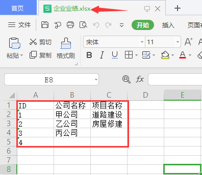
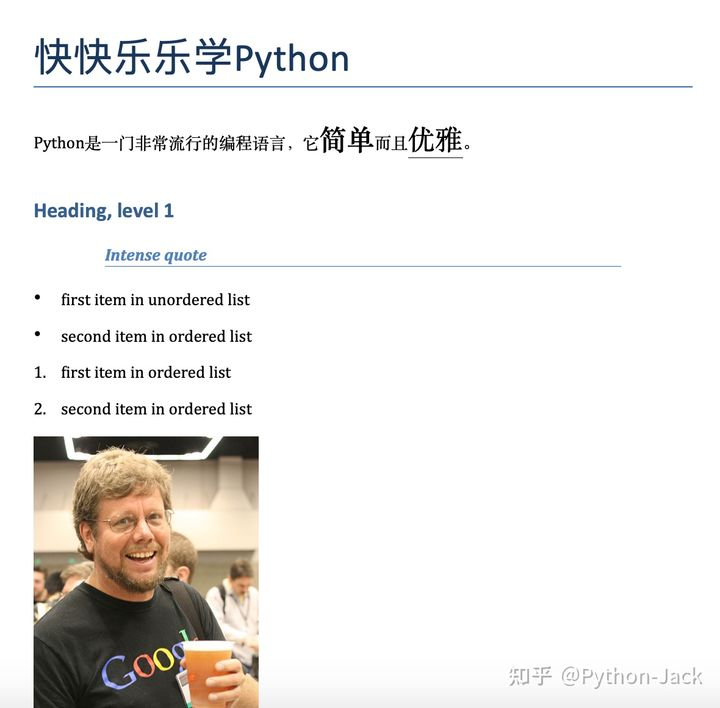

# 常用文件读写

这里介绍我们日常生活中常用的文件读写方法和脚本程序，例如Excel、Word、PPT等文件。

## Excel文件读写

**Microsoft Excel是Microsoft为使用Windows和Apple Macintosh操作系统的电脑编写的一款电子表格软件。**对于普通人来说，数据的读取和存储，除了使用数据库之外，最常见的就是微软的Excel。

Excel文件有 `xls` 和 `xlsx` 两种格式，它们之间的区别是：

**文件格式不同**：xls是一个特有的二进制格式，其核心结构是复合文档类型的结构，而xlsx的核心结构是XML类型的结构，采用的是基于 XML的压缩方式，使其占用的空间更小。

**版本不同**：xls是Excel2003及以前版本生成的文件格式，而xlsx是Excel2007及以后版本生成的文件格式。

**兼容性不同**：xlsx格式是向下兼容的，可兼容xls格式。

Python自带的模块中有针对xls格式的xlrd和xlwt模块，但这两个库仅仅是针对xls的操作，当我们要操作xlsx格式文件时，则需要使用到第三方库。例举以下操作库：

```
xlrd：一个从Excel文件读取数据和格式化信息的库，支持.xls以及.xlsx文件（备注：2.0.1版本不支持xlsx，重装1.2.0版本可以解决）
xlwt：一个用于将数据和格式化信息写入旧Excel文件的库（如.xls）。
xlutils：一个处理Excel文件的库，依赖于xlrd和xlwt，支持.xls文件，支持Excel操作。
xlwings：一个可以实现python中调用Excel的库，支持.xls读，支持.xlsx文件读写，支持Excel操作，支持VBA。
openpyxl：一个用于读取和编写xlsx/xlsm/xltx/xltm文件的库，支持.xlsx文件的读写，支持Excel操作。
xlsxwriter：一个用于创建.xlsx文件的库，支持.xlsx文件的写，支持VBA。
win32com：一个读写和处理Excel文件的库，存在于pywin32中，支持.xls、.xlsx文件的读写，支持.xlsx文件的写，Excel操作。
DataNitro：一个内嵌在Excel中的插件，使用时需依托软件本身，支持.xls，.xlsx文件的读写，支持Excel操作，支持VBA。
Pandas：通过对Excel文件的读写实现数据输入输出，支持.xls，.xlsx文件的读写。
```


```python
# 导入openpyxl库
from openpyxl import Workbook

# 生成一个工作薄对象
wb = Workbook()
# 活动工作薄
ws = wb.active
# 第一行标题栏
ws['A1'] = 'ID'
ws['B1'] = '公司名称'
ws['C1'] = '项目名称'
# 构造数据
A = ('1', '2', '3', '4')
B = ('甲公司', '乙公司', '丙公司')
C = ('道路建设', '房屋修建')
for i in (A, B, C):
    # 从第二行开始插入数据
    index = 2
    for item in i:
        if item in A:
            ws[f'A{index}'] = item
        elif item in B:
            ws[f'B{index}'] = item
        else:
            ws[f'C{index}'] = item
        index += 1
# 保存数据在当前路径的企业业绩.xlsx文件中
wb.save("企业业绩.xlsx")
```



```python
# 导入openpyxl库
from openpyxl import Workbook
# 生成一个工作薄对象
wb = Workbook()
# 抓取活动工作薄
ws = wb.active
# 定义默认的sheet工作薄名称为"资质转让"
ws.title = "资质转让"
# 新建工作薄名称为"资质求购"，在索引为0的位置
wb.create_sheet("资质求购", 0)
# 新建工作薄名称为"服务商"，在索引为1的位置
wb.create_sheet("服务商", 1)
# 保存数据在当前路径的企业业绩.xlsx文件中
wb.save("企业业绩.xlsx")
```


```python
# 导入openpyxl库
import openpyxl
# 使用load_workbook读取excel文件
wb = openpyxl.load_workbook('路径\excel文件.后缀名')
# 选定需要读取的工作薄
ws = wb['excel工作薄名']
# ws.max_row最大行，ws.max_column最大列
for row in range(1, ws.max_row + 1):
    # 读取每行第10列的单元格中的值
    print(ws.cell(row=row, column=10).value)
```

## CSV文件读写

**CSV（Comma Separated Values）全称逗号分隔值文件是一种简单、通用的文件格式，被广泛的应用于应用程序（数据库、电子表格等）数据的导入和导出以及异构系统之间的数据交换。**因为CSV是纯文本文件，不管是什么操作系统和编程语言都是可以处理纯文本的，使用文本编辑器或类似于Excel电子表格这类工具打开和编辑CSV文件时，你甚至感觉不到CSV和Excel文件的区别。**而且很多编程语言中都提供了对读写CSV文件的支持，很多数据库系统都支持将数据导出到CSV文件中，当然也支持从CSV文件中读入数据保存到数据库中，因此CSV格式在数据处理和数据科学中被广泛应用。**

CSV文件有以下特点：

1. 纯文本，使用某种字符集（如ASCII、Unicode、GB2312等）；
2. 由一条条的记录组成（典型的是每行一条记录）；
3. 每条记录被分隔符（如逗号、分号、制表符）分隔为字段（列）；
4. 每条记录都有同样的字段序列。

在Python标准库中就有对应处理CSV文件的 `csv` 模块，该，具体的代码如下所示。

```python
# 导入csv模块
import csv
import random

with open('scores.csv', 'w') as file:
    # writer函数返回一个csvwriter对象
    writer = csv.writer(file)
    # 通过对象的writerow或writerows方法就可以将数据写入到CSV文件中
    writer.writerow(['姓名', '语文', '数学', '英语'])
    names = ['关羽', '张飞', '赵云', '马超', '黄忠']
    for i in range(5):
        verbal = random.randint(50, 100)
        math = random.randint(40, 100)
        english = random.randint(30, 100)
        writer.writerow([names[i], verbal, math, english])
```


上面的 `writer` 函数除了传入要写入数据的文件对象外，还可以 `dialect` 参数，它表示CSV文件的方言，默认值是 `excel`。除此之外，还可以通过 `delimiter`、`quotechar`、`quoting` 参数来指定分隔符（默认是逗号）、包围值的字符（默认是双引号）以及包围的方式。其中，包围值的字符主要用于当字段中有特殊符号时，通过添加包围值的字符可以避免二义性。

```python
# 将上面第7行代码修改为下面的代码
writer = csv.writer(file, delimiter='|', quoting=csv.QUOTE_ALL)
```


如果要读取刚才创建的CSV文件，可以使用 `reader` 函数创建出 `csvreader` 对象，该对象是一个迭代器，可以通过 `next` 函数或 `for-in` 循环读取到文件中的数据：

```python
import csv

with open('scores.csv', 'r') as file:
    reader = csv.reader(file, delimiter='|')
    for line in reader:
        print(reader.line_num, end='\t')
        for elem in line:
            print(elem, end='\t')
        print()
'''
读取上面文件输出：
1	姓名	语文	数学	英语	
2	
3	关羽	77	93	56	
4	
5	张飞	75	41	98	
6	
7	赵云	59	63	71	
8	
9	马超	51	93	61	
10	
11	黄忠	91	55	30	
12	
'''
```

!> 注意上面的代码对 `csvreader` 对象做 `for` 循环时，每次会取出一个列表对象，该列表对象包含了一行中所有的字段。

## Word文件读写

**Word是微软公司开发的文字处理程序，日常办公中很多正式的文档都是用Word进行撰写和编辑的，目前使用的Word文件后缀名一般为 `.docx`。**通过下面的命令来安装`python-docx`三方库

```
pip install python-docx
```

我们可以使用如下所示的代码来生成一个简单的Word文档：

```python
from docx import Document
from docx.shared import Cm, Pt
from docx.document import Document as Doc

# 创建代表Word文档的Doc对象
document = Document()  # type: Doc
# 添加大标题
document.add_heading('快快乐乐学Python', 0)
# 添加段落
p = document.add_paragraph('Python是一门非常流行的编程语言，它')
run = p.add_run('简单')
run.bold = True
run.font.size = Pt(18)
p.add_run('而且')
run = p.add_run('优雅')
run.font.size = Pt(18)
run.underline = True
p.add_run('。')

# 添加一级标题
document.add_heading('Heading, level 1', level=1)
# 添加带样式的段落
document.add_paragraph('Intense quote', style='Intense Quote')
# 添加无序列表
document.add_paragraph(
    'first item in unordered list', style='List Bullet'
)
document.add_paragraph(
    'second item in ordered list', style='List Bullet'
)
# 添加有序列表
document.add_paragraph(
    'first item in ordered list', style='List Number'
)
document.add_paragraph(
    'second item in ordered list', style='List Number'
)

# 添加图片（注意路径和图片必须要存在）
document.add_picture('resources/guido.jpg', width=Cm(5.2))

# 添加分节符
document.add_section()

records = (
    ('骆昊', '男', '1995-5-5'),
    ('孙美丽', '女', '1992-2-2')
)
# 添加表格
table = document.add_table(rows=1, cols=3)
table.style = 'Dark List'
hdr_cells = table.rows[0].cells
hdr_cells[0].text = '姓名'
hdr_cells[1].text = '性别'
hdr_cells[2].text = '出生日期'
# 为表格添加行
for name, sex, birthday in records:
    row_cells = table.add_row().cells
    row_cells[0].text = name
    row_cells[1].text = sex
    row_cells[2].text = birthday

# 添加分页符
document.add_page_break()

# 保存文档
document.save('demo.docx')
```

?> 提示：上面代码第7行中的注释`# type: Doc`是为了在PyCharm中获得代码补全提示，因为如果不清楚对象具体的数据类型，PyCharm无法在后续代码中给出`Doc`对象的代码补全提示。

执行上面的代码，打开生成的Word文档，效果如下图所示:




对于一个已经存在的Word文件，我们可以通过下面的代码去遍历它所有的段落并获取对应的内容。

```python
from docx import Document
from docx.document import Document as Doc

doc = Document('resources/离职证明.docx')  # type: Doc
for no, p in enumerate(doc.paragraphs):
    print(no, p.text)
```

读取到的内容如下所示：

```
0 
1 离 职 证 明
2 
3 兹证明 王大锤 ，身份证号码： 100200199512120001 ，于 2018 年 8 月 7 日至 2020 年 6 月 28 日在我单位  开发部 部门担任 Java开发工程师 职务，在职期间无不良表现。因 个人 原因，于 2020 年 6 月 28 日起终止解除劳动合同。现已结清财务相关费用，办理完解除劳动关系相关手续，双方不存在任何劳动争议。
4 
5 特此证明！
6 
7 
8 公司名称（盖章）:成都风车车科技有限公司
9               2020 年 6 月 28 日
```

讲到这里，相信很多读者已经想到了，我们可以把上面的离职证明制作成一个模板文件，把姓名、身份证号、入职和离职日期等信息用占位符代替，这样通过对占位符的替换，就可以根据实际需要写入对应的信息，这样就可以批量的生成Word文档。

按照上面的思路，我们首先编辑一个离职证明的模板文件，如下图所示：


接下来我们读取该文件，将占位符替换为真实信息，就可以生成一个新的Word文档，如下所示。

```python
from docx import Document
from docx.document import Document as Doc

# 将真实信息用字典的方式保存在列表中
employees = [
    {
        'name': '骆昊',
        'id': '100200198011280001',
        'sdate': '2008年3月1日',
        'edate': '2012年2月29日',
        'department': '产品研发',
        'position': '架构师',
        'company': '成都华为技术有限公司'
    },
    {
        'name': '王大锤',
        'id': '510210199012125566',
        'sdate': '2019年1月1日',
        'edate': '2021年4月30日',
        'department': '产品研发',
        'position': 'Python开发工程师',
        'company': '成都谷道科技有限公司'
    },
    {
        'name': '李元芳',
        'id': '2102101995103221599',
        'sdate': '2020年5月10日',
        'edate': '2021年3月5日',
        'department': '产品研发',
        'position': 'Java开发工程师',
        'company': '同城企业管理集团有限公司'
    },
]
# 对列表进行循环遍历，批量生成Word文档 
for emp_dict in employees:
    # 读取离职证明模板文件
    doc = Document('resources/离职证明模板.docx')  # type: Doc
    # 循环遍历所有段落寻找占位符
    for p in doc.paragraphs:
        if '{' not in p.text:
            continue
        # 不能直接修改段落内容，否则会丢失样式
        # 所以需要对段落中的元素进行遍历并进行查找替换
        for run in p.runs:
            if '{' not in run.text:
                continue
            # 将占位符换成实际内容
            start, end = run.text.find('{'), run.text.find('}')
            key, place_holder = run.text[start + 1:end], run.text[start:end + 1]
            run.text = run.text.replace(place_holder, emp_dict[key])
    # 每个人对应保存一个Word文档
    doc.save(f'{emp_dict["name"]}离职证明.docx')
```

执行上面的代码，会在当前路径下生成三个Word文档，如下图所示：


## PPT文件读写

**PowerPoint是微软公司开发的演示文稿程序，是微软的Office系列软件中的一员，被商业人士、教师、学生等群体广泛使用，通常也将其称之为“幻灯片”。**在Python中可以使用名为 `python-pptx` 的三方库来生成PowerPoint，首先我们需要安装名为`python-pptx`的三方库，命令如下所示：

```
pip install python-pptx
```

用Python操作PowerPoint的内容，因为实际应用场景不算很多，我不打算在这里进行赘述，有兴趣的读者可以自行阅读`python-pptx`的[官方文档](https://link.zhihu.com/?target=https%3A//python-pptx.readthedocs.io/en/latest/)，下面仅展示一段来自于官方文档的代码：

```python
from pptx import Presentation

# 创建幻灯片对象
pres = Presentation()

# 选择母版添加一页
title_slide_layout = pres.slide_layouts[0]
slide = pres.slides.add_slide(title_slide_layout)
# 获取标题栏和副标题栏
title = slide.shapes.title
subtitle = slide.placeholders[1]
# 编辑标题和副标题
title.text = "Welcome to Python"
subtitle.text = "Life is short, I use Python"

# 选择母版添加一页
bullet_slide_layout = pres.slide_layouts[1]
slide = pres.slides.add_slide(bullet_slide_layout)
# 获取页面上所有形状
shapes = slide.shapes
# 获取标题和主体
title_shape = shapes.title
body_shape = shapes.placeholders[1]
# 编辑标题
title_shape.text = 'Introduction'
# 编辑主体内容
tf = body_shape.text_frame
tf.text = 'History of Python'
# 添加一个一级段落
p = tf.add_paragraph()
p.text = 'X\'max 1989'
p.level = 1
# 添加一个二级段落
p = tf.add_paragraph()
p.text = 'Guido began to write interpreter for Python.'
p.level = 2

# 保存幻灯片
pres.save('test.pptx')
```

运行上面的代码，生成的PowerPoint文件如下图所示：


## PDF文件读写

**PDF是Portable Document Format的缩写，这类文件通常使用`.pdf`作为其扩展名。**在Python中，可以使用名为 `PyPDF2` 的三方库来读取PDF文件，可以使用下面的命令来安装它。

```bash
pip install PyPDF2
```

`PyPDF2` 没有办法从PDF文档中提取图像、图表或其他媒体，但它可以提取文本，并将其返回为Python字符串。

```python
import PyPDF2

reader = PyPDF2.PdfFileReader('test.pdf')
page = reader.getPage(0)
print(page.extractText())
```

当然，`PyPDF2`并不是什么样的PDF文档都能提取出文字来，这个问题就我所知并没有什么特别好的解决方法，尤其是在提取中文的时候。网上也有很多讲解从PDF中提取文字的文章，推荐大家自行阅读[《三大神器助力Python提取pdf文档信息》](https://link.zhihu.com/?target=https%3A//cloud.tencent.com/developer/article/1395339)一文进行了解。

要从PDF文件中提取文本也可以直接使用三方的命令行工具，具体的做法如下所示。

```bash
pip install pdfminer.six
pdf2text.py test.pdf
```

上面的代码中通过创建 `PdfFileReader` 对象的方式来读取PDF文档，该对象的`getPage`方法可以获得PDF文档的指定页并得到一个 `PageObject` 对象，通过 `PageObject` 对象的 `rotateClockwise` 和 `rotateCounterClockwise` 方法可以实现页面的顺时针和逆时针方向旋转，通过 `PageObject` 对象的 `addBlankPage` 方法可以添加一个新的空白页，代码如下所示：

```python
import PyPDF2
from PyPDF2.pdf import PageObject

# 创建一个读PDF文件的Reader对象
reader = PyPDF2.PdfFileReader('resources/XGBoost.pdf')
# 创建一个写PDF文件的Writer对象
writer = PyPDF2.PdfFileWriter()
# 对PDF文件所有页进行循环遍历
for page_num in range(reader.numPages):
    # 获取指定页码的Page对象
    current_page = reader.getPage(page_num)  # type: PageObject
    if page_num % 2 == 0:
        # 奇数页顺时针旋转90度
        current_page.rotateClockwise(90)
    else:
        # 偶数页反时针旋转90度
        current_page.rotateCounterClockwise(90)
    writer.addPage(current_page)
# 最后添加一个空白页并旋转90度
page = writer.addBlankPage()  # type: PageObject
page.rotateClockwise(90)
# 通过Writer对象的write方法将PDF写入文件
with open('resources/XGBoost-modified.pdf', 'wb') as file:
    writer.write(file)
```

使用 `PyPDF2` 中的 `PdfFileWrite` 对象可以为PDF文档加密，如果需要给一系列的PDF文档设置统一的访问口令，使用Python程序来处理就会非常的方便。

```python
import PyPDF2

reader = PyPDF2.PdfFileReader('resources/XGBoost.pdf')
writer = PyPDF2.PdfFileWriter()
for page_num in range(reader.numPages):
    writer.addPage(reader.getPage(page_num))
# 通过encrypt方法加密PDF文件，方法的参数就是设置的密码
writer.encrypt('foobared')
with open('resources/XGBoost-encrypted.pdf', 'wb') as file:
    writer.write(file)
```

上面提到的 `PageObject` 对象还有一个名为 `mergePage` 的方法，可以两个PDF页面进行叠加，通过这个操作，我们很容易实现给PDF文件添加水印的功能。例如要给上面的“XGBoost.pdf”文件添加一个水印，我们可以先准备好一个提供水印页面的PDF文件，然后将包含水印的 `PageObject` 读取出来，然后再循环遍历“XGBoost.pdf”文件的每个页，获取到 `PageObject` 对象，然后通过 `mergePage` 方法实现水印页和原始页的合并，代码如下所示。

```python
import PyPDF2

from PyPDF2.pdf import PageObject

reader1 = PyPDF2.PdfFileReader('resources/XGBoost.pdf')
reader2 = PyPDF2.PdfFileReader('resources/watermark.pdf')
writer = PyPDF2.PdfFileWriter()
# 获取水印页
watermark_page = reader2.getPage(0)
for page_num in range(reader1.numPages):
    current_page = reader1.getPage(page_num)  # type: PageObject
    current_page.mergePage(watermark_page)
    # 将原始页和水印页进行合并
    writer.addPage(current_page)
# 将PDF写入文件
with open('resources/XGBoost-watermarked.pdf', 'wb') as file:
    writer.write(file)
```

如果愿意，还可以让奇数页和偶数页使用不同的水印，大家可以自己思考下应该怎么做。

创建PDF文档需要三方库 `reportlab` 的支持，安装的方法如下所示。

```bash
pip install reportlab
```

下面通过一个例子为大家展示`reportlab`的用法。

```python
from reportlab.lib.pagesizes import A4
from reportlab.pdfbase import pdfmetrics
from reportlab.pdfbase.ttfonts import TTFont
from reportlab.pdfgen import canvas

pdf_canvas = canvas.Canvas('resources/demo.pdf', pagesize=A4)
width, height = A4

# 绘图
image = canvas.ImageReader('resources/guido.jpg')
pdf_canvas.drawImage(image, 20, height - 395, 250, 375)

# 显示当前页
pdf_canvas.showPage()

# 注册字体文件
pdfmetrics.registerFont(TTFont('Font1', 'resources/fonts/Vera.ttf'))
pdfmetrics.registerFont(TTFont('Font2', 'resources/fonts/青呱石头体.ttf'))

# 写字
pdf_canvas.setFont('Font2', 40)
pdf_canvas.setFillColorRGB(0.9, 0.5, 0.3, 1)
pdf_canvas.drawString(width // 2 - 120, height // 2, '你好，世界！')
pdf_canvas.setFont('Font1', 40)
pdf_canvas.setFillColorRGB(0, 1, 0, 0.5)
pdf_canvas.rotate(18)
pdf_canvas.drawString(250, 250, 'hello, world!')

# 保存
pdf_canvas.save()
```

上面的代码如果不太理解也没有关系，等真正需要用Python创建PDF文档的时候，再好好研读一下 `reportlab` 的[官方文档](https://link.zhihu.com/?target=https%3A//www.reportlab.com/docs/reportlab-userguide.pdf)就可以了。