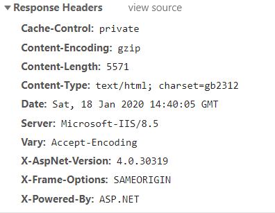

# Spider网络爬虫

## 爬虫简介

网络爬虫：**简称爬虫，又称网络蜘蛛（`spider`）、网络机器人，是一组按照一定规则采集并存储网络信息的自动化程序。**

### 爬虫组成

一个基本的爬虫通常分为三个部分：

1. 采集网页：**请求服务器获取并下载网页数据（通过网络完成）**
2. 筛选数据：**从采集来下的网页数据中筛选出有效数据（通过正则或其他库来完成）**
3. 存储数据：**将筛选出的数据永久保存到机器上（通过数据库或json文件完成）**

### 工作流程

一般来说，爬虫的工作流程包括以下7个步骤：

1. 设定抓取目标（种子页面/起始页面）并获取网页。
2. 当服务器无法访问时，按照指定的重试次数尝试重新下载页面。
3. 在需要的时候设置用户代理或隐藏真实IP，否则可能无法访问页面。
4. 对获取的页面进行必要的解码操作然后抓取出需要的信息。
5. 在获取的页面中通过某种方式（如正则表达式）抽取出页面中的链接信息。
6. 对链接进行进一步的处理（获取页面并重复上面的动作）。
7. 将有用的信息进行持久化以备后续的处理。


## 网页元素

URL：在网络上，**每一项信息资源都有统一的且在网上唯一的地址**，该地址就叫**URL（`Uniform Resource Locator`,统一资源定位符）**，就是指**网络地址，简称网址**。这幅蜡笔小新图片的网络地址`https://timgsa.baidu.com/timg?image&quality=80&size=b9999_10000&sec=1578418740765&di=6547dbf458d375b8f20d2f8ef11b322d&imgtype=0&src=http%3A%2F%2Fuploads.5068.com%2Fallimg%2F1803%2F134RJ2I-5.jpg`，因为图片格式资源，所以结尾是 `.jpg`。


超链接：指**从一个网页指向一个目标的连接纽带**，这个目标可以是另一个网页，也可以是当前网页上的不同位置，还可以是一张图片，一个电子邮件地址，一个文件，甚至是一个应用程序，**而URL只是网页上超链接的一种**。

超文本：**用超链接将不同空间的信息组织在一起的网状文本**，其中可以包含许多元素，比如文字、图片、链接等。

超文本标记语言：**它包括一系列标签，通过这些标签可以将网络上的文档格式统一**，最常用的格式就是**HTML超文本标记语言**。

浏览器：**解析网络上文档格式中的HTML代码，并输出展示解析后的内容**，这是浏览器的主要功能之一。

网页：通过**超文本提供内容**和**HTML规范文本**和**浏览器解析HTML语言**结合形成了网页。

打比方，超链接就像是“指路牌”，指向下一个目标地【**单一指向**】；超文本就像“公路”，上面有许许多多的“指路牌”（超链接）、“汽车”（元素）【**集合**】；HTML 就是“交通规则”，它规范了道路上的一切事物的所在位置【**规则**】。**总的来说，网页就是将超文本经过HTML格式统一提交给浏览器解析后得到的结果。**

## 网络请求

### 请求方式

浏览器想要获取网页的数据，要向负责存放网页数据的服务器发送请求，在请求时，会有多种请求方式，但主要是以下两种：

`GET` 请求：**请求的参数直接在URL里，最多只有1024字节。** 

`POST` 请求：**请求的参数⼀般通过表单提交，不会出现在URL里，大小没有限制。**


### 请求头参数

请求头参数：`Request Headers` ，简称**请求头**，里面**包含了请求网页页面的参数**。

查看方式：各种抓包工具、谷歌浏览器（网页中鼠标右键——查看——Network——点击左侧加载文件——Headers）


**Accept**：**接收数据类型**，指定客户端可以接受的内容类型，比如文本，图片等，内容的先后排序表示客户端接收的先后次序，每种类型之间用逗号隔开。 其中，对于每⼀种内容类型在分号 `;` 后面会加⼀个 `q=0.6` 这样的 `q` 值，表示该种类型被客户端喜欢接受的程度，如果没有表示 `q=1`，数值越高，客户端越喜欢这种类型。**爬取数据时，将想要找的文字、图片放在前面，其他的放在后面，最后⼀定要加上 `q` 值。**

```
Accept:text/html,application/xhtml+xml,application/xml;q=0.9,image/webp,image/apng,*/*;q=0.8,application/signed-exchange;v=b3;q=0.9

textxml,textshtml：文本类型，斜杠后表示⽂档的类型，xml或者shtml

application/xml,application/xhtml+xml：应用类型，后⾯表示文档类型,比如flash动画，excel表格等等

imagegif,imagex-xbitmap：图片类型，表示接收何种类型的图片

/：表示接收任何类型，但是这⼀条⼀般写在最后，表示优先接收前⾯规定的类型，然后再加载其他类型。
```

**Accept-Encoding**：**接收编码类型**，即网络压缩格式。 

```
Accept-Encoding: gzip, deflate

gzip：现在常用的网络压缩格式

deflate：⼀种过时的网络压缩格式
```

**Accept-Language** ：**可以接受语言类型**，⼀般就接收中文和英文，参数值规范和 accept的很像。

``` 
Accept-Language: zh-CN,zh;q=0.8,en-US;q=0.6,en;q=0.4 

zh-CN：中文简体⼤陆

zh：其他中⽂

en-US：英语美语 

en：其他英语
```

**Accept-Charset** ：**表单数据的字符集类型**，若没有定义，则默认值为 `unknown`。如果服务器没有包含此种字符集，就无法正确接收。⼀般情况下，在爬⾍时不定义该属性。

```
Accept-Charset：gb2312,gbk;q=0.7,utf-8;q=0.7,*;q=0.7
```

**Cache-Control**：**缓存控制**，指定了服务器和客户端在交互时遵循的缓存机制，即是否要保留缓存页面数据。 ⼀般在使用浏览器访问时，都会在计算机本地留下缓存页面，相当于是浏览器中的页面保存和下载选项。**但是爬虫就是为了从网络上爬取数据，所以几乎不会从缓存中读取数据，所以在设置的时候要侧重从服务器请求数据而非加载缓存**。 

```
no-cache：客户端告诉服务器不读取缓存，只向服务器发起请求。

no-store：请求和响应都禁止缓存，即不存储。 

max-age=0：表示当访问过此网页后的多少秒内再次访问，只加载缓存，而不去服务器请求，爬虫⼀般就写0秒。

⼀般爬虫就使用以上几个参数，其他的参数都是接受缓存的，所以就不列出了。
```

**Content-Type**：**表示具体请求中的媒体类型信息，出现在POST请求中。**例如：`Content-Type: text/html;charset:utf-8;`

```
 常见的媒体格式类型如下：
    text/html ： HTML格式
    text/plain ：纯文本格式      
    text/xml ：  XML格式
    image/gif ：gif图片格式    
    image/jpeg ：jpg图片格式 
    image/png：png图片格式

以application开头的媒体格式类型：
   application/xhtml+xml ：XHTML格式
   application/xml     ： XML数据格式
   application/atom+xml  ：Atom XML聚合格式    
   application/json    ： JSON数据格式
   application/pdf       ：pdf格式  
   application/msword  ： Word文档格式
   application/octet-stream ： 二进制流数据（如常见的文件下载）
   application/x-www-form-urlencoded ： <form encType=””>中默认的encType，form表单数据被编码为key/value格式发送到服务器（表单默认的提交数据的格式）
   
另外一种常见的媒体格式是上传文件之时使用的：
    multipart/form-data ： 需要在表单中进行文件上传时，就需要使用该格式
```

**Pragma**： 防止页面被缓存, 和 cache-control 类似的⼀个字段，**⼀般爬虫都写成 no-cache**。

**Connection**：**保持长连接**，由于http请求是无记忆性的，长连接指的是在客户端和服务端之间建立⼀个通道，方便两者之间进行多次数据传输，而不用来回传输数据。**爬虫⼀般都建立⼀个长连接**。

```
Connection:keep-alive

keep-alive：表示希望保持畅通来回传输数据

close：表示不想建立长连接，在操作完成后关闭链接
```

**Proxy-Connection**：**代理服务器保持长链接**，数据从客户端到代理服务器和从代理服务器到被请求的服务器之间，如果存在信息差异的话，会造成信息请求不到，但是在⼤多数情况下，都还是能够成⽴的。

**Cookie** ：**跟踪浏览器用户的访问前后路径**，Cookie是客户机在请求服务器时，服务器返回的⼀个键值对样的数据给浏览器，**下⼀次浏览器再访问这个域名下的网页时，就需要携带这些键值对数据在 Cookie中**。 在爬虫时，**根据前次访问得到 cookie数据，然后添加到下⼀次的访问请求头中**，是**一个比较关键的字段**。

```
Cookie:ASP....=...
```

**Host**：**服务器网站域名**，爬虫时可以从访问的 URL 中获得。

```
Host:www.主机域名.com
```

**Referer**：**上一层网页的 URL**。由于**http协议的无记忆性**，服务器可从这里了解到客户端访问的前后路径，并做⼀些判断，**如果后一次访问的URL不能从前⼀次访问的页面上跳转获得， 在⼀定程度上说明了请求头有可能伪造**。个别爬虫需要加上该参数。

```
Referer:https://www.上一层网页URL.com?...
```

**DNT**： **禁止第三方网站追踪**，主要是用来保护浏览器用户隐私的，用户可以检测到跨站跟踪、cookie 跟踪等等。 在爬⾍时⼀般都是禁止的。**数字1代表禁止追踪，0代表接收追踪，null 代表空置，没有规定**。

**If-Modified-Since**：**指定日期**，只有当所请求的内容在指定的日期之后又经过修改才返回它，否则返回304。其目的是为了提高访问效率。在爬虫时，一般不设置这个值，**而在增量爬取时才设置⼀个这样的值，用以更新信息**。

**Authorization**：当客户端接收到来自WEB服务器的 WWW-Authenticate 响应时，该头部来回应自己的身份验证信息给WEB服务器。主要是授权验证，确定符合服务器的要求。在爬虫时，按需而定。

**User-Agent**：**用户代理**，服务器从此处知道客户端的操作系统类型和版本，电脑CPU类型，浏览器种类版本，浏览器渲染引擎，等等。这是**爬虫中最重要的一个请求头参数**，如果没有此参数很容易被服务器识别并封禁，这是因为许多服务器都会检测请求头的User-Agent参数是否是浏览器，因此我们要尽量将爬虫伪装成正常的用户使用浏览器来请求访问，避免服务器的检测反爬。

```
# 浏览器Firefox版本52.0
User-Agent: Mozilla/5.0 (X11; Linux x86_64; rv:52.0) Gecko/20100101 Firefox/52.0

# 浏览器Chrome版本52.0.2743.11或浏览器Safari版本537.36，前面是windows大概率为Chrome
User-Agent: Mozilla/5.0 (Windows NT 6.3; WOW64) AppleWebKit/537.36 (KHTML, like 
Gecko) Chrome/52.0.2743.116 Safari/537.36
```

## 网络响应

### HTTP状态码

**客户端发送请求，服务器就会返回响应，包括 HTTP 状态码、响应头、响应体。**

HTTP 状态码(`HTTP Status Code`)：表示网页服务器响应状态的3位数字代码，按首位数字分成五个类别，共包含100多种状态码，覆盖了绝大部分可能遇到的情况。每一种状态码都有标准的（或者约定的）解释，客户端只需查看状态码，就可以判断出发生了什么情况。


常见的状态码：


```
1xx：相关信息（API 不需要1xx状态码，下面介绍其他四类状态码的精确含义。）

2xx：操作成功
GET: 200 OK：请求成功。
POST: 201 Created：表示生成了新的资源。
PUT: 200 OK
PATCH: 200 OK
DELETE: 204 No Content：表示资源已经不存在。

3xx：重定向
301 Moved Permanently：永久重定向。
302 Move Temporarily：暂时重定向。

4xx：客户端错误
400 Bad Request：服务器不理解客户端的请求，未做任何处理。
401 Unauthorized：用户未提供身份验证凭据，或者没有通过身份验证。
403 Forbidden：用户通过了身份验证，但是不具有访问资源所需的权限。
404 Not Found：所请求的资源不存在，或不可用。
405 Method Not Allowed：用户已经通过身份验证，但是所用的 HTTP 方法不在他的权限之内。
410 Gone：所请求的资源已从这个地址转移，不再可用。
415 Unsupported Media Type：客户端要求的返回格式不支持。
422 Unprocessable Entity ：客户端上传的附件无法处理，导致请求失败。
429 Too Many Requests：客户端的请求次数超过限额。

5xx：服务器错误（一般来说，API 不会向用户透露服务器的详细信息，所以只要两个状态码就够了。）
500 Internal Server Error：客户端请求有效，服务器处理时发生了意外。
503 Service Unavailable：服务器无法处理请求，一般用于网站维护状态。
```

### 响应头

响应头参数：`Response Headers` ，简称**响应头**，里面**包含了服务器响应的参数**。

查看方式：各种抓包工具、谷歌浏览器（网页中鼠标右键——查看——Network——点击加载文件——Headers）



**Content-Encoding**：**指定响应内容的编码**。

```
Content-Encoding: gzip

gzip：现在常用的网络压缩格式
```

**Content-Type**：**内容类型**。此项参数**针对于 POST 请求，因为 POST 请求体有内容，GET请求体为空**。

```
application/x-www-form-urlencoded：表单数据 

multipart/form-data：表单⽂件上传 

application/json：序列化json数据 

text/xml：xml数据
```

**Date**： 响应产生的时间。

```
Date: Sat, 18 Jan 2020 14:40:05 GMT
```

!> 因为北京时间是东八区，换算成北京时间还需要加上八个小时。

**Server**：包含了服务器的信息，名称，版本号等。

```
Server: Microsoft-IIS/8.5
```

**Set-Cookie**：设置Cookie，即告诉浏览器需要将此内容放在 Cookies 中，下次请求携带 Cookies 请求。

**Last-Modified**：指定资源的最后修改时间。

**Expires**：指定响应的过期时间，将内容更新到缓存中，再次访问时，直接从缓存中加载，降低服务器负载，缩短加载时间。

### 响应体 

**Resposne Body**：**响应体，是响应中最重要的内容，正文数据都是在响应体中**。

1. 请求⼀个网页，它的**响应体就是网页的HTML 代码**。
2. 请求⼀张图片，它的**响应体就是图片的二进制数据**。
3. **最主要的数据都包含在响应体中了，爬虫请求网页后要解析的内容就是响应体**。

## Robots协议

**Robots协议：全称是“网络爬虫排除标准”（Robots Exclusion Protocol）也称为爬虫协议、机器人协议等。网站的Robots协议用简单直接的txt文本告诉爬虫被允许的权限，也就是说robots.txt是搜索引擎或爬虫中访问网站的时第一个要查看的文件。当爬虫访问一个站点时，它会首先检查该站点根目录下是否存在robots.txt，如果文件存在，爬虫就会按照该文件中的内容来确定访问的范围；反之，爬虫能够访问网站上所有没有口令保护的页面。**

**百度其实就是一个大型的爬虫**，当你在百度搜索“淘宝”的时候，搜索结果下方会出现：“由于该网站的robots.txt文件存在限制指令（限制搜索引擎抓取），系统无法提供该页面的内容描述”。百度作为一个搜索引擎，至少在表面上遵守了淘宝网的robots.txt协议，所以用户不能从百度上搜索到淘宝内部的产品信息。


如果想查看一个网站的Robots协议，可以打开位于网站根目录下的robots.txt文件即可。robots.txt文件的内容主要分为三部分：

1. User-agent(用户代理)：一般是搜索引擎、爬虫的名称
2. 允许(Allow)：允许搜索引擎、爬虫访问的页面
3. 不允许(Disallow)：不允许搜索引擎、爬虫访问的页面

```
例如：淘宝robots.txt文件对百度搜索引擎的限制，禁止爬虫访问除了“Allow”规定页面外的其他所有页面。
User-agent:  Baiduspider
Allow:  /article
Allow:  /oshtml
Disallow:  /product/
Disallow:  /
```

## 爬虫规范

### 爬虫二十问

以下是业界某位大神关于爬虫相关问题的回答。

**1.非爬虫方向的技术转行做爬虫是否可行？**

答：可行，而且有一定的基础会很容易上手，至于深入的部分就看自己了。

**2. 非技术转行做爬虫是否可行？**

答：可行，但我认为较难，因为爬虫做深了以后是需要你了解各种相关领域知识的，而你现在对这些领域的东西一无所知，甚至可能连编程都还不知道怎么开始，起点会比有基础的人低很多。

**3. 爬虫工作日常如何？加班多不多？**

答：这个得看公司的，有些公司搞得都是些天天更新反爬的平台（比如工商信息相关的），那基本就是得一直盯着看会不会出问题，一不小心就会要加班。

**4. 爬虫对于学生党的用处体现在哪些地方？**

答：这个问题看个人，因为爬虫技术可用的地方太多了，没法一个一个地都拿出来说。比如你想搞个自动签到的工具，这其实本质上就是爬虫；比如你想搞个自动回复设定内容的机器人，这其实本质上也是爬虫。

**5. 学到什么程度才能入职爬虫工程师？**

答：我觉得首先发请求不用说了吧？抓包工具的使用也不用说了吧？熟练掌握XPath、正则表达式这种解析工具也是基本的，然后JSON之类的传输格式至少要了解过长啥样吧，再就是JS逆向总得会一点吧（从只改变量名函数名混淆级别的代码中找出加密参数生成部分的程度）。差不多会这些以后，再自己做几个项目，应聘个初级爬虫工程师没啥问题。

**6. 如何成为一名优秀的爬虫工程师？**

答：垂直爬虫做到后面本质上就是逆向，你需要有良好的逆向思维方式，并且对一些安全领域的骚东西也有一定的了解，这样你才能游刃有余地处理高难度的反爬。

**7. 学爬虫的学习路线？**

答：有一些Python基础就可以做爬虫了，主要是数据获取、数据解析、数据预处理、数据持久化这方面的东西，然后是一些三方库和框架，如Scrapy、Selenium WebDriver等。

**8. 大约学习并从事爬虫几年才可以达到一个不错的高度？**

答：这个问题也很看个人，我觉得主要看有没有需求逼迫成长吧。之前招人的时候，很多三年经验的也就比入门水平稍微好一点，他们在工作时遇到的难点几乎全是依靠自动化测试工具解决的，对逆向水平毫无增长。所以建议还是多依靠逆向手段去解决问题，成长速度会很快。

**9. 薪资方面如何，在几年内可以达到15K？**

答：同上，标15K及以上的招聘还是挺多的，看看招聘需求就知道大概到什么程度了。

**10. 面试爬虫哪些技能点是加分项？**

答：丰富且有深度的逆向经验、熟悉通信协议底层实现、有过哪些骚操作经历等，但主要还是逆向经验和反爬方面的经验。

**11. 作为一名爬虫工程师，对该岗位的前景如何看待？**

答：未来主要内容在App上的平台应该会越来越多，难度也会越来越高，所以对于爬虫工程师的逆向水平要求会越来越高，只会简单逆向甚至不会逆向的人找工作会越来越难。

**12. 爬虫和数据挖掘是一样的吗？**

答：不一样，爬虫只是将数据取回来，具体怎么分析才是数据挖掘的事情。

**13. 爬虫是否和黑客差不多？**

答：差很多，与上个问题类似，只不过“黑客”这个词太宽泛了，黑客也是有具体方向的。

**14.千奇百怪的验证码只能对接打码平台吗？有啥其他办法？**

答：自己破呗，逆向+机器学习。

**15. 如何爬取某个平台？**

答：涉及法律问题，这种针对某个平台的东西是不能细说的。

**16. 爬虫违法吗？如何避免过线导致的违法？怎么规避法律风险？**

答：算是擦边球吧，其实你即使遵守规则去爬别人的网站，只要人家想搞你，还是可以让你做的事情变成违法的。所以建议不要做太过分的事情，毕竟狗急了也会跳墙。还有就是不要为一些明显是做灰黑产的人/公司写代码，一旦他们出事了，你也会被牵连。知乎上之前那个很火的被抓了的人，从回答内容中来看其实就是做打码平台的那个微凉，他这一个平台据说赚了至少千万，主要应该是提供给做黑产的人使用了，这种情况下被抓是迟早的事。最好的避免违法的办法就是明显觉得不太好的事情就不要去碰，基本就不会有啥问题。

**17. 如何有目的地爬取到真正想要的数据？**

答：让需要数据的人提需求，如果你自己就是那个需要数据的人，那就去做市场调研，看看你需要的数据在哪里能找到。

**18. 反爬虫最先进的技术是什么？最有效的技术是什么？**

答：最先进的技术其实就是使用在PC平台上已经玩烂的各种反破解技术将行为监测点（设备指纹、用户操作等）隐藏起来，然后传给服务端做行为识别，如果操作非人类或者缺少某些东西就触发风控。最有效的技术其实不是技术而是方法，这个方法就是账号收费，将你的数据变成需要花多少钱才能看到这样子的，就能做到啥高端技术都不用上、轻松提高爬虫方的获取数据成本的效果，当然这也需要结合良好的产品设计，否则普通用户的体验会很差。

**19. 请问爬虫在x领域有哪些应用？**

答：这个应该是对应领域的人自己思考一下自己拿到那些公开数据究竟可以做什么。

**20. 需要大量账号的平台成本过高该怎么办？**

答：人家就是依靠这种方式来提高你成本的，你如果觉得成本过高要么放弃要么换一条路线获取数据。

### 爬虫设计

**爬虫程序有个很重要的模块：异常处理。**

有大量请求报错时，一定要让程序自动停掉，不然就变成了网络攻击。好多爬虫程序没有做异常逻辑下错误处理，导致多线程疯狂请求，惹来麻烦。本来正常的一次请求需求耗时500毫秒，万一对方网站服务器出错了，可能100毫秒就返回了，这样会导致爬虫程序的请求放大五倍，对方服务器更大的压力。还有访问超时也是，没做超时处理，尤其是长链接，你你程序疯狂发请求，人家服务器刚好出问题，一直超时，你把人家的长链接全部占住，导致正常访问受阻。这样的后果非常危险！

### 法律界限

最近，国家依法查处了部分编写爬虫程序，盗取其他公司数据的不良企业。一时间风声鹤唳，关于爬虫程序是否违法的讨论遍布程序员圈子。那么到底编写爬虫程序是否违法呢？

**其爬虫下载数据，一般而言都不违法，因为爬虫爬取的数据就是网站上用户打开页面能够看到的数据**，但是如果符合下列行为会具有法律风险：

1. 爬虫强行采集的站点有禁止爬虫采集的声明时。
2. 爬虫强行采集网站有Robots协议拒绝采集时。

如果因为爬虫的问题产生官司，通常如果对方能够举证你的爬虫有破坏动产（如服务器）的行为，那么基本上打官司你会败诉并要求做出赔偿。
