# 网络抓包工具

## 抓包简介

### 背景知识

**数据在网络上是以很小的称为帧（Frame）的单位传输的，帧由几部分组成，不同的部分执行不同的功能。**

**帧通过特定的称为网络驱动程序的软件进行成型，然后通过网卡发送到网线上，通过网线到达它们的目的机器，在目的机器的一端执行相反的过程。接收端机器的以太网卡捕获到这些帧，并告诉操作系统帧已到达，然后对其进行存储。**

在一般情况下，网络上所有的机器都可以“听”到通过的流量，但对不属于自己的数据则不予响应（换句话说，工作站A不会捕获属于工作站B的数据，而是简单地忽略这些数据）。

### 网络数据包

**包(Packet)是TCP/IP协议通信传输中的数据单位，一般也称“数据包”。**

**TCP/IP协议是工作在OSI模型第三层(网络层)、第四层(传输层)上的，帧工作在第二层(数据链路层)。**上一层的内容由下一层的内容来传输，**所以在局域网中，“包”是包含在“帧”里的**。

在网络里，单个消息被划分为多个包，包主要由“目的IP地址”、“源IP地址”、“净载数据”等部分构成：

**目的IP地址**：相当于收信人地址，说明这个数据包是要发给谁的。

**源IP地址**：相当于发信人地址，是说明这个数据包是发自哪里的。

**净载数据**：相当于信件的内容。 

正是因为数据包具有这样的结构，安装了TCP/IP协议的计算机之间才能相互通信。**我们在使用基于TCP/IP协议的网络时，网络中其实传递的就是数据包。**

### 抓包

抓包（packet capture）：**将网络传输发送与接收的数据包进行截获、重发、编辑、转存等操作，用来检查网络安全，也常被用来进行数据截取等。**

通过对网络上传输的数据包进行抓取，并对其进行分析，可以做到：

1. 获取网络通讯的真实内容（甚至可以获取用户名和密码）
2. 对网络故障分析
3. 对程序网络接口分析

## 抓包工具

目前，网络上有许许多多的抓包工具，因为主要功能都是抓包，也就不存在工具的好与坏，不同的工具可能附带有不同的功能，最后抓出来的数据包内容都是一样的。**对于爬虫开发者来说，熟练的使用任意两种抓包工具，就完全能满足需求了。**下面简单讲几款抓包工具，哪个好使你就使哪个：

### 开发者工具

**现在许多常用的浏览器（Chrome、Firefox、IE）里面都有内置的开发者工具，其中就有抓包的功能。**

谷歌浏览器内置的开发者工具：Chrome Developer Tools

工具优势：内置的抓包的工具，启动和使用更加方便，也不会额外占用资源。

打开方式：按 `F12` 键 或者 点击右上角“菜单”选项选择“更多工具”从中选择“开发者工具”。

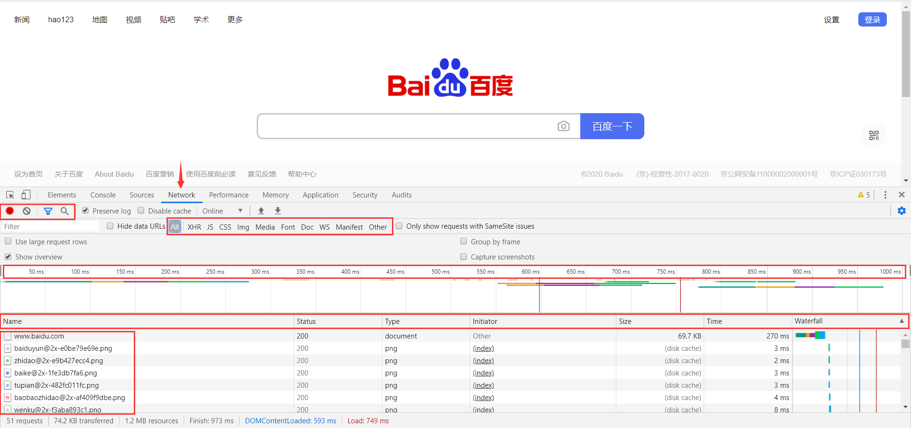

Network栏：**记录页面上的网络请求的详情信息，从发起网页页面请求Request后分析HTTP请求后得到的各个请求资源信息（包括状态、资源类型、大小、所用时间、Request和Response等）。**

```
红色框内，从上到下，从左到右分别是：
第一个框(抓包功能)：开启/关闭抓包、清空全部资源信息、过滤功能、查找功能
第二个框(资源分类)：ALL(全部类型)、XHR(动态加载)、JS(js资源)、CSS(css样式)、Img(图片)、Media(媒体)、Font(字体)、Doc(文档)、WS(通信)、Manifest(缓存)、Other(其他)
第三个框(加载时间)：从请求第一个资源到网页加载完成的时间线
第四个框(资源展示)：Name(资源名称)、Status(状态码)、Type(类型)、Initiator(发起)、Size(大小)、Time(耗时)、Waterfall(瀑布流)
第五个框(资源列表)：详细的展示了每个资源的名称等属性。
```

**选中任意一个资源，在右侧边栏就会出现该资源的详细信息，通过这些信息我们可以针对需要获取的资源进行具体分析。**

?> 当在列表中选中一个资源时，对应上面瀑布流中的该资源加载的时间条也会被选中。

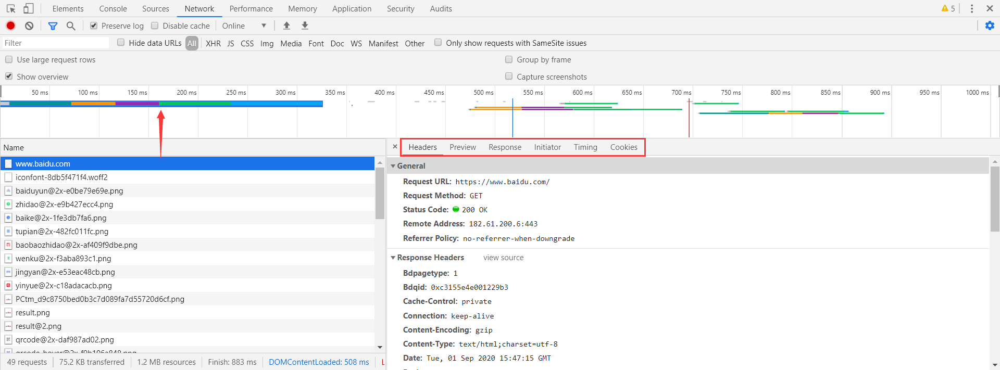

在右侧边栏中六个选项卡，可以帮助我们查看该资源从请求到加载完成的所有信息：

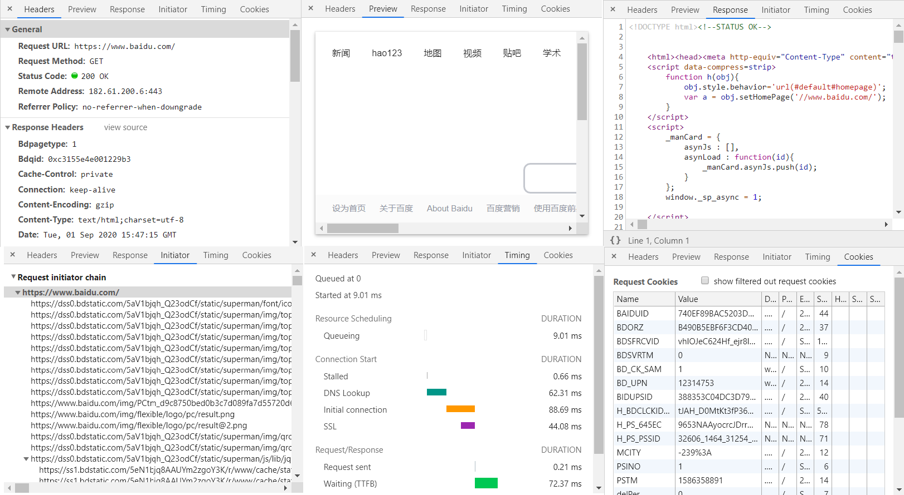

```
Headers：请求资源和接受响应所传递的参数
Preview：根据你所选择的资源类型（JSON、图片、文本）显示相应的预览
Response：查看响应的具体内容
Initiator：标记请求是由哪个对象或进程发起的（请求源）
Timing：显示资源在整个请求生命周期过程中各部分花费的时间
Cookies：显示资源HTTP的Request和Response过程中的Cookies信息
```

?> 更多Chrome开发者工具详细信息参看：[Chrome开发者工具详解(1)-Elements、Console、Sources面板](https://www.cnblogs.com/charliechu/p/5948448.html)

?> 更多Chrome开发者工具详细信息参看：[Chrome开发者工具详解(2)-Network面板](https://www.cnblogs.com/charliechu/p/5981346.html)

?> 更多Chrome开发者工具详细信息参看：[Chrome开发者工具详解(3)-Timeline面板](https://www.cnblogs.com/charliechu/p/5992177.html)

?> 更多Chrome开发者工具详细信息参看：[Chrome开发者工具详解(4)-Profiles面板](https://www.cnblogs.com/charliechu/p/6003713.html)

?> 更多Chrome开发者工具详细信息参看：[Chrome开发者工具详解(5)-Application、Security、Audits面板](https://www.cnblogs.com/charliechu/p/6021141.html)

### HTTPAnalyzer

**HTTPAnalyzer 是一个强大而详细的HTTP协议分析器，学会此工具的使用可以帮助我们高效进行数据的分析。**

工具优势：界面布局更加合理、资源占用也更小。

HTTPAnalyzer 下载地址：[HTTPAnalyzer](https://http-analyzer.en.softonic.com/)


HTTPAnalyzer 运行界面，点击左上角Start后，即可开始抓包。

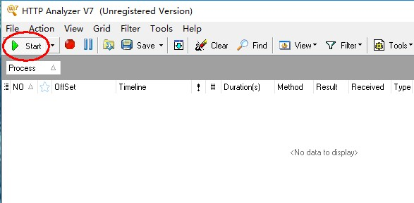

打开浏览器，输入你需要抓包的网址，当浏览器访问完成后，工具就差不多已经抓包好了，如果需要分析返回的数据包内容，可以点击图中的选项卡进行内容查看。

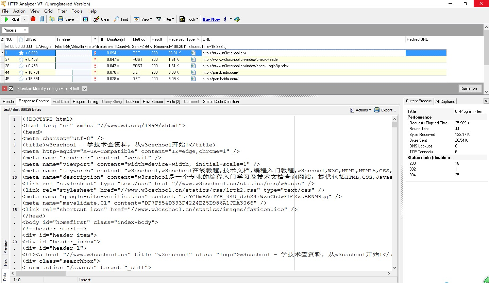

数据捕获过程中，如果确定了需要捕获的数据格式，可以进行如下设置进行数据过滤。

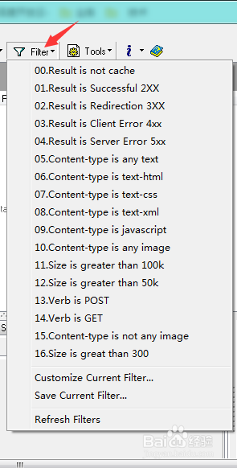

### Fiddler

**Fiddler 是一个用C#写出来的http协议调试代理工具，它能够记录并检查计算机和互联网之间的http通讯，查看所有的“进出”Fiddler的数据（指cookie,html,js,css等文件）并且能够使用.net框架语言进行扩展。** 

工具优势：支持众多的http调试任务，设置断点，篡改及伪造Request/Response的数据，修改hosts，限制网速，http请求性能统计，简单并发，接口测试，辅助自动化测试。

Fiddler 下载地址：[Fiddler官网](https://www.telerik.com/fiddler)


**不使用 Fiddler 的情况下**：浏览器访问一个网站，浏览器给服务器发送一个Request，服务器接收到Request后进行处理，返回给浏览器Response，然后浏览器解析Response中的html，展现网页给用户。

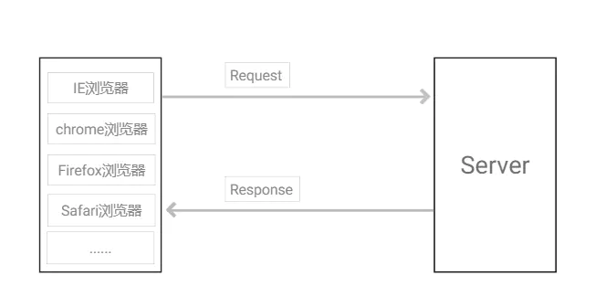

**使用 Fiddler 的情况下，Fiddler 就作为代理服务器**：浏览器首先给时代理服务器 Fiddler 接收到Request， Fiddler 将Request发送到服务器，服务器接收到Request后进行处理，将Response传回给代理服务器 Fiddler，代理服务器 Fiddler 将Response返回到浏览器。

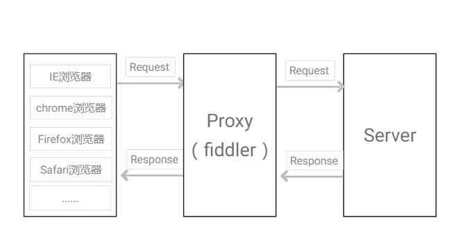

**Fiddler 工作于七层中的应用层，在客户端与服务端之间以代理服务器的形式存在，启动 Fiddler 后会监听本地127.0.0.1的8888端口（默认端口），IE/Chrome浏览器会自动设置局域网代理（Firefox代理是独立的，需要单独设置）。**

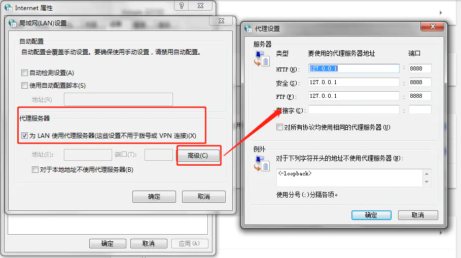

Fiddler 工作界面：按Delete键可以删除会话列表中的会话

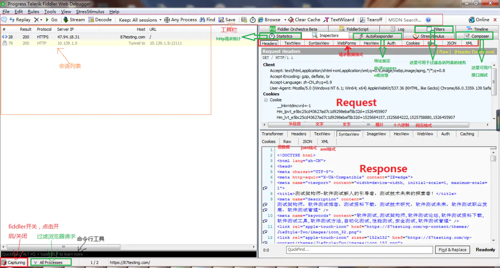

**Fiddler 安装后默认只能抓取http请求，如果需要抓取https请求需要进行配置。**配置方式：Tools--->Options--->HTTPS，勾选 `CaptureHTTPS CONNECTs`、`Decrypt HTTPS traffic`、`ignore server certificate errors(unsafe)`，点击OK，会弹出证书直接确认即可。

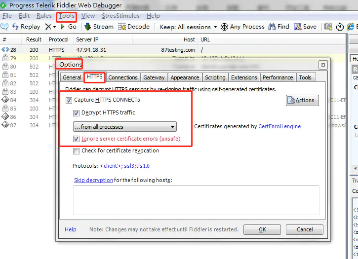

**Fiddler 会话图标含义**：

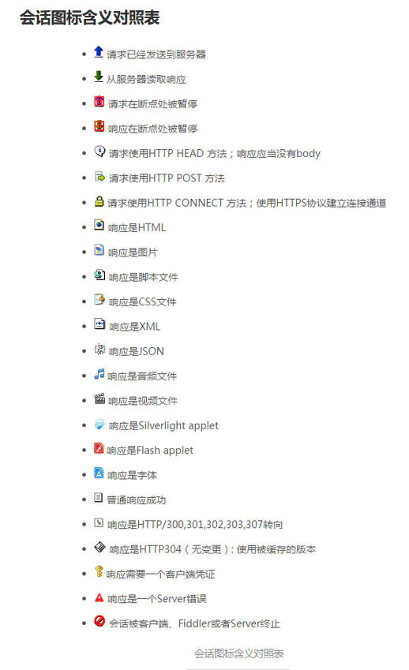

**Fiddler 自带的编码工具**：TextWizard

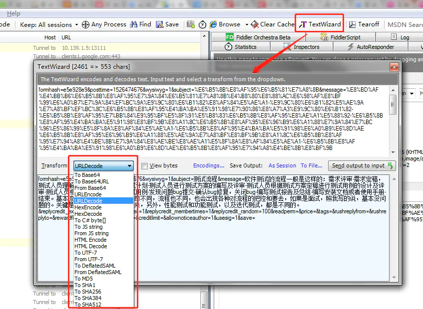

 **Fiddler 断点、篡改和伪造数据**：前面讲过fiddler作为代理服务器时的请求流程图，请求时，可被篡改的两个点：`Before Requests`、`After Responses`。

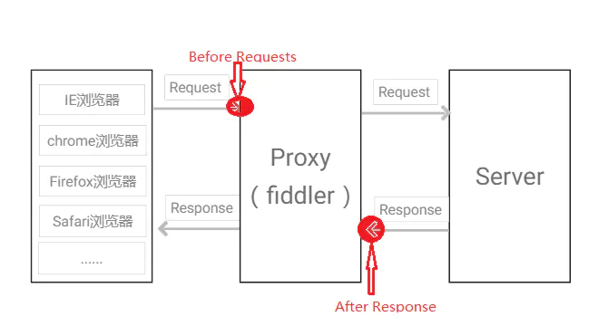

**修改Requests方法**：`Rules---->Automatic Breakpoints---->Before Requests`

以论坛发布帖子为例，修改请求前数据内容，比如发布的内容如下：

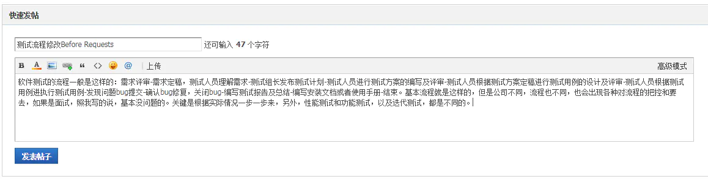

点击发布帖子，此时请求被 Fiddler 拦截掉，将右侧requests body里面的字段message内容前新增内容：“篡改requests数据成功！”，然后点击Run to Completion，先关闭掉拦截Rules---->Automatic Breakpoints---->Disabled，其他请求都放过，点击工具栏中的“Go”

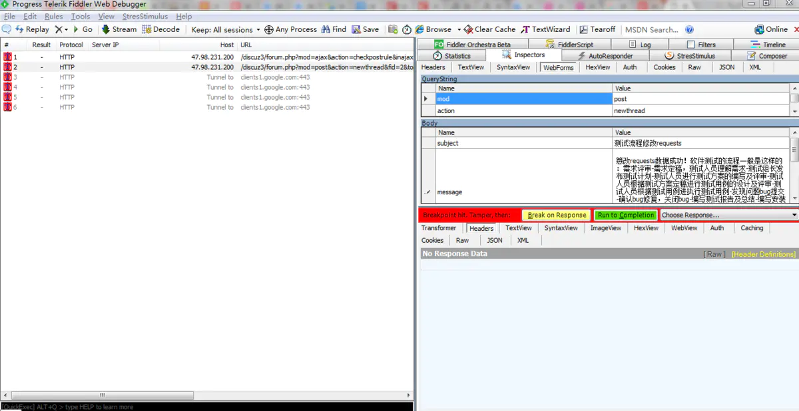

论坛中查看到刚刚发布的帖子内容如下，就被成功篡改了requests：

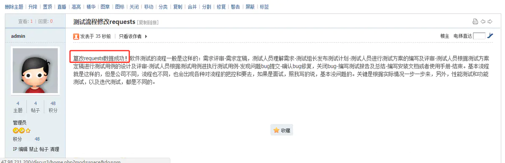

**修改Responses方法**：`Rules---->Automatic Breakpoints---->After Responses`

**Fiddler 命令行QuickExec用法**：

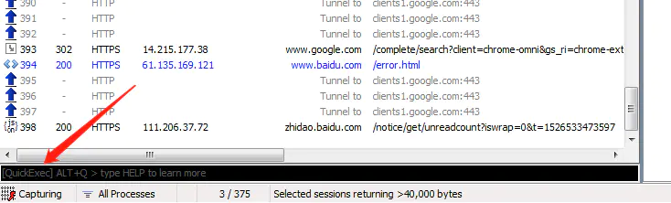

`help` ----- 打开官方QuickExct命令用法帮助

`?87testing` ------ 选中带有87testing的请求

`bpu` -------> 取消拦截请求的requests

`bpu www.87testing.com` -------> 拦截www.87testing.com域名请求的requests

`Bpafter` -------> 取消拦截请求的responses

`Bpafter www.87testing.com` ------> 拦截www.87testing.com域名请求的responses

?> 更多关于 Fiddler 的功能使用参看：[fiddler使用](https://www.jianshu.com/p/e810f52fa71e)

### Wireshark

Wireshark（前称Ethereal）是一个网络封包分析软件。因为Wireshark使用WinPCAP作为接口，直接与网卡进行数据报文交换，撷取网络封包，并尽可能显示出最为详细的网络封包资料。

工具优势：直接在网卡上进行抓包，所抓包的信息资料也最为详细。

Wireshark 下载地址：[Wireshark下载](https://www.wireshark.org/download.html)


Wireshark 主界面如下：

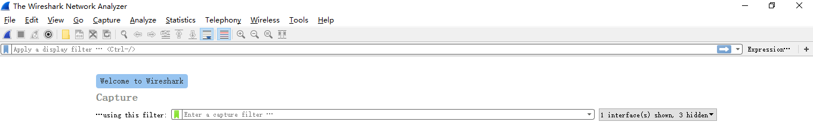

**选择抓取信息的网卡**：选择菜单栏上Capture -> Option，勾选WLAN网卡（这里需要根据各自电脑网卡使用情况选择，简单的办法可以看使用的IP对应的网卡）。点击Start，启动抓包。

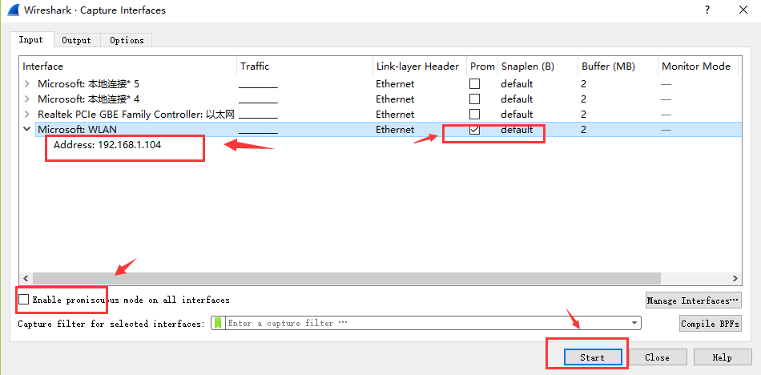

**抓包状态**：wireshark启动后，wireshark处于抓包状态中。

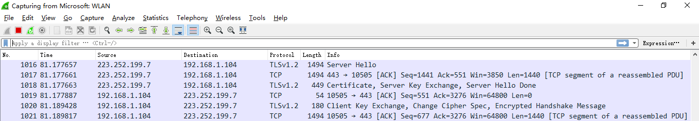

**抓包界面**：wireshark抓包主界面。


**颜色说明**：数据包列表区中不同的协议使用了不同的颜色区分，标识定位在菜单栏View --> Coloring Rules。


**Display Filter**(显示过滤器)：用于设置过滤条件进行数据包列表过滤。菜单路径：Analyze --> Display Filters。


**IP地址过滤**：为避免其他无用的数据包影响分析，可以通过在过滤栏设置过滤条件进行数据包列表过滤，获取结果如下。说明：`ip.addr == 119.75.217.26 and icmp` 表示只显示ICPM协议且源主机IP或者目的主机IP为119.75.217.26的数据包。

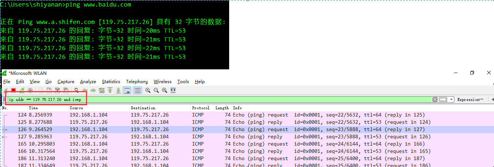

**Packet List Pane**(数据包列表)：显示捕获到的数据包，每个数据包包含编号，时间戳，源地址，目标地址，协议，长度，以及数据包信息。 不同协议的数据包使用了不同的颜色区分显示。


**Packet Details Pane**(数据包详细信息)：在数据包列表中选择指定数据包，在数据包详细信息中会显示数据包的所有详细信息内容。数据包详细信息面板是最重要的，用来查看协议中的每一个字段。各行信息分别为

```
（1）Frame:物理层的数据帧概况
（2）Ethernet II:数据链路层以太网帧头部信息
（3）Internet Protocol Version 4:互联网层IP包头部信息
（4）Transmission Control Protocol:传输层T的数据段头部信息，此处是TCP
（5）Hypertext Transfer Protocol:应用层的信息，此处是HTTP协议
```


**TCP包**：查看TCP包具体内容。


**时间戳显示格式**：调整方法为View -->Time Display Format --> Date and Time of Day。

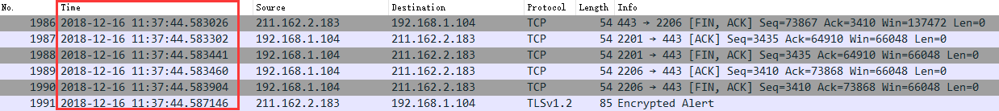

?> 更多 Wireshark 使用方法参看：[wireshark抓包新手使用教程](https://www.cnblogs.com/mq0036/p/11187138.html)

### Postman

Postman是由Postdot Technologies公司打造的**一款功能强大的调试HTTP接口的工具**，它最早是Chrome中最受欢迎的插件之一。该工具不仅可以调试简单的css、html、脚本等简单的网页基本信息，它还可以发送几乎所有类型的HTTP请求！

Postman下载地址：[Postman官网下载](https://www.postman.com/downloads/)


postman基础功能介绍：

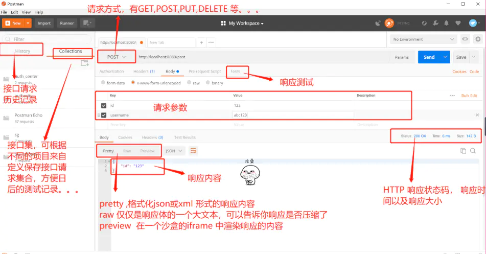

Collection在postman里面相当于一个文件夹，可以把同一个项目的请求放在一个Collection里方便管理和分享，Collection里面也可以再建文件夹。

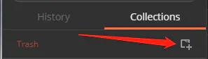

请求区域介绍：

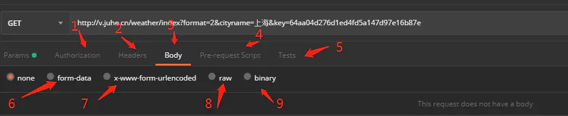

```
Authorization：身份验证，主要用来填写用户名密码，以及一些验签字段，postman有一个helpers可以帮助我们简化一些重复和复杂的任务。

Headers：请求的头部信息。

Body：post请求时必须要带的参数，里面放一些key-value键值对。

Pre-requerst Script：在运行这个请求之前自定义请求数据，语法使用JavaScript语句。

tests：标签功能，通常用来写测试，它是运行在请求之后。postman每次执行request的时候，会执行tests。测试结果会在tests的tab上面显示一个通过的数量以及对错情况。

form-data：它将表单数据处理为一条消息，以标签为单元，用分隔符分开。既可以单独上传键值对，也可以直接上传文件。

x-www-form-urlencoded：对应信息头-application/x-www-from-urlencoded，会将表单内的数据转换为键值对。

raw：可以上传任意类型的文本，比如text、json、xml等，所有填写的text都会随着请求发送。

binary：对应信息头-Content-Type:application/octet-stream，只能上传二进制文件，且没有键值对，一次只能上传一个文件, 也不能保存历史，每次选择文件，提交。
```

?> 更多 Postman 使用功能参看：[Postman教程大全](https://www.jianshu.com/p/97ba64888894)

## 总结

```
开发者工具：浏览器自带最方便，针对当前的浏览器进行抓包，因为加载了运行环境在JS逆向调试方面最为方便。
HTTPAnalyzer：功能简单、资源占用小、方便实用的抓包工具，但不能对使用代理IP的程序抓包。
Fiddler：功能多样，抓包方面比开发者工具更为强大，使用时需要配置证书，不能对使用代理IP的程序抓包。
Wireshark：最强大的抓包工具，直接在网卡进行抓包，可以对使用代理IP的程序抓包，但数据展示直观度不如上面工具。
Postman：简单易用的HTTP接口测试工具。