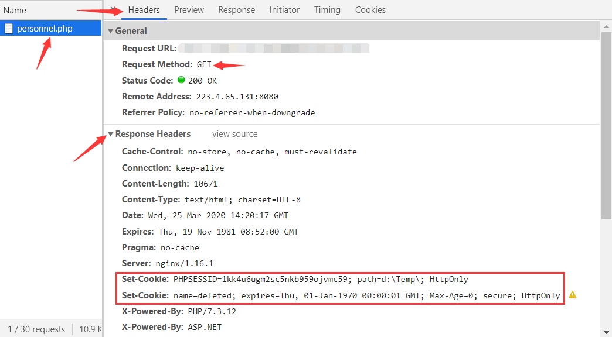
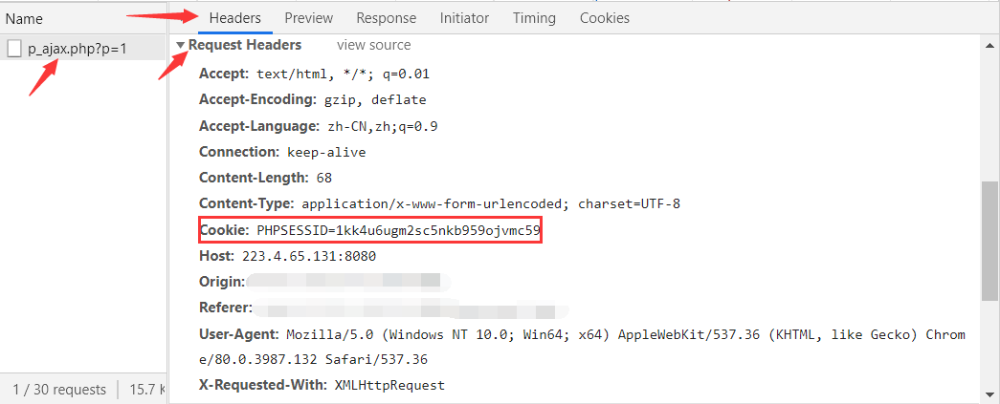
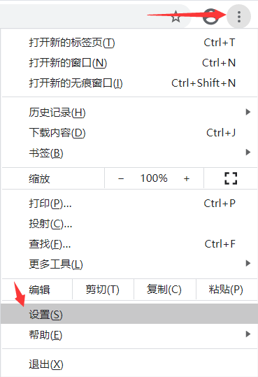
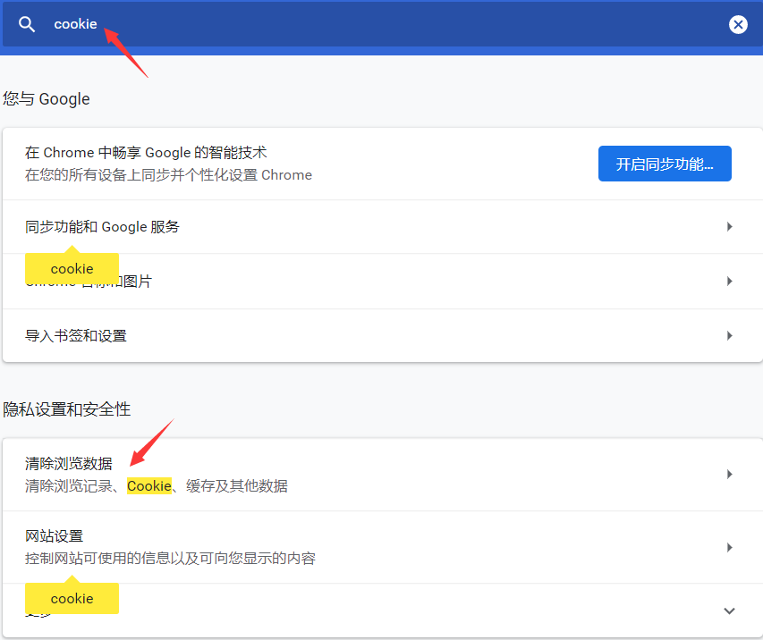
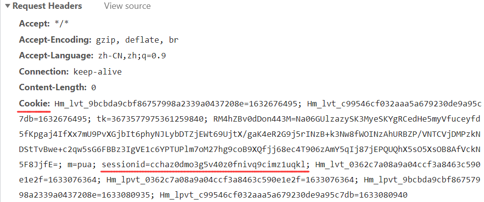
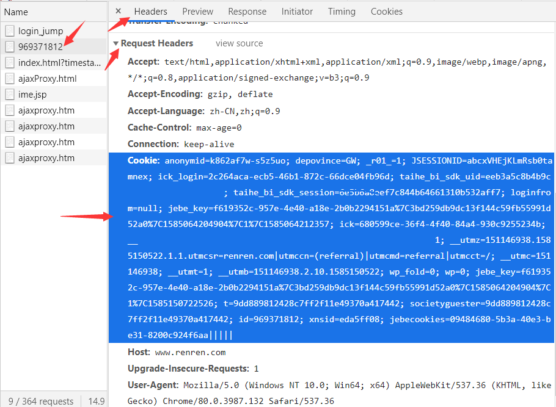
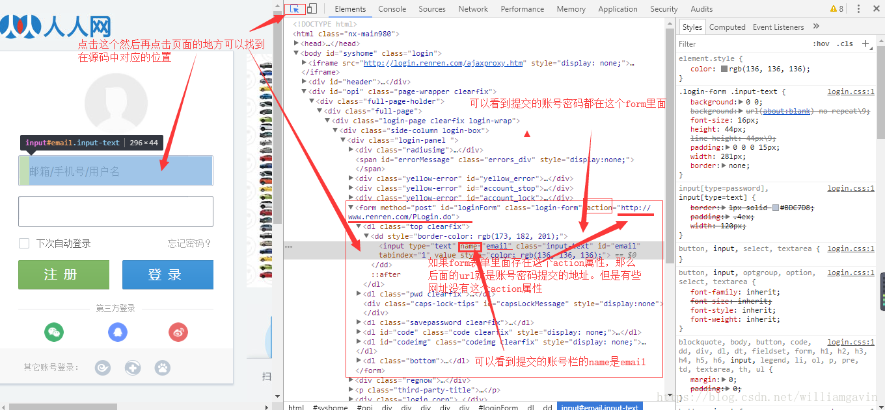
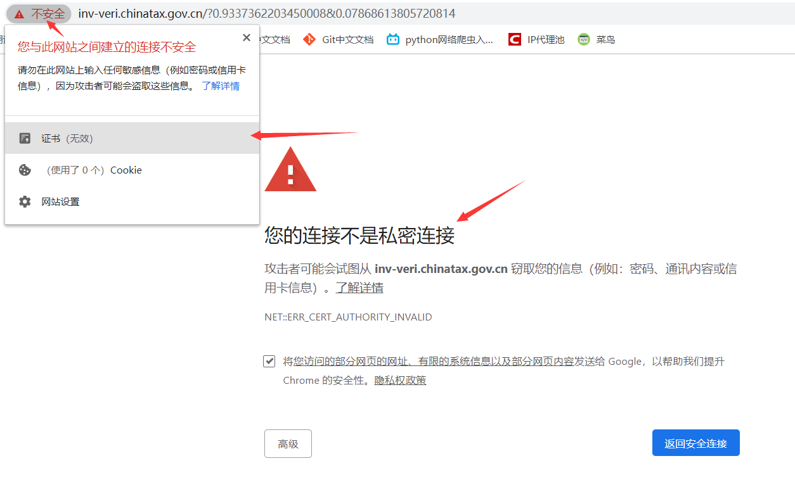

# Requests库

参考内容：[requests中文文档](http://2.python-requests.org/zh_CN/latest/)

## 初识Requests

**requests是实现HTTP各类型请求的最简单、最易用的第三方库，也是写爬虫必须要掌握的库。**使用前需安装requests库：

```
pip install requests
```

使用requests库实现HTTP多种请求类型的发送：

```python
import requests

# get请求（爬虫常用）
requests.get('http://httpbin.org/get')

# post请求（爬虫常用）
requests.post('http://httpbin.org/post', data = {'key':'value'})

# put请求
requests.put('http://httpbin.org/put', data = {'key':'value'})

# delete请求
requests.delete('http://httpbin.org/delete')
```

### GET请求

**当你在浏览器中输入一个网址并回车键的那一刻，就向网站的服务器发送了一个get请求。**

在requests中也只需要输入一个网址就可以发送get请求，重要参数有两个：

1. **url参数：HTTP请求必备的参数，作用是确定访问的网址。**
2. **params参数：以字典的形式传递url中参数。**

```python
import requests

# 基本的GET请求
# 方式一：网址传递给变量，在传递给url参数
link = 'https://httpbin.org/get'
response = requests.get(url=link)
# 方式二：直接传递给url参数（推荐）
response = requests.get('https://httpbin.org/get')

#打印响应的内容信息
print(response.text)
'''
输出：
{
  "args": {}, 
  "headers": {
    "Accept": "/", 
    "Accept-Encoding": "gzip, deflate", 
    "Connection": "close", 
    "Host": "httpbin.org", 
    "User-Agent": "python-requests/2.19.1"
  }, 
  "origin": "182.149.163.126", 
  "url": "https://httpbin.org/get"
}

# 解释：访问https://httpbin.org/get这个网址会返回客户端发送的请求内容。因为没有设置User-Agent，所以默认为python-requests/2.19.1；
'''

# 带参GET请求：在URL中传递的参数会以键/值对的形式跟在一个问号的后面。例如， httpbin.org/get?key=val。这里的params关键字参数，就可以字典形式来传递这些参数。字典里值为 None 的键都不会被添加到 URL 的查询字符串里。

# 方式一：url包含键值对参数
response = requests.get('https://httpbin.org/get?name=germey&age=22')
# 方式二：使用params关键字参数
data = {'name': 'germey', 'age': 22}
response = requests.get('https://httpbin.org/get', params=data)

print(response.text)
'''
输出：
{
  "args": {
    "age": "22", 
    "name": "germey"
  }, 
  "headers": {
    "Accept": "/", 
    "Accept-Encoding": "gzip, deflate", 
    "Connection": "close", 
    "Host": "httpbin.org", 
    "User-Agent": "python-requests/2.19.1"
  }, 
  "origin": "182.149.163.126", 
  "url": "https://httpbin.org/get?name=germey&age=22"
}

# 解释："args"就是传递的参数，里面就显示了url中所带的参数。
'''
```

### POST请求

post请求和get请求的主要区别在于：

1. **post请求传递的参数长度没有限制；get请求则有所限制。**
2. **post请求传递的参数形式是通过表单传递的，不会暴露在url当中，例如：用户密码登录用的就是post请求；get请求传递的参数是以键/值对的形式跟在一个问号的后面的。**

post请求也很简单，主要是网址和传参：

1. **url参数：这里和get请求都一样，每个HTTP请求都必须要有的一个参数。**
2. **data参数：以字典`dict`的形式提交参数时，若不指定`content-type`，默认为`application/x-www-form-urlencoded`，相当于普通form表单提交；以字符串`str`的形式提交参数时，若不指定`content-type`，默认为`application/json`。**
3. **json参数：以json数据的结构形式提交参数，若不指定`headers`中的`content-type`，默认为`application/json`。**
4. **用data参数提交数据时，`request.body`的内容则为`a=1&b=2`的这种形式，用json参数提交数据时，`request.body`的内容则为'{"`a": 1, "b": 2}'`的这种形式**

```python
import requests

# 请求头，以form表单数据被编码为key/value格式发送到服务器
headers1 = {'Content-Type': 'application/x-www-form-urlencoded'}
# 请求头，以JSON数据格式发送到服务器
headers2 = {'Content-Type': 'application/json'}
# 字典格式参数
dict1 = {'name': 'germey', 'age': 22, 'company':'公司'}
# 字符串格式参数
str1 = "{'name': 'germey', 'age': 22, 'company':'公司'}"
# json格式参数
json1 = "{\"name\": \"germey\", \"age\": 22, \"company\":\"公司\"}"
# 网址
address = 'https://httpbin.org/post'

'''
输出注解：
  "form": 和请求头'application/x-www-form-urlencoded'有关，以form表单传递
  "data": 和请求头'application/json'有关，以JSON数据格式传递
'''

print(requests.post(url=address, headers=headers1, data=dict1).text)
print(requests.post(url=address, headers=headers1, data=str1.encode('UTF8')).text)
print(requests.post(url=address, headers=headers1, data=json1.encode('UTF8')).text)
'''
输出：
"form": {"age": "22", "company": "\u516c\u53f8", "name": "germey"},
"form": {"{'name': 'germey', 'age': 22, 'company':'\u516c\u53f8'}": ""},
"form": {"{\"name\": \"germey\", \"age\": 22, \"company\":\"\u516c\u53f8\"}": ""},
总结：参数data会把值编码为Unicode，请求头'application/x-www-form-urlencoded'将其转换为表单的形式，若data是str类型，则data作为键，值为空；若data是dict类型则不变。
'''

print(requests.post(url=address, headers=headers1, json=dict1).text)
print(requests.post(url=address, headers=headers1, json=str1).text)
print(requests.post(url=address, headers=headers1, json=json1).text)
'''
输出：
"form": {"{\"name\": \"germey\", \"age\": 22, \"company\": \"\\u516c\\u53f8\"}": ""},
"form": {"\"{'name': 'germey', 'age': 22, 'company':'\\u516c\\u53f8'}\"": ""},
"form": {"\"{\\\"name\\\": \\\"germey\\\", \\\"age\\\": 22, \\\"company\\\":\\\"\\u516c\\u53f8\\\"}\"": ""},
总结：参数json会把值进行json序列化，因为序列化后全是字符串，请求头'application/x-www-form-urlencoded'以表单的形式传递，表单的键就是序列化的字符串，值全部为空。
'''

print(requests.post(url=address, headers=headers2, data=dict1).text)
print(requests.post(url=address, headers=headers2, data=str1.encode('UTF8').text)
print(requests.post(url=address, headers=headers2, data=json1.encode('UTF8').text)
'''
输出：
"data": "name=germey&age=22&company=%E5%85%AC%E5%8F%B8",
"data": "{'name': 'germey', 'age': 22, 'company':'\u516c\u53f8'}",
"data": "{\"name\": \"germey\", \"age\": 22, \"company\":\"\u516c\u53f8\"}",
总结：参数data会把值编码为Unicode，请求头'application/json'将其转换为json格式，如果本身是dict类型则数据以a=1&b=2形式传递，若是str类型则以str形式传递，若是json格式则以json格式传递，因为json数据本身可反序列化。
'''

print(requests.post(url=address, headers=headers2, json=dict1).text)
print(requests.post(url=address, headers=headers2, json=str1).text)
print(requests.post(url=address, headers=headers2, json=json1).text)
'''
输出：
"data": "{\"name\": \"germey\", \"age\": 22, \"company\": \"\\u516c\\u53f8\"}",
"data": "\"{'name': 'germey', 'age': 22, 'company':'\\u516c\\u53f8'}\"",
"data": "\"{\\\"name\\\": \\\"germey\\\", \\\"age\\\": 22, \\\"company\\\":\\\"\\u516c\\u53f8\\\"}\"",
总结：参数json会把存储的值进行序列化，请求头'application/json'会再转换一次json格式，相当于序列化了两次，因此全都可以反序列化一次。
'''
```

### 设置请求头

**没有请求头的爬虫是没有灵魂的爬虫**，结合之前讲过的，我们就可以写一个最简单的爬虫了：

```python
import requests

# 百度地址
url = 'http://www.baidu.com'
# 获取响应，并输出第一次请求的请求头
response1 = requests.get(url=url)
print(response1.request.headers)

# 添加请求头参数
headers = {'User-Agent': 'Chrome/13.0 Safari/535', 'add':'abc'}
# 获取响应，并输出第二次请求的请求头
response2 = requests.get(url=url, headers=headers)
print(response2.request.headers)
'''
输出：
第一次请求的请求头：{'User-Agent': 'python-requests/2.22.0', 'Accept-Encoding': 'gzip, deflate', 'Accept': '*/*', 'Connection': 'keep-alive'}
第二次请求的请求头：{'User-Agent': 'Chrome/13.0 Safari/535', 'Accept-Encoding': 'gzip, deflate', 'Accept': '*/*', 'Connection': 'keep-alive', 'add': 'abc'}

注释：第一次请求中虽然没有设置请求头headers，但在实际的访问过程当中，源码还会添加请求头的默认参数，例如'User-Agent'、'Accept'等参数；第二次请求中设置了请求头headers，假如请求头headers的参数存在于默认的请求参数会进行覆盖，反之则是增加该参数。
'''
```

## 接受响应

当我们向服务器发送请求后，服务器会返回给客户端响应，在响应中包含许多内容，通过响应的各种属性可以轻松获取到我们想要的内容。

### 响应属性

```python
import requests
from fake_useragent import UserAgent

# 请求头
headers = {'User-Agent': UserAgent().random,}
# 图片地址
url = '...'
# 获取响应
response = requests.get(url=url, headers=headers)

# 打印响应状态 
print(response)                      # <Response [200]>，表示获取到响应
# 打印网页响应的状态码
print(response.status_code)          # 200，200表示成功访问
# 设置响应内容的编码，后面都会使用设置的新编码。
# Requests会基于HTTP头部响应的charset字段对网页文本编码作出推测，没有charset字段默认为ISO-8859-1编码，但无法解析中文。
response.encoding = 'UTF-8'          # 主要针对于网页中文乱码的情况
response.encoding = 'GBK'            # 主要针对于网页编码为gbk、gb2312类型的内容
response.encoding = 'unicode_escape' # 主要针对于网页编码为unicode类型的的内容
# apparent_encoding会从网页的内容中分析网页编码的方式，所以apparent_encoding比encoding更加准确。
response.encoding = response.apparent_encoding

# 以字符型文本形式打印响应内容
print(response.text)                 # 主要用于打印网页的代码和文本内容
# 以二进制的形式打印响应内容数据
print(response.content)              # 主要用于打印网页中图片、音频、视频（二进制文件）内容
# 以json格式打印响应的内容
print(reponse.json())                # 等价于print(json.loads(reponse.text))
# 打印响应头
print(response.headers)              # 查看服务器返回内容的请求头
# 打印请求头
print(response.requests.headers)     # 查看访问时的请求头
# 打印响应的url内容
print(response.url)				
# 打印响应的cookie
print(response.cookies)              # 打印响应内容中Cookie
# 打印响应的cookies.items
print(response.cookies.items())      # 以视图对象的形式打印响应内容中Cookie
# 遍历cookies内容打印cookie
for key, value in response.cookies.items():
    print(key + '=' + value)
```

### 简单爬取资源

```python
import requests
from fake_useragent import UserAgent

# 请求头
headers = {'User-Agent': UserAgent().random,}
# 资源地址
url = '...'
# 返回响应
response = requests.get(url=url, headers=headers)

# 若爬取内容是网页，使用text属性输出
print(response.text)

# 若爬取内容是图片、音频、视频，使用content属性输出，因为他们都属于二进制文件：
# 在指定路径以wb(二进制写入模式)方式打开或新建文件，将content(二进制流数据)写入到文件当中
with open('路径/文件名.后缀名', 'wb') as f:
    f.write(response.content)
```

## 会话机制

现在我们已经能爬取最基本的网页了，但这并不是全部。假如需要爬取用户登录后的网页信息，该怎么办呢？比如登录一个页面，我们经常会”设置30天内记住我“或者”自动登录“选项。那么它们是怎么记住我的呢？知道答案之前要先来了解一下HTTP协议：

现在的互联网是建立在各种网络协议基础之上的，其中的最重要的协议之一就是**HTTP协议**。

**标准的HTTP协议是无状态、无连接的，意思就是每一个访问都是独立的，服务器处理完一个访问就断开连接，然后处理下一个新的访问。**

然而这种机制缺点显而易见，就是客户端在浏览网页时，服务器会与客户端频繁的建立连接和断开连接。为了弥补这一不足，**两种用于保持HTTP连接状态的技术**就应运而生了，**一个是Cookie，而另一个则是Session**。

### Cookie

#### Cookie简介

**Cookie是服务器以键值的形式存储在浏览器中用于记录被访问网站的相关信息的小段文本（主要包括：名字，值，路径和域）**

**Cookie并不是永久有效的，是有有效期的，Cookies的有效取决于服务器端对应的Session是否被销毁。**

**Cookie是由服务器给予的，一般放在响应get请求的响应头(Response Headers)中。**



**获取后的Cookies会随每一个请求头(Request Headers)发送至同一服务器**，以便访问时减少一些步骤，是在客户端保持状态的方案：



#### 清空cookie

在分析网页时，需要清空服务器放置给客户端的Cookie，好让服务器认为我们第一次访问的用户。

清空Cookie的方法也很简单(针对Chrome浏览器)：右上角“自定义及控制”——设置——搜索框输入“cookie”——点击“清除浏览数据”——勾选“Cookie及其他网站数据”——点击“清除数据”（就成功清除Cookie了）






### Session

#### Session简介

**Session是服务器为访问用户所创建并维护的一个对象，是存放在服务器的一种数据。**

**在服务器创建对象的同时，会为该对象产生一个唯一的编号，这个编号称为SessionID。服务器以cookie的方式将sessionID存放在客户端中，当浏览器再次访问该服务器的时候，服务器可以通过该sessionID检索到以前的session对象，再让其访问。**



**当用户在Web页间跳转时，Session对象中的变量不会丢失而是在整个用户会话中一直存在下去。**一般这个值会有个时间限制，超时后毁掉这个值，默认30分钟。

#### Cookie-Session机制

 登录网站时，服务器生成Cookies保存在客户端 ，而 **Cookies 里面保存了 SessionID 的信息**， 登录之后的后续请求都会携带生成后的 Cookies 发送给服务器。服务器就会**根据 Cookies保存的SessionID查找出对应的Session对象，进而找到会话**。如果当前Cookie是有效的，那么服务器就判断用户当前已经登录了，返回请求的页面信息，这样我们就可以看到登录之后的页面；如果是无效的就会返回登陆页面。

### 建立会话

#### 手动拷贝Cookie

既然服务器是通过Cookies来判断用户是否是新用户或者已经登录的用户，那么我们就在请求头中加入Cookie来保持我们的会话。

这里以人人网为例，获取用户的个人主页，就需要获取用户登录后的Cookies来实现免登录，最简单的方法就是在**登录后个人主页面（我的主页）**的Network中Doc中的profile文件里面获取cookie，再将其复制添加到headers中。**缺点就是拷贝的Cookie是不变的，一旦Cookie失效，就不能访问到想要的页面。**

```python
import requests
from fake_useragent import UserAgent

headers = {'User-Agent':UserAgent().chrome}
url ='http://www.renren.com/969371812/profile'
response = requests.get(url=url, headers=headers)
print(response.text)

'''
# 没有Cookie直接去访问登录后的主页面，服务器不认识你，肯定就把你拦截下来了
...
<li>删除过账号</li>
<li>长时间没有登录网站</li>
<li>安全原因</li>
<input type="password" id="password" name="password" error="请输入密码" class="input-text" tabindex="2"/>
<label class="pwdtip" id="pwdTip" for="password">请输入密码</label>
'''
```

在浏览中拷贝显示的Cookie



粘贴到headers当中

```python
import requests
from fake_useragent import UserAgent

headers = {
            'User-Agent':UserAgent().chrome,
            'Cookie':'anonymid=k862af7ws5z5uo;depovince=GW;_r01_=1;...'
            }
url ='http://www.renren.com/969371812/profile'
response = requests.get(url=url, headers=headers)
print(response.text)

'''
# 因为是拷贝的刚登录生成的Cookie，还在有效期内，所以能获取到登录后的页面
<!Doctype html>
<html class="nx-main860">
...
<title>人人网 - 剑眉星目</title>
<meta charset="utf-8"/>
'''
```

#### 自动获取Cookie

上面的方法太过繁琐，需要前期需要手动登录，还需要手动拷贝Cookie，太过麻烦，而且Cookie也是有有效期的，Cookie过期，程序就不能访问了，有更好的方法吗？当然有。



```python
import requests
from fake_useragent import UserAgent

headers = {'User-Agent': UserAgent().chrome}

# 填入账号、密码
data = {'email':'账号','password':'密码'}
# 登录地址
url = 'http://www.renren.com/PLogin.do'
# POST发送form表单验证省身份
response = requests.post(url=url, data=data, headers=headers)
# 验证成功，请求头中的'Cookie'生效
print(response.request.headers['Cookie'])

'''
# 登录后生效的Cookie：
_de=A856ED120905F94BAD5227D1A9BCED83; anonymid=k8b3ypsv-khbu21; first_login_flag=1; id=974088904; ...
'''

# 将生效的Cookie更新到headers中用于一下次访问“个人主页”的请求
headers.update({'Cookie': response.request.headers['Cookie']})
# 访问个人主页
url1 = 'http://www.renren.com/974088904/profile'
response1 = requests.get(url=url1, headers=headers)
# 输出网页代码
print(response1.text)

'''
# 个人主页代码
<!Doctype html>
<html class="nx-main860">
...
<title>人人网 - 剑眉星目</title>
<meta charset="utf-8"/>
'''
```

### 会话对象Session

`requests` 库的高级用法：`会话对象Session`。

**会话对象让你能够跨请求保持某些参数**。它也会在同一个 Session 实例发出的所有请求之间保持 cookie。所以如果你向同一主机发送多个请求，底层的 TCP 连接将会被重用，从而带来显著的性能提升。

会话对象具有**主要的 Requests API 的所有方法**。

```python
import requests

# 创建一个会话对象s
s = requests.Session()

q = s.get('http://httpbin.org/cookies/set/sessioncookie/123456789')
print(q.text)
r = s.get("http://httpbin.org/cookies")
print(r.text)
'''
输出：
{"cookies": {"sessioncookie": "123456789"}}
{"cookies": {"sessioncookie": "123456789"}}
'''
```

**注意：就算使用了会话，方法级别的参数也不会被跨请求保持。**下面的例子只会和第一个请求发送 cookie ，而非第二个：

```python
import requests

s = requests.Session()

q = s.get('http://httpbin.org/cookies', cookies={'from-my': 'browser'})
print(q.text)
r = s.get('http://httpbin.org/cookies')
print(r.text)
'''
输出：
{"cookies": {"from-my": "browser"}}
{"cookies": {}}
'''
```

#### 保持会话

上面人人网的例子中，虽然是“自动获取Cookie”，但也要用程序将Cookie保存到headers当中，有更简便的方法吗？当然有。这里就要用到上面 `requests` 库的 `会话对象Session`。

```python
import requests
from fake_useragent import UserAgent

# 生成一个名称为s的session对象
s = requests.session()

headers = {'User-Agent': UserAgent().chrome}
data = {'email':'账号','password':'密码'}
# 登录页面
url = 'http://www.renren.com/PLogin.do'
# 使用s去发送post请求
response = s.post(url=url, data=data, headers=headers)

# 注意这里：post请求发送后，会收到服务器返回在响应头的Cookie，因为这里是会话对象，底层的 TCP 连接将会被重用，Cookie被更新到新的头部中，达到了保持会话的目的。

# 个人主页
url1 = 'http://www.renren.com/974088904/profile'
# 仍然使用s去发送get请求
response1 = s.get(url=url1, headers=headers)
# 输出个人主页代码
print(response1.text)
'''
<!Doctype html>
<html class="nx-main860">
<head>...
<title>人人网 - 剑眉星目</title>
'''
```

#### 结束会话

**Session对象虽然能保持连接，但在走完后底层的TCP端口不会马上断开连接，要等一会才释放**，想提前结束会话，可以使用下面方法：

```python
import requests

# 生成一个名称为s的session对象
s = requests.session()
# 结束会话
s.close()
```

#### 重写会话

Session是 `requests` 库里面的一个会话对象，当然也同样能设置一些与requests方法相同的参数：

```python
# 定义一个sessions类重写里面的方法添加参数，设置超时时间
class sessions(requests.Session):
    def request(self, *args, **kwargs):
        kwargs.setdefault('timeout', (30, 30))
        return super(sessions, self).request(*args, **kwargs)
```

## 异常处理

### 追踪重定向

重定向：**网络请求被重新定个方向转到了其它位置。**

重定向状态码：301（永久性重定向）、302（暂时性重定向）。

重定向情况一般有：网站调整（如网页目录结构变化）、网页地址改变、网页扩展名（.php、.html、.asp）的改变、一个网站注册了多个域名。这些情况下都需要进行网页的重定向，否则就容易出现404错误。

?> 默认状态下，requests 属性 `allow_redirects=True` ，即访问过程中会自动重定向。

```python
import requests
url = 'http://home.cnblogs.com/u/xswt/'
# all_redirects=False：禁止重定向
r = requests.get(url,headers={"Content-Type":"application/json"}, allow_redirects=False)
print(f'状态码：{r.status_code}')
print(r.text)
'''
输出：
状态码：302
<html>
<head><title>302 Found</title></head>
<body bgcolor="white">
<center><h1>302 Found</h1></center>
<hr><center>nginx</center>
</body>
</html>
'''
```

响应内容属性中有一个 `history` 属性，里面存储着访问的历史记录，可以通过这个属性来追踪重定向。

```python
import requests
url = 'http://home.cnblogs.com/u/xswt/'
r = requests.get(url,headers={"Content-Type":"application/json"})
# history追踪页面重定向历史，就是一个地址序列
reditList = r.history
print(f'获取重定向的历史记录：{reditList}')
print(f'获取第一次重定向的headers头部信息：{reditList[0].headers}')
print(f'获取重定向最终的url：{reditList[len(reditList)-1].headers["location"]}')
print(r.text)
'''
输出：
获取重定向的历史记录：[<Response [302]>]
获取第一次重定向的headers头部信息：{'Date': 'Sun, 30 Aug 2020 07:44:04 GMT', 'Content-Type': 'text/html', 'Content-Length': '154', 'Connection': 'keep-alive', 'Location': 'https://home.cnblogs.com/u/xswt/', 'Via': 'HTTP/1.1 SLB.69'}
获取重定向最终的url：https://home.cnblogs.com/u/xswt/
<!DOCTYPE html>
<html>
<head>
    <meta charset="utf-8" />
    ...
</body>
</html>

解释：访问该域名会进行一次重定向，重定向后的域名就存放在第一次重定向的headers头部信息中的Location键值对中。相较于原域名，重定向后的域名在头部变成了'https'。
'''
```

### 连接、读取超时

**requests默认的超时是 `None`，而这货默认是阻塞的，除非显式指定了 `timeout` 值，否则不会做超时处理，这意味着它将等待(挂起)直到连接关闭。因此使用requests最好设定 `timeout` 值。**

给timeout传入一个元组，分别指定连接和读取的超时时间，服务器在指定时间没有应答，就会抛出错误。

\- `timeout=(连接超时时间, 读取超时时间)`
\- 连接：客户端连接服务器并发送http请求服务器
\- 读取：客户端等待服务器发送第一个字节之前的时间

```python
import requests

# 设置连接的超时时间为100秒，读取的超时时间为0.01秒
requests.get('http://github.com', timeout=(100, 0.01))

# 抛出requests.exceptions.ReadTimeout读取超时错误
'''
requests.exceptions.ReadTimeout: HTTPConnectionPool(host='github.com', port=80): Read timed out. (read timeout=0.01)
'''
```

**timeout传入一个值将会用作 connect 和 read 二者的 timeout。**

服务器在指定时间内没有应答，抛出 `requests.exceptions.ConnectTimeout `错误。

```python
import requests

# 设置超时时间为0.001秒
requests.get('http://github.com', timeout=0.001)

# 抛出requests.exceptions.ConnectTimeout连接超时错误
'''
requests.exceptions.ConnectTimeout: HTTPConnectionPool(host='github.com', port=80): Max retries exceeded with url: / (Caused by ConnectTimeoutError(<urllib3.connection.HTTPConnection object at 0x000002B3A3B55788>, 'Connection to github.com timed out. (connect timeout=0.001)'))
'''
```

### 超过最大连接

爬虫默认连接是Keep-alive的，当服务器保持的http连接数超过最大限制时，就不能再新建连接，抛出：`requests.exceptions.ConnectionError: HTTPSConnectionPool Max retries exceeded` 错误。

```python
# 解决方法一：在header中关闭持久连接
headers = {'Connection': 'close'}
# 解决方法二：降低访问频率
time.sleep(3)
```

### 未知服务器

访问不存在的网址，抛出 `requests.exceptions.ConnectionError` 错误。

```python
import requests

# 访问不存在的网址
requests.get('http://github.comasf')

# 抛出requests.exceptions.ConnectionError错误
'''
requests.exceptions.ConnectionError: HTTPConnectionPool(host='github.comasf', port=80): Max retries exceeded with url: / (Caused by NewConnectionError('<urllib3.connection.HTTPConnection object at 0x000001DA07F41848>: Failed to establish a new connection: [Errno 11001] getaddrinfo failed'))
'''
```

### 网络异常

在断网的情况下，抛出 `requests.exceptions.ConnectionError` 错误。

```python
import requests

# 已断开网络连接的情况下
requests.get('http://github.com')

# 抛出requests.exceptions.ConnectionError错误
'''
requests.exceptions.ConnectionError: HTTPConnectionPool(host='github.com', port=80): Max retries exceeded with url: / (Caused by NewConnectionError('<urllib3.connection.HTTPConnection object at 0x000002BB2BFC46C8>: Failed to establish a new connection: [Errno 11001] getaddrinfo failed'))
'''
```

### 代理异常

代理服务器拒绝建立连接，端口拒绝连接或未开放，抛出 `requests.exceptions.ProxyError` 错误。

代理服务器没有响应，抛出  `requests.exceptions.ConnectTimeout` 错误。

```python
import requests

# 代理192.168.10.1:800
requests.get('http://github.com', proxies={"http": "192.168.10.1:800"})

# 抛出requests.exceptions.ProxyError错误
'''
requests.exceptions.ProxyError: HTTPConnectionPool(host='192.168.10.1', port=800): Max retries exceeded with url: http://github.com/ (Caused by ProxyError('Cannot connect to proxy.', NewConnectionError('<urllib3.connection.HTTPConnection object at 0x7fce3438c6d8>: Failed to establish a new connection: [Errno 111] Connection refused',)))
'''
```

### SSL证书错误

使用requests库爬取有些网站比如：[国家税务总局全国增值税发票查验平台](https://inv-veri.chinatax.gov.cn/)，就会报如下错误：

```python
import requests

response = requests.get('https://inv-veri.chinatax.gov.cn/')
print(response.status_code)
'''
报错：requests.exceptions.SSLError: ("bad handshake: Error([('SSL routines', 'tls_process_server_certificate', 'certificate verify failed')],)",)
'''
```

原因在于：**使用requests库在爬取这些网站时，会进行一个SSL证书验证的过程，如果证书验证不通过就会报错`SSLError`。**

**SSL证书可能没听过，但网址的的开端大家都很熟悉，要么是http要么是https，多这个s就代表着使用的连接是加密的，使用SSL证书的。但如果使用的SSL是无效的，不是数字证书颁发机构CA颁发，那么即使网址开端是https，访问时也会报`SSLError`错，浏览器会提示不是私密链接。**



**通过设置 `verify=False`，可以让requests库忽略对SSL证书的验证，但是会有警告**，建议我们给它指定证书：

```python
import requests

response = requests.get('https://inv-veri.chinatax.gov.cn/', verify=False)
print(f'状态码：{response.status_code}')
'''
警告：InsecureRequestWarning: Unverified HTTPS request is being made. Adding certificate verification is strongly advised. See: https://urllib3.readthedocs.io/en/latest/advanced-usage.html#ssl-warnings InsecureRequestWarning)
状态码：200
'''
```

当然我们也可以通过设置忽略警告的方式来屏蔽这个警告：

```python
import requests

# 忽略掉警告
requests.packages.urllib3.disable_warnings()
response = requests.get('https://inv-veri.chinatax.gov.cn/', verify=False)
print(f'状态码：{response.status_code}')
'''
输出：
状态码：200
'''
```

### DH键太小

有时候，即使我们已经忽略警告并关闭了SSL验证，在某些服务器上验证时，还是会返回一个SSL错误，导致无法通过。

```python
import requests

data = {
    'mainZZ': '0',
    'aptText': '',
    'areaCode': '0',
    'entName': '',
    'pageSize': '10',
    'pageIndex': 1,
}
url = 'https://cxpt.fssjz.cn/cxpt/web/enterprise/getEnterpriseList.do'

requests.packages.urllib3.disable_warnings()
response = requests.post(url=url, data=data, verify=False)
print(response.text)

'''
输出：
...
requests.exceptions.SSLError: HTTPSConnectionPool(host='cxpt.fssjz.cn', port=443): Max retries exceeded with url: /cxpt/web/enterprise/getEnterpriseList.do (Caused by SSLError(SSLError("bad handshake: Error([('SSL routines', 'tls_process_ske_dhe', 'dh key too small')])")))
翻译：由SSL错误导致了错误的握手（“SSL例程”、“tls进程”和“dh密钥太小”）
'''
```

上面错误的原因是“SSL例程”、“tls进程”和“dh密钥太小”，**说明根本问题是服务器使用的弱DH密钥，可能在Logjam攻击中被滥用，导致禁用警告或证书验证无济于事。**

**Diffie-Hellman密钥交换**：一种流行的加密算法，它允许Internet协议就共享密钥达成一致并协商安全连接。它是许多协议（包括HTTPS，SSH，IPsec，SMTPS和依赖TLS的协议）的基础。

**Diffie-Hellman加密的弱点**：1.针对TLS协议缺陷的Logjam攻击。2.来自黑客的威胁。更详细内容参看：[弱Diffie-Hellman与Logjam攻击](https://weakdh.org/)

**要解决此问题，就要不受弱DH密钥的影响，即要选择一个不使用Diffie Hellman密钥交换的密码，并且此密码必须由服务器支持。如果不知道服务器支持什么，可以尝试使用密码 `AES128-SHA` 或密码设置 `HIGH:!DH:!aNULL`。**

```python
import requests

data = {
    'mainZZ': '0',
    'aptText': '',
    'areaCode': '0',
    'entName': '',
    'pageSize': '10',
    'pageIndex': 1,
}
url = 'https://cxpt.fssjz.cn/cxpt/web/enterprise/getEnterpriseList.do'

requests.packages.urllib3.disable_warnings()
# 添加默认密码HIGH:!DH:!aNULL
requests.packages.urllib3.util.ssl_.DEFAULT_CIPHERS += 'HIGH:!DH:!aNULL'
response = requests.post(url=url, data=data, verify=False)
print(response.text)

'''
输出：
{"total":8608,"data":[{"id":"54fbff74402344f28026b2cbf38bfd1d"...
'''
```

