# 网络抓包工具

## 抓包简介

### 背景知识

**数据在网络上是以很小的称为帧（Frame）的单位传输的，帧由几部分组成，不同的部分执行不同的功能。**

**帧通过特定的称为网络驱动程序的软件进行成型，然后通过网卡发送到网线上，通过网线到达它们的目的机器，在目的机器的一端执行相反的过程。接收端机器的以太网卡捕获到这些帧，并告诉操作系统帧已到达，然后对其进行存储。**

在一般情况下，网络上所有的机器都可以“听”到通过的流量，但对不属于自己的数据则不予响应（换句话说，工作站A不会捕获属于工作站B的数据，而是简单地忽略这些数据）。

### 网络数据包

**包(Packet)是TCP/IP协议通信传输中的数据单位，一般也称“数据包”。**

**TCP/IP协议是工作在OSI模型第三层(网络层)、第四层(传输层)上的，帧工作在第二层(数据链路层)。**上一层的内容由下一层的内容来传输，**所以在局域网中，“包”是包含在“帧”里的**。

在网络里，单个消息被划分为多个包，包主要由“目的IP地址”、“源IP地址”、“净载数据”等部分构成：

**目的IP地址**：相当于收信人地址，说明这个数据包是要发给谁的。

**源IP地址**：相当于发信人地址，是说明这个数据包是发自哪里的。

**净载数据**：相当于信件的内容。 

正是因为数据包具有这样的结构，安装了TCP/IP协议的计算机之间才能相互通信。**我们在使用基于TCP/IP协议的网络时，网络中其实传递的就是数据包。**

### 抓包

抓包（packet capture）：**将网络传输发送与接收的数据包进行截获、重发、编辑、转存等操作，用来检查网络安全，也常被用来进行数据截取等。**

通过对网络上传输的数据包进行抓取，并对其进行分析，可以做到：

1. 获取网络通讯的真实内容（甚至可以获取用户名和密码）
2. 对网络故障分析
3. 对程序网络接口分析

## 抓包工具

目前，网络上有许许多多的抓包工具，因为主要功能都是抓包，也就不存在工具的好与坏，不同的工具可能附带有不同的功能，最后抓出来的数据包内容都是一样的。**对于爬虫开发者来说，能熟练的使用抓包工具越多越好。**下面简单讲几款抓包工具，哪个好使你就使哪个：

### 开发者工具

**现在许多常用的浏览器（Chrome、Firefox、IE）里面都有内置的开发者工具，其中就有抓包的功能。**

谷歌浏览器内置的开发者工具：**Chrome Developer Tools**

优势：**内置的抓包的工具，启动和使用更加方便，也不会额外占用资源。**

四种打开方式：

1. 点击右上角“菜单”选项选择“更多工具”从中选择“开发者工具”。
2. 在网页空白处，鼠标右键，点击 `检查` 选项。
3. 快捷键 `Ctrl+Shift+I` 
4. 按 `F12` 键

最后补充一下：打开网页，快捷键 `Ctrl+U` 或者右键菜单中选择 `查看网页源代码`，可以查看网页源代码。

#### Elements

Elements：元素面板，用展示当前网页的组成元素。使用特性如下：

1. **在元素面板上可以自由的操作DOM和CSS来迭代布局和设计页面，例如：检查和调整页面、编辑样式、编辑DOM，但所有的修改都是暂时的，刷新就会重置。**
2. **元素面板上面的内容都是经过js和css渲染完成之后的页面，并非原始页面。**
3. 在左侧右键，选择 `Break on` 可以打Dom断点。
4. 拷贝XPath路径（这个后面会讲到）。


#### Console

在开发期间，可以使用控制台面板记录诊断信息，或者使用它作为 shell在页面上与JavaScript交互。特性如下：

1. **可调试  js 并且进行日志追踪；**
2. **清除控制台信息 / console sidebar / clear / 保留历史记录 / 右键save as 日志；**
3. **Top 执行环境 （如果有 iframe 的话，颜色会改变）；**
4. **过滤器 Filter，后面的Default levels可以选择等级，就像日志等级一样；**


5. Console 所有设置及说明（next page）


| 设置及说明               |                                                              |
| ------------------------ | ------------------------------------------------------------ |
| Hide network messages    | 默认情况下，控制台将报告网络问题。 启用此设置将指示控制台不显示这些错误的日志。 例如，将不会记录 404 和 500 系列错误。 |
| Log XMLHttpRequests      | 确定控制台是否记录每一个 XMLHttpRequest。（跨域问题）        |
| Preserve log             | 在页面刷新或导航时保留控制台历史记录。                       |
| Show timestamps          | 在调用时向显示的每条控制台消息追加一个时间戳。 对于发生特定事件时的调试非常实用。 这会停用消息堆叠。 |
| Enable custom formatters | 控制 JavaScript 对象的格式设置。                             |

#### Sources

**源代码面板，在源代码面板中设置断点来调试 JavaScript ，或者通过Workspaces（工作区）连接本地文件来使用开发者工具的实时编辑器。**其作用如下：

1. 断点调试；
2. 调试混淆的代码；
3. 使用开发者工具的Workspaces（工作区）进行持久化保存。

第1部分**展示当前网站加载的资源文件；**

第2部分**展示资源文件中的代码内容；**

第3部分最上面的八个按钮作用如下：**暂停/执行直到下一个断点、单步调试（不会进入到函数中的子函数）、进入到子函数、退出子函数到外部函数、进入到子函数、无视断点、出现异常不暂停；**

第3部分中间就是**监视工具，这部分实现了数据，事件，断点等的监视。Watch就是对函数变量的监控；Call Stack回调堆栈，显示函数调用层级；Scope显示浏览器所有的API，其中Local是对局部变量的监视，Global是对全局变量的监视，Closure是对闭包的监视；下面三个都有Breakpoints即显示了所有打上的断点，分别是普通断点、XHR断点、DOM断点；Global Listeners全局监听；EventListenerBreakpoints则可以对事件进行监视。**

```
非常频繁使用的事件监听断点：script、XHR

一般频繁使用的：Dom断点、Control、timer

不太常用但是偶尔会用到的：Mouse
```


额外补充：**当我们在调试的过程当中遇到debugger，可以在对应行的左侧右键点击选择 `Nerver pause here` 选择无视它。**


?> 提示：内置方法代码是进入不了的，追不进去的；

**Workspaces-Overrides（了解）**：可以实现中间人攻击。

1. 右键点击左侧面板。
2. 选择Overrides。
3. 选择您想要映射的本地文件夹的位置。
4. 点击 Allow，授予 Chrome 访问该文件夹的权限。


?> 提示：不经常使用Overrides原因：chrome代码补全功能和一些编写代码功能要弱于专业编辑器（pycharm/WebStorm），如格式化等。虽然Overrides存在本地，但是会缺乏后缀使调试更困难。

#### Network

**记录页面上的网络请求的详情信息，从发起网页页面请求Request后分析HTTP请求后得到的各个请求资源信息（包括状态、资源类型、大小、所用时间、Request和Response等）。**

```
红色框内，从上到下，从左到右分别是：
第一个框(抓包功能)：开启/关闭抓包、清空全部资源信息、过滤功能、查找功能
第二个框(资源分类)：ALL(全部类型)、XHR(动态加载)、JS(js资源)、CSS(css样式)、Img(图片)、Media(媒体)、Font(字体)、Doc(文档)、WS(通信)、Manifest(缓存)、Other(其他)
第三个框(加载时间)：从请求第一个资源到网页加载完成的时间线
第四个框(资源展示)：Name(资源名称)、Status(状态码)、Type(类型)、Initiator(发起)、Size(大小)、Time(耗时)、Waterfall(加载耗时瀑布流)
第五个框(资源列表)：详细的展示了每个资源的名称等属性。
```


补充：可以发现第四个框(资源展示)里面是没有protocol栏(展示请求协议的类型)，我们只要在在标签里右键，然后把protocol选项打开就可以看到使用到协议了。


**这里http/1.1代表HTTP1.1版本，h2代表HTTP2.0版本：**


**选中任意一个资源，在右侧边栏就会出现该资源的详细信息，通过这些信息我们可以针对需要获取的资源进行具体分析。**

?> 提示：当在列表中选中一个资源时，对应上面瀑布流中的该资源加载的时间条也会被选中。

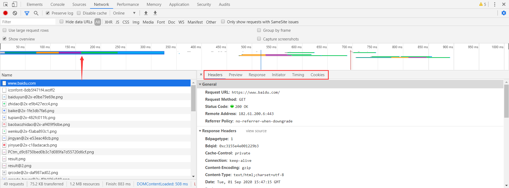

在右侧边栏中六个选项卡，可以帮助我们查看该资源从请求到加载完成的所有信息：


```
Headers：请求资源和接受响应所传递的参数
Preview：根据你所选择的资源类型（JSON、图片、文本）显示相应的预览
Response：查看响应的具体内容
Initiator：标记请求是由哪个对象或进程发起的（请求源）
Timing：显示资源在整个请求生命周期过程中各部分花费的时间
Cookies：显示资源HTTP的Request和Response过程中的Cookies信息
```

#### Perfrmance

**性能面板，使用时间轴面板可以通过记录和查看网站生命周期内发生的各种事件来提高页面的运行时性能。**

1. 如何查看性能
2. 分析运行时性能
3. 诊断强制的同步布局

#### Memory

**内存面板，如果需要比时间轴面板提供的更多信息，可以使用“配置”面板，例如跟踪内存泄漏。**

1. JavaScript CPU 分析器
2. 内存堆区分析器

#### Application

**应用面板，使用资源面板检查加载的所有资源，包括IndexedDB与Web SQL数据库，本地和会话存储，cookie，应用程序缓存，图像，字体和样式表。**

1. 管理数据

Storage：利用js代码可以操作的，包括 Local Storage、Session Storage、 IndexedDB、webSQL、Cookie五部分。这些部分全部可以用于反爬虫、cookie用得最多，范围最广。


?> 更多Chrome开发者工具详细信息参看：[Chrome开发者工具详解(1)-Elements、Console、Sources面板](https://www.cnblogs.com/charliechu/p/5948448.html)

?> 更多Chrome开发者工具详细信息参看：[Chrome开发者工具详解(2)-Network面板](https://www.cnblogs.com/charliechu/p/5981346.html)

?> 更多Chrome开发者工具详细信息参看：[Chrome开发者工具详解(3)-Timeline面板](https://www.cnblogs.com/charliechu/p/5992177.html)

?> 更多Chrome开发者工具详细信息参看：[Chrome开发者工具详解(4)-Profiles面板](https://www.cnblogs.com/charliechu/p/6003713.html)

?> 更多Chrome开发者工具详细信息参看：[Chrome开发者工具详解(5)-Application、Security、Audits面板](https://www.cnblogs.com/charliechu/p/6021141.html)

?> 提示：我们依然是在应用层做事，Network抓到的包也依然是停留在应用层！

### HTTPAnalyzer

**HTTPAnalyzer 是一个强大而详细的HTTP协议分析器，学会此工具的使用可以帮助我们高效进行数据的分析。**

工具优势：界面布局更加合理、资源占用也更小。

HTTPAnalyzer 下载地址：[HTTPAnalyzer](https://http-analyzer.en.softonic.com/)


HTTPAnalyzer 运行界面，点击左上角Start后，即可开始抓包。


打开浏览器，输入你需要抓包的网址，当浏览器访问完成后，工具就差不多已经抓包好了，如果需要分析返回的数据包内容，可以点击图中的选项卡进行内容查看。

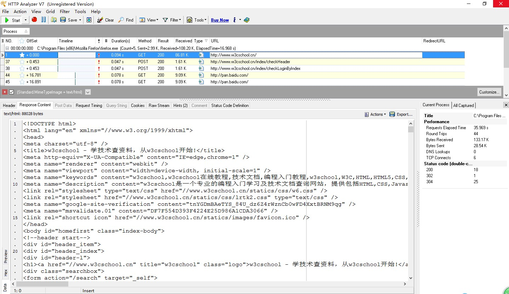

数据捕获过程中，如果确定了需要捕获的数据格式，可以进行如下设置进行数据过滤。

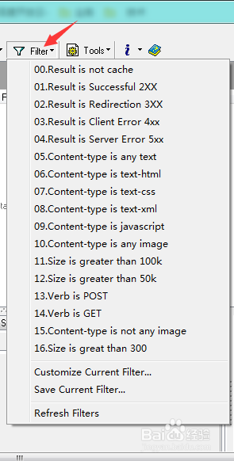

### Fiddler

**Fiddler 是一个用C#写出来的http协议调试代理工具，它能够记录并检查计算机和互联网之间的http通讯，查看所有的“进出”Fiddler的数据（指cookie,html,js,css等文件）并且能够使用.net框架语言进行扩展。** 

工具优势：**支持众多的http调试任务，设置断点，篡改及伪造Request/Response的数据，修改hosts，限制网速，http请求性能统计，简单并发，接口测试，辅助自动化测试。**

工具缺点：**在TCP/IP模型中，Fiddler只能抓到应用层的包。如果想要看到TCP/UDP、IP甚至于mac地址相关的报文，则需要更换抓包工具。这也就是为什么有很多数据包无法被Fiddler/Charles 捕获到的原因**

Fiddler 下载地址：[Fiddler官网](https://www.telerik.com/fiddler)


#### 工作原理

**不使用 Fiddler 的情况下**：浏览器访问一个网站，浏览器给服务器发送一个Request，服务器接收到Request后进行处理，返回给浏览器Response，然后浏览器解析Response中的html，展现网页给用户。


**使用 Fiddler 的情况下，Fiddler 就作为代理服务器**：浏览器首先给时代理服务器 Fiddler 接收到Request， Fiddler 将Request发送到服务器，服务器接收到Request后进行处理，将Response传回给代理服务器 Fiddler，代理服务器 Fiddler 将Response返回到浏览器。


**Fiddler在客户端与服务端之间以代理服务器的形式存在，启动 Fiddler 后会监听本地127.0.0.1的8888端口（默认端口），IE/Chrome浏览器会自动设置局域网代理（Firefox代理是独立的，需要单独设置）。**


#### 工作界面


?> 提示：按Delete键可以删除会话列表中的会话。

**Fiddler 会话图标含义**：


#### 编码工具

Fiddler 自带的编码工具：TextWizard


#### 配置证书

**Fiddler 安装后默认只能抓取http请求，如果需要抓取https请求需要进行配置。**配置方式：Tools--->Options--->HTTPS，勾选 `CaptureHTTPS CONNECTs`、`Decrypt HTTPS traffic`、`ignore server certificate errors(unsafe)`，点击OK，会弹出证书直接确认即可。

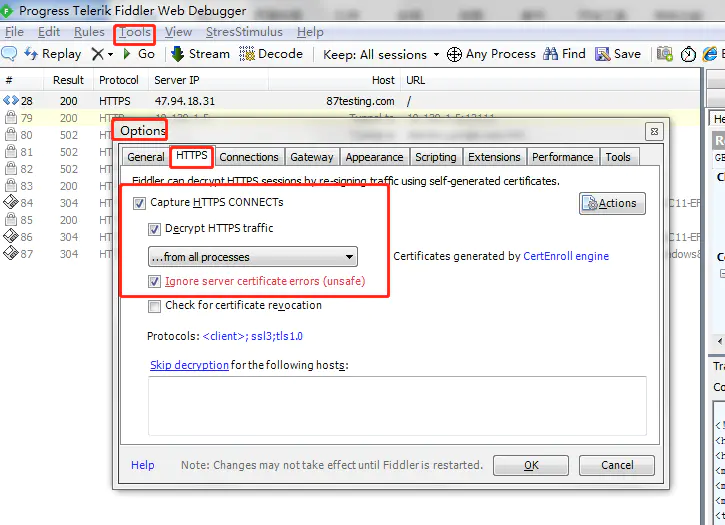

#### 隐藏请求

Fiddler中可以隐藏一些无需查看的请求，例如连接请求、图片请求。点击Rules--->Hide Image Requests、Hide CONNECTs（前面打勾）


Fiddler还可以对来自某个域名的请求进行隐藏，选中请求右键点击 Filter Now--->Hide '请求域名'即可


#### 中间人攻击

**中间人攻击，即一种自动返回响应的特性。**首先我们访问百度，将百度网页代码拷贝进HTML文件当中：


然后在PyCharm工具当中，将搜索按钮中的“百度一下”替换为“千度一下”：


接下来我们Fiddler内容选中响应请求，点击右侧的 `AutoResponder` 点击里面的 `Add Rule`，**在下方就会出现 `EXACT:百度网址`，代表着完全匹配百度网址**：


选择第二个框中的选项 `Find a file`，添加进我们修改的HTML文件：


最后我们勾选 `Enable rules` 使规则生效，当上面出现绿色字体时，就说明规则已经生效了：

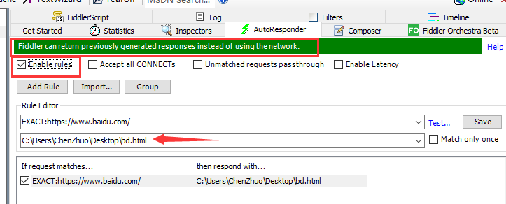

现在我们再来访问百度的首页，**就会发现搜索按钮中的“百度一下”已经被替换为“千度一下”了**：


同样的我们再修改HTML文件中的内容，再访问百度都能实时的展示出来。这样我们就可以在本地任意位置打断点或调试。

#### 拦截篡改

**Fiddler 断点、篡改和伪造数据**：前面讲过fiddler作为代理服务器时的请求流程图，请求时，可被篡改的两个点：`Before Requests`、`After Responses`。


**修改Requests方法**：`Rules---->Automatic Breakpoints---->Before Requests`

以论坛发布帖子为例，修改请求前数据内容，比如发布的内容如下：


点击发布帖子，此时请求被 Fiddler 拦截掉，将右侧requests body里面的字段message内容前新增内容：“篡改requests数据成功！”，然后点击 `Run to Completion`，先关闭掉拦截 `Rules` ----> `Automatic Breakpoints` ----> `Disabled`，其他请求都放过，点击工具栏中的“Go”


论坛中查看到刚刚发布的帖子内容如下，就被成功篡改了requests：


**修改Responses方法**：`Rules---->Automatic Breakpoints---->After Responses`

#### 重放攻击

**重放攻击就是重复的发送请求。使用重放的好处就是可以帮助我们快速定位请求失败的原因：**


**修改请求参数重放：**我们先访问百度，选中请求，点击右侧的 `Inspectors` 选项中的 `Raw` 选项，复制里卖的全部内容：


再选择 `Composer` 里面的 `Raw`，将复制的内容粘贴进去，将q的值改为 `10086`，最后点击 `Execute` 按钮，即可重放一次：


观察重放后的请求，可以看到请求头中的q值已经被改为了10086：


**不修改请求参数重放：**我们先访问百度，选中请求，右键选择 `Replay` 中的 `Reissue Sequentially` 选项：


里面输入发送请求的次数：


Fiddler就会自动的发送指定次数的请求：


?> 提示：可以连续多个请求一起重放测试，但只能一次次的来重放。

#### 命令行用法

**Fiddler 命令行QuickExec用法**：

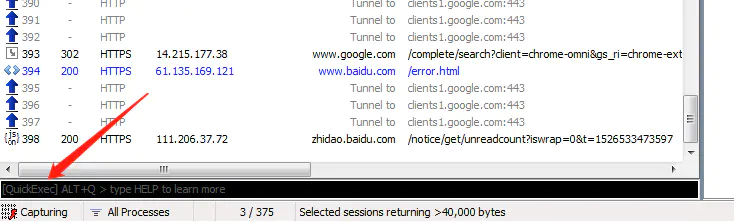

`help` ----- 打开官方QuickExct命令用法帮助

`?87testing` ------ 选中带有87testing的请求

`bpu` -------> 取消拦截请求的requests

`bpu www.87testing.com` -------> 拦截www.87testing.com域名请求的requests

`Bpafter` -------> 取消拦截请求的responses

`Bpafter www.87testing.com` ------> 拦截www.87testing.com域名请求的responses

?> 更多关于 Fiddler 的功能使用参看：[fiddler使用](https://www.jianshu.com/p/e810f52fa71e)

### Wireshark

Wireshark（前称Ethereal）是一个网络封包分析软件。因为Wireshark使用WinPCAP作为接口，直接与网卡进行数据报文交换，撷取网络封包，并尽可能显示出最为详细的网络封包资料。

工具优势：直接在网卡上进行抓包，所抓包的信息资料也最为详细。

Wireshark 下载地址：[Wireshark下载](https://www.wireshark.org/download.html)


Wireshark 主界面如下：

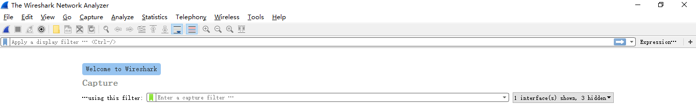

**选择抓取信息的网卡**：选择菜单栏上Capture -> Option，勾选WLAN网卡（这里需要根据各自电脑网卡使用情况选择，简单的办法可以看使用的IP对应的网卡）。点击Start，启动抓包。


**抓包状态**：wireshark启动后，wireshark处于抓包状态中。

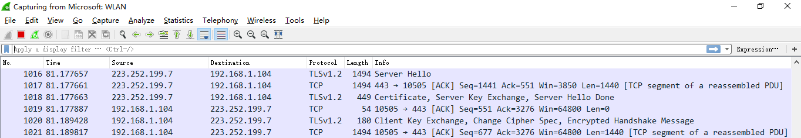

**抓包界面**：wireshark抓包主界面。


**颜色说明**：数据包列表区中不同的协议使用了不同的颜色区分，标识定位在菜单栏View --> Coloring Rules。


**Display Filter**(显示过滤器)：用于设置过滤条件进行数据包列表过滤。菜单路径：Analyze --> Display Filters。


**IP地址过滤**：为避免其他无用的数据包影响分析，可以通过在过滤栏设置过滤条件进行数据包列表过滤，获取结果如下。说明：`ip.addr == 119.75.217.26 and icmp` 表示只显示ICPM协议且源主机IP或者目的主机IP为119.75.217.26的数据包。

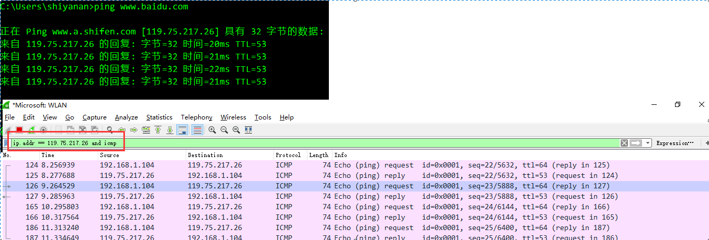

**Packet List Pane**(数据包列表)：显示捕获到的数据包，每个数据包包含编号，时间戳，源地址，目标地址，协议，长度，以及数据包信息。 不同协议的数据包使用了不同的颜色区分显示。

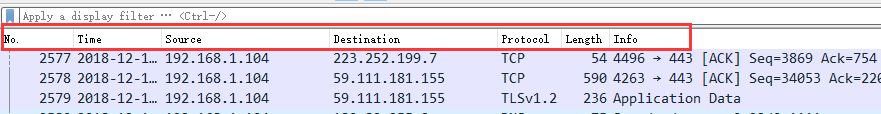

**Packet Details Pane**(数据包详细信息)：在数据包列表中选择指定数据包，在数据包详细信息中会显示数据包的所有详细信息内容。数据包详细信息面板是最重要的，用来查看协议中的每一个字段。各行信息分别为

```
（1）Frame:物理层的数据帧概况
（2）Ethernet II:数据链路层以太网帧头部信息
（3）Internet Protocol Version 4:互联网层IP包头部信息
（4）Transmission Control Protocol:传输层T的数据段头部信息，此处是TCP
（5）Hypertext Transfer Protocol:应用层的信息，此处是HTTP协议
```


**TCP包**：查看TCP包具体内容。


**时间戳显示格式**：调整方法为View -->Time Display Format --> Date and Time of Day。

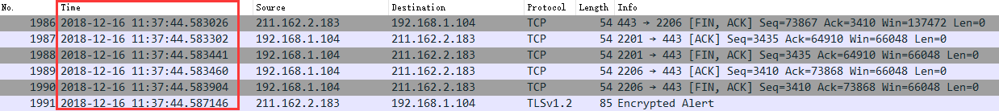

?> 更多 Wireshark 使用方法参看：[wireshark抓包新手使用教程](https://www.cnblogs.com/mq0036/p/11187138.html)

### Postman

Postman是由Postdot Technologies公司打造的**一款功能强大的调试HTTP接口的工具**，它最早是Chrome中最受欢迎的插件之一。该工具不仅可以调试简单的css、html、脚本等简单的网页基本信息，它还可以发送几乎所有类型的HTTP请求！

Postman下载地址：[Postman官网下载](https://www.postman.com/downloads/)


postman基础功能介绍：


Collection在postman里面相当于一个文件夹，可以把同一个项目的请求放在一个Collection里方便管理和分享，Collection里面也可以再建文件夹。

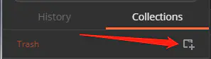

请求区域介绍：


```
Authorization：身份验证，主要用来填写用户名密码，以及一些验签字段，postman有一个helpers可以帮助我们简化一些重复和复杂的任务。

Headers：请求的头部信息。

Body：post请求时必须要带的参数，里面放一些key-value键值对。

Pre-requerst Script：在运行这个请求之前自定义请求数据，语法使用JavaScript语句。

tests：标签功能，通常用来写测试，它是运行在请求之后。postman每次执行request的时候，会执行tests。测试结果会在tests的tab上面显示一个通过的数量以及对错情况。

form-data：它将表单数据处理为一条消息，以标签为单元，用分隔符分开。既可以单独上传键值对，也可以直接上传文件。

x-www-form-urlencoded：对应信息头-application/x-www-from-urlencoded，会将表单内的数据转换为键值对。

raw：可以上传任意类型的文本，比如text、json、xml等，所有填写的text都会随着请求发送。

binary：对应信息头-Content-Type:application/octet-stream，只能上传二进制文件，且没有键值对，一次只能上传一个文件, 也不能保存历史，每次选择文件，提交。
```

?> 更多 Postman 使用功能参看：[Postman教程大全](https://www.jianshu.com/p/97ba64888894)

## 总结

开发者工具：浏览器自带最方便，针对当前的浏览器进行抓包，因为加载了运行环境在JS逆向调试方面最为方便。

HTTPAnalyzer：功能简单、资源占用小、方便实用的抓包工具，但不能对使用代理IP的程序抓包。

Fiddler：功能多样，抓包方面比开发者工具更为强大，使用时需要配置证书，不能对使用代理IP的程序抓包。

Wireshark：最强大的抓包工具，直接在网卡进行抓包，可以对使用代理IP的程序抓包，但数据展示直观度不如上面工具。

Postman：简单易用的HTTP接口测试工具。

