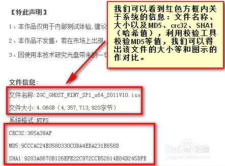
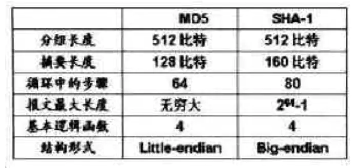
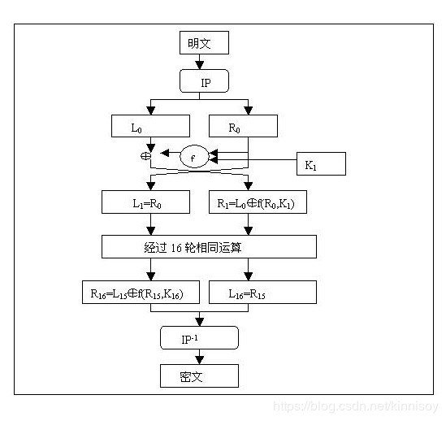
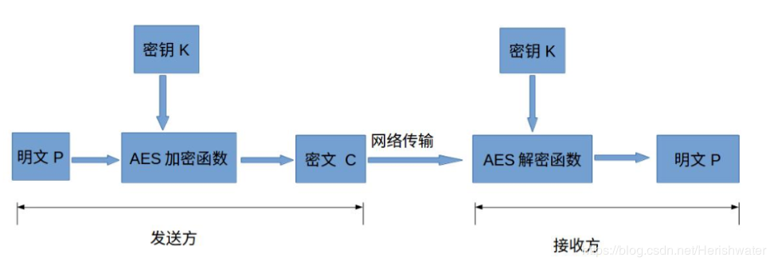

# 数据加密解密

现在我们已经能采集网页上的数据了，网页数据来源于调用的接口，有的时候我们直接访问接口，返回回来的数据是加密的，如果不能对其进行解密，也就无法采集里面的数据了。因此数据的加密解密也是学习爬虫的一项重要技能。

### MD5信息摘要算法

##### MD5简介

**MD5信息摘要算法**（MD5 Message-Digest Algorithm）一种被广泛使用的密码散列函数，可以产生出一个**128位（16字节）的散列值**，呈现形式为**32个十六进制数**，**用于确保信息传输完整一致**。

在平常下载文件的时候，都会或多或少的接触到MD5，**用于校验文件完整性**。**如果在下载过程中文件出现了损坏或者骇客在里面添加了病毒程序，其文件的MD5值都会不一样。**




在软件的下载网站一般会给出该软件文件的MD5值，将下载好文件拖入[MD5校验工具](https://dl.pconline.com.cn/download/90027.html)中，将网站的给出的MD5值比对工具生成MD5值，即可校验文件完整性。

.png)

##### MD5加密

同样的Python也能对数据进行MD5加密：

```python
# 方法一：导入hashlib模块
import hashlib
# 被加密的字符串'abc'
str1 = 'abc'
# 生成加密对象
str2 = hashlib.md5()
# 将字符串转换为二进制字符串(byte类型)添加进加密对象中
str2.update('abc'.encode('utf-8'))
print ('MD5加密后：' + str1 )
print ('MD5加密后：' + str2.hexdigest())
'''
输出：
MD5加密后：abc
MD5加密后：900150983cd24fb0d6963f7d28e17f72
'''

# 方法二：导入Crypto.Hash模块中的MD5方法
from Crypto.Hash import MD5
str3 = 'abc'
str4 = MD5.new()
str4.update(str3.encode('utf-8'))
print('MD5加密后：' + str3)
print('MD5加密后：' + str4.hexdigest())
'''
输出：
MD5加密后：abc
MD5加密后：900150983cd24fb0d6963f7d28e17f72
'''
```

MD5作为大部分应用所采用的一种加密算法，肯定是**加密容易解密难**，MD5 最大的一个点就是**不可逆**，但是中国数学家[王小云](https://baike.baidu.com/item/%E7%8E%8B%E5%B0%8F%E4%BA%91/29050?fr=aladdin)等在 Crypto 2004 上提出一种能成功攻破 MD5 的算法，但也只停留在算法的层面，网上那些所谓的MD5在线破解，其实是采用**跑字典方法暴力求逆**，**目前没有软件能有效地求逆 MD5**。

### SHA-1安全散列算法

##### SHA-1简介

**SHA-1**（英语：Secure Hash Algorithm 1，中文名：**安全散列算法1**）是一种密码散列函数，美国国家安全局设计，并由美国国家标准技术研究所（NIST）发布为联邦数据处理标准（FIPS）。SHA-1可以生成一个被称为消息摘要的**160位（20字节）散列值**，呈现形式为**40个十六进制数**。

SHA-1也可以被用于**验证文件的完整性**，在上面出现的图中也有展示：


##### SHA-1加密

同样的Python也能对数据进行SHA-1加密：

```python
import hashlib
# 被加密的字符串'abc'
str1 = 'abc'
# 生成加密对象
str2 = hashlib.sha1()
# 将字符串转换为二进制字符串(byte类型)添加进加密对象中
str2.update('abc'.encode('utf-8'))
print ('SHA-1加密后：' + str1 )
print ('SHA-1加密后：' + str2.hexdigest())
'''
输出：
SHA-1加密后：abc
SHA-1加密后：a9993e364706816aba3e25717850c26c9cd0d89d
'''
```

与MD5一样，也是中国数学家[王小云](https://baike.baidu.com/item/%E7%8E%8B%E5%B0%8F%E4%BA%91/29050?fr=aladdin)提出攻解 SHA-1 的算法，但也只停留在算法的层面，网上那些所谓的SHA-1在线破解，其实也是采用**跑字典方法暴力求逆**，**目前没有软件能有效地求逆 SHA-1**。

##### SHA-1与MD5

MD5 与SHA-1均是从MD4 发展而来，有很多相似之处，**SHA-1与MD5 的最大区别在于其摘要比MD5 摘要长 32bit**。产生具有相同摘要的两个报文的难度：MD5是 264 是数量级的操作，SHA-1 是280 数量级的操作。因而，**SHA-1对强行攻击的强度更大**。但由于SHA-1 的循环步骤比MD5 多（80:64）且要处理的缓存大（160 比特:128 比特），**SHA-1的运行速度比MD5 慢**。



### Base编码解码

##### Base64编码解码

**Base64**是网络上最常见的用于**传输字节码(8Bit)的编码方式**之一，是一种**基于64个可打印字符来表示二进制数据到字符的过程**，可用于在HTTP环境下传递较长的标识信息。

**Base64是基于二进制的编码，因此可以编码各类文件**。Python中base64模块可以进行Base64编码：

```python
# 导入base64模块
import base64

# 读取文件的二进制内容
with open('文件名.后缀', 'rb')as f:
    b_code = f.read()
# b64encode将二进制数据编码为Base64，进行输出    
img_data = base64.b64encode(b_code)
print(img_data)
```

有的Base64编码前面以`data:image/jpg;base64`开头，表明这是后面的编码的是`jpg格式图片`，有的则没有开头只是一个字符串，例如下面的图片Base64编码。

```python
'/9j/4AAQSkZJRgABAQEAYABgAAD/2wBDAAgGBgcGBQgHBwcJCQgKDBQNDAsLDBkSEw8UHRofHh0aHBwgJC4nICIsIxwcKDcpLDAxNDQ0Hyc5PTgyPC4zNDL/2wBDAQkJCQwLDBgNDRgyIRwhMjIyMjIyMjIyMjIyMjIyMjIyMjIyMjIyMjIyMjIyMjIyMjIyMjIyMjIyMjIyMjIyMjL/wAARCACWASwDASIAAhEBAxEB/8QAHwAAAQUBAQEBAQEAAAAAAAAAAAECAwQFBgcICQoL/8QAtRAAAgEDAwIEAwUFBAQAAAF9AQIDAAQRBRIhMUEGE1FhByJxFDKBkaEII0KxwRVS0fAkM2JyggkKFhcYGRolJicoKSo0NTY3ODk6Q0RFRkdISUpTVFVWV1hZWmNkZWZnaGlqc3R1dnd4eXqDhIWGh4iJipKTlJWWl5iZmqKjpKWmp6ipqrKztLW2t7i5usLDxMXGx8jJytLT1NXW19jZ2uHi4+Tl5ufo6erx8vP09fb3+Pn6/8QAHwEAAwEBAQEBAQEBAQAAAAAAAAECAwQFBgcICQoL/8QAtREAAgECBAQDBAcFBAQAAQJ3AAECAxEEBSExBhJBUQdhcRMiMoEIFEKRobHBCSMzUvAVYnLRChYkNOEl8RcYGRomJygpKjU2Nzg5OkNERUZHSElKU1RVVldYWVpjZGVmZ2hpanN0dXZ3eHl6goOEhYaHiImKkpOUlZaXmJmaoqOkpaanqKmqsrO0tba3uLm6wsPExcbHyMnK0tPU1dbX2Nna4uPk5ebn6Onq8vP09fb3+Pn6/9oADAMBAAIRAxEAPwCnRRRX0hwhRRRQAUUUUAFFFKo3MAO5xQAlFPlQRyFQcgY59eKaRgA9Qe9ACUUUUAFWbeB2Yghh7ggYPufy4/wqFFUN8524zkEfpWjAhCrgLgY6jkfQjr3596UmJk6qFXAUKB2FLRRWRIUUUUAFKrbWznBHQ4pKliiLHO/YQMg479v8+1DAu2sjE4ZFwAGLHAxx6duMfkatqip91QPoKrwyyeWAVyeTnpnnr0xU6rszgnHp2H0rjmnc6oNNaDqKKKzLCiiigAooooAKcgLOAvU9KbV22j2pvIALfypSdkNEsaeWgUHOKdRRWBQUUU5F3NikA+Je/wCVSUdOKKzbuMKKKKAPKghOO2fY9PWlMMg2/KSWzjFaQgwiqvygHntnH+f84p7Qo3BRNvHbrivoeY4LmdFbO8m0jAB5598f5+lSCy6ZLYJ446D1P+f8Re8voTgk53fL1zTwMAD0pczFczhZyFADwepA/H8P8/jUwsYwwXJJ5PP1H+fxq3QBilzMLlQ2SmTJ5Bxz0x+AqVbdIwgVc4bJJGfX/GpqKV2BXjtvLfIkfsWz/Ef85qZ0WRdrDIp1FFxFY2UezaCc4xk84709baJQBtzj+9zU1FF2BD9miznb3zjAwfwqVVCjA4ApaKACiiikAUUUqjOc9B14oAFGcjjp3q5BGEDBuOepHP4evOOKbBHmRd474IbvwOMe3+FW0QoAoJxx/kVEmIeo2rinA4pKKzauNNp3RJRTAcU4HNYSi0dUJqQtFFFSWFFFKql2CjqaAJbeLe+SPlH61epqIEQKO1OrCTuy0FFFFSAVOihQB3qOMfMCRUo6+lTJjFoo69qKkAooJwMnpUJfJJ+b8DimlcDiqKKK9w84KKKKACiiigAopyLvbGQPrUgtyQp3A5PO3nH+eaLgQ0Vch0y5uZClvE8rKMkKpJA9cDJqyfD+o7c/YbvrjAhYnrj0qXOK3Y7MyqK2T4evwuPsN0xJAyIWGPc04+Hr0n/jzusZ7QHP8qXtI9wszEorbPh2824+xXe7HXym/wAKbNo0tuitPbTxpnG50Kgn0zj2/nR7SPcVmY1ABOeOnWtJLWNWU7cgAjDYOeaf9mjJPHBAGO3AxT50K5VsNPm1CdY4lLEnAx/nj6121p4Rt44lE8zEjoI+AD9T1o8J2kccMs+AXJCg9/eukrzsRiJOXLHSx2UaSceaRzN54XREZ7aRiQOjDk1zkkbRSMjjDA816TXHeIrZIboMvUn0pYetJy5ZE16UUuZGLRRRXacgUoNJRQ1cabWxIKKaoOcd/SpFVs4wc4zxWLgzpjVTWo3t71dt4hGu85DHse1RRQgvlgSBVsGspp20LVSN7C0UZorE1vcKVRk4pKcvb1pASc9sH/CnDOPSkzjp0pQc+lQMWms4RS3Jx6ChmI5AJXvjrVOe4YsqE7Rv4OMHHuDTjFtgWZGz8o6d6jpglLsRGm4DjcTgZp6lgBnknrxVWsI5BYZGztQnBweKUwyBiNjevIxx7+lanlruLYOSCOpoCKOigdOnHSvV5zzrlD7JIxC4AOM5xgf5/Wj7JIsgHBAIycf/AFv8/nWgFCqAvygegpaOdhcqLZ/ODnABPQdR/n1qVLdE3ADgkEHuD/n/AD6zUVN2BCkO2TdgD3A56/5/OpAoCleo9COg9KdRRcRveD1/4nEjEkkW5H/jy129cV4P/wCQtL/1wP8A6EtdrXnYn4ztofAFFFFYGwVz/jD/AJBMX/Xcf+gtXQVz/jD/AJBMX/Xcf+gtWlH40Z1fgZxVFABJwOtA5PXFemcB0fhm+SNmtnIBc/Lk9/8A6+f85rqK82VmjbIJBrat/ElzCgV/3hA/iGf1zmuOth3KXNE6qVdRXLI68kAEk4Ariteuxc3hCkYBp91r13dIUTgHHCrWOSWbPUk06FBxfNIVaspqyEopcHIGDk9qTHWus5hcAkAEe5NPEZXBbA57/wCf84NOSLO1lySBkj0/zxU6xEHDKQF4yDk4+v8ASpbGRhMOMcleRkEH/wCuKlCEhQAPUHGePrinLGVIPBIzgk8/56VIBjufxqWwFoooqQFBpc0KjP0FSLASeTg55BFZTUTenOWwKm4H9OaX73XcOM81IYm69B3Gc0qkjH93PWsLHRzDAMHPQ9KXlQaU/KV4ye5PpTh+H86loakNJxn0qtLGsrfOuTUsrc7R0HWmdeO1NaDEQBFCqAAKKXpz6UGmBjUU5kZG2kc9cdaVI2dioHI7V6VzzRlFWDDl1iJAb6dfX60zysShTjlsevelcCLBGPenxxNIcDj3PSryxpjKAKc54/GnhQucDGalyGV/sY4+Y+9DWiHO0nOemelWaXBzjHNTzMC/4UgaLVJWJH+pI/8AHlrsK5fw3/yEZP8Arkf5iuorjru8zsofAFFFFYmwVh+KV36ZEMZ/fDvj+Fq3Kx/En/IOj/66j+Rq6fxoip8DOQ+zgkbueOc855pVhwMMACe456VNRXfdnARLCMKCT8vBBJwaBDnO4n8DjPXr+dS0UXYDAgwOx6nHr603ylxgqCT1bvUtFK4EPkKCuOg9T/L0pgt8FTtGO4LZH1PrVmgjIwelO7AYEC4OCxznsOafRRSAKKKsR22Vy3BPak5JbjSb2K9OQc5xkDmrRt48ggYHpmnLGqtuA5rN1EWqbFQfKM8n6Yp3WiisjYQgHGR0oxxjr9aWikA3aM5wKRlOPlA+nSnFgoJJwBSDcWIPTPFFguV8DnCk56en+f8AChVBycgDHTNTsm4jj64oA/hwB9KC+Yr4w2G604IB1Uk1N5a5PXHpSbR2j3CpaKUioYWznaM+tAiYDAXgUkuqWMJ+e6jP+4d/8s1Sl8SWiBhHHLIw6ZAUH8ev6VLxijuy44GUtosveU3XByeMUgUn/wDXWPN4nkIHk2qJ672LfyxVCbWr+bIM5RSc4jG3H49f1qHmEV5mqyub30On2NjODj1qdbfA+bnPbpiuKivbmG5FwszmUfxMc5Hoc11el6xBqCrE2I7jHKdj7g/0/wAM1jLM7bx08ipZU4q6dzQSJEXAGfrTiAwwRmnKAGBPP1qdWTJIOCfWqjjqU9nqYPCzjuifRzHFeMWKoPLIBPHcVufaIP8AntH/AN9Cuf6UVbndijGysb/2q3OP38XPT5xSfa7b/n4i/wC+xWDSFQw5GaOYepv/AGu2/wCfiL/vsVma48VzYokcyMwkBwrA9jVLy1z0FDRq2OMfSqjNJ3JlFtWM0Wpxywz7Uv2UY6nPtV7yB/e/SjyBn73Fbe38zH2JR+y8D5ue9AtR3NX/ACV9T+FIYRjgml7fzD2PkUvsqerUn2UZHzHGav8Akjjk0GFT7Ue38x+x8ih9l/2qQWpyckAdsc1oeSvqaXylzR9YF7ApLbIByM04wIV+5gEYzV4Dngc0Y9qj27L9iinHCFPyL170/wAtvSp3kSJC8jqiDqzHAH41h3/im1tsraobmQf7WxPfnB/lj3rOWItua08NKekUbIh45PNN8pvxrzTW/F2rTytBHcfZ0HUQDafUc8n8iM+lUdC8Q3OjzsC7vbSnMiBuc/3h7/z/ACIzdeVrrU6lgHbVnrXkn1FNaNlyccVn22qvJCkqOssbgMrYxkf59asLqSlvnjIHsc1nHHwb1djOWCmtkTFWUZIwKTB9KUajakgNJsJ/vjA/PpUweOZN0bq4JxlTkfpXRHERlsYSoSjuivuFPMTjoM/jUkcIU5bk9vapap1H0FyIriBieSMUjQv1HTGcg1ZPSip9ox8qKJBGQc5ptWjEGcs2NvtThGDyNp+q/hT5h2PP5LbBGVzuHLDJIP8An/Iqoy7c7hgnoB/nkVrkA9RTDECOCRznjHXOf6V4ikfQpmTRVyS2Y5yWySPfP+c/57VjE4JGM/Tv7irTTHcZSqzIwZSVYHIIOCDSUUxnQ6X4hK7YL4krjCy9x9fX610iOkiB42VlPRlOQa86q5Y6nc6e2YXyh6o3Kn8KxnRT1RnKF9jvAxHQmnrMR94bh+VZOn63bX2EJ8qY/wADHr9D3rSrJVKlN2Tsc8qcX8SLiTQEZbKkc/5xU6rGw4YNj3zWZRW8cZNb6mLw8ehqeSmAMZxQYlNZ63Eq5w5/HmplvWGdyA/Q4reOMg99DJ4eS2LXlJ/do8pMfdqFb1DjcrA/nUi3ETHAcfjxWqrwe0iHTkug8IozwOfak8pP7opysrDKkEexpatMmw3y04+Uce1HloR90U6ii7CyIxCg7Z+tL5a46Y/CmyzpEDk5b+6OtZFzq00mUiAjXoSDkn8aznXjHd6mkKMpbI055rW0QtPKqcZ5POPYD61hX3iMtuSzjCjp5j8/kO1U7pi0TsxyTySSc5rMrneInLbQ64YaC31Kmp3dxczBZp3kA5AZs4J68dvwqjVi8P788DOOo71XoWx2JJKyMPVMfbTwR8o6jGfpVOr2qkm8Ax0QCqNdsPhRm9zqfCOqSCc6bIzMjAtCOu0jJI+hGT6ce9dgc4OOteeeGopJdetzHuwmWYgZwMHr6A5A/GvQ68/FRSqaCI3VVJcD5gpwcfXv271msc4Pt69K0JiAD0PGArDg/Ws3t1rKI0TC8uVAAuJgB2DmrC6vfLj9+SB2Kg5/TNUaK0U5LZidOD3Rfl8RX0MZbZbsoxnKnP8AOmp4wcD57JWP+zJj+hrIuwdhOwHk849v8/p+NCt4VZ23J+rUmtYnVp4wQn57JgPaTP8ASpR4utMc28+fw/xrj6KtVp9yXg6L6GzRRRXGbBUbxBw/AO4dz3/yBUlFAFCS025OeBgZxyTVYqVJB6g4PNbGAccdOlQywB8HkngHJ69s/wA6tT7lJmZRVh7UjITJI6/5/wA/pUBBU4IIPoatO4xK1bLX7u0wrnz4x/C55H0P/wCusqihxT3BpPc7mz1ezvQBHKFcnGyThv8A6/4VerzitKy1y8s8Lv8ANj/uSc4+h6jp9PasJUP5TN0+x2tFY9r4js58LLugY/3hlc/Uf1xWsjpIgeNlZT0ZTkGsHFrczaa3HUUUUhBTxLIBgOwA96ZRTTa2FZMlFzMBjf8AoKDczMMFz+AxUVFV7Sfdi5I9gIz1qq1nuYnzD+Iq1RUXKuUJtNMi8S4YDg4/+v7VUbRJRnbMh9MgitqiqUmh8zOZufDl3M4ZZYRgY5J/wqA+GL7BxJbk9ss3/wATXW0d+tWqskVzs8/ufBuoT3Bea6tI1AwArMxGO33R61JD4Kt0f/SLyWQd1RAhH4nP8q7O4+6QQyjHtgn/ADz/APrqm53MTzjPetPrFS1rgncq2Wn2unRNHawiNWILckljjHJP+eT61ZoorJtt3YyKcErkZ3AHAB74rNJABA5GepHNaM7FPm27gDnnoP8AP+c9KzSckmriNBRRRVDKt4AFQ8kg5GDz61QPBPOfert6WAxuO1m6fgKpVrHYtbBRRRVDNmiiisDMKKKKACiiigBGVW+8oP1FQvarJ97jpjbx2qeii7QGVJEUznscEe9R1rugcYYAj0NUZ7by8ncdgXjj36frWilcpMrUUEEEgjBFFWUFSwXM9s26CV4z32nGfr61FRQBs2/iW9iP74JMuecjafwI/wAK1bfxJZSj98HhbHORuH4Ef4VyNFZulFkOCZ6FBdW9yMwzRyYGSFYEj6+lS15xViG+u4ABFcyqo6KGOPy6Vm6HZkumd/RXHReI9QjzuaOXP99On5Yq3H4qkC/vbVGPqrlf6GodGRPs5HTUVhR+KbYr+8gmVvRcEfzFSJ4msWPKzL9VH9DU+zl2Fys2aKzF8QaaRzOR9Ub/AApf7e0z/n5/8ht/hS5Jdhcr7GlQc9qyz4h04HAmY+4Q01vEeng8NI30Sjkl2DlfYuzFWcgucbSw9OgFUqrya/ZPggP16bcev59f85qD+2LT+8//AHzVqEuxaTL9FURq9mersPqpp39q2X/Pb/xw/wCFHLLsOzJLljsYbgACDjbn/POKzzjtT57+z2ZjlI28gBW9+2Kqi8gIBDnB9VIq4xdthpE9FRG5gChjMig/3mx/OnedF/z0T/voVVmBXu3YLgE9MMAen+f89ao1fZRLMuQxjUdRyDj3700BYWMWQDgDJjzuq07IpFKircsWCzCNehz/ALPX9cYpjsYG2mOI555Gfb+lVcdzROO1FFFYkBRRRQAUUUUAFFFFABRRRQBBNCjKWI+boMdOT/8AXrOZSjFT1BxRRWkCkJRRRVlBRRRQAUUUUAFFFFABRRRQAUUUUAFFFFABUsMDTbtpAx60UUnsIlFjJkZZcU/7B/01/wDHf/r0UVDkxNsVbBQfmkJHsMVFPBHCOCxPufXP+FFFCbbEmVjjJx0ooorQsQIoVlCgbjkkcH9KfvYEHccgYBz0oooAA7c853dc80hJY5PWiigD/9k='
```

用Python将**Base64编码解码成二进制数据**，再输出成图片：

```python
# 导入base64模块
import base64
Img = '上面的字符串'
# b64decode将Base64编码解码成二进制数据
img_data = base64.b64decode(Imagecode)
# 输出图片
with open('image.jpg', 'wb')as f:
    f.write(img_data)
```

输出的图片如下：


##### Base32编码解码

Base32和Base64大同小异，但有一点需要注意：**Base64中包含大写字母（A-Z）、小写字母（a-z）、数字0——9以及+/；Base32中只有大写字母（A-Z）和数字234567。**

```python
# 导入base64模块
import base64

# Base32编码
print(base64.b32encode('abc'.encode('utf-8')))   # b'MFRGG==='
# Base32解码
print(base64.b32decode('MFRGG==='))              # b'abc'
```

### DES数据加密标准

##### DES简介

**DES数据加密标准（Data Encryption Standard），是一种使用密钥加密的块算法。**

**DES算法的入口参数有三个：Key、Data、Mode。**

- Key为7个字节共56位，是DES算法的工作密钥
- Data为8个字节64位，是要被加密或被解密的数据
- Mode为DES的工作方式,有两种:加密或解密。

**DES的加密算法和解密算法几乎是一模一样的，仅仅是密钥的使用顺序不同，所以模块的代码也几乎没有什么区别。输入输出要求是16个十六进制的字符，刚好是64bit！**

流程图：



##### ECB加密模式

**ECB（电子密本方式）是非常简单的加密方式**，就是将数据按照8个字节一段进行DES加密或解密得到一段段的8个字节的密文或者明文，最后一段不足8个字节（一般补0或者F），按照需求补足8个字节进行计算（并行计算），之后按照顺序将计算所得的数据连在一起即可，各段数据之间互不影响。
优点：

1. 简单；
2. 有利于并行计算；
3. 误差不会被传递；

缺点：

1. 不能隐藏明文的模式；
2. 可能对明文进行主动攻击；

##### CBC加密模式

CBC（密文分组链接方式）


### AES高级加密标准

##### AES简介

**AES高级加密标准**（Advanced Encryption Standard），目前比较流行的对称加密算法。**对称加密算法也就是加密和解密用相同的密钥**，具体的加密流程如下图：



**明文 P**：等待加密的数据。

**密钥 K**：用来加密明文的密码。密钥是绝对不可以泄漏的，否则会被攻击者还原密文，窃取机密数据。

**AES 加密函数**：把明文 P 和密钥 K 作为加密函数的参数输入，则加密函数 E 会输出密文 C。

**密文 C**：经过 AES 加密后的数据。

**AES 解密函数**：把密文 C 和密钥 K 作为解密函数的参数输入，则解密函数会输出明文 P。

**AES 加密模式**：有 AES-128、AES-192、AES-256 三种（**默认AES-128**），分别对应三种密钥长度 128bits（16字节）、192bits（24字节）、256bits（32字节）。密钥越长，安全性越高，加解密花费时间也越长。

AES 只是个基本算法，实现 AES 有几种模式，最常用的 **ECB 和 CBC 模式**。

##### ECB加密模式

**ECB 是最简单的块密码加密模式**，加密前**根据加密块大小（若 AES 为128位）分成若干块**，之后将每块使用相同的密钥单独加密，解密同理。相对其他模式**没有偏移量的设置**，简单点，安全性差点。

**再次提醒**：根据加密块大小**分成若干块，若AES为128位，即加密的明文长度必须处理为16倍数的字节长度**。

**设置明文**：

```python
# 明文
str1 = 'Hero never die!'
# 明文长度
length = len(str1)                 # 15
# 补位，看上面"再次提醒"，这里用lambda函数来空格填充。
fill = lambda data: data + (16 - len(data) % 16) * ' '
# 补位后的明文结果
str2 = fill(str1)
print(str2, f'长度：{len(str2)}')   # 'Hero never die! ' (最后面补了一个空格)长度：16
```

**设置密匙**：

```python
# AES加密模式中AES-128的密匙长度为16字节
# 密匙
key = '0123456789ABCDEF'
```

**加密函数**：

```python
# 从Crypto.Cipher模块中导入AES函数
from Crypto.Cipher import AES
import base64

# 加密函数
def AES_Encrypt(data, key):
    # 将密匙key编码为UTF-8，设置AES为ECB模式
    cipher = AES.new(key.encode('UTF-8'), AES.MODE_ECB)
    # 将明文加密为bytes类型的数据(数据)
    result = cipher.encrypt(data.encode('utf8'))
    # 用Base64进行编码为加密byte字符串(字符串)
    text = base64.b64encode(result)
    # 用UTF-8解码byte字符串
    entext = text.decode('UTF-8')
    # 返回加密后的数据
    return entext

# 传入明文和密匙，生成加密字符串
print(AES_Encrypt(str2, key))  # 1Kf05a1o3aLSh3tPWJugzg==
```

**解密函数**：

```python
# 从Crypto.Cipher模块中导入AES函数
from Crypto.Cipher import AES
import base64

# 解密函数
def AES_Decrypt(data, key):
    # 将密匙key编码为UTF-8，设置AES为ECB模式
    cipher = AES.new(key.encode('UTF-8'), AES.MODE_ECB)
    # 将加密字符串解码为加密的byte字符串
    text = base64.b64decode(data.encode('utf8'))
    # 将加密的byte字符串解密
    result = cipher.decrypt(text)
    # 将解密的byte字符串解码为
    detext = result.decode('UTF-8')
    # 返回解密后的明文
    return detext

# 传入加密的字符串和密匙，输出解密后的明文
print(AES_Decrypt('1Kf05a1o3aLSh3tPWJugzg==', key))  # Hero never die!
```

##### CBC加密模式

CBC 模式对于**每个待加密的密码块在加密前会先与前一个密码块的密文异或然后再用加密器加密**。第一个明文块与一个叫初始化向量的数据块异或。

**相比 ECB 模式，CBC 模式主要是多了偏移量这一要素，偏移量的取值，至少 16 位，或者为 16 的倍数。**

**设置偏移量**：

```python
vi = '0102030405060708'
```

**加密函数**：

```python 
def AES_Encrypt(data, key):
    # 将key和vi编码为UTF-8，设置AES为CBC模式
    cipher = AES.new(key.encode('UTF-8'), AES.MODE_CBC, vi.encode('UTF-8'))
    # 加密编码为UTF-8的明文
    result = cipher.encrypt(data.encode('UTF-8'))
    # 再编码为Base64
    text = base64.b64encode(result)
    # 将btye字符串解码为UTF-8
    entext = text.decode('UTF-8')
    return entext

# 传入明文和密匙，生成加密字符串
print(AES_Encrypt(str2, key))  # 4ZPedA7boYMoDEEy2MijYA==
```

**解密函数**：

```python
def AES_Decrypt(data, key):
    # 将key和vi编码为UTF-8，设置AES为CBC模式
    cipher = AES.new(key.encode('UTF-8'), AES.MODE_CBC, vi.encode('UTF-8'))
    # 将编码为UTF-8的加密字符串解码为byte字符串
    text = base64.decodebytes(data.encode('UTF-8'))
    # 对加密的byte字符串进行解密
    result = cipher.decrypt(text)
    # 将解密的byte字符串编码为'UTF-8'
    detext = result.decode('UTF-8')
    return detext

# 传入加密字符串和key解密
print(AES_Decrypt('4ZPedA7boYMoDEEy2MijYA==', key))  # Hero never die!
```

