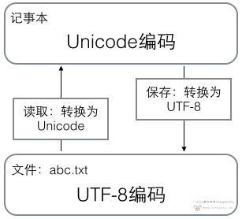

# 数据编码解码

### 编码方式

在《[字符、字符串、字符编码](基础03-字符、字符串、字符编码.md)》中介绍过字符编码的两种方式：ASCII编码、Unicode编码。

ASCII编码：**把大小写英文字母、数字和一些符号等127个字符被编码到计算机里。**

Unicode编码：**把所有语言都统一到一套编码里，用两个字节表示一个字符。**

但字符的编码方式，不仅仅只有这两种还有许多，比方说处理数量庞大的中文汉字，中国制定了GB2312编码，用来把中文编进去。

##### GB2312编码

GB2312标准共收录6763个汉字，其中一级汉字3755个，二级汉字3008个。GB2312对任意一个图形字符都采用两个字节表示，并对所收汉字进行了“分区”处理，每区含有94个汉字／符号，分别对应第一字节和第二字节。

但对于人名、古汉语等方面出现的罕用字，GB2312还是不能处理，这有了后来GBK编码。

##### GBK编码

GBK标准共收入21886个汉字和图形符号，简、繁体字融于一库。GBK采用双字节表示，总体编码范围为8140-FEFE之间，首字节在81-FE之间，尾字节在40-FE之间。

但全世界有上百种语言，日本把日文编到Shift_JIS里，韩国把韩文编到Euc-kr里，各国有各国的标准，就会不可避免地出现冲突，结果就是，在多语言混合的文本中，显示出来会有乱码，因此，Unicode编码应运而生。

**Unicode编码用两个字节表示一个字符，比ASCII编码需要多一倍的存储空间，在存储和传输上就十分不划算。所以，本着节约的精神，又出现了把Unicode编码转化为“可变长编码”的UTF-8编码。**

##### UTF-8编码

UTF-8编码把一个Unicode字符根据不同的数字大小编码成1-6个字节，常用的英文字母被编码成1个字节，汉字通常是3个字节，只有很生僻的字符才会被编码成4-6个字节。如果你要传输的文本包含大量英文字符，用UTF-8编码就能节省空间。


从上面的表格还可以发现，UTF-8编码有一个额外的好处，就是ASCII编码实际上可以被看成是UTF-8编码的一部分，所以，大量只支持ASCII编码的历史遗留软件可以在UTF-8编码下继续工作。

?> **浏览网页的时候，服务器会把动态生成的Unicode内容转换为UTF-8再传输到浏览器**。所以你看到很多网页的源码上会有类似 `<meta charset="UTF-8">` 的信息，表示该网页正是用的UTF-8编码。

##### 记事本流程

**在计算机内存中，统一使用Unicode编码，当需要保存到硬盘或者需要传输的时候，就转换为UTF-8编码。**

用记事本编辑的时候，从文件读取的UTF-8字符被转换为Unicode字符到内存里，编辑完成后，保存的时候再把Unicode转换为UTF-8保存到文件：



### 编码解码

##### 编码解码方法

`encode()` 方法：**以 *encoding* 指定的编码格式编码字符串。**

`decode()` 方法：**以 *encoding* 指定的编码格式解码字符串。**

?> `encode()` 方法和 `decode()` 方法的默认编码解码方式都是 `UTF-8`。

编码简写：

- `unicode_escape`：Unicode编码
- `utf8|utf-8|UTF-8`：UTF-8编码
- `gbk|GBK`：GBK编码

```python
# 中文转UTF-8编码(方法默认编码)
print('我喜欢你'.encode()) 
# 输出：b'\xe6\x88\x91\xe5\x96\x9c\xe6\xac\xa2\xe4\xbd\xa0'

# UTF-8编码转中文(方法默认编码)
print(b'\xe6\x88\x91\xe5\x96\x9c\xe6\xac\xa2\xe4\xbd\xa0'.decode())
# 输出：我喜欢你

# 中文转Unicode编码
print('我喜欢你'.encode('unicode_escape'))
# 输出：b'\\u6211\\u559c\\u6b22\\u4f60'

# Unicode编码转中文
print(b'\\u6211\\u559c\\u6b22\\u4f60'.decode('unicode_escape'))
# 输出：我喜欢你
```

##### bytes类型数据

Python在 `UTF-8编码、Unicode编码、中文` 这三者转换的过程中，**在编码类的结果最前面都出现了一个字符 `b`，它表示这是一个bytes对象，在服务器和浏览器中只认bytes类型数据。**

?> bytes类型的数据可以直接使用 `decode()` 方法，非bytes类型的数据需要先 `encode()` 再 `decode()`。

!> Python数据类型中没有bytes类型数据，但为了表示bytes类型数据，就在最前面加一个字符 `b`。

```python
# 某些时候我们得到Unicode的bytes类型数据中，最前面没有字符'b'，将其编码为UTF-8，就会在前面加上字符'b'
print('\\u6211\\u559c\\u6b22\\u4f60'.encode())
# 输出：b'\\u6211\\u559c\\u6b22\\u4f60'

# 同样的，对于没有字符字符'b'的UTF-8的bytes类型数据，将其编码为Unicode，就会在前面加上字符'b'
print('\xe6\x88\x91\xe5\x96\x9c\xe6\xac\xa2\xe4\xbd\xa0'.encode('unicode_escape'))
# 输出：b'\\xe6\\x88\\x91\\xe5\\x96\\x9c\\xe6\\xac\\xa2\\xe4\\xbd\\xa0'
```

!> Unicode、UTF-8是两种不同的编码，在两者转换过程中Python就会**把编码字符串当成编码，就能转换为bytes类型数据**，如果本身是Unicode编码为Unicode，或者本身UTF-8编码为UTF-8，Python在转换过就会**把编码字符串当成字符串，再进行一次编码**。

```python
# 本身是Unicode编码为Unicode
print('\\u6211\\u559c\\u6b22\\u4f60'.encode('unicode_escape'))
# 输出：b'\\\\u6211\\\\u559c\\\\u6b22\\\\u4f60'

# 本身UTF-8编码为UTF-8
print('\xe6\x88\x91\xe5\x96\x9c\xe6\xac\xa2\xe4\xbd\xa0'.encode())
# 输出：b'\xc3\xa6\xc2\x88\xc2\x91\xc3\xa5\xc2\x96\xc2\x9c\xc3\xa6\xc2\xac\xc2\xa2...'
```

### Base编码解码

##### Base64

**Base64**是网络上最常见的用于**传输字节码(8Bit)的编码方式**之一，是一种**基于64个可打印字符来表示二进制数据到字符的过程**，可用于在HTTP环境下传递较长的标识信息。

**Base64是基于二进制的编码，因此可以编码各类文件**。Python中base64模块可以进行Base64编码：

```python
# 导入base64模块
import base64

# 读取文件的二进制内容
with open('文件名.后缀', 'rb')as f:
    b_code = f.read()
# b64encode将二进制数据编码为Base64，进行输出    
img_data = base64.b64encode(b_code)
print(img_data)
```

有的Base64编码前面以`data:image/jpg;base64`开头，表明这是后面的编码的是`jpg格式图片`，有的则没有开头只是一个字符串，例如下面的图片Base64编码。

```python
'/9j/4AAQSkZJRgABAQEAYABgAAD/2wBDAAgGBgcGBQgHBwcJCQgKDBQNDAsLDBkSEw8UHRofHh0aHBwgJC4nICIsIxwcKDcpLDAxNDQ0Hyc5PTgyPC4zNDL/2wBDAQkJCQwLDBgNDRgyIRwhMjIyMjIyMjIyMjIyMjIyMjIyMjIyMjIyMjIyMjIyMjIyMjIyMjIyMjIyMjIyMjIyMjL/wAARCACWASwDASIAAhEBAxEB/8QAHwAAAQUBAQEBAQEAAAAAAAAAAAECAwQFBgcICQoL/8QAtRAAAgEDAwIEAwUFBAQAAAF9AQIDAAQRBRIhMUEGE1FhByJxFDKBkaEII0KxwRVS0fAkM2JyggkKFhcYGRolJicoKSo0NTY3ODk6Q0RFRkdISUpTVFVWV1hZWmNkZWZnaGlqc3R1dnd4eXqDhIWGh4iJipKTlJWWl5iZmqKjpKWmp6ipqrKztLW2t7i5usLDxMXGx8jJytLT1NXW19jZ2uHi4+Tl5ufo6erx8vP09fb3+Pn6/8QAHwEAAwEBAQEBAQEBAQAAAAAAAAECAwQFBgcICQoL/8QAtREAAgECBAQDBAcFBAQAAQJ3AAECAxEEBSExBhJBUQdhcRMiMoEIFEKRobHBCSMzUvAVYnLRChYkNOEl8RcYGRomJygpKjU2Nzg5OkNERUZHSElKU1RVVldYWVpjZGVmZ2hpanN0dXZ3eHl6goOEhYaHiImKkpOUlZaXmJmaoqOkpaanqKmqsrO0tba3uLm6wsPExcbHyMnK0tPU1dbX2Nna4uPk5ebn6Onq8vP09fb3+Pn6/9oADAMBAAIRAxEAPwCnRRRX0hwhRRRQAUUUUAFFFKo3MAO5xQAlFPlQRyFQcgY59eKaRgA9Qe9ACUUUUAFWbeB2Yghh7ggYPufy4/wqFFUN8524zkEfpWjAhCrgLgY6jkfQjr3596UmJk6qFXAUKB2FLRRWRIUUUUAFKrbWznBHQ4pKliiLHO/YQMg479v8+1DAu2sjE4ZFwAGLHAxx6duMfkatqip91QPoKrwyyeWAVyeTnpnnr0xU6rszgnHp2H0rjmnc6oNNaDqKKKzLCiiigAooooAKcgLOAvU9KbV22j2pvIALfypSdkNEsaeWgUHOKdRRWBQUUU5F3NikA+Je/wCVSUdOKKzbuMKKKKAPKghOO2fY9PWlMMg2/KSWzjFaQgwiqvygHntnH+f84p7Qo3BRNvHbrivoeY4LmdFbO8m0jAB5598f5+lSCy6ZLYJ446D1P+f8Re8voTgk53fL1zTwMAD0pczFczhZyFADwepA/H8P8/jUwsYwwXJJ5PP1H+fxq3QBilzMLlQ2SmTJ5Bxz0x+AqVbdIwgVc4bJJGfX/GpqKV2BXjtvLfIkfsWz/Ef85qZ0WRdrDIp1FFxFY2UezaCc4xk84709baJQBtzj+9zU1FF2BD9miznb3zjAwfwqVVCjA4ApaKACiiikAUUUqjOc9B14oAFGcjjp3q5BGEDBuOepHP4evOOKbBHmRd474IbvwOMe3+FW0QoAoJxx/kVEmIeo2rinA4pKKzauNNp3RJRTAcU4HNYSi0dUJqQtFFFSWFFFKql2CjqaAJbeLe+SPlH61epqIEQKO1OrCTuy0FFFFSAVOihQB3qOMfMCRUo6+lTJjFoo69qKkAooJwMnpUJfJJ+b8DimlcDiqKKK9w84KKKKACiiigAopyLvbGQPrUgtyQp3A5PO3nH+eaLgQ0Vch0y5uZClvE8rKMkKpJA9cDJqyfD+o7c/YbvrjAhYnrj0qXOK3Y7MyqK2T4evwuPsN0xJAyIWGPc04+Hr0n/jzusZ7QHP8qXtI9wszEorbPh2824+xXe7HXym/wAKbNo0tuitPbTxpnG50Kgn0zj2/nR7SPcVmY1ABOeOnWtJLWNWU7cgAjDYOeaf9mjJPHBAGO3AxT50K5VsNPm1CdY4lLEnAx/nj6121p4Rt44lE8zEjoI+AD9T1o8J2kccMs+AXJCg9/eukrzsRiJOXLHSx2UaSceaRzN54XREZ7aRiQOjDk1zkkbRSMjjDA816TXHeIrZIboMvUn0pYetJy5ZE16UUuZGLRRRXacgUoNJRQ1cabWxIKKaoOcd/SpFVs4wc4zxWLgzpjVTWo3t71dt4hGu85DHse1RRQgvlgSBVsGspp20LVSN7C0UZorE1vcKVRk4pKcvb1pASc9sH/CnDOPSkzjp0pQc+lQMWms4RS3Jx6ChmI5AJXvjrVOe4YsqE7Rv4OMHHuDTjFtgWZGz8o6d6jpglLsRGm4DjcTgZp6lgBnknrxVWsI5BYZGztQnBweKUwyBiNjevIxx7+lanlruLYOSCOpoCKOigdOnHSvV5zzrlD7JIxC4AOM5xgf5/Wj7JIsgHBAIycf/AFv8/nWgFCqAvygegpaOdhcqLZ/ODnABPQdR/n1qVLdE3ADgkEHuD/n/AD6zUVN2BCkO2TdgD3A56/5/OpAoCleo9COg9KdRRcRveD1/4nEjEkkW5H/jy129cV4P/wCQtL/1wP8A6EtdrXnYn4ztofAFFFFYGwVz/jD/AJBMX/Xcf+gtXQVz/jD/AJBMX/Xcf+gtWlH40Z1fgZxVFABJwOtA5PXFemcB0fhm+SNmtnIBc/Lk9/8A6+f85rqK82VmjbIJBrat/ElzCgV/3hA/iGf1zmuOth3KXNE6qVdRXLI68kAEk4Ariteuxc3hCkYBp91r13dIUTgHHCrWOSWbPUk06FBxfNIVaspqyEopcHIGDk9qTHWus5hcAkAEe5NPEZXBbA57/wCf84NOSLO1lySBkj0/zxU6xEHDKQF4yDk4+v8ASpbGRhMOMcleRkEH/wCuKlCEhQAPUHGePrinLGVIPBIzgk8/56VIBjufxqWwFoooqQFBpc0KjP0FSLASeTg55BFZTUTenOWwKm4H9OaX73XcOM81IYm69B3Gc0qkjH93PWsLHRzDAMHPQ9KXlQaU/KV4ye5PpTh+H86loakNJxn0qtLGsrfOuTUsrc7R0HWmdeO1NaDEQBFCqAAKKXpz6UGmBjUU5kZG2kc9cdaVI2dioHI7V6VzzRlFWDDl1iJAb6dfX60zysShTjlsevelcCLBGPenxxNIcDj3PSryxpjKAKc54/GnhQucDGalyGV/sY4+Y+9DWiHO0nOemelWaXBzjHNTzMC/4UgaLVJWJH+pI/8AHlrsK5fw3/yEZP8Arkf5iuorjru8zsofAFFFFYmwVh+KV36ZEMZ/fDvj+Fq3Kx/En/IOj/66j+Rq6fxoip8DOQ+zgkbueOc855pVhwMMACe456VNRXfdnARLCMKCT8vBBJwaBDnO4n8DjPXr+dS0UXYDAgwOx6nHr603ylxgqCT1bvUtFK4EPkKCuOg9T/L0pgt8FTtGO4LZH1PrVmgjIwelO7AYEC4OCxznsOafRRSAKKKsR22Vy3BPak5JbjSb2K9OQc5xkDmrRt48ggYHpmnLGqtuA5rN1EWqbFQfKM8n6Yp3WiisjYQgHGR0oxxjr9aWikA3aM5wKRlOPlA+nSnFgoJJwBSDcWIPTPFFguV8DnCk56en+f8AChVBycgDHTNTsm4jj64oA/hwB9KC+Yr4w2G604IB1Uk1N5a5PXHpSbR2j3CpaKUioYWznaM+tAiYDAXgUkuqWMJ+e6jP+4d/8s1Sl8SWiBhHHLIw6ZAUH8ev6VLxijuy44GUtosveU3XByeMUgUn/wDXWPN4nkIHk2qJ672LfyxVCbWr+bIM5RSc4jG3H49f1qHmEV5mqyub30On2NjODj1qdbfA+bnPbpiuKivbmG5FwszmUfxMc5Hoc11el6xBqCrE2I7jHKdj7g/0/wAM1jLM7bx08ipZU4q6dzQSJEXAGfrTiAwwRmnKAGBPP1qdWTJIOCfWqjjqU9nqYPCzjuifRzHFeMWKoPLIBPHcVufaIP8AntH/AN9Cuf6UVbndijGysb/2q3OP38XPT5xSfa7b/n4i/wC+xWDSFQw5GaOYepv/AGu2/wCfiL/vsVma48VzYokcyMwkBwrA9jVLy1z0FDRq2OMfSqjNJ3JlFtWM0Wpxywz7Uv2UY6nPtV7yB/e/SjyBn73Fbe38zH2JR+y8D5ue9AtR3NX/ACV9T+FIYRjgml7fzD2PkUvsqerUn2UZHzHGav8Akjjk0GFT7Ue38x+x8ih9l/2qQWpyckAdsc1oeSvqaXylzR9YF7ApLbIByM04wIV+5gEYzV4Dngc0Y9qj27L9iinHCFPyL170/wAtvSp3kSJC8jqiDqzHAH41h3/im1tsraobmQf7WxPfnB/lj3rOWItua08NKekUbIh45PNN8pvxrzTW/F2rTytBHcfZ0HUQDafUc8n8iM+lUdC8Q3OjzsC7vbSnMiBuc/3h7/z/ACIzdeVrrU6lgHbVnrXkn1FNaNlyccVn22qvJCkqOssbgMrYxkf59asLqSlvnjIHsc1nHHwb1djOWCmtkTFWUZIwKTB9KUajakgNJsJ/vjA/PpUweOZN0bq4JxlTkfpXRHERlsYSoSjuivuFPMTjoM/jUkcIU5bk9vapap1H0FyIriBieSMUjQv1HTGcg1ZPSip9ox8qKJBGQc5ptWjEGcs2NvtThGDyNp+q/hT5h2PP5LbBGVzuHLDJIP8An/Iqoy7c7hgnoB/nkVrkA9RTDECOCRznjHXOf6V4ikfQpmTRVyS2Y5yWySPfP+c/57VjE4JGM/Tv7irTTHcZSqzIwZSVYHIIOCDSUUxnQ6X4hK7YL4krjCy9x9fX610iOkiB42VlPRlOQa86q5Y6nc6e2YXyh6o3Kn8KxnRT1RnKF9jvAxHQmnrMR94bh+VZOn63bX2EJ8qY/wADHr9D3rSrJVKlN2Tsc8qcX8SLiTQEZbKkc/5xU6rGw4YNj3zWZRW8cZNb6mLw8ehqeSmAMZxQYlNZ63Eq5w5/HmplvWGdyA/Q4reOMg99DJ4eS2LXlJ/do8pMfdqFb1DjcrA/nUi3ETHAcfjxWqrwe0iHTkug8IozwOfak8pP7opysrDKkEexpatMmw3y04+Uce1HloR90U6ii7CyIxCg7Z+tL5a46Y/CmyzpEDk5b+6OtZFzq00mUiAjXoSDkn8aznXjHd6mkKMpbI055rW0QtPKqcZ5POPYD61hX3iMtuSzjCjp5j8/kO1U7pi0TsxyTySSc5rMrneInLbQ64YaC31Kmp3dxczBZp3kA5AZs4J68dvwqjVi8P788DOOo71XoWx2JJKyMPVMfbTwR8o6jGfpVOr2qkm8Ax0QCqNdsPhRm9zqfCOqSCc6bIzMjAtCOu0jJI+hGT6ce9dgc4OOteeeGopJdetzHuwmWYgZwMHr6A5A/GvQ68/FRSqaCI3VVJcD5gpwcfXv271msc4Pt69K0JiAD0PGArDg/Ws3t1rKI0TC8uVAAuJgB2DmrC6vfLj9+SB2Kg5/TNUaK0U5LZidOD3Rfl8RX0MZbZbsoxnKnP8AOmp4wcD57JWP+zJj+hrIuwdhOwHk849v8/p+NCt4VZ23J+rUmtYnVp4wQn57JgPaTP8ASpR4utMc28+fw/xrj6KtVp9yXg6L6GzRRRXGbBUbxBw/AO4dz3/yBUlFAFCS025OeBgZxyTVYqVJB6g4PNbGAccdOlQywB8HkngHJ69s/wA6tT7lJmZRVh7UjITJI6/5/wA/pUBBU4IIPoatO4xK1bLX7u0wrnz4x/C55H0P/wCusqihxT3BpPc7mz1ezvQBHKFcnGyThv8A6/4VerzitKy1y8s8Lv8ANj/uSc4+h6jp9PasJUP5TN0+x2tFY9r4js58LLugY/3hlc/Uf1xWsjpIgeNlZT0ZTkGsHFrczaa3HUUUUhBTxLIBgOwA96ZRTTa2FZMlFzMBjf8AoKDczMMFz+AxUVFV7Sfdi5I9gIz1qq1nuYnzD+Iq1RUXKuUJtNMi8S4YDg4/+v7VUbRJRnbMh9MgitqiqUmh8zOZufDl3M4ZZYRgY5J/wqA+GL7BxJbk9ss3/wATXW0d+tWqskVzs8/ufBuoT3Bea6tI1AwArMxGO33R61JD4Kt0f/SLyWQd1RAhH4nP8q7O4+6QQyjHtgn/ADz/APrqm53MTzjPetPrFS1rgncq2Wn2unRNHawiNWILckljjHJP+eT61ZoorJtt3YyKcErkZ3AHAB74rNJABA5GepHNaM7FPm27gDnnoP8AP+c9KzSckmriNBRRRVDKt4AFQ8kg5GDz61QPBPOfert6WAxuO1m6fgKpVrHYtbBRRRVDNmiiisDMKKKKACiiigBGVW+8oP1FQvarJ97jpjbx2qeii7QGVJEUznscEe9R1rugcYYAj0NUZ7by8ncdgXjj36frWilcpMrUUEEEgjBFFWUFSwXM9s26CV4z32nGfr61FRQBs2/iW9iP74JMuecjafwI/wAK1bfxJZSj98HhbHORuH4Ef4VyNFZulFkOCZ6FBdW9yMwzRyYGSFYEj6+lS15xViG+u4ABFcyqo6KGOPy6Vm6HZkumd/RXHReI9QjzuaOXP99On5Yq3H4qkC/vbVGPqrlf6GodGRPs5HTUVhR+KbYr+8gmVvRcEfzFSJ4msWPKzL9VH9DU+zl2Fys2aKzF8QaaRzOR9Ub/AApf7e0z/n5/8ht/hS5Jdhcr7GlQc9qyz4h04HAmY+4Q01vEeng8NI30Sjkl2DlfYuzFWcgucbSw9OgFUqrya/ZPggP16bcev59f85qD+2LT+8//AHzVqEuxaTL9FURq9mersPqpp39q2X/Pb/xw/wCFHLLsOzJLljsYbgACDjbn/POKzzjtT57+z2ZjlI28gBW9+2Kqi8gIBDnB9VIq4xdthpE9FRG5gChjMig/3mx/OnedF/z0T/voVVmBXu3YLgE9MMAen+f89ao1fZRLMuQxjUdRyDj3700BYWMWQDgDJjzuq07IpFKircsWCzCNehz/ALPX9cYpjsYG2mOI555Gfb+lVcdzROO1FFFYkBRRRQAUUUUAFFFFABRRRQBBNCjKWI+boMdOT/8AXrOZSjFT1BxRRWkCkJRRRVlBRRRQAUUUUAFFFFABRRRQAUUUUAFFFFABUsMDTbtpAx60UUnsIlFjJkZZcU/7B/01/wDHf/r0UVDkxNsVbBQfmkJHsMVFPBHCOCxPufXP+FFFCbbEmVjjJx0ooorQsQIoVlCgbjkkcH9KfvYEHccgYBz0oooAA7c853dc80hJY5PWiigD/9k='
```

用Python将**Base64编码解码成二进制数据**，再输出成图片：

```python
# 导入base64模块
import base64

# b64decode将Base64编码解码成二进制数据
img_data = base64.b64decode('图片Base64编码')
# 输出图片
with open('image.jpg', 'wb')as f:
    f.write(img_data)
```

输出的图片如下：


##### Base32

Base32和Base64大同小异，但有一点需要注意：**Base64中包含大写字母（A-Z）、小写字母（a-z）、数字0——9以及+/；Base32中只有大写字母（A-Z）和数字234567。**

```python
# 导入base64模块
import base64

# Base32编码
print(base64.b32encode('abc'.encode('utf-8')))   # b'MFRGG==='
# Base32解码
print(base64.b32decode('MFRGG==='))              # b'abc'
```

