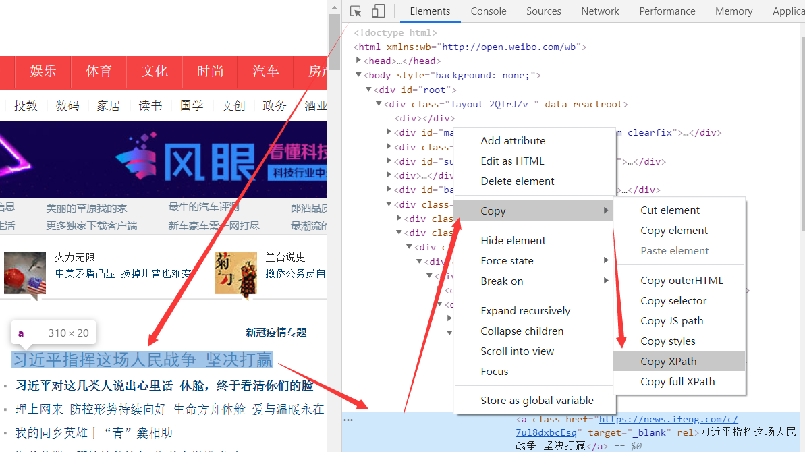
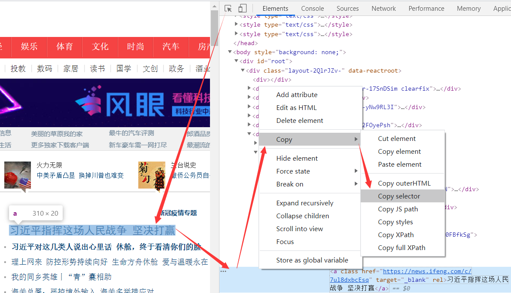
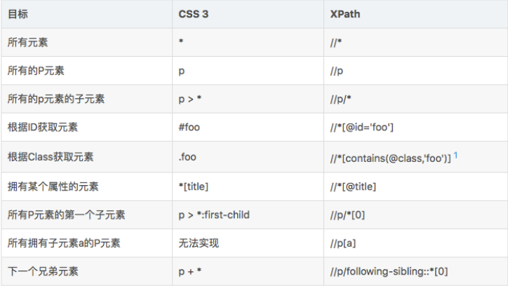

# 解析库、选择器、正则

## 采集内容

现在我们有能力获取网页的内容，但网页中的内容并不都是我们所需要的，这时候就需要利用解析库和选择器从中筛选出我们想要的信息。

### 解析库和选择器

在采集网页内容的过程当中，解析库和选择器是结合起来使用的。

解析库作用：修正HTML文本，**将网页内容解析为适合选择器选择定位的样式**。

选择器作用：**根据自身的定位规则选择解析后网页中的部分内容**。

### 常用的采集方法

lmxl解析库+XPath选择器：节点自动补全，解析速度快，表达式易写易定位。

Beautiful Soup解析库+CSS选择器：节点自动补全，可自由选择多种解析器和多种选择器。

正则表达式：不依赖第三方库，采集解析定位速度快。(**推荐**)

## lmxl+XPath

XPath 全称 XML Path Language ，即 **XML 路径语言**，它是一门**查找信息的语言**它最初是用来搜寻 XML 文档的，但是它同样适用于 HTML 文档的搜索。所以在做爬虫时，我们完全可以使用 XPath 来做相应的信息抽取。

### lmxl解析库

lxml 是 Python 的一个支持 HTML 和 XML 解析的第三方库，支持 XPath 解析方式，而且解析效率非常高。

```
pip install lxml
```

安装完成后，我们需要使用lxml库中的etree模块：

```python
# 导入lxml库中的etree模块
from lxml import etree

def example():
    # 网页代码
    html_text ='<li class="1"><a class="" href="https://health.ifeng.com/c/7ukXdtax7s8#_wth_sc1" target="_blank" rel="">面对常见皮肤问题，黄金万能膏让你高枕无忧</a></li>' \
               '<li class="2"><a class="" href="https://health.ifeng.com/c/7ukXlZPltHE#_wth_sc1" target="_blank" rel="">功能强大全自动晴雨伞，反向收伞干净不湿车</a>'

    # 解析网页代码
    res = etree.HTML(html_text)
    print(f'直接输出：{res}')
    print(f'字符输出：{etree.tostring(res)}')

if __name__ == '__main__':
    example()

'''
# 解释：这里输出显示是一个对象
直接输出：<Element html at 0x13e22fbe888>

# 解释：以bytes类型输出，自动补全了上面内容尾部缺失的</li>，还自动添加了<html><body>节点，修正了文本
字符输出：b'<html><body><li class=""><a class="" href="https://health.ifeng.com/c/7ukXdtax7s8#_wth_sc1" target="_blank" rel="">&#38754;&#23545;&#24120;&#35265;&#30382;&#32932;&#38382;&#39064;&#65292;&#40644;&#37329;&#19975;&#33021;&#33167;&#35753;&#20320;&#39640;&#26517;&#26080;&#24551;</a></li><li class=""><a class="" href="https://health.ifeng.com/c/7ukXlZPltHE#_wth_sc1" target="_blank" rel="">&#21151;&#33021;&#24378;&#22823;&#20840;&#33258;&#21160;&#26228;&#38632;&#20254;&#65292;&#21453;&#21521;&#25910;&#20254;&#24178;&#20928;&#19981;&#28287;&#36710;</a></li></body></html>'
'''
```

### XPath选择器

lxml解析完成以后接下来我们就需要XPath选择器来定位我们需要的内容，常用的定位规则有7种：

|  表达式  |           描述           |
| :------: | :----------------------: |
| nodename |  选取此节点的所有子节点  |
|    /     | 从当前节点选取直接子节点 |
|    //    |  从当前节点选取子孙节点  |
|    .     |       选取当前节点       |
|    ..    |   选取当前节点的父节点   |
|    @     |         选取属性         |
|    *     |         所有节点         |

### XPath定位采集

```python
# 导入lxml库中的etree模块
from lxml import etree

def example():
    # 网页代码
    html_text ='<li class="1"><a class="" href="https://health.ifeng.com/c/7ukXdtax7s8#_wth_sc1" target="_blank" rel="">面对常见皮肤问题，黄金万能膏让你高枕无忧</a></li>' \
               '<li class="2"><a class="" href="https://health.ifeng.com/c/7ukXlZPltHE#_wth_sc1" target="_blank" rel="">功能强大全自动晴雨伞，反向收伞干净不湿车</a>'
    # 解析网页代码
    res = etree.HTML(html_text)
    # 选取所有节点元素
    print(res.xpath('//*'))
    # 获取全部的a标签元素
    print(res.xpath('//a'))
    # 获取a标签的父标签(上一级标签)，即li标签
    print(res.xpath('//a/..'))
    # 获取a标签的父标签的class属性内容
    print(res.xpath('//a/../@class'))
    # @href获取a标签href属性的内容
    print(res.xpath('//a/@href'))
    # 获取第一个a标签href属性的内容
    print(res.xpath('//a/@href')[0])
    # text()获取a标签内的文本内容
    print(res.xpath('//a/text()'))
    # 获取第二个a标签内的文本内容
    print(res.xpath('//a/text()')[1])

if __name__ == '__main__':
    example()

'''
# 解释：返回形式是一个列表，每个元素是一个Element类型，中间显示了节点的名称
# 这里两个li标签、两个a标签、一个html标签和body标签，这两个标签是在解析的时候补全的
[<Element html at 0x24e3d073e08>, <Element body at 0x24e3d1bcc88>, <Element li at 0x24e3d1bcd08>, <Element a at 0x24e3d1bcd48>, <Element li at 0x24e3d1bcd88>, <Element a at 0x24e3d1bcfc8>]
# 这里两个都是a标签，即获取了全部的a标签
[<Element a at 0x24e3d1bcc88>, <Element a at 0x24e3d1bcd08>]
# 这里都是a标签的父标签，也都是li标签
[<Element li at 0x18df104adc8>, <Element li at 0x18df104aec8>]

# 这里都是a标签的父标签的class属性，即li标签class属性
['1', '2']
# 获取所有a标签的herf属性里面的内容
['https://health.ifeng.com/c/7ukXdtax7s8#_wth_sc1','https://health.ifeng.com/c/7ukXlZPltHE#_wth_sc1']
# 获取第一个a标签的herf属性里面的内容
https://health.ifeng.com/c/7ukXdtax7s8#_wth_sc1

# 获取所有的a标签里面的文本内容
['面对常见皮肤问题，黄金万能膏让你高枕无忧', '功能强大全自动晴雨伞，反向收伞干净不湿车']
# 获取第一个a标签里面的文本内容
功能强大全自动晴雨伞，反向收伞干净不湿车
'''
```

### 浏览器XPath

熟悉了XPath定位规则以后，手动来写表达式速度还达不到最快，好在浏览器是支持拷贝XPath定位的。



```python
#拷贝的XPath定位内容：//*[@id="newsList"]/ul[1]/li[1]/h1/a
'''
//*[@id="newsList"]：全局定位id属性为"newsList"的节点
/ul[1]：选出含有ul标签的节点列表的第一个ul节点
/li[1]：选出含有li标签的节点列表的第一个li节点
/h1/a：选出含有h1标签节点里面的a标签节点
'''
```

## Beautiful Soup+CSS

### Beautiful Soup解析库

Beautiful Soup 是 Python 的一个 HTML 或 XML 的解析库，**其解析器是依赖于 lxml 库的，所以在此之前请确保已经成功安装好了 lxml 库**。

```
pip install beautifulsoup4
```

Beautiful Soup支持多种解析器：

|      解析器      |              使用方法               |                            优势                             |          劣势          |
| :--------------: | :---------------------------------: | :---------------------------------------------------------: | :--------------------: |
|  Python 标准库   | BeautifulSoup(HTML,”html. parser ") |      Python 的内置标准库、执行速度适中、文档容错能力强      |       容错能力差       |
| lxml HTML 解析器 |     BeautifulSoup(HTML,”lxml”)      |                   速度快、文档容错能力强                    |    需要安装C语言库     |
| lxml XML 解析器  |      BeautifulSoup(HTML,“xml")      |                 速度快、唯一支持 XML 解析器                 |    需要安装C语言库     |
|     html5lib     |   BeautifulSoup(HTML,”html5lib”)    | 最好的容错性、以浏览器的方式解析文档、生成 HTML5 格式的文档 | 速度慢、不依赖外部扩展 |

通过对比可以看出， lxml 解析器有解析 HTML 和 XML 的功能，而且速度快，容错能力强，所以推荐使用它。

```python
# 注意：这里是从bs4中导入BeautifulSoup
from bs4 import BeautifulSoup

def example():
    # 网页代码
    html_text = '<li class="1"><a class="" href="https://health.ifeng.com/c/7ukXdtax7s8#_wth_sc1" target="_blank" rel="">面对常见皮肤问题，黄金万能膏让你高枕无忧</a></li>' \
                '<li class="2"><a class="" href="https://health.ifeng.com/c/7ukXlZPltHE#_wth_sc1" target="_blank" rel="">功能强大全自动晴雨伞，反向收伞干净不湿车</a>'
    # 使用lxml解析器
    soup = BeautifulSoup(html_text,'lxml')
    print(soup)
    
if __name__ == '__main__':
    example()

'''
# 解释：同样这里也和上面一样，自动补全了</li>标签，还添加了<html>和<body>节点
<html><body><li class="1"><a class="" href="https://health.ifeng.com/c/7ukXdtax7s8#_wth_sc1" rel="" target="_blank">面对常见皮肤问题，黄金万能膏让你高枕无忧</a></li><li class="2"><a class="" href="https://health.ifeng.com/c/7ukXlZPltHE#_wth_sc1" rel="" target="_blank">功能强大全自动晴雨伞，反向收伞干净不湿车</a></li></body></html>
'''
```

### CSS选择器

BeautifulSoup支持也多种选择器，节点选择器、CSS选择器，这里重点讲述CSS选择器。

|       表达式       |              描述              |
| :----------------: | :----------------------------: |
|    .prettify()     |       网页缩进格式化输出       |
|     .contents      |     获取节点下面所有子节点     |
|    .descendants    |    获取节点下面所有子孙节点    |
|      .parent       |        获取节点的父节点        |
|      .parents      |        获取所有祖先节点        |
|   .next_sibling    |          同级下⼀节点          |
| .previous_sibling  |          同级上⼀节点          |
|   .next_siblings   |        同级所有后面节点        |
| .previous_siblings |        同级所有前面节点        |
|       ul li        |   选择ul节点下面的所有li节点   |
|       .panel       | 选择所有class属性为panel的节点 |
|      #list-1       |  选择所有id属性为list-1的节点  |
|      ul['id']      |       获取ul节点的id属性       |
|     li.string      |      获取li节点的文本内容      |

### CSS定位采集

使用 CSS 选择器时，只需要调用 select() 方法，传人相应的 CSS 选择器即可：

```python
# 注意：这里是从bs4中导入BeautifulSoup
from bs4 import BeautifulSoup

def example():
    # 网页代码
    html_text = '<li class="a1"><a class="b2" href="https://health.ifeng.com/c/7ukXdtax7s8#_wth_sc1" target="_blank" rel="">面对常见皮肤问题，黄金万能膏让你高枕无忧</a></li>' \
                '<li class="c3"><a class="d4" href="https://health.ifeng.com/c/7ukXlZPltHE#_wth_sc1" target="_blank" rel="">功能强大全自动晴雨伞，反向收伞干净不湿车</a>'
    # 使用lxml解析器
    soup = BeautifulSoup(html_text,'lxml')
    # 输出li节点下的所有a节点
    print(soup.select('li a'))
    # 输出class属性为a1的li节点
    print(soup.select('li.a1'))
    # 输出li节点的所有下级节点中class属性为d4的节点
    print(soup.select('li .d4'))
    # 遍历li节点列表
    for li in soup.select('li'):
        # 输出li节点的class属性值
        print(li['class'])

if __name__ == '__main__':
    example()

'''
# 解释：li节点下的所有a节点
[<a class="b" href="https://health.ifeng.com/c/7ukXdtax7s8#_wth_sc1" rel="" target="_blank">面对常见皮肤问题，黄金万能膏让你高枕无忧</a>, <a class="d" href="https://health.ifeng.com/c/7ukXlZPltHE#_wth_sc1" rel="" target="_blank">功能强大全自动晴雨伞，反向收伞干净不湿车</a>]

# 解释：输出class属性为a1的li节点
[<li class="a1"><a class="b2" href="https://health.ifeng.com/c/7ukXdtax7s8#_wth_sc1" rel="" target="_blank">面对常见皮肤问题，黄金万能膏让你高枕无忧</a></li>]

# 解释：li节点的所有下级节点中class属性为d4的节点
[<a class="d4" href="https://health.ifeng.com/c/7ukXlZPltHE#_wth_sc1" rel="" target="_blank">功能强大全自动晴雨伞，反向收伞干净不湿车</a>]

# 解释：输出li节点的class属性值
['a1']
['c3']
'''
```

### 浏览器selector

和XPath一样，浏览器也支持CSS选择器表达式：



```python
#拷贝的CSS定位内容：#newsList > ul:nth-child(1) > li.topic-21mlMS78 > h1 > a
'''
#newsList：选择id属性为newsList的节点
>：下一级节点
ul:nth-child(1)：选择ul节点列表中的第一个ul节点
li.topic-21mlMS78：选择calss属性为topic-21mlMS78的li节点
h1：选择h1节点
a：选择a节点
'''
```

### CSS和XPath元素选择



## 正则提取

### 常用正则方法

用正则提取网页内容时，一般只用到三个常用的正则方法，熟记即可：

```python
import re

# search方法：以字符串形式返回匹配到的第一个符合正则的内容就结束匹配，但没有匹配就报错
re.search(r'正则', '内容').group(括号位)
print(re.search(r'.', 'abcabc').group(0))        # a，匹配到第一个就结束匹配
print(re.search(r'abc', 'abcabc').group(0))      # abc，匹配到第一个abc结束匹配
print(re.search(r'a(b)c', 'abcabc').group(0))    # abc，0代表以abc匹配，返回abc
print(re.search(r'a(b)c', 'abcabc').group(1))    # b，1代表以abc匹配，返回第一个括号中的b
print(re.search(r'a(b)(c)', 'abcabc').group(2))  # c，2代表以abc匹配，返回第二个括号中的c

# findall方法：以列表形式将匹配到的所有内容返回，没有匹配返回空列表
re.findall(r'正则', '内容')
print(re.findall(r'.', 'abcabc'))                 # ['a', 'b', 'c', 'a', 'b', 'c']
print(re.findall(r'abc', 'abcabc'))               # ['abc', 'abc']
print(re.findall(r'a(b)c', 'abcabc'))             # ['b', 'b']，以abc匹配返回括号里的b
print(re.findall(r'a(bc)', 'abcabc'))             # ['bc', 'bc']，abc匹配返回括号里的bc
print(re.findall(r'abcd', 'abcabc'))              # []，没有匹配返回空列表

# sub方法：以字符串形式将匹配到的所有旧字符串替换为新字符串后返回
re.findall(r'旧字符串', '新字符串', '内容')
print(re.sub(r'.', '*','abcabc'))                # ******，匹配到全部字符串，全部都替换为*
print(re.sub(r'abc', 'a**','abcabc'))            # a**a**，将匹配到的abc替换为a**
print(re.sub(r'abcd', '****','abcabc'))          # abcabc，没有匹配旧不替换

```

### 正则提取

```python
# 导入正则库
import re

def example():
    '''
    .*：贪婪匹配，即尽可能多的匹配
    .*?：非贪婪匹配，即尽可能少的匹配
    '''
    # 网页代码
    html_text = '<li class="a1"><a class="b2" href="https://health.ifeng.com/c/7ukXdtax7s8#_wth_sc1" target="_blank" rel="">面对常见皮肤问题，黄金万能膏让你高枕无忧</a></li>' \
                '<li class="c3"><a class="d4" href="https://health.ifeng.com/c/7ukXlZPltHE#_wth_sc1" target="_blank" rel="">功能强大全自动晴雨伞，反向收伞干净不湿车</a>'
    # 输出li节点下的所有a节点
    print(re.findall(r'<li.*?(<a.*?</a>)',html_text))
    # 输出所有a节点的标题
    print(re.findall(r'<a.*?>(.*?)</a>', html_text))
    # 输出class属性为a1的li节点
    print(re.search(r'<li class="a1">(<a.*?</a>)', html_text).group(1))
    # 输出li节点的所有下级节点中class属性为d4的节点
    print(re.search(r'.*(<a.*?class="d4".*?</a>)', html_text).group(1))
    # 抹除所有的href属性
    print(re.sub(r'href=".*?"','',html_text))

if __name__ == '__main__':
    example()

'''
# 解释：以列表形式返回所有a节点
['<a class="b2" href="https://health.ifeng.com/c/7ukXdtax7s8#_wth_sc1" target="_blank" rel="">面对常见皮肤问题，黄金万能膏让你高枕无忧</a>', '<a class="d4" href="https://health.ifeng.com/c/7ukXlZPltHE#_wth_sc1" target="_blank" rel="">功能强大全自动晴雨伞，反向收伞干净不湿车</a>']

# 解释：以列表形式返回所有a节点内容
['面对常见皮肤问题，黄金万能膏让你高枕无忧', '功能强大全自动晴雨伞，反向收伞干净不湿车']

# 解释：以字符串形式返回class属性为a1的li节点
<a class="b2" href="https://health.ifeng.com/c/7ukXdtax7s8#_wth_sc1" target="_blank" rel="">面对常见皮肤问题，黄金万能膏让你高枕无忧</a>

# 解释：以字符串形式返回class属性为d4的a节点
<a class="d4" href="https://health.ifeng.com/c/7ukXlZPltHE#_wth_sc1" target="_blank" rel="">功能强大全自动晴雨伞，反向收伞干净不湿车</a>

# 解释：抹除所有的href属性后的字符串
<li class="a1"><a class="b2"  target="_blank" rel="">面对常见皮肤问题，黄金万能膏让你高枕无忧</a></li><li class="c3"><a class="d4"  target="_blank" rel="">功能强大全自动晴雨伞，反向收伞干净不湿车</a>
'''
```

### 处理换行符

使用 `(.*)贪婪匹配 ` 或者 `(.*?)非贪婪匹配` 提取时，有一个很蛋疼问题就是不能匹配 `\n` 换行符，可以参考下面两种方法：

```python
import re

b = '5\n6'

print(re.search(r'5.*?6', b))             # None，因为.*?匹配不到\n换行符，所以结果为空

# 方法一：使用[\s|\S]代替.
print(re.search(r'5[\s|\S]*?6', b))       # <re...span=(0, 3), match='5\n6'>，因为\s能匹配到\n换行符

# 方法二：先用\s除去所有的空格包括换行符
b1 = re.sub(r'\s', '', b)
print(re.search(r'5.*?6', b1))            # <re...span=(0, 2), match='56'>，因为\s除去所有的空格包括换行符
```