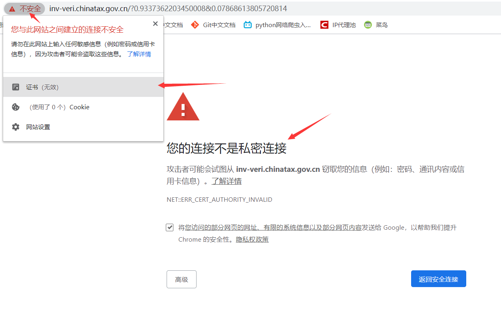

# Requests库

参考内容：[requests中文文档](http://2.python-requests.org/zh_CN/latest/)

## 初识Requests

**requests是实现HTTP各类型请求的最简单、最易用的第三方库，也是写爬虫必须要掌握的库。**使用前需安装requests库：

```
pip install requests
```

使用requests库实现HTTP多种请求类型的发送：

```python
import requests

# get请求（爬虫常用）
requests.get('http://httpbin.org/get')
# post请求（爬虫常用）
requests.post('http://httpbin.org/post', data = {'key':'value'})
# put请求
requests.put('http://httpbin.org/put', data = {'key':'value'})
# delete请求
requests.delete('http://httpbin.org/delete')
```

### GET请求

**当你在浏览器中输入一个网址并回车键的那一刻，就向网站的服务器发送了一个get请求。**

在requests中也只需要输入一个网址就可以发送get请求，重要参数有两个：

1. **url参数：HTTP请求必备的参数，作用是确定访问的网址。**
2. **params参数：以字典的形式传递url中参数。**

```python
import requests

# 基本的GET请求
# 方式一：网址传递给变量，在传递给url参数
link = 'https://httpbin.org/get'
response = requests.get(url=link)
# 方式二：直接传递给url参数（推荐）
response = requests.get('https://httpbin.org/get')

#打印响应的内容信息
print(response.text)
'''
输出：
{
  "args": {}, 
  "headers": {
    "Accept": "/", 
    "Accept-Encoding": "gzip, deflate", 
    "Connection": "close", 
    "Host": "httpbin.org", 
    "User-Agent": "python-requests/2.19.1"
  }, 
  "origin": "182.149.163.126", 
  "url": "https://httpbin.org/get"
}

# 解释：访问https://httpbin.org/get这个网址会返回客户端发送的请求内容。因为没有设置User-Agent，所以默认为python-requests/2.19.1；
'''

# 带参GET请求：在URL中传递的参数会以键/值对的形式跟在一个问号的后面。例如， httpbin.org/get?key=val。这里的params关键字参数，就可以字典形式来传递这些参数。字典里值为 None 的键都不会被添加到 URL 的查询字符串里。

# 方式一：url包含键值对参数
response = requests.get('https://httpbin.org/get?name=germey&age=22')
# 方式二：使用params关键字参数
data = {'name': 'germey', 'age': 22}
response = requests.get('https://httpbin.org/get', params=data)

print(response.text)
'''
输出：
{
  "args": {
    "age": "22", 
    "name": "germey"
  }, 
  "headers": {
    "Accept": "/", 
    "Accept-Encoding": "gzip, deflate", 
    "Connection": "close", 
    "Host": "httpbin.org", 
    "User-Agent": "python-requests/2.19.1"
  }, 
  "origin": "182.149.163.126", 
  "url": "https://httpbin.org/get?name=germey&age=22"
}

# 解释："args"就是传递的参数，里面就显示了url中所带的参数。
'''
```

### POST请求

post请求和get请求的主要区别在于：

1. **post请求传递的参数长度没有限制；get请求则有所限制。**
2. **post请求传递的参数形式是通过表单传递的，不会暴露在url当中，例如：用户密码登录用的就是post请求；get请求传递的参数是以键/值对的形式跟在一个问号的后面的。**

post请求也很简单，主要是网址和传参：

1. **url参数：这里和get请求都一样，每个HTTP请求都必须要有的一个参数。**
2. **data参数：以字典`dict`的形式提交参数时，若不指定`content-type`，默认为`application/x-www-form-urlencoded`，相当于普通form表单提交；以字符串`str`的形式提交参数时，若不指定`content-type`，默认为`application/json`。**
3. **json参数：以json数据的结构形式提交参数，若不指定`headers`中的`content-type`，默认为`application/json`。**
4. **用data参数提交数据时，`request.body`的内容则为`a=1&b=2`的这种形式，用json参数提交数据时，`request.body`的内容则为'{"`a": 1, "b": 2}'`的这种形式**

```python
import requests

# 请求头，以form表单数据被编码为key/value格式发送到服务器
headers1 = {'Content-Type': 'application/x-www-form-urlencoded'}
# 请求头，以JSON数据格式发送到服务器
headers2 = {'Content-Type': 'application/json'}
# 字典格式参数
dict1 = {'name': 'germey', 'age': 22, 'company':'公司'}
# 字符串格式参数
str1 = "{'name': 'germey', 'age': 22, 'company':'公司'}"
# json格式参数
json1 = "{\"name\": \"germey\", \"age\": 22, \"company\":\"公司\"}"
# 网址
address = 'https://httpbin.org/post'

'''
输出注解：
  "form": 和请求头'application/x-www-form-urlencoded'有关，以form表单传递
  "data": 和请求头'application/json'有关，以JSON数据格式传递
'''

print(requests.post(url=address, headers=headers1, data=dict1).text)
print(requests.post(url=address, headers=headers1, data=str1.encode('UTF8')).text)
print(requests.post(url=address, headers=headers1, data=json1.encode('UTF8')).text)
'''
输出：
"form": {"age": "22", "company": "\u516c\u53f8", "name": "germey"},
"form": {"{'name': 'germey', 'age': 22, 'company':'\u516c\u53f8'}": ""},
"form": {"{\"name\": \"germey\", \"age\": 22, \"company\":\"\u516c\u53f8\"}": ""},
总结：参数data会把值编码为Unicode，请求头'application/x-www-form-urlencoded'将其转换为表单的形式，若data是str类型，则data作为键，值为空；若data是dict类型则不变。
'''

print(requests.post(url=address, headers=headers1, json=dict1).text)
print(requests.post(url=address, headers=headers1, json=str1).text)
print(requests.post(url=address, headers=headers1, json=json1).text)
'''
输出：
"form": {"{\"name\": \"germey\", \"age\": 22, \"company\": \"\\u516c\\u53f8\"}": ""},
"form": {"\"{'name': 'germey', 'age': 22, 'company':'\\u516c\\u53f8'}\"": ""},
"form": {"\"{\\\"name\\\": \\\"germey\\\", \\\"age\\\": 22, \\\"company\\\":\\\"\\u516c\\u53f8\\\"}\"": ""},
总结：参数json会把值进行json序列化，因为序列化后全是字符串，请求头'application/x-www-form-urlencoded'以表单的形式传递，表单的键就是序列化的字符串，值全部为空。
'''

print(requests.post(url=address, headers=headers2, data=dict1).text)
print(requests.post(url=address, headers=headers2, data=str1.encode('UTF8').text)
print(requests.post(url=address, headers=headers2, data=json1.encode('UTF8').text)
'''
输出：
"data": "name=germey&age=22&company=%E5%85%AC%E5%8F%B8",
"data": "{'name': 'germey', 'age': 22, 'company':'\u516c\u53f8'}",
"data": "{\"name\": \"germey\", \"age\": 22, \"company\":\"\u516c\u53f8\"}",
总结：参数data会把值编码为Unicode，请求头'application/json'将其转换为json格式，如果本身是dict类型则数据以a=1&b=2形式传递，若是str类型则以str形式传递，若是json格式则以json格式传递，因为json数据本身可反序列化。
'''

print(requests.post(url=address, headers=headers2, json=dict1).text)
print(requests.post(url=address, headers=headers2, json=str1).text)
print(requests.post(url=address, headers=headers2, json=json1).text)
'''
输出：
"data": "{\"name\": \"germey\", \"age\": 22, \"company\": \"\\u516c\\u53f8\"}",
"data": "\"{'name': 'germey', 'age': 22, 'company':'\\u516c\\u53f8'}\"",
"data": "\"{\\\"name\\\": \\\"germey\\\", \\\"age\\\": 22, \\\"company\\\":\\\"\\u516c\\u53f8\\\"}\"",
总结：参数json会把存储的值进行序列化，请求头'application/json'会再转换一次json格式，相当于序列化了两次，因此全都可以反序列化一次。
'''
```

## 爬虫请求头

### 默认请求头

**没有请求头的爬虫是没有灵魂的爬虫**，事实上使用requests库写爬虫时，只要没有额外设置请求头，都会有一个爬虫的默认请求头：

```python
import requests

# 百度地址
url = 'http://www.baidu.com'
# 获取响应
response1 = requests.get(url=url)
# 输出请求头
print(response1.request.headers)

'''
输出：
{'User-Agent': 'python-requests/2.22.0', 'Accept-Encoding': 'gzip, deflate', 'Accept': '*/*', 'Connection': 'keep-alive'}
注释：请求中虽然没有设置请求头headers，但在实际的访问过程当中，源码还是会添加默认的请求头参数，例如'User-Agent'、'Accept'等参数。
'''
```

### 设置请求头

```python
import requests

# 百度地址
url = 'http://www.baidu.com'
# 添加请求头参数
headers = {'User-Agent': 'Chrome/13.0 Safari/535', 'add':'abc'}
# 获取响应
response2 = requests.get(url=url, headers=headers)
# 输出请求头
print(response2.request.headers)
'''
输出：
第二次请求的请求头：{'User-Agent': 'Chrome/13.0 Safari/535', 'Accept-Encoding': 'gzip, deflate', 'Accept': '*/*', 'Connection': 'keep-alive', 'add': 'abc'}
注释：请求中设置了请求头headers，如果请求头headers有默认的请求参数，则会进行覆盖，反之则是增加该参数。这里和上面的例子相比就会发现，覆盖了User-Agent参数，新增了add参数，其他的默认请求头参数不变。
'''
```

### 更换请求头

在爬取的某些网站时候，需要一定数量的User-Agent来让爬虫随机更换，达到更好的伪装。

```python
import random

def UserAgent():
    header = (
                'Mozilla/5.0 (compatible; MSIE 10.0; Windows NT 6.2; ARM; Trident/6.0)',
                'Mozilla/5.0 (Windows; U; Windows NT 6.0; en-US) AppleWebKit/525.13 (KHTML, like Gecko) Chrome/0.2.149.27 Safari/525.13',
                'Mozilla/5.0 (Macintosh; U; Intel Mac OS X 10_6_3; en-US) AppleWebKit/533.4 (KHTML, like Gecko) Chrome/5.0.375.55 Safari/533.4',
                'Mozilla/5.0 (X11; U; Linux i686; en-US) AppleWebKit/534.3 (KHTML, like Gecko) Chrome/6.0.472.63 Safari/534.3',
                'Mozilla/5.0 (Windows; U; Win98; ja-JP; m18) Gecko/20001108 Netscape6/6.0',
                '...'
            )
    return random.choice(header)
```

fake-useragent是一个非常好用的伪装请求头的库，可以随机生成大部分浏览器的user-agent。

```python
from fake_useragent import UserAgent

# ie浏览器
print(UserAgent().ie)  
# Mozilla/5.0 (compatible; MSIE 8.0; Windows NT 5.1; Trident/4.0; SLCC1; .NET CLR 3.0.4506.2152; .NET CLR 3.5.30729; .NET CLR 1.1.4322)

# chrome浏览器
print(UserAgent().chrome)  
# Mozilla/5.0 (Macintosh; Intel Mac OS X 10_7_5) AppleWebKit/537.36 (KHTML, like Gecko) Chrome/27.0.1453.93 Safari/537.36

# firefox浏览器
print(UserAgent().firefox)  
# Mozilla/5.0 (X11; Linux i586; rv:31.0) Gecko/20100101 Firefox/31.0

#safri浏览器
print(UserAgent().safari)  
# Mozilla/5.0 (Macintosh; U; Intel Mac OS X 10_6_6; fr-fr) AppleWebKit/533.20.25 (KHTML, like Gecko) Version/5.0.4 Safari/533.20.27

# 最常用的方式，随机生成请求头
print(UserAgent().random)  
# Mozilla/5.0 (X11; NetBSD) AppleWebKit/537.36 (KHTML, like Gecko) Chrome/27.0.1453.116 Safari/537.36
```

?> 若遇到报错`fake_useragent.errors.FakeUserAgentError: Maximum amount of retries reached`，是因为 `fake_useragent` 中存储的 `UserAgent` 列表发生了变动，而本地 `UserAgent` 的列表未更新所导致的，在更新 `fake_useragent` 后报错就消失了，更新命令`pip install -U fake-useragent`，或者直接禁用缓存服务`UserAgent(use_cache_server=False)` 能解决。

### 移动端请求头

除了PC端浏览器的请求头，还有手机端浏览器的请求头，两者之间还是有所区别的，而且某些网站使用手机端的请求头取爬取相对使用PC端浏览器的请求头要容易一点。

```
手机：三星I9000  系统：安卓

1.自带浏览器
Mozilla/5.0 (Linux; U; Android 4.0.3; zh-cn; U8860 Build/HuaweiU8860) UC AppleWebKit/530+ (KHTML, like Gecko) Mobile Safari/530 

2.uc浏览器uc7/uc8
Mozilla/5.0 (Linux; U; Android 2.3.7; zh-cn; GT-I9000 Build/MIUI) AppleWebKit/533.1 (KHTML, like Gecko) Version/4.0 Mobile Safari/533.1 360browser(securitypay,securityinstalled)

3.QQ浏览器
MQQBrowser/3.4/Adr (Linux; U; 2.3.7; zh-cn; GT-I9000 Build/MIUI.2.4.13;480*800) 

4.遨游浏览器
Mozilla/5.0 (Linux; U; Android 2.3.7; zh-cn; GT-I9000 Build/MIUI)Maxthon AppleWebKit/533.1 (KHTML, like Gecko) Version/4.0 Mobile Safari/533.1 

5.360浏览器
Mozilla/5.0 (Linux; U; Android 2.3.7; zh-cn; GT-I9000 Build/MIUI) AppleWebKit/533.1 (KHTML, like Gecko) Version/4.0 Mobile Safari/533.1 360browser(securitypay,securityinstalled)


手机：Iphone4s  系统：ios

1.Safari
Mozilla/5.0 (iPhone; CPU iPhone OS 5_0_1 like Mac OS X) AppleWebKit/534.46 (KHTML, like Gecko) Version/5.1 Mobile/9A405 Safari/7534.48.3 

2、uc浏览器
IUC(U;iOS 5.0.1;Zh-cn;320*480;)/UCWEB8.5.0.163/42/999

3、QQ浏览器
MQQBrowser/31 (iOS; U; CPU like Mac OS X; zh-cn) 
```

## 接受响应

当我们向服务器发送请求后，服务器会返回给客户端响应，在响应中包含许多内容，通过响应的各种属性可以轻松获取到我们想要的内容。

### 响应属性

```python
import requests
from fake_useragent import UserAgent

# 请求头
headers = {'User-Agent': UserAgent().random,}
# 图片地址
url = '...'
# 获取响应
response = requests.get(url=url, headers=headers)

# 打印响应状态 
print(response)                      # <Response [200]>，表示获取到响应
# 打印网页响应的状态码
print(response.status_code)          # 200，200表示成功访问
# 设置响应内容的编码，后面都会使用设置的新编码。
# Requests会基于HTTP头部响应的charset字段对网页文本编码作出推测，没有charset字段默认为ISO-8859-1编码，但无法解析中文。
response.encoding = 'UTF-8'          # 主要针对于网页中文乱码的情况
response.encoding = 'GBK'            # 主要针对于网页编码为gbk、gb2312类型的内容
response.encoding = 'unicode_escape' # 主要针对于网页编码为unicode类型的的内容
# apparent_encoding会从网页的内容中分析网页编码的方式，所以apparent_encoding比encoding更加准确。
response.encoding = response.apparent_encoding

# 以字符型文本形式打印响应内容
print(response.text)                 # 主要用于打印网页的代码和文本内容
# 以二进制的形式打印响应内容数据
print(response.content)              # 主要用于打印网页中图片、音频、视频（二进制文件）内容
# 以json格式打印响应的内容
print(reponse.json())                # 等价于print(json.loads(reponse.text))
# 打印响应头
print(response.headers)              # 查看服务器返回内容的请求头
# 打印请求头
print(response.requests.headers)     # 查看访问时的请求头
# 打印响应的url内容
print(response.url)				
# 打印响应的cookie
print(response.cookies)              # 打印响应内容中Cookie
# 打印响应的cookies.items
print(response.cookies.items())      # 以视图对象的形式打印响应内容中Cookie
# 遍历cookies内容打印cookie
for key, value in response.cookies.items():
    print(key + '=' + value)
```

### 简单爬取资源

```python
import requests
from fake_useragent import UserAgent

# 请求头
headers = {'User-Agent': UserAgent().random,}
# 资源地址
url = '...'
# 返回响应
response = requests.get(url=url, headers=headers)

# 若爬取内容是网页，使用text属性输出
print(response.text)

# 若爬取内容是图片、音频、视频，使用content属性输出，因为他们都属于二进制文件：
# 在指定路径以wb(二进制写入模式)方式打开或新建文件，将content(二进制流数据)写入到文件当中
with open('路径/文件名.后缀名', 'wb') as f:
    f.write(response.content)
```

## 异常处理

### 追踪重定向

重定向：**网络请求被重新定个方向转到了其它位置。**

重定向状态码：301（永久性重定向）、302（暂时性重定向）。

重定向情况一般有：网站调整（如网页目录结构变化）、网页地址改变、网页扩展名（.php、.html、.asp）的改变、一个网站注册了多个域名。这些情况下都需要进行网页的重定向，否则就容易出现404错误。

?> 默认状态下，requests 属性 `allow_redirects=True` ，即访问过程中会自动重定向。

```python
import requests
url = 'http://home.cnblogs.com/u/xswt/'
# all_redirects=False：禁止重定向
r = requests.get(url,headers={"Content-Type":"application/json"}, allow_redirects=False)
print(f'状态码：{r.status_code}')
print(r.text)
'''
输出：
状态码：302
<html>
<head><title>302 Found</title></head>
<body bgcolor="white">
<center><h1>302 Found</h1></center>
<hr><center>nginx</center>
</body>
</html>
'''
```

响应内容属性中有一个 `history` 属性，里面存储着访问的历史记录，可以通过这个属性来追踪重定向。

```python
import requests
url = 'http://home.cnblogs.com/u/xswt/'
r = requests.get(url,headers={"Content-Type":"application/json"})
# history追踪页面重定向历史，就是一个地址序列
reditList = r.history
print(f'获取重定向的历史记录：{reditList}')
print(f'获取第一次重定向的headers头部信息：{reditList[0].headers}')
print(f'获取重定向最终的url：{reditList[len(reditList)-1].headers["location"]}')
print(r.text)
'''
输出：
获取重定向的历史记录：[<Response [302]>]
获取第一次重定向的headers头部信息：{'Date': 'Sun, 30 Aug 2020 07:44:04 GMT', 'Content-Type': 'text/html', 'Content-Length': '154', 'Connection': 'keep-alive', 'Location': 'https://home.cnblogs.com/u/xswt/', 'Via': 'HTTP/1.1 SLB.69'}
获取重定向最终的url：https://home.cnblogs.com/u/xswt/
<!DOCTYPE html>
<html>
<head>
    <meta charset="utf-8" />
    ...
</body>
</html>

解释：访问该域名会进行一次重定向，重定向后的域名就存放在第一次重定向的headers头部信息中的Location键值对中。相较于原域名，重定向后的域名在头部变成了'https'。
'''
```

### 连接、读取超时

**requests默认的超时是 `None`，而这货默认是阻塞的，除非显式指定了 `timeout` 值，否则不会做超时处理，这意味着它将等待(挂起)直到连接关闭。因此使用requests最好设定 `timeout` 值。**

给timeout传入一个元组，分别指定连接和读取的超时时间，服务器在指定时间没有应答，就会抛出错误。

\- `timeout=(连接超时时间, 读取超时时间)`
\- 连接：客户端连接服务器并发送http请求服务器
\- 读取：客户端等待服务器发送第一个字节之前的时间

```python
import requests

# 设置连接的超时时间为100秒，读取的超时时间为0.01秒
requests.get('http://github.com', timeout=(100, 0.01))

# 抛出requests.exceptions.ReadTimeout读取超时错误
'''
requests.exceptions.ReadTimeout: HTTPConnectionPool(host='github.com', port=80): Read timed out. (read timeout=0.01)
'''
```

**timeout传入一个值将会用作 connect 和 read 二者的 timeout。**

服务器在指定时间内没有应答，抛出 `requests.exceptions.ConnectTimeout `错误。

```python
import requests

# 设置超时时间为0.001秒
requests.get('http://github.com', timeout=0.001)

# 抛出requests.exceptions.ConnectTimeout连接超时错误
'''
requests.exceptions.ConnectTimeout: HTTPConnectionPool(host='github.com', port=80): Max retries exceeded with url: / (Caused by ConnectTimeoutError(<urllib3.connection.HTTPConnection object at 0x000002B3A3B55788>, 'Connection to github.com timed out. (connect timeout=0.001)'))
'''
```

### 超过最大连接

爬虫默认连接是Keep-alive的，当服务器保持的http连接数超过最大限制时，就不能再新建连接，抛出：`requests.exceptions.ConnectionError: HTTPSConnectionPool Max retries exceeded` 错误。

```python
# 解决方法一：在header中关闭持久连接
headers = {'Connection': 'close'}
# 解决方法二：降低访问频率
time.sleep(3)
```

### 未知服务器

访问不存在的网址，抛出 `requests.exceptions.ConnectionError` 错误。

```python
import requests

# 访问不存在的网址
requests.get('http://github.comasf')

# 抛出requests.exceptions.ConnectionError错误
'''
requests.exceptions.ConnectionError: HTTPConnectionPool(host='github.comasf', port=80): Max retries exceeded with url: / (Caused by NewConnectionError('<urllib3.connection.HTTPConnection object at 0x000001DA07F41848>: Failed to establish a new connection: [Errno 11001] getaddrinfo failed'))
'''
```

### 网络异常

在断网的情况下，抛出 `requests.exceptions.ConnectionError` 错误。

```python
import requests

# 已断开网络连接的情况下
requests.get('http://github.com')

# 抛出requests.exceptions.ConnectionError错误
'''
requests.exceptions.ConnectionError: HTTPConnectionPool(host='github.com', port=80): Max retries exceeded with url: / (Caused by NewConnectionError('<urllib3.connection.HTTPConnection object at 0x000002BB2BFC46C8>: Failed to establish a new connection: [Errno 11001] getaddrinfo failed'))
'''
```

### 代理异常

代理服务器拒绝建立连接，端口拒绝连接或未开放，抛出 `requests.exceptions.ProxyError` 错误。

代理服务器没有响应，抛出  `requests.exceptions.ConnectTimeout` 错误。

```python
import requests

# 代理192.168.10.1:800
requests.get('http://github.com', proxies={"http": "192.168.10.1:800"})

# 抛出requests.exceptions.ProxyError错误
'''
requests.exceptions.ProxyError: HTTPConnectionPool(host='192.168.10.1', port=800): Max retries exceeded with url: http://github.com/ (Caused by ProxyError('Cannot connect to proxy.', NewConnectionError('<urllib3.connection.HTTPConnection object at 0x7fce3438c6d8>: Failed to establish a new connection: [Errno 111] Connection refused',)))
'''
```

### SSL证书错误

使用requests库爬取有些网站比如：[国家税务总局全国增值税发票查验平台](https://inv-veri.chinatax.gov.cn/)，就会报如下错误：

```python
import requests

response = requests.get('https://inv-veri.chinatax.gov.cn/')
print(response.status_code)
'''
报错：requests.exceptions.SSLError: ("bad handshake: Error([('SSL routines', 'tls_process_server_certificate', 'certificate verify failed')],)",)
'''
```

原因在于：**使用requests库在爬取这些网站时，会进行一个SSL证书验证的过程，如果证书验证不通过就会报错`SSLError`。**



**通过设置 `verify=False`，可以让requests库忽略对SSL证书的验证，但是会有警告**，建议我们给它指定证书：

```python
import requests

response = requests.get('https://inv-veri.chinatax.gov.cn/', verify=False)
print(f'状态码：{response.status_code}')
'''
警告：InsecureRequestWarning: Unverified HTTPS request is being made. Adding certificate verification is strongly advised. See: https://urllib3.readthedocs.io/en/latest/advanced-usage.html#ssl-warnings InsecureRequestWarning)
状态码：200
'''
```

当然我们也可以通过设置忽略警告的方式来屏蔽这个警告：

```python
import requests

# 忽略掉警告
requests.packages.urllib3.disable_warnings()
response = requests.get('https://inv-veri.chinatax.gov.cn/', verify=False)
print(f'状态码：{response.status_code}')
'''
输出：
状态码：200
'''
```

### DH键太小

有时候，即使我们已经忽略警告并关闭了SSL验证，在某些服务器上验证时，还是会返回一个SSL错误，导致无法通过。

```python
import requests

data = {
    'mainZZ': '0',
    'aptText': '',
    'areaCode': '0',
    'entName': '',
    'pageSize': '10',
    'pageIndex': 1,
}
url = 'https://cxpt.fssjz.cn/cxpt/web/enterprise/getEnterpriseList.do'

requests.packages.urllib3.disable_warnings()
response = requests.post(url=url, data=data, verify=False)
print(response.text)

'''
输出：
...
requests.exceptions.SSLError: HTTPSConnectionPool(host='cxpt.fssjz.cn', port=443): Max retries exceeded with url: /cxpt/web/enterprise/getEnterpriseList.do (Caused by SSLError(SSLError("bad handshake: Error([('SSL routines', 'tls_process_ske_dhe', 'dh key too small')])")))
翻译：由SSL错误导致了错误的握手（“SSL例程”、“tls进程”和“dh密钥太小”）
'''
```

上面错误的原因是“SSL例程”、“tls进程”和“dh密钥太小”，**说明根本问题是服务器使用的弱DH密钥，可能在Logjam攻击中被滥用，导致禁用警告或证书验证无济于事。**

**Diffie-Hellman密钥交换**：一种流行的加密算法，它允许Internet协议就共享密钥达成一致并协商安全连接。它是许多协议（包括HTTPS，SSH，IPsec，SMTPS和依赖TLS的协议）的基础。

**Diffie-Hellman加密的弱点**：1.针对TLS协议缺陷的Logjam攻击。2.来自黑客的威胁。更详细内容参看：[弱Diffie-Hellman与Logjam攻击](https://weakdh.org/)

**要解决此问题，就要不受弱DH密钥的影响，即要选择一个不使用Diffie Hellman密钥交换的密码，并且此密码必须由服务器支持。如果不知道服务器支持什么，可以尝试使用密码 `AES128-SHA` 或密码设置 `HIGH:!DH:!aNULL`。**

```python
import requests

data = {
    'mainZZ': '0',
    'aptText': '',
    'areaCode': '0',
    'entName': '',
    'pageSize': '10',
    'pageIndex': 1,
}
url = 'https://cxpt.fssjz.cn/cxpt/web/enterprise/getEnterpriseList.do'

requests.packages.urllib3.disable_warnings()
# 添加默认密码HIGH:!DH:!aNULL
requests.packages.urllib3.util.ssl_.DEFAULT_CIPHERS += 'HIGH:!DH:!aNULL'
response = requests.post(url=url, data=data, verify=False)
print(response.text)

'''
输出：
{"total":8608,"data":[{"id":"54fbff74402344f28026b2cbf38bfd1d"...
'''
```
