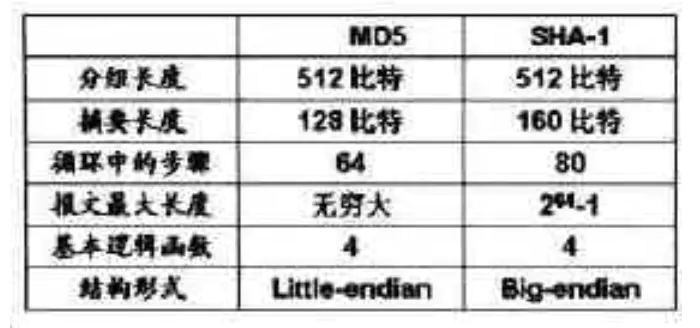

# 数据加密解密

现在我们已经能采集网页上的数据了，网页数据来源于调用的接口，有的时候我们直接访问接口，返回回来的数据是加密的，如果不能对其进行解密，也就无法采集里面的数据了。因此数据的加密解密也是学习爬虫的一项重要技能。

### 加密解密库

下面Python的加密解密过程中需要两个第三方库：hashlib库、crypto库。

##### hashlib库

hashlib库提供了常见的摘要算法，如MD5，SHA1等等。

```
安装方法：pip install hashlib
```

##### crypto库

crypto库不仅提供了常见的摘要算法，如MD5，SHA1等等，还提供了各种对称加密，如DES、AES等等。

```
安装方法：
    1.安装pycryptodome包，pip install pycryptodome
    2.进入库安装路径\lib\site-packages目录下，找到crypto文件夹名称改为Crypto(小写c改为大写C)
    3.再导包from Crypto... import ...，注意Crypto中为大写C

### MD5信息摘要算法

##### MD5简介

**MD5信息摘要算法**（MD5 Message-Digest Algorithm）一种被广泛使用的密码散列函数，可以产生出一个**128位（16字节）的散列值**，呈现形式为**32个十六进制数**，**用于确保信息传输完整一致**。

在平常下载文件的时候，都会或多或少的接触到MD5，**用于校验文件完整性**。**如果在下载过程中文件出现了损坏或者骇客在里面添加了病毒程序，其文件的MD5值都会不一样。**


在软件的下载网站一般会给出该软件文件的MD5值，将下载好文件拖入[MD5校验工具](https://dl.pconline.com.cn/download/90027.html)中，将网站的给出的MD5值比对工具生成MD5值，即可校验文件完整性。

.png)

##### MD5加密

同样的Python也能对数据进行MD5加密：

```python
# 方法一：导入hashlib模块
import hashlib
# 被加密的字符串'abc'
str1 = 'abc'
# 生成加密对象
str2 = hashlib.md5()
# 将字符串转换为二进制字符串(byte类型)添加进加密对象中
str2.update(str1.encode('utf-8'))
print ('MD5加密前：' + str1 )
print ('MD5加密后：' + str2.hexdigest())
'''
输出：
MD5加密前：abc
MD5加密后：900150983cd24fb0d6963f7d28e17f72
'''

# 方法二：导入Crypto.Hash模块中的MD5方法
from Crypto.Hash import MD5
str3 = 'abc'
str4 = MD5.new()
str4.update(str3.encode('utf-8'))
print('MD5加密前：' + str3)
print('MD5加密后：' + str4.hexdigest())
'''
输出：
MD5加密前：abc
MD5加密后：900150983cd24fb0d6963f7d28e17f72
'''
```

MD5作为大部分应用所采用的一种加密算法，肯定是**加密容易解密难**，MD5 最大的一个点就是**不可逆**，但是中国数学家[王小云](https://baike.baidu.com/item/%E7%8E%8B%E5%B0%8F%E4%BA%91/29050?fr=aladdin)等在 Crypto 2004 上提出一种能成功攻破 MD5 的算法，但也只停留在算法的层面，网上那些所谓的MD5在线破解，其实是采用**跑字典方法暴力求逆**，**目前没有软件能有效地求逆 MD5**。

### SHA-1安全散列算法

##### SHA-1简介

**SHA-1**（英语：Secure Hash Algorithm 1，中文名：**安全散列算法1**）是一种密码散列函数，美国国家安全局设计，并由美国国家标准技术研究所（NIST）发布为联邦数据处理标准（FIPS）。SHA-1可以生成一个被称为消息摘要的**160位（20字节）散列值**，呈现形式为**40个十六进制数**。

SHA-1也可以被用于**验证文件的完整性**，在上面出现的图中也有展示：


##### SHA-1加密

同样的Python也能对数据进行SHA-1加密：

```python
import hashlib
# 被加密的字符串'abc'
str1 = 'abc'
# 生成加密对象
str2 = hashlib.sha1()
# 将字符串转换为二进制字符串(byte类型)添加进加密对象中
str2.update('abc'.encode('utf-8'))
print ('SHA-1加密后：' + str1 )
print ('SHA-1加密后：' + str2.hexdigest())
'''
输出：
SHA-1加密后：abc
SHA-1加密后：a9993e364706816aba3e25717850c26c9cd0d89d
'''
```

与MD5一样，也是中国数学家[王小云](https://baike.baidu.com/item/%E7%8E%8B%E5%B0%8F%E4%BA%91/29050?fr=aladdin)提出攻解 SHA-1 的算法，但也只停留在算法的层面，网上那些所谓的SHA-1在线破解，其实也是采用**跑字典方法暴力求逆**，**目前没有软件能有效地求逆 SHA-1**。

##### SHA-1与MD5

MD5 与SHA-1均是从MD4 发展而来，有很多相似之处，**SHA-1与MD5 的最大区别在于其摘要比MD5 摘要长 32bit**。产生具有相同摘要的两个报文的难度：MD5是 264 是数量级的操作，SHA-1 是280 数量级的操作。因而，**SHA-1对强行攻击的强度更大**。但由于SHA-1 的循环步骤比MD5 多（80:64）且要处理的缓存大（160 比特:128 比特），**SHA-1的运行速度比MD5 慢**。



### 对称加密

**对称加密：同一个密钥可以同时用作信息的加密和解密，也称为单密钥加密。**

##### ECB电子密码本模式

**优点:**

1.简单；

2.有利于并行计算；

3.误差不会被传送；

**缺点:**

1.不能隐藏明文的模式；

2.可能对明文进行主动攻击；


##### CBC密码分组连接模式

**优点：**

1.不容易主动攻击,安全性好于ECB,适合传输长度长的报文,是SSL、IPSec的标准。

**缺点：**

1.不利于并行计算；

2.误差传递；

3.需要初始化向量IV


##### CFB密文反馈模式

**优点：**

1.隐藏了明文模式;

2.分组密码转化为流模式;

3.可以及时加密传送小于分组的数据;

**缺点:**

1.不利于并行计算;

2.误差传送：一个明文单元损坏影响多个单元;

3.唯一的IV;


##### OFB输出反馈模式

**优点:**

1.隐藏了明文模式;

2.分组密码转化为流模式;

3.可以及时加密传送小于分组的数据;

**缺点:**

1.不利于并行计算;

2.对明文的主动攻击是可能的;

3.误差传送：一个明文单元损坏影响多个单元;


### DES数据加密标准

**DES数据加密标准（Data Encryption Standard），是一种使用密钥加密的对称加密算法。**

**DES算法的入口参数有三个：Key、Data、Mode。**

- Key为8个字节64位，**每个字节前7位是数据位，第8位用作奇偶校验**，是DES算法的工作密钥。
- Data为8个字节64位，是要被加密或被解密的数据。
- Mode为DES的工作方式有两种：加密或解密。

**DES的加密算法和解密算法几乎是一模一样的，仅仅是密钥的使用顺序不同，所以模块的代码也几乎没有什么区别。输入输出要求是16个十六进制的字符，刚好是64bit！**

流程图：


**ECB（电子密本方式）是非常简单的加密方式**，就是将数据按照8个字节一段进行DES加密或解密得到一段段的8个字节的密文或者明文，最后一段不足8个字节（一般补0或者F），按照需求补足8个字节进行计算（并行计算），之后按照顺序将计算所得的数据连在一起即可，各段数据之间互不影响。

**CBC（密文分组链接方式）**：相比对ECB模式，就多了一个偏移量。

##### ECB模式加密函数

```python
import base64
# 导入DES加密模式
from Crypto.Cipher import DES

def DES_Encrypt(data, key):
    # 明文补位，长度达到8的倍数
    pad = 8 - len(data.encode()) % 8
    padStr = ""
    for i in range(pad):
        padStr = padStr + chr(pad)
    new_data = data + padStr
    # 设置ECB模式
    des = DES.new(key.encode(), DES.MODE_ECB)
    # 加密补位后的明文
    des_data = des.encrypt(new_data.encode())
    # 以标准Base64编码输出
    base64_des_data = base64.standard_b64encode(des_data)
    # 以标准UTF-8编码输出
    utf8_des_data = base64_des_data.decode()
    return utf8_des_data

# 传递明文"Hero never die!"，密匙"DEa412C2"
print(DES_Encrypt("Hero never die!","DEa412C2"))
'''
输出：
th9n0lqaLQ9JlQD1Z/cjRg==
'''
```

##### ECB模式解密函数

```python
import base64
# 导入DES加密模式
from Crypto.Cipher import DES

def DES_Decrypt(data, key):
    # 设置ECB模式
    des = DES.new(key.encode(), DES.MODE_ECB)
    # 以标准Base64解码输出
    base64_data = base64.standard_b64decode(data.encode())
    # 解密解码后的密文
    base64_new_data = des.decrypt(base64_data) 
    # 将解密的byte字符串解码为
    detext = base64_new_data.decode()
    # 因为在加密函数中明文补位的原因，这里要返回等长度解密后的明文(要理解填充补位)
    return detext[0:len(detext) - ord(detext[-1])]

# 传递密文"th9n0lqaLQ9JlQD1Z/cjRg=="，密匙"DEa412C2"
print(DES_Decrypt("th9n0lqaLQ9JlQD1Z/cjRg==","DEa412C2"))
'''
输出：
b'Hero never die!\x01'
解释：最后输出相比与明文，多出了'\x01'，这是因为在加密函数中明文补位的原因。
'''
```

### AES高级加密标准

**AES高级加密标准**（Advanced Encryption Standard），目前比较流行的对称加密算法。具体的加密流程如下图：


**明文 P**：等待加密的数据。

**密钥 K**：用来加密明文的密码。密钥是绝对不可以泄漏的，否则会被攻击者还原密文，窃取机密数据。

**AES 加密函数**：把明文 P 和密钥 K 作为加密函数的参数输入，则加密函数 E 会输出密文 C。

**密文 C**：经过 AES 加密后的数据。

**AES 解密函数**：把密文 C 和密钥 K 作为解密函数的参数输入，则解密函数会输出明文 P。

**AES 加密模式**：有 AES-128、AES-192、AES-256 三种（**默认AES-128**），分别对应三种密钥长度 128bits（16字节）、192bits（24字节）、256bits（32字节）。密钥越长，安全性越高，加解密花费时间也越长。

AES 只是个基本算法，实现 AES 有几种模式，最常用的 **ECB 和 CBC 模式**。

##### ECB模式加密函数

**ECB 是最简单的块密码加密模式**，加密前**根据加密块大小（若 AES 为128位）分成若干块**，之后将每块使用相同的密钥单独加密，解密同理。相对其他模式**没有偏移量的设置**，简单点，安全性差点。

!> 加密块大小**分成若干块，若AES为128位，即加密的明文长度必须处理为16倍数的字节长度**。

```python
import base64
# 从Crypto.Cipher模块中导入AES函数
from Crypto.Cipher import AES

# 加密函数
def AES_Encrypt(data, key):
    # 明文补位，长度达到16的倍数
    pad = 16 - len(data.encode()) % 16
    padStr = ""
    for i in range(pad):
        padStr = padStr + chr(pad)
    new_data = data + padStr
    # 将密匙key编码为UTF-8，设置AES为ECB模式
    cipher = AES.new(key.encode(), AES.MODE_ECB)
    # 将明文加密为bytes类型的数据(数据)
    result = cipher.encrypt(new_data.encode())
    # 用Base64进行编码为加密byte字符串(字符串)
    text = base64.b64encode(result)
    # 用UTF-8解码byte字符串
    entext = text.decode()
    # 返回加密后的数据
    return entext

# 传入明文"Hero never die!"，密匙"0123456789ABCDEF"，AES-128加密模式中的密匙长度必须为16字节
print(AES_Encrypt("Hero never die!", "0123456789ABCDEF"))
'''
输出：
d7dXPoRyUm6vgqpRlEXLqw==
'''
```

##### ECB模式解密函数

```python
import base64
# 从Crypto.Cipher模块中导入AES函数
from Crypto.Cipher import AES

# 解密函数
def AES_Decrypt(data, key):
    # 将密匙key编码为UTF-8，设置AES为ECB模式
    cipher = AES.new(key.encode(), AES.MODE_ECB)
    # 将加密字符串解码为加密的byte字符串
    text = base64.b64decode(data.encode())
    # 将加密的byte字符串解密
    result = cipher.decrypt(text)
    # 将解密的byte字符串解码为
    detext = result.decode()
    # 因为在加密函数中明文补位的原因，这里要返回等长度解密后的明文(要理解填充补位)
    return detext[0:len(detext)-ord(detext[-1])]

# 传入加密的字符串和密匙，输出解密后的明文
print(AES_Decrypt("d7dXPoRyUm6vgqpRlEXLqw==", "0123456789ABCDEF"))
'''
输出：
Hero never die!
'''
```

##### CBC模式加密函数

**相比 ECB 模式，CBC 模式主要是多了偏移量这一要素，偏移量的取值，至少16位，或者为16的倍数。**

**偏移量，也叫初始化向量（IV），CBC模式在对明文分组加密时，会将明文分组与前一个密文分组进行XOR运算（即异或运算），但是加密第一个明文分组时不存在“前一个密文分组”，因此需要事先准备一个与分组长度相等的比特序列来代替，这个比特序列就是偏移量。**

```python 
import base64
# 从Crypto.Cipher模块中导入AES函数
from Crypto.Cipher import AES

def AES_Encrypt(data, key, vi):
    # 明文补位，长度达到16的倍数
    pad = 16 - len(data.encode()) % 16
    padStr = ""
    for i in range(pad):
        padStr = padStr + chr(pad)
    new_data = data + padStr
    # 将key和vi编码为UTF-8，设置AES为CBC模式
    cipher = AES.new(key.encode(), AES.MODE_CBC, vi.encode())
    # 加密编码为UTF-8的明文
    result = cipher.encrypt(new_data.encode())
    # 编码为Base64，将btye字符串解码为UTF-8
    entext = base64.b64encode(result).decode()
    return entext

# 传入明文"Hero never die!"
# 传入密匙"0123456789ABCDEF"，AES-128加密模式中的密匙长度必须为16字节
# 设置偏移量"010203040506070"，长度至少16位，或者为16的倍数
print(AES_Encrypt("Hero never die!", "0123456789ABCDEF", "0102030405060708"))
'''
输出：
I8oHPoCj1bcCBQWkAryiLA==
'''
```

##### CBC模式解密函数

```python
import base64
# 从Crypto.Cipher模块中导入AES函数
from Crypto.Cipher import AES

def AES_Decrypt(data, key, vi):
    # 将key和vi编码为UTF-8，设置AES为CBC模式
    cipher = AES.new(key.encode(), AES.MODE_CBC, vi.encode())
    # 将编码为UTF-8的加密字符串解码为byte字符串
    text = base64.decodebytes(data.encode())
    # 对加密的byte字符串进行解密
    result = cipher.decrypt(text)
    # 将解密的byte字符串编码为'UTF-8'
    detext = result.decode()
    # 因为在加密函数中明文补位的原因，这里要返回等长度解密后的明文(要理解填充补位)
    return detext[0:len(detext)-ord(detext[-1])]

# 传入密文"I8oHPoCj1bcCBQWkAryiLA=="
# 传入密匙"0123456789ABCDEF"，AES-128加密模式中的密匙长度必须为16字节
# 设置偏移量"010203040506070"，长度至少16位，或者为16的倍数
print(AES_Decrypt("I8oHPoCj1bcCBQWkAryiLA==", "0123456789ABCDEF", "0102030405060708"))
'''
输出：
Hero never die!
'''
```

### 补位填充

**加密算法在加密时，都会经历一个补位填充过程，原因是为了方便将分块加密。**

##### PKCS5填充

`pkcs5`填充：**在`blockSize`上固定为 8 bytes，即数据始终会被切割成 8 个字节的数据块，然后计算需要填充的长度。**

```
0x56经过PKCS5填充：
0x56 0x07 0x07 0x07 0x07 0x07 0x07 0x07(因为需要填充7字节，因此填充的内容就是0x07，长度达到8)
```

!> 当然特殊情况下，如果已经满足了8的整倍数，仍然需要在尾部填充8个字节，并且内容是`0x08`，因为拆包时会按协议取最后一个字节所表征的数值长度作为数据填充长度，如果因真实数据长度恰好为 8 的整数倍而不进行填充，则拆包时会导致真实数据丢失。

##### PKCS7填充

**`PKCS7`是当下各大加密算法都遵循的数据填充算法。**

**`pkcs7`的填充长度`blockSize`是 `1~255` bytes。理解起来非常简单，使用需填充长度的数值 `paddingSize` 所表示的`ASCII`码 `paddingChar = chr(paddingSize)`对数据进行冗余填充。**

**进行冗余填充的原因在于，接收端总是通过数据包的最后一个字符得到填充的数据长度。**即便你的数据长度符合`blockSize`的整数倍时，也需要填充，填充的长度反而是最大的，要填充`blockSize`个`char(blockSize)`字符在数据尾部，这样牺牲了数据长度的做法是为了更为灵活透明的去解包数据，发送端和接收端不需要约定好`blockSize`。

```
h<0x07><0x07><0x07><0x07><0x07><0x07><0x07> 7
he<0x06><0x06><0x06><0x06><0x06><0x06> 6
hel<0x05><0x05><0x05><0x05><0x05> 5
hell<0x04><0x04><0x04><0x04> 4
hello<0x03><0x03><0x03> 3
hello <0x02><0x02> 2
hello w<0x01> 1
hello wo<0x08><0x08><0x08><0x08><0x08><0x08><0x08><0x08> 8 // 数据块
hello wor<0x07><0x07><0x07><0x07><0x07><0x07><0x07> 7
hello worl<0x06><0x06><0x06><0x06><0x06><0x06> 6
hello world<0x05><0x05><0x05><0x05><0x05> 5
```

所以当我们拿到一串`PKCS7`填充的数据时，取其最后一个字符`paddingChar`，此字符的`ASCII`码的十进制`ord(paddingChar)`即为填充的数据长度`paddingSize`，读取真实数据时去掉填充长度即可`substr(content, 0, -paddingSize)`。

##### Zero填充

zeropadding填充方式，它是使用“0”作为填充数据的填充方式，也就是说在分组时，最后一组明文的长度没有达到分组长度，那么就用“0”来补足。

