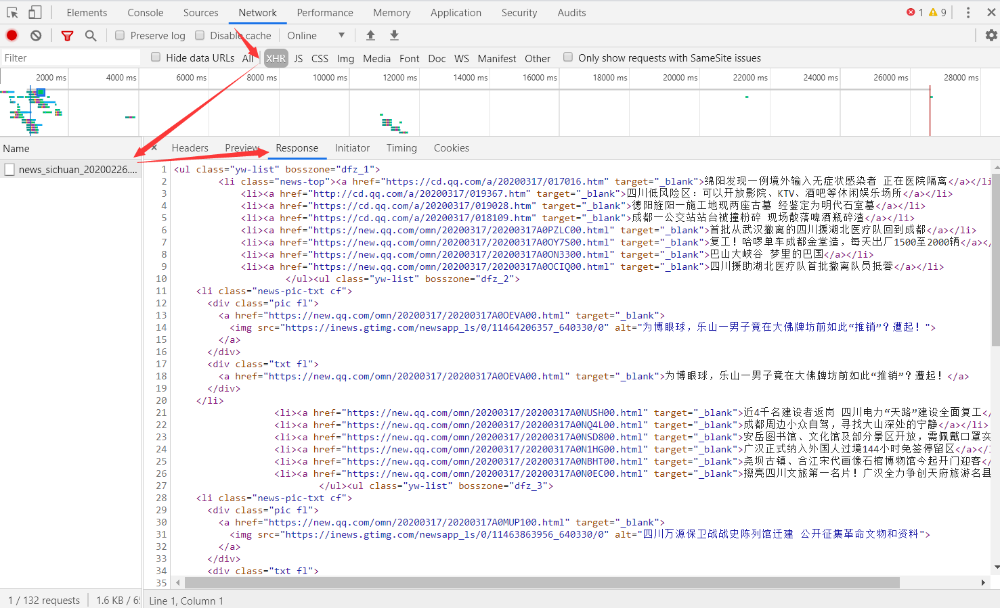
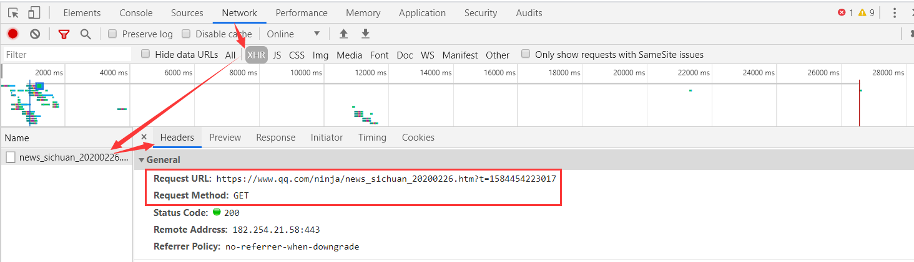

# Ajax异步请求

目前我们已经能够爬取并保存一些网页的数据了，但并不是每个网页都能乖乖“束手就擒”将网页的数据直接给你，**有一部分网页，它会将数据展示在网页上，但在网页的源代码中却找不到数据的影子，原因就在于这部分网页使用了Ajax技术。**

### Ajax简介

##### Ajax技术

​	Ajax 技术：**即异步的 JavaScript 和 XML ，是利用 JavaScript 在保证页面不被刷新、页面链接不改变的情况下与服务器交换数据并更新部分网页的技术。**

##### Ajax工作流程

​	Ajax 工作流程：**原始的页面最初不会包含某些数据，原始页面加载完后，会再向服务器请求某个接口获取数据，然后数据才被处理从而呈现到网页上，这其实就是发送了一个 Ajax 请求**。

​	简单地说，在不需要重新刷新页面的情况下，Ajax 通过异步请求加载后台数据，并在网页上呈现出来（网页局部刷新技术）。

##### 发展趋势

​	Ajax目的：用较少网络数据的传输量，提高用户体验。

​	Ajax应用场景：网购购物车，在编辑购买商品数时，支付总金额也在不断改变，而网页并没有全部刷新。

​	照Web 发展的趋势来看，这种形式的页面越来越多。**网页的原始 HTML 文档不会包含任何数据，数据都是通过Ajax加载后再呈现出来的，这样在 Web 开发上可以做到前后端分离，而且降低服务器直接渲染页面带来的压力。**

### 破解Ajax

##### 查看Ajax请求

1. 打开拥有局部刷新网页的功能
2. 按F12打开“开发者工具”
3. **点击’Network‘选项卡（刷新一下页面，查看浏览器和服务器所有的请求和响应）**
4. **在点击’XHR‘选项卡（Ajax的核心是XMLHttpRequest对象(简称XHR)）**
5. **点击文件中的Headers选项，其中 Request Headers 的一个信息为 `X-Requested-With:XMLHttpRequest` ，这就标记了此请求是 Ajax 请求。**
6. **再点击Response选项，这里就显示了文件通过Ajax请求的内容。**




##### 模拟 Ajax 请求

​	直接利用 requests 等库来抓取原始页面，是无法获取到有效数据的，这时需要**分析网页后台向接口发送的 Ajax 请求，再利用 requests 来模拟 Ajax 请求，那么就可以成功抓取了**。



```python
import requests
from fake_useragent import UserAgent

# 构造随机请求头
headers = {'User-Agent':UserAgent().random}
# Ajax请求的接口
url = 'https://www.qq.com/ninja/news_sichuan_20200226.htm?t=1584454223017'
# 发送GET请求
response = requests.get(url=url,headers=headers)
# 编码为GBK
response.encoding = 'GBK'

print(response)
print(response.text)

'''
输出：
<Response [200]>

<li><a href="https://new.qq.com/omn/20200317/20200317A0MFD200.html" target="_blank">刚刚，英雄凯旋！再看一眼“川军”战斗过的方舱医院</a></li>
<li><a href="https://new.qq.com/omn/20200317/20200317A0MF7M00.html" target="_blank">成都持枪斗殴案引出“GMI”传销大案 被打者是骨干人员</a></li>
<li><a href="https://new.qq.com/omn/20200317/20200317A0M4G000.html" target="_blank">四川日报整版刊发：春望甘孜 奏响奋发追赶动人乐章</a></li>...
'''
```

##### 爬取数据

上面我们已经拿到了模拟 Ajax 请求后返回的数据，接下来我们就可以用正则来采集里面的数据了。

```python
import re
import requests
from fake_useragent import UserAgent

headers = {'User-Agent':UserAgent().random}
url = 'https://www.qq.com/ninja/news_sichuan_20200226.htm?t=1584454223017'
response = requests.get(url=url,headers=headers)
response.encoding = 'GBK'

# 获取标题
title = re.findall(r'<a.*?>(.*?)</', response.text)
print(title)

# 获取链接
href = re.findall(r'<a.*?href="(.*?)"', response.text)
print(href)

'''
# 输出的标题：
['刚刚，英雄凯旋！再看一眼“川军”战斗过的方舱医院', '成都持枪斗殴案引出“GMI”传销大案 被打者是骨干人员', '四川日报整版刊发：春望甘孜 奏响奋发追赶动人乐章'...']

# 输出的链接：
['https://new.qq.com/omn/20200317/20200317A0MFD200.html', 'https://new.qq.com/omn/20200317/20200317A0MF7M00.html', 'https://new.qq.com/omn/20200317/20200317A0M4G000.html',
...']
'''
```

