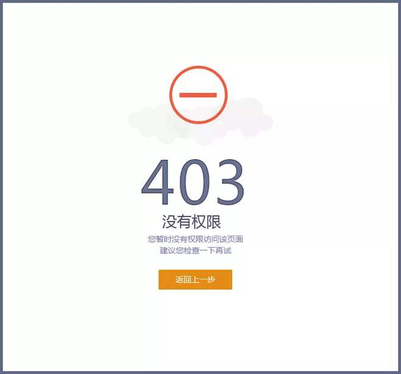
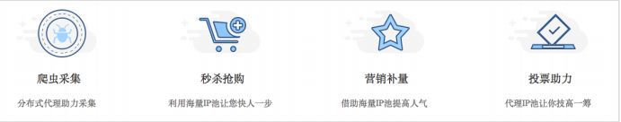

# Ajax请求与代理IP

目前我们已经能够爬取并保存一些网页的数据了，但并不是每个网页都能乖乖“束手就擒”将网页的数据直接给你，**有一部分网页，它会将数据展示在网页上，但在网页的源代码中却找不到数据的影子，原因就在于这部分网页使用了Ajax技术。**

## Ajax异步请求

Ajax技术：**即异步的 JavaScript 和 XML ，是利用 JavaScript 在保证页面不被刷新、页面链接不改变的情况下与服务器交换数据并更新部分网页的技术。**

Ajax工作流程：**原始的页面最初不会包含某些数据，原始页面加载完后，会再向服务器请求某个接口获取数据，然后数据才被处理从而呈现到网页上，这其实就是发送了一个 Ajax 请求**。

Ajax目的：用较少网络数据的传输量，提高用户体验。

Ajax应用场景：在网页上输入需要翻译的短文，输入过程中翻译的结果不断变化，而网页并没有全部刷新。

**简单地说，Ajax在不需要重新刷新页面的情况下通过异步请求加载后台数据，并在网页上呈现出来（网页局部刷新技术）。**

照Web 发展的趋势来看，这种形式的页面越来越多。**网页的原始 HTML 文档不会包含任何数据，数据都是通过Ajax加载后再呈现出来的，这样在 Web 开发上可以做到前后端分离，而且降低服务器直接渲染页面带来的压力。**

### 查看Ajax请求

1. 打开拥有局部刷新网页的功能
2. 按F12打开“开发者工具”
3. **点击’Network‘选项卡（刷新一下页面，查看浏览器和服务器所有的请求和响应）**
4. **在点击’XHR‘选项卡（Ajax的核心是XMLHttpRequest对象(简称XHR)）**
5. **点击文件中的Headers选项，其中 Request Headers 的一个信息为 `X-Requested-With:XMLHttpRequest` ，这就标记了此请求是 Ajax 请求。**
6. **再点击Response选项，这里就显示了文件通过Ajax请求的内容。**


### 模拟Ajax请求

直接利用 requests 等库来抓取原始页面，是无法获取到有效数据的，这时需要**分析网页后台向哪个接口发送的 Ajax 请求，再利用 requests 来模拟 Ajax 请求，那么就可以成功抓取了**。


```python
import requests
from fake_useragent import UserAgent

# 构造随机请求头
headers = {'User-Agent':UserAgent().random}
# Ajax请求的接口
url = 'https://www.qq.com/ninja/news_sichuan_20200226.htm?t=1584454223017'
# 发送GET请求
response = requests.get(url=url,headers=headers)
# 编码为GBK
response.encoding = 'GBK'
# 响应内容
print(response.text)

# 获取标题
title = re.findall(r'<a.*?>(.*?)</', response.text)
print(title)

# 获取链接
href = re.findall(r'<a.*?href="(.*?)"', response.text)
print(href)

'''
输出的响应：
<li><a href="https://new.qq.com/omn/20200317/20200317A0MFD200.html" target="_blank">刚刚，英雄凯旋！再看一眼“川军”战斗过的方舱医院</a></li>
<li><a href="https://new.qq.com/omn/20200317/20200317A0MF7M00.html" target="_blank">成都持枪斗殴案引出“GMI”传销大案 被打者是骨干人员</a></li>
<li><a href="https://new.qq.com/omn/20200317/20200317A0M4G000.html" target="_blank">四川日报整版刊发：春望甘孜 奏响奋发追赶动人乐章</a></li>...

输出的标题：
['刚刚，英雄凯旋！再看一眼“川军”战斗过的方舱医院', '成都持枪斗殴案引出“GMI”传销大案 被打者是骨干人员', '四川日报整版刊发：春望甘孜 奏响奋发追赶动人乐章'...']

输出的链接：
['https://new.qq.com/omn/20200317/20200317A0MFD200.html', 'https://new.qq.com/omn/20200317/20200317A0MF7M00.html', 'https://new.qq.com/omn/20200317/20200317A0M4G000.html',
...']
'''
```

## 代理IP

打个比方，商场搞活动，一张券换一桶油，但是一个人只能换一次。A有两张券，A去换了一桶油，假如A第二次去换油必然遭到拒绝，这时A找到了B，把券给了B，让B去换油回来给A，这样A就换到了两桶油，B就可以说是A的代理。简单说，**代理就是代替他人完成某项任务**。

在最开始讲爬虫请求头的时候就提到User-Agent是最重要的参数，这是因为许多服务器都会检测请求头的User-Agent参数是否是浏览器，因此我们要尽量将爬虫伪装成正常的用户使用浏览器来请求访问，来避免服务器的检测反爬。

虽然我们尽力的将爬虫伪装成用户使用浏览器在浏览页面，**但因为爬虫要不断的采集网页，因此爬虫向服务器发送请求的频率也会大大高于真实普通用户请求的频率**，当网站服务器检测到这些访问来自同一IP时，服务器会在**一段时间内拒绝来自该IP的请求服务**，并返回一些错误信息（`403状态码 Forbidden`）。这种情况就称为**封IP**，于是乎网站就成功把我们的爬虫禁掉了。



针对这种反爬措施，**最直接的就是： 延迟 `time.sleep(时间)`，降低网站的访问频率。**但如果我们需要快速的爬取数据，又担心爬虫被封禁，那该怎么办呢？

试想一下，**既然服务器通过IP来封禁爬虫，那我们就多准备几个IP来伪装爬虫，让服务器认为是由多台机器发起的请求**，这样不就可以成功防止封IP了吗，这时**代理IP的作用**就显现了出来。

### 代理IP说明

**代理IP组成**：`IP地址:端口号`，例如`121.237.149.249:3000`

IP是网络中唯一的身份凭证，而**代理IP就是我们上网过程中的一个中间平台，是由你的电脑先访问代理IP，之后再由代理IP访问你点开的页面，所以在这个页面的访问记录里留下的是就是代理IP的地址，而不是你的电脑本机IP**。

主要的功能之一：**提高下载速度，突破限制。**例如有些网站提供的下载资源，做了一个IP一个线程的限制，这时候就可以使用代理IP突破下载限制。



### 代理IP分类

根据匿名分为两类：普通匿名代理、高度匿名代理。

**普通匿名代理**：代理服务器通常会加http头 `HTTP_VIA HTTP_X_FORWARD_FOR`，可能能查到客户端的IP。

**高度匿名代理**：会将数据包原封不动转发，服务端记录的是代理服务器的ip。

根据费用分为两类：免费代理、付费代理。

**免费代理**：免费，可用IP数量少，IP可用率低(大家都在用)，IP访问慢、不稳定。

**付费代理**：付费，可用IP数量多(和付费价格有关)，IP可用率高。(**强烈建议在商用项目中使用付费代理**)


### 获取代理IP

**网站获取**：获取免费代理IP，比如[西刺免费代理IP](http://www.xicidaili.com/) ，但是这些免费代理大多数情况下都是不好用的，**所以比较靠谱的方法是购买付费代理，付费代理在很多网站都有售卖，数量不用太多，稳定、可用即可。**

**软件获取**：相关代理软件的话，比如[芝麻代理](http://www.zhimaruanjian.com/)，一般会在本机创建 HTTP或SOCKS 代理服务。若软件在本地 9743 端口上创建 HTTP 代理服务，即代理为 `127.0.0.1:9743`，只要设置了这个代理，就可以成功将本机IP切换到代理软件连接的服务器的IP了。

### 设置代理

在 `requests` 中代理的设置很简单，只需要构造代理字典，然后通过 `proxies` 参数即可，**其运行结果的叫 `origin` 也是代理的 IP，这证明代理已经设置成功**。

```python
import requests

# 软件在本地9743端口上创建HTTP代理服务，即代理为127.0.0.1:9743
proxy = '127.0.0.1:9743'
# 构造字典，'http'、'https'
proxies = {
    'http': 'http://' + proxy,
    'https': 'https://' + proxy,
}
response = requests.get('http://httpbin.org/get', proxies=proxies)
print(response.text)


'''
结果：
{
  "args": {}, 
  "headers": {
    "Accept": "text/html,application/xhtml+xml,application/xml;q=0.9,image/webp,image/apng,*/*;q=0.8", 
    "Accept-Encoding": "gzip, deflate", 
    "Accept-Language": "zh-CN,zh;q=0.9", 
    "Connection": "close", 
    "Host": "httpbin.org", 
    "Upgrade-Insecure-Requests": "1", 
    "User-Agent": "Mozilla/5.0 (Windows NT 6.3; WOW64) AppleWebKit/537.36 (KHTML, like Gecko) Chrome/63.0.3239.132 Safari/537.36"
  }, 
  # 这里的IP就是代理IP，非本机IP。
  "origin": "117.139.208.10", 
  "url": "http://httpbin.org/get"
}
'''
```

同样的我们也可以在我们的会话当中设置代理IP：

```python
# 更换代理IP
class sessions(requests.Session):
    # 继承并添加新的属性
    def __init__(self):
        super().__init__()
        self.re_ip = {}

    # 调用该请求方法更换代理IP
    def ip_proxies(self):
        try:
            response = requests.get(url="代理IP的url", timeout=(30, 30))
            if response.status_code == 200:
                proxies_list = re.findall(r"'http':'(.*?)'", response.text)
                proxies_random = random.choice(proxies_list)
                # 例如的代理IP：{'http': 'http://113.194.141.162:8085', 'https': 'https://113.194.141.162:8085'}
                self.re_ip = {'http': 'http://' + proxies_random, 'https': 'https://' + proxies_random}
        except Exception as e:
            print(f'更换代理出错：{e}')

    # 当上面方法被调用一次后，更换代理IP
    def request(self, *args, **kwargs):
        kwargs.setdefault('proxies', self.re_ip)
        return super(sessions, self).request(*args, **kwargs)
```

### 代理池

利用代理IP可以解决目标网站封 IP 的问题。**但代理不论是免费的还是付费的，都不能保证都是可用的，因为可能 IP 被其他人使用来爬取同样的目标站点而被封禁，或者代理服务器突然发生故障或网络繁忙旦我们选用了一个不可用的代理，这势必会影响爬虫的工作效率。**所以，需要提前筛选，将不可用的代理剔除掉，保留可用代理，搭建一个高效易用的代理池。**简单说，代理池就是有效代理的集合。**

获取模块： **需要定时在各大代理网站抓取代理**。

检测模块： **需要定时检测数据库中的代理**。

存储模块： **负责存储抓取下来的代理**。

接口模块： **需要用 API 来提供对外服务的接口**。

**处理流程**：将代理池运行起来，在各大代理网站抓取代理，可用代理设置为100，不可用代理分数减1。本机的代理池配置运行在5555端口，浏览器访问http://127.0.0.1:5555/random ，即可获取随机一个可用代理。我们只需要访问此接口即可获取一个随机可用代理。

详情参考：[IP代理池](https://blog.csdn.net/HYdongdong2063/article/details/91867296)

```python
import requests

# 获取代理IP的接口
PROXY_POOL_URL = 'http://127.0.0.1:5555/random'
# 访问'http://127.0.0.1:5555/random'接口从代理池获取随机可用代理
def get_proxy():
    try:
        response = requests.get(PROXY_POOL_URL)
        if response.status_code == 200:
        	# 返回随机代理IP
            return response.text
    except ConnectionError:
        return None

# 使用get_proxy()方法获取一个随机代理
proxy = get_proxy()
proxies = {
    'http': 'http://' + proxy,
    'https': 'https://' + proxy,
}
# 使用代理IP打开http://httpbin.org/get测试连接，输出结果
try:
    response = requests.get('http://httpbin.org/get', proxies=proxies)
    print(response.text)
except requests.exceptions.ConnectionError as e:
    print('Error', e.args)

# 多次访问代理池接口
print(get_proxy())
print(get_proxy())
print(get_proxy())

'''
结果：
{
  "args": {}, 
  "headers": {
    "Accept": "*/*", 
    "Accept-Encoding": "gzip, deflate", 
    "Connection": "close", 
    "Host": "httpbin.org", 
    "User-Agent": "python-requests/2.19.1"
  }, 
  "origin": "46.173.191.51", 
  "url": "http://httpbin.org/get"
}
# 当中origin字段就是代理ip，每次访问代理池接口都会返回不同的代理IP。
185.136.158.7:1080
189.195.162.222:53281
195.238.85.215:50948
'''
```
