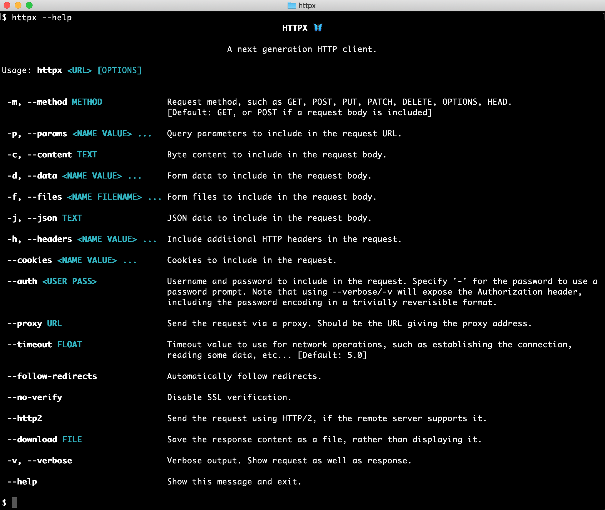
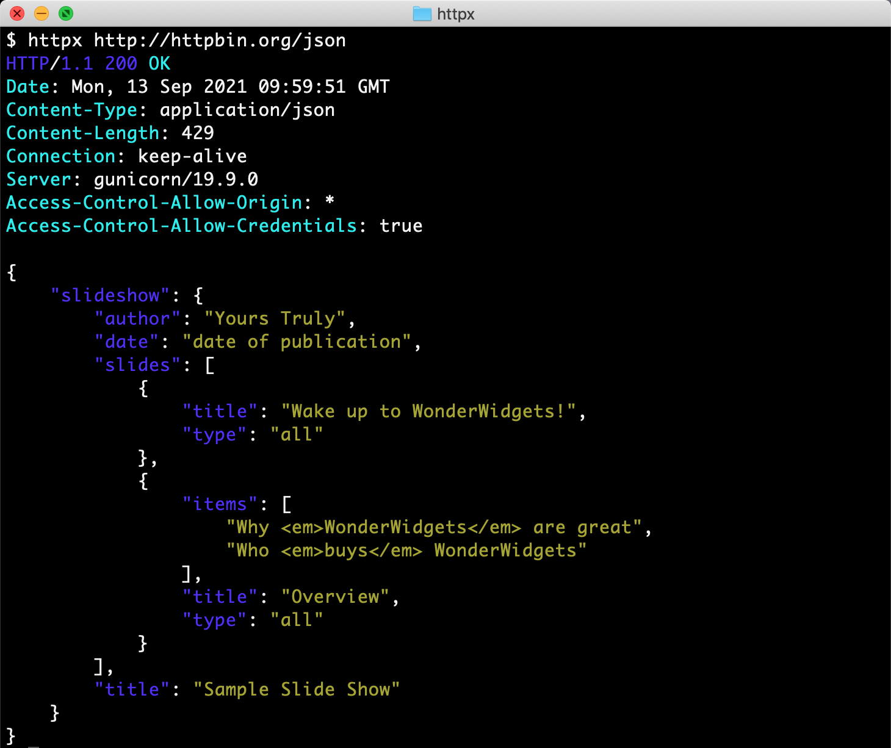

# Httpx库

前面我们学习了requests库，这是写爬虫最简单、最易用的第三方库，虽然使用requests库可以爬取绝大部分网站，但它也不是万能的，它也有自己的局限，例如：不支持HTTP2.0、只能同步请求（也就是第一个请求返回响应后才会去进行第二个请求）效率不高。

因此我们有必要多掌握一个写爬虫的库，毕竟没有万能的工具，那就只有成为会多种工具的人，让自己万能。接下来要介绍的第三库就是：Httpx库。

Httpx库官方文档：https://www.python-httpx.org/

## 初识Httpx库

HTTPX是Python3的一个功能齐全的HTTP第三方库，它提供同步和异步API，并支持HTTP/1.1和HTTP/2。

### 安装Httpx

安装Httpx需要在Python3.6+的环境里面：

```
# 只安装包含基本功能的httpx库
pip install httpx

# 安装httpx库附带支持http2功能
pip install httpx[http2]

# 安装httpx库附带支持brotli解码器功能
pip install httpx[brotli]

# 安装httpx库附带可视化的命令行界面功能
pip install httpx[cli]
```





### 依赖关系

HTTPX项目依赖于这些优秀的库：

- httpcore—httpx的底层传输实现。
- h11-HTTP/1.1支持。
- h2-HTTP/2支持。（可选，带有httpx[http2]）
- certifi-SSL证书。
- 字符集\规格化器-字符集自动检测。
- rfc3986-URL解析和规范化。
- idna-国际化域名支持。
- sniffio-异步库自动检测。
- 命令行客户端支持。（可选，带有httpx[cli]）
- brotli或brotlicffi-解码“brotli”压缩响应。（可选，带有httpx[brotli]）
- async_generator-对contextlib.asynccontextmanager的后端口支持。（仅Python3.6需要）

这项工作的大部分内容都是基于对API布局的请求，以及urllib3对底层网络细节的大量设计灵感。

## 常规使用

**httpx库的使用方式和requests库的使用方式大同小异，可以说是几乎一样。**

### 多类型请求

使用httpx库实现HTTP多种请求类型的发送：

```python
import httpx

# get请求
httpx.get('https://httpbin.org/get')
# post请求
httpx.post('https://httpbin.org/post', data={'key': 'value'})
# put请求
httpx.put('https://httpbin.org/put', data={'key': 'value'})
# delete请求
httpx.delete('https://httpbin.org/delete')
# head请求
httpx.head('https://httpbin.org/get')
# options请求
httpx.options('https://httpbin.org/get')
```

### 请求头Cookie

```python
import httpx
# 请求头
headers = {'user-agent': 'my-app/0.0.1'}
r = httpx.get('https://httpbin.org/headers', headers=headers)
```

### 添加Cookie

```python
# URL中设置Cookie
r = httpx.get('https://httpbin.org/cookies/set?chocolate=chip')
# 输出Cookie
print(r.cookies['chocolate'])  # chip

# 手动添加Cookies
cookies = {"peanut": "butter"}
r = httpx.get('https://httpbin.org/headers', headers=headers, cookies=cookies)

# Cookie在Cookie实例中返回，该实例是一个类似dict的数据结构，带有额外的API，用于按域或路径访问Cookie。
cookies = httpx.Cookies()
cookies.set('cookie_on_domain', 'hello, there!', domain='httpbin.org')
cookies.set('cookie_off_domain', 'nope.', domain='example.org')
r1 = httpx.get('http://httpbin.org/cookies', cookies=cookies)
r2 = httpx.get('http://example.org/cookies', cookies=cookies)
print(r1.json())  # {'cookies': {'cookie_on_domain': 'hello, there!'}}
print(r2.json())  # {'cookies': {'cookie_off_domain': 'nope.'}}
```

### 构建URL参数

```python
import httpx

# 使用params关键字，通过字典构建URL参数
params1 = {'key1': 'value1', 'key2': 'value2'}
# 还可以使用列表list构建URL参数
params2 = {'key1': 'value1', 'key2': ['value2', 'value3']}

r1 = httpx.get('https://httpbin.org/get', params=params1)
r2 = httpx.get('https://httpbin.org/get', params=params2)

# 输出构建后的URL
print(r1.url)  # 'https://httpbin.org/get?key1=value1&key2=value2'
print(r2.url)  # 'https://httpbin.org/get?key1=value1&key2=value2&key2=value3'
```

### 传递POST参数

```python
data1 = {'key1': 'value1', 'key2': 'value2'}
data2 = {'key1': ['value1', 'value2']}
r1 = httpx.post("https://httpbin.org/post", data=data1)
r2 = httpx.post("https://httpbin.org/post", data=data2)
print(r1.text)
print(r2.text)
'''
结果1：
  "form": {
    "key1": "value1",
    "key2": "value2"
  }
结果2：
  "form": {
    "key1": [
      "value1",
      "value2"
    ]
  }
'''

data = {'integer': 123, 'boolean': True, 'list': ['a', 'b', 'c']}
r = httpx.post("https://httpbin.org/post", json=data)
print(r.text)
'''
  "json": {
    "boolean": true,
    "integer": 123,
    "list": [
      "a",
      "b",
      "c"
    ]
  }
'''

content = b'Hello, world'
r = httpx.post("https://httpbin.org/post", content=content)
'''
"data": "Hello, world"
'''
```

### 响应属性

```python
import httpx

r = httpx.get('https://www.example.org/')

# 输出解码响应的编码
print(r.encoding)  # UTF-8（默认编码）

# 指定解码响应的编码
r.encoding = 'ISO-8859-1'

# 状态码
print(r.status_code)  # 200

# 输出响应头
print(r.headers)  # {'content-encoding': 'gzip','transfer-encoding': 'chunked'...}
print(r.headers['Content-Type'])  # 'application/json'
print(r.headers.get('content-type'))  # 'application/json'

# 输出服务器使用了哪个版本的HTTP协议
print(response.http_version)  # "HTTP/1.0" or "HTTP/1.1" or "HTTP/2"

# 输出响应的字符串文本
print(r.text)  # '<!doctype html>\n<html>\n<head>\n<title>Example Domain</title>...'

# 输出响应的字节编码
print(r.content)  # b'<!doctype html>\n<html>\n<head>\n<title>Example Domain</title>...'

# 输出响应的json格式
r = httpx.get('https://api.github.com/events')
print(r.json())  # [{u'repository': {u'open_issues': 0...}}]

# 输出访问历史
print(r.history)
```

### 设置超时

**默认情况下，httpx超时时间为5秒，这点与requests不一样，requests是发送请求后只要没有接受到响应都会一直挂起。**

```python
# 设置超时时间为0.001秒
httpx.get('https://github.com/', timeout=0.001)

# 设置超时为空None，即没有超时时间
httpx.get('https://github.com/', timeout=None)
```

### 追踪重定向

**默认情况下，httpx是不会自动重定向的，这点与requests不一样，requests是会自动重定向。**

```python
# 举个例子，GitHub会将所有的HTTP请求重定向为HTTPS
r = httpx.get('http://github.com/')
print(r.status_code)  # 301
print(r.history)  # []
# 重定向后的链接
print(r.next_request)  # <Request('GET', 'https://github.com/')>
```

你可以设置 `follow_redirects` 为 `True` 让httpx能自动重定向。

```python
# 设置为允许重定向
r = httpx.get('http://github.com/', follow_redirects=True)
print(r.url) # https://github.com/
print(r.status_code)  # 200
print(r.history)  # [<Response [301 Moved Permanently]>]
```

### 简单爬取资源

要从请求返回的二进制数据创建图像，可以使用以下代码：

```python
import httpx
from PIL import Image
from io import BytesIO

r = httpx.get('...')

# 输出响应的字节编码
print(r.content)
# 保存为图片
i = Image.open(BytesIO(r.content))
```

### 身份认证

HTTPX支持基本和摘要HTTP身份验证。需要要提供基本身份验证凭据，请将两元组的纯文本str或字节对象作为auth参数传递给请求函数：

```python
httpx.get("https://example.com", auth=("my_user", "password123"))
```

要为摘要身份验证提供凭据，您需要使用明文用户名和密码作为参数实例化一个DigestAuth对象。然后可以将此对象作为auth参数传递给请求方法，如下所示：

```python
auth = httpx.DigestAuth("my_user", "password123")
httpx.get("https://example.com", auth=auth)
```

### SSL证书认证

**同样的，使用httpx库在爬取这些网站时，也会进行一个SSL证书验证的过程，和requests库一样，httpx库也有一个 `verify` 参数来控制证书验证。**

```python
import httpx

# verify=False关闭SSL证书验证，follow_redirects=True设置自动重定向
response = httpx.get('https://inv-veri.chinatax.gov.cn/', verify=False, follow_redirects=True)
print(response.status_code)

```

### HTTP2爬虫

前面讲过requests库不支持http2.0，而httpx库支持。因此这里就轮到httpx大显身手了。

首先安装可以选用http2.0的httpx库：

```
pip install httpx[http2]
```

通过实例化启功支持http2的客户端：

```python
client = httpx.Client(http2=True)
```

启动后，就可以开始爬取数据了。例如下面的这道题的名称为：天杀的http2.0（提示本题采用的http2.0），题目地址：https://match.yuanrenxue.com/match/17，爬虫代码如下：

```python
import re
import httpx

# 启动支持http2的client
client = httpx.Client(http2=True)

# 请求头
headers = {
    'accept': 'application/json, text/javascript, */*; q=0.01',
    'accept-encoding': 'gzip, deflate, br',
    'accept-language': 'zh-CN,zh;q=0.9',
    'cookie': '自己当前的cookie',
    'referer': 'https://match.yuanrenxue.com/match/17',
    'sec-ch-ua': '"Google Chrome";v="94", " Not;A Brand";v="99", "Chromium";v="99"',
    'sec-ch-ua-mobile': '?0',
    'sec-ch-ua-platform': '"Windows"',
    'sec-fetch-dest': 'empty',
    'sec-fetch-mode': 'cors',
    'sec-fetch-site': 'same-origin',
    'user-agent': 'yuanrenxue.project',
    'x-requested-with': 'XMLHttpRequest'
}

# 数值
values = 0

# 共5页数据
for page in range(1, 6):
    # 接口地址
    url = f'https://match.yuanrenxue.com/api/match/17?page={page}'
    print(url)
    # 输出响应
    response = client.get(url=url, headers=headers)
    print(response.http_version)
    print(f'第{page}页:{response.text}')
    for v in re.findall(r'{"value": (-?\d+)}', response.text):
        values += int(v)

# 总值
print(values)
```

?> 请求和响应通过HTTP/2传输，意味着客户机和服务器都需要支持HTTP/2。如果连接到仅支持HTTP/1.1的服务器，则客户端将使用标准HTTP/1.1连接。
