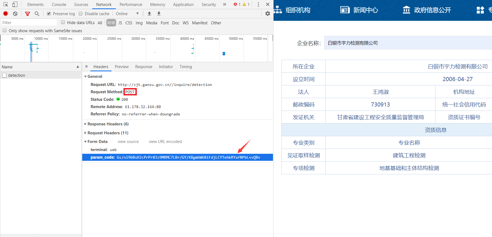
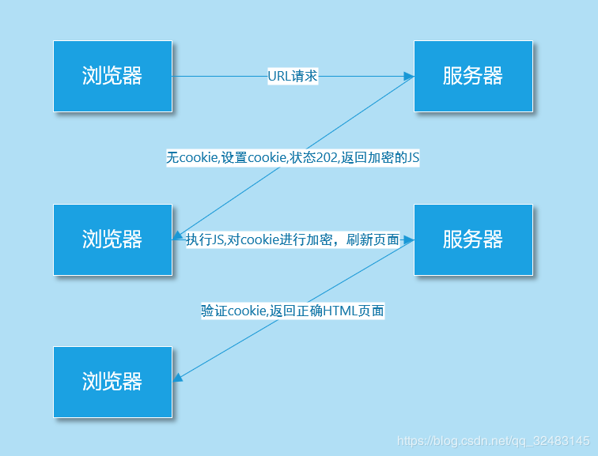
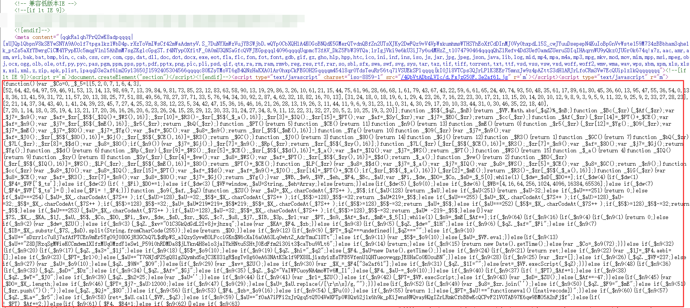
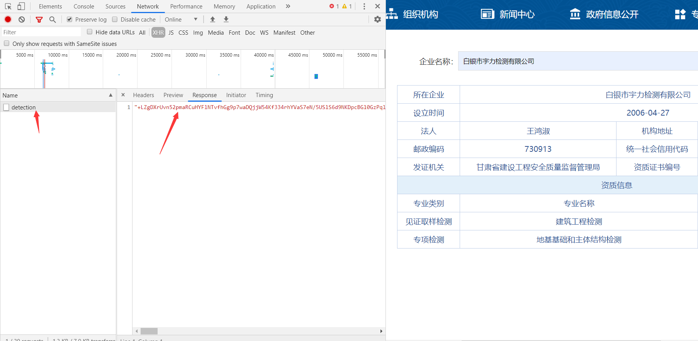
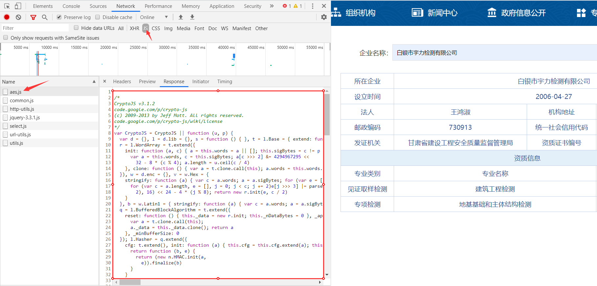
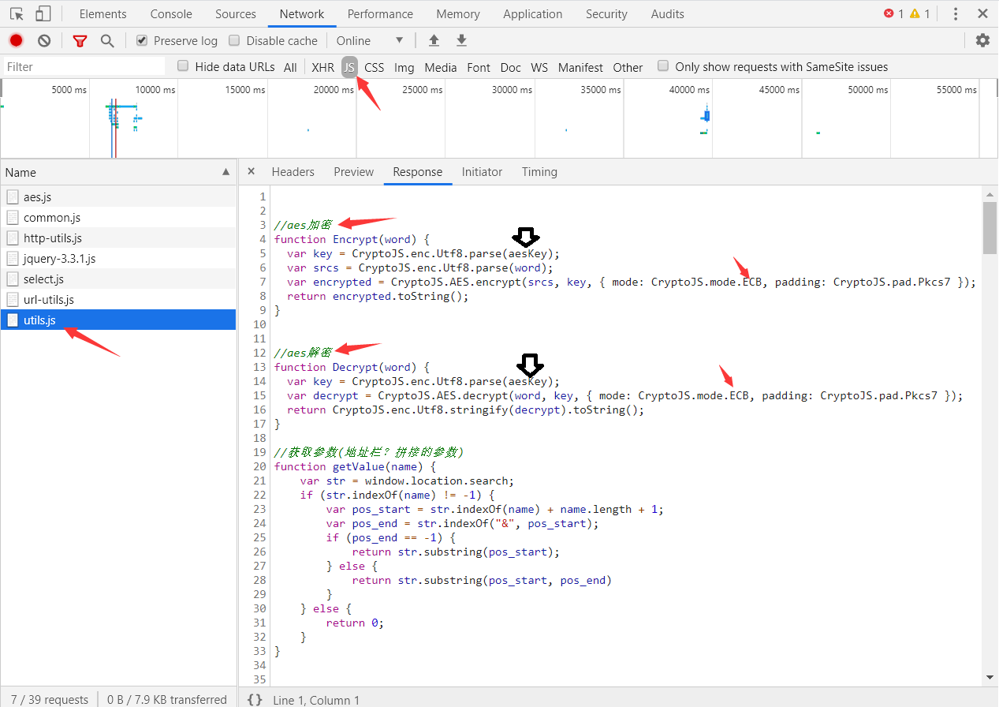
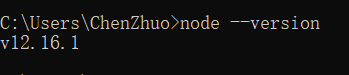

# JS加密

目前，我们已经能爬取普通网页和含有Ajax网页的数据了，但这两类网页并不能代表所有的网页，还有一类网页就不是很好“对付”了，那个就是含有Js加密的网页了。

### 了解Js

##### Js简介

**Js：全称 JavaScript，是一种运行在浏览器里面的前端语言。**

JavaScript 名称中虽然含有 Java，但和 Java 的关系类似于“北大”和“北大青鸟”，没有半毛关系。

##### Js作用

JavaScript作用：及时响应用户的操作，实现网页特效，增加网页互动性。

JavaScript应用场景：鼠标滑过弹出下拉菜单、新闻图片的轮换等。

### Js加密反爬

##### Js反爬原理

**Js可以对一些前端参数进行加密**，以便服务器后台便于验证。如对用户名和密码进行加密，后端可以判断是否是正确的请求还是恶意的攻击。

**普通的爬虫只是负责拿着你给的URL传递一些参数来获取网页源码，它们不能运行Js，也就无法对服务器需要验证的参数进行加密，从而导致服务器拒绝你的请求，给你返回一个不是你所期望的网页内容的页面，Js也就完成了一次反爬。**

上面提到 JS是运行在浏览器里面的，**也就是说加密的过程一定是在浏览器完成，也就是一定会把JS代码暴露给使用者，这样我们就能知道加密的算法和步骤，从而进行逆向解密。**

**常见的加密算法**：MD5加密（**不可逆**，生成32位字符串）、Base64编码（**可逆**）、DES加密（**可逆**）、AES加密（**可逆**）。

##### POST加密

**Js加密一般是在请求头或者请求参数中加入加密字段，即加密大多出现在POST表单提交过程中。**



##### Cookie加密

Js不仅可以加密POST表单提交的参数，还可以加密Cookie。**通过加密后的Cookie，服务器可以识别是浏览器正确的请求，还是使用诸如Httpclient等框架在爬取网页内容了，所以就可以防止别人爬取网站里面的内容。**



##### 混淆加密

上面讲过，**Js加密的过程一定是在浏览器完成，也就是一定会把Js代码暴露给使用者，但是有的公司，为了防止Js加密的代码被他人使用或分析，还会对Js进行混淆加密，让Js的代码阅读性很差，来达到代码保护的目的。**



### 破解Js加密

面对Js反爬，爬虫就认输了吗？NO！有爬虫，就有反爬虫，后面又会有反反爬虫技术。。。

到这一步，大家就能感觉到，**爬虫技术开始向着技术对抗性发展了**。

##### 破解方法

方法一：把Js代码翻译成Python代码。这个是有难度的，因为爬虫偏向于后端的处理，Js属于前端，需要精通前端才行，还有一点就是经过加密，混要，压缩的js代码阅读性很差。(技术要求高，不建议)

方法二： 执行js代码。使用Python的一些第三方库比如 pyv8库、execjs库去执行js代码。(建议)

方法三：使用selenium或者appiun等框架，驱动浏览器抓取数据，无视js加密。(效率低，稳定性差，不是很建议)

##### 破解准备工作

破解前，我们需要对一些破解过程中可能碰到的英文词组加深印象：

```
crypto：密码
Encrypt：加密
Decrypt：解密
MD5：MD5加密
Base64：Base64编码
DES：DES加密
AES：AES加密
```

很多Js加密文件，就可能以这些词组来命名。例如：

前端引入 `crypto.js` 进行加密，它相当于引入了所有的加密方式，可以使用里面任意的加密方式。

前端引入 `aes.js` 进行加密，它相当于引入了AES加密方式。

##### 破解POST加密

下方的**POST提交的参数**和**Response响应的内容**都不具有可读性，很明显被加密了，加密方式暂时还不能确定。




通过查看JS一栏，看到一个名称很熟悉的文件 `aes.js`，查看文件内容，就是Js编写的AES加密方法，**也就基本可以判定该网站引用了AES加密，不然引用这个Js加密文件干嘛呢。**



**AES是对称加密算法，接下来就要确定该算法的加密模式，在 `utils.js` 文件中我们找到了答案，当中 `CryptoJS.mode.ECB` 代码确定了加密模式位ECB加密模式。**

?> 不了解加密模式的查看[爬虫06-数据加密解密](爬虫06-数据加密解密.md)。



**因为对称算法的特性，加密和解密使用是同一密匙，自热而然就理解 `aesKey` 是接受密匙的变量。**

同在在浏览器中打断点调试的方式，获得该密匙为：``。


##### 执行Js代码方法

执行js代码，需要一个能执行Js的环境，推荐安装 [**Node.js**](https://nodejs.org/en/download/)，**一个基于 Chrome V8 引擎的 JavaScript 运行环境**。

解压下载的文件，拷贝解压路径，添加到环境变量。命令行中输入：`node --version` ，检查Node.js版本。



接下来我们安装一个第三方库**PyExecJS**：

```
pip install -i https://pypi.douban.com/simple PyExecJS
```

**PyExecJS 是一个可以使用 Python 来模拟运行 JavaScript 的库。**大家可能听说过 PyV8，它也是用来模拟执行 JavaScript 的库，可是由于这个项目已经不维护了，而且对 Python3 的支持不好，而且安装出现各种问题，所以这里选用了 PyExecJS 库。

运行代码检查一下运行环境：

```python
# 注意：在导入的时候是execjs不是PyExecJS
import execjs
print(execjs.get().name)

'''
# 解释：js运行环境为Node.js
Node.js (V8)
'''
```

未完待续。。。

##### Selenium方法

**Selenium：基于浏览器自动化测试框架，可以驱动本地的谷歌或火狐等浏览器进行操作，还可以运行加密Js**。

**注意：使用Selenium需要安装相应的软件才能配合代码驱动浏览器，在[爬虫13-Selenium自动化测试工具](/爬虫13-Selenium自动化测试工具.md)会有详细介绍。**

先用requests方法来获取来获取含有Js网页的代码，看看是什么内容：

```python
import requests
from fake_useragent import UserAgent

# 网站url
url = 'https://www.hapag-lloyd.cn/zh/home.html#hal-map'
# 请求头
headers = {'user-agent':UserAgent().random}

response = requests.get(url=url,headers=headers)
print(response.text)

'''
输出：
<!DOCTYPE html>
<html><head>
# 下面就是未加载JS的数据，从中我们获取不到任何有用的信息
...
window.kGv=!!window.kGv;try{(function(){(function LJ(){var L=!1;function z(L){for(var s=0;L--;)s+=_(document.documentElement,null);return s}function _(L,s){var z="vi";s=s||new I;return oJ(L,function(L){L.setAttribute("data-"+z,s.OS());return _(L,s)},null)}function I(){this.iz=1;this.SO=0;this.Ll=this.iz;this.SL=null;this.OS=function()
...
</html>
'''
```

requests 抓取页面得到的结果和在浏览器中看到的不一样：在浏览器中能看到的页面数据，但是在 requests 得到的结果中并没有。**这是因为 requests 获取的都是原始的 HTML 文档，而浏览器中的页面则是经过 JavaScript 处理数据后生成的结果**。

再用selenium方法来获取网页代码，看看是什么内容：

```python
import time
# 导入selenium的webdriver浏览器驱动
from selenium import webdriver

# get方法访问传入url
browser.get('https://www.hapag-lloyd.cn/zh/home.html#hal-map')

# 等待Js加载
time.sleep(2)

# page_source方法输出网页的源代码
print(browser.page_source)

# 关闭浏览器
browser.close()

'''
输出：
<!DOCTYPE html>
<html><head>
# 这里面就有我们需要的信息
...                                    
                            冷藏货物
                          </a>
                        </li>                  
                        <li class="hal-navigation-item">
                          <a href="/zh/products/cargo/dg/safety-first.html" class="hal-rtl--alt" btattached="true">                            
...
</html>
'''
```

