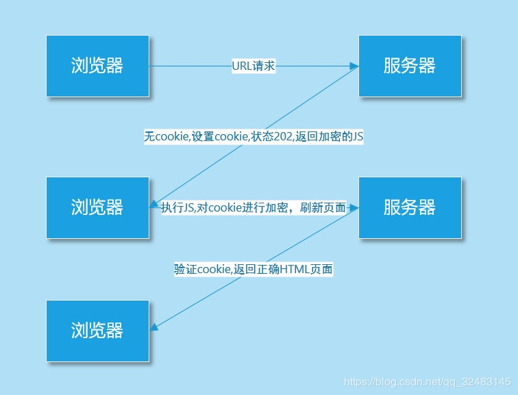
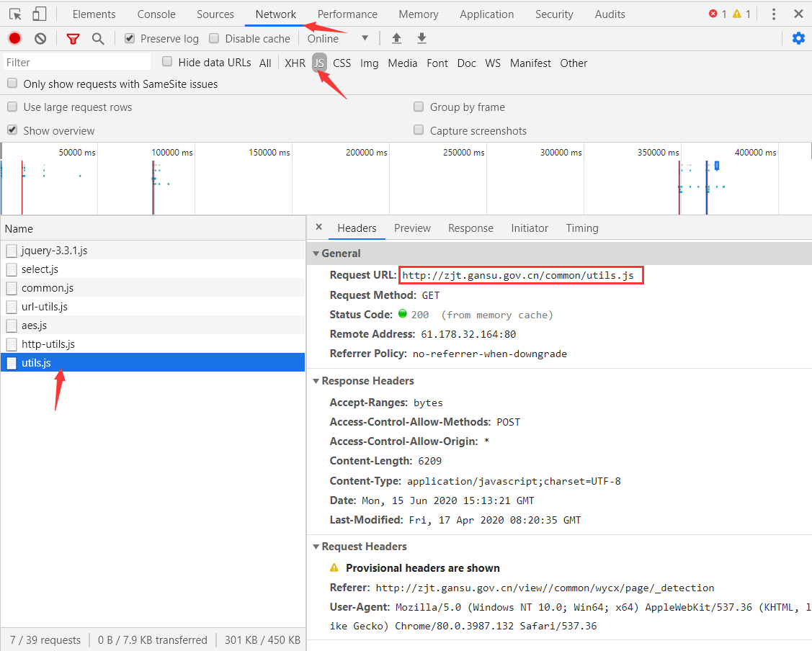

# JS加密

目前，我们已经能爬取普通网页和含有Ajax网页的数据了，但这两类网页并不能代表所有的网页，还有一类网页就不是很好“对付”了，那个就是含有JS加密的网页了。

## JS加密反爬

### JS简介

**JS：全称 JavaScript，虽然名称含有 Java，但和 Java 没有半毛关系，这是一种运行在浏览器里面的前端语言。**

JavaScript作用：及时响应用户的操作，实现网页特效，增加网页互动性。

JavaScript应用场景：鼠标滑过弹出下拉菜单、新闻图片的轮换等。

### JS反爬原理

**JS可以对前端参数进行加密，以便服务器后台便于验证。**如对用户名和密码进行加密，后端可以判断是否是正确的请求还是恶意的攻击。

**普通的爬虫只是负责拿着你给的URL传递一些参数来获取网页源码，它们不能运行JS，也就无法对服务器需要验证的参数进行加密，从而导致服务器拒绝你的请求，给你返回一个不是你所期望的网页内容的页面，JS也就起到了反爬的作用。**

### POST加密

**JS加密一般是在请求头或者请求参数中加入加密字段，即加密大多出现在POST表单提交过程中。**

**这类加密通常使用加密算法对参数或结果进行加密。**常见的加密算法：MD5加密（不可逆，生成32位字符串）、Base64编码（可逆）、DES加密（可逆）、AES加密（可逆），不仅如此有的还有自己的文件加密。


### Cookie加密

JS不仅可以加密POST表单提交的参数，还可以加密Cookie。**通过加密后的Cookie，服务器可以识别是浏览器正确的请求，还是使用诸如Httpclient等框架在爬取网页内容了，所以就可以防止别人爬取网站里面的内容。**



### 混淆加密

上面讲过，**JS加密的过程一定是在浏览器完成，也就是一定会把JS代码暴露给使用者，但是有的公司，为了防止JS加密的代码被他人使用或分析，还会对JS进行混淆加密，让JS的代码阅读性很差，来达到代码保护的目的。**


## 破解加密实战

### 破解思路

方法一：把JS代码翻译成Python代码，这个是有难度的，因为爬虫偏向于后端的处理，JS属于前端，需要精通前端才行，还有一点就是经过加密，混淆，压缩的js代码阅读性很差。(技术要求偏高)

方法二： 扣js代码，使用Python的一些第三方库比如 pyv8库、execjs库去执行js代码。(建议)

方法三：使用selenium或者appiun等框架，驱动浏览器抓取数据，无视js加密。(效率低，稳定性差，不是很建议)

### 破解AES加密

POST加密一般都会引入JS文件，如果使用的是常见的算法加密方式，就可能以下面这些词组来命名。例如：

```
crypto：密码
Encrypt：加密
Decrypt：解密
MD5：MD5加密
Base64：Base64编码
DES：DES加密
AES：AES加密
```

前端引入 `crypto.js` 进行加密，它相当于导入了所有的加密方式，可以选择性使用其中包含的加密方式。

前端引入 `aes.js` 进行加密，它相当于只导入了AES加密方式。

图中网站使用了加密算法，让**POST提交的参数**和**Response响应的内容**都不具有可读性，加密方式暂不确定。


通过查看JS一栏，看到一个名称很熟悉的文件 `aes.js`，查看文件内容，就是JS编写的AES加密方法，**也就基本可以判定该网站引用了AES加密，不然引用这个JS加密文件干嘛呢。**


**AES是对称加密算法，接下来就要确定该算法的加密模式，在 `utils.js` 文件中我们找到了答案，当中 `CryptoJS.mode.ECB` 确定了加密模式位ECB加密模式， `CryptoJS.pad.Pkcs7` 确定了填充方式是Pkcs7填充。**

**因为对称算法的特性，加密和解密使用是同一密匙，自热而然就理解 `aesKey` 是接受密匙的变量。**

?> 不清楚加密模式和填充方式的查看[爬虫06-数据加密解密](爬虫06-数据加密解密.md)。


通过文件的地址，在浏览器中 `Sources` 中找到该文件并开始调试。




**通过打断点调试的方式，获得加密参数为：`白银市宇力检测有限公司`，加密密匙为：`YWJjZGVmZ2hpamts`。**

?> 不清楚Chrome浏览器调试参看[爬虫进阶之 JS 破解](https://mp.weixin.qq.com/s/uoAnLYNrTsNn_YowWyXfyg)。


**获得了加密密匙，结合[爬虫06-数据加密解密](爬虫06-数据加密解密.md)讲解的AES解密函数，现在基本就可以宣告成功破解了该JS加密。**现在来解密前面加密后的参数和返回的加密结果：

```python
import base64
from Crypto.Cipher import AES

# 加密后的参数
str1 = "Gs/nl960sHJcPrPr83z9MRMC7LBr/GY/K8gmbW68iFdjLCYTehkRYafNPbLvsQ8v"
# 加密后的结果
str2 = "+LZgDXrUvn52pmaRCuHYFlNTvfhGg9p7waDQjjW54Kf334rhYVaS7eN/5USlS6d9NKDpcBGl0GzPqlLY6qb70TB90VLhfFhW6zT3fWTp/dZTQbO/ZNK3ui57bLi7K4uyMmE3xzM1bF+gO7de4rIzH93dGG3/DsIXgaEwK5qn4r6gTW4oyz6LXKKUSOubFXeCnqSVRGnQorAs/9HLm3R6o9Uasfjv5LA08vJ5fRuvsY3F3vXIxXpPyY7e10hnYCMGAo1fvm1I86q0U2BBxRkQDcgRjlEcBXmG9xbocqX8m3HCPZCVPs82sAE2yUCUDpOZ4KVCUtzkpSQr0I/Bt2tJwyG/cgf5aVKOBUJdCX3jMS/t4TRvE9SZJTUMxdjwZKTd0EfyQjdQAGCo6K+Jxil8wjYhhzsDsWu3Aga8LC1+j2WpkzjBDrJ4jMsgCEdHuNXr8KpOmuZvQD/JZKZmqceZd4HpEXigmlog86hfNG9unUSvdCnkittVLYZz9OaWV1Tq1Loa0O4T/jrVQhcmpJM/dA8qkPRS8m1RjWXgpeGDQ1aDT48082kJ3QIm3RHqGfV4e0e0wpdWDCK2TmbcOM2PT2WXOvWOPXoeI2KRpEVwJaOJE2T0dZe7Y7BYHsootmampwZxnObjiqWJiqU7rA6ejLDFkFCtKrodymMKm7gf7Ee2+NqoQTEtBa8y348NzPhK9sgz6rGS6Q5d8BaX8rcWDH0LTMvi28tMgEr7OpyURucomYTeLjIqDmGsLiLwezbWxaB9QvAvHvg6Wavd2Z4IBL0WVl3YJzrHjxmy4VLCJHOzheKeLebOYTpqf5plfIx2ZstWlVi3OPFnNgnmGkTw3trYQeOIIUzGU+TkYKD8tzWQjGAmnM77bNieLHZus+TiGs5+MvGKWJnerL0SpK5mye7jX1wqJPIu0aPklZZ0B+LZ7dazpQAlbYTIH1EczHsELHwGY4m65XwMcztn27y7x9ZryvsLcmIC4bVENmeREWalgedTFZa+zEQ/yoCPCUrVyFCdlaeAz7JidLFSZulycdZp8o+O568We+83a4B+lMrDe4jLnuK0xXdPyyNgdlmvNYJH1Gbds8Iq8HKRiSZ7XA=="

# 解密函数
def AES_Decrypt(data, key):
    cipher = AES.new(key.encode('UTF-8'), AES.MODE_ECB)
    text = base64.b64decode(data.encode('utf8'))
    result = cipher.decrypt(text)
    detext = result.decode('UTF-8')
    return detext[0:len(detext)-ord(detext[-1])]

print('解密后的参数：'+AES_Decrypt(str1, 'YWJjZGVmZ2hpamts'))
print('解密后的结果：'+AES_Decrypt(str2, 'YWJjZGVmZ2hpamts'))

'''
输出：
解密后的参数：{"en":"白银市宇力检测有限公司"}
解密后的结果：{
  "type" : "SUCCESS",
  "key" : "200",
  "message" : "数据查询成功",
  "data" : [ {
    "POSTALCODE" : "730913",
    "APTITUDENUM" : "甘建检字第6204083号",
    "ADDRESS" : "甘肃省白银市平川区向阳路北侧",
    "ENTERPRISENAME" : "白银市宇力检测有限公司",
    "ENTERPRISECREATETIME" : "2006-04-27",
    "LEGALPERSON" : "王鸿淑",
    "AREANAME" : "白银市",
    "GRANTCERTIFICATEDEPART" : "甘肃省建设工程安全质量监督管理局",
    "LICENCENUM" : "916204037840388071",
    "CATEGORYNEW" : "[{\"APTITUDECATEGORYNAME\":\"见证取样检测\",\"APTITUDESPECIALITYNAME\":\"建筑工程检测\",\"APTITUDEGRADE\":\"乙级\"},{\"APTITUDECATEGORYNAME\":\"专项检测\",\"APTITUDESPECIALITYNAME\":\"地基基础和主体结构检测\",\"APTITUDEGRADE\":\"乙级\"}]"
  } ]
}
'''
```

### Selenium框架

**Selenium：基于浏览器自动化测试框架，可以驱动本地的谷歌或火狐等浏览器进行操作，还可以运行JS**。

先用requests方法来获取来获取含有JS加密的网页代码：

```python
import requests
from fake_useragent import UserAgent

# 网站url
url = 'https://www.hapag-lloyd.cn/zh/home.html#hal-map'
# 请求头
headers = {'user-agent':UserAgent().random}

response = requests.get(url=url,headers=headers)
print(response.text)

'''
输出：
<!DOCTYPE html>
<html><head>
# 下面就是未加载JS的数据，从中我们获取不到任何有用的信息
...
window.kGv=!!window.kGv;try{(function(){(function LJ(){var L=!1;function z(L){for(var s=0;L--;)s+=_(document.documentElement,null);return s}function _(L,s){var z="vi";s=s||new I;return oJ(L,function(L){L.setAttribute("data-"+z,s.OS());return _(L,s)},null)}function I(){this.iz=1;this.SO=0;this.Ll=this.iz;this.SL=null;this.OS=function()
...
</html>
'''
```

抓取页面的结果和在浏览器中看到的不一样：**这是因为 requests 获取的都是原始的 HTML 文档，而浏览器中的页面则是经过 JavaScript 处理数据后生成的结果。**现在用Selenium框架来获取网页代码：

```python
import time
# 导入selenium的webdriver浏览器驱动
from selenium import webdriver

# get方法访问传入url
browser.get('https://www.hapag-lloyd.cn/zh/home.html#hal-map')

# 等待JS加载
time.sleep(2)

# page_source方法输出网页的源代码
print(browser.page_source)

# 关闭浏览器
browser.close()

'''
输出：
<!DOCTYPE html>
<html><head>
# 这里面就有我们需要的信息
...                                    
                            冷藏货物
                          </a>
                        </li>                  
                        <li class="hal-navigation-item">
                          <a href="/zh/products/cargo/dg/safety-first.html" class="hal-rtl--alt" btattached="true">                            
...
</html>
'''
```

**可以看到Selenium框架正确获取了网页代码，这因为Selenium驱动了浏览器去执行请求和执行js操作，对于服务端来说，和人手动通过浏览器访问是没有区别的，即使存在JS混淆的网页也能成功抓取其内容，基本可以做到可见即可爬。**

?> 使用Selenium需要安装相应的软件配合代码才能驱动浏览器，在[爬虫15-Selenium自动化测试工具](爬虫15-Selenium自动化测试工具.md)会有详细介绍。

### JS逆向

上面破解JS加密的方法都是依托于Python现有的第三方和框架，这种方法优势和劣势都很明显：

- 优势：调用简单；不用太过关注JS代码逻辑，破解速度快
- 劣势：第三方库只能应对现有常规加密，无法破解自定义加密；Selenium框架在大规模爬取上太重，效率低

**代码最终都是要追求效率和稳定。**因此，JS逆向就是精进爬虫的必经之路，学会了JS逆向，我们有相当于又多了一条解决JS加密的道路，而且优势巨大，找爬虫类的工作也是轻而易举。

- 优势：大幅提高爬虫效率和稳定性；提升自身爬虫实力
- 劣势：深度理解JS代码逻辑，破解速度慢

关于JS逆向的章节，我放在了《JavaScript》板块，详细请点击进入 [JS逆向01-JS逆向实战](https://chen-zhuo.github.io/JavaScript/#/JS逆向01-JS逆向实战)