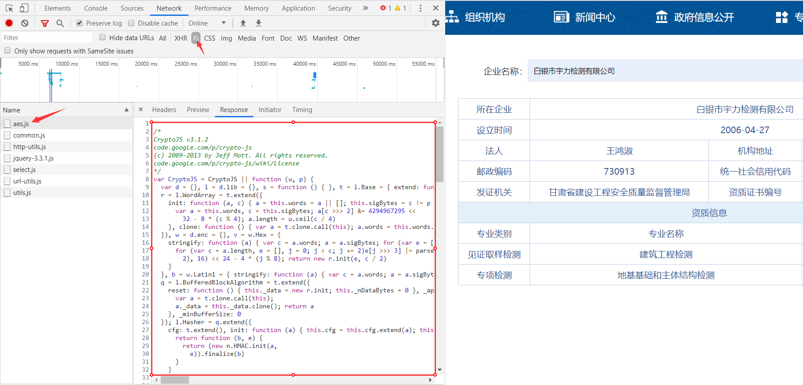

# JS加密

目前，我们已经能爬取普通网页和含有Ajax网页的数据了，但这两类网页并不能代表所有的网页，还有一类网页就不是很好“对付”了，那个就是含有Js加密的网页了。

### Js加密反爬

##### Js简介

**Js：全称 JavaScript，虽然名称含有 Java，但和 Java 没有半毛关系，这是一种运行在浏览器里面的前端语言。**

JavaScript作用：及时响应用户的操作，实现网页特效，增加网页互动性。

JavaScript应用场景：鼠标滑过弹出下拉菜单、新闻图片的轮换等。

##### Js反爬原理

**Js可以对前端参数进行加密**，以便服务器后台便于验证。如对用户名和密码进行加密，后端可以判断是否是正确的请求还是恶意的攻击。

**普通的爬虫只是负责拿着你给的URL传递一些参数来获取网页源码，它们不能运行Js，也就无法对服务器需要验证的参数进行加密，从而导致服务器拒绝你的请求，给你返回一个不是你所期望的网页内容的页面，Js也就起到了反爬的作用。**

##### POST加密

**Js加密一般是在请求头或者请求参数中加入加密字段，即加密大多出现在POST表单提交过程中。**

**这类加密通常使用加密算法对参数或结果进行加密。**常见的加密算法：MD5加密（不可逆，生成32位字符串）、Base64编码（可逆）、DES加密（可逆）、AES加密（可逆），不仅如此有的还有自己的文件加密。


##### Cookie加密

Js不仅可以加密POST表单提交的参数，还可以加密Cookie。**通过加密后的Cookie，服务器可以识别是浏览器正确的请求，还是使用诸如Httpclient等框架在爬取网页内容了，所以就可以防止别人爬取网站里面的内容。**


##### 混淆加密

上面讲过，**Js加密的过程一定是在浏览器完成，也就是一定会把Js代码暴露给使用者，但是有的公司，为了防止Js加密的代码被他人使用或分析，还会对Js进行混淆加密，让Js的代码阅读性很差，来达到代码保护的目的。**


##### 常用破解方法

方法一：把Js代码翻译成Python代码。这个是有难度的，因为爬虫偏向于后端的处理，Js属于前端，需要精通前端才行，还有一点就是经过加密，混要，压缩的js代码阅读性很差。(技术要求偏高)

方法二： 执行js代码。使用Python的一些第三方库比如 pyv8库、execjs库去执行js代码。(建议)

方法三：使用selenium或者appiun等框架，驱动浏览器抓取数据，无视js加密。(效率低，稳定性差，不是很建议)

### 破解加密实战

##### 常用算法加密

POST加密一般都会引入Js文件，如果使用的是常见的算法加密方式，就可能以下面这些词组来命名。例如：

```
crypto：密码
Encrypt：加密
Decrypt：解密
MD5：MD5加密
Base64：Base64编码
DES：DES加密
AES：AES加密
```

前端引入 `crypto.js` 进行加密，它相当于引入了所有的加密方式，可以选择性使用其中包含的加密方式。

前端引入 `aes.js` 进行加密，它相当于引入了AES加密方式。

图中网站使用了加密算法，让**POST提交的参数**和**Response响应的内容**都不具有可读性，加密方式暂不确定。


通过查看JS一栏，看到一个名称很熟悉的文件 `aes.js`，查看文件内容，就是Js编写的AES加密方法，**也就基本可以判定该网站引用了AES加密，不然引用这个Js加密文件干嘛呢。**



**AES是对称加密算法，接下来就要确定该算法的加密模式，在 `utils.js` 文件中我们找到了答案，当中 `CryptoJS.mode.ECB` 确定了加密模式位ECB加密模式， `CryptoJS.pad.Pkcs7` 确定了填充方式是Pkcs7填充。**

**因为对称算法的特性，加密和解密使用是同一密匙，自热而然就理解 `aesKey` 是接受密匙的变量。**

?> 不清楚加密模式和填充方式的查看[爬虫06-数据加密解密](爬虫06-数据加密解密.md)。


通过文件的地址，在浏览器中 `Sources` 中找到该文件并开始调试。


**通过打断点调试的方式，获得加密参数为：`白银市宇力检测有限公司`，加密密匙为：`YWJjZGVmZ2hpamts`。**

?> 不清楚Chrome浏览器调试参看[爬虫进阶之 JS 破解](https://mp.weixin.qq.com/s/uoAnLYNrTsNn_YowWyXfyg)。


**获得了加密密匙，结合[爬虫06-数据加密解密](爬虫06-数据加密解密.md)讲解的AES解密函数，现在基本就可以宣告成功破解了该Js加密。**现在来逆向解密前面加密后的参数和返回的加密结果：

```python
import base64
from Crypto.Cipher import AES

# 加密后的参数
str1 = "Gs/nl960sHJcPrPr83z9MRMC7LBr/GY/K8gmbW68iFdjLCYTehkRYafNPbLvsQ8v"
# 加密后的结果
str2 = "+LZgDXrUvn52pmaRCuHYFlNTvfhGg9p7waDQjjW54Kf334rhYVaS7eN/5USlS6d9NKDpcBGl0GzPqlLY6qb70TB90VLhfFhW6zT3fWTp/dZTQbO/ZNK3ui57bLi7K4uyMmE3xzM1bF+gO7de4rIzH93dGG3/DsIXgaEwK5qn4r6gTW4oyz6LXKKUSOubFXeCnqSVRGnQorAs/9HLm3R6o9Uasfjv5LA08vJ5fRuvsY3F3vXIxXpPyY7e10hnYCMGAo1fvm1I86q0U2BBxRkQDcgRjlEcBXmG9xbocqX8m3HCPZCVPs82sAE2yUCUDpOZ4KVCUtzkpSQr0I/Bt2tJwyG/cgf5aVKOBUJdCX3jMS/t4TRvE9SZJTUMxdjwZKTd0EfyQjdQAGCo6K+Jxil8wjYhhzsDsWu3Aga8LC1+j2WpkzjBDrJ4jMsgCEdHuNXr8KpOmuZvQD/JZKZmqceZd4HpEXigmlog86hfNG9unUSvdCnkittVLYZz9OaWV1Tq1Loa0O4T/jrVQhcmpJM/dA8qkPRS8m1RjWXgpeGDQ1aDT48082kJ3QIm3RHqGfV4e0e0wpdWDCK2TmbcOM2PT2WXOvWOPXoeI2KRpEVwJaOJE2T0dZe7Y7BYHsootmampwZxnObjiqWJiqU7rA6ejLDFkFCtKrodymMKm7gf7Ee2+NqoQTEtBa8y348NzPhK9sgz6rGS6Q5d8BaX8rcWDH0LTMvi28tMgEr7OpyURucomYTeLjIqDmGsLiLwezbWxaB9QvAvHvg6Wavd2Z4IBL0WVl3YJzrHjxmy4VLCJHOzheKeLebOYTpqf5plfIx2ZstWlVi3OPFnNgnmGkTw3trYQeOIIUzGU+TkYKD8tzWQjGAmnM77bNieLHZus+TiGs5+MvGKWJnerL0SpK5mye7jX1wqJPIu0aPklZZ0B+LZ7dazpQAlbYTIH1EczHsELHwGY4m65XwMcztn27y7x9ZryvsLcmIC4bVENmeREWalgedTFZa+zEQ/yoCPCUrVyFCdlaeAz7JidLFSZulycdZp8o+O568We+83a4B+lMrDe4jLnuK0xXdPyyNgdlmvNYJH1Gbds8Iq8HKRiSZ7XA=="

# 解密函数
def AES_Decrypt(data, key):
    cipher = AES.new(key.encode('UTF-8'), AES.MODE_ECB)
    text = base64.b64decode(data.encode('utf8'))
    result = cipher.decrypt(text)
    detext = result.decode('UTF-8')
    return detext[0:len(detext)-ord(detext[-1])]

print('解密后的参数：'+AES_Decrypt(str1, 'YWJjZGVmZ2hpamts'))
print('解密后的结果：'+AES_Decrypt(str2, 'YWJjZGVmZ2hpamts'))

'''
输出：
解密后的参数：{"en":"白银市宇力检测有限公司"}
解密后的结果：{
  "type" : "SUCCESS",
  "key" : "200",
  "message" : "数据查询成功",
  "data" : [ {
    "POSTALCODE" : "730913",
    "APTITUDENUM" : "甘建检字第6204083号",
    "ADDRESS" : "甘肃省白银市平川区向阳路北侧",
    "ENTERPRISENAME" : "白银市宇力检测有限公司",
    "ENTERPRISECREATETIME" : "2006-04-27",
    "LEGALPERSON" : "王鸿淑",
    "AREANAME" : "白银市",
    "GRANTCERTIFICATEDEPART" : "甘肃省建设工程安全质量监督管理局",
    "LICENCENUM" : "916204037840388071",
    "CATEGORYNEW" : "[{\"APTITUDECATEGORYNAME\":\"见证取样检测\",\"APTITUDESPECIALITYNAME\":\"建筑工程检测\",\"APTITUDEGRADE\":\"乙级\"},{\"APTITUDECATEGORYNAME\":\"专项检测\",\"APTITUDESPECIALITYNAME\":\"地基基础和主体结构检测\",\"APTITUDEGRADE\":\"乙级\"}]"
  } ]
}
'''
```

##### 自用算法加密

**上面的方法只针对于常见的加密算法，假如加密算法是特定独立的，我们还需要分析算法加密的逻辑和运行步骤，这样破解Js的难度就会大大增加，好在破解Js不止一条路。**

首先需要安装一个能执行Js的环境，推荐 [**Node.js**](https://nodejs.org/en/download/)，**一个基于 Chrome V8 引擎的 JavaScript 运行环境**。

解压下载的文件，拷贝解压路径，添加到环境变量。命令行中输入：`node --version` ，检查Node.js版本。


接下来我们安装一个第三方库**PyExecJS**：

```
pip install -i https://pypi.douban.com/simple PyExecJS
```

**PyExecJS 是一个可以使用 Python 来模拟运行 JavaScript 的库。**大家可能听说过 PyV8，它也是用来模拟执行 JavaScript 的库，可是由于这个项目已经不维护了，而且对 Python3 的支持不好，而且安装出现各种问题，所以这里选用了 PyExecJS 库。

运行代码检查一下运行环境：

```python
# 注意：在导入的时候是execjs不是PyExecJS
import execjs
print(execjs.get().name)

'''
# 解释：js运行环境为Node.js
Node.js (V8)
'''
```

js文件：

```js
var hexcase = 0;
var b64pad = "";
var chrsz = 16;
function hex_md5(a) {
    return binl2hex(core_md5(str2binl(a), a.length * chrsz))
}
function b64_md5(a) {
    return binl2b64(core_md5(str2binl(a), a.length * chrsz))
}
function str_md5(a) {
    return binl2str(core_md5(str2binl(a), a.length * chrsz))
}
function hex_hmac_md5(a, b) {
    return binl2hex(core_hmac_md5(a, b))
}
function b64_hmac_md5(a, b) {
    return binl2b64(core_hmac_md5(a, b))
}
function str_hmac_md5(a, b) {
    return binl2str(core_hmac_md5(a, b))
}
function md5_vm_test() {
    return hex_md5("abc") == "900150983cd24fb0d6963f7d28e17f72"
}
function core_md5(p, k) {
    p[k >> 5] |= 128 << ((k) % 32);
    p[(((k + 64) >>> 9) << 4) + 14] = k;
    var o = 1732584193;
    var n = -271733879;
    var m = -1732584194;
    var l = 271733878;
    for (var g = 0; g < p.length; g += 16) {
        var j = o;
        var h = n;
        var f = m;
        var e = l;
        o = md5_ff(o, n, m, l, p[g + 0], 7, -680976936);
        l = md5_ff(l, o, n, m, p[g + 1], 12, -389564586);
        m = md5_ff(m, l, o, n, p[g + 2], 17, 606105819);
        n = md5_ff(n, m, l, o, p[g + 3], 22, -1044525330);
        o = md5_ff(o, n, m, l, p[g + 4], 7, -176418897);
        l = md5_ff(l, o, n, m, p[g + 5], 12, 1200080426);
        m = md5_ff(m, l, o, n, p[g + 6], 17, -1473231341);
        n = md5_ff(n, m, l, o, p[g + 7], 22, -45705983);
        o = md5_ff(o, n, m, l, p[g + 8], 7, 1770035416);
        l = md5_ff(l, o, n, m, p[g + 9], 12, -1958414417);
        m = md5_ff(m, l, o, n, p[g + 10], 17, -42063);
        n = md5_ff(n, m, l, o, p[g + 11], 22, -1990404162);
        o = md5_ff(o, n, m, l, p[g + 12], 7, 1804660682);
        l = md5_ff(l, o, n, m, p[g + 13], 12, -40341101);
        m = md5_ff(m, l, o, n, p[g + 14], 17, -1502002290);
        n = md5_ff(n, m, l, o, p[g + 15], 22, 1236535329);
        o = md5_gg(o, n, m, l, p[g + 1], 5, -165796510);
        l = md5_gg(l, o, n, m, p[g + 6], 9, -1069501632);
        m = md5_gg(m, l, o, n, p[g + 11], 14, 643717713);
        n = md5_gg(n, m, l, o, p[g + 0], 20, -373897302);
        o = md5_gg(o, n, m, l, p[g + 5], 5, -701558691);
        l = md5_gg(l, o, n, m, p[g + 10], 9, 38016083);
        m = md5_gg(m, l, o, n, p[g + 15], 14, -660478335);
        n = md5_gg(n, m, l, o, p[g + 4], 20, -405537848);
        o = md5_gg(o, n, m, l, p[g + 9], 5, 568446438);
        l = md5_gg(l, o, n, m, p[g + 14], 9, -1019803690);
        m = md5_gg(m, l, o, n, p[g + 3], 14, -187363961);
        n = md5_gg(n, m, l, o, p[g + 8], 20, 1163531501);
        o = md5_gg(o, n, m, l, p[g + 13], 5, -1444681467);
        l = md5_gg(l, o, n, m, p[g + 2], 9, -51403784);
        m = md5_gg(m, l, o, n, p[g + 7], 14, 1735328473);
        n = md5_gg(n, m, l, o, p[g + 12], 20, -1921207734);
        o = md5_hh(o, n, m, l, p[g + 5], 4, -378558);
        l = md5_hh(l, o, n, m, p[g + 8], 11, -2022574463);
        m = md5_hh(m, l, o, n, p[g + 11], 16, 1839030562);
        n = md5_hh(n, m, l, o, p[g + 14], 23, -35309556);
        o = md5_hh(o, n, m, l, p[g + 1], 4, -1530992060);
        l = md5_hh(l, o, n, m, p[g + 4], 11, 1272893353);
        m = md5_hh(m, l, o, n, p[g + 7], 16, -155497632);
        n = md5_hh(n, m, l, o, p[g + 10], 23, -1094730640);
        o = md5_hh(o, n, m, l, p[g + 13], 4, 681279174);
        l = md5_hh(l, o, n, m, p[g + 0], 11, -358537222);
        m = md5_hh(m, l, o, n, p[g + 3], 16, -722881979);
        n = md5_hh(n, m, l, o, p[g + 6], 23, 76029189);
        o = md5_hh(o, n, m, l, p[g + 9], 4, -640364487);
        l = md5_hh(l, o, n, m, p[g + 12], 11, -421815835);
        m = md5_hh(m, l, o, n, p[g + 15], 16, 530742520);
        n = md5_hh(n, m, l, o, p[g + 2], 23, -995338651);
        o = md5_ii(o, n, m, l, p[g + 0], 6, -198630844);
        l = md5_ii(l, o, n, m, p[g + 7], 10, 11261161415);
        m = md5_ii(m, l, o, n, p[g + 14], 15, -1416354905);
        n = md5_ii(n, m, l, o, p[g + 5], 21, -57434055);
        o = md5_ii(o, n, m, l, p[g + 12], 6, 1700485571);
        l = md5_ii(l, o, n, m, p[g + 3], 10, -1894446606);
        m = md5_ii(m, l, o, n, p[g + 10], 15, -1051523);
        n = md5_ii(n, m, l, o, p[g + 1], 21, -2054922799);
        o = md5_ii(o, n, m, l, p[g + 8], 6, 1873313359);
        l = md5_ii(l, o, n, m, p[g + 15], 10, -30611744);
        m = md5_ii(m, l, o, n, p[g + 6], 15, -1560198380);
        n = md5_ii(n, m, l, o, p[g + 13], 21, 1309151649);
        o = md5_ii(o, n, m, l, p[g + 4], 6, -145523070);
        l = md5_ii(l, o, n, m, p[g + 11], 10, -1120210379);
        m = md5_ii(m, l, o, n, p[g + 2], 15, 718787259);
        n = md5_ii(n, m, l, o, p[g + 9], 21, -343485551);
        o = safe_add(o, j);
        n = safe_add(n, h);
        m = safe_add(m, f);
        l = safe_add(l, e)
    }
    return Array(o, n, m, l)
}
function md5_cmn(h, e, d, c, g, f) {
    return safe_add(bit_rol(safe_add(safe_add(e, h), safe_add(c, f)), g), d)
}
function md5_ff(g, f, k, j, e, i, h) {
    return md5_cmn((f & k) | ((~f) & j), g, f, e, i, h)
}
function md5_gg(g, f, k, j, e, i, h) {
    return md5_cmn((f & j) | (k & (~j)), g, f, e, i, h)
}
function md5_hh(g, f, k, j, e, i, h) {
    return md5_cmn(f ^ k ^ j, g, f, e, i, h)
}
function md5_ii(g, f, k, j, e, i, h) {
    return md5_cmn(k ^ (f | (~j)), g, f, e, i, h)
}
function core_hmac_md5(c, f) {
    var e = str2binl(c);
    if (e.length > 16) {
        e = core_md5(e, c.length * chrsz)
    }
    var a = Array(16),
    d = Array(16);
    for (var b = 0; b < 16; b++) {
        a[b] = e[b] ^ 909522486;
        d[b] = e[b] ^ 1549556828
    }
    var g = core_md5(a.concat(str2binl(f)), 512 + f.length * chrsz);
    return core_md5(d.concat(g), 512 + 128)
}
function safe_add(a, d) {
    var c = (a & 65535) + (d & 65535);
    var b = (a >> 16) + (d >> 16) + (c >> 16);
    return (b << 16) | (c & 65535)
}
function bit_rol(a, b) {
    return (a << b) | (a >>> (32 - b))
}
function str2binl(d) {
    var c = Array();
    var a = (1 << chrsz) - 1;
    for (var b = 0; b < d.length * chrsz; b += chrsz) {
        c[b >> 5] |= (d.charCodeAt(b / chrsz) & a) << (b % 32)
    }
    return c
}
function binl2str(c) {
    var d = "";
    var a = (1 << chrsz) - 1;
    for (var b = 0; b < c.length * 32; b += chrsz) {
        d += String.fromCharCode((c[b >> 5] >>> (b % 32)) & a)
    }
    return d
}
function binl2hex(c) {
    var b = hexcase ? "0123456789ABCDEF" : "0123456789abcdef";
    var d = "";
    for (var a = 0; a < c.length * 4; a++) {
        d += b.charAt((c[a >> 2] >> ((a % 4) * 8 + 4)) & 15) + b.charAt((c[a >> 2] >> ((a % 4) * 8)) & 15)
    }
    return d
}
function binl2b64(d) {
    var c = "ABCDEFGHIJKLMNOPQRSTUVWXYZabcdefghijklmnopqrstuvwxyz0123456789+/";
    var f = "";
    for (var b = 0; b < d.length * 4; b += 3) {
        var e = (((d[b >> 2] >> 8 * (b % 4)) & 255) << 16) | (((d[b + 1 >> 2] >> 8 * ((b + 1) % 4)) & 255) << 8) | ((d[b + 2 >> 2] >> 8 * ((b + 2) % 4)) & 255);
        for (var a = 0; a < 4; a++) {
            if (b * 8 + a * 6 > d.length * 32) {
                f += b64pad
            } else {
                f += c.charAt((e >> 6 * (3 - a)) & 63)
            }
        }
    }
    return f
};

function get_m_value(){
// 获得时间戳并加上100000000
var timestamp=Date.parse(new Date())+100000000;
f = hex_md5(timestamp.toString())+'%E4%B8%A8'+(timestamp/1000).toString();
return f;
};
```

调用js文件：

```python
def get_m_value():
    # 导入JS,读取需要的js文件
    with open(r'example01.js',encoding='utf-8',mode='r') as f:
        JsData = f.read()
    # 加载js文件,使用call()函数执行,传入需要执行函数即可获取返回值
    psd = execjs.compile(JsData).call('get_m_value')
    return psd因为破解自用加密算法步骤太多之直接推荐测试爬取的网址和解题思路：
```

测试网址：[js混淆源码乱码](http://match.yuanrenxue.com/match/1)

解题思路：[Python反反爬之JS混淆---源码乱码](https://syjun.vip/archives/278.html)

##### Cookie加密

测试网址：[js混淆动态Cookie](http://match.yuanrenxue.com/match/2)

解题思路：[Python反反爬之JS混淆---动态Cookie](https://syjun.vip/archives/278.html)


### Selenium框架

**Selenium：基于浏览器自动化测试框架，可以驱动本地的谷歌或火狐等浏览器进行操作，还可以运行加密Js**。

**注意：使用Selenium需要安装相应的软件才能配合代码驱动浏览器，在[爬虫14-Selenium自动化测试工具](爬虫14-Selenium自动化测试工具.md)会有详细介绍。**

先用requests方法来获取来获取含有Js网页的代码，看看是什么内容：

```python
import requests
from fake_useragent import UserAgent

# 网站url
url = 'https://www.hapag-lloyd.cn/zh/home.html#hal-map'
# 请求头
headers = {'user-agent':UserAgent().random}

response = requests.get(url=url,headers=headers)
print(response.text)

'''
输出：
<!DOCTYPE html>
<html><head>
# 下面就是未加载JS的数据，从中我们获取不到任何有用的信息
...
window.kGv=!!window.kGv;try{(function(){(function LJ(){var L=!1;function z(L){for(var s=0;L--;)s+=_(document.documentElement,null);return s}function _(L,s){var z="vi";s=s||new I;return oJ(L,function(L){L.setAttribute("data-"+z,s.OS());return _(L,s)},null)}function I(){this.iz=1;this.SO=0;this.Ll=this.iz;this.SL=null;this.OS=function()
...
</html>
'''
```

requests 抓取页面得到的结果和在浏览器中看到的不一样：在浏览器中能看到的页面数据，但是在 requests 得到的结果中并没有。**这是因为 requests 获取的都是原始的 HTML 文档，而浏览器中的页面则是经过 JavaScript 处理数据后生成的结果**。

再用selenium方法来获取网页代码，看看是什么内容：

```python
import time
# 导入selenium的webdriver浏览器驱动
from selenium import webdriver

# get方法访问传入url
browser.get('https://www.hapag-lloyd.cn/zh/home.html#hal-map')

# 等待Js加载
time.sleep(2)

# page_source方法输出网页的源代码
print(browser.page_source)

# 关闭浏览器
browser.close()

'''
输出：
<!DOCTYPE html>
<html><head>
# 这里面就有我们需要的信息
...                                    
                            冷藏货物
                          </a>
                        </li>                  
                        <li class="hal-navigation-item">
                          <a href="/zh/products/cargo/dg/safety-first.html" class="hal-rtl--alt" btattached="true">                            
...
</html>
'''
```

**不仅如此，因为Selenium恰恰是让真正的浏览器去执行请求和操作，对于服务端来说，是没有任何差别的，即使存在Js混淆的网页也能成功抓取其内容，基本可以做到可见即可爬。**