# 异步Ajax与动态ASP

## Ajax异步请求

目前我们已经能够爬取并保存一些网页的数据了，但并不是每个网页都能乖乖的将数据直接给你，**有一部分网页，它会将数据展示在网页上，但在网页的源代码中却找不到数据的影子，原因就在于这部分网页使用了Ajax技术。**

Ajax技术：**即异步的 JavaScript 和 XML ，是利用 JavaScript 在保证页面不被刷新、页面链接不改变的情况下与服务器交换数据并更新部分网页的技术。**

Ajax工作流程：**原始的页面最初不会包含某些数据，原始页面加载完后，会再向服务器请求某个接口获取数据，然后数据才被处理从而呈现到网页上，这其实就是发送了一个 Ajax 请求**。

Ajax目的：用较少网络数据的传输量，提高用户体验。

Ajax应用场景：在网页上输入需要翻译的短文，输入过程中翻译的结果不断变化，而网页并没有全部刷新。

**简单地说，Ajax在不需要重新刷新页面的情况下通过异步请求加载后台数据，并在网页上呈现出来（网页局部刷新技术）。**

照Web 发展的趋势来看，这种形式的页面越来越多。**网页的原始 HTML 文档不会包含任何数据，数据都是通过Ajax加载后再呈现出来的，这样在 Web 开发上可以做到前后端分离，而且降低服务器直接渲染页面带来的压力。**

### Ajax请求内容

1. 打开拥有局部刷新网页的功能
2. 按F12打开“开发者工具”
3. **点击’Network‘选项卡（刷新一下页面，查看浏览器和服务器所有的请求和响应）**
4. **在点击’XHR‘选项卡（Ajax的核心是XMLHttpRequest对象(简称XHR)）**
5. **点击文件中的Headers选项，其中 Request Headers 的一个信息为 `X-Requested-With:XMLHttpRequest` ，这就标记了此请求是 Ajax 请求。**
6. **再点击Response选项，这里就显示了文件通过Ajax请求的内容。**

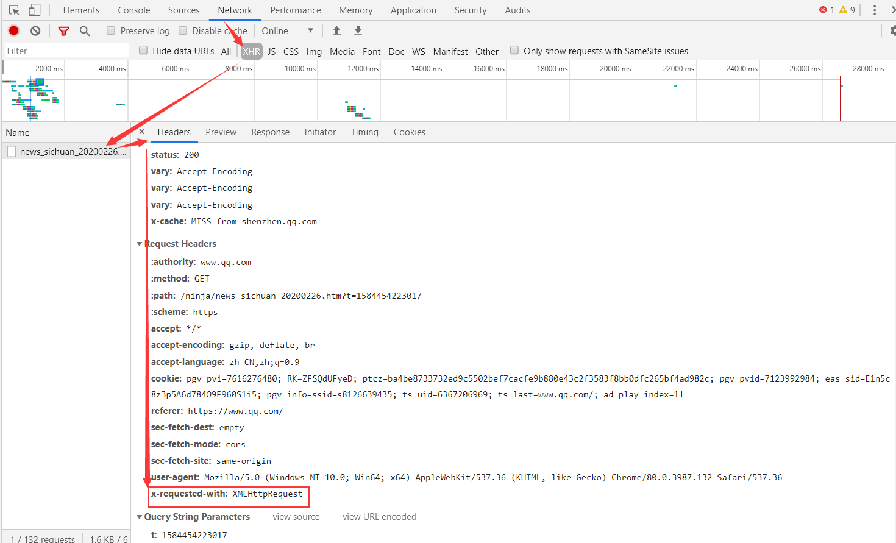

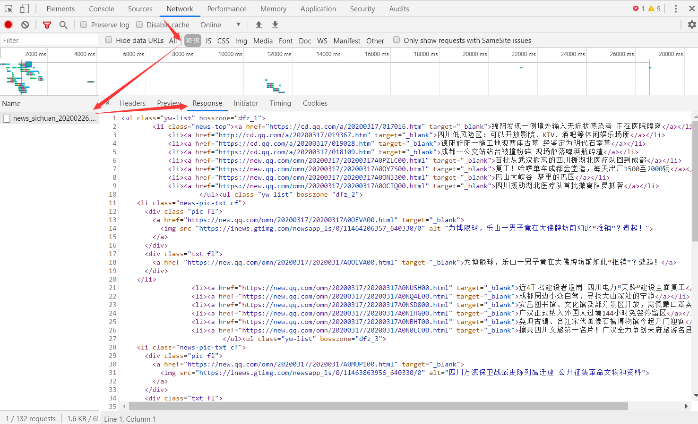

### Ajax请求代码

除此之外，还可以点击左侧的Initiator选项，它主要是标记请求是由哪个对象或进程发起的（请求源），重点关注里面的request请求：

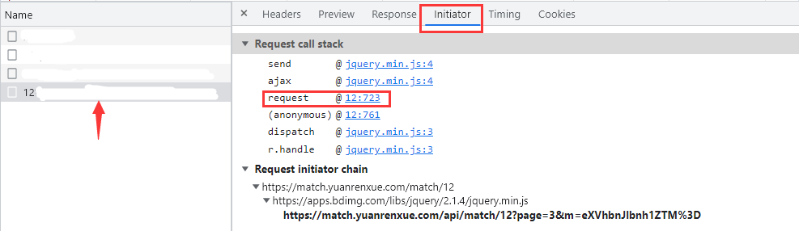

显示从一个名称为“12”的文件的第723行代码发送了当前请求，点击后面的地址，跳转到了该文件的第723行，可以看到**ajax请求中有 `success`、`complete`、`error` 这三个字段，分别代表请求成功执行；不管是否成功请求都执行；请求不成功执行；**的含义：

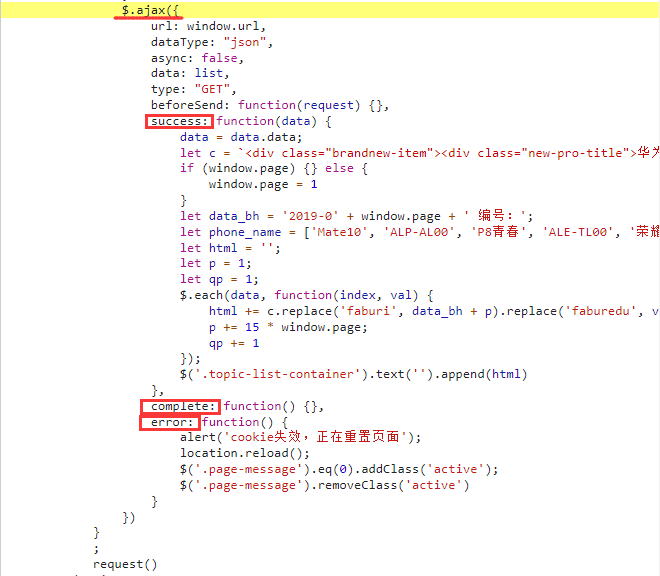

### 模拟Ajax请求

直接利用 requests 等库来抓取原始页面，是无法获取到有效数据的，这时需要**分析网页后台向哪个接口发送的 Ajax 请求，再利用 requests 来模拟 Ajax 请求，那么就可以成功抓取了**。

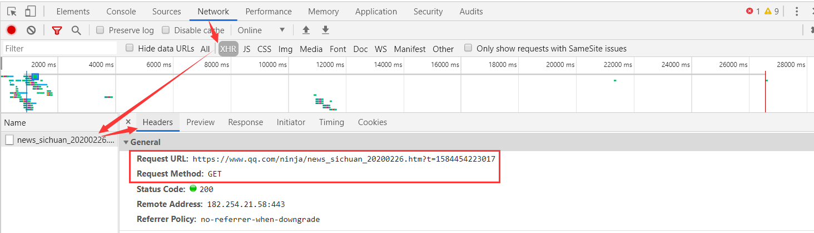

```python
import requests
from fake_useragent import UserAgent

# 构造随机请求头
headers = {'User-Agent':UserAgent().random}
# Ajax请求的接口
url = 'https://www.qq.com/ninja/news_sichuan_20200226.htm?t=1584454223017'
# 发送GET请求
response = requests.get(url=url,headers=headers)
# 编码为GBK
response.encoding = 'GBK'
# 响应内容
print(response.text)

# 获取标题
title = re.findall(r'<a.*?>(.*?)</', response.text)
print(title)

# 获取链接
href = re.findall(r'<a.*?href="(.*?)"', response.text)
print(href)

'''
输出的响应：
<li><a href="https://new.qq.com/omn/20200317/20200317A0MFD200.html" target="_blank">刚刚，英雄凯旋！再看一眼“川军”战斗过的方舱医院</a></li>
<li><a href="https://new.qq.com/omn/20200317/20200317A0MF7M00.html" target="_blank">成都持枪斗殴案引出“GMI”传销大案 被打者是骨干人员</a></li>
<li><a href="https://new.qq.com/omn/20200317/20200317A0M4G000.html" target="_blank">四川日报整版刊发：春望甘孜 奏响奋发追赶动人乐章</a></li>...

输出的标题：
['刚刚，英雄凯旋！再看一眼“川军”战斗过的方舱医院', '成都持枪斗殴案引出“GMI”传销大案 被打者是骨干人员', '四川日报整版刊发：春望甘孜 奏响奋发追赶动人乐章'...']

输出的链接：
['https://new.qq.com/omn/20200317/20200317A0MFD200.html', 'https://new.qq.com/omn/20200317/20200317A0MF7M00.html', 'https://new.qq.com/omn/20200317/20200317A0M4G000.html',
...']
'''
```

## ASP动态网页

### 网页类型区别

在网站设计中，**纯粹HTML（标准通用标记语言下的一个应用）格式的网页通常被称为“静态网页”，静态网页是标准的HTML文件，它的文件扩展名是.htm、.html**，可以包含文本、图像、声音、FLASH动画、客户端脚本和ActiveX控件及JAVA小程序等。静态网页是网站建设的基础，早期的网站一般都是由静态网页制作的。**静态网页是相对于动态网页而言，是指没有后台数据库、不含程序和不可交互的网页。静态网页相对更新起来比较麻烦，适用于一般更新较少的展示型网站。容易误解的是静态页面都是htm这类页面，实际上静态也不是完全静态，他也可以出现各种动态的效果，如GIF格式的动画、FLASH、滚动字幕等。**

在这之前，我们所爬取的网页都是**后缀为HTML的网页**，这类网页一般只能显示文字、图片、按钮等，不能自行处理数据，我们一般称的**静态网页**。有静态网页自然就有动态网页，即**后缀为ASP的网页**，这类网页能自行接收，处理数据，并给客户端回复数据，称为**动态网页**。

HTML：**超文本标记语言**，是编写静态网页的最简单的语言，主要用于开发、设计网页。

ASP：**动态服务器页面**（Active Server Pages），主要用于创建和运行动态的交互式Web服务器应用程序。

1. `.html ` 静态页面，不具备连接数据库功能，每次更新就是更改整个页面。
2. `.asp ` 动态网页，可以连接数据库，更新网站内容只需要在后台增删内容就可以了。
3. **`.html` 与 `.htm` 均是静态网页文件后缀名**，互换后缀，对网页没有影响，唯一区别就是后缀名中的“L”。
4. **`.asp` 与 `.aspx` 均是动态网页文件后缀名**，其中 `.aspx` 编写效率更高，安全性也更高。
5. `.html` 的文件改成 `.asp` 的后缀没有任何影响，因为asp动态语言允许插入html代码，反过来完全不行。

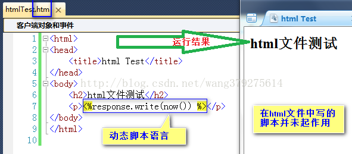

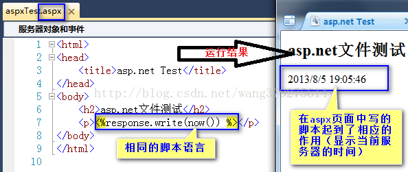

### ASP网页请求

ASP是动态网页，**在一个网站中从一个动态网页访问到另一个动态网页时，需要保持控件的状态，即保持更新的控件参数，来达到正常访问的目的**。其中有两个参数特别重要，`__ViewState` 参数、`__EventValidation` 参数。

**先GET请求动态页面的网址**（这一页一般是**网站的首页**或者**网站板块的第一页**）

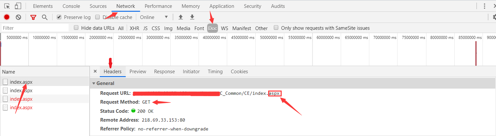

在网页代码中**获取 `__EventValidation` 参数的`value`值、`__ViewState` 参数的`value`值**

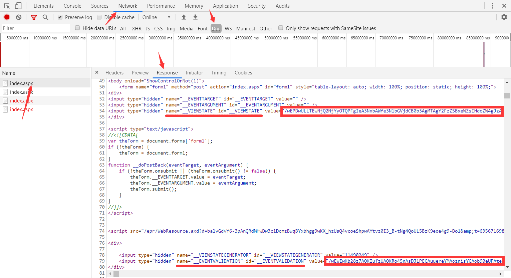

**带上获取的两个`value`值，再POST请求下一个动态页面网址**（一般是**首页进入板块第一页**或者**板块里面翻页**）

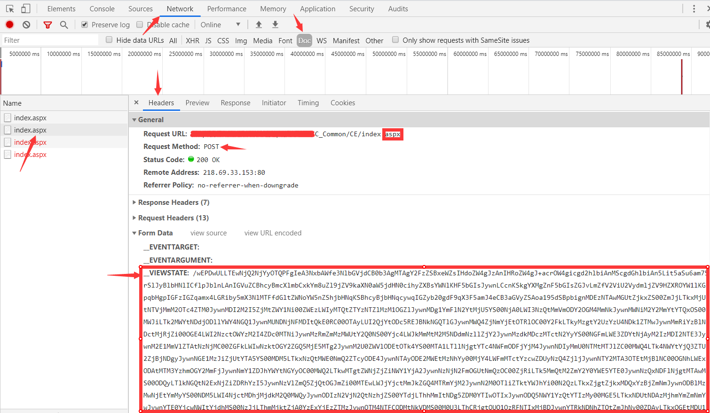

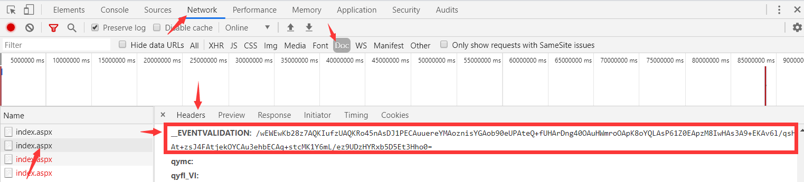

接下重复上面2、3步骤，在网页代码中**获取 `__EventValidation` 参数的`value`值、`__ViewState` 参数的`value`值**，**带上获取的两个`value`值，再POST请求下一个动态页面网址**，即可向后不断的翻页查看，直到所有。

### __ViewState

**ViewState是一个名称/值的对象集合。**

web窗体控件设置为 `runat = "server"`，这个控件会被附加一个**隐藏属性** `<input type="hidden" name="__VIEWSTATE" value="...">`，**里面存放了所有控件在ViewState中的状态值**。

**GET请求**：请求某个页面时，**ASP.NET把控件的状态序列化成一个字符串，然后作为窗体的隐藏属性送到客户端**。

**POST请求**：回传页面时，**表单把控件值一起提交到后台，ASP.NET分析解码，并赋给控件对应的值并恢复状态**。

**value值**：它可能类似如下的形式:Oz4+O2w8aTwxPjs+O2w8.... 很多人会认为这是加密的信息，其实不是，只是给各个控件和页面的状态存入适当的对象，再序列化，最后再做一次base64编码，赋值给viewstate控件。

**获取value值**：直接通过正则表达式在网页HTML代码中获取。

```python
import re

# 除去网页代码中的所有空格
Match = re.sub(r'\s*', '', '网页HTML代码')
# 获取网页代码中ViewState的value值
ViewState = re.findall(r'(?<=<inputtype="hidden"name="__VIEWSTATE"id="__VIEWSTATE"value=").*?(?=")|(?<=__VIEWSTATE\|).*?(?=\|)|(?<=<inputtype="hidden"name="__VIEWSTATE"value=").*?(?=")',Match)[0]
```

### __EventValidation

`__EVENTVALIDATION` 是ASP.NET 2.0的新增的**用来验证事件是否从合法的页面发送的安全措施**。该功能可以阻止由潜在的恶意用户从浏览器端发送的未经授权的请求。

**`__EVENTVALIDATION` 原理**：在返回页面的时候，ASP.NET 引擎会对控件的可能的值以及控件的 UniqueID 进行 hash 计算，得到一个值。页面里所有需要回发的控件的这些计算值就组成了一个列表，组合后放在隐藏字段 `__EVENTVALIDATION` 中。在页面回发后，会对这个字段的内容进行解包，然后重新计算对比 hash 值是否一致。简单说，`__EVENTVALIDATION` **就是一个数字签名，一般很短。**

**获取value值**：直接通过正则表达式在网页HTML代码中获取。

```python
import re

# 除去网页代码中的所有空格
Match = re.sub(r'\s*', '', '网页HTML代码')
# 获取网页代码中EventValidation的value值
EventValidation = re.findall(r'(?<=<inputtype="hidden"name="__EVENTVALIDATION"id="__EVENTVALIDATION"value=").*?(?=")|(?<=__EVENTVALIDATION\|).*?(?=\|)',Match)[0]
```

!> 注意：`__EVENTVALIDATION` 一般在表单的最下方，如果表单在客户端未解析完毕，用户提交数据可能导致验证失败。

### ASP网页爬虫

```python
import re
import requests
from fake_useragent import UserAgent

# 请求头
headers = {'User-Agent': UserAgent().random,}
# 地址
url = '...asp'
# 获取第一页响应
response1 = requests.get(url=url, headers=headers)
# 除去空格
Match = re.sub(r'\s*', '', response1.text)
# 获取网页代码中ViewState的value值
ViewState = re.findall(r'(?<=<inputtype="hidden"name="__VIEWSTATE"id="__VIEWSTATE"value=").*?(?=")|(?<=__VIEWSTATE\|).*?(?=\|)|(?<=<inputtype="hidden"name="__VIEWSTATE"value=").*?(?=")',Match)[0]
# 获取网页代码中EventValidation的value值
EventValidation = re.findall(r'(?<=<inputtype="hidden"name="__EVENTVALIDATION"id="__EVENTVALIDATION"value=").*?(?=")|(?<=__EVENTVALIDATION\|).*?(?=\|)',Match)[0]
# 构造表单
data = {
    '...':'...',
    '__VIEWSTATE':ViewState,
    '__EVENTVALIDATION':EventValidation
}
# post请求发送表单进行验证
response2 = requests.post(url=url, headers=headers, data=data)
# 输出下一页的内容
print(response2.text)
```

