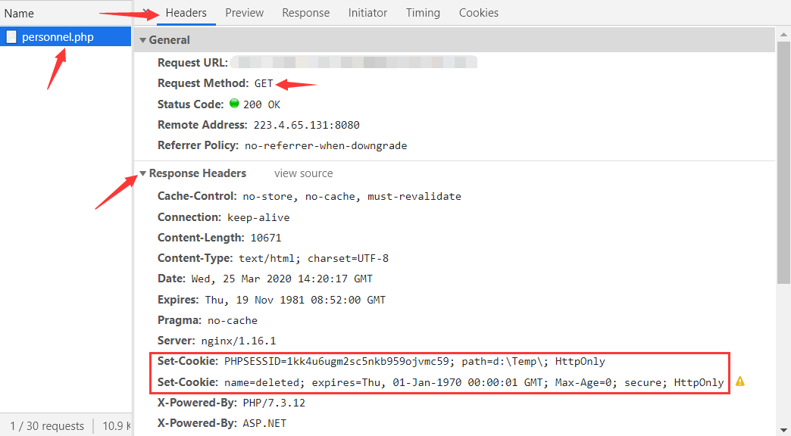
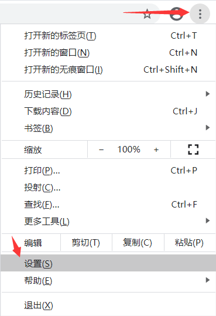
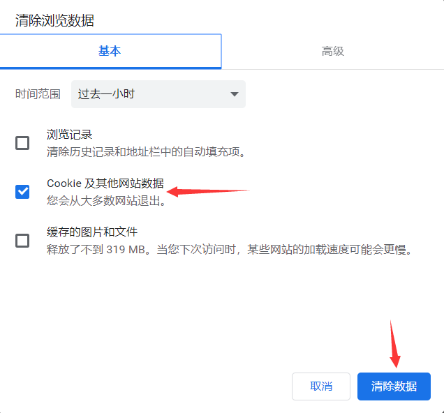
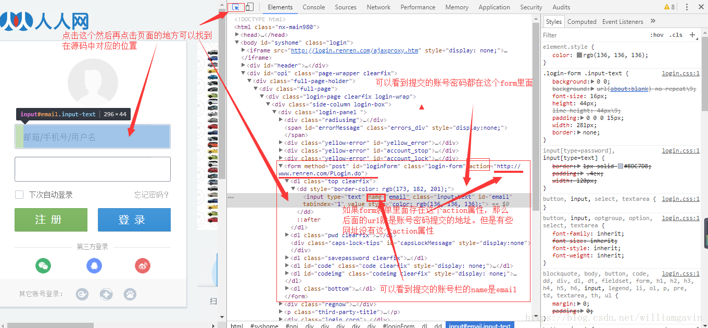

# Cookie保持会话

现在我们已经能爬取大部分网页了，但这并不是全部。假如说，我们需要爬取用户登录后的网页信息，该怎么办呢？比如登录一个页面。我们经常会在设置30天内记住我，或者自动登录选项。那么它们是怎么记住我的呢？

知道答案之前要先来了解一下HTTP协议：

现在的互联网络是建立在各种协议之上的，其中的最重要的协议之一就是**HTTP协议**。

**标准的HTTP协议是无状态的，无连接的**，也可以叫**HTTP无状态协议**。

**无连接**：**指的是每一个访问都是独立的，服务器处理完一个访问就断开连接，结束了，然后处理下一个新的访问。**

这种机制缺点显而易见，就是客户端在浏览网页时，服务器会与客户端频繁的建立连接和断开连接。为了弥补这一不足，**两种用于保持HTTP连接状态的技术**就应运而生了，**一个是Cookie，而另一个则是Session**。

### Cookie

#####  Cookie简介

**Cookie是由HTTP服务器设置保存在浏览器（即本地磁盘）中的被访问网站相关信息的小段文本。**

**Cookie是由服务器给予的，一般放在响应get请求的响应头(Response Headers)中。**



**获取后的Cookies会随每一个请求头(Request Headers)发送至同一服务器**，以便访问时减少一些步骤，是在客户端保持状态的方案。


##### Cookie特点

**Cookies是字典的形式存储的**，主要内容包括：名字，值，过期时间，路径和域。

**Cookies并不是永久有效的，是有有效期的，Cookies的有效取决于服务器端对应的Session是否被销毁。**

##### 清空cookie

在分析网页时，需要清空服务器放置给客户端的Cookie，好让服务器认为我们第一次访问的用户。

清空Cookie的方法也很简单(针对Chrome浏览器)：右上角“自定义及控制”——设置——搜索框输入“cookie”——点击“清除浏览数据”——勾选“Cookie及其他网站数据”——点击“清除数据”（就成功清除Cookie了）






### Session

##### Session定义

**Session是服务器为访问用户所创建并维护的一个对象，是存放在服务器的一种数据。**

##### SessionID

**在服务器创建对象的同时，会为该对象产生一个唯一的编号，这个编号称为SessionID。**

**服务器以cookie的方式将sessionID存放在客户端中，当浏览器再次访问该服务器的时候，服务器可以通过该sessionID检索到以前的session对象，再让其访问。**

**当用户在Web页间跳转时，Session对象中的变量不会丢失而是在整个用户会话中一直存在下去。**一般这个值会有个时间限制，超时后毁掉这个值，默认30分钟。

##### Cookie-Session机制

 登录网站时，会在客户端生成 Cookies ，而 **Cookies 里面保存了 SessionID 的信息**， 登录之后的后续请求都会携带生成后的 Cookies 发送给服务器。服务器就会**根据 Cookies保存的SessionID查找出对应的Session对象，进而找到会话**。如果当前Cookie是有效的，那么服务器就判断用户当前已经登录了，返回请求的页面信息，这样我们就可以看到登录之后的页面；如果是无效的就会返回登陆页面。

?> 参考资料：[还分不清 Cookie、Session、Token、JWT？](https://zhuanlan.zhihu.com/p/152224669)

### 理解会话

##### 手动拷贝Cookie

既然服务器是通过Cookies来判断用户是否是新用户或者已经登录的用户，那么我们就在请求头中加入Cookie来保持我们的会话。

这里以人人网为例，获取用户的个人主页，就需要获取用户登录后的Cookies来实现免登录，最简单的方法就是在**登录后个人主页面（我的主页）**的Network中Doc中的profile文件里面获取cookie，再将其复制添加到headers中。**缺点就是拷贝的Cookie是不变的，一旦Cookie失效，就不能访问到想要的页面。**

```python
import requests
from fake_useragent import UserAgent

headers = {'User-Agent':UserAgent().chrome}
url ='http://www.renren.com/969371812/profile'
response = requests.get(url=url, headers=headers)
print(response.text)

'''
# 没有Cookie直接去访问登录后的主页面，服务器不认识你，肯定就把你拦截下来了
...
<li>删除过账号</li>
<li>长时间没有登录网站</li>
<li>安全原因</li>
<input type="password" id="password" name="password" error="请输入密码" class="input-text" tabindex="2"/>
<label class="pwdtip" id="pwdTip" for="password">请输入密码</label>
'''
```

在浏览中拷贝显示的Cookie


粘贴到headers当中

```python
import requests
from fake_useragent import UserAgent

headers = {
            'User-Agent':UserAgent().chrome,
            'Cookie':'anonymid=k862af7ws5z5uo;depovince=GW;_r01_=1;...'
            }
url ='http://www.renren.com/969371812/profile'
response = requests.get(url=url, headers=headers)
print(response.text)

'''
# 因为是拷贝的刚登录生成的Cookie，还在有效期内，所以能获取到登录后的页面
<!Doctype html>
<html class="nx-main860">
...
<title>人人网 - 剑眉星目</title>
<meta charset="utf-8"/>
'''
```

##### 自动获取Cookie

上面的方法太过繁琐，需要前期需要手动登录，还需要手动拷贝Cookie，太过麻烦，而且Cookie也是有有效期的，Cookie过期，程序就不能访问了，有更好的方法吗？当然有。



```python
import requests
from fake_useragent import UserAgent

headers = {'User-Agent': UserAgent().chrome}

# 填入账号、密码
data = {'email':'账号','password':'密码'}
# 登录地址
url = 'http://www.renren.com/PLogin.do'
# POST发送form表单验证省身份
response = requests.post(url=url, data=data, headers=headers)
# 验证成功，请求头中的'Cookie'生效
print(response.request.headers['Cookie'])

# 将生效的Cookie更新到headers中用于一下次访问“个人主页”的请求
headers.update({'Cookie': response.request.headers['Cookie']})
# 访问个人主页
url1 = 'http://www.renren.com/974088904/profile'
response1 = requests.get(url=url1, headers=headers)
# 输出网页代码
print(response1.text)

'''
# 登录后生效的Cookie：
_de=A856ED120905F94BAD5227D1A9BCED83; anonymid=k8b3ypsv-khbu21; first_login_flag=1; id=974088904; ...

# 个人主页代码
<!Doctype html>
<html class="nx-main860">
...
<title>人人网 - 剑眉星目</title>
<meta charset="utf-8"/>
'''
```

##### 会话对象Session

`requests` 库的高级用法：`会话对象Session`。

**会话对象让你能够跨请求保持某些参数**。它也会在同一个 Session 实例发出的所有请求之间保持 cookie。所以如果你向同一主机发送多个请求，底层的 TCP 连接将会被重用，从而带来显著的性能提升。

会话对象具有**主要的 Requests API 的所有方法**。

```python
import requests

# 创建一个会话对象s
s = requests.Session()

q = s.get('http://httpbin.org/cookies/set/sessioncookie/123456789')
print(q.text)
r = s.get("http://httpbin.org/cookies")
print(r.text)
'''
输出：
{"cookies": {"sessioncookie": "123456789"}}
{"cookies": {"sessioncookie": "123456789"}}
'''
```

**注意：就算使用了会话，方法级别的参数也不会被跨请求保持。**下面的例子只会和第一个请求发送 cookie ，而非第二个：

```python
import requests

s = requests.Session()

q = s.get('http://httpbin.org/cookies', cookies={'from-my': 'browser'})
print(q.text)
r = s.get('http://httpbin.org/cookies')
print(r.text)
'''
输出：
{"cookies": {"from-my": "browser"}}
{"cookies": {}}
'''
```

##### 保持会话

上面人人网的例子中，虽然是“自动获取Cookie”，但也要用程序将Cookie保存到headers当中，有更简便的方法吗？当然有。这里就要用到上面 `requests` 库的 `会话对象Session`。

```python
import requests
from fake_useragent import UserAgent

# 生成一个名称为s的session对象
s = requests.session()

headers = {'User-Agent': UserAgent().chrome}
data = {'email':'账号','password':'密码'}
# 登录页面
url = 'http://www.renren.com/PLogin.do'
# 使用s去发送post请求
response = s.post(url=url, data=data, headers=headers)

# 注意这里：post请求发送后，会收到服务器返回在响应头的Cookie，因为这里是会话对象，底层的 TCP 连接将会被重用，Cookie被更新到新的头部中，达到了保持会话的目的。

# 个人主页
url1 = 'http://www.renren.com/974088904/profile'
# 仍然使用s去发送get请求
response1 = s.get(url=url1, headers=headers)
# 输出个人主页代码
print(response1.text)
'''
<!Doctype html>
<html class="nx-main860">
<head>...
<title>人人网 - 剑眉星目</title>
'''
```

##### 结束会话

**Session对象虽然能保持连接，但在走完后底层的TCP端口不会马上断开连接，要等一会才释放**，想提前结束会话，可以使用下面方法：

```python
import requests

# 生成一个名称为s的session对象
s = requests.session()
# 结束会话
s.close()
```

##### 设置会话

Session是 `requests` 库里面的一个会话对象，当然也同样能设置一些与requests方法相同的参数：

```python
# 定义一个sessions类重写里面的方法添加参数，设置超时时间
class sessions(requests.Session):
    def request(self, *args, **kwargs):
        kwargs.setdefault('timeout', (30, 30))
        return super(sessions, self).request(*args, **kwargs)
```