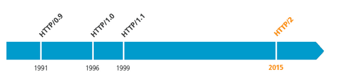
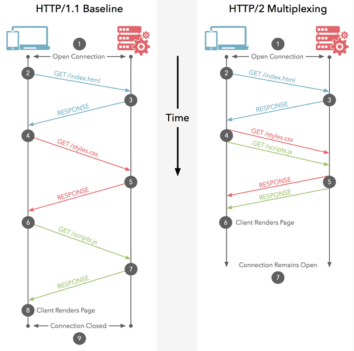
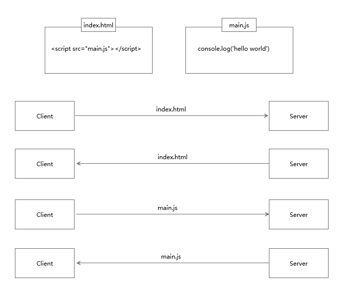
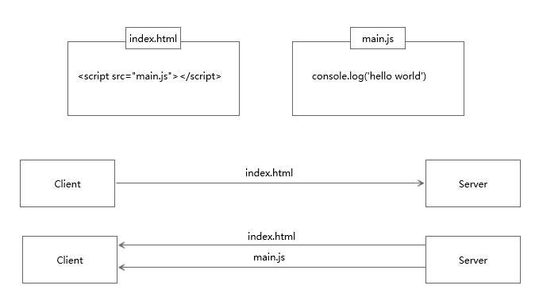

# HTTP迭代

前面我们大体了解一下关于HTTP协议的一些东西，例如：http和https的区别、Ajax异步请求、保持HTTP连接状态会话Cookie技术。这些只是整个HTTP的冰山一角，作为爬虫工程师需要对HTTP协议有更加深入的了解。

## HTTP历史

在HTTP建立之初，就是为了将超文本标记语言(HTML)文档从Web服务器传送到客户端的浏览器。也是说，我们所写的HTML页面将要放在我们的web服务器上，用户端通过浏览器访问url地址来获取网页的显示内容，但是到了WEB2.0以来，我们的页面变得复杂，不仅仅单纯的是一些简单的文字和图片，同时我们的HTML页面有了CSS，Javascript，来丰富我们的页面展示，当ajax的出现，我们又多了一种向服务器端获取数据的方法，这些其实都是基于HTTP协议的。同样到了移动互联网时代，我们页面可以跑在手机端浏览器里面，但是和PC相比，手机端的网络情况更加复杂，这使得我们开始了不得不对HTTP进行深入理解并不断优化过程中。

### HTTP优化

影响一个HTTP网络请求的因素主要有两个：带宽因素、延迟因素。
**带宽因素**：如果说我们还停留在拨号上网的阶段，带宽可能会成为一个比较严重影响请求的问题，但是现在网络基础建设已经使得带宽得到极大的提升，我们不再会担心由带宽而影响网速，那么就只剩下延迟了。

**延迟因素**：

- 浏览器阻塞（HOL blocking）：浏览器会因为一些原因阻塞请求。浏览器对于同一个域名，同时只能有 4 个连接（这个根据浏览器内核不同可能会有所差异），超过浏览器最大连接数限制，后续请求就会被阻塞。
- DNS 查询（DNS Lookup）：浏览器需要知道目标服务器的 IP 才能建立连接。将域名解析为 IP 的这个系统就是 DNS。这个通常可以利用DNS缓存结果来达到减少这个时间的目的。
- 建立连接（Initial connection）：HTTP 是基于 TCP 协议的，浏览器最快也要在第三次握手时才能捎带 HTTP 请求报文，达到真正的建立连接，但是这些连接无法复用会导致每次请求都经历三次握手和慢启动。三次握手在高延迟的场景下影响较明显，慢启动则对文件类大请求影响较大。

### HTTP版本

HTTP版本历史进度图：



#### HTTP1.0

HTTP1.0最早在网页中使用是在1996年，那个时候只是使用一些较为简单的网页上和网络请求上。

HTTP1.0中主要使用header里的If-Modified-Since,Expires来做为缓存判断的标准。

HTTP1.0中存在一些浪费带宽的现象，例如客户端只是需要某个对象的一部分，而服务器却将整个对象送过来了，并且不支持断点续传功能。

#### HTTP1.1

HTTP1.1则在1999年才开始广泛应用于现在的各大浏览器网络请求中，同时HTTP1.1也是当前使用最为广泛的HTTP协议。 主要区别主要体现在：

1. **缓存处理**，引入了更多的缓存控制策略例如Entity tag，If-Unmodified-Since, If-Match, If-None-Match等更多可供选择的缓存头来控制缓存策略。
2. **带宽优化及网络连接的使用**，在请求头引入了range头域，它允许只请求资源的某个部分，即返回码是206（Partial Content），这样就方便了开发者自由的选择以便于充分利用带宽和连接。
3. **错误通知的管理**，新增了24个错误状态响应码，如409（Conflict）表示请求的资源与资源的当前状态发生冲突；410（Gone）表示服务器上的某个资源被永久性的删除。
4. **Host头处理**，在HTTP1.0中认为每台服务器都绑定一个唯一的IP地址，因此，请求消息中的URL并没有传递主机名（hostname）。但随着虚拟主机技术的发展，在一台物理服务器上可以存在多个虚拟主机（Multi-homed Web Servers），并且它们共享一个IP地址。HTTP1.1的请求消息和响应消息都应支持Host头域，且请求消息中如果没有Host头域会报告一个错误（400 Bad Request）。
5. **长连接**，HTTP 1.1支持长连接（PersistentConnection）和请求的流水线（Pipelining）处理，在一个TCP连接上可以传送多个HTTP请求和响应，减少了建立和关闭连接的消耗和延迟，在HTTP1.1中默认开启Connection： keep-alive，一定程度上弥补了HTTP1.0每次请求都要创建连接的缺点。

#### HTTP2.0

HTTP2.0是HTTP协议的一个主要的新迭代，并没有改变请求或响应的核心语义，而是改变了向服务器发送数据和从服务器发送数据的方式，提供了一种更高效的传输，具有潜在的性能优势。

1. **新的二进制格式**（Binary Format），HTTP1.x的解析是基于文本。基于文本协议的格式解析存在天然缺陷，文本的表现形式有多样性，要做到健壮性考虑的场景必然很多，二进制则不同，只认0和1的组合。基于这种考虑HTTP2.0的协议解析决定采用二进制格式，实现方便且健壮。
2. **多路复用**（MultiPlexing），即连接共享，即每一个request都是是用作连接共享机制的。一个request对应一个id，这样一个连接上可以有多个request，每个连接的request可以随机的混杂在一起，接收方可以根据request的 id将request再归属到各自不同的服务端请求里面。
3. **header压缩**，如上文中所言，对前面提到过HTTP1.x的header带有大量信息，而且每次都要重复发送，HTTP2.0使用encoder来减少需要传输的header大小，通讯双方各自cache一份header fields表，既避免了重复header的传输，又减小了需要传输的大小。
4. **服务端推送**（server push），同SPDY一样，HTTP2.0也具有server push功能。

#### 复用区别

HTTP2.0的多路复用和HTTP1.X中的长连接复用有什么区别？

- HTTP/1.* 一次请求-响应，建立一个连接，用完关闭；每一个请求都要建立一个连接；
- HTTP/1.1 Pipeling解决方式为，若干个请求排队串行化单线程处理，后面的请求等待前面请求的返回才能获得执行机会，一旦有某请求超时等，后续请求只能被阻塞，毫无办法，也就是人们常说的线头阻塞；
- HTTP/2多个请求可同时在一个连接上并行执行。某个请求任务耗时严重，不会影响到其它连接的正常执行；
  具体如图：



#### 头部压缩

假定一个页面有100个资源需要加载（这个数量对于今天的Web而言还是挺保守的）, 而每一次请求都有1kb的消息头（这同样也并不少见，因为Cookie和引用等东西的存在）, 则至少需要多消耗100kb来获取这些消息头。HTTP2.0可以维护一个字典，差量更新HTTP头部，大大降低因头部传输产生的流量。具体参考：[HTTP/2 头部压缩技术介绍](https://links.jianshu.com/go?to=https%3A%2F%2Fimququ.com%2Fpost%2Fheader-compression-in-http2.html)

#### 服务端推送

服务端推送能把客户端所需要的资源伴随着index.html一起发送到客户端，省去了客户端重复请求的步骤。正因为没有发起请求，建立连接等操作，所以静态资源通过服务端推送的方式可以极大地提升速度。具体如下：

普通的客户端请求过程：



服务端推送的过程：



#### 性能测试

[HTTP/2: the Future of the Internet](https://links.jianshu.com/go?to=https%3A%2F%2Flink.zhihu.com%2F%3Ftarget%3Dhttps%3A%2F%2Fhttp2.akamai.com%2Fdemo) 是 Akamai 公司建立的一个官方的演示，用以说明 HTTP/2 相比于之前的 HTTP/1.1 在性能上的大幅度提升。 同时请求 379 张图片，从Load time 的对比可以看出 HTTP/2 在速度上的优势。


## HTTP应用

### 服务器HTTP版本

在'开发者工具栏'点击 `Network` 选择一个请求，点击 `Headers` 可以看到在 `Response Headers` 右侧有一个 `View source` 选项：


点击 `View source` 选项第一行就可以看到服务器HTTP版本：


?> 只有部分请求在 `Response Headers` 右侧会有 `View source` 选项。

?> 目前绝大部分的服务器使用的都是HTTP1.1的版本。

不仅如此，还可以通过httpx库中响应的 `http_version` 属性确定服务器使用的HTTP版本：

```python
import httpx

url = '...'
response = client.get(url=url)
# 输出服务器使用了哪个版本的HTTP协议
print(response.http_version)  # "HTTP/1.0" or "HTTP/1.1" or "HTTP/2"
```

### HTTP2爬虫

前面讲过requests库不支持http2.0，而httpx库支持。因此这里就轮到httpx大显身手了。

首先安装可以选用http2.0的httpx库：

```
pip install httpx[http2]
```

通过实例化启功支持http2的客户端：

```python
client = httpx.Client(http2=True)
```

启动后，就可以开始爬取数据了。例如下面的这道题的名称为：天杀的http2.0（提示本题采用的http2.0），题目地址：https://match.yuanrenxue.com/match/17，爬虫代码如下：

```python
import re
import httpx

# 启动支持http2的client
client = httpx.Client(http2=True)

# 请求头
headers = {
    'accept': 'application/json, text/javascript, */*; q=0.01',
    'accept-encoding': 'gzip, deflate, br',
    'accept-language': 'zh-CN,zh;q=0.9',
    'cookie': '自己当前的cookie',
    'referer': 'https://match.yuanrenxue.com/match/17',
    'sec-ch-ua': '"Google Chrome";v="94", " Not;A Brand";v="99", "Chromium";v="99"',
    'sec-ch-ua-mobile': '?0',
    'sec-ch-ua-platform': '"Windows"',
    'sec-fetch-dest': 'empty',
    'sec-fetch-mode': 'cors',
    'sec-fetch-site': 'same-origin',
    'user-agent': 'yuanrenxue.project',
    'x-requested-with': 'XMLHttpRequest'
}

# 数值
values = 0

# 共5页数据
for page in range(1, 6):
    # 接口地址
    url = f'https://match.yuanrenxue.com/api/match/17?page={page}'
    print(url)
    # 输出响应
    response = client.get(url=url, headers=headers)
    print(response.http_version)
    print(f'第{page}页:{response.text}')
    for v in re.findall(r'{"value": (-?\d+)}', response.text):
        values += int(v)

# 总值
print(values)
```

?> 请求和响应通过HTTP/2传输，意味着客户机和服务器都需要支持HTTP/2。如果连接到仅支持HTTP/1.1的服务器，则客户端将使用标准HTTP/1.1连接。
