# 通信协议

前面我们大体了解一下关于通信协议的一些东西，例如：http和https的区别、Ajax异步请求、保持HTTP连接状态会话Cookie技术。这些只是整个通信协议的冰山一角，作为爬虫工程师需要对通信协议有更加深入的了解。

## 网络七层协议

**OSI 参考模型将整个网络通信的功能划分为七个层次。它们由低到高分别是物理层(PH)、数据链路层(DL)、网络层(N)、传输层(T)、会话层(S)、表示层(P)、应用层(A)。每层完成一定的功能，每层都直接为其上层提供服务，并且所有层次都互相支持。**

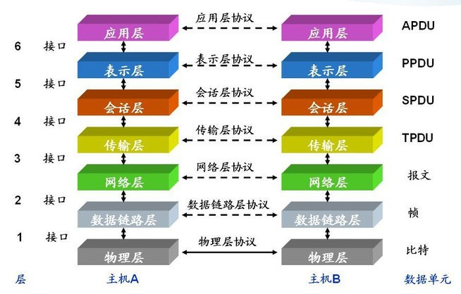

## TCP协议

**传输控制协议（TCP，Transmission Control Protocol）是一种面向连接的、可靠的、基于字节流的传输层通信协议，在OSI 7层模型中的TCP协议工作在传输层（第4层）。**

### 三次握手

**TCP是因特网中的传输层协议，使用三次握手协议建立连接。**TCP三次握手连接建立过程：

  Step1：客户端发送一个SYN=1，ACK=0标志的数据包给服务端，请求进行连接，这是第一次握手；

  Step2：服务端收到请求并且允许连接的话，就会发送一个SYN=1，ACK=1标志的数据包给发送端，告诉它，可以通讯了，并且让客户端发送一个确认数据包，这是第二次握手；

  Step3：服务端发送一个SYN=0，ACK=1的数据包给客户端端，告诉它连接已被确认，这就是第三次握手。TCP连接建立，开始通讯。


wireshark抓包展示三次握手：

Step1：启动wireshark抓包，打开浏览器输入www.huawei.com。

Step2：使用ping www.huawei.com获取IP。


Step3：输入过滤条件获取待分析数据包列表 `ip.addr == 211.162.2.183`


**第一次握手数据包**：客户端发送一个TCP，标志位为SYN，序列号为0， 代表客户端请求建立连接。数据包的关键属性如下：

 SYN ：标志位，表示请求建立连接

 Seq = 0 ：初始建立连接值为0，数据包的相对序列号从0开始，表示当前还没有发送数据

 Ack =0：初始建立连接值为0，已经收到包的数量，表示当前没有接收到数据


**第二次握手的数据包**：服务器发回确认包, 标志位为 SYN,ACK. 将确认序号(Acknowledgement Number)设置为客户的I S N加1以.即0+1=1。数据包的关键属性如下：

[SYN + ACK] : 标志位，同意建立连接，并回送SYN+ACK

 Seq = 0 ：初始建立值为0，表示当前还没有发送数据

 Ack = 1：表示当前端成功接收的数据位数，虽然客户端没有发送任何有效数据，确认号还是被加1，因为包含SYN或FIN标志位。（并不会对有效数据的计数产生影响，因为含有SYN或FIN标志位的包并不携带

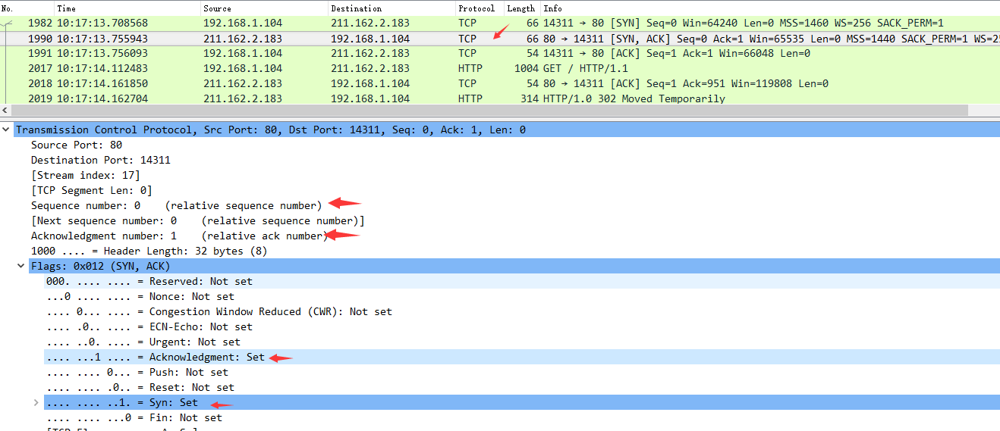

**第三次握手的数据包**：客户端再次发送确认包(ACK) SYN标志位为0,ACK标志位为1.并且把服务器发来ACK的序号字段+1,放在确定字段中发送给对方.并且在数据段放写ISN的+1。数据包的关键属性如下：

 ACK ：标志位，表示已经收到记录

 Seq = 1 ：表示当前已经发送1个数据

 Ack = 1 : 表示当前端成功接收的数据位数，虽然服务端没有发送任何有效数据，确认号还是被加1，因为包含SYN或FIN标志位（并不会对有效数据的计数产生影响，因为含有SYN或FIN标志位的包并不携带有效数据)。


就这样通过了TCP三次握手，建立了连接。

### 四次挥手

建立一个连接需要三次握手，而终止一个连接要经过四次握手，这是由TCP的半关闭（half-close）造成的。TCP是一个全双工通信机制的协议，只有双方都关闭的时候才表示这个连接断开了。


wireshark抓包展示四次挥手：

其中 183.136.236.13 是服务器的ip，可以看到 这一次挥手是由服务器发起的。


**第一次挥手**：FIN+ACK

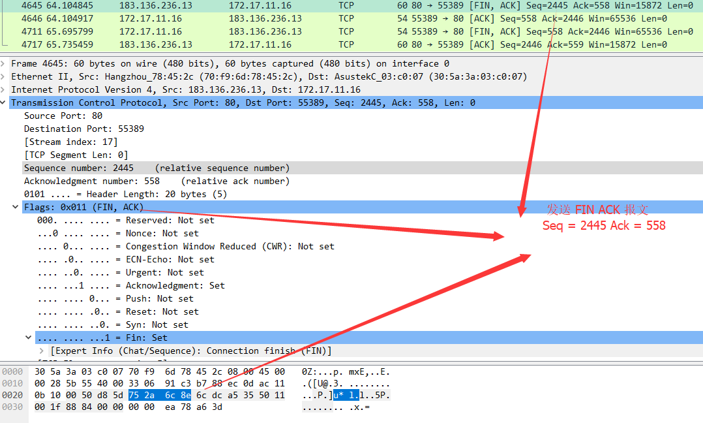

**第二次挥手**：ACK


**第三次挥手**：FIN+ACK

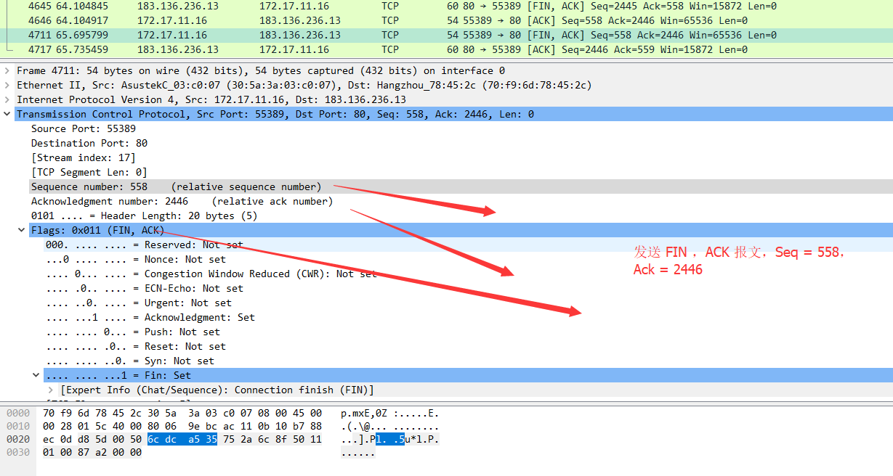

**第四次挥手**：ACK


## HTTP协议

**超文本传输协议（Hyper Text Transfer Protocol，HTTP）是一个简单的请求-响应协议，它通常运行在TCP之上。在OSI 7层模型中的HTTP协议工作在应用层（第7层）。**图中可以看到wireshark截获到了三次握手的三个数据包。第四个包才是HTTP的， 这说明HTTP的确是使用TCP建立连接的。


在HTTP建立之初，就是为了将超文本标记语言(HTML)文档从Web服务器传送到客户端的浏览器。也是说，我们所写的HTML页面将要放在我们的web服务器上，用户端通过浏览器访问url地址来获取网页的显示内容，但是到了WEB2.0以来，我们的页面变得复杂，不仅仅单纯的是一些简单的文字和图片，同时我们的HTML页面有了CSS，Javascript，来丰富我们的页面展示，当ajax的出现，我们又多了一种向服务器端获取数据的方法，这些其实都是基于HTTP协议的。同样到了移动互联网时代，我们页面可以跑在手机端浏览器里面，但是和PC相比，手机端的网络情况更加复杂，这使得我们开始了不得不对HTTP进行深入理解并不断优化过程中。

### HTTP优化

影响一个HTTP网络请求的因素主要有两个：带宽因素、延迟因素。
**带宽因素**：如果说我们还停留在拨号上网的阶段，带宽可能会成为一个比较严重影响请求的问题，但是现在网络基础建设已经使得带宽得到极大的提升，我们不再会担心由带宽而影响网速，那么就只剩下延迟了。

**延迟因素**：

- 浏览器阻塞（HOL blocking）：浏览器会因为一些原因阻塞请求。浏览器对于同一个域名，同时只能有 4 个连接（这个根据浏览器内核不同可能会有所差异），超过浏览器最大连接数限制，后续请求就会被阻塞。
- DNS 查询（DNS Lookup）：浏览器需要知道目标服务器的 IP 才能建立连接。将域名解析为 IP 的这个系统就是 DNS。这个通常可以利用DNS缓存结果来达到减少这个时间的目的。
- 建立连接（Initial connection）：HTTP 是基于 TCP 协议的，浏览器最快也要在第三次握手时才能捎带 HTTP 请求报文，达到真正的建立连接，但是这些连接无法复用会导致每次请求都经历三次握手和慢启动。三次握手在高延迟的场景下影响较明显，慢启动则对文件类大请求影响较大。

### HTTP版本

HTTP版本历史进度图：


HTTP1.0最早在网页中使用是在1996年，那个时候只是使用一些较为简单的网页上和网络请求上。

1. HTTP1.0中主要使用header里的If-Modified-Since,Expires来做为缓存判断的标准。

2. HTTP1.0中存在一些浪费带宽的现象，例如客户端只是需要某个对象的一部分，而服务器却将整个对象送过来了，并且不支持断点续传功能。

HTTP1.1则在1999年才开始广泛应用于现在的各大浏览器网络请求中，同时HTTP1.1也是当前使用最为广泛的HTTP协议。 主要区别主要体现在：

1. **缓存处理**，引入了更多的缓存控制策略例如Entity tag，If-Unmodified-Since, If-Match, If-None-Match等更多可供选择的缓存头来控制缓存策略。
2. **带宽优化及网络连接的使用**，在请求头引入了range头域，它允许只请求资源的某个部分，即返回码是206（Partial Content），这样就方便了开发者自由的选择以便于充分利用带宽和连接。
3. **错误通知的管理**，新增了24个错误状态响应码，如409（Conflict）表示请求的资源与资源的当前状态发生冲突；410（Gone）表示服务器上的某个资源被永久性的删除。
4. **Host头处理**，在HTTP1.0中认为每台服务器都绑定一个唯一的IP地址，因此，请求消息中的URL并没有传递主机名（hostname）。但随着虚拟主机技术的发展，在一台物理服务器上可以存在多个虚拟主机（Multi-homed Web Servers），并且它们共享一个IP地址。HTTP1.1的请求消息和响应消息都应支持Host头域，且请求消息中如果没有Host头域会报告一个错误（400 Bad Request）。
5. **长连接**，HTTP 1.1支持长连接（PersistentConnection）和请求的流水线（Pipelining）处理，在一个TCP连接上可以传送多个HTTP请求和响应，减少了建立和关闭连接的消耗和延迟，在HTTP1.1中默认开启Connection： keep-alive，一定程度上弥补了HTTP1.0每次请求都要创建连接的缺点。

HTTP2.0是HTTP协议的一个主要的新迭代，并没有改变请求或响应的核心语义，而是改变了向服务器发送数据和从服务器发送数据的方式，提供了一种更高效的传输，具有潜在的性能优势。

1. **新的二进制格式**（Binary Format），HTTP1.x的解析是基于文本。基于文本协议的格式解析存在天然缺陷，文本的表现形式有多样性，要做到健壮性考虑的场景必然很多，二进制则不同，只认0和1的组合。基于这种考虑HTTP2.0的协议解析决定采用二进制格式，实现方便且健壮。
2. **多路复用**（MultiPlexing），即连接共享，即每一个request都是是用作连接共享机制的。一个request对应一个id，这样一个连接上可以有多个request，每个连接的request可以随机的混杂在一起，接收方可以根据request的 id将request再归属到各自不同的服务端请求里面。
3. **header压缩**，如上文中所言，对前面提到过HTTP1.x的header带有大量信息，而且每次都要重复发送，HTTP2.0使用encoder来减少需要传输的header大小，通讯双方各自cache一份header fields表，既避免了重复header的传输，又减小了需要传输的大小。
4. **服务端推送**（server push），同SPDY一样，HTTP2.0也具有server push功能。

### 服务器版本

在'开发者工具栏'点击 `Network` 选择一个请求，点击 `Headers` 可以看到在 `Response Headers` 右侧有一个 `View source` 选项：

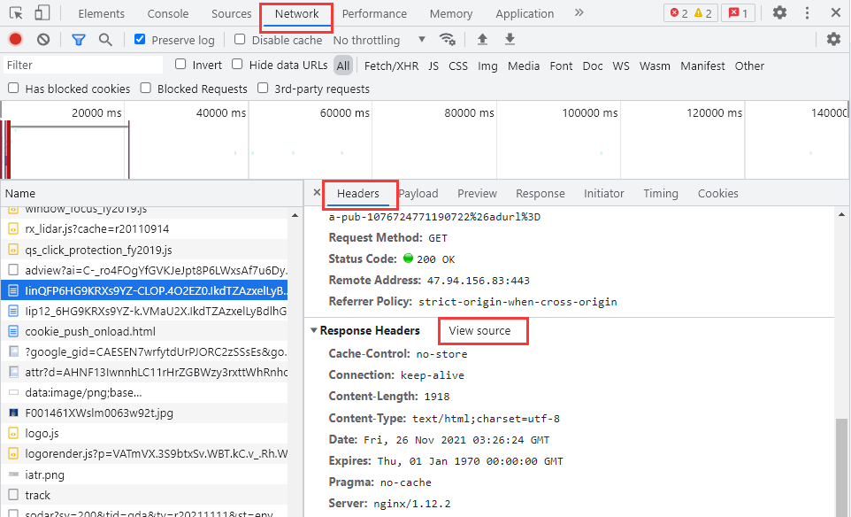

点击 `View source` 选项第一行就可以看到服务器HTTP版本：

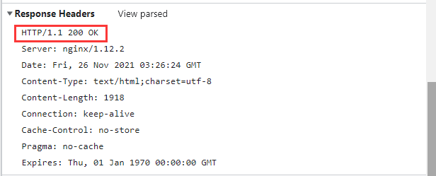

?> 只有部分请求在 `Response Headers` 右侧会有 `View source` 选项。

?> 目前绝大部分的服务器使用的都是HTTP1.1的版本。

不仅如此，还可以通过httpx库中响应的 `http_version` 属性确定服务器使用的HTTP版本：

```python
import httpx

url = '...'
response = client.get(url=url)
# 输出服务器使用了哪个版本的HTTP协议
print(response.http_version)  # "HTTP/1.0" or "HTTP/1.1" or "HTTP/2"
```

### HTTP2优势

**复用区别**：HTTP2.0的多路复用和HTTP1.X中的长连接复用有什么区别？

- HTTP/1.* 一次请求-响应，建立一个连接，用完关闭；每一个请求都要建立一个连接；
- HTTP/1.1 Pipeling解决方式为，若干个请求排队串行化单线程处理，后面的请求等待前面请求的返回才能获得执行机会，一旦有某请求超时等，后续请求只能被阻塞，毫无办法，也就是人们常说的线头阻塞；
- HTTP/2多个请求可同时在一个连接上并行执行。某个请求任务耗时严重，不会影响到其它连接的正常执行；
  具体如图：

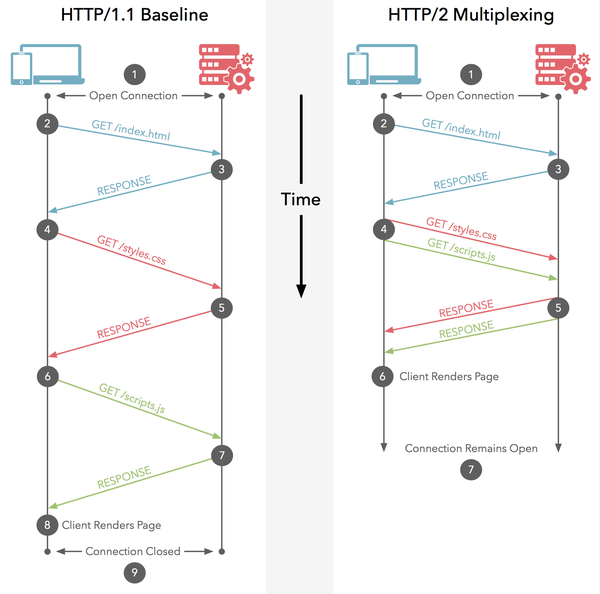

**头部压缩**：假定一个页面有100个资源需要加载（这个数量对于今天的Web而言还是挺保守的）, 而每一次请求都有1kb的消息头（这同样也并不少见，因为Cookie和引用等东西的存在）, 则至少需要多消耗100kb来获取这些消息头。HTTP2.0可以维护一个字典，差量更新HTTP头部，大大降低因头部传输产生的流量。具体参考：[HTTP/2 头部压缩技术介绍](https://links.jianshu.com/go?to=https%3A%2F%2Fimququ.com%2Fpost%2Fheader-compression-in-http2.html)

**服务端推送**：服务端推送能把客户端所需要的资源伴随着index.html一起发送到客户端，省去了客户端重复请求的步骤。正因为没有发起请求，建立连接等操作，所以静态资源通过服务端推送的方式可以极大地提升速度。具体如下：

普通的客户端请求过程：

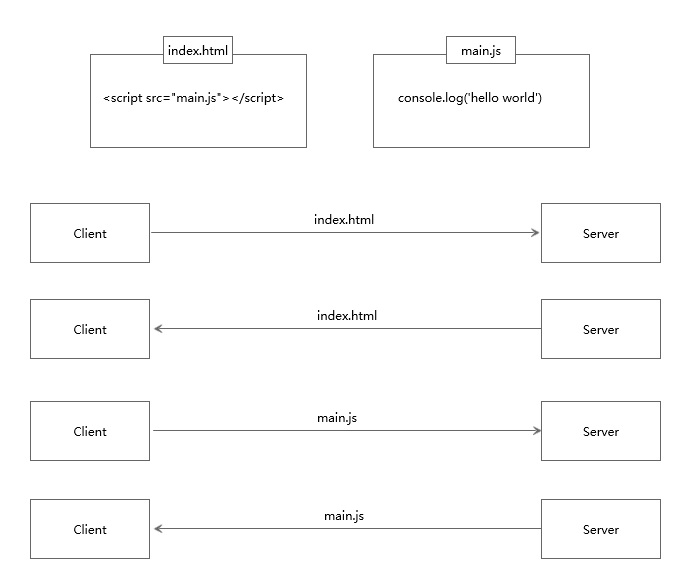

服务端推送的过程：

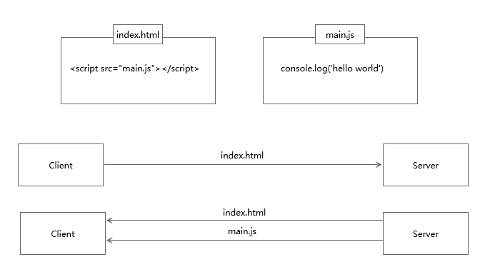

**性能测试**：[HTTP/2: the Future of the Internet](https://links.jianshu.com/go?to=https%3A%2F%2Flink.zhihu.com%2F%3Ftarget%3Dhttps%3A%2F%2Fhttp2.akamai.com%2Fdemo) 是 Akamai 公司建立的一个官方的演示，用以说明 HTTP/2 相比于之前的 HTTP/1.1 在性能上的大幅度提升。 同时请求 379 张图片，从Load time 的对比可以看出 HTTP/2 在速度上的优势。


### HTTP2爬虫

前面讲过requests库不支持http2.0，而httpx库支持。因此这里就轮到httpx大显身手了。

首先安装可以选用http2.0的httpx库：

```
pip install httpx[http2]
```

通过实例化启功支持http2的客户端：

```python
client = httpx.Client(http2=True)
```

启动后，就可以开始爬取数据了。例如下面的这道题的名称为：天杀的http2.0（提示本题采用的http2.0），题目地址：https://match.yuanrenxue.com/match/17，爬虫代码如下：

```python
import re
import httpx

# 启动支持http2的client
client = httpx.Client(http2=True)

# 请求头
headers = {
    'accept': 'application/json, text/javascript, */*; q=0.01',
    'accept-encoding': 'gzip, deflate, br',
    'accept-language': 'zh-CN,zh;q=0.9',
    'cookie': '自己当前的cookie',
    'referer': 'https://match.yuanrenxue.com/match/17',
    'sec-ch-ua': '"Google Chrome";v="94", " Not;A Brand";v="99", "Chromium";v="99"',
    'sec-ch-ua-mobile': '?0',
    'sec-ch-ua-platform': '"Windows"',
    'sec-fetch-dest': 'empty',
    'sec-fetch-mode': 'cors',
    'sec-fetch-site': 'same-origin',
    'user-agent': 'yuanrenxue.project',
    'x-requested-with': 'XMLHttpRequest'
}

# 数值
values = 0

# 共5页数据
for page in range(1, 6):
    # 接口地址
    url = f'https://match.yuanrenxue.com/api/match/17?page={page}'
    print(url)
    # 输出响应
    response = client.get(url=url, headers=headers)
    print(response.http_version)
    print(f'第{page}页:{response.text}')
    for v in re.findall(r'{"value": (-?\d+)}', response.text):
        values += int(v)

# 总值
print(values)
```

?> 请求和响应通过HTTP/2传输，意味着客户机和服务器都需要支持HTTP/2。如果连接到仅支持HTTP/1.1的服务器，则客户端将使用标准HTTP/1.1连接。

## TLS协议

**安全传输层协议（Transport Layer Security，TLS）用于在两个通信应用程序之间提供保密性和数据完整性。该协议由两层组成： TLS 记录协议（TLS Record）和 TLS 握手协议（TLS Handshake），在OSI 7层模型中的TLS协议工作在传输层（第4层）。**

### TLS简介

在最前面我们提到过：**HTTP协议运行在TCP之上，所有传输的内容都是明文，HTTPS运行在SSL/TLS之上，SSL/TLS运行在TCP之上，所有传输的内容都经过加密的。其中，SSL就是安全套接层（Secure Socket Layer），在SSL更新到3.0时，IETF对SSL3.0进行了标准化，并更名为TLS1.0，可以说TLS就是SSL的新版本3.1。目前，TLS有1.0、1.1、1.2三个版本。**

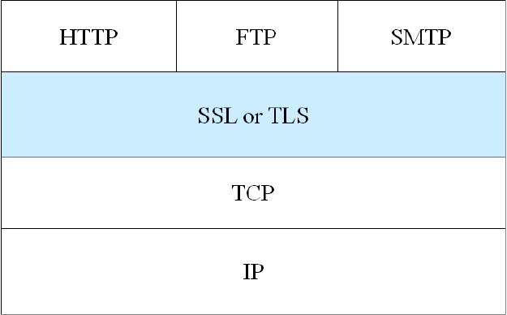

### TLS通信说明

**wireshark抓包内容及简单说明：**以访问[ www.sina.com.cn](http://www.sina.com.cn/)为例，抓包解析TLS1.2到底是如何通信的。


**客户端Client Hello阶段：**客户端向服务端发送建立连接请求；此时，客户端会携带支持的版本号、支持的加密套件、客户端随机数(用于协商对称加密的密钥)、支持的HTTP协议供服务端选择。

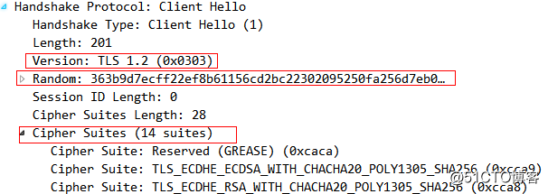

那么问题来了，TLS中哪一个才是最安全的cipher呢？最安全的三个候选者如下：

- TLS_ECDHE_RSA_WITH_AES_256_CBC_SHA384_P521
- TLS_ECDHE_RSA_WITH_AES_256_CBC_SHA384_P384
- TLS_ECDHE_RSA_WITH_AES_256_CBC_SHA384_P256

**服务端Server Hello阶段：**服务端回应客户客户端的招呼信息；根据客户端所携带的内容，确定建立连接版本、加密套件，生成服务端随机数(用于协商对称加密的密钥)。如下图，可以看到确定的加密套件是：TLS_ECDHE_RSA_WITH_AES_128_GCM_SHA256

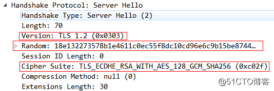

**服务端Certificate, Server Key Exchange, Server Hello Done阶段：**

Certificate：服务端向客户端发送由权威ca机构签发的数字证书（此证书包含服务端的公钥）以验证身份；


Server Key Exchange：服务端向客户端发送基于选择的加密套件生成的公钥；基于Server Hello阶段选择的ECDHE交换密钥算法，发送生成的公钥，用于协商出对称加密的密钥；

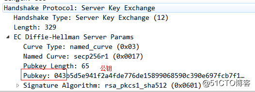

Server Hello Done：服务端向客户端表示响应结束；

**客户端Client Key Exchange, Change Cipher Spec, Encrypted Handshake Message阶段：**

Client Key Exchange：客户端向服务端发送自己生成的公钥；基于协商选择的ECDHE交换密钥算法，发送它生成的椭圆曲线的公钥，用于协商出对称加密的密钥；


Change Cipher Spec：变更密码规范协议，告知服务端/客户端，以后的通信都是基于AES加密的；，它非常简单，就是一条通知消息，告知对方以后的通信都是加密的；

Enctypted Handshare Message：基于协商生成的密钥，用AES加密验证信息让服务端/客户端进行认证；如果对方可以解密，则双方认证无误开始通信；

**服务端New Session Ticket, Change Cipher Spec, Encrypted Handshake Message阶段：**

New Session Ticket：TLS建立SSL连接的优化方法，此处不做特别说明；

Change Cipher Spec：告诉客户端以后的通信是加密的；

Enctypted Handshare Message：发送一条经过密钥加密的数据，让客户端验证；验证通过则开始进行加密通信；

**Applicatiion Data阶段：**表示客户端/服务端已经开始基于TLS进行通信了；

## DH密钥交换算法

### DH简介

**Diffie-Hellman密钥交换算法（简称 DH）：一种流行的密钥交换加密算法，它使得通信的双方能在“非安全”的信道中安全的交换密钥，用于加密后续的通信消息，比如 Https 协议的 TLS(Transport Layer Security) 和 IPsec 协议的 IKE(Internet Key Exchange) 均以 DH 算法作为密钥交换算法，可以说它是许多协议（包括HTTPS，SSH，IPsec，SMTPS和依赖TLS的协议）的基础。**

简单说，DH算法的唯一目的是使得两个用户能够安全地交换密钥，得到一个共享的会话密钥，用该密钥加密后续的通信消息，但算法本身不能用于加、解密，其安全性基于求离散对数的困难性。

### Logjam漏洞

2015年，研究人员发现了一个名为Logjam新的浏览器和网站加密漏洞，漏洞影响称为Diffie-Hellman密钥交换算法，该协议作为HTTPS, SSH, SMTPS协议的加密算法使用。


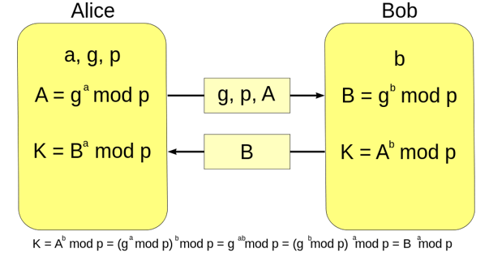

但如果在DH交互过程中Alice和Bob始终使用相同的私钥，就会导致后续产生的共享密钥是一样的，如果有嗅探者截获通信双方的所有数据，由于都是同一个密钥加密所得，一旦被破解，后续的通信将全部暴露。

不仅如此，一个主动的窃听者C可能截取A发给B的消息以及B发给A的消息，他用自己的消息替换这些消息，并分别与A和B完成一个Diffie-Hellman密钥交换，密钥交换协议完毕后，A实际上和C建立了一个会话密钥，B和C建立了一个会话密钥，当A加密一个消息发送给B时，C能解密它而B不能。类似地，当B加密一个消息发送给A时，C能解密它而A不能。

### 中间人攻击

**攻击者利用Logjam漏洞发起中间人式攻击，也会对TLS协议进行攻击，攻击者可以将TLS链接的加密算法的输出级别降至512位。这样会使得攻击者能够读取和修改使用这个链接进行传输的所有数据信息。**

**任何支持DHE_EXPORT加密算法的网站邮件服务器和其他基于TLS协议的服务器并且会影响所有的现代web浏览器都有被中间人攻击的危险。**我们使用互联网广域扫描来评估哪些服务器容易被攻击：

```
协议                      可被Logjam漏洞攻击
HTTPS前一百万域名               8.4%
HTTPS浏览器信任的站点            3.4%
SMTP+StartTLSIPv4地址空间     14.8%
POP3SIPv4地址空间              8.9%
IMAPSIPv4地址空间              8.4%
```

我们对TSL协议中最常用的512位初始序列进行了研究和计算结果显示中间人攻击能够使80%的使用了TLS DHE_EXPORT协议的服务器链接降级20%。因此我们进一步估计一个学术团队能够破解768位的初始序列而且一个国家级的团队能够破解1024位的初始序列。在这种情况下web服务器中所使用的最常见的1024位初始序列将会允许攻击者对排名在前一百万的HTTPS域名的通讯线路上实施被动窃听。如果最常见的1024位密钥组被破解将会产生漏洞的协议如下：

```
协议                         可被Logjam漏洞攻击
HTTPS前一百万域名                  17.9%
HTTPS浏览器信任的站点               6.6%
SSHIPv4地址空间                   25.7%
IKEv1(IPsec VPNs)IPv4地址空间     66.1%
```

我们已经公布了一个技术报告报告名为[《有缺陷的前端加密实践中的Diffie-Hellman是如何失败的》](https://weakdh.org/imperfect-forward-secrecy.pdf)报告内容的重点是关于这些攻击的内容还有关于我们如何破解最常见的512位Diffie-Hellman密码组合的详细信息还有我们对已被感染的服务器的测评。

**如果你有一个运行着的web服务器或邮件服务器，那么你应当禁止服务器对输出密码套件和生成唯一的2048位Diffie-Hellman密钥集的支持。**我们已经发布了一个[为TLS协议部署Diffie-Hellman的指导教程](https://weakdh.org/sysadmin.html)教程会对操作的每一步进行指导。如果你使用了SSH那么你应该将你的服务器和客户端进行升级至最新版的OpenSSH最新版的OpenSSH使用的是椭圆曲线的Diffie-Hellman密钥交换技术。

**如果你使用了一个浏览器，请确保你安装了最新版的浏览器并且经常去检查更新。Google Chrome浏览器(包括安卓版浏览器),Mozilla火狐浏览器微软的IE浏览器和苹果的Safari浏览器都针对Logjam漏洞进行了补丁修复。**

**如果你是一名系统管理员或开发者，请确保你所使用的所有TLS库都进行了更新并且移除所有小于1024位密钥的Diffie-Hellman密钥集。**

### 反DH检测爬虫

有时候，即使我们已经忽略警告并关闭了SSL验证，在某些服务器上验证时，还是会返回一个SSL错误，导致无法通过：

```python
import requests

data = {
    'mainZZ': '0',
    'aptText': '',
    'areaCode': '0',
    'entName': '',
    'pageSize': '10',
    'pageIndex': 1,
}
url = 'https://cxpt.fssjz.cn/cxpt/web/enterprise/getEnterpriseList.do'

requests.packages.urllib3.disable_warnings()
response = requests.post(url=url, data=data, verify=False)
print(response.text)

'''
输出：
...
requests.exceptions.SSLError: HTTPSConnectionPool(host='cxpt.fssjz.cn', port=443): Max retries exceeded with url: /cxpt/web/enterprise/getEnterpriseList.do (Caused by SSLError(SSLError("bad handshake: Error([('SSL routines', 'tls_process_ske_dhe', 'dh key too small')])")))
翻译：由SSL错误导致了错误的握手（“SSL例程”中的“tls进程”中的“dh密钥太小”）
'''
```

通过报错可知错误的原因是：**服务器检测到DH密钥太短小，很可能在中间人攻击中被破解，导致禁用警告或证书验证无济于事。**要解决此问题，就要不受弱DH密钥的影响，即要**选择一个不使用Diffie Hellman密钥交换的密码**，并且此密码必须由服务器支持。如果不知道服务器支持什么，可以尝试使用密码 `AES128-SHA` 或密码设置 `HIGH:!DH:!aNULL`。

```python
import requests

data = {
    'mainZZ': '0',
    'aptText': '',
    'areaCode': '0',
    'entName': '',
    'pageSize': '10',
    'pageIndex': 1,
}
url = 'https://cxpt.fssjz.cn/cxpt/web/enterprise/getEnterpriseList.do'

requests.packages.urllib3.disable_warnings()
# 添加默认密码HIGH:!DH:!aNULL
requests.packages.urllib3.util.ssl_.DEFAULT_CIPHERS += ':HIGH:!DH:!aNULL'
response = requests.post(url=url, data=data, verify=False)
print(response.text)

'''
输出：
{"total":8608,"data":[{"id":"54fbff74402344f28026b2cbf38bfd1d"...
'''
```


