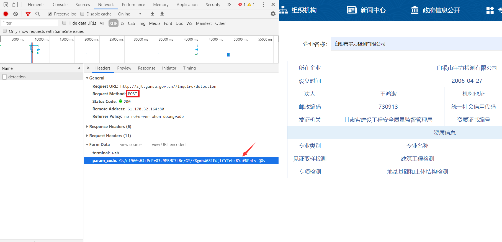
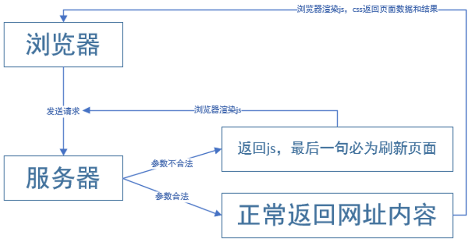
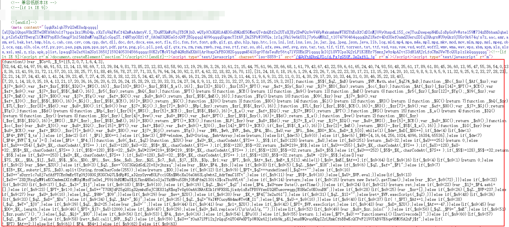

# 加密网页

目前，我们已经能爬取普通网页和含有Ajax网页的数据了，但这两类网页并不能代表所有的网页，还有一类网页就不是很好“对付”了，那个就是含有加密的网页了。网页的加密方式可以说是五花八门，如JS加密、CSS加密、字体加密等。

## JS加密

在所有的网页加密方式中，JS加密算是最常见的加密方式之一了。**前面我们提到过两种反爬方式，一是User-Agent反爬，二是封IP，而JS加密可以算做第三种反爬方式了。**

**JS：全称 JavaScript，是一种运行在浏览器里的前端语言**（虽然名称有 Java，但和 Java 没有半毛关系）

JS作用：及时响应用户的操作，实现网页特效，增加网页互动性。

JS应用场景：鼠标滑过弹出下拉菜单、新闻图片的轮换等。

### JS加密反爬

反爬的两大基本要素：1. 让浏览器正常访问，不影响用户体验；2. 让爬虫脚本无法访问，严重阻止爬虫工程师的工作。

爬虫与浏览器的区别：**普通的爬虫只是负责拿着你给的URL传递一些参数来获取网页源码，它们不能运行JS，也就无法对服务器需要验证的参数进行加密，从而导致服务器拒绝你的请求，给你返回一个不是你所期望的网页内容的页面，JS也就起到了反爬的作用。**


**JS可以对前端参数进行加密，以便服务器后台便于验证。**如对用户名和密码进行加密，后端可以判断是否是正确的请求还是恶意的攻击。确定JS反扒手段的特点：

1. cookie加密，访问网页有明显的卡顿现象；
2. get、post参数加密，例如：sign、safe、nfauifasqonc（不常规）；
3. headers加密

**JS加密的流程一般分为两类：使用现有的常见加密算法、使用自定义的加密算法。**

常见的加密算法：MD5加密（不可逆，生成32位字符串）、Base64编码（可逆）、DES加密（可逆）、AES加密（可逆）等。

#### POST加密

**JS加密一般是在请求头或者请求参数中加入加密字段，即加密大多出现在POST表单提交过程中。**



#### Cookie加密

JS不仅可以加密POST表单提交的参数，还可以加密Cookie。**通过加密后的Cookie，服务器可以识别是浏览器正确的请求，还是使用诸如Httpclient等框架在爬取网页内容了，所以就可以防止别人爬取网站里面的内容。**




#### 混淆加密

上面讲过，**JS加密的过程一定是在浏览器完成，也就是一定会把JS代码暴露给使用者，但是有的公司，为了防止JS加密的代码被他人使用或分析，还会对JS进行混淆加密，让JS的代码阅读性很差，来达到代码保护的目的。**



### 破解加密实战

#### 破解思路

方法一：把JS代码翻译成Python代码，这个是有难度的，因为爬虫偏向于后端的处理，JS属于前端，需要精通前端才行，还有一点就是经过加密，混淆，压缩的js代码阅读性很差。(技术要求偏高)

方法二： 扣js代码，使用Python的一些第三方库比如 pyv8库、execjs库去执行js代码。(需要额外学习js，建议)

方法三：使用selenium或者appiun等框架，驱动浏览器抓取数据，无视js加密。(效率低，稳定性差，不建议)

#### 破解AES加密

POST加密一般都会引入JS文件，如果使用的是常见的算法加密方式，就可能以下面这些词组来命名。例如：

```
crypto：密码
Encrypt：加密
Decrypt：解密
MD5：MD5加密
Base64：Base64编码
DES：DES加密
AES：AES加密
```

前端引入 `crypto.js` 进行加密，它相当于导入了所有的加密方式，可以选择性使用其中包含的加密方式。

前端引入 `aes.js` 进行加密，它相当于只导入了AES加密方式。

图中网站使用了加密算法，让**POST提交的参数**和**Response响应的内容**都不具有可读性，加密方式暂不确定。


通过查看JS一栏，看到一个名称很熟悉的文件 `aes.js`，查看文件内容，就是JS编写的AES加密方法，**也就基本可以判定该网站引用了AES加密，不然引用这个JS加密文件干嘛呢。**


**AES是对称加密算法，接下来就要确定该算法的加密模式，在 `utils.js` 文件中我们找到了答案，当中 `CryptoJS.mode.ECB` 确定了加密模式位ECB加密模式， `CryptoJS.pad.Pkcs7` 确定了填充方式是Pkcs7填充。**

**因为对称算法的特性，加密和解密使用是同一密匙，自热而然就理解 `aesKey` 是接受密匙的变量。**

?> 不清楚加密模式和填充方式的查看[爬虫06-数据加密解密](爬虫06-数据加密解密.md)。


通过文件的地址，在浏览器中 `Sources` 中找到该文件并开始调试。


**通过打断点调试的方式，获得加密参数为：`白银市宇力检测有限公司`，加密密匙为：`YWJjZGVmZ2hpamts`。**

?> 不清楚Chrome浏览器调试参看[爬虫进阶之 JS 破解](https://mp.weixin.qq.com/s/uoAnLYNrTsNn_YowWyXfyg)。


**获得了加密密匙，结合[爬虫06-数据加密解密](爬虫06-数据加密解密.md)讲解的AES解密函数，现在基本就可以宣告成功破解了该JS加密。**现在来解密前面加密后的参数和返回的加密结果：

```python
import base64
from Crypto.Cipher import AES

# 加密后的参数
str1 = "Gs/nl960sHJcPrPr83z9MRMC7LBr/GY/K8gmbW68iFdjLCYTehkRYafNPbLvsQ8v"
# 加密后的结果
str2 = "+LZgDXrUvn52pmaRCuHYFlNTvfhGg9p7waDQjjW54Kf334rhYVaS7eN/5USlS6d9NKDpcBGl0GzPqlLY6qb70TB90VLhfFhW6zT3fWTp/dZTQbO/ZNK3ui57bLi7K4uyMmE3xzM1bF+gO7de4rIzH93dGG3/DsIXgaEwK5qn4r6gTW4oyz6LXKKUSOubFXeCnqSVRGnQorAs/9HLm3R6o9Uasfjv5LA08vJ5fRuvsY3F3vXIxXpPyY7e10hnYCMGAo1fvm1I86q0U2BBxRkQDcgRjlEcBXmG9xbocqX8m3HCPZCVPs82sAE2yUCUDpOZ4KVCUtzkpSQr0I/Bt2tJwyG/cgf5aVKOBUJdCX3jMS/t4TRvE9SZJTUMxdjwZKTd0EfyQjdQAGCo6K+Jxil8wjYhhzsDsWu3Aga8LC1+j2WpkzjBDrJ4jMsgCEdHuNXr8KpOmuZvQD/JZKZmqceZd4HpEXigmlog86hfNG9unUSvdCnkittVLYZz9OaWV1Tq1Loa0O4T/jrVQhcmpJM/dA8qkPRS8m1RjWXgpeGDQ1aDT48082kJ3QIm3RHqGfV4e0e0wpdWDCK2TmbcOM2PT2WXOvWOPXoeI2KRpEVwJaOJE2T0dZe7Y7BYHsootmampwZxnObjiqWJiqU7rA6ejLDFkFCtKrodymMKm7gf7Ee2+NqoQTEtBa8y348NzPhK9sgz6rGS6Q5d8BaX8rcWDH0LTMvi28tMgEr7OpyURucomYTeLjIqDmGsLiLwezbWxaB9QvAvHvg6Wavd2Z4IBL0WVl3YJzrHjxmy4VLCJHOzheKeLebOYTpqf5plfIx2ZstWlVi3OPFnNgnmGkTw3trYQeOIIUzGU+TkYKD8tzWQjGAmnM77bNieLHZus+TiGs5+MvGKWJnerL0SpK5mye7jX1wqJPIu0aPklZZ0B+LZ7dazpQAlbYTIH1EczHsELHwGY4m65XwMcztn27y7x9ZryvsLcmIC4bVENmeREWalgedTFZa+zEQ/yoCPCUrVyFCdlaeAz7JidLFSZulycdZp8o+O568We+83a4B+lMrDe4jLnuK0xXdPyyNgdlmvNYJH1Gbds8Iq8HKRiSZ7XA=="

# 解密函数
def AES_Decrypt(data, key):
    cipher = AES.new(key.encode('UTF-8'), AES.MODE_ECB)
    text = base64.b64decode(data.encode('utf8'))
    result = cipher.decrypt(text)
    detext = result.decode('UTF-8')
    return detext[0:len(detext)-ord(detext[-1])]

print('解密后的参数：'+AES_Decrypt(str1, 'YWJjZGVmZ2hpamts'))
print('解密后的结果：'+AES_Decrypt(str2, 'YWJjZGVmZ2hpamts'))

'''
输出：
解密后的参数：{"en":"白银市宇力检测有限公司"}
解密后的结果：{
  "type" : "SUCCESS",
  "key" : "200",
  "message" : "数据查询成功",
  "data" : [ {
    "POSTALCODE" : "730913",
    "APTITUDENUM" : "甘建检字第6204083号",
    "ADDRESS" : "甘肃省白银市平川区向阳路北侧",
    "ENTERPRISENAME" : "白银市宇力检测有限公司",
    "ENTERPRISECREATETIME" : "2006-04-27",
    "LEGALPERSON" : "王鸿淑",
    "AREANAME" : "白银市",
    "GRANTCERTIFICATEDEPART" : "甘肃省建设工程安全质量监督管理局",
    "LICENCENUM" : "916204037840388071",
    "CATEGORYNEW" : "[{\"APTITUDECATEGORYNAME\":\"见证取样检测\",\"APTITUDESPECIALITYNAME\":\"建筑工程检测\",\"APTITUDEGRADE\":\"乙级\"},{\"APTITUDECATEGORYNAME\":\"专项检测\",\"APTITUDESPECIALITYNAME\":\"地基基础和主体结构检测\",\"APTITUDEGRADE\":\"乙级\"}]"
  } ]
}
'''
```

#### Selenium框架

**Selenium：基于浏览器自动化测试框架，可以驱动本地的谷歌或火狐等浏览器进行操作，还可以运行JS**。

先用requests方法来获取来获取含有JS加密的网页代码：

```python
import requests
from fake_useragent import UserAgent

# 网站url
url = 'https://www.hapag-lloyd.cn/zh/home.html#hal-map'
# 请求头
headers = {'user-agent':UserAgent().random}

response = requests.get(url=url,headers=headers)
print(response.text)

'''
输出：
<!DOCTYPE html>
<html><head>
# 下面就是未加载JS的数据，从中我们获取不到任何有用的信息
...
window.kGv=!!window.kGv;try{(function(){(function LJ(){var L=!1;function z(L){for(var s=0;L--;)s+=_(document.documentElement,null);return s}function _(L,s){var z="vi";s=s||new I;return oJ(L,function(L){L.setAttribute("data-"+z,s.OS());return _(L,s)},null)}function I(){this.iz=1;this.SO=0;this.Ll=this.iz;this.SL=null;this.OS=function()
...
</html>
'''
```

抓取页面的结果和在浏览器中看到的不一样：**这是因为 requests 获取的都是原始的 HTML 文档，而浏览器中的页面则是经过 JavaScript 处理数据后生成的结果。**现在用Selenium框架来获取网页代码：

```python
import time
# 导入selenium的webdriver浏览器驱动
from selenium import webdriver

# get方法访问传入url
browser.get('https://www.hapag-lloyd.cn/zh/home.html#hal-map')

# 等待JS加载
time.sleep(2)

# page_source方法输出网页的源代码
print(browser.page_source)

# 关闭浏览器
browser.close()

'''
输出：
<!DOCTYPE html>
<html><head>
# 这里面就有我们需要的信息
...                                    
                            冷藏货物
                          </a>
                        </li>                  
                        <li class="hal-navigation-item">
                          <a href="/zh/products/cargo/dg/safety-first.html" class="hal-rtl--alt" btattached="true">                            
...
</html>
'''
```

**可以看到Selenium框架正确获取了网页代码，这因为Selenium驱动了浏览器去执行请求和执行js操作，对于服务端来说，和人手动通过浏览器访问是没有区别的，即使存在JS混淆的网页也能成功抓取其内容，基本可以做到可见即可爬。**

?> 使用Selenium需要安装相应的软件配合代码才能驱动浏览器，在《Selenium自动化测试工具》会有详细介绍。

#### JS逆向

上面破解JS加密的方法都是依托于Python现有的第三方和框架，这种方法优势和劣势都很明显：

- 优势：调用简单；不用太过关注JS代码逻辑，破解速度快.
- 劣势：第三方库只能应对现有常规加密，无法破解自定义加密；Selenium框架在大规模爬取上太重，效率低，易出错。

**代码最终都是要追求效率和稳定。**因此，JS逆向就是精进爬虫的必经之路，学会了JS逆向，我们有相当于又多了一条解决JS加密的道路，而且优势巨大，找爬虫类的工作也是轻而易举。

- 优势：大幅提高爬虫效率和稳定性；提升自身爬虫实力
- 劣势：深度理解JS代码逻辑，破解速度慢

关于JS逆向的章节，我放在了《JavaScript》板块，对于想进一步提高爬虫技术的小伙伴必读。

## CSS加密

网页加密的其中一项就是CSS加密，这种加密方式就不如JS加密那么常见了，但我们也必须要知道怎样破解CSS加密。**CSS在前端当中主要影响的是样式，它能够对网页中元素位置的排版进行像素级精确控制，支持几乎所有的字体字号样式，拥有对网页对象和模型样式编辑的能力。因此CSS加密主要的是对前端展示的样式进行了加密或者干扰。**

题目测试网址：https://match.yuanrenxue.com/match/4

### 获取信息

打开Chrome浏览器及开发者工具：


访问题目测试网址，明确任务目的，确定返回数据的接口，发现返回的是base64编码的图片：


我们将鼠标移至数字旁点击右键，发现有“图片另存为”选项，说明返回的是包含数字的图片：


### 逆向分析

这时我们点击开发者工具的左上角，在点击图片元素，看看在前端代码中是怎样展示的：


经过多组比对我们得到如下规律：

1. 每组的数字是4个，对应每组4个img标签，若有5个img标签的，必有一个属性为 `display: none` 该属性表示为不展示。
2. 相同数字的img的src属性是一样的。
3. style中的left属性控制数字的相对位置，主要就是三个值：负数、零、正数；且都是11.5的倍数。

然后我们将响应的内容拷贝出来发现，img_number后面有一串被加密的参数：


结合爬虫经验，判定该加密为md5加密。在定位响应的请求发送位置，发现该代码，证实我们的判断是正确的：


数据是否展示，是通过响应内容key和value的和的md5值共同决定的，理解到这一层，就基本破解了CSS加密了。

### 爬虫代码

```python
import re
import base64
import hashlib
import requests

all_num = 0
data = { 'data:image/png;base64,iVBORw0KGgoAAAANSUhEUgAAABQAAAAdCAYAAACqhkzFAAAAAXNSR0IArs4c6QAAAARnQU1BAACxjwv8YQUAAAAJcEhZcwAADsQAAA7EAZUrDhsAAAMTSURBVEhLrZY/TBNRHMe/bY82LeGA0Dp4NTGYqO1gdKEMwmQcGh38M5CQlGDSwWiMAwwYg2iCJsZJQ9CJ0ETsQMJgwuagLIUFXIAFXNoYcqDloLRXrq3v7v3aXktbSPCTXO77fZRvf/feu9+r5dz5iwX8R+oESigMPka6/wb2vSJUBx+1QoVD3kTz7DScb+f4YBVHA6U+ZKLPsON1IE9DtbDLP9AxEIawRgOEle4cKYSD+ZeQq8IcKquMXTbyOllPL7aiEWgSDRCmQAnahyHsiGQZruUvkIKXcObyFeM62zcOd1ylvwJ5MYDkuxA5Tjlw8A2S12iyGM7YODrujsFqfqTFCJw9L+CWyTPS3QPIBMgwKFBC9n4AaW4AdQVtQxEy1czBObkIJznAi9TDO6SLgVIYqt9QBq5YFEKCTC2momg2VXngD5bmnAc+uIqUIXQUOL/X3hJl5mHfUEgzPJ04pMUxAnN+CYeG1UlAmCLZANtqAk2kARG5m1zxQI9paWUZAsmGsArLnxOh0ZSxwCBypjwo2zQPxzCTgJ2kTtbbZ9zZ/7pRKO8WOOWqrX9iePyJiqnNGgTTuhRhgT5o5kc+JaeosDYssHbpx+OtXEziSIWqx0fqOFpg7ns2Zd24s8B1WE0V5h2mJW/ELTc0kjo2Zcm4s8ClikCIlR+si59tZpL66yosc2U8clM8bhgDkfVFUzuqR569rqXOqG7CPsOlEWiJJSraUaa/i3Q9upC94CHNCtr4WXoN+aJMzcFlakd73eGG5wnuhZHykmZ1tnx9TboYqDfNWLxoWDvqhfK+h0w1Pcg87cUBOavMmu1HMoxShuXJNNpNi7N3ewLJTyEUzIdQIIT0wgQ7EcmzxWifZMcEOZ3KY3Qwgp3RQOnbOfqJx5XGtlSOS4aK1tlHEIcXyHNsrW0dY6SBFX0ufShc70S21OwE5AR+lb+ZVfb5OVpGviGTTkHeSmBfScJqtdX55SAFoY0OsMXxISM6SvvNrshwrS7A9WoENupyv+O/oGm831sslno/RU6OsvsHu3+3yQH/AOyW6SvqnweCAAAAAElFTkSuQmCC':'0',
    'data:image/png;base64,iVBORw0KGgoAAAANSUhEUgAAABUAAAAcCAYAAACOGPReAAAAAXNSR0IArs4c6QAAAARnQU1BAACxjwv8YQUAAAAJcEhZcwAADsQAAA7EAZUrDhsAAAD0SURBVEhLY5RVUPvPQGXABKUJAA2GvzP3Mry6f5PhzfI4qBhuQNjQqD6Gzxc3Mjxzk2H4CRUiBHAYKs3wP7Gd4evhSwzPWr0ZPvBBhYkEqIaaBzL8nrmS4f3FfQzP6oIY3smwM/yFSpECkAyNY/g2q4PhhZsBwxegy/5BRZlfP2HgIdbfUIAnTD8xCGyuZ5AyW8jATqmhzD9fMwjumsUgbWPKwJu3AipKGkAydC8DZ24sg5SGDQNPei8D01OoMBkAydCnDIyHTkHZlAE8YUo+GDWU+mAEGfq46RCUhQAUGypbZwdlIcBoRFEfjBpKfUADQxkYAKYHOb9g+7HMAAAAAElFTkSuQmCC':'1',
    'data:image/png;base64,iVBORw0KGgoAAAANSUhEUgAAABQAAAAdCAYAAACqhkzFAAAAAXNSR0IArs4c6QAAAARnQU1BAACxjwv8YQUAAAAJcEhZcwAADsQAAA7EAZUrDhsAAAKCSURBVEhLrZZLaBNRFIb/PDp5SFMxjqVOAjYLNUGUbhI3cdEGwaAgbmopWFIQBEUwFhQVldIqCuqilLoymEVVlCqWuNdVXRk31Y1uTKAQMRI0ycQk453JaWaSJjYPPxjmnJPwcefOuSfROXftlvAfaSAUIIXOITfuR9bBQzQBZfqEEzPgVuPY8uIeuMXPVK2lVnjoCrKzJ5F2mKqSZpi/xGCfCEOfpAKhCkPz+HEpgN9sRVpMoqjcJZMJBSVS0Wfeoz94CkaNVE93wOOqygyZr9i+cBnOwT3YsXe/cvUPDsMxHcPWTOU7MmWbD+m5i5RVUIUKGfQt38DOA0dgufuSauskoYuE0RuchV0jzQ8FIAqUMFShmIB9+jhs559SoQnJKKwLcZgpBVwoTFLIUIXXTsMaqdvhZjz8qBECRYeXog2P3CoJts8UMko2F0UdC90o2ihkcAl1mzoTnnGh0kwyGRhXKWR0IBRQOOZGnjL57RsjFDLaF87MI+1Ru9+ysgSOYpn2hKEovo+71RMjfoJtKkpJhRaFAsozr5C67kOOKvLe2e+cBVfXaZsLhSD+LD3DGluZum8p5RA06tt/C4/exK83D7A2xKNEJT07UfzV0aaHoImQHnFuDGlNv8kja2BkBObF5ieqgdDf8BG3PboAPrBx/tVTN7H9KMTuI+WxVQesIRUHPzWKnndU2ATNCgUUn9TKrB8eY8DbukxGFYZu4+dBVWZZYXPvxC3oKG8VEnqRn1R7rCfBfi/Gahu2VSpC3wRyDiViiOhdDre9snUqwsOCZnqkYHhLYSfIb9n5+psESerq6nvOPMylrLDEa7q3C7L7hrVt0z1Fu9Dor0g3AH8BJlTqZkAngxQAAAAASUVORK5CYII=':'2',
    'data:image/png;base64,iVBORw0KGgoAAAANSUhEUgAAABQAAAAdCAYAAACqhkzFAAAAAXNSR0IArs4c6QAAAARnQU1BAACxjwv8YQUAAAAJcEhZcwAADsQAAA7EAZUrDhsAAALaSURBVEhLrZVPSBRRHMe/O+rOuuaUyRoyBlGQfw5lh9xTekg8qIdMKSsQFKRAD0WUROhBCIlSBD1YQsJKQSB1iRa8VRf1Up4UQiNcRVw1nXVdx3V3euP+ZnZmR9EVP/CY3/vx5sPMe+/3nu3suYsKjhGrUCxB5GErNssKERIEyDzlIYOX/MgY+4r0zm5w85ROwCRU2j1Yu+fGhi7ZG072Iau3Bc6BacrE4ejJ6EKgySyzy+yrdptpIKJ8HlbahrHZKFImjnEcIeHU6FuIlfk4U3AJObstH2L9C7hmJKTQKEBg0h7sUE/DJLT5x5FbeRWZ99kcTVFSY9wDR/kN5Pxkn6vBFyPUTjFhEPYjs6YBqYkiE/NIfTeODOqpyEUNFMUwCNmy7bNyJr5M787pfuwxhwfhh+1YhWIxtgWKGXafh6IYSQuVjssIUgxMwdFLIZGc8IEHKxV5iFL3xGg37AnzfnAtu68jUlYFueIa1i4IiFDaOfYa2XcGqRfHKnzlxVzdeepYSZVmkfXyERwfrGWnktQvc7If6T62yrxhVRKwCvX6jTet3KK8C4EiN5Y6hrEw6YV811rLhzwPRSi19dhqqmFCFzvINPzI7rwN51B8ZQ4pNNA4iNW2UgTpVOL835Fb0qz/atL7EEPNyPrm01+MutwIPaUOI3khw9Y5aTggeISu1FN8RCHm5YQX7fQ8qlDk9WpR4eRlinQhW37rDtgXpc1Yz2xrsYtLg4StCHz+iHD1IazVPQgY6hnSLzgGKGbov6y4irHY58W/T13YKS2grIHCGoTfeLHcV4V1w9V6+v0zwz2j78MuSH9uYp2SKhwbnKbvYB5hJjHOmyo7OdIC4ckP6segL5wAb7rR1Jd5dslrzSxLYQeE6/ktXbYVCmJp0YfghpRQKbWPsVVXjs0iEWGBxzalVXhZQtrMFJwj/eCHJigbY2FuFpFI7EJNvvT2wPf3NxRF1QD/AbAv8WdRHzjKAAAAAElFTkSuQmCC':'3',
    'data:image/png;base64,iVBORw0KGgoAAAANSUhEUgAAABUAAAAbCAYAAACTHcTmAAAAAXNSR0IArs4c6QAAAARnQU1BAACxjwv8YQUAAAAJcEhZcwAADsQAAA7EAZUrDhsAAAHHSURBVEhLrZW9LwNhHMe/WrT10mrKVE2EROIfUAuTTQxMLISBQSxeIjQSTZRIsYgYhYVRIrWzaCxiMjFVoqjWaatPaR9Pe09bbfT6XHKf5Mn9vne9T+55fs/1qhxtnRRqWD1DcLILSR5Nfg+aR495ktHxoyBDiA8WhOVQJaXeKUgtPCggLrXPs6dsxzePSghLU9sjiBh4qICYtG8fUo8Z6UxNXlEvZc+WRUDaC+LpR5SnhssLGHldjopS6l1BpFWuda9XsEwH5KCAstS5iU/WHHkLSbAerAmtl8JvupH0DOCDN8d4e4q6wyc5VKCslHrdCHdwI7mHZXZHrgX4X9r3d9oElvMN1Io9ZJZ/pL1IeIbz06598KFx8UYOgpRI7fg52UWIdzszbev4Mqp4FKVYOrGJSG6Ts27btmZUTTtHQcrWUVpy4otHk39PuNulyFL7GOJ7hXWsCfhgK/mPVAOTstfwaAEhMz9DHmF1zalexyIcbj81UUqh0TBdr9OS7muDDoRAz4ZBxajmN2dggqJrepKE+g8fWFPvXPkeaPDhE0MzaeIrhpfnAGJRSTvp+1sQJBFHOBTUTppOp7LHzM7STGpusvEK+AUL4d3X/AgqvQAAAABJRU5ErkJggg==':'4',
    'data:image/png;base64,iVBORw0KGgoAAAANSUhEUgAAABUAAAAcCAYAAACOGPReAAAAAXNSR0IArs4c6QAAAARnQU1BAACxjwv8YQUAAAAJcEhZcwAADsQAAA7EAZUrDhsAAAIxSURBVEhLrZU/aBNRHMe/bWKexnoiaSg0FSSCaAfFwT+L7dKloUs7OqRVcHBwcZOCiCAOhk4dxAwdHFRwEEoRSjvoZNqhdDE4tC7aIYmWvOiV1941vnf51dy7S0ou6Qfu+P5+B9/7/e7e+72us+cuVHHE+EzF0jcUzlPQCjyH/itphChUdKub+bcCXv4tVQr7hsp0hmNqWXsob5ek6kWVqUxneNpPw1yfxi+nWo7Y02uIzjkPAuFUWucSrKNqvzEcoUWSAdFNbyewSxJK/SQZEN1U+0kCXaSCopvGGfZJgsv2SQbFY2rI+jqn+Y/ipbYr1dap/WYVWzfra0q98f/nkDDBcWwjj+j7WbC5Fcr6aV6pxG2oEMzAn8EbKDx+ja31jxBytTRCM7WNepVhIWRl6qKEB9tIovDsA8w7fuPWR9/QPezenQAfTmKHUg5iE32To4jkKJYc2r7G5ywiU6PoTWUQK7rKZ0lU7o9TUKN10wPyWUQfLOA0hQrz6jhs0orgporcI0TXXNUacVgkFe2ZSsI/iqT8tG162DBv23RvYICURG4K3xkVmKEZmIOkJWqXhUkrgpsm0tjJjKBCoRqRp+afkK7hMr2I6tgt0g1IXIf94h22l6dRkiPygMjXtzj5kgLCtaOeg3+fQNnR/u1pMaatRUVkYwHxyYfo9pwQTdpncnjol24o0PMpg74Rv6HCZbqC41/y6OG1QeKdpSGZO1HcRGz+FRKpyzgzlaUnXoB/3J2gmVZucHAAAAAASUVORK5CYII=':'5',
    'data:image/png;base64,iVBORw0KGgoAAAANSUhEUgAAABUAAAAdCAYAAABFRCf7AAAAAXNSR0IArs4c6QAAAARnQU1BAACxjwv8YQUAAAAJcEhZcwAADsQAAA7EAZUrDhsAAANLSURBVEhLrZZNSFRRFMf/48e8UZtRktFkRsiEdCIKVwaikrlJbZG0MEGDwEWUIPaBQoiIZIJGG4mikoyyIBJKW4gbs4W66WOhtlAXzixq/HzGjG/8eN0378yb+5w3qdAPLnPOmXf/nHfvOfc+U+bR4zL+M/sTrW6F71Ih/CfskAQB2xQ2SyLMU5OwPr+HuEEPRfcSddXB96QeK04BOxQyZg7pWedhJi+GfiOp7sHqwC0s7RKMkyQIwaGfzGdmLFrUAbGlFOsC+ZBwaLwfjqoSZOSeQlpw5MBR1oQjw3NIoKdCGLz+Rfgn72PRTq7khr2tFpbX4TWLwJULTM+QY5Cp/PgGlkOCEJHauYegAieosEuUbUyxU1tDy9c3SOzdQ9AAvWh7ObeOblg7u8k+GJyoA4E8FzbJi5mdhGWCnAPCiVZhM5tMRuLsAFkHJyxakcu6hWy2QcL4pGpW3IR/6AsWZ35iYV4dnvkfWBp7C/+dMvWZ3SglFRzPpuR4WZYRHAtyWsFZ2fFhVha0mPEQFkbljALSoBHO1G7V1hMIQG54Cu+FY6zsVcyhTiI/hOQswq9PfdhyUIChiW7bbWQpOLDOBANMMknppLIcpIc6KasEzrYhJIv0KGPHlo/VrlrydBvFI2CDNXfyu+s4fLkVMdMUDuKBqbcRtvr3SA69BsN/phIByjaKKPvDPQLr7THyDPjcDOuwmxNwYaNBtaKKWse7YSI7GqbO70giWyHgVJdAE431covESipuah/t6fkGMzdNsruCv+FMveuIJzMavpMlEItryIskdGaERYc9XLnYsO0kk2Mr1YG1c3XkRZLgVXc0LDoxAYF7lY28yMm20ZfIbCkij5GfD4mrxFhRPQK5jepjR52XbEW0XCuRaOxcO40/ZLP1g+Wj2tqcKHMesZuRbKVEVl506O4eHRU9WCvWTnPEz47BMqjaOlFMNLJSErVgILsSiyMPsJ3Pp5yLnfY+LHeVclm6kdLWrJWgwR1VCGmkB7+z9V2u9H5wErv3uUZiiEh5xZK5G24UfaZBxiBcaUL6lIhYiigEFLFdgjHsUkztrNEJKvz7Y6K6A76rhfA5lS+TUB1KrHQ8SBztR8LDPpgMemR/nz0HAvgL80YzEyuMQpQAAAAASUVORK5CYII=':'6',
    'data:image/png;base64,iVBORw0KGgoAAAANSUhEUgAAABQAAAAeCAYAAAAsEj5rAAAAAXNSR0IArs4c6QAAAARnQU1BAACxjwv8YQUAAAAJcEhZcwAADsQAAA7EAZUrDhsAAAHhSURBVEhLrZY9LANhGMf/PprDVQkxyFXSVCKIwYStiZoqhoqEhTCQWCwiBBEDiUTMBpOJhKQDkw1L1YDFxoSlBi2tlurrrn2uH9xX2/sll/6f4X557n3e903LWhxtDCZSTr/mIXXY4thgjSHGwEp76o7amOkdmih8BHcMlDAULz4DW3htSlf8+RIaJn3Fd8i2ZxAiGeK3sK34UrE4oTCP6JAT31TWneyg8jmdixKyNQ/eOCqCF7AuBKgoRigs48NlR5LK+rP1PEnBwuRmfnf8Kn0rUZhQWEfEJU/if3cSBQmTmwN4o6zUnYRxobh2kb5sd7X+PcWXDQvZohthee3EfWedy042F4PCCXzmTLbGf4hKyn8xJtwYRthGGU/gd9OnQgkDwh7EXB2ZU2G5v0TVFRUK6At7xxCzUxbhb/YoKaMrTM724J2yNIxqha2Si47Qi1hndqtw9wHFYUS7+hF2jaeytnDKi2jGFwfv36GcT6JRQMg9ncqaF+zPwTVe+mi84uc2t4+qbhcZjQ49+GrN7BVYHu50ZRLqwt5BxLLLh6qHfUraqAtHnIhSFG8CcGfa05VRFSZahcxRQ/wZllPKOqgIPfi2yzeBSPAVFRT1UBF2I5GzflzwEWWU9TD5zxLwC1sVsHrJiVs0AAAAAElFTkSuQmCC':'7',
    'data:image/png;base64,iVBORw0KGgoAAAANSUhEUgAAABQAAAAdCAYAAACqhkzFAAAAAXNSR0IArs4c6QAAAARnQU1BAACxjwv8YQUAAAAJcEhZcwAADsQAAA7EAZUrDhsAAANtSURBVEhLrZXfS1NhGMe/rumZbR4nOcO2IA1CvQi8UW8y8EJqZCR1IQiKwvRCuiqTfomtkkrqIpN+EFSGNaFECL0IbzQvnH/A6EavNiinJVubO/5a73nPs51zNqf04wPjfJ8X9uV5n/d93ifr8JFjcfxHMhueuYS1dieiFTZIgoAtvihBCAVhnptErvshDAG+qGMHwzJsvh7Cj5MO9vfMGCQ/Ckb6sP/2F1pRMNCXsGPz/Vt8TzEzSiwz/qMFxrbgwEr7I0Tb7LSioDe8OYSVGhHbFOYEZ1DcVIfisuMo4r86ONxTyEsai1jpGcK6xlNj6MRaQznWKTL4p1BU5YLRqy1UAFmvumDtGEN+wlQoR7SnigKd4Qls2EiyDVs/dSGLojRmrsIyF6QAiFQ0ktIaslokspMzMT4gmQFDMEyK1ZO+MqqhL4x9JFn1EK8m+Yeohl4vu2Ok4UCsWa1LOmw3FaWkAbNfvTqaGg4jd86fXAjX34JUS0EK8YGX+FlBARZhfjpJWmfIbnlnHwoX6PiEUiy9mEVkwIV4ubKEWheksVksXSilekvI/9APwcsDTnqn2JsQ81zDikPQFTsdCXmf+2Ht9FCsoMuQE/DAdHkQBeqt2BHz9CDy3XozmZQM7dh+Pozlen3rGViUzRa22COxSWsycj8fcLfA9E69/JoM5T4exTeNWe7CBA6x1rOXKK1XXCK33gSsdBvkfg7eHdX1s5phG8ustxprPJCL3QWxW/+SJLE7Ib25h6WjghKHvCh2tsDIEqUMqxBrT5ixa+3zZDaTCUxCaPXAmtiKWI1f1M+KYXUr1hxcMSRYpvtJ70KgH7k+tdLhGhe/FYphvV1zCHv3cQLjguYlsjn4gSmGooANLv4N+TAUw2AIVF5GIbbaSO7BlqOQFEMK8cdFMRxZhIkLGRGRBhfp3XAhVimSZkbBgMYw8AQmH1ecWGVH2qzQEo3kYfVUGKvqtpA35+EPsmLIDiLn/hQsSsBgs6J3HKHHLYin+p5n47XtLMLP3MleN7DZY+me51rXevE741huLkeM4gQ5bOIp40BgM5qLJAZpEYUdpyHMUKx8FLJunIPtutpaCdZZD8vDPtXM5J/BwUbVTGaHQS9Thu0rF9kUrELEJmKDGSW2J7DTzPbNwzIyiOyPX2lVJYPh3wL8BvLZG6cpuRANAAAAAElFTkSuQmCC':'8',
    'data:image/png;base64,iVBORw0KGgoAAAANSUhEUgAAABQAAAAcCAYAAABh2p9gAAAAAXNSR0IArs4c6QAAAARnQU1BAACxjwv8YQUAAAAJcEhZcwAADsQAAA7EAZUrDhsAAAMzSURBVEhLpZZPSBRhGMYfV9dpdV3UHDVXIw1KDUwJVy/VLTAVWugQRJqUpxAkFyuMIBMPWRGYiCGGC7J0KCRKL13Si9pBvKiH9NIYoavgqKvjujt9M/OuM+uustUPvpn3edl9eL/3+7Mbl3fqjIxoFDnhb76Bzcoi7No47FI6QRJxbHYKKQOdSPi8RFmdKIZ2BDt6sHazCNuUiY4E67cXSLvtJq1hojdhx57nPX4fMDOxL3OSMiihwmHzchu8njrSGmGGclc/Vit5BEibxEXw7bdgzy9BZqEyziLP5UH6Cn2AsV3ZBF+DnVTYlBuxNe/CGqcpSHPIdl6DeY60EXsdfCNtWLVp0rQyhhOORrU6vcKOamyEzNgUU4fuRTdTWHIj6fUkLCSDfCl2GrR433CvuAB+ipXqLM8iVzCMd29gFSiGDb4rWi/J0IE9fr88QFhEAoWHMwWzIFLMeplbAaV3ZFiIIPXjb4gXvBQx+Ax1MfUeGuEM1cYKZzMauhFv2Arg2X6k8CgCuRkUKaQgWGOo0CwYHLlS+LocJA7B3oKdMmOfOMi8wdDUy84nxQrrtU8h1egbNpyLkAbr9T1rQO/h5EtYJ0Q9wRVguXsYG30tCFwq1HJ2B4KtPdiY6cfyac3NrD4VJMQpk1ROij7uyJk/dmTIcgxjXT7+aUK27OsFOZN56BWqjIOrf4isWRHxlImOiLSh+0iaJqnCKmTPA4aMpREkVpcjx/UWGdOLSBZDNw0booC0iY/IuVoO6+NxoJjXbyVRK+LwCzYGAp7v+FWprbR5dhDZ1Z1RKowZB/y5+rbhhK/qO2bD/FMncb7kHClGRT07vxRDgGVgSo1iNrTZUnChrIQUm26zA5sUm4QZcJNa/G89bHDD+6SCFkRCem8Vkp9r1114hfbDToaBmlcQH4TMgMSFL0giM4Vww2Z2AqaGsd3qpIQB5We1bxTe7mqsh46ctIjU9kfq/gsRPuWuUfy8XkCCrRzbexTBz0yCpBRMzCzDdRfcgd/mIxdFYveiNsLNOGEMWc6qCDOFA4vCbu7WJmzXOrDF21SjEBz7x2Bm/xisQ90wf5inbCT/dVIiAf4ApbEnkB6qHqsAAAAASUVORK5CYII=':'9'
    }
session = requests.session()
for page in range(1, 6):
    session.headers = {
    'Host': 'match.yuanrenxue.com',
    'Connection': 'keep-alive',
    'Content-Length': '0',
    'sec-ch-ua': '" Not;A Brand";v="99", "Google Chrome";v="91", "Chromium";v="91"',
    'sec-ch-ua-mobile': '?0',
    'Accept': '*/*',
    'User-Agent': 'yuanrenxue.project',
    'Origin': 'https://match.yuanrenxue.com',
    'Sec-Fetch-Site': 'same-origin',
    'Sec-Fetch-Mode': 'cors',
    'Sec-Fetch-Dest': 'empty',
    'Referer': 'https://match.yuanrenxue.com/match/3',
    'Accept-Encoding': 'gzip, deflate, br',
    'Accept-Language': 'zh-CN,zh;q=0.9',
    'Cookie': 'sessionid=自己登录的sessionid',
}
    res_temp = session.post('http://match.yuanrenxue.com/logo')
    res = session.get(f'http://match.yuanrenxue.com/api/match/4?page={page}')
    html = res.text
    '''
    根据key和value之和计算md5值，判定是否展示该数字
    datas = data.info;
    $('.number').text('').append(datas);
    var j_key = '.' + hex_md5(btoa(data.key + data.value).replace(/=/g, ''));
    $(j_key).css('display', 'none');
    $('.img_number').removeClass().addClass('img_number')
    '''
    key = re.findall(r'"key": "(.*?)"', html)[0]
    value = re.findall(r'"value": "(.*?)"', html)[0]
    str1 = str(base64.b64encode(bytes(key+value, encoding='utf-8')), encoding='utf-8').replace('=', '')
    str2 = hashlib.md5()
    str2.update(str1.encode('utf-8'))
    no_display = str2.hexdigest()

    for td in re.findall(r'<td>.*?</td>', html):
        temp = ''
        wz = 0
        nums = ['', '', '', '']
        for img in re.findall(r'', td):
            position = re.findall(r'style=\\"left:(.*?)px\\"', img)[0]
            img_num = re.findall(r'src=\\"(.*?)\\"', img)[0]
            img_class = re.findall(r'class=\\"(.*?)\\"', img)[0]
            if no_display not in img_class:
                # 拼凑相对位置
                index = int(eval(position) // 11.5)
                nums[index+wz] = data[img_num]
                wz += 1
        for i in nums:
            if i:
                temp += i
        all_num += int(temp)

# 总值
print(all_num)
```
